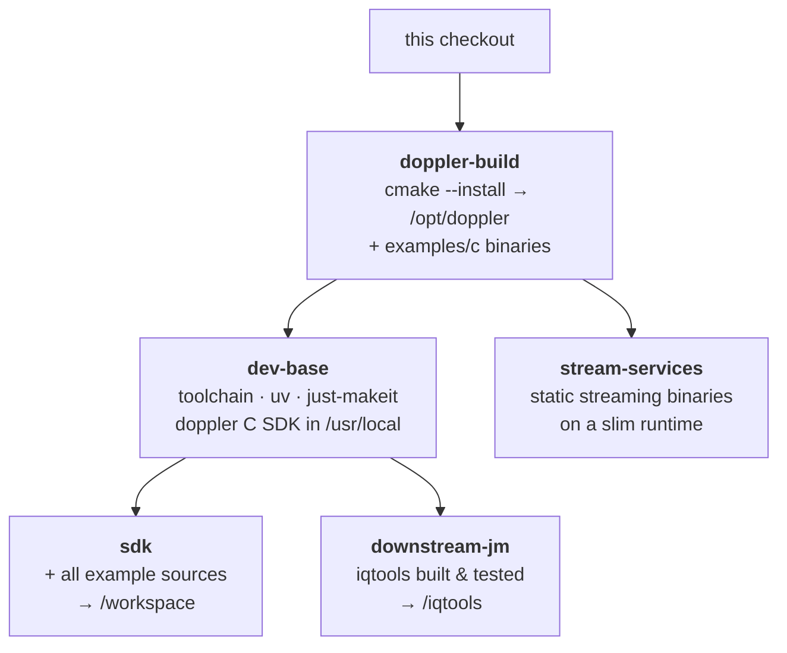

# doppler container images

One image per thing you'd actually do with doppler — **use** it, **build on**
it, or **deploy** its streaming services. Every docker build is driven through
the Makefile (the single driver — never a raw `docker build`):

| Image                         | For                                            | Dockerfile                                         | Built by                 | Published                         |
| ----------------------------- | ---------------------------------------------- | -------------------------------------------------- | ------------------------ | --------------------------------- |
| **`doppler`**                 | *using* doppler — CLIs + ~70 demos             | `Dockerfile.cli`                                   | release                  | `ghcr.io/doppler-dsp/doppler`     |
| **`doppler-sdk`**             | *building on* doppler — your own C/jm project  | `Dockerfile.examples` (`--target sdk`)             | `make docker-sdk`        | `ghcr.io/doppler-dsp/doppler-sdk` |
| **`doppler-downstream-jm`**   | the flagship worked example, pre-built + green | `Dockerfile.examples` (`--target downstream-jm`)   | `make docker-downstream` | local (CI-smoked)                 |
| **`doppler-stream-services`** | the `docker-compose` streaming pipeline        | `Dockerfile.examples` (`--target stream-services`) | `make docker-stream`     | local (via compose)               |
| **`stream_tool`**             | the k8s produce/consume deploy binary          | `Dockerfile`                                       | `deploy/` k8s flow       | in-cluster                        |

`make docker-examples` builds + smokes all three build-on-doppler images.

## Why one Dockerfile for three images

`Dockerfile.examples` compiles and *installs* this checkout's doppler **once**
in a shared `doppler-build` stage; every image copies from it, so all three are
version-locked to the same source — a downstream `find_package(doppler)`
resolves the very library built beside it, never a drifting pin.

- **sdk** / **downstream-jm** consume the *installed* doppler (the C SDK) and
    the doppler *Python* package from PyPI — the real downstream pattern (link the
    SDK, import the API). The C SDK is version-locked from source; the Python
    package floats at latest (a test-helper dependency).
- **stream-services** lifts the statically-linked `examples/c` streaming
    binaries straight out of the builder onto a slim base — no toolchain, no
    Python, ~116 MB.

## Files

| File                  | Role                                                 |
| --------------------- | ---------------------------------------------------- |
| `Dockerfile.cli`      | runtime "try it" image (wheel + demos)               |
| `Dockerfile.examples` | the shared-base multi-target build-on-doppler images |
| `Dockerfile`          | k8s `stream_tool` (produce/consume)                  |
| `stream_tool.c`       | its source                                           |
| `*-README.md`         | the in-image guide COPYed into each image            |

See [`docs/install/docker.md`](../../docs/install/docker.md) for the user-facing
walkthrough.
