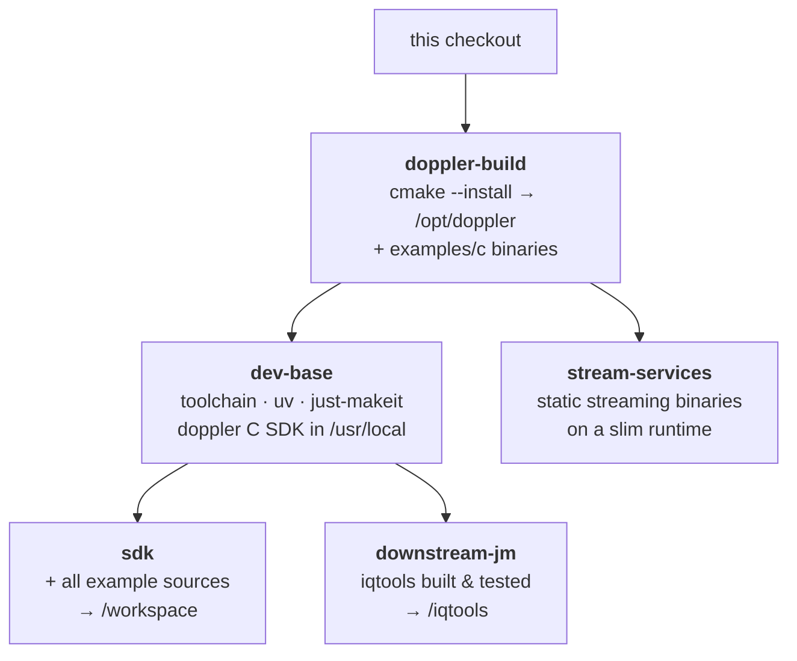

# doppler container images

One image per thing you'd actually do with doppler — **use** it, **build on**
it, or **deploy** its streaming services. Every docker build is driven through
the Makefile (the single driver — never a raw `docker build`):

| Image                         | For                                            | Dockerfile                                         | Built by                           | Published                                   |
| ----------------------------- | ---------------------------------------------- | -------------------------------------------------- | ---------------------------------- | ------------------------------------------- |
| **`doppler`**                 | *using* doppler — CLIs + ~70 demos             | `Dockerfile.cli`                                   | release                            | `ghcr.io/doppler-dsp/doppler`               |
| **`doppler-sdk`**             | *building on* doppler — your own C/jm project  | `Dockerfile.examples` (`--target sdk`)             | `make docker-sdk`                  | `ghcr.io/doppler-dsp/doppler-sdk`           |
| **`doppler-downstream-jm`**   | the flagship worked example, pre-built + green | `Dockerfile.examples` (`--target downstream-jm`)   | release / `make docker-downstream` | `ghcr.io/doppler-dsp/doppler-downstream-jm` |
| **`doppler-stream-services`** | the `docker-compose` streaming pipeline        | `Dockerfile.examples` (`--target stream-services`) | `make docker-stream`               | local (via compose)                         |
| **`stream_tool`**             | the k8s produce/consume deploy binary          | `Dockerfile`                                       | `deploy/` k8s flow                 | in-cluster                                  |

`make docker-examples` builds + smokes all three build-on-doppler images.

## The two images that are not images *of* doppler

| Image                  | For                                          | Dockerfile            | Built by                  | Published                        |
| ---------------------- | -------------------------------------------- | --------------------- | ------------------------- | -------------------------------- |
| **`doppler-glibc228`** | *gating* the glibc floor — a toolchain       | `Dockerfile.glibc228` | `make glibc-gate`         | never (local + CI)               |
| **`doppler-ci`**       | *running* CI — the toolchain every job needs | `Dockerfile.ci`       | `make ci-image` / nightly | `ghcr.io/doppler-dsp/doppler-ci` |

Every image in the first table bakes doppler *in*. These two bake nothing in:
they are a base plus a toolchain, and the checkout is bind-mounted into them.
The difference between them is which question they answer — one is about the
oldest glibc doppler supports, the other is about the environment its own
gates run in.

### `doppler-glibc228` — the floor

Debian 10 (glibc 2.28) plus a build toolchain. `make glibc-gate` bind-mounts
the checkout into it, builds out-of-tree into `build-glibc228/`, smoke-runs the
C examples, and points the existing `glibc-check` at the result.

It exists because `glibc-check` is pure inspection — it only means anything
against a build *made* on the floor. Until this image, that build could only
happen inside CI's job, so the answer arrived one push at a time. The apt and
cmake bootstrap that used to sit inline in `ci.yml` lives in the Dockerfile
now, and the job is a single `make glibc-gate` — the same command a laptop
runs.

### `doppler-ci` — the environment CI runs in

`ubuntu:24.04` (and `ubuntu:22.04`) plus the dependency groups from
`bootstrap.toml`. Every Linux CI job runs *inside* it, pinned by digest in
`.github/ci-images.env`, so no job provisions anything: the apt install it
replaced was ~112 MB per job across ten jobs, and it was the whole exposure to
mirror weather.

**It has no package list of its own.** It copies `bootstrap.toml` and runs the
same two `jbx install-deps` commands `make install-deps` and
`make install-docs-deps` run — the same reason `Dockerfile.examples` compiles
doppler once in a shared stage: one definition, so the image and a dev box
cannot drift apart.

Two bases, because `build-and-test` tests two glibcs (2.35 and 2.39) on
purpose. One image for both legs would leave that matrix naming two
environments while testing one. Neither answers the 2.28 floor — that is
`doppler-glibc228` above, and a modern base cannot answer a floor question.

Run it yourself; that is the point of pinning it:

```sh
make ci-shell                          # a shell in the pinned image
make ci-run TARGET='build test-rust'   # any goals, in CI's environment
make ci-gates                          # the whole gate set, in CI's environment
```

**On size.** It is ~2.3 GB, and what dominates is what CI genuinely uses:
llvm/clang for the coverage job (~500 MB) and the distro Rust for
`make test-rust` (~380 MB, `libllvm17t64` included — `libstd-rust-1.75` pulls
it). It was 3.17 GB until an entire rustup toolchain came out of it: 613 MB
carried only to work around a lockfile that had drifted to a format the distro
cargo cannot read (gh-887, now fixed at the source and held by
`make cargo-floor-check`).

Splitting it per job shape would shrink each pull further, and is deliberately
not done: container startup measures 25–30 s against the ~120 s apt install it
replaced, which does not buy back the cost of several images, several digests
and several pins. See [`docs/dev/ci.md`](../../docs/dev/ci.md) for pinning,
the nightly refresh, and the gates that watch CI itself.

## Why one Dockerfile for three images

`Dockerfile.examples` compiles and *installs* this checkout's doppler **once**
in a shared `doppler-build` stage; every image copies from it, so all three are
version-locked to the same source — a downstream `find_package(doppler)`
resolves the very library built beside it, never a drifting pin.



- **sdk** / **downstream-jm** consume the *installed* doppler (the C SDK) and
    the doppler *Python* package from PyPI — the real downstream pattern (link the
    SDK, import the API). The C SDK is version-locked from source; the Python
    package floats at latest (a test-helper dependency).
- **stream-services** lifts the statically-linked `examples/c` streaming
    binaries straight out of the builder onto a slim base — no toolchain, no
    Python, ~116 MB.

## Files

| File                  | Role                                                 |
| --------------------- | ---------------------------------------------------- |
| `Dockerfile.cli`      | runtime "try it" image (wheel + demos)               |
| `Dockerfile.examples` | the shared-base multi-target build-on-doppler images |
| `Dockerfile`          | k8s `stream_tool` (produce/consume)                  |
| `Dockerfile.glibc228` | Debian 10 build toolchain for the `glibc-gate` gate  |
| `Dockerfile.ci`       | the toolchain every Linux CI job runs inside         |
| `stream_tool.c`       | its source                                           |
| `*-README.md`         | the in-image guide COPYed into each image            |

See [`docs/install/docker.md`](../../docs/install/docker.md) for the user-facing
walkthrough.
