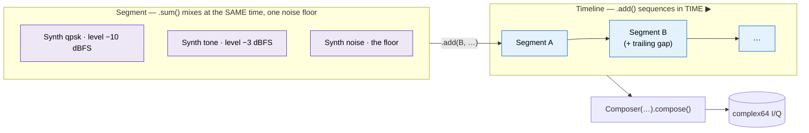

# Python Waveform Generator API — Synth / PN

Everything in the `doppler.wfm` package imports from one place — `from
doppler.wfm import …`. The two low-level generators are:

| Class   | Output                               | Use when                                                                   |
| ------- | ------------------------------------ | -------------------------------------------------------------------------- |
| `Synth` | CF32 — the five-type waveform engine | Generate tone / noise / PN / BPSK / QPSK, with optional LO offset and AWGN |
| `PN`    | uint8 — raw LFSR chips (0/1)         | Spreading / ranging codes, scrambling, test vectors                        |

`Synth` is also the unit of **composition** — pass synths into `Segment.sum`
to mix them (see [`compose`](#compose-multi-segment-composition-writers-and-a-zmq-sink) below).

Source:
[`src/doppler/wfm/__init__.py`](https://github.com/doppler-dsp/doppler/blob/main/src/doppler/wfm/__init__.py)

These same C cores back the one command-line tool, `wfmgen` — see the
[Waveform Generator guide](../guide/wfmgen.md).

______________________________________________________________________

## `Synth` — the five-type waveform engine

One declarative engine produces every waveform type, selected by the string
`type`. Construction takes keyword arguments mirroring the generator flags;
sensible defaults mean a bare `Synth()` is a clean, unit-power baseband tone.

```python
from doppler.wfm import Synth
import numpy as np

# Bare construct → clean baseband tone, unit power, no noise
x = Synth().steps(4096)            # complex64

# Tone at Fs/10 with 20 dB SNR
tone = Synth(type="tone", fs=1e6, freq=100_000, snr=20).steps(4096)

# Complex AWGN (unit power)
noise = Synth(type="noise", seed=7).steps(8192)

# PN / BPSK / QPSK — sps samples per chip/symbol
pn   = Synth(type="pn",   pn_length=7, sps=1).steps(127)
bpsk = Synth(type="bpsk", sps=8, snr=10).steps(8192)
qpsk = Synth(type="qpsk", sps=8, snr=10).steps(8192)

# Scalar (one sample at a time)
s = Synth(type="tone", freq=1000, fs=1e6).step()
```

### Clean vs noisy, baseband vs offset

`snr` is in dB. **`snr >= 100` (the default) is clean** — no AWGN is generated
at all, so a clean waveform pays no noise cost. Lower it to add noise.
**`freq = 0` (the default) is baseband** — the LO is skipped entirely.

```python
clean   = Synth(type="qpsk", sps=8, snr=100).steps(8192)   # no AWGN
noisy   = Synth(type="qpsk", sps=8, snr=12).steps(8192)     # Es/No 12 dB
offset  = Synth(type="pn", pn_length=9, sps=1, freq=2.5e5, fs=1e6).steps(511)
```

`snr_mode` (`"auto"`, `"fs"`, `"ebno"`, `"esno"`) sets how `snr` is
interpreted; `"auto"` uses over-`fs` for tone/noise/PN and Es/No for BPSK/QPSK.

### PN modulation: length, polynomial, realization

```python
# Auto-pick the maximum-length polynomial for the register length (2..64)
Synth(type="pn", pn_length=23, sps=1).steps(8192)

# Explicit 64-bit polynomial
Synth(type="pn", pn_length=40, pn_poly=0x800000001C, sps=1).steps(8192)

# Fibonacci realization (same polynomial/period, different chip ordering)
Synth(type="pn", pn_length=9, sps=1, lfsr="fibonacci").steps(511)
```

### Determinism

```python
s = Synth(type="qpsk", sps=4, seed=11)
a = s.steps(512)
s.reset()
assert np.array_equal(a, s.steps(512))   # same seed → identical stream
```

______________________________________________________________________

::: doppler.wfm.compose.Synth

______________________________________________________________________

## `PN` — raw LFSR m-sequence

A right-shift LFSR producing one bit (0/1) per call. With a primitive
polynomial it is a **maximum-length sequence**: period `2**n - 1` with
`2**(n-1)` ones per period. Registers up to **64 bits** are supported, in
either the **Galois** (internal-XOR, default) or **Fibonacci** (external-XOR)
realization — both realize the same polynomial and period.

```python
from doppler.wfm import PN
import numpy as np

# Length-7 MLS (primitive polynomial 0x41), one full period
chips = np.asarray(PN(0x41, 1, 7).generate(127))   # uint8, 64 ones / 63 zeros

# Fibonacci realization of the same polynomial
fib = np.asarray(PN(0x41, 1, 7, lfsr="fibonacci").generate(127))

# 64-bit register
big = np.asarray(PN(0x800000001C, 1, 40).generate(50_000))

# Deterministic replay
p = PN(0x41, 1, 7)
a = np.asarray(p.generate(127)).copy()
p.reset()
assert np.array_equal(a, np.asarray(p.generate(127)))
```

The constructor is `PN(poly, seed, length, lfsr="galois")`. `seed` must be
non-zero (the all-zero register is a fixed point). To map chips to ±1 BPSK
symbols, use `Synth(type="pn", ...)` instead, which also handles oversampling,
the LO, and AWGN.

______________________________________________________________________

::: doppler.wfm.PN

______________________________________________________________________

## `compose` — multi-segment composition, writers, and a ZMQ sink

The composition layer is the Python face of the C `wfmgen` composer
subsystem — the same engine behind the `wfmgen` CLI, output byte-identical for
the same parameters. There are two composition verbs:

- **`Segment.sum(*synths, num_samples=…)`** *mixes* synths at the same time over
  one resolved noise floor (a multi-source scene);
- **`Segment.add(*segments)`** *sequences* segments in time (a timeline).

The ladder is **`Synth` → (`.sum`) → `Segment` → (`.add`) → `Timeline` →
`Composer` → samples**: `.sum` stacks synths in the *same* time window (one
column), `.add` lays segments out along *time* (one row).



A `Composer` turns a `Segment` / `Timeline` / segment-list into samples,
optionally looping (`repeat`) or running forever (`continuous`); `Writer`
serialises to the four containers (raw / CSV / BLUE type-1000 / SigMF), and
`ZmqSink` publishes over ZeroMQ. The resolved spec round-trips through JSON, so a
capture is fully reproducible.

```python
import numpy as np
from doppler.wfm import Composer, Segment, Writer, mls_poly, qpsk, tone
from doppler.wfm import read_iq

# Mix: a QPSK signal of interest under a CW interferer, one noise floor.
scene = Segment.sum(
    qpsk(snr=15, sps=8, level=-10),       # builders return Synth
    tone(freq=2e5, level=-3),
    num_samples=65536,
)

# Sequence: a PN preamble, then the scene, back-to-back in time.
timeline = Segment("pn", num_samples=127, pn_length=7).add(scene)
iq = Composer(timeline).compose()         # one complex64 array

# Or stream block-by-block (an empty block marks the end):
c = Composer(timeline)
with Writer("frame.cf32", sample_type="cf32") as w:
    while len(blk := c.execute(4096)):
        w.write(blk)
back = read_iq("frame.cf32", "cf32")      # zero-copy complex64 view

# Reproducible: the resolved spec serialises to JSON and back.
j = Composer(timeline).to_json()
assert np.array_equal(Composer.from_json(j).compose(), iq)

# Utilities
mls_poly(7)                               # 0x41 — the length-7 MLS polynomial
```

The builders `tone()` / `bpsk()` / `qpsk()` / `pn()` / `noise()` each return a
`Synth` (a `noise(level=…)` is a bare AWGN floor at that level in dBFS); or
construct `Synth(...)` directly. In a `Segment.sum` the per-synth `snr` resolves
into one shared noise floor, and each synth's `level` (dBFS) sets its share.

`Reader` is the **dual of `Writer`** — it reads a capture back to `complex64`,
auto-detecting the container (BLUE magic / `.sigmf-meta` sidecar / `.csv` / raw)
and recovering `fs`/`fc`/sample type from BLUE and SigMF metadata. All parsing
and conversion is in C:

```python
from doppler.wfm import Composer, Writer, Reader

Composer(type="qpsk", sps=8, num_samples=4096).compose()  # ... write it ...
with Reader("capture.blue") as r:          # container auto-detected
    print(r.file_type, r.fs, r.num_samples)
    x = r.read_all()                        # or block-wise: r.read(4096)
```

For a quick raw-only read with no object, [`read_iq`](#read_iq) still works;
`Reader` is the full container-aware dual. `Writer` pairs with `read_iq` or
`Reader`; for SigMF, pair a `Writer(..., file_type="sigmf")` data file with
`sigmf_meta(...)`, and for detached BLUE use `write_blue_header(...)`. The
`ZmqSink` is POSIX-only. DSP
helpers `rrc_taps(beta, sps, span)` and `dsss_spread(syms, code, sf)` expose the
pulse-shaping and spreading primitives.

`SampleClock` (POSIX) paces and timestamps a stream against an ideal `fs`-Hz
clock — the same C core behind the `wfmgen --realtime` CLI flag. Use it to
throttle a producer to real time and to tag blocks with their ideal timestamp:

```python
from doppler.wfm import Composer, SampleClock, ZmqSink

# Stream at the true 1 MS/s instead of as fast as possible.
comp = Composer(type="qpsk", sps=8, continuous=True)
clk = SampleClock(fs=1e6)
with ZmqSink("tcp://0.0.0.0:5555") as sink:
    while True:
        blk = comp.execute(4096)
        ts = clk.stamp()              # ideal ns timestamp of this block
        sink.send(blk, fs=1e6, fc=0.0)
        clk.pace(len(blk))            # sleep to epoch + n/fs (GIL released)
```

The schedule is drift-free (deadlines come from the cumulative sample count, not
summed sleeps); underruns are counted in `clk.underruns` / `clk.max_lateness`,
and `SampleClock(fs, resync=True)` re-anchors to "now" on each underrun.

### Classes

::: doppler.wfm.compose.Composer

::: doppler.wfm.compose.Segment

::: doppler.wfm.compose.Timeline

::: doppler.wfm.compose.Writer

::: doppler.wfm.compose.Reader

::: doppler.wfm.compose.ZmqSink

::: doppler.wfm.compose.SampleClock

### Module-level helpers

::: doppler.wfm.compose.sigmf_meta

::: doppler.wfm.compose.write_blue_header

::: doppler.wfm.compose.rrc_taps

::: doppler.wfm.compose.dsss_spread

::: doppler.wfm.compose.mls_poly
