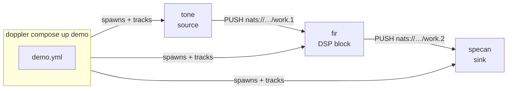

# Architecture

Doppler is a stack of four layers. Each layer is independently
useful; together they take you from raw DSP primitives to a
running multi-process signal pipeline in a handful of commands.

<div style="max-width: 540px; margin: 2em auto; font-size: 0.9em; line-height: 1.4;">
  <div style="border: 2px solid currentColor; padding: 0.6em 1em; text-align: center; border-bottom: none;">Apps &amp; Tools — specan, your own sinks &amp; UIs</div>
  <div style="border: 2px solid currentColor; padding: 0.6em 1em; text-align: center; border-bottom: none;">Pipeline CLI — doppler compose (YAML + Dopplerfile)</div>
  <div style="border: 2px solid currentColor; padding: 0.6em 1em; text-align: center; border-bottom: none;">Transport — NATS streaming (PUSH/PULL, PUB/SUB)</div>
  <div style="border: 2px solid currentColor; background: var(--md-primary-fg-color); color: var(--md-primary-bg-color);">
    <div style="padding: 0.6em 1em; text-align: center; border-bottom: 1px dashed var(--md-primary-bg-color);">DSP Library — C99 core, dozens of modules (NCO, FIR, FFT, DDC, Resampler, AGC, DSSS, tracking loops, and more)</div>
    <div style="display: flex;">
      <div style="flex: 1; padding: 0.6em 1em; text-align: center; border-right: 1px dashed var(--md-primary-bg-color);">Python (thin ctypes)</div>
      <div style="flex: 1; padding: 0.6em 1em; text-align: center;">Rust FFI (safe wrap)</div>
    </div>
  </div>
</div>

______________________________________________________________________

## Layer 1 — DSP Library (C99 core)

The entire algorithm library lives in one portable C99 library, across
dozens of modules — NCO, FIR, FFT, DDC, polyphase resampler, ring buffers, AGC,
DSSS acquisition/despreading, carrier/symbol tracking loops, and more —
each implemented once, tested once, and callable from any language
through the `dp_*` C ABI.

**Language bindings are thin wrappers over this ABI.** The Python
`doppler` package and the Rust FFI crate both call the same C
functions. There is no Python reimplementation of the NCO, no Rust
port of the FIR engine — just glue: type conversion, error
translation, memory lifetime.

See the [API reference](c-api/files.md) for the full C API.

______________________________________________________________________

## Layer 2 — Transport (NATS streaming)

`stream/stream.h` adds a NATS-backed wire protocol on top of the DSP
library. It defines one header struct (`dp_header_t`), one magic
value (`SIGS`), and three messaging patterns, each addressed by a
`nats://host:port/subject` endpoint:

| Pattern       | Use                                                                              |
| ------------- | -------------------------------------------------------------------------------- |
| **PUSH/PULL** | Unidirectional pipeline — source → block → sink (NATS JetStream work-queue tier) |
| **PUB/SUB**   | Fan-out — one source, many subscribers (NATS core pub/sub)                       |
| **REQ/REP**   | Request/response — configuration, queries (NATS request/reply)                   |

Every block speaks the same framing format. A C transmitter can
push to a Python subscriber and vice versa. The transport is
optional — if you only need the DSP primitives, skip it entirely. It
requires a running `nats-server` (e.g. `nats-server -js`) to connect
to.

See [API: Streaming](api/python-streaming.md).

______________________________________________________________________

## Layer 3 — Pipeline CLI (`doppler compose`)

`doppler compose` is a process orchestrator that wires blocks into
pipelines using the streaming transport. You describe a chain in
a YAML file (or generate one with `compose init`); `compose up`
assigns NATS subjects, spawns each block as an independent OS
process, and tracks their state.

```sh
doppler compose init tone fir specan --name demo
doppler compose up demo
doppler ps
doppler compose down demo
```

Custom blocks are defined in a **Dopplerfile** — a small YAML file
that names an entry-point function and its dependencies. No C
required; any Python (or compiled binary) that pulls frames from an
upstream NATS subject and pushes them to a downstream one qualifies
as a block.

See [CLI & Pipelines](cli/index.md) and [Dopplerfile](cli/dopplerfile.md).

______________________________________________________________________

## Layer 4 — Apps & Tools

**Spectrum analyzer (`doppler-specan`)** is a first-class app built
on the streaming layer. It runs as a pipeline sink, reads IQ frames
from a NATS PULL subject, computes FFT magnitude, and serves a live
web UI. Because it speaks the same wire format as every other block,
it snaps onto any compose pipeline as a final stage — or runs
standalone against any `dp_pub_t` source. Either way it needs a
running `nats-server` (e.g. `nats-server -js`) to connect to.

```sh
# As a compose sink
doppler compose init tone specan --name view

# Or wire it into your own pipeline
doppler-specan --source pull --address nats://127.0.0.1:4222/work
```

See [Spectrum Analyzer](specan/index.md).

______________________________________________________________________

## A complete flow



The compose runner is the only process that knows the full
topology. Each block only knows its upstream PULL subject and
downstream PUSH subject — the C library does the actual signal
processing, and NATS moves the frames between them.
