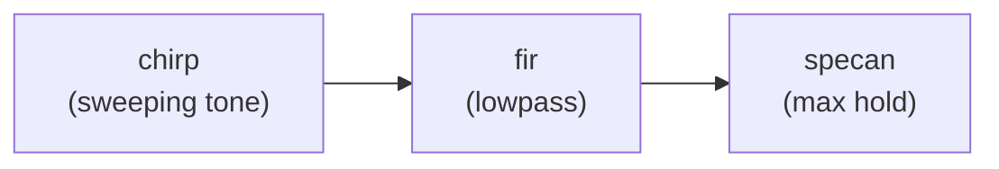

# Dopplerfile

A **dopplerfile** is a small YAML file that registers a custom
pipeline block without writing Python. Drop it next to your script
and `doppler compose init` picks it up automatically — no registry
edits, no `__main__.py` changes, no `pyproject.toml` changes.

---

## Minimal example

```yaml
# chirp.yml
name: chirp
role: source
executable: ./chirp.py
config:
  sample_rate: 2048000.0
  sweep_rate:  50000.0
  tone_power:  -20.0
  noise_floor: -90.0
```

```sh
# That's it — just works
doppler compose init chirp specan
doppler compose up
```

---

## Field reference

| Field | Required | Description |
|-------|----------|-------------|
| `name` | yes | Block name used in `doppler compose init` |
| `role` | yes | `source`, `chain`, or `sink` |
| `executable` | yes | Script or binary to run (see [Resolution](#executable-resolution)) |
| `config` | no | Default parameter values (any scalars, lists, or bools) |
| `args` | no | Explicit flag mapping (see [Arg mapping](#arg-mapping)) |
| `dependencies` | no | Python packages to install in an isolated env |

---

## Executable resolution

`executable` follows standard shell resolution:

| Value | Resolved as |
|-------|-------------|
| `doppler-chirp` | Searched on `PATH` (e.g. after `pip install`) |
| `./chirp.py` | Relative to the working directory |
| `/home/user/scripts/chirp.py` | Absolute path |

If the executable is not found, Doppler raises a clear error at
`compose up` time — not silently at scaffold time.

---

## Arg mapping

### Auto-map (default)

When `args:` is omitted, Doppler auto-maps everything by convention:

- **source / chain** → `--bind {output_addr}`
- **chain / sink** → `--connect {input_addr}`
- Each `config` field → `--{field-with-dashes} value`
  - Lists and dicts are JSON-encoded: `--taps '[]'`
  - `true` becomes a bare flag: `--verbose`
  - `false` is omitted entirely

Example — `sample_rate: 2048000.0` with `role: source` produces:

```sh
./chirp.py --bind tcp://127.0.0.1:5600 --sample-rate 2048000.0 ...
```

### Explicit mapping

For scripts that use non-standard flag names, add an `args:` section
with `{placeholder}` substitution:

```yaml
args:
  output:  "{output_addr}"
  rate:    "{sample_rate}"
  freq:    "{sweep_rate}"
```

Available placeholders: `{output_addr}`, `{input_addr}`, and any
config field name. When `args:` is present, auto-map is disabled
entirely — you control every flag.

---

## Dependency isolation

Declare Python packages under `dependencies:` and Doppler wraps the
block with `uv run --with` at spawn time — an isolated, cached
environment with no global installs required:

```yaml
name: chirp
role: source
executable: ./chirp.py
dependencies:
  - numpy
  - scipy
config:
  sample_rate: 2048000.0
  sweep_rate:  50000.0
```

`uv` caches environments by dependency set — first run installs,
subsequent runs are instant. No cleanup needed between chains.

---

## Discovery order

`doppler compose init <name>` searches for a dopplerfile in this
order:

1. **Built-in registry** — `tone`, `fir`, `specan`
2. **`~/.doppler/blocks/<name>.yml`** — user's installed blocks
3. **`./<name>.yml`** — project-local, next to your script

Place the dopplerfile in your project directory for one-off scripts.
Copy it to `~/.doppler/blocks/` to make it available everywhere.

---

## Full example — FIR-filtered chirp sweep

```
my-project/
  chirp.py           # source: sweeping tone via ZMQ PUSH
  chirp.yml          # dopplerfile
```

```yaml
# chirp.yml
name: chirp
role: source
executable: ./chirp.py
dependencies:
  - numpy
config:
  sample_rate: 2048000.0
  sweep_rate:  50000.0
  tone_power:  -20.0
  noise_floor: -90.0
```

```sh
# Scaffold: chirp → FIR → specan
doppler compose init chirp fir specan --name filter-test

# Edit filter-test.yml: set fir.taps to your lowpass coefficients
# Then start:
doppler compose up filter-test

# Watch the chirp paint the filter response via max-hold in the specan
```


