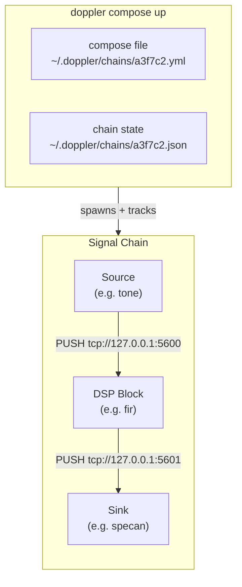
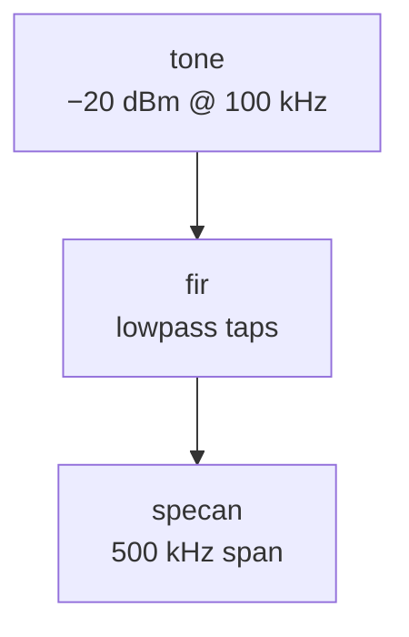

# doppler CLI

`doppler-cli` is a pipeline orchestrator for doppler signal processing
chains. It lets you wire sources, DSP blocks, and sinks together with
a single command — or a declarative compose file — and manages the
lifetime of every process.

Install:

```sh
pip install doppler-cli
```

---

## Quick start

```sh
# Scaffold a tone → specan chain and start it
doppler compose init tone specan
doppler compose up ~/.doppler/chains/<ID>.yml

# One-shot: scaffold and start in two lines
doppler compose init tone fir specan
doppler compose up $(ls -t ~/.doppler/chains/*.yml | head -1)

# Check what's running
doppler ps

# Tear it down
doppler stop <ID>
```

---

## Architecture

Each block in a pipeline runs as an independent OS process. Blocks
exchange IQ samples over ZMQ **PUSH/PULL** sockets. The compose runner
assigns ports, spawns processes, and tracks their state in
`~/.doppler/chains/`.



**Socket convention:** every block **binds its output** and **connects
its input**. Sources bind only. Sinks connect only.

```
source   →  binds   PUSH  :5600
fir      →  connects PULL :5600,  binds PUSH :5601
specan   →  connects PULL :5601
```

---

## Compose file

`doppler compose init <BLOCKS...>` scaffolds a fully-resolved compose
file with all defaults and auto-assigned ports filled in.

```yaml
id: a3f7c2

source:
  type: tone
  sample_rate: 2048000.0
  center_freq: 0.0
  tone_freq: 100000.0
  tone_power: -20.0
  noise_floor: -90.0
  port: 5600          # output port this block binds

chain:
  - fir:
      taps: []
      port: 5601      # output port this block binds

sink:
  type: specan
  mode: web        # terminal mode requires a foreground TTY; use web in pipelines
  center: 0.0
  span: null
  rbw: null
  level: null
  web_port: 8080
```

Ports default to auto-assigned from the range `5600–5700`. Specify
them explicitly to pin a chain to fixed addresses.

---

## Commands

### Chain lifecycle

| Command | Description |
|---------|-------------|
| `doppler ps` | List all running chains with status and uptime |
| `doppler stop <ID>` | Graceful shutdown (SIGTERM all block processes) |
| `doppler kill <ID>` | Immediate shutdown (SIGKILL all block processes) |
| `doppler inspect <ID>` | Print resolved config, PIDs, and port assignments |
| `doppler logs <ID> [--block NAME]` | Stream stdout/stderr from a chain or block |

### Compose

| Command | Description |
|---------|-------------|
| `doppler compose init <BLOCKS...>` | Scaffold a compose file with defaults |
| `doppler compose init <BLOCKS...> --out FILE` | Write to a specific path |
| `doppler compose up <FILE>` | Spawn all blocks described in FILE |
| `doppler compose down <ID>` | Stop a running chain (alias for `stop`) |

---

## Block catalog

### `tone` — synthetic source

Generates a calibrated complex tone plus AWGN. Good for validating
filter frequency response before connecting a real IQ source.

| Field | Default | Description |
|-------|---------|-------------|
| `sample_rate` | `2048000.0` | Output sample rate (Hz) |
| `center_freq` | `0.0` | Nominal center frequency (Hz, metadata) |
| `tone_freq` | `100000.0` | Tone offset from DC (Hz) |
| `tone_power` | `-20.0` | Tone power (dBm) |
| `noise_floor` | `-90.0` | AWGN floor (dBm) |

---

### `fir` — FIR filter

Applies a real FIR filter to the IQ stream. Design taps with
`doppler.polyphase` or any standard tool.

| Field | Default | Description |
|-------|---------|-------------|
| `taps` | `[]` | Filter coefficients (passthrough if empty) |

Example — design a 101-tap lowpass and use it in a chain:

```python
from doppler.polyphase import design_lowpass
taps = design_lowpass(cutoff=0.1, numtaps=101).tolist()
```

Then set `taps` in the compose file, or patch it:

```sh
doppler compose init tone fir specan --out chain.yml
# edit chain.yml: set fir.taps: [...]
doppler compose up chain.yml
```

---

### `specan` — spectrum analyzer sink

Displays the spectrum of the incoming IQ stream. Connects to the
`doppler-specan` terminal or web UI.

| Field | Default | Description |
|-------|---------|-------------|
| `mode` | `"terminal"` | `"terminal"` or `"web"` |
| `center` | `0.0` | Center frequency (Hz) |
| `span` | `null` | Display span (Hz); defaults to full bandwidth |
| `rbw` | `null` | Resolution bandwidth (Hz) |
| `level` | `null` | Reference level, top of display (dBm) |
| `web_port` | `8080` | HTTP port for web mode |

---

## Typical workflows

### Measure a filter's frequency response

```sh
doppler compose init tone fir specan --out filter_test.yml
# Edit filter_test.yml:
#   fir.taps: [<your taps>]
#   specan.span: 500000
doppler compose up filter_test.yml
```



### Connect a real IQ source

Replace `tone` with any ZMQ publisher emitting doppler-framed IQ:

```yaml
source:
  type: socket
  address: tcp://192.168.1.10:5555
```

!!! note
    A `socket` source block is planned for a future release. In the
    meantime, run `doppler-specan --source socket --address <addr>`
    directly to attach the spectrum analyzer to an existing publisher.

---

## State files

Running chain state is persisted in `~/.doppler/chains/`:

```
~/.doppler/chains/
  a3f7c2.yml    # compose file (copy written by init)
  a3f7c2.json   # live state: PIDs, ports, start time
```

`doppler stop` and `doppler kill` remove the `.json` file on
completion. Orphaned `.json` files from crashed chains can be removed
manually or with `doppler stop <ID>` (gracefully handles dead PIDs).

---

## Port allocation

Ports are auto-assigned from the range `5600–5700` by scanning
existing state files for in-use ports. The base port is configurable:

```yaml
# ~/.doppler/config.yml
base_port: 5700
```

To pin ports explicitly, set `port:` on the `source` and each `chain`
block in the compose file. Pinned ports are used as-is; no allocation
is performed.
