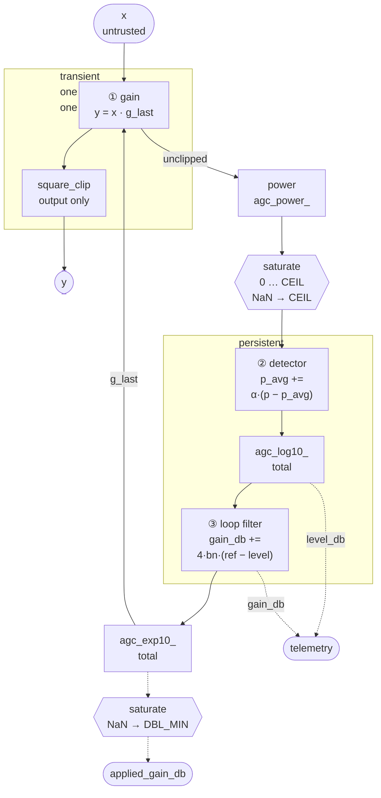

# Automatic Gain Control

An AGC holds the average power of a stream at a reference level so that
everything downstream can be built for one amplitude. In doppler it is the
element that makes a timing detector's construct-time slope mean what it
says, and it is **first in the chain** — which is the property that matters,
and a stronger one than being the slowest loop. This page is the **why**:
what the loop is for, which of its conventions are load-bearing, what it is
guaranteed to do under any input, and — the part that took measurement
rather than reading — what it cannot know.

The contract itself lives in `native/inc/agc/agc_core.h`, and the C-level
evidence in `native/tests/test_agc_core.c`. This page does not restate
either; it explains the reasoning they assume.

Related: [MPSK Receiver](mpsk.md), [Telemetry](telemetry.md),
[Quantization](QUANTIZATION.md), [The NCO](nco.md).

**Status.** Sections 1–4 and 7 describe the shipped object; §4's guard is
implemented and every mechanism in it is pinned by a sabotage-proven C test.
Section 5 is **open design** — a problem statement with measurements and no
chosen answer. Section 6 records a claim the header made that measurement
did not support, and §4.4 a change proposed but not made.

______________________________________________________________________

## 1. What it is for

One question, asked once per sample: **how much gain must this stream be
given so that its average power sits at the reference?**

That sounds like a convenience and it is not. Two consumers depend on the
answer, and they depend on it differently:

- **A timing error detector** normalises by its own slope, and that slope is
    a construct-time constant computed for a unit-amplitude symbol stream.
    Amplitude enters the raw error as `A²` (Gardner) or `A` (DTTL), so a 4×
    level error is a 16× loop-gain error. The detector cannot discover this;
    it has no other reference.
- **A carrier discriminator** normalises by its own `|z|^M` and is
    scale-invariant, so it does not care about the level — but it does see
    the AGC's *dynamics*, because a gain that moves is a gain that modulates
    the constellation it is trying to lock to.

Serving both is why the loop's bandwidth is sized against both, and why
there is exactly **one** AGC per receiver rather than one per detector. Two
level loops in series correct each other's excursions and integrate against
each other; the argument and its measurements live in
[MPSK Receiver](mpsk.md).

______________________________________________________________________

## 2. Theory of operation

Three stages run per sample:

```text
  1. Gain         y = x · 10^(gain_db/20)
  2. Detector     p_avg += alpha · (|y|² − p_avg)
  3. Loop filter  gain_db += (4·loop_bw) · (ref_db − 10·log10(p_avg))
```

Drawn out, with the guards of §4 in place and the one boundary that matters
marked:



The two hexagons are the guards; everything else is signal or control flow.

The diagram's one load-bearing feature is the **subgraph boundary**. Stage ①
is transient: a bad sample makes one bad output sample and is forgotten. The
detector is where an input first becomes *persistent* state, and everything
after it — the measured level, the integrator, the applied gain — is a
function of `p_avg`. That is why there is a single guard on that edge rather
than a clamp at each stage, and §4 is the measurement behind it.

The two `agc_log10_` / `agc_exp10_` boxes are not a second safety layer;
they are the primitives keeping their own contracts, so that a *future*
caller cannot reach the failure the guard now makes unreachable here.

### 2.1 The loop filter is linear in dB, and that is the whole design

Both the control variable and the error are in decibels, so the closed loop
is a linear first-order recursion:

```text
  gain_db[n+1] = (1 − 4·loop_bw)·gain_db[n] + (4·loop_bw)·(ref_db − px_db[n])
```

Two properties follow, and both are load-bearing:

- **The time constant is `1/(4·loop_bw)` samples**, expressed as a
    normalised noise-equivalent bandwidth rather than a bare loop gain,
    because a first-order loop with integrator step `mu` has noise bandwidth
    `mu/4`. One number then means one loop at every sample rate.
- **Correction time is proportional to the error in dB, not to the ratio.**
    A 60 dB correction costs 60/(4·loop_bw·…) — linear in dB. This is why a
    railed gain is not a catastrophe: recovery from 200 dB of error at the
    default bandwidth is ~100 samples, not an unbounded stall. It is also
    why Section 4's saturation is affordable.

§6 is about the part of this that is **not** true of the object as built.

### 2.2 The detector stays in the power domain, deliberately

The obvious symmetry — put the detector in dB too, and have one log-domain
loop — is wrong, and quietly so.

An EMA in dB is a **geometric** mean of the power; an EMA in power is an
**arithmetic** mean. For a fluctuating envelope these differ by a bias that
depends on the envelope's distribution (for a Rayleigh magnitude the
geometric mean sits below the arithmetic one by a constant of order a few
dB). Moving the detector would therefore silently redefine what `ref_db`
means, differently for a CW tone, a shaped PSK stream, and noise — with no
error anywhere to say so.

So the split is: **the detector measures in power, the filter integrates in
dB**, and the `log10` between them is the only place the two meet. That one
conversion is where §4's guarantees have to live, precisely because it is
the boundary.

### 2.3 Feedback, and one sample of latency

Power is measured **after** the gain, so the gain applied to sample `n` is
computed from samples up to `n−1`. `gain_db` is therefore the loop's
*command* and `agc_get_applied_gain_db()` is what the signal actually saw;
they differ by one update and converge to the same value. Two accessors,
because "what is the loop asking for" and "what did this sample get" are
different questions and only the second explains an output.

### 2.4 The block form is a first-order hold, not a staircase

`agc_steps()` runs the detector and filter once per chunk of `decim`
samples, but interpolates the applied gain **linearly across the chunk** so
there is no inter-chunk step. Measured on a hot input at `decim = 8`, the
first commanded chunk ramps 0.983485 → 0.867881 in eight exactly equal
increments, and continues across the boundary without a discontinuity.

The per-chunk detector and filter coefficients are rescaled from `alpha` and
`loop_bw` internally, so both keep their per-sample meaning and a caller
does not retune when changing `decim`. Measured at `decim` 8/16/32 the gain
trajectories track each other sample-for-sample, not merely to the same
endpoint. The standing precondition is `loop_bw ≪ 1/(4·decim)`; past that
the decimated loop is sampling its own transient.

`agc_step()` carries the same idea on the streaming path as
`gain_update_period`: the detector and gain-apply run every sample while the
filter command refreshes once per period, amortising the transcendentals.
Measured at P = 1/8/32 the converged gain agrees to 2e-4 dB.

______________________________________________________________________

## 3. Where it sits in a receiver

The AGC is **pre-terminal**: after integer decimation, before the matched
filter, inside the front-end cascade. That position is chosen, not
incidental — it is upstream of the stage the timing loop steers, so the
AGC's bandwidth is never coupled to a loop stretching the symbol grid
underneath it.

Two consequences a caller sees:

- Its telemetry is **not on the symbol grid**. `agc.gain_db` and
    `agc.level_db` are emitted per gain-update event; compare them against
    loop records by time, never by index.
- It is **first in the chain**, and its error is the one kind no downstream
    loop can correct. §3.1 is why that, rather than any bandwidth ordering,
    is the property to reason from.

### 3.1 First in line, not necessarily slowest

It is tempting to say the AGC is the slowest loop and therefore sets how
long a receiver takes to become usable. That is **not a property of this
object**, and it is worth being precise about what is:

- **The AGC constrains its own `loop_bw` not at all.** A caller may build
    one at any bandwidth; nothing here refuses.
- **One composition makes it slowest, deliberately.** `MpskReceiver`
    derives `bn_agc = bn_agc_ratio · min(bn_carrier, bn_timing)` and
    validates `bn_agc_ratio ∈ (0, 1)` at construction, so within that
    receiver the AGC is slower than either loop it feeds — because an AGC
    approaching the bandwidth of a loop it feeds begins correcting the
    excursions that loop is itself producing, and the two integrate against
    each other. That is a choice of that composition, for that reason, not
    a fact about AGCs.
- **Slowest would not imply longest anyway.** Settling time is set by the
    bandwidth *and* by how far the level starts from the reference — and the
    initial level error is exactly what is unknown at construction. An AGC
    handed an already-correct level settles instantly while the carrier loop
    is still pulling in; the same AGC handed a 60 dB error dominates
    everything. Which case applies is a property of the link, not the design.

**What is unconditional is position.** Everything downstream sees the AGC's
output, and a level error is not self-correcting further along:

- An **amplitude-sensitive** detector — a TED normalising by its own
    construct-time slope — takes a level error as a *loop-gain* error, `A²`
    for Gardner and `A` for DTTL. It has no other reference and cannot
    discover the discrepancy.
- A **scale-invariant** detector — the carrier discriminator normalising by
    its own `|z|^M` — is immune to the level but still sees the AGC's
    *dynamics*, because a gain that moves modulates the constellation it is
    trying to lock to.

So the AGC's influence is positional and structural. It is upstream of every
amplitude-sensitive decision in the receiver, and until it is settled those
decisions are being made at the wrong gain — whatever the bandwidth ordering
happens to be.

`level_db` is the zero-referenced one: it is the loop's *input*, driven to
`ref_db`, so convergence is readable from the trace alone. `gain_db` settles
to an offset that depends on how loud the input happened to be and cannot be
judged without knowing it.

______________________________________________________________________

## 4. The loop is total

The governing requirement, and the one this page exists to state:

> **No sequence of inputs may leave the AGC in a state from which it cannot
> recover.** Not "no reasonable sequence" — no sequence.

An AGC is the first element in a chain and takes whatever the front end
hands it. It cannot assume its input is well-formed, and it is the one
object whose failure is silent: a corrupted gain does not crash, it
multiplies.

Two independent paths violated this, both measured on the shipped object
before the guard existed. §4.1 and §4.2 are those measurements — kept in the
past tense they were taken in, because the numbers are what justify the
guard's shape and a repaired object cannot re-derive them.

### 4.1 Silence winds the integrator until the arithmetic breaks

With no signal the detector decays to the power floor, the filter reads a
constant `+300 dB` error and integrates it forever at `4·loop_bw·300` ≈ 3 dB
per sample. Nothing bounds it.

At `gain_db ≈ 6170` the fast `agc_exp10_` crosses the range where its
exponent assembly is valid and overflows **into the sign bit**, returning a
*negative* gain. The output then goes non-finite, `p_avg` follows, and
`agc_log10_` — which reads a NaN's exponent field as an ordinary number —
answers with `+308` instead of NaN. The loop now integrates against a
fabricated `+3084 dB` level, in the other direction, forever.

Measured at the default settings, feeding exact zeros:

| after                                                   | state                                                                  |
| ------------------------------------------------------- | ---------------------------------------------------------------------- |
| 833 samples                                             | `p_avg` is NaN                                                         |
| 3000 samples                                            | `gain_db = −66095`                                                     |
| a returning unit-amplitude signal, 200000 samples later | output railed at the clip level, `gain_db = −6.2e6`, `p_avg` still NaN |

`agc_steps()` fails identically, so it is not a per-sample-path quirk. The
degradation is graded and then cliffs:

| silent gap     | samples to recover |
| -------------- | ------------------ |
| 100            | 196                |
| 400            | 113                |
| 700            | 5426               |
| 800 and beyond | never              |

800 samples is 100 symbols at 8 samples per symbol.

The header's defence — *"never reached in normal operation, `p_avg` is
seeded with the reference power at create/reset"* — is true of the seed and
says nothing about the steady state. A stream gap, a muted source, or a
receiver started on a zero-filled buffer all reach it.

### 4.2 One non-finite sample is permanent

Independent of the above, and faster: a **single** `Inf` or `NaN` input
sample drives `p_avg` non-finite, and it never returns — a following normal
sample leaves `p_avg` NaN. One bad sample from upstream, an uninitialised
buffer, a garbage file, and the AGC is dead for the rest of the run.

Bounding the integrator does not help this path at all, which is why the
answer is two bounds and not one.

### 4.3 One guard, at the boundary

**The detector's input is made total, and that is the whole safety fix.**
Every power reaching the EMA goes through `saturate` into
`[0, AGC_POWER_CEIL]`. The ceiling is derived, not chosen: the largest
`|y|²` a finite float32 pair can produce is **2.32e77**, comfortably inside
double, so `p_avg` can only go non-finite if `y` did. Measured confirmation
that nothing more is needed on this axis: inputs of 1e19, 1e20 and 3e19 —
enormous but finite — already leave `p_avg` finite at 7.5e36, 7.3e38 and
6.6e37.

`p_avg` guarded is a convex combination of a finite `p_avg` and a saturated
`p`, so it cannot leave the interval once it starts inside — which
`agc_create()` and `agc_reset()` guarantee by seeding it with the reference
power.

**The primitives keep their own contracts.** `agc_exp10_` saturates rather
than sign-flipping past its exponent range, and `agc_log10_` saturates its
argument rather than answering a non-finite one with a plausible number.
With the guard in place both are unreachable *from here* — but a primitive
whose contract holds only because of its callers is a trap for the next
caller. Within their working range both are honest: swept over 30 decades,
`agc_exp10_`'s worst relative error is **7.5e-4** and `agc_log10_`'s worst
absolute error is **7.8e-4**, against a documented ~1e-3.

**One accessor needed the same treatment.** State being total is not the
same as everything *derived* from it being total:
`agc_get_applied_gain_db()` returned `20·log10(0) = −INF` once an extreme
commanded gain underflowed `g_last`, handing a caller a non-finite number
out of a perfectly well-formed object. It saturates to the smallest normal
double, reading about `−6153 dB` — finite, and unmistakably "off".

#### An integrator bound was proposed here, and measurement retired it

The draft of this section called for a second bound saturating `gain_db` at
float32's ±760 dB. With the guard in place it is unnecessary, and sometimes
worse. Silent gap, then a returning signal:

| gap       | guard only: recovery | state  | with a ±760 dB bound |
| --------- | -------------------- | ------ | -------------------- |
| 100       | 196                  | finite | 196                  |
| 400       | 113                  | finite | 113                  |
| 800       | 7660                 | finite | 4312                 |
| 3 000     | 6381                 | finite | 4520                 |
| 10 000    | 7800                 | finite | 4520                 |
| 100 000   | **1988**             | finite | 4520                 |
| 1 000 000 | **2802**             | finite | 4520                 |

**Recovery does not grow with gap length** — a million silent samples come
back faster than eight hundred do. The wind-up is self-limiting: the gain
climbs until `(float)g_last` overflows, `0 × inf` produces a NaN, and the
guard reads that NaN as *maximally loud*, driving the gain back. The loop
bounces rather than integrating monotonically, and that is the guard doing
its job one level up from where it was aimed.

So the bound buys determinism (a flat 4520) and not speed — at the two
longest gaps it is measurably **slower** than no bound at all. A second
mechanism, a second thing to document and justify, for a worse number.
Dropped.

**The rule it leaves behind is still worth stating**, because §5 will be
tempted to break it: a safety bound must be *unreachable in operation*. The
deepest legitimate gain in any measurement on this page is ~80 dB. A bound
tight enough to be operationally useful is a **policy** — it changes working
behaviour — and it belongs in §5 with a name and a knob, never smuggled in
as a safety fix.

#### The mechanisms, and what pins each one

Every row was proven by sabotage: reverting the guard turns the named test
red, and the observed failure is the one in the last column.

| mechanism                               | prevents                                                        | pinned by          | failure when reverted                          |
| --------------------------------------- | --------------------------------------------------------------- | ------------------ | ---------------------------------------------- |
| `saturate` at the EMA input, `agc_step` | one non-finite sample poisoning `p_avg` for the rest of the run | §13 ×4, §14 (step) | `p_avg` NaN; never recovers in 100 000 samples |
| the same guard in `agc_steps`           | the block path, which folds the detector over a chunk mean      | §14 (steps)        | `p_avg` NaN via the chunk mean                 |
| `agc_exp10_` bounds `z` first           | a **negative** gain — signal inversion, not lost precision      | §15                | `(309) = −3.09e−308`, `(−400) = −3.23e+216`    |
| `agc_log10_` saturates its argument     | a fabricated level that looks plausible                         | §16                | `(NaN) = 308.431`                              |
| `saturate` in the applied-gain accessor | a non-finite value escaping a public getter                     | §17                | `−inf`                                         |
| `nan_to` being a **parameter**          | the safe direction being guessed                                | §18, §13 ×2        | NaN → `lo`: "unknown level drove gain **UP**"  |

That last row is the one worth dwelling on. Written the obvious way —
`fmin(fmax(v, lo), hi)` — NaN lands on `lo` on this platform, which for a
*level* is the destructive direction: reading low drives the gain **up** and
rails everything downstream. Every test asserting only `isfinite` passes it.
That is why `saturate` takes the destination as an argument and why §13
asserts the direction alongside finiteness.

### 4.4 The gain word wants to be an integer

Bounds (2) and (3) are a clamp and two guards — checked guarantees, which
someone can remove and nothing will notice until a silence. The structural
version is to stop representing the gain as an unbounded `double` at all.

This is the argument `nco_phase_units` already won for phase: the phase word
cannot leave its range because the type will not represent it, and there is
one confined conversion at the boundary. Gain is the same class of quantity
with one difference — **phase wraps, gain saturates** — so it is a sibling
primitive, not the same one.

The sizing falls out of measurement rather than taste:

- **Resolution.** Steady-state gain dither is 0.013–0.019 dB at 30 dB Es/N0
    and 0.125–0.178 dB at 10 dB, near-independent of `alpha`. A word whose
    LSB sits two decades below the quietest dither wants ~1.3e-4 dB.
    Milli-dB is only 13× below it — not enough.
- **Range.** float32's own ±771 dB, from §4.3.

An `int32` with an LSB of `2^-20` dB spans **±2048 dB at 9.5e-7 dB**, so the
type's own saturation lands within 3× of the physical limit — against 40×
for Q16.16 and 2600× for milli-dB. The exponentiation then becomes a table
indexed by a bounded integer, which **cannot be handed an out-of-range
argument**, and whose error is a stated table density rather than an
empirical property of a Taylor series.

**Sequencing.** The clamps are small and reviewable and stop both runaways;
the word is a representation change. Landing the clamps first, with the
tests, makes the word a pure refactor behind tests that already exist,
rather than a bug fix and a rewrite arriving together.

______________________________________________________________________

## 5. What the loop cannot know — OPEN

> **A problem statement, not a design.** Measurements are real; no answer is
> chosen.

An AGC with no other information does exactly what it is built to do: it
drives whatever it is given to the reference. Between bursts, what it is
given is the noise floor.

Measured, left on noise until settled:

| noise floor | gain settles at | first burst sample | overshoot |
| ----------- | --------------- | ------------------ | --------- |
| −20 dB      | 19.86           | 9.83               | 19.9 dB   |
| −40 dB      | 40.25           | 104.6              | 40.4 dB   |
| −60 dB      | 60.11           | **985.9**          | 59.9 dB   |
| −80 dB      | 79.68           | **9771**           | 79.8 dB   |

The AGC pulls the noise floor to the reference exactly, and the next burst
arrives that many dB hot. This is not a bug — it is the specification,
applied to an input nobody meant.

**Level cannot separate "weak signal" from "noise only".** That is the wall,
and it is not an implementation limit. Two candidate answers were measured
and both fail on it:

- **A maximum-gain rail** has no free setting. Against a −60 dB floor, a
    rail tight enough to help (6–30 dB) leaves a genuinely weak −50 dB burst
    **unable to reach the reference at all**; a rail loose enough to serve
    that burst (60 dB) prevents nothing.
- **Freezing the loop when the detector reaches its floor** engages
    hundreds of samples too late, because `p_avg` decays geometrically and
    the integrator winds up throughout the descent. `p_avg` cannot carry the
    distinction: a signal that stopped and a signal that got quieter look
    identical to it.

Freezing on the **instantaneous** input does work, and is gap-invariant — a
returning signal at the same level recovers in **1 sample** against 111 for
a rail, and across 20 bursts with digitally-silent gaps it delivers
**0 of 80000** samples off-level against 29507. But its trigger is exact
digital silence, which is a *synthetic* gap. **A real gap has noise in it,
and this trigger never fires.**

So the distinguishing information does not exist inside the AGC, and the
honest options are all about getting it from outside: an explicit validity
gate from whatever does know (a burst detector, an acquisition stage, a
squelch), or a declared mode selecting a policy for gaps, or an operational
maximum gain that a caller sets because they know their link's dynamic range
and the AGC does not.

What is settled: **whatever this becomes, it is not a safety mechanism and
must not be conflated with §4.** Bursts come in different shapes and sizes,
and sometimes the receiver is legitimately hunting in the noise floor.

______________________________________________________________________

## 6. Settling is level-dependent, and the header says otherwise

`agc_core.h` currently states that the loop converges *"with a time constant
of roughly `1/(4·loop_bw)` samples — independent of the absolute signal
level. A 60 dB-loud signal and a 0 dB-quiet signal settle in the same number
of samples; only a level-dependent loop would not."*

Measured 1/e settling, `loop_bw = 0.005`, predicted 50:

| input  | measured | ratio |
| ------ | -------- | ----- |
| +40 dB | 41       | 0.82  |
| +20 dB | 45       | 0.90  |
| −20 dB | 84       | 1.68  |
| −40 dB | 109      | 2.18  |

The claim is **true of the loop filter and false of the closed loop**, and
§2.2 is why: the derivation in the header treats `px_db` as given, but the
detector is inside the loop and measures in *power*. A quiet input's dB
reading crawls because `log` is concave, so the asymmetry scales with the
detector's own bandwidth:

| alpha    | +40 dB | −40 dB  | spread   |
| -------- | ------ | ------- | -------- |
| 0.2      | 96     | 116     | 0.21     |
| 0.05     | 82     | 165     | 1.01     |
| **0.01** | 86     | **342** | **2.98** |

**`MPSK_RX_AGC_ALPHA` is 0.01** — the worst row. This lands directly on
`warmup_syms`, whose proposed derivation takes the AGC term as a
level-independent `1/(4·bn_agc)`. It is not one, and a receiver acquiring a
weak signal waits up to 3× longer than that term predicts.

Worse for a derivation: combined with §3.1, the AGC's contribution to warmup
is not a constant the constructor can compute at all. It depends on the
*initial level error* — how far the incoming signal sits from the reference
— which is precisely what is unknown when the receiver is built. A term
derived from `bn_agc` alone quietly assumes a worst case and states it as a
number. Any honest derivation either takes the expected level error as an
input, or admits the AGC term is a bound rather than an estimate.

The fix is to the prose, not the loop: the level-independence belongs to the
filter, and the object's settling should be quoted with the detector's
contribution stated.

______________________________________________________________________

## 7. What it costs, and what is already true

### 7.1 Throughput, and the guard's price

`bench_agc_core`, Release, 65536-sample blocks, before and after §4's guard,
15 alternating runs of each binary from two worktrees:

| case           | min   | median | max   | run-to-run spread |
| -------------- | ----- | ------ | ----- | ----------------- |
| before `step`  | 28.5  | 30.7   | 31.5  | 9.8%              |
| after `step`   | 27.4  | 29.9   | 31.2  | 12.7%             |
| before `steps` | 103.3 | 126.0  | 130.1 | 21.3%             |
| after `steps`  | 100.4 | 129.0  | 131.3 | 24.0%             |

(MSa/s.) On medians `step` reads −2.6% and `steps` **+2.4%** — opposite
signs, which is the signature of noise rather than an effect. On best-of-N,
the robust estimator for throughput, they are −1.0% and +0.9%. **The guard's
cost is below this benchmark's resolution, bounded at about 1%.**

The operation count says the same thing independently, which matters because
a noisy benchmark should not be the whole argument. At the default
`gain_update_period = 1`, `agc_step` already runs *both* `agc_exp10_` and
`agc_log10_` per sample — a 4th-order Taylor series, two `memcpy`s and a
divide each. The guard adds about six comparisons on top: two at the EMA,
two inside each primitive. `saturate` is `always_inline`, so it cannot have
become a call.

**The production path is the cheaper one.** A receiver's AGC runs inside the
`RateConverter` cascade through `agc_steps`, where the guard fires once per
`decim`-sample chunk — eight times less often — behind a SIMD reduction that
dominates. `agc_step` is the per-sample reference and conformance path.

**A caveat worth carrying to any future perf gate on this object**: the
run-to-run spread above is 10–24% on one quiet machine. That is
independently why [#543](https://github.com/doppler-dsp/doppler/issues/543)
removed `perf-regression.yml` — it reported regressions whose sign reversed
locally, which is precisely what a 20% spread does to a 2% effect. Anything
gating this needs best-of-N across interleaved builds, never single runs.

### 7.2 Properties already confirmed

Confirmed by measurement and safe to rely on:

- **`p_avg` is seeded to `10^(ref_db/10)`** at create and reset — exact at
    every reference tried (−12, −6, 0, +6, +12 dB), so the first block of
    on-target samples produces no transient. Anything setting `p_avg` by
    hand must use the *reference* power, never a measured input power: the
    error is `ref_db − 10log10(p_avg)`, so seeding it with a measurement
    hands the loop an error equal to the whole gain and it integrates it.
- **Clipping never disturbs convergence.** The square clip is the last
    operation on the output and does not feed the detector, so the loop
    always measures the true unclipped power. The clip is per-component — a
    square region in the IQ plane, not a magnitude limit.
- **The block and streaming forms converge to the same steady state** but
    are not bit-identical once decimated, and the header says so.

______________________________________________________________________

## 8. What was considered and rejected

- **A dB-domain detector** — §2.2. Changes what `ref_db` means, per
    waveform, silently.
- **A tighter safety bound** — §4.3. Anything operationally useful is a
    policy, and policies belong in §5 where a caller can see and set them.
- **Freezing on the detector floor** — §5. Measured; engages too late by
    construction.
- **Treating the runaway as an arithmetic bug** — it is an unbounded
    integrator first. Better arithmetic would have made the failure clean
    rather than absent, and §4.2's one-sample path would have survived it
    untouched.
