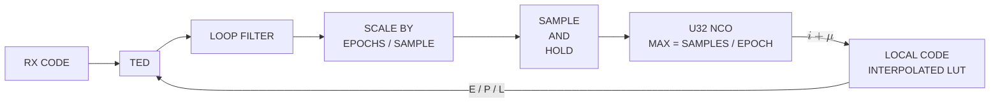

# Asynchronous data modulating a repeating PN code

> [!IMPORTANT] This assumes at most one data symbol transition per code epoch



- TED generates one error per epoch using the signal power formed by correlating 
  the rx signal with local code replicas E, P, and L over a window _which maximizes power_ 
  of the prompt correlation and forms the error: 

    ```python
    code_phase_error = 0.5 * (early_power - late_power) / signal_plus_noise_power
    ```
- This requires storing a buffer of the last received samples to "look back" in the case 
  where a transition occurs in the current sample buffer so a transition free epoch may be 
  obtained
- This is scaled down and repeated driving the NCO at 2x chip rate
- Local code is 2 samples per chip and linear interpolation is used to compute fractional samples
- LUT outputs early, prompt, and late codes offset by 1/2 chip (1 sample)

```python

# Init
code_size = 1023
samples_per_chip = 2
max_error = 0.5 # dB async correlation loss
phases = code_size * samples_per_chip
phase_resolution = 1 - 10 ** (-max_error / 10)
phase_step = int(np.ceil(phases * phase_resolution))
factors = [i for i in range(1, phases + 1) if phases % i == 0]
phase_step = factors[np.abs(np.array(factors) - phase_step).argmin()]
windows, window_size = int(phases / phase_step), phase_step
last_backard_sums = np.zeros(windows, np.complex128)
last_early_sums = np.zeros_like(last_backward_sums)
last_late_sums = np.zeros_like(last_backward_sums)

def find_max_power(x, windows, step_size, last_backward_sums):
    """Find max correlation over different output phase offsets."""
        
    # First compute the partial sums of the current correlation
    partial_sums = x.reshape(windows, step_size).sum(axis=1)

    # Now sum up the portions of the windows this epoch contributes
    sums = partial_sums.cumsum()
    backward_sums = partial_sums[::-1].cumsum()

    # Use the last epochs backward looking sums and the current 
    # epochs forward looking sums to comput the overlapping correlation
    # at each phase across the two epochs and keep the maximum
    correlations = np.zeros(sums.size)
    correlations[-1] = np.abs(sums[-1] / (code_size * samples_per_chip))
    correlations[:-1] = (
        np.abs(sums[:-1] + last_backward_sums[::-1][1:])
        / (code_size * samples_per_chip)
    )
    max_window = correlations.argmax()
    max_abs = correlations[max_window]
    max_power = max_abs ** 2

    # Use partial sums as integrate and dump downsampled output
    integrate_and_dump = partial_sums / (step_size * max_abs)

    # Compute window index. This is the offset from the end of the last
    # correlation window that is the start of the max power correlation
    # window.
    window_index = (windows - 1 - max_window) * step_size

    return (
        max_power,
        max_window,
        backward_sums,
        integrate_and_dump,
        window_index
    )

def get_window(x_window, x, last_x, index):

    if index:
        x_window[:index] = last_x[-index:]
        x_window[index:] = x[:-index]
    else
        x_window = x[:]

    return x_window


# In your loop

while signal_buffer,more_data:

    # NCO + interpolated LUT
    early, prompt, late = pn_gen.steps(
        pn_control
    )

    b = signal_buffer.get() 
    x = b * prompt
    power, window, last_backward_sums, integrate_and_dump,window_index = find_max_power(
        x, windows, window_size, last_backward_sums
    )
    signal_plus_noise_power = power

    b_win = get_window(b_window, b, last_b, window_index)
    last_b = b[:]
    early_win = get_window(early_window, early, last_early, window_index)
    last_early = early[:]
    late_win = get_window(late_window, late, last_late, window_index)
    last_late = late[:]

    early_power = np.mean(b_win * early_win) ** 2
    late_power = np.mean(b_win * late_win) ** 2
    code_phase_error = 0.5 * (early_power - late_power) / signal_plus_noise_power
    loop_filter.step(code_phase_error)
    pn_control = np.full(loop_filter.out / (code_size * samples_per_chip))

```