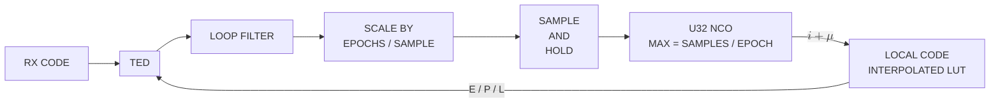
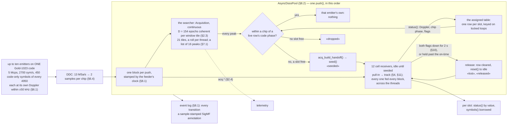
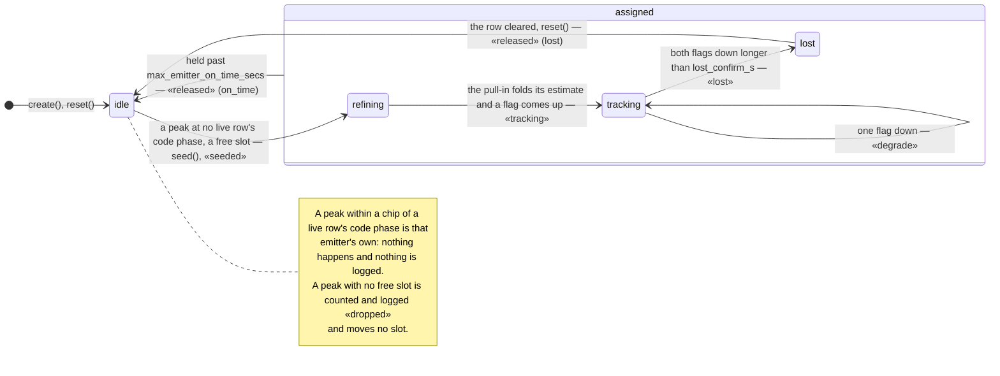

# AsyncDsssReceiver — the continuous DSSS receiver, from spec to object

*`AsyncDsssReceiver` is one C object that takes a detection of a continuous DSSS
emitter and tracks it until its own lock detectors say it is gone.
`AsyncDsssPool` is one C object that holds a population of them behind one
searcher: one channel searched without pause, one receiver per emitter, assigned
once and released once. This page says what those two objects are, and what the
searcher and the asynchronous despreader under them do. Bursts are
[`burst-bank.md`](burst-bank.md)'s; a reader who wants to run the pool starts at
[the user's guide](../guide/async-dsss-pool.md); every number here is measured,
and the runs behind them are
[the measurement record](async-dsss-receiver-measurements.md).*

______________________________________________________________________

## 1. The specification

| quantity                 | value                                                      |
| ------------------------ | ---------------------------------------------------------- |
| nominal frequency        | 2.5 GHz, uncertainty ±50 kHz                               |
| frequency rate of change | < 500 Hz/s                                                 |
| waveform                 | continuous DSSS BPSK, asynchronous rectangular data        |
| exemplary use case       | CCSDS command-link Gold code, 1023 chips, 3.069 Mcps       |
| data rate                | 2700 bps, on no fixed relation to the chip clock           |
| sensitivity              | Es/N0 ≥ 5 dB                                               |
| deliverable              | one C receiver in `libdoppler.{a,so}`, the same via Python |

Two of those are derived. **500 Hz/s** is the standard LEO worst-case nadir-pass
figure `f_dot_max = (f_c/c)·(v²/h)` — ~579 Hz/s at 2.5 GHz and 800 km — with a
small margin. **5 dB** is a measured pull-in cliff, not a limit: 3 and 4 dB never
lock, 5 dB locks cleanly at a BER matching theory, independent of loop bandwidth
and Doppler rate ([#99](https://github.com/doppler-dsp/doppler/issues/99)). It
was measured on a coarse hand-off, before §4's refining stage, so it is the
current floor.

**Every tracking loop is sized to a loop SNR of 20 dB at that floor.** The code
DLL and the Costas carrier loop — there is no FLL anywhere — take
`rho(dB) = Es/N0(dB) − 10·log10(2·bn)` with `bn` normalised to the loop's own
update rate, so the rate cancels: at 5 dB that is `bn ≤ 0.0158`, and the shipped
rule is `bn ≤ 0.01` for every loop. The code loop's per-epoch SNR is Es/N0 scaled
by `1/epochs_per_symbol`, 1.11 here, so the same bound covers it. `bn` is not
what sets the pull-in cliff: sizing a loop for steady-state jitter and pulling
one in from a coarse estimate are different problems, and §4's refining stage
answers the second.

______________________________________________________________________

## 2. Acquisition

### 2.1 Two front doors, one engine

`Acquisition` (continuous) and `BurstAcquisition` are two public constructors
over one `acq_state_t` (`native/inc/acq/acq_core.h`), each exposing only the
parameters that mean something for it rather than one class with a `mode` and
per-parameter "ignored here" caveats. State, auto-sizing, `push()` and
serialization are shared. `Acquisition` takes the code, `spc`, `chip_rate`,
`symbol_rate`, a design `cn0_dbhz`, a one-sided `doppler_uncertainty`, `pfa`,
`pd` and a CFAR `noise_mode`; everything else it derives, and there is no
`doppler_resolution` and no `max_noncoh`.

**One public name for the Doppler axis, `doppler_bins`, over two mechanisms.**
Rolling the shared epoch FFT by `k` bins produces a Doppler hypothesis exactly as
a slow-time FFT row does, so the engine keeps two internal fields named for the
*mechanism*, only one ever active: `coherent_bins` (slow-time FFT depth from
coherent multi-epoch integration — `BurstAcquisition`'s axis) and `window_bins`
(roll-tiled frequency windows, each a single-epoch FFT rolled to another
hypothesis — `Acquisition`'s axis). "Non-coherent" is a third, composable axis:
`n_noncoh` repeated dwells at a fixed hypothesis set, auto-selected to meet `pd`
at `pfa` and read-only, bounded only by a safety valve
(`ACQ_N_NONCOH_SAFETY_CEILING`, 256 looks) because the semi-analytical
`pd_predicted` model turns non-monotonic past it.

**Two inputs size the coherent depth `D`: `code_only_epochs` and
`doppler_rate`.** It is the smaller of `⌊(code_only_epochs + 1)/2⌋`, so a whole
block always fits inside the pure-code window, and `f_epoch/√1000`, so the drift
over one block stays inside half a slow-time bin. `code_only_epochs` counts the
**whole** epochs a window holds at any chip phase — the window is `W` symbols on
the data clock, with no fixed relation to the code clock, so a partial epoch is
lost at each edge and `code_only_epochs = ⌊W · cps / L⌋ − 1`. It defaults to 1,
which is `D = 1` and exactly the engine as it ran before.

### 2.2 A detection is a physical record, never a grid index

`DetectionEvent` is the data; the *hand-off* is the action that turns a raw
`push()` hit into it and gives it to the next stage. They are named separately
because they are not the same thing. The record crosses a thread or process
boundary — to the pool, to a C++ application — so it cannot be the grid-relative
`(doppler_bin, code_phase)`, which mean nothing without also shipping the
emitting object's `spc` and `doppler_res_hz`. Every field is in a physical unit
and the record is a flat, pointer-free POD. In C it is what
`acq_build_handoff()` produces and what seeds the receiver of §4; one record is
emitted per hit, on both classes.

| Field              | Type       | Description                                                                                             |
| ------------------ | ---------- | ------------------------------------------------------------------------------------------------------- |
| `timestamp_ns`     | `uint64_t` | `epoch_real_ns + samples_consumed/fs` per `native/inc/timing/timing_core.h`, not a syscall at emit time |
| `samples_consumed` | `uint64_t` | Sample offset since this engine's stream start that the detection's epoch ended at — replay-safe        |
| `chip_phase`       | `float`    | Code phase in CHIPS, the code-tracking seed for the next stage                                          |
| `doppler_hz_est`   | `float`    | Coarse Doppler in Hz, already folded, signed and scaled from the raw bin index                          |
| `doppler_res_hz`   | `float`    | Width of that estimate — the ±`doppler_res_hz`/2 a refine or tracking stage still has to close          |
| `cn0_dbhz_est`     | `float`    | C/N0 estimate, dB-Hz — sizes downstream loop bandwidth and dwell                                        |
| `peak_mag`         | `float`    | Raw CFAR peak magnitude — observability passthrough                                                     |
| `noise_est`        | `float`    | Raw CFAR noise-floor estimate — observability passthrough                                               |
| `test_stat`        | `float`    | Raw CFAR gating statistic — observability passthrough                                                   |

**`chip_phase` is where the code will be, not where it was.** A hit is decided
at its dwell's end and the seed is wanted at the next sample, so
`acq_build_handoff()` advances the phase by the drift over half the dwell on the
hit's own Doppler; when the engine is told the carrier, each tile also walks its
epochs by its own code rate so a deep block does not smear.

**Nothing below the holder sees a clock.** The engines are pure sample-domain
with no I/O, so the anchor comes from whatever feeds them samples and is threaded
through by the composing layer (§8.1). **Neither class takes a `carrier_freq`**:
the engine works in baseband Doppler Hz throughout, and the aiding scale
`doppler_hz_est · chip_rate / carrier_freq` is computed by the component that
knows the carrier, which keeps the engine usable by a baseband-only caller.

### 2.3 The search rolls one spectrum across frequency and integrates coherently inside the window

**The native span is one epoch's bin.** A `D`-point slow-time FFT sampled at the
epoch rate has a fixed `±epoch_rate/2` range whatever `D` is — more bins
subdivide the same range, they never widen it. At 3.069 Mcps over 1023 chips
that is 3.0 kHz per bin, and ±50 kHz is 33 of them.

**The uncertainty is tiled by rolling one spectrum, not by a mixer bank.** One
forward FFT of the epoch, then the spectrum rolled by `k` bins per hypothesis
against one precomputed replica spectrum: one forward plus one inverse per tile
against a forward *and* an inverse per tile for a bank of down-converters —
1.2–1.55× faster, every tile out of one object's per-epoch loop. The engine sizes
the tile count itself, odd and symmetric (`acq_cover_window_bins`): 21 at 5 Mcps
over ±50 kHz, 35 at 3.069, 53 at 2. Rolling by `k` bins *is* mixing by `k/nx`, so
the roll with the slow-time transform inside each tile is the mixer bank with one
forward transform shared across tiles, and the `D` rows per tile are its fine
step. A bank of DDC-fed engines is not a third option: a tile is a Doppler
hypothesis on a signal 2–5 MHz wide against 50 kHz of uncertainty, so a per-tile
DDC cannot decimate and only adds a mixer per tile (§6.4).

**`D > 1`, in blocks, inside the pure-code window.** Coherent multi-epoch
combining across data aliases the data's own spectrum across the Doppler axis and
mislocks structurally ([`dsss-acquisition.md`](dsss-acquisition.md)); inside the
pure-code window (§5) there is nothing to alias. The searcher does not know any
emitter's window phase, so it sums **non-overlapping blocks of `D` epochs**, one
coherent surface per block, detected per block: a whole block always lands inside
a window once `W ≥ 2D − 1`, and `⌊W/D⌋` land in a row for `n_noncoh` to
accumulate. The Doppler-rate bound gives `D ≤ f_epoch/√1000` — 154 at 5 Mcps, 61
at 2 — a 32 Hz bin and 18–22 dB of gain, at the same 3.2 k hypotheses at both
rates. A block that straddles data, or `n_noncoh` reaching across a window edge,
spreads that emitter over its `D` rows about `10·log10 D` down **at its own code
phase**: a weaker copy, not a mislock, and what §7.1's twin rule and §8.2's zone
are keyed on.

**A pick is asked at its row's frequency before it is reported.** A tile
de-rotates by its own centre, so an emitter near a tile edge leaves half a span
of residual in both neighbours and the slow-time transform folds it modulo the
epoch rate: both read it at the same row within 0.03 dB, and the pick would
otherwise be the noise's. So the engine keeps the block's raw epochs and, per
listed peak, correlates them with the replica at the pick's code phase mixed by
the row's own frequency and by that frequency one span down and up — under half a
row of residual for the truth, exactly one cycle per epoch for the aliases, a
correlation of zero — summed non-coherently so a data transition costs every
hypothesis the same. The winner is the row reported
(`acq_resolve_tile_alias`), and the raw block rides in the state blob so a
mid-block resume decides as an unbroken run would. Pinned by
`native/validation/acq_block_coherent.c`.

**A roll per thread.** The tiles are independent after the one forward transform,
so the tile loop is a `dp_parallel_for` (`native/inc/dp_parallel.h`) over
**persistent** workers — pthreads created once at `create()` and parked between
pushes, so a fan costs a hand-off per push rather than a thread creation. The
per-cell passes that decide a surface — magnitude, CFAR reference, working mask,
every scan of the peak list — run per tile as well, merging serially in tile
order, so what stays serial is per tile, not per cell. That also keeps the peak
list and the twin rule on **one** surface, where a slice boundary would have cut
an exclusion zone in two.

**What it costs is a benchmark, not an estimate.**
`native/benchmarks/bench_acq_core.c` times a real `acq_push()` per dwell: about
10 ns per tile per output sample at `D = 1`, which is what makes the searcher's
cost nearly equal at 2 and 5 Mcps. At `D = 154` it is 523 ns per output sample
serially, 164 on four threads and 125 on eight, holding 53 MB of block per
channel and 160 MB of surface.

### 2.4 The searcher is watched, not trusted

A hit says where a peak was and nothing about what else stood on the surface, how
close the gate came on the dwells that fired nothing, or whether one emitter's
splatter was about to be listed as two. So the engine carries its own
instruments, attach-on-demand: detached, a decided dwell costs three
predicted-not-taken branches, and nothing rides in a state blob.

- **Ten probes per decided dwell**, `set_telemetry(tlm, prefix, decim)`: the test
    statistic and the gate it was held to — plotted together they show where a
    hit fired and how close the misses came — the CFAR reference, the strongest
    cell's value and its native row and column, the picks in the dwell and how
    many were held as same-code-phase twins, the strongest pick's concentration,
    and whether the gate fired.
- **The surface and the complex intermediates under it.** `keep_surface` then
    `surface(out)` gives every cell divided by the reference the gate used, so a
    cell reads as its own test statistic and the gate is a flat plane on a plot,
    with `surface_doppler_hz()`/`surface_chip_phase()` as its axes from the same
    mapping a `DetectionEvent` carries; `acq_set_surface_sink(fn, ctx, decim)`
    hands every `decim`-th dwell's surface to a callback on the pushing thread.
    Underneath, `surface_complex(out)` is the coherent dump the last dwell was
    decided on, `block_prompt(tile, col, out)` one cell's `D` per-epoch
    correlations rolled to the tile's centre — the despread stream at epoch rate —
    and `block_raw(out)` the block's epochs as pushed, for a re-correlation at any
    phase, rate or symbol boundary the grid lacks.
- **The concentration is the splatter discriminator.** One emitter does not make
    one peak, and every extra copy sits at its **own code phase** while a second
    emitter is a second column. So the probe is the strongest pick's main-lobe
    power — its row and one either side, the exclusion zone's width, so an emitter
    halfway between two tiles is not charged for its own scalloping — over the
    total power of its column across every tile and row: near 1 for one clean
    emitter, about 0.5 for a transition's twins two or more tiles away, lower for
    a straddling block.

______________________________________________________________________

## 3. The asynchronous despreader

The receive-side despreader when the **data-symbol rate is on the order of the
code-epoch rate but asynchronous** to it. The reproducible study is
`src/doppler/examples/async_despreader_study.py`.

### 3.1 An independent symbol clock slides through the epoch

A DSSS receiver despreads by integrating early/prompt/late correlations over one
**code epoch** (`TE = sf·sps` samples) — an integrate-and-dump locked to the
*code* clock. That works when the symbol clock is locked to it at an integer
ratio (GPS C/A: 20 epochs per bit, edges on epoch edges). It breaks when the
symbol clock is independent: with `T_sym = TE · (1 + delta)`, an independent
symbol phase and `T_sym ≈ TE`, there is about one symbol per epoch, a transition
roughly every epoch, and `delta ≠ 0` slides the symbol boundary continuously
through the epoch at the beat rate `delta / TE`.

### 3.2 Per-epoch despreading cancels itself half the time

The coherent prompt over an epoch whose data flips at fraction `f ∈ [0,1]` is
`P(f) = A·[f·d1 + (1−f)·d2] = A·d1·(2f−1)`: full despread at an epoch edge, and
**zero** for a flip mid-epoch. Because `f` sweeps through every value, about half
of all epochs straddle a transition and their prompts collapse. Per-epoch data
decisions floor — a measured BER around 1e-1 where the bound is under 1e-5 — and
`(|E|−|L|)/(|E|+|L|)` collapses to `0/0` on those epochs, starving the DLL. At
one prompt per epoch the symbol clock is **unobservable**, and the integration
window is forced to straddle transitions. The failure has a fingerprint: the
straddle modulation is periodic at the symbol-to-epoch beat, so the spectrum of
the prompt-magnitude stream `|P[n]|` carries a **tone at `|delta|` cycles per
epoch** — what to look for when a DSSS link shows unexplained despread fades.

### 3.3 Partials give the symbol clock its own observability


Each code epoch is split into `K` sub-epoch **partial** prompt correlations of
`TE/K` samples at known code phase — `K` despread samples per epoch, so the
symbol clock is observable. A length-`K` **boxcar** over the partial stream is
the symbol matched filter: a sliding, symbol-aligned coherent re-integration, the
full-symbol despread the epoch-locked window could not form. Without it a
rectangular symbol pulse is sampled at one point, about `1/K` of its energy is
captured, and the BER floors near 2e-2. `track.SymbolSync` (Gardner TED plus
Farrow interpolator) then recovers the symbol clock from the matched-filtered
stream and decimates at the symbol-aligned peak.

| Es/N0  | bound  | genie (known timing) | partial+MF+SymbolSync | broken epoch |
| ------ | ------ | -------------------- | --------------------- | ------------ |
| 6 dB   | 2.4e-3 | 2.5e-3               | 4.5e-3                | ~7e-2        |
| 8 dB   | 1.9e-4 | 1.5e-4               | 5.8e-4                | ~6e-2        |
| 9.6 dB | 9.7e-6 | 0                    | 0                     | ~5e-2        |

The BER follows the BPSK matched-filter bound within 1–2 dB, and a genie
reference with known timing hits it exactly: the loss is window misalignment,
never SNR.

**The code path combines the partials non-coherently**, `|E| = Σ_k |E_k|`,
`|L| = Σ_k |L_k|`. A data flip changes a partial's *sign*, not its *magnitude*,
so only the one straddling segment degrades — about `1/K` of the look. That
roughly halves the discriminator variance against the coherent-epoch form and
needs no symbol timing, so it works from cold start: the bootstrap order is DLL
(non-coherent) → SymbolSync → data. **`K = 4` is the sweet spot** at
`T_sym ≈ TE`; `K` trades observability and straddle-robustness against the
non-coherent squaring bias, `K = 8` loses more gain than variance, and `K` must
divide `TE`.

### 3.4 The despreader removes the code and outputs samples

Its one job is to remove the PN code and emit samples. The asynchronous symbol
clock is merely *why* it despreads in `K` partials; carrier recovery and symbol
extraction are downstream, in separate objects fed from its output. This is
`track.Dll(..., segments=K)` and no new object: `segments=1` is the classic
coherent full-epoch DLL, `segments=K>1` is the streaming async despreader, and
what follows it is `Costas` (carrier) then `SymbolSync` (timing) then bits.

**The carrier belongs downstream** because the `|E|−|L|` discriminator is
non-coherent, so code tracking is carrier-blind, and because each output is a
`TE/K`-sample partial rather than a full epoch, so a residual carrier barely
dents it. For a half-Doppler-bin residual the I&D loss is `sinc(Δφ/2)` with
`Δφ = π/segments`: **−3.9 dB** at `segments = 1`, **−0.2 dB** at 4. The residual
rides out as a ring in the constellation and a downstream `Costas` removes it at
full symbol SNR. A carrier loop *inside* the despreader would only matter for
long coherent integration, which partials deliberately avoid.

**The same rule forbids coupling `segments` to a demodulator's `sps`.** The
partial rate is `K·chip_rate/SF`, chosen for the code loop's own variance and
nothing else; a demodulator's `sps` is chosen for its own reasons, and
`doppler.resample.RateConverter` bridges them. Picking `K` so that
`round(K·T_sym/T_epoch)` lands on an integer — which the DSSS-MPSK gallery page
once did — makes a perfectly good `Dll` tuning look downstream-broken.

### 3.5 Code lock reuses acquisition's own statistic

A tracking channel must always answer *am I locked?*, so the DLL carries an
always-on lock detector built on **acquisition's** non-coherent test statistic —
acquire and track then agree on what "detected" means. Each emitted look (a
partial in `segments` mode, the full-epoch prompt at `segments=1`) contributes
its prompt power, and `N = n_looks` consecutive looks give
`R = sqrt(2·Σ|P_k|² / E|O|²)`, which under H0 has `P(R > η) = marcum_q(N, 0, η)`,
exactly the acquisition tail; a caller sizes
`η = det_threshold_noncoherent(pfa, N)` and `N = det_n_noncoh(snr, …)` for a
target `(Pfa, Pd)`.

**The noise reference is an off-peak tap, not a second channel.** Each look is
correlated a second time at a random whole-chip offset phase, re-drawn every
epoch and kept clear of the prompt/early/late lobe by `noise_guard` chips; for a
low-sidelobe code that correlation is signal-free, so `|O_k|²` samples the
per-look noise power. **The test depth and the noise-averaging length are
decoupled**: `N` sets the χ²(2N) threshold, but the reference must average many
more cells or its own variance inflates Pfa — one offset cell per look drives Pfa
about 400× high, while `1/α = max(1024, 32·N)` holds it at target with
`Pd ≈ 0.98`. It is a cumulative-mean bootstrap until `1/α` looks have accrued and
a fixed-α EMA after, so the floor is unbiased from the first look rather than
seed-dominated through a warm-up that otherwise runs Pfa ~10× high for hundreds
of epochs. Measured: empirical Pfa ≈ 9e-4 against a 1e-3 target from the start of
a noise stream. `Dll.locked`, `Dll.lock_stat` and `Dll.noise_est` read it back,
inside the normal `steps()`, with no opt-in.

### 3.6 The look-back window finds the transition-free epoch

The code loop's error comes from the one-epoch window with the **most prompt
power**, found per epoch across the current and the previous epoch, on the
assumption of at most one data transition per epoch. `native/inc/dll/dll_core.h`
is the C port of this design and names its artifacts after it, so the two can be
read against each other.



The epoch is cut into `windows` chunks of `window_size` samples, sized from a
tolerable async correlation loss `max_error` in dB: `phase_step` is the divisor
of `sf·spc` nearest the coverage `1 − 10^(−max_error/10)` asks for, and
`windows = sf·spc / phase_step`. Per epoch, over the prompt product `x`:

```text
partial_sums    = x.reshape(windows, window_size).sum(axis=1)
sums            = partial_sums.cumsum()         # this epoch, forward
backward_sums   = partial_sums[::-1].cumsum()   # this epoch, reversed
correlations[k] = |sums[k] + last_backward_sums[::-1][k+1]| / (sf·spc)
correlations[-1]= |sums[-1]| / (sf·spc)
max_window      = argmax(correlations)
window_index    = (windows − 1 − max_window) · window_size
```

`max_window` is the transition-free window, `window_index` its start measured
back from the end of the previous correlation, and `correlations[max_window]²`
the signal-plus-noise power the discriminator normalises by. Early and late are
summed over the same window, and the error is the **power-domain**,
prompt-normalised form
`0.5 · (early_power − late_power) / signal_plus_noise_power` — not a
magnitude-domain `(|E|−|L|)/(|E|+|L|)` ratio. The partial sums double as the
integrate-and-dump output, normalised by `window_size · max_abs`.

The replica the loop steers is held at **2 samples per chip and linearly
interpolated** at any fractional position, sampled at chip-relative
`{0.25, 0.75}` rather than `{0, 0.5}`, which centres the interpolation transition
zone symmetrically on each chip boundary; the earlier dwell-width-aware
matched-filter integral was fancier and did not, on its own, fix the long-run
false lock this replaces. The loop filter's output is scaled by epochs per sample
and **sampled and held** into the NCO's rate, never kicked into its phase.

### 3.7 The symbol period lifts the look to symbol scale

The partial form of §3.3 is forced by the data: a full-epoch coherent look
collapses on a transition, so the code-lock detector's look is the quarter-epoch
partial — the smallest integration the asynchronous data allows when nothing is
known about where its transitions fall, and therefore the weakest. At the
operating point a partial carries −2.9 dB per look at Es/N0 5.7 dB, and a default
20 looks sits below threshold.

§3.6's search already finds a transition-free window; what it does not know is
the symbol *period*, and the receiver does — `segments · chip_rate / (sf · symbol_rate)` partials, 7.24 here. With the period the same search lifts to
the symbol scale: `ceil(P)` boundary-phase hypotheses, each placing a boundary
every `P` partials and owning a window of `L = min(floor(P) − 1, 4 · segments)`
partials after it — short enough to sit inside one symbol under the hypothesis's
quantisation, capped so a slow data clock never asks for coherence across more
carrier than the wipe-off holds. Each hypothesis sums its window coherently and
keeps an EMA of its power over about 32 symbols; the one with the most power
**is** the symbol timing, and its windows are the detector's looks. A look then
integrates `L` partials coherently and never straddles a transition: six instead
of one here, 7.8 dB more per look, so `det_n_noncoh` sizes the detector at 10
looks for Pd 0.99 at the floor instead of 161. The search needs no decision and
no external timing, so it costs nothing at cold start and follows a drifting
symbol clock by itself. A look that overlaps the previous one is not a look and
is not counted — overlapping looks read the same noise several times and returned
the code flag about once a second after a departure, restarting §10's clock.

**The code discriminator runs on the same window**, steering once per symbol on
the early/prompt/late sums over the winner, its filter re-timed to the symbol
interval so `bn` keeps its per-epoch meaning and the tracked rate is continuous
whether the aid is on or off. Against the per-epoch loop that buys about 20%
faster pull-in and a tighter loop above 45 dB-Hz, and costs 1.2–1.4× the jitter
at the 40 dB-Hz floor where the noise sets it and the window's unused partials
cost more than its coherence buys — hundredths of a chip either way
(`native/validation/dll_aid_jitter.c`). The emitted partial stream is untouched:
the look-back still supplies its normalisation.

The receiver applies it at chain build: `dll_set_symbol_period` from its
configuration, `n_looks` from `det_n_noncoh` over the window at its `cn0_dbhz`,
and the drop count from `det_verify_count(1 − pd, 1e-6)` — three consecutive
misses against the DLL's fixed two — so the verify hysteresis is a budget rather
than a constant. Pinned by `native/tests/test_dll_core.c` §6b (per-partial looks
up 35% of the time, aided 100%, the chosen phase within one partial of the truth)
and §6c (the loop steers on the window, the two modes' step transients agree, the
rate is continuous across the switch), both sabotage-proven.

______________________________________________________________________

## 4. The receiver is one object with five states

`AsyncDsssReceiver`
(`native/inc/async_dsss_receiver/async_dsss_receiver_core.h`) is the composed
continuous receiver, one C object, read back through the `get_*()` family and
§11.3's status record:

- **searching** — samples feed an embedded continuous `Acquisition` (§2,
    window-tiled over `doppler_uncertainty`, `D = 1`). A hit becomes a hand-off
    through `acq_build_handoff()`, which seeds the refine stage; the unconsumed
    tail of the same call is handed straight to it.
- **refining** — a frozen-carrier derotation at the coarse estimate
    (`costas_wipeoff` with `costas_update` never called) feeds a collection `Dll`
    whose look-back segments oversample each epoch, then a `RateConverter` to
    `CarrierAcquisition`'s own rate, then `CarrierAcquisition`. Oversampling is
    required rather than tidy: the asynchronous data's residual carrier rides a
    spectrum about `symbol_rate` wide, which one dump per epoch aliases. When the
    estimator reports ready or gives up, the live chain is built **fresh** from
    the *original* hand-off chip phase — not wherever the refine `Dll` drifted
    to — and the refined, or on a give-up unrefined, Doppler.
- **tracking** — the refined carrier is unfrozen into a live pre-despread
    Costas → `Dll` (§3) → `RateConverter` → `MpskReceiver`. `costas_update()`
    runs once per code period on a **non-data-aided (squaring)** discriminator
    over that period's coherent partials: a code period spans about 0.9 data
    symbols here, so a transition lands inside nearly every period, and a
    decision-directed sign-aligned combine thrashes ±57° and averages to zero.
    With that clean error and `ASYNC_DSSS_RX_BN_CARRIER = 0.04` the loop pulls the
    refined seed in and rides the 500 Hz/s ramp, so despreading is coherent and
    `MpskReceiver` is left a small residual. It is a **pure PLL** — the FLL
    cross-product discriminator is far too noisy on this input and is not exposed
    at all, not merely defaulted off.
- **idle** — cell mode's resting state, waiting for a seed; samples are consumed
    and discarded, so a feeding loop needs no special case.
- **lost** — the release rule's verdict (§10). The loops stop updating and
    samples are discarded until `reset()`.

Two lock detectors run while tracking: the `Dll`'s CFAR-based **code lock**
(§3.5) and a hysteretic **symbol lock** on the emitted symbols — the BPSK
`cos(2φ)` statistic as an SNR-weighted EMA over a 30-symbol dwell, declared after
30 consecutive symbols at or above 0.5 and dropped after 15 below 0.3. `reset()`
returns the searching flavour to searching and the cell flavour to idle: a
receiver that has locked cannot be reset back onto the same signal.
`DsssReceiver` is the same composition without the refining stage — a hit's
coarse Doppler goes straight to tracking — and §1's pull-in cliff is why the
refine exists. Both carry the standard
`state_bytes`/`get_state`/`set_state` triplet (`native/inc/dp_state.h`), every
child included; the blob's layout key is `segments`/`sps`/`n`/`refine_segments` and the
flavour, and a blob does not travel between flavours.

### 4.1 The parts

- **The despreader** is `Dll(..., segments=K)`, validated carrier-present: code
    lock holds with a residual carrier on the samples, and the partial output is
    losslessly recoverable by a downstream carrier wipe and symbol despread. Its
    `bn` is 0.002 — the validated stable bandwidth for this one-update-per-partial
    geometry, not `dll_create()`'s 0.01 default — and its early-late spacing is
    0.5 chips, so the normalised power discriminator reads `2 − spacing = 1.5`
    units per chip of offset.
- **Downstream** are `Costas`, `SymbolSync` and `MpskReceiver`, with a
    `RateConverter` bridging the partial rate to the demodulator's `sps` and never
    a coupling of the two (§3.4). `K = 4` is tuned for the code discriminator's
    variance, while a downstream demodulator wants a much larger `K` for coherent
    gain. The hand-off carries two unit conversions — `Dll`'s `init_chip` is
    phase-inverted relative to `Acquisition`'s `code_phase`, and `MpskReceiver`'s
    `init_norm_freq` is cycles per its own partial-rate input — spelled out in
    [DsssReceiver](../gallery/dsss-receiver.md)'s example.
- **`carrier_freq_hz` couples the code rate to the carrier.** The coupled
    code-rate Doppler `carrier_offset/carrier_freq` is fed to the tracking `Dll`
    through `dll_set_rate_aid()` and refreshed every code period from the live
    carrier loop, so the code loop rides a dilated clock the discriminator alone
    cannot pull in at low SNR. `0.0` turns it off.
- **The escape hatches are separate knobs**: `configure_search_raw` pins the
    embedded search grid, `configure_lock_raw` re-tunes the live `Dll`'s code
    detector, `configure_chain_raw` re-pins `segments`/`sps`/`n` (allocating every
    replacement before adopting it, so a failed pin leaves the receiver usable on
    its prior grid), and `set_refine_min_blocks` floors the refine's dwell. That
    floor is not cosmetic: `CarrierAcquisition`'s dwell is sized for *detection*
    at the derated C/N0, so it shortens as C/N0 rises — two blocks at 45 dB-Hz —
    while the noise of the estimate it hands the tracking chain does not. Two
    blocks give 210 Hz against a chain that pulls in from a few hundred, and one
    hand-over in sixty landed outside; the default seven blocks (42 ms) hold it to
    77 Hz.

Every part is pinned in `native/tests/test_async_dsss_receiver_core.c`,
`src/doppler/dsss/tests/test_async_dsss_receiver.py`,
`native/tests/test_dll_core.c` and `src/doppler/track/tests/test_dll.py`.

______________________________________________________________________

## 5. One code, one channel, many emitters

Several emitters are in the air at once on the **same** Gold code in the **same**
band, and what tells them apart is code phase, power and Doppler — three
coordinates on one (Doppler × code phase) surface. The stream carries a
**450-symbol pure-code window every 4950 symbols** on the data clock: one
reacquisition opportunity every 1.83 s at any chip rate, up to 0.92 kHz of drift
between them at 500 Hz/s, and — because the window is counted in symbols with no
fixed relation to the chip clock — a frame edge at no particular chip phase,
never on a code epoch.

- **The window buys coherence, not a preamble.** It is what makes `D > 1` sound
    (§2.3), and nothing else in the stream is transition-free. Its floor inside an
    aligned block is −21 dB against −13 in the data case (§6.3).
- **The channel never stops searching.** A continuous emitter is re-detected at
    every window while its own receiver goes on tracking it, so the claim rule
    across windows is "same signal, next frame". That rules out
    `AsyncDsssReceiver` as the *channel*: its state machine replaces the search
    with tracking. Search and track are **concurrent** — the searcher runs on every
    block and each assigned receiver is fed the same samples beside it — and
    something must recognise that a re-detection belongs to an emitter already
    assigned (§8.2's table).
- **It is a lifecycle, and a duration.** Emitters come into view at their own
    frequencies, are acquired at their next window, are tracked, and leave. So
    nothing may grow with time — `samples_fed` is 64-bit, per-push scratch reaches
    a high-water mark and stays, rings are fixed — and a checkpoint is taken live,
    for a restart mid-pass.
- **The hand-off is a policy, not a property of the channel.** What a detection
    becomes — a tracker's seed here, a captured window for a frame demodulator, or
    a report — is chosen per bank; the channel owns the search and the event.

Coming into view is **not** powering up: an emitter appears at whatever point of
its frame it has reached, mid-payload as often as not, so its first window
arrives uniformly within one frame and acquisition latency is bounded by 1.83 s
and averages half of it.

______________________________________________________________________

## 6. The searcher — every emitter on one surface

### 6.1 The operating point

| quantity                       | value                                                                                                                    |
| ------------------------------ | ------------------------------------------------------------------------------------------------------------------------ |
| chip rate                      | **2 to 5 Mcps** — the worst case is per quantity: 5 Mcps priced per sample, 2 Mcps priced per tile                       |
| code                           | 1023 chips → one epoch is **204.6 µs** at 5 Mcps, **511.5 µs** at 2                                                      |
| pure-code window / frame       | **450 / 4950 symbols**, 167 ms / 1.83 s at any chip rate; 813 / 8960 whole epochs at 5 Mcps, 324 / 3584 at 2             |
| coherent depth                 | **`D ≤ f_epoch/√1000`** in non-overlapping blocks: **154** at 5 Mcps, **61** at 2 — a 32 Hz bin, 3 and 8 aligned blocks  |
| DDC input / output             | **13 MSa/s** in, **2× chip rate** out (10 MSa/s at 5 Mcps, 4 at 2) — ratios 1.3 and 3.25, neither with an integer factor |
| samples per epoch              | 2046, at every rate                                                                                                      |
| chip pulse                     | **rectangular** — no pulse shaping on the chips                                                                          |
| Doppler tile                   | `1/T_epoch` = **4.89 kHz** at 5 Mcps, **1.96 kHz** at 2, subdivided into `D` rows of 32 Hz                               |
| uncertainty                    | **±50 kHz** to start, likely **±5 kHz** after Doppler pre-compensation                                                   |
| tiles over the uncertainty     | **21** at 5 Mcps and **53** at 2 over ±50 kHz; 3 and 7 over ±5 kHz                                                       |
| population                     | at least **1** emitter always up, up to **10** at once, each on for **5 to 15 minutes**                                  |
| max on-air time                | **15 minutes**, `ASYNC_DSSS_POOL_MAX_EMITTER_ON_TIME_SECS` — the pool's default, adjustable, baked in nowhere else       |
| cores                          | **at least 48** on one server                                                                                            |
| budget, one core, operating    | **77 ns** per input sample; per output sample **100 ns** at 5 Mcps, 250 at 2                                             |
| budget, one core, at the floor | **33 ns** per input sample; 43 per output at 5 Mcps                                                                      |

The population never puts fewer than one peak on the surface and may put ten, and
an emitter comes or goes about once a minute at full population. The rate
requirement is that all of it — front end, searcher, every receiver — runs
**comfortably at 30 MSa/s**; running at exactly 30 counts as slow, and this page
takes half the budget as the working target. The receiver is `AsyncDsssReceiver`
in its cell flavour (§11.1): the searcher's detection arrives from outside as the
seed, the receiver's own `Acquisition` never runs, and past the seed the `Dll` is
held on the searcher's own block timing rather than closed on itself.

### 6.2 One maximum per dwell reports the strongest emitter and masks the rest

The classic detector reports one cell, the gated maximum of the surface, and that
is still what both detectors do at `max_peaks = 1`, the default. With `K`
emitters up the surface has `K` peaks; the rest are not below threshold, they are
simply not looked at. In the burst use case that costs little — bursts are short
and rarely overlap in one channel. Here the strongest emitter is up for hours, so
every dwell for those hours reports it and nothing else, and a second emitter
beside it is **never** acquired while the first is on the air. Hand-off does not
help: the assigned receiver keeps tracking the first emitter, the searcher keeps
re-detecting it, and once the assigned zone drops that re-detection the dwell
reports nothing at all. The gap is the searcher's, not the bank's: a Doppler bank
partitions one axis of the surface, but with one band and one code, emitters
within a span share a surface, which is the normal case.

### 6.3 The power spread decides which mechanism is needed

A strong emitter does not put only one peak on the surface. A 1023-chip Gold
code's cross-correlation floor is bounded at about **−24 dB**, and that is what
the engine's own surface reads where the bound applies — zero Doppler, no data. A
data transition inside the epoch or a half-tile Doppler offset raises the worst
cell at another code phase to **−16 dB**, and both together to **−13 dB**, the
searcher's normal case. That floor lies across the whole surface, so an emitter
weaker than the strongest by more than the floor plus the detection margin is
under its sidelobes: it is not a peak, and no peak detector reports it.

Two things follow. The **CFAR reference is right to rise** — with a strong
emitter present the surface's floor *is* its sidelobes, and the weak emitter is
genuinely below it. And **only removing the strong emitter lowers that floor**,
which a peak list cannot do; that needs a replica, a different object with a
different information source (§7.2). So the mechanism forks on the emitters'
power spread: inside the floor a peak list suffices, beyond it the weak ones need
the strong ones cancelled first (§9).

### 6.4 The throughput floor rules out a channel per tile

The decimation is only 1.3× at the top of the rate range, and that is the fact
that shapes the cost: **nothing runs at a fraction of the input rate.** At 5 Mcps
the searcher and every receiver run at 10 MSa/s, three-quarters of what the front
end sees, so the population's cost is `searcher + 12 receivers` per output
sample, not that divided by anything. The rate range splits the worst case in
two: receivers are priced per output sample, so their worst case is 5 Mcps, while
the searcher is priced per tile per output sample and tiles rise as the rate
falls, so its tile-samples per second are nearly equal at both ends (210 M
against 212 M over ±50 kHz) and its worst case is the low rate at the full
uncertainty. Pre-compensation to ±5 kHz cuts the searcher eightfold and nobody
else at all.

Measured per stage on one core: the arbitrary-ratio front end is **0.18 of a
core** (13.6 ns per input sample), the searcher over ±50 kHz is **2.1× real
time** at either chip rate, and one tracking receiver is **0.44 of a core** — so
the chain is over budget on one core before the population is on it, and the
population is about 7.6 cores at the operating point and 17.5 at the floor. Three
shapes follow. **One front-end DDC is shared, on its slowest path, on purpose**:
there is one frequency channel, so the only stage at the input rate is one
conversion, and the 13-to-10 ratio was chosen for the budget rather than the
radio — `RateConverter` builds the cheapest cascade a ratio allows (CIC, halfband,
then a polyphase resampler) and 1.3 has no integer factor, so the whole
conversion runs through the polyphase arbitrary resampler, the most expensive
sample the front end can produce. A bench at a convenient ratio would have
measured the wrong front end. **The searcher is one window-tiled engine, not a
DDC bank**: a bank of 21 to 53 `DDC → search` channels is 14 to 33× real time on
one core and fits on no node, while one window-tiled engine covers the
uncertainty at the same sensitivity and, with the peak list inside it, lacks
nothing the bank had here. **The receivers are the population's cost and they
parallelize**; cancellation would not, being serial on the searcher's path.

As one run behind the shipped DDC, counting what it tracked beside the rate:
**4.1× real time at the operating point and 9.5× at the floor on twenty threads,
all ten emitters tracked** — the requirement missed by its own words, with the
block searcher's depth (§2.3) the stage to attack.

______________________________________________________________________

## 7. The two mechanisms

### 7.1 The peak list with exclusion zones

The list is the maximum, iterated:

```text
repeat up to max_peaks times
  take the maximum of the surface
  if it is below eta · noise_est: stop
  if it is within ±1 chip of a listed peak's code phase, at any tile:
     hold it as that emitter's twin; list it only if it is still there,
     at the same tile, on the next epoch
  report it (at its native row where the surface is interpolated)
  exclude ±1 Doppler bin × ±1 chip around it
```

The two-epoch rule exists because one emitter makes more than one peak: a data
transition inside the epoch splits it into equal twins two or more tiles apart,
and a half-tile Doppler offset throws a −9.5 dB sidelobe two tiles away — every
one at the emitter's **own code phase**. A twin moves with the transition's
position from epoch to epoch and is absent in the emitter's data-free window,
while a real second emitter at the same code phase stays at its tile. So the rule
holds a same-phase peak for one epoch rather than dropping it, and costs no
resolution at other code phases, where the adjacent tiles remain candidates.

**Why one bin and one chip.** They are the widths of one emitter's main lobe: an
epoch's frequency response is the `sinc` of a one-epoch rectangle, whose first
nulls fall one tile either side, and the code's autocorrelation triangle reaches
zero one chip either side of its apex. Inside that zone the surface belongs to
the emitter just reported — its own shoulders would otherwise be the next
"peak" — and outside it a second emitter has its own maximum. The zone is
therefore also the detector's **resolution**: two emitters within one bin *and*
one chip are one peak, distinguishable by nothing on this surface, and that is a
property of the code and the dwell, not of the detector. The Doppler axis is the
`window_bins` tile index with `D` slow-time rows inside each tile, so
`dsss-acquisition.md` §9.1's interpolated-versus-native split applies: the gate
reads the interpolated axis and the report is the native row.

**The threshold does not change.** `eta` is sized from
`N = searched_bins · code_bins` cells; it counts the noise's chances over the
*surface*, so a second reported peak is another draw from the same cells against
the same gate, and the per-dwell false-alarm event — *any* reported peak is
false — is bounded by the same union. Exclusion zones remove a few cells from the
count, in the safe direction. What does change is the floor under a strong
emitter (§6.3): the reference rises, and so does `eta · noise_est`.

**Fixed size.** `max_peaks` is configuration; a dwell's list is up to that many
`acq_result_t` records from `push()`, strongest first, sharing the dwell's
`samples_consumed` and `noise_est`. Nothing allocates per dwell and nothing grows
with time; a held twin takes a slot without being reported. The searcher sees
every emitter, so the list holds all ten plus the false peaks the gate admits,
and `max_peaks` is of order 16.

**In the code**, `det_peak_list` (`native/inc/detector/det_private.h`) is the
iterated maximum with the zone, circular on both axes, over a caller-initialised
mask; the engine seeds the mask with the cells outside its searched band, sets
the gate in the surface's own units (`eta · noise_est` on the coherent surface,
`eta_nc² · noise_pow / 2N` on the non-coherent one), maps each pick to its native
row within its own zone, and carries the held candidates in the state blob.
`Acquisition.set_max_peaks(n)` and `BurstAcquisition.set_max_peaks(n)` set the
capacity, 1 to 64. Pinned by `native/tests/test_acq_core.c` and
`native/validation/acq_peak_list.c`. One known gap: a strong emitter's
*persistent* sidelobes pass the same-code-phase rule under long non-coherent
integration, because they are there on the next epoch too
([#1191](https://github.com/doppler-dsp/doppler/issues/1191)).

### 7.2 Cancellation, and where a replica could come from

Cancellation subtracts a replica of a strong emitter so the surface underneath
can be searched. The replica needs that emitter's code phase, Doppler, amplitude
and **carrier phase** — and, for any epoch that is not its own data-free window,
its **data**. That last item decides the shape, because emitters' frames are not
aligned: while emitter A is in its window, B is carrying data, and B's
contribution to A's dwell is a data-modulated, straddle-lossed correlation whose
sign flips where the searcher does not know. **From the peak** the data is
unknown, so a replica is exact only in the strong emitter's own data-free epoch,
which is not in general the epoch being searched; **from the assigned receiver**
it is exact to the tracker's own error, data included, and it makes the searcher
see exactly what is *not* assigned. The subtraction could land on the **surface**
(the code's autocorrelation across lag times a `sinc` across Doppler, scaled by
the complex peak — the radio astronomer's CLEAN) or on the **samples**
(regenerate the chip stream, subtract, correlate again). None of it is built
(§9, §11.4).

______________________________________________________________________

## 8. The shapes — where each piece lives

The air side, end to end, as built — every box a shipped object and every number
§6.1's operating point:



**The peak list belongs under both detectors, not inside one engine.** It is one
primitive beside `det_noise_estimate` in `det_private.h` —
`(mag, ny, nx, gate, excl_rows, excl_cols, mask, out[], max_peaks) → count` —
with the burst detector calling it at `max_peaks = 1`: one argmax instead of two
private copies, `acq_result_t` and `det_result2d_t` unchanged, the
interpolated/native split still in the caller. Inside `acq_compute_stat` alone it
would be a third private copy of the pick and the two detectors would behave
differently on the same surface; outside the engine it would need the surface
exported, and the surface is scratch, not a product.

### 8.1 The holder owns the clock; nothing below it sees a time

The searcher, the receivers and their records are sample-domain (§2.2): every
record carries a stream position, never a time. The **holder** of the pool — the
orchestrator, in whatever language — is the one component that owns a clock.

- **One `dp_sample_clock_t` per stream**, anchored from the source's own metadata
    and stamping every record as `stamp_at(n)`. A live BLUE file anchors from the
    header's `timecode` and `xdelta` when present and from the wall clock at open
    when not, flagged as such through the reader's provenance enums;
    `dp_isotime_parse()` does the same for SigMF's `core:datetime`, and a stamp
    carrying no timezone is refused rather than read as UTC. A NATS stream anchors
    from the first frame carrying a `timestamp_ns` and then counts samples: a
    `sequence` gap is an *event*, not a re-anchor, because the sample count is
    what the DSP consumed. One replay and one live run then produce identical
    records.
- **Events are SigMF annotations, appended live and finalized at close.** A
    transition is sample-indexed (`core:sample_start`, `core:sample_count`) with
    the receiver's fields under a `doppler:` namespace. A `.sigmf-meta` is one
    JSON document a streaming writer cannot keep rewriting, so a run appends
    annotation objects to a flat, tail-able, crash-safe file and a finalize step
    writes the sidecar. `core:freq_lower_edge`/`upper_edge` need the channel's
    `fc`, which a BLUE header carries and a NATS frame does not: **omitted when
    unknown**, never guessed.
- **Telemetry stays a flat record file and the sidecar points at it.** `dp_tlm`
    records are a time series at thousands per second — the wrong shape for
    annotations, the right one for `np.fromfile` — so a `doppler:telemetry` global
    field carries the path and the record dtype, and one sidecar indexes the
    dataset, the events and the telemetry, each in the format that suits its rate.

`dp_event_log` (`native/inc/dp_event_log/dp_event_log_core.h`,
`telemetry.EventLog`) is that object, in C so the holder can call it from Python
and C++ alike. `append()` renders one annotation as a line of JSON and flushes
it, so the file is tail-able live and a kill costs at most the event being
written; `finalize()` collects the lines through the writer's existing SigMF
emitter, so there is still exactly one place that spells `global` and `captures`.
The `doppler:` fields are staged from a fixed table, which keeps the object
ignorant of any receiver's record and allocation-free per event.

### 8.2 The pool holds the population in one object

`async_dsss_pool` (`AsyncDsssPool`,
`native/inc/async_dsss_pool/async_dsss_pool_core.h`) is a C object with the
Python face as glue, and **nothing about this waveform or this population is
baked into it**: every number is a create parameter whose default is §6.1's
operating point, the searcher's and the receivers' own parameters pass through
untouched, and another code, frame or population is another `create()`.
Everything it holds is sized once, at create: **one searcher** (`Acquisition` in
continuous mode with §2.3's block coherence and a peak list of order 16, its
tiles fanned a roll per thread); **`n_slots` cell receivers** (§11.1 — twelve
here, ten plus release headroom) created idle, so that an idle or lost receiver
consumes and discards what it is fed and the feed has no per-state branch;
**the assigned table**, one row per slot; and **the event log**, borrowed by
attachment, since the pool is the one component that stamps.

**A table row carries the seed's coordinates and the row's current ones.** Each
is refreshed only while its own lock flag says the loop holds it — the carrier's
Doppler under `locked`, the `Dll`'s phase under `code_locked` — because an
unlocked loop free-runs and a zone keyed on it would let the next hit on the same
emitter look new. A row that has never had code lock keeps the seed's
coordinates with the phase advanced to this block on the dilated clock, which
holds the zone through a cell receiver's pull-in.

One `push()` per block does, in order: feed the searcher; refresh the table; drop
every peak within one chip of a live row's code phase, **at any Doppler**, as
that emitter's own; for each survivor, `acq_build_handoff()` and `seed()` into a
free slot, or count it dropped when there is none; feed every receiver across the
threads; then, for each slot whose receiver reports lost or has held its slot
past the maximum on-air time, clear the row, `reset()` the receiver to idle and
log `released`. `seed()`'s own refusal on a receiver that is not idle is the
second guard behind the table, so a bookkeeping error cannot become a double
assignment. A hit is decided at its dwell's end, inside the block, and is
referred back to the block's start before it seeds — on the dilated clock when
the carrier is known — because the receiver is fed the whole block. **The zone is
the code axis alone**, not §7.1's one row by one chip: a tracked emitter's data
blocks put smeared copies of it at its own code phase hundreds of Hz away, over
the gate at 45 dB-Hz, so a Doppler-bounded zone let one emitter seed twelve
receivers in 0.4 s.



The receiver decides `lost` (§10) and the pool acts on it; the pool alone decides
the on-time release, and nothing else takes a slot from a live receiver. A
`degrade` is logged on the edge from both flags up, not on every block it lasts.
What comes out, per slot and by index, is the status record by value and the
symbols that receiver decided on this push, borrowed from a buffer that follows
the largest block seen. Nothing allocates per push once a block size has been
seen, the pool never exceeds `n_slots`, and a released emitter still on the air
is a new detection at its next window into whichever slot is free — the one
re-assignment the lifecycle permits.

**Two things the searcher must give a cell receiver** are checked at create and
refused with NULL: a block depth above 1, since at `D = 1` there is no searcher
timing to drive; and a Doppler row narrow enough that a seed half a row off lands
inside the carrier loop's reliable pull-in — `doppler_res_hz` at most four times
`ASYNC_DSSS_RX_CARRIER_PULLIN_HZ`, 391 Hz at 5 Mcps over Gold-1023, so `D ≥ 13`;
the operating point's `D = 154` gives 31.7 Hz. Pinned by
`native/tests/test_async_dsss_pool_core.c` and
`src/doppler/dsss/tests/test_async_dsss_pool.py`, and driven by
`native/examples/async_dsss_pool_demo.c`.

______________________________________________________________________

## 9. The branch is chosen by the spread, and it is the list

Both branches share the peak list and the assigned table; they differ in what the
searcher is allowed to see. **Inside the floor** the searcher sees every emitter
and reports every peak above `eta`, and the pool drops any peak inside an
assigned emitter's zone. **Beyond the floor** the searcher's input would have
every lock-gated assigned replica subtracted first, with the table left as a
guard against an imperfectly cancelled residual. The branch is chosen by one
number, the operating spread against the knee, and it is chosen: **10 dB**,
inside the 18–21 dB knee measured at `D = 1` and further inside it in the
coherent blocks, where the floor is −21 dB. The list branch ships; the
cancellation branch strictly contains it and stays designed (§7.2, §11.4) for a
waveform whose spread is not this one.

______________________________________________________________________

## 10. The release — both lock flags decide "gone"

`AsyncDsssReceiver` carries two de-chattered lock flags, each a `lockdet`
(`native/inc/lockdet/lockdet_core.h`: level hysteresis between a declare and a
drop threshold, time hysteresis of consecutive looks either way, a NaN look
counted as a miss). **Code lock** (`get_code_locked()`) is the live `Dll`'s
CFAR-based, verify-counted detector — "am I despreading", the fundamental DSSS
lock, since an emitter that leaves takes its code with it and the correlation at
the tracked phase and Doppler falls to the floor. Sized for the C/N0 and coherent
over a symbol (§3.7) it drops within 4–12 ms of a real loss, holds through a
phase step, and does not dip on a healthy signal. **Symbol lock**
(`get_locked()`) is the BPSK `cos(2φ)` statistic over the emitted symbols, the
health of the *carrier* leg: a cycle slip or a deep fade drops it while the code
is still being despread.

**The rule.** An emitter is gone when **both flags are down, continuously, for
longer than the longest fade the link must ride.** One flag down is a
**degrade**, reported and not acted on. Both are CFAR flags on power, so a fade
takes both down for its duration and brings both back — which is why the confirm
interval is set by the fade, not by the detectors, and why it is a *time* rather
than a verify count. Measured: both flags are down within 25 ms of a switch-off,
a 10 or 20 dB fade of a second takes both down for its duration, and a π/2 phase
step is ridden.

**While the clock runs, the loops hold** at what they settled on with both flags
up, the lock detectors still looking at the held replica. Left running on noise a
departed receiver's code loop free-runs at whatever its filter holds — up to 90
chips per second — sweeps its phase through every live emitter's and can capture
one crossing slowly enough, after which its code flag flickers on the neighbour
and restarts the release clock for as long as it follows it. Held, the receiver
stands where its emitter left it: a genuine return within the interval lands on
the replica, lights a flag, and the loops run again on it; a neighbour passing
through lights the code flag for the crossing, steers for the blip, and is
dropped on re-entry, because the hold point is marked with both flags up. Holding
on **one** flag down was measured and rejected: two live emitters crossing each
other's code phase degrade both symbol flags, and a code loop held through that
cannot re-centre on its own emitter afterwards, while a running one rides the
crossing out. Before the first lock the loops must run — that is the pull-in. A
held loop still reads its discriminator on both paths and still takes a phase
correction (`set_code_phase`, the NCO moved and nothing else) from whoever
holds it on another clock, which is what §11.1's cell
mode is. What a lone receiver cannot tell from a return is a neighbour within
about a kilohertz crossing at a chip or two a second; the pool, which knows that
emitter has a slot, is where that can be told apart
([#1275](https://github.com/doppler-dsp/doppler/issues/1275)).

**The transition.** The receiver enters **lost**, the loops stop updating, and
`get_lost()` reports it. The holder releases the assignment — the emitter leaves
the table, so the searcher may report those coordinates again — and calls
`reset()`, which in cell mode goes to idle for the pool to reuse without
reallocating. Nothing else moves: the searcher was never told to stop looking
there and the other receivers are untouched. The clock also runs from the first
tracking sample, when neither flag is up yet, so a seed that never locks within
the interval is released the same way as an emitter that leaves.

**What the interval costs, and what it buys.** Against on-times of 5 to 15
minutes, release latency is nothing: a two-second confirm interval — longer than
the one-second fades measured — is under 1% of the shortest on-time. The number
that matters is the **false release**: a receiver that releases an emitter still
on the air loses that emitter's data until the next window plus a pull-in. So the
interval is sized from a false-release budget — far rarer than once per on-time,
per receiver, the on-time being the 15-minute maximum — in `lockdet`'s own
vocabulary: at the per-look miss probability the tracked C/N0 gives, `n_down`
consecutive misses set the false-drop rate and `det_verify_count()` sizes
`n_down` against the budget.

______________________________________________________________________

## 11. What the pool needs from the receiver

### 11.1 The cell mode is the searching flavour with stages turned off

In the pool the search is the searcher's, so the receiver **takes a detection
from outside** — `seed(chip_phase, doppler_hz_est, cn0_dbhz_est)`, exactly what
its own `acq_build_handoff()` would have produced — and builds no `Acquisition`
of its own: a 21-to-53-tile engine per receiver, twelve times over, is memory and
work nothing uses. That is a difference in **constructor**, not in method, so it
is the `ddc`/`MatchedDDC` shape: `CellAsyncDsssReceiver` is a second `create`
over the same state, declared as a `[[async_dsss_receiver.views]]` entry in the
manifest, with the chain past the seed shared verbatim. Two consequences:
`seed()` is a method of **both** flavours, because the searching flavour's own
hit already takes this path internally — a hit is a seed the object made for
itself — and it **refuses** on a receiver that already holds one, so "assigned
once" is enforced by the object rather than by the holder's discipline; and
`reset()` here returns to idle, because there is no search to return to.

Past the seed the cell receiver runs the live chain at once with the `Dll` **held
from the first sample** — it coasts, its own loop never closes. Once every
`correct_periods` code periods (the searcher's own block depth `D`) the held code
phase, kept in double and dead-reckoned across the interval on the carrier loop's
Doppler, is moved by `gain` chips per chip of what the coasting `Dll`'s
discriminator read over the interval (`Dll.take_error_mean`, its per-steer
mean, through the discriminator's design slope) and the `Dll` steered onto it **by rate over the
next interval, never by a phase kick**: at a period boundary, where a receiver
fed whole periods always is, a kick lands on the code's wrap and costs a period's
partials ([#1287](https://github.com/doppler-dsp/doppler/issues/1287)). Gain is 1
through `pullin_intervals`, covering the seed's residual up to half a chip, and
1/8 after. With the code flag down the phase only dead-reckons, which is §10's
hold in the searcher-timed form. At 1/8 the held phase sits on the channel's
mapping at 0.003 chip σ against 0.014 at gain 1, and on the searcher's own stream
at 0.0056 and 0.0082 chip at 45 and 40 dB-Hz — 1.9× and 2.7× under the closed
loop it replaces.

**Its pull-in is the refine's estimator on its own stream, not a second chain.**
The seed's carrier residual is estimated by `carrier_acq` on what the live
chain's `RateConverter` hands `MpskReceiver`, with loop 1 held at the seed's
frequency meanwhile exactly as the refine's frozen wipe is, and folded into
loop 1 once — a residual past the loop's bound would otherwise wrap its
discriminator as a zero-mean sinusoid, and the estimator would read a wandering
residual. Its dwell is the refine's scaled by the ratio of the two feeds' sample
rates, which is what it takes to reach the refine's noise. It is not optional: a
searcher's data-block copy seeds hundreds of Hz off, past loop 1's own bound, and
without the estimate a cell receiver holds code lock and never symbol lock.
Tracking follows the fold and the first lock flag, or the end of the pull-in
intervals regardless, so a seed that never locks reaches the release clock.

The pre-despread carrier loop runs as the searching flavour's, and it is what
follows the 500 Hz/s ramp: frozen at the seed's Doppler, `MpskReceiver`'s 27 Hz
loop alone lost symbol lock on 40 intervals of 48 (BER 0.45); running, the ramp
is followed to 3 Hz with the lock never down. Everything past the `Dll` — the
symbol path, the symbol lock, the release rule, the status record — is the
searching flavour's verbatim.

### 11.2 Lost is a state of the receiver; the release is the holder's act

The receiver has the state **lost** beside idle, searching, refining and
tracking, and enters it on §10's rule. In it the loops stop updating, samples are
consumed and discarded, and `get_lost()` reports it; `lost_confirm_s = 0`, the
searching flavour's default, never enters it at all. The receiver decides and the
holder releases: that split is why the rule can be a property of one object while
the table it feeds is another's.

### 11.3 The status record is one consistent picture, by value

The facts split by who produced them. The **holder** made the assignment and fed
the samples, so it owns the seed record verbatim, the sample counts at assignment
and at each state change, and the duration they give by `dp_sample_clock_t`
arithmetic — nothing the receiver has to remember, which is what keeps the
receiver thin. The **receiver** owns only what it alone knows, and its getters
are one call each, so a reader on another thread cannot assemble a consistent
picture across a `push()`.

`status()` returns that picture as one record by value — the `measure` objects'
`single` shape (`ToneMetrics` is the model), a jm-generated structseq — carrying the state;
where the emitter is **now** (the whole carrier estimate, the `Dll`'s chip phase
and code rate, the C/N0 estimate); both lock flags with the symbol-lock metric
and its threshold; both residual carrier errors; and the two clocks in input
samples. It is allocation-free, every field a read of live state, and the getters
stay as the same fields' other face. The holder refreshes its *now* columns from
it at whatever cadence it reads — one read per receiver per window is the
minimum, because the exclusion zone is keyed on those and never on the seed.

**It carries no timestamp**, because the counters are in input samples and the
holder owns the sample clock (§8.1). And it is **not `get_state()`**: the bytes
triplet resumes the receiver elsewhere, this record describes it here.

### 11.4 The replica output is designed and not built

On §9's strong branch the receiver would gain a **replica output**: after a
`push()`, the reconstructed chip stream of the samples just consumed — code at
the tracked phase and rate, carrier at the tracked phase and frequency, amplitude
from the prompt, data from the decisions — into a caller buffer. Three things
about it are design rather than detail. It is **lock-gated on code lock**, so a
receiver whose code lock is down publishes nothing — safe only because §3.7 made
that flag honest. It **lags by the decision latency**, since a block's data is
known only once the matched filter and the symbol timing have decided the symbols
under it, so the searcher's input is a delayed copy of the raw stream through a
ring the holder owns, while the receivers always see the stream live. And it is
**per output sample on the searcher's thread**, the coupling §6.4 prices. The
10 dB spread picks the other branch, so none of it exists.

### 11.5 Nothing allocates per push or per seed

Twelve receivers at twice the chip rate on the application's threads, beside one
searcher and one front-end DDC, against 100 ns per output sample per core at the
operating point and 43 at the 30 MSa/s floor, half of that as the working margin
(§6.4). What that asks of the receiver: nothing allocates per `push()` or per
state change — a cell receiver builds nothing per seed, where a refine chain per
seed would — the status record is by value, and the refine and track stages share
one carrier-wipe scratch/carry buffer set because they never run concurrently.
The track chain's per-period scratch is sized at every chain rebuild and never in
the `steps()` hot path.

______________________________________________________________________

## What this is not

- **Not a burst receiver.** No preamble, no `reps`, no capture ring, no frame
    demodulator. The pure-code window is a coherence opportunity, not a preamble,
    and the channel's product is a `DetectionEvent`. Bursts are
    [`burst-bank.md`](burst-bank.md)'s and
    [`dsss-burst-receiver.md`](dsss-burst-receiver.md)'s.
- **Not a bank of channels.** One window-tiled engine covers ±50 kHz; a DDC per
    tile is 14 to 33× real time and buys nothing this use case needs (§6.4).
- **Not a fleet.** The parallelism is threads and processes on one server, and
    `get_state`/`set_state` are a checkpoint and a hand-off between processes on
    the same box, not state hopping between nodes.
- **No cancellation object and no replica output.** Both are designed (§7.2,
    §11.4) and neither is built, because the operating spread is 10 dB against an
    18–21 dB knee (§9).
- **No clock below the holder.** No engine, receiver or record here reads a time;
    every one carries a stream position (§2.2, §8.1).
- **No carrier recovery or symbol extraction inside the despreader**, and no
    coupling of `segments` to a demodulator's `sps` (§3.4).
- **`reset()` is not "resume".** It returns a receiver to searching, or in cell
    mode to idle; a receiver that has locked cannot be reset back onto the same
    signal.
- **The frame epoch is not recovered.** A detecting block locates the pure-code
    window to within `D` epochs; which code period the frame started on is the
    tracking chain's to find, and nothing tells the receiver.

______________________________________________________________________

## See also

- [the measurement record](async-dsss-receiver-measurements.md) — every run
    behind the numbers here, under its own section numbers: the per-stage budget,
    the surface floor, the release, the peak list, the block-coherent searcher,
    the cell mode and the lifecycle soaks.
- [`burst-bank.md`](burst-bank.md) — the burst bank this page's continuous case
    was split from, and the fold and parallelism measurements §6 leans on.
- [`coarse-channel.md`](coarse-channel.md) — the channel as an object, which is
    what carries the searcher.
- [`dsss-acquisition.md`](dsss-acquisition.md) — the acquisition engine under §2
    and §6: the tiling, the CFAR vocabulary (`dsss-acquisition.md` §9.1, which §7
    uses), the roadmap.
- [`dsss-burst-receiver.md`](dsss-burst-receiver.md) — the burst chain, which
    shares §2.2's `DetectionEvent`.
- [AsyncDsssReceiver: the SPEC waveform](../gallery/async-dsss-receiver-spec.md)
    and [Streaming Async Despreader](../gallery/async-despread.md) — the gallery
    demonstrations of §4 and §3.
- [the async DSSS pool guide](../guide/async-dsss-pool.md) — how to run §8.2.
