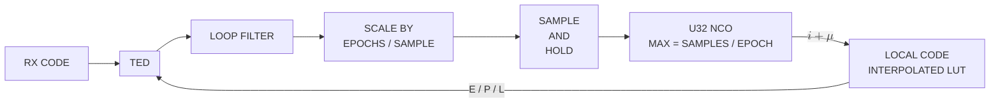
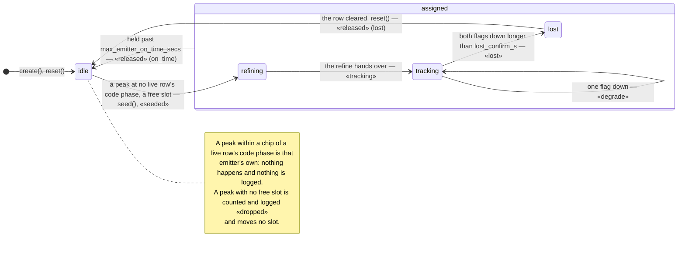

# AsyncDsssReceiver — the continuous DSSS receiver, from spec to object

*Continuous asynchronous DSSS in one page, as it stands: the waveform and
the spec (§1), the searcher (§2, §6–§7), the asynchronous despreader (§3),
the receiver (§4, §10–§11), the many-emitters-one-code use case and the
object that holds its population (§5, §8–§9), what the work measured
(§12, with [the dated record](async-dsss-receiver-measurements.md) beside
it) and what is still open (§13). Bursts are
[`burst-bank.md`](burst-bank.md)'s. A reader who wants to run the pool
starts at [the user's guide](../guide/async-dsss-pool.md).*

______________________________________________________________________

## 1. The specification

The waveform and the receiver requirements, as given:

- Level: Any
- Nominal frequency: 2.5 GHz
- Frequency uncertainty: +/- 50 kHz
- Frequency rate of change: < 500 Hz/s <sup>[(1)](#note-1)</sup>
- Waveform: Continuous DSSS BPSK
- Waveform exemplary use-case:
    - Code: CCSDS Command link Gold Code 1023 chips repeating
    - Chip rate: 3.069 Mcps
    - Modulation: Asynchronous Rectangular BPSK @ 2700 bps
- Es/N0 >= 5 dB <sup>[(2)](#note-2)</sup>

### 1.1 Target implementations

- Complete C receiver in `libdoppler.{a,so}`, to compile into C/C++
    applications.
- Complete Python receiver, the same object through the binding.

What the application wants from it: **continuous**
reception — tracking loops that run for the life of a pass, not bounded
bursts — and **parallelism on one server, not a cluster**. The server has
many cores, and the design should use as many processes and threads as
the work needs: the searcher on its own, each assigned receiver on its
own, all fed from one stream on one machine (§5, §11). What is ruled out
is the fleet — pods, a scheduler, state hopping between nodes. The
receiver's `get_state`/`set_state` remain for a checkpoint and restart
mid-pass and for handing a receiver between processes on the same box,
not for scaling across machines. The fleet and per-burst service shapes
the original spec also described belong to the burst chain and are not
this page's concern.

### 1.2 Notes on the specification

<a id="note-1"></a>**(1)** The rate bound is the standard LEO worst-case
nadir-pass figure, `f_dot_max = (f_c/c)·(v²/h)`: at 2.5 GHz and a
representative 800 km altitude it is ~579 Hz/s, so 500 Hz/s is that bound
with a small margin.

<a id="note-2"></a>**(2)** The Es/N0 floor is measured, not chosen: the
receiver's characterization
([#99](https://github.com/doppler-dsp/doppler/issues/99)) found a hard
pull-in cliff between 4 and 5 dB — 3 and 4 dB never lock (BER near
chance), 5 dB locks cleanly (BER matching theory) — independent of loop
bandwidth (`bn_car` 0.005–0.02) and of Doppler rate (0–500 Hz/s). That
cliff was measured on the coarse-hand-off pipeline, before the refining
stage of §4 existed; it has not been re-measured with it, and may sit
lower now. Treat 5 dB as the current floor, not a settled limit.

### 1.3 Derived: tracking loop bandwidths

Every tracking loop — the code DLL and the Costas carrier loop; there is
no FLL — is sized to
a loop SNR `rho ≥ 20 dB` at the Es/N0 floor, using the PLL relation
`rho(dB) = Es/N0(dB) − 10·log10(2·bn)`, where `bn` is the loop's noise
bandwidth normalised to its own update rate (`doppler.track.LoopFilter`'s
convention, so the update rate cancels). At the floor,
`bn ≤ 10^((5 − 20)/10) / 2 ≈ 0.0158`; the shipped rule is **`bn ≤ 0.01`
for every loop**, inside that bound. The code loop's per-epoch SNR is
Es/N0 scaled by `1/epochs_per_symbol`, which at this waveform is
`3000/2700 ≈ 1.11` — within 0.5 dB — so the same bound applies to it
without a separate derivation.

`bn` is not what sets the pull-in cliff of note (2): sweeping `bn_car`
across 0.005–0.02 left it unchanged. The loop-SNR derivation sizes
steady-state jitter once locked; pull-in below the floor is a separate
behaviour, and the refining stage of §4 is what addresses it.

### 1.4 A second operating point

The C++ application's continuous waveform is the same shape at different
numbers — a 1023-chip Gold code at **2 to 5 Mcps**, a DDC from **13 MSa/s** to
twice the chip rate, `D = 1`, ±50 kHz to start and likely ±5 kHz after
Doppler pre-compensation, up to ten emitters on one code at once — and a
throughput floor of 30 MSa/s, comfortably. Those numbers, and what they do to
the search and the receiver pool, are worked in §6.1 and §6.4; §11 is the
receiver's side of them.

______________________________________________________________________

## 2. Acquisition

### 2.1 User-facing API

**Two classes, `Acquisition` (continuous) and `BurstAcquisition`, over one
C engine.** Rather than one class with a `mode` and per-parameter "ignored
in this mode" caveats, each exposes only the parameters that mean
something for it. Both are thin front doors onto the same `acq_state_t` /
`acq_core.c` — state, auto-sizing, `push()` and serialization shared —
through two public constructors calling one internal builder with the
mode fixed, the secondary-constructor idiom `dll_core.h` also uses.

**One public name for the Doppler axis: `doppler_bins`.** Rolling the
shared epoch FFT by `k` bins produces a Doppler hypothesis exactly as a
slow-time FFT row does. Internally the engine keeps two fields for the
two *mechanisms*, only one of which is ever active: `coherent_bins` (the
slow-time FFT depth from coherent multi-epoch integration —
`BurstAcquisition`'s axis) and `window_bins` (roll-tiled frequency
windows, each a single-epoch FFT rolled to another hypothesis —
`Acquisition`'s axis). They are named for mechanism, not regime: the
roll-tiled axis is not computed non-coherently, and "non-coherent" here
means `n_noncoh` — repeated dwells accumulated for SNR at a fixed
hypothesis set, an axis that composes with either mechanism.

**Two sizing inputs for the coherent depth: `code_only_epochs` and
`doppler_rate`.** The continuous class runs a coherent depth `D` in blocks
inside the waveform's pure-code window (§2.3), and `D` is auto-sized as
the smaller of two bounds: `⌊(code_only_epochs + 1)/2⌋`, so a whole block
always fits in the window, and `f_epoch/√1000` from `doppler_rate`, so
the drift over one block stays inside half a slow-time bin.
`code_only_epochs` is the count of **whole** epochs a window holds at any
chip phase: the window is `W` symbols on the data clock (§5.4), which has
no fixed relation to the code clock, so a partial epoch is lost at each
edge and `code_only_epochs = ⌊W · cps / L⌋ − 1` — 813 at 5 Mcps, 324 at
2, for the 450-symbol window. It **defaults to 1**, which is `D = 1` and
exactly the engine as it ran before — a waveform with no window loses
nothing and sets nothing. Nothing else sizes it — no `doppler_resolution`, no
`max_noncoh`. `n_noncoh`
is auto-selected to meet `pd` at `pfa` and exposed read-only; its only
bound is an internal safety valve (`ACQ_N_NONCOH_SAFETY_CEILING`, 256
looks) because the semi-analytical `pd_predicted` model turns
non-monotonic past that — a modelling limit, not a sensitivity one.

#### `Acquisition` (continuous)

`doppler_bins` here is the `window_bins` mechanism (roll-tiled) for the
span, with the slow-time `coherent_bins` axis *inside* each tile for the
resolution and the gain — the two mechanisms together, which is what the
window of §2.3 makes sound. Coherent combining across *data* is a
structural mislock (task #67), and the block stride of §2.3 is what keeps
the combined epochs inside the window.

| Parameter             | Type                                   | Default      | Description                                                                                                                                                   |
| --------------------- | -------------------------------------- | ------------ | ------------------------------------------------------------------------------------------------------------------------------------------------------------- |
| `code`                | `NDArray[uint8]`                       | *(required)* | Binary (0/1) code, segment, or preamble chips to search for; sets `sf = len(code)`.                                                                           |
| `spc`                 | `int`                                  | `4`          | Samples per chip (>= 1).                                                                                                                                      |
| `chip_rate`           | `float`                                | `1e6`        | Chip rate in Hz (> 0).                                                                                                                                        |
| `symbol_rate`         | `float`                                | `1000.0`     | Continuous data-symbol rate in Hz (> 0).                                                                                                                      |
| `cn0_dbhz`            | `float`                                | `50.0`       | Carrier-to-noise density in dB-Hz (> 0) -- the sensitivity used to size the search.                                                                           |
| `doppler_uncertainty` | `float`                                | `0.0`        | One-sided Doppler search half-range in Hz; `0` = full native span (one `doppler_bin`). Tiles into `doppler_bins` windows whenever it exceeds one native span. |
| `pfa`                 | `float`                                | `1e-3`       | Target system (max-of-N) false-alarm probability, in `(0,1)`.                                                                                                 |
| `pd`                  | `float`                                | `0.9`        | Target detection probability, in `(0,1)`.                                                                                                                     |
| `noise_mode`          | `Literal["mean","median","min","max"]` | `"mean"`     | CFAR reference-cell aggregation mode.                                                                                                                         |

#### `BurstAcquisition`

The burst front door over the same engine — `doppler_bins` there is the
`coherent_bins` mechanism, auto-sized in `[1, reps]` for coherent gain over
an unmodulated preamble. It is not this receiver's concern; its parameters
and the burst chain are in
[`dsss-burst-receiver.md`](dsss-burst-receiver.md).

### 2.2 Output data structure: `DetectionEvent` (the acquisition handoff)

`DetectionEvent` is the DATA -- the acquisition handoff is the ACTION
(the process of converting a raw `push()` hit into this record and
handing it to the next block/service); the two aren't the same thing,
naming them separately on purpose.

The detection output has to be consumable by another thread or process
— the orchestrator of §5 and §11, a C++ application — not just another
Python object in the same interpreter, so it can't be the raw
grid-relative indices
(`doppler_bin`, `code_phase`) alone, since those are meaningless
without also shipping the emitting object's own config (`spc`,
`doppler_res_hz`, ...) alongside. Every field below is already
converted to a physical unit, so the record is self-contained: a flat,
pointer-free POD, safe to serialize across a thread or process boundary.
In C it is what `acq_build_handoff()` produces from a hit and what seeds
the receiver of §4.

One `DetectionEvent` record is emitted per detection event (i.e. once
per `push()` hit, on both classes -- same shape, since both share the
underlying engine):

| Field              | Type       | Description                                                                                                                                                                                                                                                                                                                                         |
| ------------------ | ---------- | --------------------------------------------------------------------------------------------------------------------------------------------------------------------------------------------------------------------------------------------------------------------------------------------------------------------------------------------------- |
| `timestamp_ns`     | `uint64_t` | UNIX time (ns) this detection's samples occurred, per the codebase's existing `dp_sample_clock_t` convention (`native/inc/timing/timing_core.h`): `epoch_real_ns + samples_consumed/fs`, NOT a fresh syscall timestamp at emit time -- reproducible, and already how `dp_header_t`/SigMF-metadata timestamps are derived elsewhere in this project. |
| `samples_consumed` | `uint64_t` | The raw sample offset (since this engine's own stream start) this detection's epoch ended at -- the `n` that `timestamp_ns` above was derived from. Kept alongside `timestamp_ns`, not instead of it: replay-safe (no wall-clock dependency) and lets a consumer re-derive/cross-check the time against its own clock anchor.                       |
| `chip_phase`       | `float`    | Code phase in CHIPS (not raw samples) -- the code-tracking seed for the next stage.                                                                                                                                                                                                                                                                 |
| `doppler_hz_est`   | `float`    | Coarse Doppler estimate in Hz, already folded/signed/scaled from the raw `doppler_bin` index.                                                                                                                                                                                                                                                       |
| `doppler_res_hz`   | `float`    | Width of that estimate -- the remaining uncertainty (±`doppler_res_hz`/2) a downstream refine/tracking stage still has to close.                                                                                                                                                                                                                    |
| `cn0_dbhz_est`     | `float`    | Estimated carrier-to-noise density (dB-Hz) -- informs downstream loop-bandwidth and dwell sizing.                                                                                                                                                                                                                                                   |
| `peak_mag`         | `float`    | Raw CFAR peak magnitude -- diagnostic/observability passthrough, not needed for tracking math.                                                                                                                                                                                                                                                      |
| `noise_est`        | `float`    | Raw CFAR noise-floor estimate -- diagnostic passthrough.                                                                                                                                                                                                                                                                                            |
| `test_stat`        | `float`    | Raw CFAR gating statistic -- diagnostic passthrough.                                                                                                                                                                                                                                                                                                |

**Timing.** `acq_result_t` carries `samples_consumed`; the timestamp is
`dp_sample_clock_t`'s `stamp_at(samples_consumed)`, and the stream layer
carries an origin timestamp hop to hop rather than re-reading a clock. The
engines themselves are clock-agnostic — pure sample-domain, no I/O — so
the anchor comes from whatever feeds them samples and is threaded through
by the composing layer (the receiver, or the orchestrator of §5).

**No `carrier_freq` parameter on either class.** The engine works in
baseband Doppler Hz throughout; the carrier-aiding scale
(`doppler_hz_est · chip_rate / carrier_freq`) is computed by the component
that knows the carrier — the tracker takes `carrier_freq_hz` itself. That
keeps the engine usable by a baseband-only caller with no carrier at all.

### 2.3 The wideband search, as settled

- **The native span is one epoch's bin.** A `D`-point slow-time FFT
    sampled at the epoch rate has a fixed `±epoch_rate/2` range whatever
    `D` is — more bins subdivide the same range, they never widen it. At
    3.069 Mcps and 1023 chips that is `chip_rate/sf` = 3.0 kHz per bin,
    a half-span of 1.5 kHz; the spec's ±50 kHz is 33 of them.
- **`D > 1`, in blocks, inside the pure-code window.** Coherent multi-epoch combining across data aliases the
    data's own spectrum across the Doppler axis and mislocks structurally
    ([`dsss-acquisition.md`](dsss-acquisition.md)). The waveform carries a
    **450-symbol pure-code window every 4950 symbols on the data clock**
    (§5.4) — 813 whole epochs at 5 Mcps, 324 at 2, at any chip phase — and
    inside it there is nothing to alias. The searcher does not know any
    emitter's window phase, so it sums **non-overlapping blocks of `D`
    epochs**, one coherent surface per block, detected per block: the `W`
    whole epochs a window holds hold a whole block whatever the block's
    phase once `W ≥ 2D − 1`, and hold `⌊W/D⌋` of them in a row for
    `n_noncoh` to accumulate — `W` is the engine's `code_only_epochs`
    (§2.1), and `D` never exceeds what it holds. A block
    that straddles data spreads that emitter over its `D` rows, about
    `10·log10 D` below an aligned block's peak at the same code phase — a
    weaker copy of an emitter the assigned table already excludes, not a
    mislock. `D` is bounded by the Doppler rate (§2.1): under 500 Hz/s the
    drift over a block stays inside half a bin while `D ≤ f_epoch/√1000`
    — **61** at 2 Mcps, **154** at 5 — which is a bin of **32 Hz** and a
    gain of **18–22 dB** at either end of the range, 8 and 3 aligned
    blocks per window, and the same 3.2 k Doppler hypotheses at both
    rates. The floor inside an aligned block is the transition-free one
    (§12.2's −21 dB), not the −13 the data case measured.
- **The uncertainty is tiled by rolling one spectrum, not by a mixer
    bank.** One forward FFT of the epoch, then the spectrum rolled by `k`
    bins per hypothesis against one precomputed replica spectrum: one
    forward plus one inverse per tile, against a forward *and* an inverse
    per tile for a bank of down-converters. Measured in the prototype at
    1.2–1.55× faster; adopted as the engine's wideband mode
    (`acq_core.c`), so all tiles come from one object's per-epoch loop.
    The engine sizes the tile count itself, odd and symmetric
    (`acq_cover_window_bins`): 35 at 3.069 Mcps over ±50 kHz, 21 at
    5 Mcps, 53 at 2.
- **What it costs is measured, per tile.** `bench_acq_core.c` times a
    real `acq_push()` per dwell on this waveform and on the operating
    point of §6.1; the number is about 10 ns per tile per output sample
    (§12.1), which is what makes the searcher's cost the same at 2 and 5
    Mcps and over a core at ±50 kHz.
- **Why the roll still carries the tiles at `D > 1`.**
    [`dsss-acquisition.md`](dsss-acquisition.md) §4 marks the roll OUT
    wherever coherent integration is viable, because a mixer bank *with*
    the slow-time transform does everything a roll *without* it does, plus
    the gain and a finer step. That compared the roll bare. Rolling by `k`
    bins is mixing by `k/nx` (the same page), so the roll *with* the
    slow-time transform inside each tile is the mixer bank with one forward
    transform shared across the tiles instead of one per tile — the 1.2–1.55×
    it measured at `D = 1` — and the `D` rows per tile are the fine step. A
    bank of DDC-fed engines is not a third option on this signal: a tile
    is a Doppler hypothesis on a spread signal 2–5 MHz wide against 50 kHz
    of uncertainty, so a per-tile DDC cannot decimate and only adds a
    mixer per tile (§6.4's 14–33× real time). §12.8 has the number.
- **A roll per thread.** The tiles are independent
    after the one forward transform: each reads the shared spectrum and
    writes its own rows of the surface, so the tile loop is a
    `dp_parallel_for` over tiles, one inverse transform and, at `D > 1`,
    one slow-time transform per tile on whichever thread takes it. The
    plan carries scratch, so each thread owns an inverse plan and a product
    buffer — a few KB — and nothing else is shared. This keeps the one
    forward transform the slice across engines repeated (§12.1's 6–11%),
    needs no LO in front of a slice, and keeps the peak list and the twin
    rule (§7.1) on **one** surface, where a slice boundary would have cut
    an exclusion zone in two. The workers are **persistent** — pthreads
    created once at `create()` and parked between pushes, a persistent
    form of `dp_parallel.h`'s bounded parallel-for beside the per-call one
    its two callers use — so the fan costs a hand-off per push, not a
    thread creation per worker, and the granularity of a push is the
    coherence's choice (§2.3), not the threading's. Thread count is the
    engine's parameter, default the core count. The per-cell passes that
    decide a surface — the magnitude, the CFAR reference, the working
    mask and every scan of the peak list — run per tile as well, each
    into a slot of its own, and merge serially in tile order (a mean of
    the tiles' means over equal cells, the first of their first maxima),
    so what stays serial is per tile, not per cell (#1243).
- **The pick is asked at the row's frequency.** A
    tile de-rotates by its own centre, so an emitter near the edge
    between two tiles leaves half a span of residual inside the epoch in
    both, and the slow-time transform folds modulo the epoch rate: the
    two neighbours read the emitter at the same row index, within
    0.03 dB (§12.18), and the pick was the noise's — one tile low or
    high half the time on the edge, one time in six 68 Hz inside it.
    The block can tell when it is asked at the row's frequency rather
    than the tile's: the engine keeps the block's raw epochs and, for
    every listed peak, correlates them with the replica at the pick's
    code phase mixed by the row's own frequency and by that frequency one
    span down and up — under half a row of residual for the truth, exactly
    one cycle per epoch for the aliases, a correlation of zero — summed
    non-coherently over the epochs so a data transition costs every
    hypothesis the same, each epoch's column walked by the hypothesis's
    own code rate. The winner is the row reported
    (`acq_resolve_tile_alias`). Three hypotheses per listed peak,
    `D * code_bins` multiply-adds each; the raw block is one more
    `D * code_bins` of memory, and it rides in the state blob so a
    mid-block resume decides as the unbroken run would. Pinned by
    `validate_acq_block_coherent --check` (an emitter on the edge, none
    handed off a tile away in twenty blocks; red by sabotage at nine of
    nineteen).
- **What it costs (§12.8).** 523 ns per output sample serially at
    `D = 154` on the operating point, 164 on four threads and 125 on
    eight — 3.6× the epoch-by-epoch searcher per sample, most of it in the
    per-cell passes that grow with the surface. The state is `D` epochs
    per tile, 53 MB per channel at either end of the range, and the
    surface 160 MB. `n_noncoh` across a window edge accumulates data
    blocks — a graceful loss, bounded by the `10·log10 D`, not a mislock.

______________________________________________________________________

### 2.4 Observability — the searcher is watched, not trusted

The searcher is the one stage nobody can check by its output alone: a
hit says where a peak was, and nothing about what else stood on the
surface, how close the gate came on the dwells that fired nothing, or
whether one emitter's splatter was about to be listed as two. So the
engine carries its own instruments, attach-on-demand like every other
object's (`Dll.set_telemetry`): detached, a decided dwell costs three
predicted-not-taken branches; nothing rides in a state blob.

- **Ten probes per decided dwell**, `set_telemetry(tlm, prefix, decim)`:
    the test statistic and the gate it was held to (`threshold`, or
    `eta_nc` on the non-coherent path — plotted together they show
    exactly where a hit fired, and how close the misses came), the CFAR
    reference, the strongest cell's value and its native row and column,
    the picks in the dwell and how many were held as same-code-phase
    twins (§7.1), the strongest pick's **concentration**, and whether the
    gate fired. `decim` thins by dwells.
- **The surface itself**, `keep_surface` then `surface(out)`: the dwell's
    whole surface, `surface_rows × code_bins`, every cell divided by the
    reference the gate used — so a cell reads as its own test statistic
    and the gate is a flat plane on a plot. `surface_doppler_hz()` and
    `surface_chip_phase()` are its axes, from the same fold and the same
    chip-phase mapping a `DetectionEvent` carries, so a plotted peak sits
    where the hand-off says. In C, `acq_set_surface_sink(fn, ctx, decim)`
    hands every `decim`-th dwell's surface to a callback on the pushing
    thread — a run of hours records the surface decimated in time without
    a copy per dwell it does not keep. The surface is normalised only
    while a reader is armed.
- **The concentration is the splatter discriminator.** One emitter does
    not make one peak: a data transition inside the epoch splits it into
    equal twins on other tiles (§12.2), and at `D > 1` a block that
    straddles a transition — or the edge of the pure-code window, which
    falls at no particular chip phase (§5.4) — spreads it over its
    slow-time rows, `10·log10 D` down and smeared across the data's
    spectrum. All of that is at the emitter's **own code phase**; a
    second emitter is a second column. So the probe is the strongest
    pick's **main-lobe** power — its row and one either side, the
    exclusion zone's width, so an emitter halfway between two tiles is
    not charged for its own scalloping — over the total power of its
    column across every tile and row: near 1 for one clean emitter,
    about 0.5 for a transition's twins two or more tiles away, lower for
    a straddling block. Beside the two-epoch
    rule it is the number that separates one emitter's splatter from two
    emitters, and the surface tap shows the same thing in two dimensions
    (§12.7 measured it on aligned and straddling blocks).

______________________________________________________________________

## 3. The asynchronous despreader

**Scope:** the receive-side despreader when the **data-symbol rate is on the
order of the code-epoch rate but asynchronous** to it. This is theory, the
failure mechanism, and a validated robust architecture that composes existing
`doppler.track` primitives. The reproducible study is
`src/doppler/examples/async_despreader_study.py`
(`python -m doppler.examples.async_despreader_study`).

______________________________________________________________________

### 3.1 The two-clock problem

A DSSS receiver despreads by integrating early/prompt/late correlations over one
**code epoch** (`TE = sf·sps` samples) — an integrate-and-dump locked to the
*code* clock. The data symbols are a separate stream; the despread prompt per
epoch carries the data.

That works when the symbol clock is locked to the code clock at an integer ratio
(GPS C/A: 20 code epochs per data bit, bit edges on epoch edges). It **breaks**
when the symbol clock is *independent*:

```
T_sym = TE · (1 + delta)        # symbol period, samples
                                # delta = symbol-vs-code rate offset
phi_sym                         # independent symbol phase
```

with `T_sym ≈ TE` (symbol ≈ one epoch). This is the hard regime: ~one symbol per
epoch, a transition roughly every epoch, and — crucially — `delta ≠ 0` makes the
symbol boundary **slide continuously** through the epoch at the beat rate
`delta / TE`.

______________________________________________________________________

### 3.2 Why per-epoch despreading fails

The coherent prompt over an epoch whose data flips at fraction `f ∈ [0,1]`:

```
P(f) = A·[ f·d1 + (1−f)·d2 ]  =  A·d1·(2f−1)        (d2 = −d1)
```

- `f → 0, 1` (flip at an epoch edge): `|P| = A` (full despread).
- `f → 0.5` (flip mid-epoch): **`|P| = 0`** — total coherent cancellation.

Because `delta ≠ 0`, `f` sweeps through every value, so ~half of all epochs
straddle a transition and their prompts collapse. The consequences:

1. **Data**: per-epoch decisions floor — the BER plateaus regardless of `Es/N0`
    (the straddle epochs carry no usable energy). Measured floor ≈ 1e-1 even when
    the bound is < 1e-5.
1. **Code**: the early/late discriminator `(|E|−|L|)/(|E|+|L|)` collapses to
    `0/0` on straddle epochs → the DLL is starved → the code loop wanders.

**Root cause:** at one prompt per epoch the symbol clock is **unobservable** (a
single sample per symbol cannot drive a timing loop), and the integration window
is forced to straddle transitions.

#### Diagnostic fingerprint

The straddle modulation is periodic at the symbol↔epoch beat. The spectrum of
the prompt-magnitude stream `|P[n]|` shows a **tone at `|delta|` cycles/epoch**
(centre panel of the figure). This is the signature to look for when a DSSS link
shows unexplained despread fades — it identifies this failure class directly.

______________________________________________________________________

### 3.3 Robust architecture


The fix gives the symbol clock its own observability and its own matched filter,
and makes code tracking insensitive to data sign — composing primitives that
already exist.

#### 3.3.1 Data path — partial correlations + symbol matched filter + SymbolSync

1. **Partial correlations.** Split each code epoch into `K` sub-epoch partial
    prompt correlations (each `TE/K` samples, known code phase). This yields `K`
    despread samples per epoch ≈ `K` samples per symbol — the symbol clock is now
    **observable**.
1. **Symbol matched filter.** A length-`K` **boxcar** over the partial stream.
    This is a *sliding, symbol-aligned* coherent re-integration of the partials —
    the full-symbol despread the epoch-locked window could not form. It is
    essential: without it, the rectangular symbol pulse is sampled at one point
    and only ~1/`K` of the symbol energy is captured (the BER floors at ~2e-2).
1. **SymbolSync.** [`track.SymbolSync`](../api/python-track.md) (Gardner TED +
    Farrow interpolator) recovers the independent symbol clock (`delta`, `phi`)
    from the matched-filtered stream and decimates at the symbol-aligned peak.

**Result (left panel):** the BER follows the BPSK matched-filter bound within
~1–2 dB. A **genie** reference (coherent symbol-aligned despread with *known*
timing) hits the bound exactly — the loss was only window misalignment, never
SNR. The broken per-epoch path floors.

| Es/N0  | bound  | genie (known timing) | partial+MF+SymbolSync | broken epoch |
| ------ | ------ | -------------------- | --------------------- | ------------ |
| 6 dB   | 2.4e-3 | 2.5e-3               | 4.5e-3                | ~7e-2        |
| 8 dB   | 1.9e-4 | 1.5e-4               | 5.8e-4                | ~6e-2        |
| 9.6 dB | 9.7e-6 | 0                    | 0                     | ~5e-2        |

#### 3.3.2 Code path — non-coherent partial combining

The DLL keeps tracking through data flips by combining the partial correlations
**non-coherently**: `|E| = Σ_k |E_k|`, `|L| = Σ_k |L_k|`. A data flip changes a
partial's *sign*, not its *magnitude*, so only the one straddling segment
degrades (~`1/K`). This roughly **halves the discriminator variance** versus the
coherent-epoch form (right panel) — keeping the (already validated, smooth
sub-chip) code loop locked. It needs no symbol timing, so it works from cold
start; the bootstrap order stays sequential: DLL (non-coherent) → SymbolSync →
data.

#### 3.3.3 Choosing K

`K` trades observability and straddle-robustness against the non-coherent
squaring/Rician bias (which erodes the discriminator gain as `K` grows). The
study shows **`K = 4` as the sweet spot** for `T_sym ≈ TE` (best discriminator
SNR; `K = 8` loses more gain than variance). `K` must divide `TE`.

______________________________________________________________________

### 3.4 Scope: the despreader removes the code and outputs samples

The despreader's one job is to **remove the PN code and output samples**. The
asynchronous symbol clock is merely *why* it despreads in `K` partial
correlations (§3.3) — it is not a reason to recover symbols here. **Carrier
recovery and symbol extraction are downstream problems**, handled by separate
objects fed from the despreader's output:

```
              ┌──────────────── the despreader ───────────────┐
acq seed →    Dll(segments=K):  E/P/L correlate · partial dump · non-coherent
   (code phase)                 (|E|−|L|) code loop
              └───────────────── partial stream out ──────────┘
                         │  K oversampled async BPSK samples/symbol
                         │  (PN removed; residual carrier + data still on them)
                         ▼
   downstream:  Costas (carrier recovery)  →  SymbolSync (symbol timing) → bits
```

This is **`track.Dll(..., segments=K)`** — no new object. `segments=1` is the
classic coherent full-epoch DLL; `segments=K>1` is the streaming async
despreader. It composes downstream with `Costas` and `SymbolSync`, which already
exist (the data path of §3 is exactly that composition).

#### Why the carrier belongs downstream

The DLL's `|E|−|L|` discriminator is **non-coherent**, so code tracking is
**carrier-blind** — it locks with a residual carrier still on the samples. And
because each output is a *partial* (a `TE/K`-sample integrate-and-dump, not a
full epoch), a residual carrier barely dents it. For a ½-Doppler-bin residual
after acquisition the I&D loss is `sinc(Δφ/2)` with `Δφ = π/segments`:

| segments | window | Δφ at ½-bin residual | despread loss |
| -------- | ------ | -------------------- | ------------- |
| 1        | `TE`   | `π`                  | **−3.9 dB**   |
| 4        | `TE/4` | `π/4`                | **−0.2 dB**   |

So short partials make the despread carrier-tolerant: the small residual just
rides out on the output (a ring in the constellation; see the gallery demo), and
a downstream `Costas` loop removes it at full symbol SNR. Putting a carrier loop
*inside* the despreader would only matter for long coherent integration — which
partials deliberately avoid.

#### The same scope rule applies to the DSSS-MPSK composition

`Dll(segments=K) -> MpskReceiver` (`docs/gallery/dsss-receiver.md`) is
the other downstream composition, and the same rule bites the same way: the
despreader's partial-correlation output rate is whatever `K*chip_rate/SF`
comes out to — a sub-multiple of the chip rate, not chosen with
`MpskReceiver`'s `sps` in mind. An early version of that gallery page
violated its own §3.4 by picking `K` specifically so
`round(K*T_sym/T_epoch)` landed on an integer, coupling `Dll`'s own
tracking parameter to `MpskReceiver`'s sample-rate requirement. That made a
perfectly good `Dll` tuning look downstream-broken. The fix is
`doppler.resample.RateConverter` between the two — an explicit, arbitrary-
ratio resample stage, the same category of fix as `Costas`/`SymbolSync`
being separate objects from `Dll` here. Choose `segments` for the
despreader's own tracking quality; choose the demodulator's `sps` for its
own reasons; bridge the two with a resampler, never by coupling the
parameters directly.

### 3.5 Code-lock detection (always on)

A tracking channel must always answer one question: *am I locked?* The DLL
carries an **always-on** lock detector that reuses **acquisition's** non-coherent
test statistic, so acquire and track agree on what "detected" means.

**Statistic.** Each emitted look (a partial in `segments` mode, the full-epoch
prompt when `segments=1`) contributes its prompt power `|P_k|²`. The detector
sums `N = n_looks` consecutive looks and forms

```
R = sqrt( 2 · Σ_{k=1}^{N} |P_k|²  /  E|O|² )
```

which under H0 (noise only) has `P(R > η) = marcum_q(N, 0, η)` — exactly the
acquisition tail. So a caller sizes the threshold `η = det_threshold_noncoherent(pfa, N)` and the depth `N = det_n_noncoh(snr, …)` to
meet a target `(Pfa, Pd)`; `configure_lock(pfa, n_looks)` does the conversion
(default `pfa=1e-3`, `N=20`).

**The noise reference `E|O|²`.** Instead of a separate noise channel, the loop
correlates each look a second time at a **random off-peak code phase** — a whole
chip offset re-drawn every epoch and kept clear of the prompt/early/late lobe by
`noise_guard` chips. For a low-sidelobe code (Gold, long PN) that offset
correlation is signal-free, so `|O_k|²` is a sample of the per-look noise power.
Cycling the offset and averaging recovers the same noise estimate a bank of
fixed off-peak taps would, with O(1) state.

**Why an EMA, and why it must be long.** The reference is an EMA of `|O_k|²`
(`E|O|² += α(|O_k|² − E|O|²)`), which is adaptive (tracks a drifting noise floor)
and O(1) — matching the `Costas` lock-metric pattern. The subtlety, found by
Monte-Carlo: the *detection* integrates a fixed `N` looks (that sets the χ²(2N)
threshold), but the *noise estimate* must average **many more** cells than `N`,
or its own variance inflates Pfa. One offset cell per look (`L=N`) drives Pfa
~400× high; `1/α = max(1024, 32·N)` (`L_eff ≫ N`) holds Pfa at target with
`Pd ≈ 0.98`. So the integration depth and the noise-averaging length are
**decoupled**: `N` is the test, `1/α` is the reference. The reference uses a
**cumulative-mean bootstrap** — it is the running average until `1/α` looks have
accrued, then relaxes to the fixed-α EMA — so the noise floor is unbiased from
the first look instead of seed-dominated for the ~`1/α`-look warm-up (otherwise
Pfa runs ~10× high until the EMA settles, ~hundreds of epochs in). Verified
end-to-end: empirical Pfa ≈ `9e-4` against the `1e-3` target right from the
start of a noise stream.

**Readouts.** `Dll.locked` (bool, latched each `N`-look decision), `Dll.lock_stat`
(the last `R`), `Dll.noise_est` (`E|O|²`). The detector runs inside the normal
`steps()` — no separate method, no opt-in. The threshold conversion (the one
`detection`-module call) lives in the binding so `dll_core` links only `-lm`.

### 3.6 The look-back window — the original working design

*The note the C `Dll`'s dwell-integral look-back was built from
(`native/inc/dll/dll_core.h` cites it as its reference); kept verbatim, in
NumPy, as the algorithm's own statement.*

> **Important:** This assumes at most one data symbol transition per code epoch



- TED generates one error per epoch using the signal power formed by correlating
    the rx signal with local code replicas E, P, and L over a window _which maximizes power_
    of the prompt correlation and forms the error:

    ```text
    code_phase_error = 0.5 * (early_power - late_power) / signal_plus_noise_power
    ```

- This requires storing a buffer of the last received samples to "look back" in the case
    where a transition occurs in the current sample buffer so a transition free epoch may be
    obtained

- This is scaled down and repeated driving the NCO at 2x chip rate

- Local code is 2 samples per chip and linear interpolation is used to compute fractional samples

- LUT outputs early, prompt, and late codes offset by 1/2 chip (1 sample)

```text

# Init
code_size = 1023
samples_per_chip = 2
max_error = 0.5 # dB async correlation loss
phases = code_size * samples_per_chip
phase_resolution = 1 - 10 ** (-max_error / 10)
phase_step = int(np.ceil(phases * phase_resolution))
factors = [i for i in range(1, phases + 1) if phases % i == 0]
phase_step = factors[np.abs(np.array(factors) - phase_step).argmin()]
windows, window_size = int(phases / phase_step), phase_step
last_backard_sums = np.zeros(windows, np.complex128)
last_early_sums = np.zeros_like(last_backward_sums)
last_late_sums = np.zeros_like(last_backward_sums)

def find_max_power(x, windows, step_size, last_backward_sums):
    """Find max correlation over different output phase offsets."""

    # First compute the partial sums of the current correlation
    partial_sums = x.reshape(windows, step_size).sum(axis=1)

    # Now sum up the portions of the windows this epoch contributes
    sums = partial_sums.cumsum()
    backward_sums = partial_sums[::-1].cumsum()

    # Use the last epochs backward looking sums and the current
    # epochs forward looking sums to comput the overlapping correlation
    # at each phase across the two epochs and keep the maximum
    correlations = np.zeros(sums.size)
    correlations[-1] = np.abs(sums[-1] / (code_size * samples_per_chip))
    correlations[:-1] = (
        np.abs(sums[:-1] + last_backward_sums[::-1][1:])
        / (code_size * samples_per_chip)
    )
    max_window = correlations.argmax()
    max_abs = correlations[max_window]
    max_power = max_abs ** 2

    # Use partial sums as integrate and dump downsampled output
    integrate_and_dump = partial_sums / (step_size * max_abs)

    # Compute window index. This is the offset from the end of the last
    # correlation window that is the start of the max power correlation
    # window.
    window_index = (windows - 1 - max_window) * step_size

    return (
        max_power,
        max_window,
        backward_sums,
        integrate_and_dump,
        window_index
    )

def get_window(x_window, x, last_x, index):

    if index:
        x_window[:index] = last_x[-index:]
        x_window[index:] = x[:-index]
    else
        x_window = x[:]

    return x_window

# In your loop

while signal_buffer,more_data:

    # NCO + interpolated LUT
    early, prompt, late = pn_gen.steps(
        pn_control
    )

    b = signal_buffer.get()
    x = b * prompt
    power, window, last_backward_sums, integrate_and_dump,window_index = find_max_power(
        x, windows, window_size, last_backward_sums
    )
    signal_plus_noise_power = power

    b_win = get_window(b_window, b, last_b, window_index)
    last_b = b[:]
    early_win = get_window(early_window, early, last_early, window_index)
    last_early = early[:]
    late_win = get_window(late_window, late, last_late, window_index)
    last_late = late[:]

    early_power = np.mean(b_win * early_win) ** 2
    late_power = np.mean(b_win * late_win) ** 2
    code_phase_error = 0.5 * (early_power - late_power) / signal_plus_noise_power
    loop_filter.step(code_phase_error)
    pn_control = np.full(loop_filter.out / (code_size * samples_per_chip))

```

### 3.7 Symbol-timing-aided lock looks — the max-power search at symbol scale

The partial-and-non-coherent form of §3.3 is forced by the data: a
full-epoch coherent look collapses on a transition, so the code-lock
detector's look was the quarter-epoch partial, the smallest integration
the asynchronous data allows when nothing is known about where its
transitions fall. That is also the weakest look. At the operating point a
partial carries −2.9 dB per look at Es/N0 5.7 dB, and the detector's
default 20 looks, sized for nothing in particular, sat below threshold.

The look-back of §3.6 already knows how to find a transition-free window:
it picks, per epoch, the one-epoch window with the most power. What it
does not know is the symbol *period*, and the receiver does — it is
`segments · chip_rate / (sf · symbol_rate)` partials, 7.24 here. With the
period the same search lifts to the symbol scale:

- `ceil(P)` boundary-phase hypotheses, each placing a boundary every `P`
    partials and owning a window of `L = min(floor(P) − 1, 4 · segments)`
    partials after it — short enough to sit inside one symbol under the
    hypothesis's quantisation, capped so a slow data clock never asks for
    coherence across more carrier than the wipe-off holds;
- each hypothesis sums its window coherently and keeps an EMA of the
    window's power over ~32 symbols; the hypothesis with the most power
    **is** the symbol timing, and its windows are the detector's looks.

A look then integrates `L` partials coherently and never straddles a
transition: six instead of one here, 7.8 dB more per look, and
`det_n_noncoh` sizes the detector at 10 looks for Pd 0.99 at the floor
instead of 161. The search needs no decision and no external timing, so it
costs nothing at cold start and follows a drifting symbol clock by itself.
An external phase from the demodulator can be accepted later as an
additive hook; it was not needed to reach the result.

The code discriminator runs on the same window. The loop steers once per
symbol on the early/prompt/late sums over the winning window, its filter
re-timed to the symbol interval so `bn` keeps its per-epoch meaning and
the tracked rate is continuous when the aid is switched on or off. What
that buys and costs is measured in §12.5: a loop about 20% faster to pull
in and tighter above 45 dB-Hz, and 1.2–1.4× the jitter at the floor,
where the noise sets it and the window's unused partials cost more than
its coherence buys — hundredths of a chip either way. The emitted partial
stream is untouched: the look-back still supplies its normalisation.

The receiver applies it at chain build: `dll_set_symbol_period` from its
configuration, `n_looks` from `det_n_noncoh` over the window at its
`cn0_dbhz`, and the drop count from `det_verify_count(1 − pd, 1e-6)` —
three consecutive misses, against the DLL's fixed two — so the verify
hysteresis is a budget, not a constant. Pinned by `test_dll_core.c` §6b
(per-partial looks up 35% of the time, aided 100%, the chosen phase within
one partial of the truth) and §6c (the loop steers on the window; the two
modes' step transients agree, which a filter left at its per-epoch gains
fails; the rate is continuous across the switch), both sabotage-proven,
and measured in §12.4 and §12.5.

______________________________________________________________________

## 4. The receiver as built

`AsyncDsssReceiver` (`native/inc/async_dsss_receiver/async_dsss_receiver_core.h`)
is the composed continuous receiver, one C object, the production port of the
validated Python `search → refine → track` prototypes. Its states, read back
through the `get_*()` family and the status record (§11.3):

- **searching** — samples feed an embedded continuous `Acquisition` (§2,
    window-tiled over `doppler_uncertainty`, `D = 1`). A hit becomes a hand-off
    through `acq_build_handoff()`, which seeds the refine stage; the unconsumed
    tail of the same call is handed straight to it.

- **refining** — a frozen-carrier derotation at the coarse estimate feeds a
    collection `Dll` whose look-back segments oversample each epoch, then a
    `RateConverter` to `CarrierAcquisition`'s own rate, then
    `CarrierAcquisition` itself. When it reports ready or gives up, the live
    tracking chain is built **fresh** from the *original* hand-off chip phase
    and the refined (or, on give-up, unrefined) Doppler.

- **tracking** — the refined carrier is unfrozen into a live pre-despread
    Costas loop (`costas_update()` once per code period, driven by a
    non-data-aided squaring discriminator over the period's coherent partials)
    → `Dll` (§3, `segments = K`) → `RateConverter` → `MpskReceiver`. Two lock
    detectors run: the `Dll`'s own CFAR-based **code lock** (`get_code_locked()`,
    §3.5) and a hysteretic **symbol lock** on the emitted symbols
    (`get_locked()`, the `cos(2φ)` statistic over a 30-symbol dwell, declared
    after 30 consecutive symbols at or above 0.5 and dropped after 15 below 0.3).

- **idle** and **lost** — the hand-off flavor's two more (§11): idle is
    waiting for a seed, lost is the release rule's verdict (§10).

`DsssReceiver` is the same object without the refining stage — a hit's coarse
Doppler goes straight to tracking — and §1.2's note (2) is why the refine
exists: the 4–5 dB pull-in cliff the coarse-only hand-off left. `reset()`
returns the searching flavor to searching and the hand-off flavor to idle:
a receiver that has locked cannot be reset back onto the same signal. Both
are serializable (`state_bytes`/`get_state`/`set_state`), every child
included.

### 4.1 The parts

- **The despreader** is `Dll(..., segments=K)` (§3.3; `segments=1` is the
    classic coherent DLL), validated carrier-present: code lock holds with
    a residual carrier on the samples, and the partial output is losslessly
    recoverable by a downstream carrier wipe and symbol despread. Its
    always-on code-lock detector (§3.5) and the symbol-aided looks (§3.7)
    are the presence flag of §10.
- **Downstream** are `Costas` (carrier), `SymbolSync` (Gardner and Farrow
    symbol timing) and `MpskReceiver` (matched filter, NDA carrier
    acquisition, timing and the acq↔track hand-over in one object); a
    `RateConverter` bridges the despreader's partial rate to the
    demodulator's `sps`, never a coupling of the two parameters (§3.4).
    `K = 4` is tuned for the code discriminator's variance; a downstream
    demodulator needs a much larger `K` (34 in the validated example) for
    coherent gain. The acquisition hand-off carries two unit conversions —
    `Dll`'s `init_chip` is phase-inverted relative to `Acquisition`'s
    `code_phase`, and `MpskReceiver`'s `init_norm_freq` is cycles per its
    own partial-rate input — spelled out in
    [DsssReceiver](../gallery/dsss-receiver.md)'s example.
- **The hand-off flavor** (§11.1), `HandoffAsyncDsssReceiver`, is a view
    over the same core with no embedded `Acquisition`: it starts idle,
    `seed(chip_phase, doppler_hz_est, cn0_dbhz_est)` starts the refine →
    track chain (a method of both flavors; refused on a receiver that
    already holds one), `reset()` returns to idle. The release rule (§10,
    §11.2) enters lost; one flag down is a degrade; the clock also runs
    from the first tracking sample, so a seed that never locks within the
    interval is released the same way. While the interval runs the loops
    hold (§10).
- **The status record** (§11.3), `status()` on both flavors: state, the
    live Doppler, chip phase, code rate, C/N0, both flags with the
    symbol-lock metric and threshold, both residual carrier errors, and the
    two clocks in input samples. No timestamp (§8.1).

Every part is pinned in `test_async_dsss_receiver_core.c`,
`test_async_dsss_receiver.py`, `test_dll_core.c` and `test_dll.py`; what
the parts do together is §12's.

______________________________________________________________________

## 5. The continuous case — the C++ application's waveform

The C++ application does not receive bursts. It receives **continuous**
DSSS with asynchronous data — the CCSDS command-link shape §1 specifies
(a 1023-chip Gold code, 3.069 Mcps, ±50 kHz) — and the stream carries a **data-free
period of one code period just before each frame sequence**. Several
emitters are in the air at once on the **same** Gold code, and what tells
them apart is Doppler: each emitter's frequency difference *is* its
Doppler. There is **one frequency channel**: every emitter is in the same
band on the same code, and what distinguishes them is **code phase, power
and Doppler**.

### 5.1 What the data-free window changes

Everything the burst family assumes about a preamble holds for that window
and for nothing else in the stream:

- **There is no coherent gain to buy.** The data-free window is one code
    period, so `reps = 1` and the coherent depth is one epoch — exactly the
    continuous `Acquisition` engine's search (`D = 1`, sensitivity from
    non-coherent looks, `dsss-acquisition.md`'s warning). The window buys
    one clean epoch without a data transition inside it, which the
    continuous engine already prices as a straddle loss and survives. The
    bank's reason to exist in this use case is therefore **not** gain —
    §5.3 says what it is.
- **The hand-off is to a tracking receiver, not to a frame demodulator.**
    A burst ends; a continuous signal is tracked from the seed onward
    (`carrier_acq → Dll + Costas`, the monolithic C receiver). So the
    channel's product is the `DetectionEvent` the async spec defines —
    Doppler, code epoch, C/N0 — and the window copy `BurstCapture` makes is
    not needed for the signal's sake. What may still be needed is the
    capture's **refine**: the frame begins where the data-free window ends,
    so *which* code period the window ended on is the frame epoch, and
    acquisition alone cannot say (§3.1 of the receiver design). Whether
    the tracking receiver's own frame sync makes that redundant is
    §5.4's third question.
- **The channel repeats.** A burst is acquired once; a continuous signal
    is re-acquired at every data-free window, and between windows it drifts
    (< 500 Hz/s in the spec). The claim rule across windows is then
    "same signal, next frame", not "same preamble".
- **Emitters come and go, at their own frequencies, and the bank is
    always on the air.** An emitter comes into view in the band at some Doppler,
    is acquired at its next data-free window, is handed to a tracker, keeps
    transmitting while others come into and leave view around it, and eventually
    leaves. The bank never stops searching: a channel that has handed one
    emitter off must go on watching its band for the next, and an emitter
    that drops out must be noticed and re-acquired when it returns. That is
    a **lifecycle** — searching → acquired → tracked → lost → searching —
    the burst family has no state for; a `BurstCapture` is done when the
    window is out. It is also a **duration** requirement: the process runs
    for hours or days, so nothing in the bank may grow with time
    (`samples_fed` is 64-bit; the per-push scratch reaches its high-water
    mark and stays; the rings are fixed) and a checkpoint is for a restart
    mid-pass, taken while everything is live.

### 5.2 The numbers, from the spec and `burst-bank.md` §10.4

- Native span `3.069e6 / (2·1023)` = **1.5 kHz**; channel spacing 3.0 kHz;
    covering ±50 kHz takes `2·ceil(50/3)+1` = **35 channels** — one bank,
    since there is one code.
- At `spc = 2` the source is 6.14 MSa/s; at `burst-bank.md` §10.4's 48 ns/sample a channel
    is **0.29× real time**, so the bank is **~10× real time** — eight cores
    at the measured 5.8× pool speedup do not keep up. Two things follow:
    the C++ application's own threads (`burst-bank.md` §10.1, the primary path) are not
    optional, and the per-channel cost is the number to attack first — 48
    ns/sample was measured for `DDC → BurstCapture`, and a channel that
    hands off a `DetectionEvent` rather than a window needs neither the
    capture's ring nor its refine.
- The continuous engine's own `window_bins` tiling covers ±50 kHz in
    **one** engine at the same `D = 1` — the same tiling this bank does
    with DDCs, at the same sensitivity. What the single engine cannot do is
    §5.3's first item, and that, not gain, is what the `K`-fold cost buys.

### 5.3 The async tools, and what the bank adds to them

The continuous chain exists and is the thing to compose, not to rebuild.
`AsyncDsssReceiver` is one object with a three-state machine — **searching**
(the continuous `Acquisition`, window-tiled over the uncertainty),
**refining** (`acq_build_handoff` → a frozen-carrier `Dll` →
`CarrierAcquisition`), **tracking** (Costas → `Dll` → `RateConverter` →
`MpskReceiver`) — and it is the validated C port of the search → refine →
track prototypes. `DsssReceiver` is the same without the refining stage.
Both cover the whole ±50 kHz in one engine at `D = 1`.

So the C++ application's channel is not `DDC → BurstCapture`. Against what
already exists, the bank adds exactly three things, and each is a design
decision rather than a given:

- **Resolution on the (Doppler × code phase) surface.** Every emitter
    is a peak on the same 2-D surface a channel already computes, at its
    own Doppler bin and code phase, with its own power. A Doppler bank
    partitions one axis of that surface: emitters more than a span apart
    land in different channels and are found independently, with
    independent CFAR references. But emitters *within* a span — the normal
    case, since there is one band and only Doppler separates them — share a
    surface, and a detector that takes the **maximum** of it reports one
    of them per dwell, the strongest, and masks the rest. So the channel's
    detector must report **every** peak above threshold in a dwell, each
    with an exclusion zone around it (a bin in Doppler, a chip in code
    phase) so one emitter is not reported as several — the peak list of
    §7.1. Then **power**: a 1023-chip Gold code's
    cross-correlation floor is about −24 dB — on the searcher's actual
    surface, with data and a Doppler straddle, **−13 to −16 dB** (§12.2) —
    so an emitter that much weaker
    than the strongest in the same surface sits under the strongest one's
    sidelobes and is found only by cancelling the strong one first
    (successive interference cancellation) — and two emitters at the same
    Doppler *and* code phase within a chip are one peak, distinguishable by
    nothing. §5.4's seventh question is therefore answered: emitters do share a span,
    and the bank's channel count buys parallel surfaces and independent
    references but not resolution; the resolution is the detector's, per
    surface, and it is the piece to design.
- **Many emitters, one band.** One `AsyncDsssReceiver` tracks one signal.
    Something must hold the pool: which emitters are up, which tracker
    each went to, and when it stopped being heard. That is the pool of
    §8.2.
- **The frame epoch.** The refining stage recovers carrier, not which code
    period the frame started on; if the application needs that from the
    bank, it is the capture's refine, transplanted.

Everything else — the DDC, the tiling rule, the tracker, the hand-off
record — is already there.

**Two rules fix the channel's shape:**

- **It always has to be searching.** A channel never stops acquiring: the
    emitter it just handed off keeps transmitting in its band while a
    second one comes into view beside it, and the first one's loss has to be noticed
    by something that is still looking. That rules out
    `AsyncDsssReceiver` as the channel — its state machine *replaces* the
    search with refining and then tracking, feeding every sample to the
    tracker. In the bank, search and track are **concurrent** per channel:
    the search engine runs on every block, and each hand-off spawns a
    consumer that is fed the same samples beside it. Two things follow. A
    channel that keeps searching re-detects the emitter it handed off at
    every data-free window, so something must recognise "that one is
    already handed off" — a suppression keyed by emitter (its Doppler and
    code phase), the analogue of the capture's `suppress_until` keyed by
    time — and that is the bank's, which settles the *minimum* of question
    5\. And the per-channel cost in §5.2 is the search alone; each tracked
    emitter adds a tracker's cost on top, on the application's threads.
- **The hand-off logic is selectable.** What a detection becomes is a
    policy, not a property of the channel: hand a `DetectionEvent` to a
    tracker (this use case), capture a window for a frame demodulator (the
    burst use case), or report and do nothing (surveillance). The channel
    owns the search and the event; the policy owns what happens next and
    is chosen per bank, possibly per channel. This answers question 1 —
    the channel is `DDC → search`, and `BurstCapture`'s ring and refine are
    one *policy's* apparatus, attached only when that policy is selected.

### 5.4 The questions, answered

1. **Hand-off target:** selectable — a policy on the detection (track /
    capture a window / report), not a property of the channel. The
    channel is `DDC → search`, always searching.
1. **One Gold code per signal:** one Gold code, shared; emitters differ by
    Doppler. One bank; the multi-signal case is *within* it.
1. **The frame epoch:** partly. The block that detects an emitter lies
    inside its window, which locates the window to within `D` epochs; the
    exact boundary is the tracking chain's to find, and the receiver is
    not told it (§8.2). Open in §13.
1. **The data-free window's length:** 450 symbols of code only, then
    4500 of data — a frame of 4950 symbols on the data clock, with no
    fixed relation between the chip and data clocks: a frame edge falls at
    no particular chip phase, never on a code epoch. One (re)acquisition
    opportunity every 1.83 s at any chip rate, up to 0.92 kHz of drift
    between them at 500 Hz/s; in whole epochs the window is 813 at 5 Mcps
    and 324 at 2, long enough for any coherent depth the Doppler rate
    allows (§2.3), and it is why the searcher has one.
1. **Who owns the lifecycle:** a C object in doppler, the pool of §8.2,
    owns the receivers and the assigned table; the receiver's half — how
    "gone" is decided and what it releases — is §10.
1. **How many emitters at once, and for how long:** at least one always
    on, up to 10 at once, each on for 5 to 15 minutes and never more than
    15 — a bound, and an adjustable one (§6.1).
1. **Can two emitters sit within one span of each other?** Yes — one
    frequency channel, one code; emitters are separated by code phase,
    power and Doppler on one surface, so the searcher reports every peak
    per dwell with exclusion zones (§7.1). The **power spread** between
    emitters that are up at once decides whether that suffices: inside the
    floor it does; beyond it the weak ones need the strong ones cancelled
    first. The floor is −13 dB in the operating case, not the Gold bound's
    −24 (§12.2), and −21 inside the pure-code window the searcher detects
    in; the spread is **10 dB**, inside the floor, so the list branch ships
    and no cancellation object is built (§9).

______________________________________________________________________

## 6. The searcher — every emitter on one surface

### 6.1 The operating point

The C++ application's waveform fixes the frame this page works in, and none
of it is re-derived here (§5):

- **One Gold code, one frequency channel.** Every emitter is on the same
    1023-chip code in the same band; what tells them apart is Doppler, code
    phase and power — three coordinates on **one** (Doppler × code phase)
    surface, the surface a channel already computes.
- **A 450-symbol pure-code window every 4950 symbols.** The search is
    the continuous engine's, run in coherent blocks inside that window
    (§2.3): 18–22 dB of coherent gain, a 32 Hz Doppler bin, and the
    transition-free floor, at a cost the engine already pays per tile.
- **The channel always searches.** It never hands its samples over to a
    tracker and stops; search and track are concurrent.
- **The hand-off is a policy** — track, capture a window, or report — chosen
    per bank, and not a property of the channel.
- **The population**: **at least one emitter is
    always on**, there may be **up to 10 at once**, and each is on for **5
    to 15 minutes** — **15 minutes is the maximum on-air time of a single
    emitter**, and it is **adjustable**: the
    pool's `max_emitter_on_time_secs` (§8.2), the soak's draw (§12.14)
    and the false-release budget (§10) all take it as a parameter,
    whose default is the one constant `MAX_EMITTER_ON_TIME_SECS = 15*60`;
    nothing else bakes it in. So the surface never has fewer than one
    peak, has up to ten, and an emitter comes into or leaves view about once a minute
    at the full population. **An emitter transmits continuously, and coming into view is not
    powering up**: it appears at whatever point of its frame it has reached, mid-payload as
    often as not, and its first window arrives at its own phase,
    uniformly within one frame — so the acquisition latency after an emitter appears
    is bounded by a frame (1.83 s) and averages half
    of one. Every window of every emitter is a re-acquisition
    opportunity, and an emitter appearing between two of them is the normal event the
    searcher exists for. The receiver pool is sized at ten plus release
    headroom (§10), and the soak's population is this one (§12.14).
- **The rate**: all of it — the front end, the
    searcher, every receiver, and the cancellation if it is built — must
    run **comfortably at 30 MSa/s or more**, and running at exactly 30
    MSa/s counts as slow. That is the machinery's floor; the waveform's
    own operating point is below it (13 MSa/s in, next table), and the
    page prices every option at both (§6.4), not as a benchmark to run
    at the end.

The numbers the page is worked at — these
supersede §5.2's, which were the async spec's waveform:

| quantity                       | value                                                                                                                                                          | from                                                                                                                                            |
| ------------------------------ | -------------------------------------------------------------------------------------------------------------------------------------------------------------- | ----------------------------------------------------------------------------------------------------------------------------------------------- |
| chip rate                      | **2 to 5 Mcps** — design to the worst case, which is per quantity: 5 Mcps for anything priced per sample, 2 Mcps for anything priced per tile                  | given                                                                                                                                           |
| code                           | 1023 chips → one epoch is **204.6 µs** at 5 Mcps, **511.5 µs** at 2                                                                                            | given                                                                                                                                           |
| pure-code window / frame       | **450 / 4950 symbols** on the data clock — 167 ms / 1.83 s at any chip rate; 813 / 8960 whole epochs at 5 Mcps, 324 / 3584 at 2; a frame edge at no chip phase | given — in symbols, no epoch alignment                                                                                                          |
| coherent depth                 | **`D ≤ f_epoch/√1000`** in non-overlapping blocks: **154** at 5 Mcps, **61** at 2 — a 32 Hz bin, 3 and 8 aligned blocks per window                             | the Doppler rate (< 500 Hz/s) over one block, §2.3                                                                                              |
| DDC input                      | **13 MSa/s**                                                                                                                                                   | given — chosen to force the arbitrary-ratio path (§6.4)                                                                                         |
| DDC output                     | **2× chip rate**: 10 MSa/s at 5 Mcps, 4 at 2 (`spc = 2`)                                                                                                       | given; the ratios 1.3 and 3.25 both lack an integer factor                                                                                      |
| samples per epoch              | 2046, at every rate                                                                                                                                            | `1023 · spc`                                                                                                                                    |
| chip pulse                     | **rectangular** — no pulse shaping on the chips                                                                                                                | given; every §12 harness renders rect chips and correlates against a rect replica                                                               |
| Doppler tile                   | `1/T_epoch` = **4.89 kHz** at 5 Mcps, **1.96 kHz** at 2; a tile spans ± half that, subdivided into `D` rows of 32 Hz                                           | the `window_bins` tile index × the slow-time row                                                                                                |
| uncertainty                    | **±50 kHz to start**; Doppler pre-compensation will likely bring it to **±5 kHz**                                                                              | given — design at the full width, and record what the narrow one saves                                                                          |
| tiles over ±50 kHz             | **21** at 5 Mcps, **53** at 2                                                                                                                                  | the engine's own rule, `acq_cover_window_bins`: `2·ceil((U − span)/(2·span)) + 1`, measured in §12.1; the searcher's worst case is the low rate |
| tiles over ±5 kHz              | 3 at 5 Mcps, 7 at 2                                                                                                                                            | same rule, after pre-compensation                                                                                                               |
| cores                          | **at least 48** on the one server                                                                                                                              | given — the population's ~7.6 cores at the operating point and ~17 at the floor (§12.1) are a third of the box, not a fit                       |
| budget, one core, operating    | **77 ns per input sample**; per output sample **100 ns** at 5 Mcps, 250 at 2                                                                                   | `1/13e6`, `1/10e6`, `1/4e6`                                                                                                                     |
| budget, one core, at the floor | **33 ns per input sample**; 43 per output at 5 Mcps                                                                                                            | `1/30e6`, same ratio                                                                                                                            |

The running system, in the application's words, is the lifecycle the
policy serves and the shape everything below is fitted to:

> The acquisition part continuously looks for signals, and async receivers
> track them as they are found, until they are gone. A receiver does not
> stop tracking once it has been assigned.

So there are two kinds of thing on the air side of the bank. A **searcher**
per channel (`DDC → search`), which runs on every block for the whole life
of the process. And a pool of **async receivers**, one per emitter, each
spawned by the track policy from one detection, fed the same samples as the
searcher, and living from that hand-off until *its own* loss decision — the
searcher never stops one, never re-seeds one, and never assigns a second
receiver to an emitter that already has one. The searcher's product is
therefore not "the strongest signal present"; it is **every emitter present
that is not yet assigned**, per dwell.

The receiver is `AsyncDsssReceiver` (§4) in its hand-off flavor (§11.1):
the searcher's detection arrives from outside as the hand-off and the
receiver's own `Acquisition` never runs — a difference in constructor, not
in method, the `ddc`/`MatchedDDC` shape. "Until they are gone" is the
receiver's own decision, on its two lock flags (§10).

### 6.2 What one maximum per dwell loses

The classic detector reports one cell: the maximum of the surface, gated
— `det_result2d_t` on the burst detector, and on the acquisition engine
the two maxima [`dsss-acquisition.md`](dsss-acquisition.md) §9.1
describes, the interpolated one to gate and the native one to report.
That is still what both do at `max_peaks = 1`, the default; §7.1 is the
list that closes the gap this section is about, and §8 (a) is where it
lives — one `det_peak_list` beside `det_noise_estimate` in
`det_private.h`, under both detectors, with `Acquisition.set_max_peaks`
as the engine's face of it (measured in §12.6).

With `K` emitters up, the surface has `K` peaks, and a maximum reports the
strongest. The rest are not below threshold; they are simply not looked
at. In the burst use case that costs little — bursts are short and rarely
overlap in one channel. In the continuous case the strongest emitter is up
for hours, and every dwell for those hours reports it and nothing else, so
a second emitter appearing beside it is **never** acquired while the first is
on the air. Nor does hand-off help: the assigned receiver goes on tracking
the first emitter, the searcher goes on re-detecting it at every data-free
window (the suppression-by-emitter §5.3 asks the bank
for), and after the suppression drops that re-detection the dwell has
reported nothing at all. **The single maximum is the gap, and it is the
searcher's, not the bank's** — the bank's channel count partitions Doppler
into spans, but emitters within one span share a surface, and that is the
normal case here.

### 6.3 What the power spread decides

Two emitters at different Dopplers or code phases are two peaks on the
surface, and a detector that reports every peak above threshold finds
both — provided the second *is* a peak above threshold. A strong emitter
does not only put one peak on the surface: a 1023-chip Gold code's
cross-correlation with itself at every other lag is not zero, and the
bound for that floor is **about −24 dB** below the peak
(§5.3), and §12.2 measured it on the engine's own surface: exactly that
where the bound applies, and **−13 dB** once the emitter carries data and
sits off its tile's centre — the operating case. That floor
lies across the whole surface — every Doppler bin, every code phase — so an
emitter weaker than the strongest by more than the floor plus the
detection margin is under the strongest one's sidelobes: it is not a peak,
and no peak detector reports it.

Two things follow, and they are why the mechanism forks on the spread:

- **The CFAR reference is right to rise.** `det_noise_estimate` measures
    the surface's floor, and with a strong emitter present that floor *is*
    the strong emitter's sidelobes. The threshold moves up with it, which
    is what CFAR means — the weak emitter is genuinely below the floor of
    the surface as it stands.
- **Only removing the strong emitter lowers that floor.** A peak list
    cannot; that needs cancellation, and cancellation needs a replica of
    the strong emitter — which is a different object with a different
    information source (§7.2).

So the decision is the emitters' **power spread** (§5.4's seventh
question). Inside the floor a peak list suffices; beyond it the weak
emitters need the strong ones cancelled first. This page covers both
branches (§9); the spread is 10 dB, inside the floor.

The −24 dB is the three-valued bound for a full-period, zero-Doppler
cross-correlation, and §12.2 shows why it is not the design number: a
data transition inside the epoch or a half-tile Doppler offset — the
searcher's normal case — raises the worst cell at another code phase to
−16 dB, and both together to −13. The fork below is at **−13 dB**.

### 6.4 The throughput floor

At the operating point one core has **100 ns per DDC-output sample** for
everything after the front end, and **77 ns per input sample** for the
front end itself; at the 30 MSa/s floor those are 43 and 33 ns.
"Comfortably" means a margin under that, and this page takes **half** as
the working target — the whole population inside 50 ns per output sample
per core at the operating point, 21 at the floor, across the cores the
application gives it — with the margin a number the benchmark reports,
not one it assumes. Equality with the budget is a failure by the
requirement's own words.

The decimation is only 1.3× at the top of the rate range, and that is
the fact that shapes the cost: **nothing runs at a fraction of the input
rate.** At 5 Mcps the searcher and every receiver run at 10 MSa/s,
three-quarters of what the front end sees, so the population's cost is
`(searcher + 12 receivers + 10 replicas)` per output sample, not that
divided by anything. The rate range splits the worst case in two. Every
receiver and every replica is priced per output sample, so their worst
case is **5 Mcps**. The searcher is priced per tile per output sample,
and tiles go up as the rate comes down — 21 at 5 Mcps, 53 at 2 — so its
tile-samples per second are nearly the same at both ends (210 M against
212 M over ±50 kHz) and its worst case is **the low rate, by a small
margin, at the full uncertainty**. Doppler pre-compensation to ±5 kHz
takes the searcher to 3 or 7 tiles, an eightfold cut in its cost and none
in anyone else's; the page designs at ±50 kHz and §12.1 records both.

The per-stage numbers are measured (§12.1): the searcher over ±50 kHz is
**2.1× real time on one core** at either chip rate, one tracking receiver
is **0.44 of a core**, and the arbitrary-ratio front end is 0.18 — so the
chain is over the budget on one core before the population is on it, and
the population is about 7.6 cores at the operating point. Three things
follow for the shapes, and the first two are now requirements rather than
expectations:

- **One front-end DDC, shared, on its slowest path — on purpose.** There
    is one frequency channel, so the only stage at the input rate is one
    conversion, 13 to 10 MSa/s. That ratio was chosen for the budget, not
    the radio: the `DDC`'s `RateConverter`
    builds the cheapest cascade the ratio allows — CIC, halfband, then a
    polyphase resampler — and 1.3 has no integer factor, so no CIC or
    halfband stage exists and the whole conversion runs through the
    **polyphase arbitrary resampler**, the most expensive sample the front
    end can produce. The budget is therefore priced with the slow path
    baked in; a deployment whose rate happens to give an integer factor
    can only be cheaper, and a bench that ran at a convenient ratio would
    have measured the wrong front end. The receivers take chip-rate input
    already (`AsyncDsssReceiver` ingests at `chip_rate · spc`), so they
    share this one front end rather than each owning one.
- **The searcher is one window-tiled engine, not a DDC bank.** A bank of
    21 to 53 `DDC → search` channels at anything like 48 ns each is 14
    to 33× real time at the operating point on one core and fits on no
    node; the
    continuous engine's own `window_bins` tiling covers the uncertainty
    in one engine at the same `D = 1` sensitivity (`burst-bank.md`
    §11.2), and with the peak list inside it (§8 (a)) it lacks nothing
    the bank had for this use case. That is a change to what §11.2
    assumed, and the throughput floor is what forces it.
- **The receivers are the population's cost, and they parallelize; the
    cancellation does not.** Twelve receivers at 10 MSa/s on the
    application's threads scale across cores; the replicas on the strong
    branch are subtracted on the searcher's path, serially, ten of them
    per block — so (iii)'s coupling has a per-sample price on one
    thread, and it is the searcher's.

The population as one run, behind the shipped DDC and counting what it
tracked beside the rate (§12.17): 4.1× real time at the operating point
and 9.5× at the floor on twenty threads, all ten emitters tracked — the
requirement missed by its own words, and the block searcher's depth
(§12.8) the stage to attack.

______________________________________________________________________

## 7. The two mechanisms

### 7.1 The peak list with exclusion zones

The list is the maximum, iterated:

```text
repeat up to max_peaks times
  take the maximum of the surface
  if it is below eta · noise_est: stop
  if it is within ±1 chip of a listed peak's code phase, at any tile:
     hold it as that emitter's twin; list it only if it is still there,
     at the same tile, on the next epoch
  report it (at its native row where the surface is interpolated)
  exclude ±1 Doppler bin × ±1 chip around it
```

The second rule exists because one emitter makes more than one peak
(§12.2): a data transition inside the epoch splits it into equal
twins two or more tiles apart, and a half-tile Doppler offset throws a
−9.5 dB sidelobe two tiles away — every one at the emitter's own code
phase. A twin moves with the transition's position from epoch to epoch and
is absent in the emitter's data-free window; a real second emitter at the
same code phase stays at its tile. So the rule holds a same-phase peak for
one epoch rather than dropping it, and costs no resolution at other code
phases, where the adjacent tiles remain candidates.

The Doppler axis is the `window_bins` tile index, `1/T_epoch` apart —
4.89 kHz at 5 Mcps, 1.96 at 2 — with `D` slow-time rows inside each tile
(§2.3), so the interpolated-vs-native split of `dsss-acquisition.md` §9.1
applies as on the burst engine: the gate reads the interpolated slow-time
axis and the report is the native row. (§12.6 measured the list at
`D = 1`, where the two collapse.)

**Why one bin and one chip.** They are the widths of one emitter's main
lobe: an epoch's frequency response is the `sinc` of a one-epoch
rectangle, whose first nulls fall one tile (`1/T_epoch`) either side, and
the code's autocorrelation triangle reaches zero one chip either side of
its apex. Inside that zone the surface belongs to the emitter just reported —
its own shoulders would otherwise be the next "peak" — and outside it a
second emitter has its own maximum. The zone is therefore also the
detector's **resolution**: two emitters within one bin *and* one chip of
each other are one peak, distinguishable by nothing on this surface
(§5.3), and that is a property of the code and the dwell,
not of the detector. In surface units the zone is `±interp` rows (one
row at `D = 1`) and `±spc` columns — two, here — circular in code phase;
on the native report it is `±1`
and `±spc`.

**The threshold does not change.** `eta` is sized from `N = searched_bins · code_bins` cells (`dsss-acquisition.md` §9.1); it counts the noise's
chances over the *surface*, and a second reported peak is another draw
from the same cells against the same gate, so the per-dwell false-alarm
event — *any* reported peak is false — is bounded by the same union.
Exclusion zones remove a few cells from the count, in the safe direction
and negligibly. What does change is the floor under a strong emitter
(§6.3): the reference rises, so does `eta·noise_est`, and false peaks in
the strong emitter's sidelobes were measured in §12.6.

**Fixed size.** `max_peaks` is configuration; a dwell's list is up to
that many `acq_result_t` records from `push()`, strongest first, sharing
the dwell's `samples_consumed` and `noise_est`; nothing allocates per
dwell and nothing grows with time — the duration rule of §5.1. The
classic single-peak result is the same list at `max_peaks = 1`, the
default. A held twin takes one of the slots that dwell without being
reported. The population sizes it: on the branch where the searcher sees
every emitter (§9) the list must hold all ten plus the false peaks the
gate admits, so `max_peaks` is of order 16; on the branch where assigned
emitters are cancelled it holds only what rose since the last window, a
few.

**In the code.** `det_peak_list` (`native/inc/detector/det_private.h`) is
the iterated maximum with the zone, circular on both axes, over a
caller-initialised mask; the engine seeds the mask with the cells outside
its searched band, sets the gate in the surface's own units (`eta · noise_est` on the coherent surface, `eta_nc² · noise_pow / 2N` on the
non-coherent one), maps each pick to its native row within its own zone,
and applies the two-epoch rule with the held candidates carried in the
state blob (v2). `Acquisition.set_max_peaks(n)` /
`BurstAcquisition.set_max_peaks(n)` set the capacity, 1 to 64. Pinned by
`test_acq_core.c` (the primitive on a synthetic surface; the API and the
blob) and `validate_acq_peak_list --check` (two emitters, the split twin
held then listed, twins under PRBS data, the rate under noise), measured
in §12.6.

### 7.2 Cancellation

Cancellation subtracts a replica of a strong emitter so the surface
underneath it can be searched. The replica needs the emitter's code phase,
Doppler, amplitude and **carrier phase** — and, for any epoch that is not
that emitter's own data-free window, its **data**. That last item decides
the shape, because emitters' frames are not aligned: while emitter A is in
its data-free window, emitter B is carrying data, and B's contribution to
A's dwell is a data-modulated, straddle-lossed correlation whose sign flips
at a place the searcher does not know.

Where the replica's information comes from is therefore the design axis:

- **From the peak** (acquisition-side). The detection gives code phase and
    Doppler to within a cell; amplitude and phase must be estimated from
    the complex peak; the data is unknown. Exact only in the strong
    emitter's own data-free epoch — which is not, in general, the epoch
    being searched.
- **From the assigned receiver** (decision-directed). The receiver already
    tracking the strong emitter knows its chips, its carrier, its
    amplitude, and its decided bits, block by block, and refines all of
    them continuously. Its replica is exact to the tracker's own error,
    data included.

And where the subtraction happens is the second axis: on the **surface**
(subtract the emitter's known response, the code's autocorrelation across
lag times a `sinc` across Doppler, scaled by the complex peak — the radio
astronomer's CLEAN) or on the **samples** (regenerate the chip stream,
subtract, correlate again).

______________________________________________________________________

## 8. The shapes — where each piece lives

The air side of the bank, end to end, as built — every box is a shipped
object and every number the operating point of §6.1:


No replica leaves a receiver and nothing is subtracted before the
searcher: the operating spread is inside the knee (§9, §12.6), so branch
one is what shipped and §11.4 is not built. The lifecycle of one slot is
§8.2's state diagram; the measurement that certifies the whole is §12.14.

The peak list has one place it belongs and two it could be put:

|                                                 | mechanism                                                                                                                                                                                                    | fits                                                                                                                                                              | cost                                                                                                                                                                                   |
| ----------------------------------------------- | ------------------------------------------------------------------------------------------------------------------------------------------------------------------------------------------------------------ | ----------------------------------------------------------------------------------------------------------------------------------------------------------------- | -------------------------------------------------------------------------------------------------------------------------------------------------------------------------------------- |
| **(a) one primitive under both detectors**      | a peak-list function beside `det_noise_estimate` in `det_private.h`: `(mag, ny, nx, gate, excl_rows, excl_cols, mask, out[], max_peaks) → count`; both callers use it, the burst detector at `max_peaks = 1` | one argmax instead of the two private copies; `CorrDetector2D` can gain the list when it needs it; the interpolated/native split stays where it is, in the caller | `acq_result_t` is unchanged — a dwell is up to `max_peaks` records sharing `samples_consumed` — and `det_result2d_t` is untouched; the cost is the mask and the held table, fixed-size |
| **(b) inside `acq_compute_stat` only**          | the engine's loop iterates with exclusion; `detector2d` stays single-peak                                                                                                                                    | the engine alone changes                                                                                                                                          | a third private copy of the pick, and the two detectors' behaviours diverge on the same surface                                                                                        |
| **(c) a second pass over the surface, outside** | the bank asks the engine for its surface and picks peaks itself                                                                                                                                              | no engine change                                                                                                                                                  | the surface is the engine's scratch, not a product — exporting it is a copy of `ny·nx·interp` floats per dwell, and the gate's `eta` leaves the engine                                 |

(a) is the repository's rule applied — fix it where the primitive is
defined, once — and the only one under which the burst detector and the
acquisition engine keep agreeing. It is what shipped (§7.1, as built).

Cancellation is a separate object, and its shape follows its information
source:

|                                                             | mechanism                                                                                                                                                                                                                                       | fits                                                                                                                                                                                                                      | cost                                                                                                                                                                                                                                                 |
| ----------------------------------------------------------- | ----------------------------------------------------------------------------------------------------------------------------------------------------------------------------------------------------------------------------------------------- | ------------------------------------------------------------------------------------------------------------------------------------------------------------------------------------------------------------------------- | ---------------------------------------------------------------------------------------------------------------------------------------------------------------------------------------------------------------------------------------------------- |
| **(i) surface CLEAN, from the peak**                        | subtract `A·acf(τ − τ_i)·sinc(f − f_i)` from the *complex* surface for each strong peak, then re-pick                                                                                                                                           | no second correlation; stays inside the engine                                                                                                                                                                            | needs the complex surface where the engine keeps `\|·\|`; the response is exact only in the strong emitter's own data-free epoch, and a data transition inside the dwell leaves a residual the model does not have                                   |
| **(ii) sample SIC, from the peak**                          | regenerate the strong emitter from its detection, subtract from the epoch, correlate again                                                                                                                                                      | one object, no dependency on the tracker pool                                                                                                                                                                             | one extra correlation per cancelled emitter per dwell; the same unknown-data residual as (i); amplitude and phase from a single cell's estimate                                                                                                      |
| **(iii) sample cancellation fed by the assigned receivers** | `DDC → cancel(assigned) → search`: each assigned receiver publishes its replica for the block (or the estimates that make one: code phase, Doppler, amplitude, phase, decided chips); the searcher subtracts every replica before it correlates | the only replica that is right through data; makes the searcher see **exactly what is not assigned**, which retires the suppress-by-emitter table (§5.3) — an assigned emitter is not re-detected because it is not there | couples the searcher to the receiver pool on the push path; a receiver that has lost lock publishes a wrong replica, so the subtraction must be lock-gated; one replica per assigned emitter per block; and the *receivers* still see the raw stream |

(iii) is the shape the lifecycle already asks for. The receivers own the
emitters and keep tracking them regardless of what the searcher does; the
searcher wants to see only what they do not own; and only they know the
data — `AsyncDsssReceiver`'s track stage holds exactly the replica's
ingredients per block: the live carrier loop's phase and frequency, the
`Dll`'s code phase, the despreader's amplitude, and the decided symbols.
It is also the option that makes the two branches of §9 one mechanism at
two settings. Its cost is a real coupling — whoever holds the receiver
pool must also stand on the searcher's push path — which is why
§5.4's question 5 (who owns the lifecycle) becomes
load-bearing the moment the strong branch is chosen, and not before.

A refinement (iii) opens but this page does not take: a receiver can be
fed the stream with every *other* assigned emitter cancelled, which lowers
its own floor as well. That is the receivers' concern, on their own path,
and it changes nothing about the searcher.

### 8.1 The holder — time, events, telemetry

The searcher, the receivers and their records are sample-domain and
clock-agnostic (§2.2): every record carries a stream position, never a
time. The **holder** of the pool — the orchestrator, whichever language it
is written in — is the one component that owns a clock, and it is fed by
one of two sources. The decisions, and the reasons:

- **The feeder owns the clock; nothing below it sees a timestamp.** One
    `dp_sample_clock_t` per stream, anchored from the source's own metadata
    and stamping every record as `stamp_at(n)`. A **live BLUE file** (the
    reader's `read_follow()`) anchors from the header's `timecode` and
    `xdelta` when they are present, and from the wall clock at open —
    flagged as such through the reader's provenance enums — when they are
    not. A **NATS stream** anchors from the first frame that carries a
    `timestamp_ns` and then counts samples; a `sequence` gap is an *event*,
    not a re-anchor, because the sample count is what the DSP consumed and
    a per-frame re-anchor would move every record under it. One replay and
    one live run then produce identical records, and stamping is one
    function at the edge.
- **Events are SigMF annotations, appended live, finalized at close.** A
    transition — seeded, tracking, degrade, lost, released, a sequence gap —
    is an annotation: sample-indexed (`core:sample_start`,
    `core:sample_count`), which is exactly the rule above, with the
    receiver's fields under a `doppler:` namespace. A `.sigmf-meta` is one
    JSON document, which a streaming writer cannot keep rewriting, so the
    run appends annotation objects to a flat, tail-able, crash-safe file,
    and a finalize step writes the proper sidecar — `global`, `captures`,
    `annotations` — the same way the writer already produces its sidecar
    at close. For a BLUE input the sidecar names that file as the dataset;
    for NATS it names whatever the recorder wrote, or is metadata-only.
    `core:freq_lower_edge`/`upper_edge` need the channel's `fc`, which a
    BLUE header carries and a NATS frame does not: **omitted when
    unknown**, never guessed.
- **Telemetry stays the flat record file, and the sidecar points at it.**
    `dp_tlm` records are a time series at thousands per second, stamped
    by the same clock; that is the wrong shape for annotations and the
    right one for `np.fromfile`. A `doppler:telemetry` global field carries
    the path and the record dtype, so one sidecar indexes the dataset, the
    events and the telemetry, each in the format that suits its rate.
- **C first, one emitter.** The event log is a C object — append an
    annotation, finalize to SigMF — over the writer's existing JSON
    emitter, not a second one; the holder calls it from Python and from the
    application's C++ alike.

**In the code.** `dp_event_log`
(`native/inc/dp_event_log/dp_event_log_core.h`, `telemetry.EventLog`) is
that object. `append()` renders one annotation as a line of JSON and
flushes it, so the file is tail-able live and a kill costs at most the
event being written; `finalize()` collects the lines into
`wfm_sigmf_meta_json_ex()` — the writer's emitter, extended to take extra
`global` members and extra annotations, with `wfm_sigmf_meta_json()` now
the call with both absent, so there is still exactly one place that
spells `global` and `captures`. The `doppler:` fields are staged before
an append from a fixed table, which is what keeps the object ignorant of
any particular receiver's record and allocation-free per event. A run's
flat file can also be rendered afterwards, by another process, with
`dp_event_log_write_meta()` — which is what the crash-safe half is for.

What this asks of the receiver is what §11.3 built: a record with the
state and the clocks in samples and no time in it. The gap the first
decision opened on the reader's side is closed: `dp_isotime_parse()` — the
inverse of the formatter that header already owns — reads SigMF's
`core:datetime`, so a SigMF capture anchors on its own timeline as a BLUE
one does and reports `t0_source` `"sigmf"` where it used to report
`"none"`. A stamp carrying no timezone is refused rather than read as UTC:
being wrong by hours looks authoritative in a way that reporting nothing
does not.

### 8.2 The pool — one object holds the population

The holder is a **C object**, `async_dsss_pool` (`AsyncDsssPool`), and
the Python face is glue. It is the one composition on the air side of the bank, and
**nothing about this waveform or this population is baked into it**:
every number below — the maximum on-air time of an emitter among them,
`max_emitter_on_time_secs`, default `MAX_EMITTER_ON_TIME_SECS = 15*60`
(§6.1) — is a create parameter whose default is the operating
point of §6.1, the searcher's and the receivers' own parameters pass
through it untouched, and the pool knows only what it was given —
another code, another frame, another population is another `create()`.
Everything it holds is sized once, at create:

- **One searcher** — `Acquisition` in continuous mode with the block
    coherence of §2.3 and `max_peaks` of order 16 (§7.1) — its tiles fanned
    a roll per thread across the threads the pool is given, the forward
    transform and the list on the calling thread.
- **`n_slots` hand-off receivers** — twelve here, §10's ten plus release
    headroom — created
    idle. An idle or lost receiver consumes and discards what it is fed,
    so every receiver is fed every block and the feed has no per-state
    branch; the receivers run under `dp_parallel.h` across the thread
    count the application gives (§6.4: they are the population's cost,
    and they parallelize).
- **The assigned table**: one row per slot — the seed's coordinates, and
    the receiver's *current* Doppler and chip phase, refreshed from
    `status()` before every dwell is read (§9: an emitter drifts up to
    0.92 kHz between windows, so the seed is the wrong key). A row is
    keyed on locked loops only; with a flag down it keeps its last locked
    value, advanced on the dilated clock.
- **The clock and the event log**, borrowed at create (the
    `dp_tlm_capture` shape): the pool is the one component that stamps,
    and it stages the slot, the Doppler, the chip phase and the C/N0 on
    every transition it logs.

One `push()` per block does, in order: feed the searcher; refresh the
table; drop every peak within one chip of a live row's code phase, at
any Doppler, as that emitter's own (the code axis alone, not §7.1's one
row by one chip: a tracked emitter's data blocks put smeared copies of it
at its own phase rows away, §12.14); for each survivor, `acq_build_handoff()` and `seed()` into a free slot,
or count it dropped when there is none; feed every receiver; then, for
each slot whose receiver reports `lost`, clear the row, `reset()` the
receiver to idle, and log `released`. `seed()`'s own refusal while a
receiver is live is the second guard behind the table (§11.1), so a
bookkeeping error cannot become a double assignment. The transitions —
`seeded`, `tracking`, `degrade`, `lost`, `released`, `dropped` — are the
event log's annotations, at the sample the receiver's record reports.

One slot, as the pool drives it — the receiver's own states, the pool's
transitions between them, and the label each one writes to the log:



The receiver decides `lost` (§10) and the pool acts on it; the pool alone
decides the on-time release, and nothing else takes a slot from a live
receiver. `idle` is the hand-off flavor's resting state — waiting for a
seed, never searching — and a released emitter still on the air re-enters
at its next window as a new detection.

What comes out, per slot and by index, the `burst_capture` shape: the
status record by value, and the symbols the receiver decided on this
push, borrowed by pointer from a buffer sized at create by
`steps_max_out()`. Nothing allocates per push or per transition, the
pool never exceeds `n_slots`, and a released emitter still on the air is a
new detection at its next window into whichever slot is free — the one
re-assignment the lifecycle permits. Replay and live runs produce the
same records, because nothing below the pool sees a time.

The pool is off the searcher's push path: the spread is 10 dB (§5.4),
inside the floor, so no replica is subtracted and §11.4 is not built.

______________________________________________________________________

## 9. The two branches

Both branches share the peak list (a) and the assigned-emitter table the
bank keeps in any case: which emitters have a receiver, at what Doppler
and code phase **now** (the receiver's estimate, since an emitter drifts at
up to 500 Hz/s between windows, not the detection's). The branches differ
in what the searcher is allowed to see.

**Spread inside the floor — the list is enough.** The searcher sees every
emitter, assigned or not, and reports every peak above `eta`. The bank
drops any peak within one exclusion zone of an assigned emitter's current
estimate and hands the rest to the policy. An assigned receiver is never
touched by a re-detection of its own emitter. What has to hold: no
unassigned emitter above the floor is missed while a stronger one is up
(§12.6), and the re-detection of an assigned emitter never becomes
a second receiver (§12.14).

**Spread beyond the floor — cancel, then list.** The searcher's input has
every lock-gated assigned replica subtracted (iii), and then runs the same
list. The assigned table does the same job as before, now only as a guard
against the residual: a cancelled emitter that is imperfectly cancelled
leaves a peak at its own coordinates, and the zone around the receiver's
estimate is what keeps that residual from becoming a detection. What has
to hold: the residual after cancellation sits below the unassigned
emitters the application needs to find (not measured: the branch is not built).

The branch is chosen by one number — the application's operating spread
against the knee §12.6 measured — and it is chosen: **10 dB**, inside
the 18–21 dB knee measured at `D = 1` (§12.6) and further inside it in
the coherent blocks, where the floor is −21. The list branch ships; the
cancellation branch strictly contains it and stays designed here (§7.2,
§11.4) for a waveform whose spread is not this one.

______________________________________________________________________

## 10. The release — the lock detector decides "gone"

"Until they are gone" is a decision the receiver makes about itself, and
the pieces of it exist. `AsyncDsssReceiver` carries two de-chattered lock
flags, each a `lockdet` — level hysteresis between a declare and a drop
threshold, time hysteresis of consecutive looks either way, a NaN look
counted as a miss (`native/inc/lockdet/lockdet_core.h`):

- **Code lock**, `get_code_locked()`: the live `Dll`'s own CFAR-based,
    verify-counted detector — "am I despreading". This is the fundamental
    DSSS lock: an emitter that leaves takes its code with it, and the
    correlation at the tracked code phase and Doppler falls to the floor.
- **Symbol lock**, `get_locked()`: the BPSK statistic `cos(2φ)` over the
    emitted symbols, SNR-weighted over a 30-symbol dwell, declared after
    30 consecutive symbols at or above 0.5 and dropped after 15 consecutive
    below 0.3 (`ASYNC_DSSS_RX_LOCK_*`). This is the health of the *carrier*
    leg: a cycle slip or a deep fade drops it while the code is still
    being despread.

**The rule.** An emitter is gone when **both flags are down, continuously,
for longer than the longest fade the link must ride.** Code lock, sized
for the C/N0 and coherent over a symbol (§3.7), drops within 4–12 ms of a
real loss, holds through a phase step, and never dips on a healthy signal
(§12.3–5): it is the presence flag. Symbol lock, a 30-symbol dwell with hysteresis, is the
carrier leg's health. Both are still CFAR flags on power, so a fade takes
both down for its duration and brings both back — which is why the
release is **both down, for longer than the fade**, and why the confirm
interval is set by the fade the link must ride, not by the detectors.

**While the clock runs, the loops hold.** Both flags
down, once the receiver has locked, hold both loops at what they settled
on with both flags up, the lock detectors still looking at the held
replica; one flag down is a degrade and the loops run. Left running on noise
a departed receiver's code loop free-runs at whatever its filter holds —
measured in the ten-minute soak, up to 90 chips per second — sweeps its
phase through every live emitter's and can capture one crossing slowly
enough, after which its code flag flickers on the neighbour and restarts
the release clock for as long as it follows it (§12.17, #1271: sixteen
returns in fourteen seconds, a release that never came). Held, the
receiver stands where its emitter left it: a genuine return within the
interval lands on the replica, lights a flag, and the loops run again on
it; a neighbour passing through the held phase lights the code flag for
the crossing, steers for the blip, and is dropped on re-entry to the hold
(§12.19). Holding on one flag down was measured and rejected: two live
emitters crossing each other's code phase degrade both symbol flags, and a
code loop held through that cannot re-centre on its own emitter — run, it
rides the crossing out (§12.19). What the hold cannot tell apart is
a neighbour within a kilohertz crossing at a chip or two a second — to a
receiver on its own that is a return — and that is the pool's, which
knows the emitter has a slot (#1275).

**The transition.** Hand-off mode has the state **lost**, beside idle /
refining / tracking, and the receiver enters it on the rule above. In it the loops stop updating, the replica (§8 (iii)) is no longer
published — its gate is code lock, which after §3.7 drops within
milliseconds of a real loss and not otherwise, so publication stops at
that drop, before the confirm interval has run — and the receiver reports
lost to whoever holds the pool. The holder then
**releases the assignment**: the emitter leaves the assigned table, so the
searcher may report those coordinates again, and the receiver is reset to
the hand-off mode's idle — *waiting for a seed*, not searching — for the
pool to reuse. Nothing else moves: the searcher was never told to stop
looking there and the other receivers are untouched. The one
re-assignment the lifecycle permits is this one: an emitter released while
in fact still present is re-detected at its next data-free window and
seeded into a fresh receiver, which is a recovery, not a hand-back.

**What the interval costs, and what it buys.** Against on-times of 5 to
15 minutes — 15 the maximum, adjustable (§6.1) — release latency is
nothing: both flags are down within 25 ms
of a switch-off (§12.3), and a confirm interval of even two seconds —
longer than the one-second fades measured — is under 1% of the shortest
on-time. The number that matters
is the other one, the **false release**. A receiver that releases an
emitter still on the air loses that emitter's data until the next
data-free window plus a refine (the cadence of §5.4
question 4), and on the cancellation branch its replica leaves the
searcher's input for the same interval, so the floor rises under every
weaker emitter for a frame. The confirm interval is therefore sized from
a false-release budget — far rarer than once per on-time, per receiver,
the on-time being the 15-minute maximum, not a typical one —
in exactly the vocabulary `lockdet` documents: at the per-look miss
probability the tracked C/N0 gives, `n_down` consecutive misses set the
false-drop rate, and `det_verify_count()` sizes `n_down` against the
budget. The miss probability is §12.3's; the false-release rate is
bounded over ten minutes (§12.17: none in 374 stints) and not yet over
the 15-minute maximum on-time (§13).

**The pool.** Ten emitters at once plus the receivers still inside a
confirm interval on emitters that have just left: at one departure a
minute and a confirm interval of a second, the headroom is one. A pool of
about twelve hand-off-mode receivers, each a tracker chain on the
application's threads beside the searcher's own cost (`burst-bank.md`
§11.2), is the whole population.

**The read-back.** Whoever holds the pool needs to know, for each
receiver, which signal it is tracking, for how long, and in what
condition. The facts have two owners, and the
split falls out of who produced each one:

- **The orchestrator owns the assignment.** It handed the seed to the
    receiver, so it holds the `DetectionEvent` verbatim — `timestamp_ns`,
    `samples_consumed`, `chip_phase`, `doppler_hz_est`, `cn0_dbhz_est` —
    beside the receiver it went to. It fed every sample since, so it holds
    the sample count at assignment and the count now; duration is their
    difference over the rate, the repository's `dp_sample_clock_t`
    arithmetic, replay-safe. And it recorded the state changes it was
    told about — refining to tracking, tracking to lost — with the sample
    count at each. Nothing here needs the receiver to remember its own
    history, which keeps the receiver thin: it tracks; the orchestrator
    keeps the books. This is the assigned table of §9 with three more
    columns, and it is what question 5's holder holds.
- **The receiver owns its condition.** Only it knows where the emitter
    is now — the live carrier loop's Doppler, the `Dll`'s code phase, the
    C/N0 the despreader sees (the drift since the seed is that against
    the orchestrator's row) — and its health: the state it is in, both
    lock flags, the symbol-lock metric against its declare threshold, the
    residual carrier errors the header already exposes, and, in lost, the
    samples since the code flag dropped. The getters — `get_locked`,
    `get_code_locked`, `get_lock_metric`, `get_car_nco_freq`, and the
    rest — are one call each, so a reader
    that wants one consistent picture across a `push` on another thread
    cannot get one. The shape that fits is **one status record, returned
    by value** — the `measure` objects' `single` record (`ToneMetrics`), a
    jm-generated structseq over a C struct — read on demand and never
    pushed.

The orchestrator's *now* columns are refreshed from the receiver's record
at whatever cadence it reads, and the exclusion zone of §9 is keyed on
those, not on the seed. So one read per receiver per window is the
minimum, and the table is the join of the two owners' facts.

The record is a read of live state, distinct from `get_state()`: the
bytes triplet is for resuming the receiver elsewhere, the record is for
describing it here, and the two must not be confused — a record that
tried to be both would be a serialized blob a human cannot read. On the
cancellation branch the replica output is a third thing again, per block
and on the push path, and rides neither.

______________________________________________________________________

## 11. What the multi-emitter use case needs from the tracking receiver

§6–§10 fix the lifecycle: a **searcher**
per channel that never stops, and one `AsyncDsssReceiver` per emitter,
**assigned once** from a detection and tracking until *its own* loss decision
— never stopped, never re-seeded, never doubled up by the searcher. Up to ten
emitters at once, each on the air for 5 to 15 minutes, on one Gold code, on a
stream the whole pool must consume at 30 MSa/s comfortably. The receiver of §4
has five things for that, none of which is a new receiver; the measurements
that sized them are §12.

### 11.1 The hand-off mode: an acquisition input, and an internal bypass

In the pool the search is the searcher's, so the receiver **takes a
detection from outside** — the `DetectionEvent` of §2.2, exactly as its own
`acq_build_handoff()` would have produced it — and **skips its own
acquisition entirely** in that mode: no embedded `Acquisition` is built (a
21-to-53-tile engine per receiver, twelve times over, is memory and work
nothing uses), the searching branch of `push()` is unreachable, and the
object starts in *refining* from the given seed.

That is a difference in **constructor**, not in method, so it is the
`ddc`/`MatchedDDC` shape: a second `create` over the same state, declared as a
`[[async_dsss_receiver.views]]` entry in the manifest, the chain past the seed
shared verbatim. Two consequences follow:

- **`seed(event)` is a method on the base type**, not the view's alone. The
    base receiver's own hit already takes this path internally — a hit is a
    seed the object made for itself — so exposing it is honest on both
    flavors, and a view shares methods verbatim in any case. On a receiver that
    is not idle it **refuses**: "assigned once" is enforced by the object, not
    by the orchestrator's discipline.
- **`reset()` in hand-off mode returns to idle — waiting for a seed — not to
    searching**, because there is no search to return to. Samples pushed in
    idle are consumed and discarded, so the feeding loop has no special case,
    and the pool reuses the object without reallocating.

### 11.2 The lost state, and the release

"Until they are gone" is the receiver's decision, and §4's two lock flags are
the pieces of it. The rule, argued in §10 and measured in §12.3: an emitter is gone when
**both flags are down continuously for longer than the longest fade the
link must ride.** With the detector sized and symbol-aided (§3.7), code
lock is the presence flag — off within milliseconds of a real loss, held
through a carrier disturbance, never dipping on a healthy signal — and
symbol lock the carrier leg's health; but a fade takes both down for its
duration and returns both, so neither alone is the release. One flag down
is a **degrade**, reported and not acted on; both down is the clock
starting.

Hand-off mode has the state **lost**, beside idle / refining / tracking.
On the rule above the receiver enters it: the loops stop updating,
the replica of §11.4 stops being published — at the code-lock drop, before
the confirm interval has run — and `get_lost()` reports it. The holder
of the pool then releases the assignment and calls `reset()`, which in this
mode goes to idle. The confirm interval is a **time**, not a verify count:
the measured fades take both flags down for their whole duration and bring
them back after, so the interval must exceed the longest fade the
application wants ridden, and against 5-to-15-minute on-times two seconds
costs nothing. What a false release costs is a frame of that emitter's data
plus, on the cancellation branch, a frame of raised floor under every weaker
emitter; §12.3's on-time run puts the both-down rate on a healthy signal at
zero in thirty seconds, and §12.17 bounds it over ten minutes.

### 11.3 The status record

The holder of the pool needs to ask each receiver what it is doing. The facts
split by who owns them (§10): the **orchestrator** made the
assignment and fed the samples, so it holds the seed event verbatim, the sample
counts at assignment and at each state change, and the duration they give by
the `dp_sample_clock_t` arithmetic — nothing the receiver has to remember. The
**receiver** owns only what it alone knows; the getters (§4's `get_*`
family, one call each) cannot give a reader on another thread one
consistent picture across a `push()`.

So the receiver gains **one status record, returned by value** — the `measure`
objects' `single = true` record (`ToneMetrics` is the model), a jm-generated
structseq over a C struct, read on demand and never pushed — carrying: the
state (idle / searching / refining / tracking / lost); where the emitter is
**now** — the live carrier loop's Doppler, the `Dll`'s chip phase and code
rate, the despreader's C/N0 estimate; both lock flags, the symbol-lock metric
and its threshold, the two residual carrier errors; and the samples since the
state was entered and, in lost, since the code flag dropped. The existing
getters stay as the same fields' other face. The orchestrator refreshes its
*now* columns from this record at whatever cadence it reads — once per
data-free window is the minimum, because the searcher's exclusion zone is keyed
on the receiver's current estimate, not the seed. The record is a read of live
state and is not `get_state()`: the bytes triplet resumes the receiver
elsewhere, the record describes it here.

### 11.4 The replica output

On the strong branch of §9 — emitters more than the measured floor
(−13 dB, §12.2) apart in power — the searcher cancels
every assigned emitter from its input before it correlates, and the only
replica that is right through data modulation is the assigned receiver's: it
holds the live carrier's phase and frequency, the `Dll`'s code phase, the
despreader's amplitude and the decided symbols, block by block. So the receiver
gains a **replica output**: after a `push()`, the reconstructed chip stream of
the samples just consumed — code at the tracked phase and rate, carrier at the
tracked phase and frequency, amplitude from the prompt, data from the
decisions — into a caller buffer, for the searcher to subtract.

Three things about it are design, not detail:

- **It is lock-gated on code lock.** A receiver whose code lock is down
    publishes nothing, so a wrong replica is never subtracted. That is
    safe only because §3.7 made the flag honest: before the fix it dipped a
    few times a second on a healthy signal, and a gate on it would have
    dropped the replica, and raised the searcher's floor, that often for
    nothing (§12.3, §12.4).
- **It lags by the decision latency.** The data on a block's chips is known
    only once the matched filter and the symbol timing have decided the
    symbols under it, some symbols after the block was pushed. The replica for
    block `k` is therefore complete only later, and the searcher's input is a
    **delayed** copy of the raw stream — a ring of the raw samples sized by
    that latency, which the holder owns. The receivers themselves always see
    the raw stream, live.
- **It is per output sample, on the searcher's thread.** Ten replicas
    subtracted serially per block is the cancellation's price, priced in
    §6.4, and the reason the pool's holder stands on the
    searcher's push path on this branch and not otherwise.

The replica is not needed on the weak-spread branch, which is the branch
the 10 dB spread picks (§9); it is not built.

### 11.5 The cost

Twelve receivers at twice the chip rate — 10 MSa/s at the top of the range —
on the application's threads, beside one searcher and one front-end DDC; the
budget is 100 ns per output sample per core at the operating point and 43 at
the 30 MSa/s floor, half of that as the working margin (§6.4). What that asks of the receiver: nothing allocates per `push()` or per
state change (the pool runs for hours), the replica writes into a caller
buffer, the status record is by value, and one receiver's cost per output
sample is a number §12.1 and §12.17 report beside the count of emitters
kept.

______________________________________________________________________

## 12. The work that answered it

The design above was priced and proven step by step; the dated record of
every measurement — the harness, the numbers, the wrong guesses and what
corrected them — is
[the measurement record](async-dsss-receiver-measurements.md), under the
same section numbers. What each step settled:

| step                                       | settled by                                                                                                                                                | record                |
| ------------------------------------------ | --------------------------------------------------------------------------------------------------------------------------------------------------------- | --------------------- |
| the floor one emitter puts on the surface  | −24 dB where the Gold bound applies, −16 with a data transition or a half-tile offset, −13 with both; the CFAR reference holds                            | §12.2                 |
| separability, the knee, Pfa under the list | the zone's edges are the resolution; the knee 18–21 dB at `D = 1`; Pfa unchanged; #1191 named                                                             | §12.6                 |
| cancellation depth                         | not built: the operating spread (10 dB) is inside the knee (§9)                                                                                           | —                     |
| the release                                | both flags down within 25 ms of a switch-off; a fade takes both for its duration; the code flag re-sized (§3.7)                                           | §12.3–5               |
| the lifecycle soak                         | ten emitters, 120 s and 600 s at 45 and 40 dB-Hz: nothing missed, nothing false, the zone on the code axis, four defects found and fixed                  | §12.14–19             |
| the budget, per stage and as one run       | DDC 0.18 of a core, searcher 2.1× on one core, a receiver 0.44; the population 4.1× real time on twenty threads at the operating point, 9.5× at the floor | §12.1, §12.17         |
| decide by the spread                       | 10 dB: branch one, no replica                                                                                                                             | —                     |
| the stimulus with the window               | `wfm_synth`'s `code_only_symbols` / `frame_symbols`                                                                                                       | —                     |
| the block-coherent searcher                | −21 dB floor in an aligned block; 18–22 dB of gain; the concentration probe; the tile-edge alias fixed at the pick                                        | §12.7, §12.12, §12.18 |
| the tracker through the window             | both flags hold through every window; the seed's pull-in defect found and fixed (#1249, #1254)                                                            | §12.9–11              |
| the searcher's cost with `D`, and the fan  | 523 ns per sample serially at `D = 154`, 164 on four threads, 125 on eight; 53 MB per block, 160 MB of surface                                            | §12.8                 |

### 12.1 The budget, per stage

On one core at the operating point: the arbitrary-ratio DDC 13.6 ns per
input sample (0.18 of a core), the searcher over ±50 kHz 2.1× real time
at either chip rate (about 10 ns per tile per output sample, the tile
count rising as the rate falls), one tracking receiver 0.44 of a core;
receivers add linearly across cores. The population is about 7.6 cores at
the operating point and 17.5 at the floor before any margin. The tile
rule gives 21 tiles at 5 Mcps, not 23.

### 12.2 The floor one emitter puts on the surface

The Gold bound (−24 dB) exactly where it applies — zero Doppler, no data —
and −16 dB with a data transition inside the epoch or a half-tile
Doppler offset, −13 with both, at another code phase. A transition splits
one emitter into equal twins two or more tiles apart at its own phase;
that is §7.1's two-epoch rule. The CFAR reference does not rise.

### 12.3 The release

Both flags are down within 25 ms of a switch-off and stay down; a 10 or
20 dB fade of a second takes both down for its duration and brings both
back; a π/2 phase step is ridden. The code flag as first built dipped
three times a second on a healthy signal and read off 96% of the time at
the floor: a detector sized for nothing (§12.4), corrected by the
symbol-aided look of §3.7 (§12.5: pull-in about 20% faster, jitter 1.2–1.4×
at the floor, hundredths of a chip). §10's rule follows.

### 12.4 The Dll's telemetry, and the aid

What the flag's chatter was: the detector's twenty quarter-epoch looks,
−2.9 dB each at the floor. The look-back's per-epoch max-power search
lifted to the symbol scale is the aid of §3.7.

### 12.5 The discriminator on the aided window

The code loop steered once per symbol on the winning window: about 20%
faster to pull in and tighter above 45 dB-Hz, 1.2–1.4× the jitter at the
floor; the emitted partials untouched.

### 12.6 The peak list

Two equal emitters are both found outside the zone and are one peak
inside it; the knee where a weak emitter drops under a strong one's
sidelobes is 18–21 dB at `D = 1`; the per-dwell Pfa is unchanged under
the list. A strong emitter's persistent sidelobes pass the same-code-phase
rule under long non-coherent integration — #1191, open.

### 12.7 The block-coherent searcher

In an aligned block the floor is −21 dB; a block straddling data spreads
the emitter over its rows about `10·log10 D` down at its own code phase,
which the concentration probe (§2.4) reads. A tracked emitter's data
blocks put smeared copies of it at its own phase hundreds of Hz off, over
the gate at 45 dB-Hz — the reason the pool's zone is the code axis alone
(§8.2).

### 12.8 The searcher's cost with `D`, and the fan

At `D = 154`: 624 ns per output sample serially, 288 on four threads; the
fan was Amdahl's (72% fanned) because the per-cell passes grew with the
surface. Fanned per tile (#1243): 523 serially, 164 on four threads (92%
fanned), 125 on eight. Memory per channel: the block 53 MB, the surface
106 MB complex plus 53 MB magnitude.

### 12.9–12.12 The tracker and the searcher under the dilated clock

Both flags hold through every code-only window at both C/N0s and the
release never fires (§12.9). The refine's Doppler estimate at the shipped
margin is −31 ± 210 Hz at 45 dB-Hz on a two-block dwell, 77 Hz at seven
blocks (§12.10). A hit's code phase is the dwell's middle and the seed is
wanted at its end: the hand-off advances it by the drift over half the
dwell (#1254, §12.11). Told nothing, the `D = 154` block smears 3 chips at
50 kHz and loses over 10 dB; told the carrier, every tile walks its epochs
by its own code rate and the block is within 4 dB of the still one (#1256,
§12.12).

### 12.13 The pool, built

`async_dsss_pool` as §8.2 describes it, its C test pinning the header's
claims; the demo and the gallery page drive it.

### 12.14 The lifecycle soak

Ten emitters for two minutes at each C/N0: nothing missed, every arrival
held within 0.2 s at 45 dB-Hz and 1.3 s at 40. Found: the pool's zone
(one row by one chip) was the wrong shape for its own depth — a tracked
emitter's data-block copies seeded twelve receivers onto one emitter in
0.4 s — fixed as the code axis alone; the release fired one to three
intervals late (§12.15); two receivers lost a healthy emitter (§12.16).

### 12.15 The code flag on noise (#1264)

The aided detector's looks overlapped, so a decision read the same noise
several times and the code flag returned about once a second after a
departure, restarting the release clock. A look overlapping the last is
not a look; the rate is 0.004 per second, one restart in a hundred
departures, and the release is bounded on two intervals.

### 12.16 The hand-over that never pulled in (#1265)

The refine's dwell, sized for detection, shrank to two blocks at 45 dB-Hz
where the estimate's 210 Hz noise put one draw in sixty outside the
tracking chain's pull-in; `refine_min_blocks`, seven by default, floors
it. Interference by a crossing emitter was measured and ruled out first.

### 12.17 Ten minutes, the heap, and the budget

192 stints per C/N0, nothing false, the release at the interval in 360 of
362 departures. Three things ten minutes found: the searcher's tile-edge
alias (§12.18), one receiver's code flag at 250 times the §12.15 rate
(§12.19), and two data-block seeds at 40 dB-Hz whose receivers never
pulled in (#1273). The heap watch's growth was two accountings, glibc's
tcache and the harness's own records, neither the pool's; §5.1 holds at
ten minutes. The whole population behind the shipped DDC runs at 4.1×
real time at the operating point and 9.5× at the floor on twenty threads,
all ten emitters tracked, against a target of 0.5: the block searcher's
depth (§12.8) owns the excess.

### 12.18 The tile-edge alias (#1270)

An emitter on the edge between two tiles reads the same in both within
0.03 dB and was handed off a tile away half the time on the edge, one
time in six 68 Hz inside it; asked at the row's frequency on the block's
raw epochs (§2.3), none of 59 blocks at either C/N0.

### 12.19 The receiver that followed a neighbour (#1271)

A departed receiver's free-running code loop captured a neighbour's code
3.8 kHz off and followed it for fourteen seconds. The hold of §10: both
flags down hold both loops at the both-flags-up mark; measured on the
release harness's crossing events and on the ten-minute soak, where the
release is 2.04 s mean with one restart in 183 departures. What a lone
receiver cannot tell from a return — a neighbour within a kilohertz at a
chip or two a second — is #1275.

______________________________________________________________________

## 13. What this page does not settle

- **The frame epoch.** A detecting block locates the window to within
    `D` epochs; the exact boundary is the tracker's to find, and nothing
    tells the receiver which code period the frame started on (§5.4).
- **The false-release bound at the maximum on-time.** The both-flags-down
    rule is bounded over ten minutes — none in 374 stints (§12.17) — and
    not over the 15-minute maximum on-time of §6.1; one clock restart per
    240 s remains, from the residual of §12.15.
- **A neighbour a lone receiver cannot tell from a return.** Within about
    a kilohertz and crossing at a chip or two a second, the carrier loop
    pulls a neighbour in and the flags are the same flags; the pool, which
    knows that emitter has a slot, is where it can be told apart — not
    built ([#1275](https://github.com/doppler-dsp/doppler/issues/1275)).
- **A data-block seed at 40 dB-Hz that never pulls in.** Two in 187
    stints report tracking at the seed's own frequency, 650–800 Hz off,
    and hold code lock without the carrier until the next aligned hit
    seeds a second receiver
    ([#1273](https://github.com/doppler-dsp/doppler/issues/1273)).
- **The peak list's same-code-phase rule under long integration** passes
    a strong emitter's persistent sidelobes (§12.6,
    [#1191](https://github.com/doppler-dsp/doppler/issues/1191)); the
    searcher's realized Pfa is about twice the configured one
    ([#1064](https://github.com/doppler-dsp/doppler/issues/1064), the
    interpolated cells the gate's maximum runs over).
- **The receivers' chains are built per seed and hand-over**, not once
    at create ([#1269](https://github.com/doppler-dsp/doppler/issues/1269)):
    a first-use step in the heap, not growth with time.
- **The budget.** The population runs at 4.1× real time on twenty threads
    where the requirement asks for 0.5 (§12.17); the block searcher's depth
    owns most of it (§12.8), and what the 48-core server does with it is a
    measurement on the server.
- **The despreader's symbol matched filter** is a length-`K` boxcar within
    1–2 dB of the BPSK bound; matching it to the tracked symbol period
    would close the gap (§3.3).

______________________________________________________________________

## 14. See also

- [`burst-bank.md`](burst-bank.md) — the burst bank this page's continuous
    case was split from; §9–§10 there for the fold and the parallelism
    measurements §5 and §6 lean on.
- [`coarse-channel.md`](coarse-channel.md) — the channel as an object, which
    is what carries the searcher.
- [`dsss-acquisition.md`](dsss-acquisition.md) — the acquisition engine
    under §2 and §6: the tiling, the CFAR vocabulary (`dsss-acquisition.md`
    §9.1, which §7 uses), the roadmap.
- [`dsss-burst-receiver.md`](dsss-burst-receiver.md) — the burst chain, which
    shares §2.2's `DetectionEvent`.
- [AsyncDsssReceiver: the SPEC waveform](../gallery/async-dsss-receiver-spec.md)
    and [Streaming Async Despreader](../gallery/async-despread.md) — the
    gallery demonstrations of §4 and §3.
