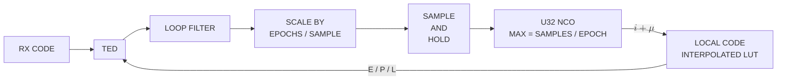

# AsyncDsssReceiver — the continuous DSSS receiver, from spec to object

*One page, consolidated 2026-09-02 from three: the receiver specification
(`async-dsss-spec.md`), the asynchronous despreader (`async-symbol-despreader.md`)
and the despreader's original working design (`async-despreader-working-design.md`).
§1–§4 are those pages' content under one numbering, edited only where a
cross-reference had to move. §5 is new: what the tracking receiver must gain
to serve the multi-emitter, always-searching use case that
[`acq-multi-peak.md`](acq-multi-peak.md) designs — the C++ application's
continuous waveform of [`burst-bank.md`](burst-bank.md) §11.*

______________________________________________________________________

## 1. The specification

The waveform and the receiver requirements, as given:

- Level: Any
- Nominal frequency: 2.5 GHz
- Frequency uncertainty: +/- 50 kHz
- Frequency rate of change: < 500 Hz/s <sup>[(1)](#note-1)</sup>
- Waveform: Continuous DSSS BPSK
- Waveform exemplary use-case:
    - Code: CCSDS Command link Gold Code 1023 chips repeating
    - Chip rate: 3.069 Mcps
    - Modulation: Asynchronous Rectangular BPSK @ 2700 bps
- Es/N0 >= 5 dB <sup>[(2)](#note-2)</sup>

### 1.1 Target implementations

- Complete C DsssReceiver available in libdoppler.{a,so} to compile into
    C/C++ applications <sup>[(3)](#note-3)</sup>
- Complete Python DsssReceiver to include in Python applications
- Set of stateless (serialized state passing) composable blocks
    deployable as k8s microservices <sup>[(4)](#note-4)</sup>
    - Digital Down-Conversion (DDC) -- absorbed into BurstAcquisition;
        see "Service boundaries" below
    - Code and Coarse Carrier Acquisition (BurstAcquisition)
    - Frame Demodulation (BurstDemod)

#### Service boundaries: which blocks are HPA-friendly

This microservices target is specifically the BURST counterparts
(`BurstAcquisition`/`BurstDemod` -- `DsssBurstReceiver`, task #80,
filed but not yet composed) -- not the continuous chain the rest of
this spec and this project's current C work is about. Continuous
tracking (Dll + Costas, inside the monolithic "Complete C DsssReceiver"
above) is a long-lived, per-pass STATEFUL process; it doesn't decompose
into independent stateless hops the way a bounded, feedforward burst
does, so it stays part of the monolithic library target rather than
being split into k8s hops.

Both burst blocks are HPA-friendly, and for the same underlying reason:
neither has a tracking loop. `BurstAcquisition` forwards straight onto
the shared `acq_core.c` engine (no separate algorithm, `acq_create_ burst()`) and completes one bounded detection attempt, then is done.
`BurstDemod` is explicitly feedforward -- preamble estimate, dechirp,
despread the data section, frame sync, slice bits, verify CRC -- no
loops, one bounded pass per burst. Any replica can pick up any
detection attempt or any burst; classic HPA (queue depth/CPU-driven
replica count) applies to both.

Two things worth being precise about here (an earlier draft of this
section conflated these while thinking through the continuous case):

- **The internal search parallelism and the HPA replica axis are
    different, and stay different here too.** `BurstAcquisition`'s own
    `coherent_bins`/`reps` sizing is internal to ONE detection attempt
    (bounded by the burst/preamble's own length; no documented ceiling
    beyond `>= 1`). The HPA axis is dispatching independent detection
    attempts (different candidate windows, or independent uplink
    sessions) across replicas -- not parallelizing within one attempt.
- **DDC is genuinely stateless throughout this chain, no caveat
    needed.** Nothing in the burst path closes a loop:
    `BurstAcquisition`'s Doppler estimate is a fixed, one-shot value per
    attempt, so any DDC correction applied is a pure function of sample
    index throughout, not evolving state -- unlike a continuous
    tracking loop's own continuously-updated NCO, which would NOT be
    stateless. The one real implementation cost that remains: a
    block-parallel DDC still needs a few samples of the PRECEDING block
    to seed its decimation filter's delay line correctly (the standard
    overlap-save technique) -- a small, genuine data dependency between
    adjacent workers, not zero-coordination independence.

DDC is absorbed into `BurstAcquisition` rather than kept as its own hop
for the same reason `RateConverter` may be absorbed elsewhere in a
composed pipeline: it has no consumer besides `BurstAcquisition` in
this chain (`BurstDemod` works from the already-corrected burst-sample
window `BurstAcquisition`'s own handoff identifies, not a second DDC
tap), and the two always co-scale 1:1 -- a separate hop would just add
serialization overhead for nothing. One real trade-off worth naming
rather than assuming away: if multiple independent detection replicas
process overlapping time windows of the same physical feed, each
redundantly re-runs its own DDC over the shared samples -- normal for a
fan-out sharding pattern, but a genuine, not-free duplication.

**Not yet built**: `DsssBurstReceiver` (composing `BurstAcquisition` ->
`BurstDemod`, task #80) is filed but not implemented -- neither object
calls the other today, and neither composes DDC internally yet.

### 1.2 Footnotes

<a id="note-1"></a>**(1)** Was mistyped "5 kHz/s" -- an order of
magnitude too high; matches the standard LEO worst-case nadir-pass
derivation `f_dot_max = (f_c/c)*(v^2/h)` at this spec's own 2.5 GHz and
a representative ~800 km altitude: ~579 Hz/s, i.e. this bound with a
small margin.

<a id="note-2"></a>**(2)** Raised from an earlier 3 dB floor: this
receiver's own characterization
(a full-characterization sweep, task #99) found a hard, SNR-only
pull-in cliff between 4 dB and 5 dB --
3 dB and 4 dB never lock (BER ~0.47-0.48, near-chance) while 5 dB locks
cleanly (BER ~0.01-0.02, matching theory), confirmed independent of
loop bandwidth (`bn_car` swept 0.005-0.02) and Doppler rate (swept
0-500 Hz/s) alike, so this is not a tunable margin, it's a real floor.
**Caveat, not yet resolved (task #99 remains open)**: this floor was
characterized against the real C `DsssReceiver`'s current pipeline --
Acquisition's coarse handoff feeding directly into the pre-despread
Costas/FLL loop, with no refinement stage in between. "Acquisition hit
quality" was flagged as the leading remaining candidate for the cliff
at the time, and this folder's own Python prototype work (see
`FINISHING_PLAN.md`'s `CarrierAcquisition` section) has since built and
validated exactly the missing piece -- a one-shot PSDMF refinement
stage between Acquisition's handoff and tracking -- that this floor was
set before having available. This 5 dB number may be revisitable
downward once that stage exists in C and task #99 is re-run against
it; treat it as the current best-known floor, not a settled intrinsic
limit, until that's actually tried.

<a id="note-3"></a>**(3)** Should internally compose Fine Carrier
Frequency Refinement (`CarrierAcquisition`) as a stage between
Acquisition's coarse handoff and Dll/Costas tracking -- motivated
directly by task #99's still-open 4-5dB pull-in cliff (see the Es/N0
footnote above). This is real, separate work from the k8s microservices
target below: `CarrierAcquisition` is an internal composition detail of
the monolithic continuous receiver, not a k8s hop, since the continuous
receiver's own tracking (Dll+Costas) is a long-lived, stateful,
per-pass process that doesn't decompose into independent stateless hops
the way a bounded burst does (see "Service boundaries" below). A C
object (`doppler.acquire.CarrierAcquisition`) already exists and is
serializable/stateless-resumable; it is not yet composed into the C
`DsssReceiver`'s own pipeline, nor validated end-to-end in C against
this spec's real async/wide-uncertainty scenario the way the Python
prototype now is -- that C port is the immediately next task.

<a id="note-4"></a>**(4)** This target is for the BURST counterparts
specifically (`BurstAcquisition`/`BurstDemod`, task #80's filed
`DsssBurstReceiver`), not the continuous chain this project's current C
work is building. Continuous tracking is inherently a long-lived,
per-pass stateful process (see "Service boundaries" below), so it stays
part of the monolithic Complete C DsssReceiver above rather than being
split into k8s hops.

### 1.3 Derived: tracking loop bandwidths (all loops: code DLL, Costas/CarrierMpsk carrier, FLL-assist)

- Design target: loop SNR `rho >= 20 dB` at the Es/N0 floor (5 dB), using
    the standard PLL loop-SNR relation `rho(dB) = Es/N0(dB) - 10*log10(2*bn)`
    (`bn` = the loop's own noise bandwidth, normalised to its update rate --
    `doppler.track.LoopFilter`'s own `bn` convention, so the update rate
    cancels out of the relation entirely; it depends only on Es/N0 and `bn`).
- Solving at the floor: `bn <= 10^((EsN0_dB - rho_dB)/10) / 2`
    `= 10^((5 - 20)/10) / 2 = 10^-1.5 / 2 ~= 0.01581`
- **Default rule: `bn <= 0.01` for every tracking loop** (kept as the
    already-shipped, already-validated value -- it sits comfortably
    inside the revised 5 dB floor's own `~0.01581` bound, so no
    implementation change is forced by the floor's move from 3 to 5 dB;
    the tighter 3 dB-derived `~0.00998` bound above is superseded). Sized
    against the worst-case Es/N0 floor, not a comfortable/typical
    operating point. (Applies to the code loop directly; the code loop's
    own per-epoch SNR is Es/N0 scaled by `1/epochs_per_symbol` -- at this
    waveform's `epochs_per_symbol = (chip_rate/sf)/data_rate = 3000/2700 = 10/9 ~= 1.11`, within ~0.5 dB of Es/N0 itself, so the same
    `bn<=0.01` bound applies without a separate derivation.)
- **Empirically, `bn` turned out not to be the deciding factor for the
    pull-in cliff itself** -- sweeping `bn_car` from 0.005 to 0.02 (both
    sides of the shipped 0.01) left the 4-5 dB cliff completely
    unchanged; the loop-SNR derivation above sizes STEADY-STATE tracking
    jitter once locked, not the separate (and still not fully explained)
    pull-in/lock-acquisition behavior below the floor. See task #99.

### 1.4 A second operating point

The C++ application's continuous waveform is the same shape at different
numbers — a 1023-chip Gold code at **2 to 5 Mcps**, a DDC from **13 MSa/s** to
twice the chip rate, `D = 1`, ±50 kHz to start and likely ±5 kHz after
Doppler pre-compensation, up to ten emitters on one code at once — and a
throughput floor of 30 MSa/s, comfortably. Those numbers, and what they do to
the search and the receiver pool, are worked in
[`acq-multi-peak.md`](acq-multi-peak.md) §1.1 and §1.4; this page's §5 is the
receiver's side of them.

______________________________________________________________________

## 2. Acquisition

### 2.1 User-facing API

**Split at the user level into two classes, `Acquisition` (continuous)
and `BurstAcquisition`, sharing ONE C engine underneath.** Per direct
user redirect: rather than one class with a `mode` param and
per-parameter "ignored in this mode" caveats, each class exposes only
the parameters that are actually meaningful for it -- no dead
knobs, no mode-dependent documentation. Underneath, both are thin
front doors onto the SAME `acq_state_t` / `acq_core.c` (state struct,
`_auto_config`, `push()`, serialization all shared, single
implementation) -- two public constructor entry points calling one
internal builder with their own mode fixed, the same "secondary
constructor" idiom this project already uses elsewhere (e.g.
`dll_core.h`'s reconfigure/secondary-constructor pattern). Not yet
implemented -- reflects the `doppler_bins` naming settled this
session, not what's currently shipped in `acq_core.h`.

**Terminology: no "sub_bins".** Rolling the shared epoch FFT by `k`
bins produces another Doppler hypothesis exactly as much as a
slow-time FFT row does -- they're both just `doppler_bins`, full stop,
so there's only ever ONE public name, on both classes. Internally the
shared C struct keeps two distinctly-named fields for the two
*mechanisms* that produce them (each class only ever has one active):
`coherent_bins` (slow-time FFT depth, produced by coherent multi-epoch
integration -- `BurstAcquisition`'s axis) and `window_bins`
(roll-tiled frequency windows, each one a single-epoch coherent FFT
rolled to a different hypothesis -- `Acquisition`'s axis). Named for
mechanism, not regime, on purpose: "coherent"/"noncoherent" would
describe which class uses which, but the roll-tiled axis isn't
actually computed non-coherently (that word already means something
else here -- `n_noncoh`, a completely orthogonal axis: repeated
dwells accumulated for SNR at a FIXED hypothesis set, composing with
EITHER bin mechanism). Both `coherent_bins`/`window_bins` stay
implementation detail; the public property is `doppler_bins` on both
classes.

#### `Acquisition` (continuous)

`doppler_bins` here is the `window_bins` mechanism (roll-tiled): no
coherent multi-epoch combining is ever attempted, closing the aliasing
footgun (task #67: coherent combining is not a graceful-loss
trade-off under continuous async data, it's a structural mislock).
Sensitivity margin comes entirely from auto-selected `n_noncoh`.

| Parameter             | Type                                   | Default      | Description                                                                                                                                                   |
| --------------------- | -------------------------------------- | ------------ | ------------------------------------------------------------------------------------------------------------------------------------------------------------- |
| `code`                | `NDArray[uint8]`                       | *(required)* | Binary (0/1) code, segment, or preamble chips to search for; sets `sf = len(code)`.                                                                           |
| `spc`                 | `int`                                  | `4`          | Samples per chip (>= 1).                                                                                                                                      |
| `chip_rate`           | `float`                                | `1e6`        | Chip rate in Hz (> 0).                                                                                                                                        |
| `symbol_rate`         | `float`                                | `1000.0`     | Continuous data-symbol rate in Hz (> 0).                                                                                                                      |
| `cn0_dbhz`            | `float`                                | `50.0`       | Carrier-to-noise density in dB-Hz (> 0) -- the sensitivity used to size the search.                                                                           |
| `doppler_uncertainty` | `float`                                | `0.0`        | One-sided Doppler search half-range in Hz; `0` = full native span (one `doppler_bin`). Tiles into `doppler_bins` windows whenever it exceeds one native span. |
| `pfa`                 | `float`                                | `1e-3`       | Target system (max-of-N) false-alarm probability, in `(0,1)`.                                                                                                 |
| `pd`                  | `float`                                | `0.9`        | Target detection probability, in `(0,1)`.                                                                                                                     |
| `noise_mode`          | `Literal["mean","median","min","max"]` | `"mean"`     | CFAR reference-cell aggregation mode.                                                                                                                         |

#### `BurstAcquisition`

`doppler_bins` here is the `coherent_bins` mechanism, auto-sized in
`[1, reps]` for coherent gain (today's existing `Acquisition`
behavior) -- assumes an unmodulated (or preamble) acquisition window,
so there's no data-bit-straddle loss to price and no `symbol_rate` to
supply.

| Parameter             | Type                                   | Default      | Description                                                                                                                                                   |
| --------------------- | -------------------------------------- | ------------ | ------------------------------------------------------------------------------------------------------------------------------------------------------------- |
| `code`                | `NDArray[uint8]`                       | *(required)* | Binary (0/1) code, segment, or preamble chips to search for; sets `sf = len(code)`.                                                                           |
| `reps`                | `int`                                  | `1`          | `doppler_bins` ceiling -- the coherent-depth axis (>= 1).                                                                                                     |
| `spc`                 | `int`                                  | `4`          | Samples per chip (>= 1).                                                                                                                                      |
| `chip_rate`           | `float`                                | `1e6`        | Chip rate in Hz (> 0).                                                                                                                                        |
| `cn0_dbhz`            | `float`                                | `50.0`       | Carrier-to-noise density in dB-Hz (> 0) -- the sensitivity used to size the search.                                                                           |
| `doppler_uncertainty` | `float`                                | `0.0`        | One-sided Doppler search half-range in Hz; `0` = full native span (one `doppler_bin`). Tiles into `doppler_bins` windows whenever it exceeds one native span. |
| `pfa`                 | `float`                                | `1e-3`       | Target system (max-of-N) false-alarm probability, in `(0,1)`.                                                                                                 |
| `pd`                  | `float`                                | `0.9`        | Target detection probability, in `(0,1)`.                                                                                                                     |
| `noise_mode`          | `Literal["mean","median","min","max"]` | `"mean"`     | CFAR reference-cell aggregation mode.                                                                                                                         |

**Removed from today's shipped API**: `doppler_resolution`,
`doppler_rate`. Both existed to size a coherent-depth (`coherent_bins`)
ceiling/floor safely under continuous data modulation -- but task #67
already found that premise doesn't hold for this waveform: coherent
combining under continuous async data isn't a tunable trade-off, it's
a structural mislock (aliasing), regardless of how carefully
`doppler_resolution`/`doppler_rate` size it. `Acquisition` (continuous)
uses the `window_bins` mechanism unconditionally -- there is no
coherent-depth axis for either parameter to tune, so both become dead
weight and are dropped rather than kept as no-ops -- and since they
only ever applied to the continuous case, they simply don't exist on
that class at all now (no "ignored" caveat needed).

**Also removed: `max_noncoh`.** Per direct user redirect -- `n_noncoh`
should be auto-selected to meet `pd` at `pfa`, same as `doppler_bins`
already is, not capped by a separate caller-tuned knob (whose default
of `1` was also an `Acquisition` (continuous) footgun in its own
right: with only the `window_bins` mechanism active there, `n_noncoh`
is the ONLY sensitivity lever, so a cap defaulting to "don't use it"
would silently underpower it). `n_noncoh` becomes a purely derived
output (already exposed as a read-only property) on both classes.

*2026-09-01:* this auto-selection is the **continuous** engine's. The burst
engine no longer escalates `n_noncoh` at all — a burst's preamble fills one
look, so extra looks add noise and move the hit's anchor past the capture's
refine reach ([#1181](https://github.com/doppler-dsp/doppler/issues/1181),
`burst-capture.md` §11.1); its C/N0 is a design point and optional.

This does NOT remove the need for an internal ceiling, though -- just
moves it out of the user-facing API. The semi-analytical `pd_predicted`
model itself is only reliable up to a point: this exact geometry's own
sweep (see below) found it "turns non-monotonic and unreliable past
`n_noncoh~256`" -- a MODELING breakdown, not a physical sensitivity
limit (more non-coherent looks always help in reality). Without a
caller-supplied cap, the auto-sizer's ascend loop still needs to stop
before wandering into that unreliable region and falsely reporting
`pd_predicted >= pd` -- that stopping bound should be an internal,
documented safety valve (or the ascend loop should detect it's
entering the model's known-unreliable regime and set `underpowered`
instead of trusting the number), not a parameter the caller has to
discover and tune correctly.

### 2.2 Output data structure: `DetectionEvent` (the acquisition handoff)

`DetectionEvent` is the DATA -- the acquisition handoff is the ACTION
(the process of converting a raw `push()` hit into this record and
handing it to the next block/service); the two aren't the same thing,
naming them separately on purpose.

Per the target-implementations goal above ("stateless composable
blocks deployable as k8s microservices"), `Acquisition`/
`BurstAcquisition`'s detection output has to be consumable by another
process/service, not just another Python object in the same
interpreter -- so it can't be the raw grid-relative indices
(`doppler_bin`, `code_phase`) alone, since those are meaningless
without also shipping the emitting object's own config (`spc`,
`doppler_res_hz`, ...) alongside. Every field below is already
converted to a physical unit, so the record is self-contained: a flat,
pointer-free POD, safe to serialize (JSON, protobuf, whatever the
transport is) across a process boundary. This is Phase 0 of the
coupled-tracker roadmap (`~/.claude/plans/jiggly-munching-newell.md`)
made concrete -- matches `dsss_acq_handoff_from_result()`'s planned
C struct, and is exactly what the acquisition hand-off prototype's
`DetectionEvent`/`handoff_from_hit()` already
prototyped and validated in Python this session (code-phase
conversion exact, full search -> handoff -> refine -> track chain
locks).

One `DetectionEvent` record is emitted per detection event (i.e. once
per `push()` hit, on both classes -- same shape, since both share the
underlying engine):

| Field              | Type       | Description                                                                                                                                                                                                                                                                                                                                         |
| ------------------ | ---------- | --------------------------------------------------------------------------------------------------------------------------------------------------------------------------------------------------------------------------------------------------------------------------------------------------------------------------------------------------- |
| `timestamp_ns`     | `uint64_t` | UNIX time (ns) this detection's samples occurred, per the codebase's existing `dp_sample_clock_t` convention (`native/inc/timing/timing_core.h`): `epoch_real_ns + samples_consumed/fs`, NOT a fresh syscall timestamp at emit time -- reproducible, and already how `dp_header_t`/SigMF-metadata timestamps are derived elsewhere in this project. |
| `samples_consumed` | `uint64_t` | The raw sample offset (since this engine's own stream start) this detection's epoch ended at -- the `n` that `timestamp_ns` above was derived from. Kept alongside `timestamp_ns`, not instead of it: replay-safe (no wall-clock dependency) and lets a consumer re-derive/cross-check the time against its own clock anchor.                       |
| `chip_phase`       | `float`    | Code phase in CHIPS (not raw samples) -- the code-tracking seed for the next stage.                                                                                                                                                                                                                                                                 |
| `doppler_hz_est`   | `float`    | Coarse Doppler estimate in Hz, already folded/signed/scaled from the raw `doppler_bin` index.                                                                                                                                                                                                                                                       |
| `doppler_res_hz`   | `float`    | Width of that estimate -- the remaining uncertainty (±`doppler_res_hz`/2) a downstream refine/tracking stage still has to close.                                                                                                                                                                                                                    |
| `cn0_dbhz_est`     | `float`    | Estimated carrier-to-noise density (dB-Hz) -- informs downstream loop-bandwidth/dwell sizing (e.g. `fll_block_epochs`, still an open question in the plan).                                                                                                                                                                                         |
| `peak_mag`         | `float`    | Raw CFAR peak magnitude -- diagnostic/observability passthrough, not needed for tracking math.                                                                                                                                                                                                                                                      |
| `noise_est`        | `float`    | Raw CFAR noise-floor estimate -- diagnostic passthrough.                                                                                                                                                                                                                                                                                            |
| `test_stat`        | `float`    | Raw CFAR gating statistic -- diagnostic passthrough.                                                                                                                                                                                                                                                                                                |

**Shipped** (`cb1765cc`, task #71's timestamp-mechanism follow-on):
`acq_result_t` gained the `samples_consumed` field this section called
for, `dp_sample_clock_t` gained the `stamp_at(c, n)`/`track(...)`
pair, and the stream layer gained a one-shot `timestamp_ns` override so
a hop-to-hop send no longer clobbers the true origin timestamp with a
fresh syscall read. The acquisition hand-off prototype's
`handoff_from_hit()` already takes the `dp_sample_clock_t` analogue
(`doppler.wfm.SampleClock`) as its optional `clock` param and resolves
`timestamp_ns = clock.stamp_at(samples_consumed)` -- verified exact
end to end (`python acq_handoff.py`, `LOCKED`, timestamp checked
against the formula directly). What's still open is only the C side of
the handoff ACTION itself: `dsss_acq_handoff_from_result()` (Phase 0 of
the coupled-tracker roadmap) doesn't exist as a C struct/function yet
-- today's validated conversion lives only in Python. `Acquisition`/
`BurstAcquisition` themselves stay wall-clock/epoch-agnostic (pure
sample-domain engines, no I/O) -- the `dp_sample_clock_t` anchor comes
from whatever upstream source (DDC, a real front end) is actually
feeding them samples, and gets threaded through by the composing layer
(`DsssReceiver`, or the k8s block wrapper), not owned by `Acquisition`
itself.

This gap wasn't specific to `Acquisition` -- `dp_tlm_rec_t`'s own doc
comment already flagged the general pattern ("if never stamped it
stays 0"), so the same unwired-timestamp check is worth running over
other streaming objects too, not just this one.

**Settles the plan's open question: no `carrier_freq` parameter on
either class.** The plan flagged "does `carrier_freq` need to become a
new `dsss_receiver_create()`/`acq_create()` parameter" -- answer: no.
`Acquisition` has no other reason to know the RF carrier frequency (it
operates in baseband/chip-rate Doppler Hz throughout); the
carrier-aiding scale (`doppler_hz_est * chip_rate/carrier_freq`) is
computed by whichever component actually knows `carrier_freq` --
the coupled-despreader prototype's tracker already
does exactly this with its own `carrier_freq_hz` parameter, not
something `Acquisition` hands it pre-scaled. Keeps `Acquisition`
carrier-frequency-agnostic and reusable for a baseband-only caller
that has no carrier concept at all.

### 2.3 Notes — the wideband search, and how it was settled

- FFT bin spacing per code epoch (native unambiguous Doppler span,
    ANY coherent depth D -- a D-point slow-time FFT sampled at the
    epoch rate has a fixed +/-(epoch_rate/2) Nyquist range regardless
    of D; more bins only subdivide that SAME fixed range more finely,
    never widen it): `chip_rate / sf = 3.069 Mcps / 1023 = 3.000 kHz`
    exactly (half-span `chip_rate/(2*sf) = 1.500 kHz`).
- **The big one**: required uncertainty is +/-50 kHz = 100 kHz total,
    ~33.3x the 3 kHz native span -> **34 non-overlapping native windows
    needed to cover it** (`ceil(100/3) = 34`). `Acquisition`'s own
    `doppler_uncertainty` parameter cannot help here -- it only NARROWS
    the search within one native span (`doppler_uncertainty <= span` is
    an enforced precondition), it can't widen coverage beyond it.
    Covering the full uncertainty therefore needs 34 independent
    alias-window searches (each its own 2D correlation, `code_bins = sf*spc = 2046` at `spc=2`) -- "34 x 2046" -- run either:
    1. **Sequentially** (34x acquisition latency -- almost certainly
        fails the "FAST" requirement), or
    1. **In parallel** (34x compute/hardware, full latency preserved), or
    1. **Behind a DDC channelizer bank** (`doppler.ddc`/`RateConverter`,
        already in the codebase -- reuse, don't reimplement): split the
        +/-50 kHz input into a SMALLER number of wider sub-channels
        first, so each channel's own residual uncertainty fits a cheaper
        per-channel search, trading DDC channelizer cost against fewer
        parallel/sequential full correlation engines.
- **CORRECTED architecture, per direct user redirect ("slow-time
    doesn't work for this case"): pure code-phase search, `D=1`, no
    coherent Doppler-axis combining at all.** The first baseline number
    below used `Acquisition`'s `symbol_rate`-aware auto-config, which
    picked `doppler_bins=31` -- exactly the coherent multi-epoch
    combining this whole story already proved unsafe under continuous
    async data (data-modulation aliasing across the Doppler-bin axis,
    `docs/design/dsss-acquisition.md`'s "ceiling (b) fails hard").
    **`D=1` sidesteps this entirely** -- with only one epoch, there is no
    multi-epoch axis for the data's own spectrum to alias across.
    Detection SNR margin instead comes from **non-coherent accumulation**
    (`n_noncoh`, magnitude-squared summing) across independent epochs --
    provably immune to data-modulation sign flips (already established
    earlier in this story), unlike coherent combining.
- Real measured `pd_predicted` sweep at `D=1`, this waveform's exact
    `cn0_dbhz=37.31`: crosses the 0.9 target around **`n_noncoh=96`**
    (0.917), comfortable margin at **`n_noncoh=128`** (0.965) or
    **`n_noncoh=192`** (0.994). (`pd_predicted` turns non-monotonic and
    unreliable past `n_noncoh~256` in this exact config -- a modeling
    edge case at very large `nc`, not a real detection cliff; stay
    stay well under it -- `n_noncoh<=192` is comfortably clear of it.)
- **Per-frequency-bin dwell time, measured throughput (33.2 MSa/s),
    `code_bins=2046` per epoch**: `n_noncoh=96` -> **5.9 ms**;
    `n_noncoh=128` -> **7.9 ms**; `n_noncoh=192` -> **11.8 ms** -- ALL
    faster than the (now-superseded) D=31 slow-time baseline's 15.3 ms,
    AND with none of its aliasing risk.
- **Architecture: 34 of these `D=1` pure-code-phase searches, one per
    3 kHz-spaced candidate frequency bin spanning +/-50 kHz, run in
    PARALLEL for "fast as possible"** -- total acquisition latency ≈ ONE
    bin's dwell time (**~6-12 ms** depending on the `n_noncoh` margin
    chosen), not 34x it. Sequential would cost 34x (`~200-400 ms`) and is
    ruled out by the "fast as possible" directive. Each of the 34 bins
    needs its own frequency-shifted (down-converted) copy of the input
    feeding an independent code-phase correlator -- realizing that bank
    of 34 parallel down-conversions efficiently (a DDC/mixer bank,
    `doppler.ddc`/`RateConverter`, reuse not reimplement) is the
    remaining open engineering question, not a way to reduce the count
    of 34 -- the count is fixed by `+/-50kHz / 3kHz` regardless.
- **Resolved: how to realize the 34-bin frequency grid per epoch**
    (`bench_freq_bank.py`, real `doppler.spectral.FFT`, real wall-clock
    timing, not just operation-count theory). Two candidates: (A) one
    forward FFT of the received epoch, then roll its spectrum by k bins
    per hypothesis (exact -- the 3 kHz hypothesis spacing IS this
    N=2046-sample epoch's own FFT bin spacing) against one fixed
    precomputed replica spectrum, 1 fwd + 34 inverse FFTs; vs. (B) a
    tuned mixer bank, 34 independent down-conversions each needing its
    own forward FFT, 34 fwd + 34 inverse FFTs. Both cross-checked
    bit-exact-cell correct first (identical injected true k/code-phase
    recovered by both). **(A) wins empirically, consistently, across
    repeated runs: ~0.6-0.8 ms/epoch vs. (B)'s ~0.9-1.0 ms/epoch, a
    1.2x-1.55x speedup** -- directionally confirms the op-count theory
    (35 vs. 68 FFT-equivalents, ~1.94x) but the *measured* margin is
    smaller, because (A) pays an extra O(N) `np.roll` memory copy per
    hypothesis that the theory didn't count, and Python-level per-call
    overhead partially masks the underlying FFT-count gap. **Settled
    architecture: (A), roll the replica/received spectrum, not a tuned
    mixer bank** -- a hybrid (C) was considered but has no analytical
    basis here (code-phase correlation needs the full N=2046-sample
    resolution regardless of how the frequency search is realized, so
    there's no reduced-rate sub-problem for a DDC front-end to help
    with).
- **Resolved: full C end-to-end benchmark of the wideband search**
    (`native/benchmarks/bench_acq_core.c`, task #71). The roll-FFT
    architecture is now wired directly into `dsss.Acquisition`'s real C
    core (`acq_core.c`'s wideband mode, task #72) -- the "34 bins run in
    parallel from one shared epoch FFT" requirement is satisfied
    internally by that one object's per-epoch loop (no separate 34-way
    thread fan-out needed, since all 34 hypotheses share one forward FFT
    per epoch by construction). Benchmarked one real, timed `acq_push()`
    call per non-coherent dwell (`n_noncoh` consecutive epochs, one call)
    at this exact waveform (`sf=1023`, `spc=2`, `chip_rate=3.069 Mcps`,
    `cn0_dbhz=37.31`, `doppler_uncertainty=+/-50kHz` -> `n_freq_bins=34`
    automatically), with a real injected burst + AWGN, confirming correct
    detection (right frequency window + code phase) at every point.
    **Measured**: `n_noncoh=74` (pd_predicted 0.984) -> 32.7 ms;
    `n_noncoh=101` (pd 0.999) -> 44.1 ms; `n_noncoh=123` (pd ~1.0) ->
    54.5 ms -- consistently **~0.44 ms/epoch**, i.e. faster than
    `bench_freq_bank.py`'s own Python/numpy roll-FFT prototype
    (0.6-0.8 ms/epoch), as expected for real C over numpy dispatch
    overhead.
    - **Discrepancy found and resolved in the process**: the `n_noncoh= 96/128/192` operating points quoted earlier in this doc came from a
        standalone Python sizing sketch written *before* this wideband mode
        existed in C, and don't match the real, now-implemented 34-bin
        Bonferroni-corrected auto-sizer -- the real model is considerably
        more optimistic at this cn0 (`pd_predicted` reaches ~0.999 by
        `n_noncoh~101`, not ~0.917 at 96 / ~0.994 at 192 as estimated
        there). The benchmark sweeps by **pd target** (0.9/0.99/0.999,
        letting the real auto-sizer pick `n_noncoh` honestly) rather than
        forcing the old sketch's exact nc values, since the real C model is
        now the authoritative source, not the earlier estimate. The
        `n_noncoh=96/128/192` numbers above are left as historical context
        for how this story arrived here, not as the operating spec.
    - **Still open**: confirm `n_noncoh` choice against the occasional
        epoch that straddles a data-bit transition (a graceful per-epoch
        SNR loss for SOME of the `nc` epochs, not a structural mislock,
        since non-coherent summing doesn't alias -- but not yet separately
        quantified here).

______________________________________________________________________

## 3. The asynchronous despreader

**Status:** draft / validated architecture
**Scope:** the receive-side despreader when the **data-symbol rate is on the
order of the code-epoch rate but asynchronous** to it. This is theory, the
failure mechanism, and a validated robust architecture that composes existing
`doppler.track` primitives. The reproducible study is
`src/doppler/examples/async_despreader_study.py`
(`python -m doppler.examples.async_despreader_study`).

______________________________________________________________________

### 3.1 The two-clock problem

A DSSS receiver despreads by integrating early/prompt/late correlations over one
**code epoch** (`TE = sf·sps` samples) — an integrate-and-dump locked to the
*code* clock. The data symbols are a separate stream; the despread prompt per
epoch carries the data.

That works when the symbol clock is locked to the code clock at an integer ratio
(GPS C/A: 20 code epochs per data bit, bit edges on epoch edges). It **breaks**
when the symbol clock is *independent*:

```
T_sym = TE · (1 + delta)        # symbol period, samples
                                # delta = symbol-vs-code rate offset
phi_sym                         # independent symbol phase
```

with `T_sym ≈ TE` (symbol ≈ one epoch). This is the hard regime: ~one symbol per
epoch, a transition roughly every epoch, and — crucially — `delta ≠ 0` makes the
symbol boundary **slide continuously** through the epoch at the beat rate
`delta / TE`.

______________________________________________________________________

### 3.2 Why per-epoch despreading fails

The coherent prompt over an epoch whose data flips at fraction `f ∈ [0,1]`:

```
P(f) = A·[ f·d1 + (1−f)·d2 ]  =  A·d1·(2f−1)        (d2 = −d1)
```

- `f → 0, 1` (flip at an epoch edge): `|P| = A` (full despread).
- `f → 0.5` (flip mid-epoch): **`|P| = 0`** — total coherent cancellation.

Because `delta ≠ 0`, `f` sweeps through every value, so ~half of all epochs
straddle a transition and their prompts collapse. The consequences:

1. **Data**: per-epoch decisions floor — the BER plateaus regardless of `Es/N0`
    (the straddle epochs carry no usable energy). Measured floor ≈ 1e-1 even when
    the bound is < 1e-5.
1. **Code**: the early/late discriminator `(|E|−|L|)/(|E|+|L|)` collapses to
    `0/0` on straddle epochs → the DLL is starved → the code loop wanders.

**Root cause:** at one prompt per epoch the symbol clock is **unobservable** (a
single sample per symbol cannot drive a timing loop), and the integration window
is forced to straddle transitions.

#### Diagnostic fingerprint

The straddle modulation is periodic at the symbol↔epoch beat. The spectrum of
the prompt-magnitude stream `|P[n]|` shows a **tone at `|delta|` cycles/epoch**
(centre panel of the figure). This is the signature to look for when a DSSS link
shows unexplained despread fades — it identifies this failure class directly.

______________________________________________________________________

### 3.3 Robust architecture


The fix gives the symbol clock its own observability and its own matched filter,
and makes code tracking insensitive to data sign — composing primitives that
already exist.

#### 3.3.1 Data path — partial correlations + symbol matched filter + SymbolSync

1. **Partial correlations.** Split each code epoch into `K` sub-epoch partial
    prompt correlations (each `TE/K` samples, known code phase). This yields `K`
    despread samples per epoch ≈ `K` samples per symbol — the symbol clock is now
    **observable**.
1. **Symbol matched filter.** A length-`K` **boxcar** over the partial stream.
    This is a *sliding, symbol-aligned* coherent re-integration of the partials —
    the full-symbol despread the epoch-locked window could not form. It is
    essential: without it, the rectangular symbol pulse is sampled at one point
    and only ~1/`K` of the symbol energy is captured (the BER floors at ~2e-2).
1. **SymbolSync.** [`track.SymbolSync`](../api/python-track.md) (Gardner TED +
    Farrow interpolator) recovers the independent symbol clock (`delta`, `phi`)
    from the matched-filtered stream and decimates at the symbol-aligned peak.

**Result (left panel):** the BER follows the BPSK matched-filter bound within
~1–2 dB. A **genie** reference (coherent symbol-aligned despread with *known*
timing) hits the bound exactly — the loss was only window misalignment, never
SNR. The broken per-epoch path floors.

| Es/N0  | bound  | genie (known timing) | partial+MF+SymbolSync | broken epoch |
| ------ | ------ | -------------------- | --------------------- | ------------ |
| 6 dB   | 2.4e-3 | 2.5e-3               | 4.5e-3                | ~7e-2        |
| 8 dB   | 1.9e-4 | 1.5e-4               | 5.8e-4                | ~6e-2        |
| 9.6 dB | 9.7e-6 | 0                    | 0                     | ~5e-2        |

#### 3.3.2 Code path — non-coherent partial combining

The DLL keeps tracking through data flips by combining the partial correlations
**non-coherently**: `|E| = Σ_k |E_k|`, `|L| = Σ_k |L_k|`. A data flip changes a
partial's *sign*, not its *magnitude*, so only the one straddling segment
degrades (~`1/K`). This roughly **halves the discriminator variance** versus the
coherent-epoch form (right panel) — keeping the (already validated, smooth
sub-chip) code loop locked. It needs no symbol timing, so it works from cold
start; the bootstrap order stays sequential: DLL (non-coherent) → SymbolSync →
data.

#### 3.3.3 Choosing K

`K` trades observability and straddle-robustness against the non-coherent
squaring/Rician bias (which erodes the discriminator gain as `K` grows). The
study shows **`K = 4` as the sweet spot** for `T_sym ≈ TE` (best discriminator
SNR; `K = 8` loses more gain than variance). `K` must divide `TE`.

______________________________________________________________________

### 3.4 Scope: the despreader removes the code and outputs samples

The despreader's one job is to **remove the PN code and output samples**. The
asynchronous symbol clock is merely *why* it despreads in `K` partial
correlations (§3.3) — it is not a reason to recover symbols here. **Carrier
recovery and symbol extraction are downstream problems**, handled by separate
objects fed from the despreader's output:

```
              ┌──────────────── the despreader ───────────────┐
acq seed →    Dll(segments=K):  E/P/L correlate · partial dump · non-coherent
   (code phase)                 (|E|−|L|) code loop
              └───────────────── partial stream out ──────────┘
                         │  K oversampled async BPSK samples/symbol
                         │  (PN removed; residual carrier + data still on them)
                         ▼
   downstream:  Costas (carrier recovery)  →  SymbolSync (symbol timing) → bits
```

This is **`track.Dll(..., segments=K)`** — no new object. `segments=1` is the
classic coherent full-epoch DLL; `segments=K>1` is the streaming async
despreader. It composes downstream with `Costas` and `SymbolSync`, which already
exist (the data path of §3 is exactly that composition).

#### Why the carrier belongs downstream

The DLL's `|E|−|L|` discriminator is **non-coherent**, so code tracking is
**carrier-blind** — it locks with a residual carrier still on the samples. And
because each output is a *partial* (a `TE/K`-sample integrate-and-dump, not a
full epoch), a residual carrier barely dents it. For a ½-Doppler-bin residual
after acquisition the I&D loss is `sinc(Δφ/2)` with `Δφ = π/segments`:

| segments | window | Δφ at ½-bin residual | despread loss |
| -------- | ------ | -------------------- | ------------- |
| 1        | `TE`   | `π`                  | **−3.9 dB**   |
| 4        | `TE/4` | `π/4`                | **−0.2 dB**   |

So short partials make the despread carrier-tolerant: the small residual just
rides out on the output (a ring in the constellation; see the gallery demo), and
a downstream `Costas` loop removes it at full symbol SNR. Putting a carrier loop
*inside* the despreader would only matter for long coherent integration — which
partials deliberately avoid.

#### The same scope rule applies to the DSSS-MPSK composition

`Dll(segments=K) -> MpskReceiver` (`docs/gallery/dsss-receiver.md`) is
the other downstream composition, and the same rule bites the same way: the
despreader's partial-correlation output rate is whatever `K*chip_rate/SF`
comes out to — a sub-multiple of the chip rate, not chosen with
`MpskReceiver`'s `sps` in mind. An early version of that gallery page
violated its own §3.4 by picking `K` specifically so
`round(K*T_sym/T_epoch)` landed on an integer, coupling `Dll`'s own
tracking parameter to `MpskReceiver`'s sample-rate requirement. That made a
perfectly good `Dll` tuning look downstream-broken. The fix is
`doppler.resample.RateConverter` between the two — an explicit, arbitrary-
ratio resample stage, the same category of fix as `Costas`/`SymbolSync`
being separate objects from `Dll` here. Choose `segments` for the
despreader's own tracking quality; choose the demodulator's `sps` for its
own reasons; bridge the two with a resampler, never by coupling the
parameters directly.

### 3.5 Code-lock detection (always on)

A tracking channel must always answer one question: *am I locked?* The DLL
carries an **always-on** lock detector that reuses **acquisition's** non-coherent
test statistic, so acquire and track agree on what "detected" means.

**Statistic.** Each emitted look (a partial in `segments` mode, the full-epoch
prompt when `segments=1`) contributes its prompt power `|P_k|²`. The detector
sums `N = n_looks` consecutive looks and forms

```
R = sqrt( 2 · Σ_{k=1}^{N} |P_k|²  /  E|O|² )
```

which under H0 (noise only) has `P(R > η) = marcum_q(N, 0, η)` — exactly the
acquisition tail. So a caller sizes the threshold `η = det_threshold_noncoherent(pfa, N)` and the depth `N = det_n_noncoh(snr, …)` to
meet a target `(Pfa, Pd)`; `configure_lock(pfa, n_looks)` does the conversion
(default `pfa=1e-3`, `N=20`).

**The noise reference `E|O|²`.** Instead of a separate noise channel, the loop
correlates each look a second time at a **random off-peak code phase** — a whole
chip offset re-drawn every epoch and kept clear of the prompt/early/late lobe by
`noise_guard` chips. For a low-sidelobe code (Gold, long PN) that offset
correlation is signal-free, so `|O_k|²` is a sample of the per-look noise power.
Cycling the offset and averaging recovers the same noise estimate a bank of
fixed off-peak taps would, with O(1) state.

**Why an EMA, and why it must be long.** The reference is an EMA of `|O_k|²`
(`E|O|² += α(|O_k|² − E|O|²)`), which is adaptive (tracks a drifting noise floor)
and O(1) — matching the `Costas` lock-metric pattern. The subtlety, found by
Monte-Carlo: the *detection* integrates a fixed `N` looks (that sets the χ²(2N)
threshold), but the *noise estimate* must average **many more** cells than `N`,
or its own variance inflates Pfa. One offset cell per look (`L=N`) drives Pfa
~400× high; `1/α = max(1024, 32·N)` (`L_eff ≫ N`) holds Pfa at target with
`Pd ≈ 0.98`. So the integration depth and the noise-averaging length are
**decoupled**: `N` is the test, `1/α` is the reference. The reference uses a
**cumulative-mean bootstrap** — it is the running average until `1/α` looks have
accrued, then relaxes to the fixed-α EMA — so the noise floor is unbiased from
the first look instead of seed-dominated for the ~`1/α`-look warm-up (otherwise
Pfa runs ~10× high until the EMA settles, ~hundreds of epochs in). Verified
end-to-end: empirical Pfa ≈ `9e-4` against the `1e-3` target right from the
start of a noise stream.

**Readouts.** `Dll.locked` (bool, latched each `N`-look decision), `Dll.lock_stat`
(the last `R`), `Dll.noise_est` (`E|O|²`). The detector runs inside the normal
`steps()` — no separate method, no opt-in. The threshold conversion (the one
`detection`-module call) lives in the binding so `dll_core` links only `-lm`.

### 3.6 The look-back window — the original working design

*The note the C `Dll`'s dwell-integral look-back was built from
(`native/inc/dll/dll_core.h` cites it as its reference); kept verbatim, in
NumPy, as the algorithm's own statement.*

> **Important:** This assumes at most one data symbol transition per code epoch



- TED generates one error per epoch using the signal power formed by correlating
    the rx signal with local code replicas E, P, and L over a window _which maximizes power_
    of the prompt correlation and forms the error:

    ```text
    code_phase_error = 0.5 * (early_power - late_power) / signal_plus_noise_power
    ```

- This requires storing a buffer of the last received samples to "look back" in the case
    where a transition occurs in the current sample buffer so a transition free epoch may be
    obtained

- This is scaled down and repeated driving the NCO at 2x chip rate

- Local code is 2 samples per chip and linear interpolation is used to compute fractional samples

- LUT outputs early, prompt, and late codes offset by 1/2 chip (1 sample)

```text

# Init
code_size = 1023
samples_per_chip = 2
max_error = 0.5 # dB async correlation loss
phases = code_size * samples_per_chip
phase_resolution = 1 - 10 ** (-max_error / 10)
phase_step = int(np.ceil(phases * phase_resolution))
factors = [i for i in range(1, phases + 1) if phases % i == 0]
phase_step = factors[np.abs(np.array(factors) - phase_step).argmin()]
windows, window_size = int(phases / phase_step), phase_step
last_backard_sums = np.zeros(windows, np.complex128)
last_early_sums = np.zeros_like(last_backward_sums)
last_late_sums = np.zeros_like(last_backward_sums)

def find_max_power(x, windows, step_size, last_backward_sums):
    """Find max correlation over different output phase offsets."""

    # First compute the partial sums of the current correlation
    partial_sums = x.reshape(windows, step_size).sum(axis=1)

    # Now sum up the portions of the windows this epoch contributes
    sums = partial_sums.cumsum()
    backward_sums = partial_sums[::-1].cumsum()

    # Use the last epochs backward looking sums and the current
    # epochs forward looking sums to comput the overlapping correlation
    # at each phase across the two epochs and keep the maximum
    correlations = np.zeros(sums.size)
    correlations[-1] = np.abs(sums[-1] / (code_size * samples_per_chip))
    correlations[:-1] = (
        np.abs(sums[:-1] + last_backward_sums[::-1][1:])
        / (code_size * samples_per_chip)
    )
    max_window = correlations.argmax()
    max_abs = correlations[max_window]
    max_power = max_abs ** 2

    # Use partial sums as integrate and dump downsampled output
    integrate_and_dump = partial_sums / (step_size * max_abs)

    # Compute window index. This is the offset from the end of the last
    # correlation window that is the start of the max power correlation
    # window.
    window_index = (windows - 1 - max_window) * step_size

    return (
        max_power,
        max_window,
        backward_sums,
        integrate_and_dump,
        window_index
    )

def get_window(x_window, x, last_x, index):

    if index:
        x_window[:index] = last_x[-index:]
        x_window[index:] = x[:-index]
    else
        x_window = x[:]

    return x_window

# In your loop

while signal_buffer,more_data:

    # NCO + interpolated LUT
    early, prompt, late = pn_gen.steps(
        pn_control
    )

    b = signal_buffer.get()
    x = b * prompt
    power, window, last_backward_sums, integrate_and_dump,window_index = find_max_power(
        x, windows, window_size, last_backward_sums
    )
    signal_plus_noise_power = power

    b_win = get_window(b_window, b, last_b, window_index)
    last_b = b[:]
    early_win = get_window(early_window, early, last_early, window_index)
    last_early = early[:]
    late_win = get_window(late_window, late, last_late, window_index)
    last_late = late[:]

    early_power = np.mean(b_win * early_win) ** 2
    late_power = np.mean(b_win * late_win) ** 2
    code_phase_error = 0.5 * (early_power - late_power) / signal_plus_noise_power
    loop_filter.step(code_phase_error)
    pn_control = np.full(loop_filter.out / (code_size * samples_per_chip))

```

______________________________________________________________________

## 4. The receiver as built

`AsyncDsssReceiver` (`native/inc/async_dsss_receiver/async_dsss_receiver_core.h`)
is the composed continuous receiver, one C object, the production port of the
validated Python `search → refine → track` prototypes. It has three states,
read back through `get_refining()`/`get_tracking()`:

- **searching** — samples feed an embedded continuous `Acquisition` (§2,
    window-tiled over `doppler_uncertainty`, `D = 1`). A hit becomes a hand-off
    through `acq_build_handoff()`, which seeds the refine stage; the unconsumed
    tail of the same call is handed straight to it.
- **refining** — a frozen-carrier derotation at the coarse estimate feeds a
    collection `Dll` whose look-back segments oversample each epoch, then a
    `RateConverter` to `CarrierAcquisition`'s own rate, then
    `CarrierAcquisition` itself. When it reports ready or gives up, the live
    tracking chain is built **fresh** from the *original* hand-off chip phase
    and the refined (or, on give-up, unrefined) Doppler.
- **tracking** — the refined carrier is unfrozen into a live pre-despread
    Costas loop (`costas_update()` once per code period, driven by a
    non-data-aided squaring discriminator over the period's coherent partials)
    → `Dll` (§3, `segments = K`) → `RateConverter` → `MpskReceiver`. Two lock
    detectors run: the `Dll`'s own CFAR-based **code lock** (`get_code_locked()`,
    §3.5) and a hysteretic **symbol lock** on the emitted symbols
    (`get_locked()`, the `cos(2φ)` statistic over a 30-symbol dwell, declared
    after 30 consecutive symbols at or above 0.5 and dropped after 15 below 0.3).

`DsssReceiver` is the same object without the refining stage — a hit's coarse
Doppler goes straight to tracking — and §1.2's note (2) is why the refine
exists: the 4–5 dB pull-in cliff the coarse-only hand-off left. `reset()` on
either returns to searching: a receiver that has locked cannot be reset back
onto the same signal, only back to the hunt. Both are serializable
(`state_bytes`/`get_state`/`set_state`), every child included.

### 4.1 Status

- **Shipped — the despreader.** `Dll(..., segments=K)` (the §3.3 code+symbol path;
    `segments=1` = the classic coherent DLL). Validated **carrier-present**: code
    lock holds with a residual carrier on the samples, and the partial output is
    losslessly recoverable by a downstream carrier wipe + symbol despread
    (`test_dll.py::test_segments_carrier_present_*`). The streaming binding returns
    an independent array per call (block-size invariant).
- **Shipped — the inline symbol-loop primitive.** `symsync_step()` (the
    per-sample SymbolSync composition API); `symsync_steps()` is it in a loop.
- **Shipped — the always-on code-lock detector** (§3.5). `Dll.locked` /
    `lock_stat` / `noise_est`, tuned by `configure_lock(pfa, n_looks)`; reuses
    acquisition's non-coherent statistic with a random off-peak EMA noise
    reference. Validated signal-vs-noise in `test_dll.py` / `test_dll_core.c`.
- **Downstream, already available:** `Costas` (carrier recovery) and
    `SymbolSync` (Gardner + Farrow symbol timing). A receiver is the pipeline
    `Dll(segments) → Costas → SymbolSync`; the §3.3 study and the
    `async_despread_demo` gallery example show the composition.
- **End-to-end validated with a real acquisition front end.**
    `Dll(segments=K) → MpskReceiver` (`MpskReceiver` already fuses matched
    filter + NDA carrier acquisition + Gardner/Farrow timing + acq↔track
    handover into one object — its own docstring names this exact
    composition) is now proven at real physical parameters — a continuous
    1023-chip code at 3 Mchips/s, async 2100 sym/s BPSK data, with a genuine
    `Acquisition` search in front (see the
    [DsssReceiver](../gallery/dsss-receiver.md) gallery page,
    `src/doppler/examples/dsss_receiver_demo.py`).
    One correction to this section's own guidance surfaced doing so: `K=4`
    (§3.3.3's sweet spot) is tuned for the DLL's own code-discriminator
    variance, not for feeding a downstream matched filter — each partial is
    `K`-times weaker than a full coherent epoch, so a downstream receiver
    needs a much larger `K` (34, in the validated example) to reconstruct
    real coherent gain before its own carrier/timing loops can converge.
    The acquisition hand-off also needs two non-obvious unit conversions
    (`Dll`'s `init_chip` is phase-*inverted* relative to `Acquisition`'s
    `code_phase`; `MpskReceiver`'s `init_norm_freq` is cycles per its own
    *partial-rate* input, not per raw ADC sample) — see the example's
    docstring for the exact formulas.

#### Possible refinements

- **Symbol MF length.** A downstream length-`K` boxcar matched filter follows the
    BPSK bound within ~1–2 dB; matching it to the *tracked* symbol period closes
    the gap.
- **Closed-loop code-jitter asset.** Drive the non-coherent partial code loop
    under async data + code Doppler; confirm lock retention and the low-SNR
    threshold (`bn≈1e-5` held to 4 dB Es/N0; `bn≈0.002` lost lock at 6 dB).

______________________________________________________________________

## 5. What the multi-emitter use case needs from the tracking receiver

[`acq-multi-peak.md`](acq-multi-peak.md) fixes the lifecycle: a **searcher**
per channel that never stops, and one `AsyncDsssReceiver` per emitter,
**assigned once** from a detection and tracking until *its own* loss decision
— never stopped, never re-seeded, never doubled up by the searcher. Up to ten
emitters at once, each on the air for 5 to 15 minutes, on one Gold code, on a
stream the whole pool must consume at 30 MSa/s comfortably. The receiver of §4
is the right object for that (maintainer, 2026-09-02) and needs five things,
none of which is a new receiver. Each is a Phase-1 design here and an
implementation item in
[adding an algorithm](../dev/contributing/adding-algorithms.md)'s order; the
measurements that size them are `acq-multi-peak.md` §6.

### 5.1 The hand-off mode: an acquisition input, and an internal bypass

Today the only way in is the receiver's own search. In the pool the search is
the searcher's, so the receiver needs to **take a detection from outside** —
the `DetectionEvent` of §2.2, exactly as its own `acq_build_handoff()` would
have produced it — and to **skip its own acquisition entirely** in that mode:
no embedded `Acquisition` is built (a 23-to-53-tile engine per receiver, twelve
times over, is memory and work nothing uses), the searching branch of `push()`
is unreachable, and the object starts in *refining* from the given seed.

That is a difference in **constructor**, not in method, so it is the
`ddc`/`MatchedDDC` shape: a second `create` over the same state, declared as a
`[[async_dsss_receiver.views]]` entry in the manifest, the chain past the seed
shared verbatim. Two consequences follow:

- **`seed(event)` is a method on the base type**, not the view's alone. The
    base receiver's own hit already takes this path internally — a hit is a
    seed the object made for itself — so exposing it is honest on both
    flavors, and a view shares methods verbatim in any case. On a receiver that
    is not idle it **refuses**: "assigned once" is enforced by the object, not
    by the orchestrator's discipline.
- **`reset()` in hand-off mode returns to idle — waiting for a seed — not to
    searching**, because there is no search to return to. Samples pushed in
    idle are consumed and discarded, so the feeding loop has no special case,
    and the pool reuses the object without reallocating.

### 5.2 The lost state, and the release

"Until they are gone" is the receiver's decision, and §4's two lock flags are
the pieces of it; what is missing is the transition. Today a receiver whose
flags fall keeps running its loops on noise, and the only exit is `reset()`.

The rule, argued in `acq-multi-peak.md` §5: an emitter is gone when **code
lock drops and stays dropped** for a confirm interval. Code lock measures
presence — an emitter that leaves takes its code with it — where symbol lock
measures the carrier leg's health, which a cycle slip or a fade can take down
while the code is still despread and which the loops are built to recover.
Symbol lock alone is therefore a **degrade**, reported and not acted on.

Hand-off mode adds a fourth state, **lost**, beside searching / refining /
tracking. On the rule above the receiver enters it: the loops stop updating,
the replica of §5.4 stops being published — at the *drop*, before the confirm
interval has run, on the same flag — and `get_lost()` reports it. The holder
of the pool then releases the assignment and calls `reset()`, which in this
mode goes to idle. The confirm interval is `n_down` consecutive misses in the
`lockdet` vocabulary, sized by `det_verify_count()` from a **false-release
budget**, because against 5-to-15-minute on-times release latency costs nothing
and a false release costs a frame of that emitter's data plus, on the
cancellation branch, a frame of raised floor under every weaker emitter. Both
the per-look miss probability and the interval it gives are measurements
(`acq-multi-peak.md` §6 step 6) — and whether the code flag really rides
through a 20 dB fade for a second is what that step decides, so the rule is
written as the expectation the measurement confirms or corrects.

### 5.3 The status record

The holder of the pool needs to ask each receiver what it is doing. The facts
split by who owns them (`acq-multi-peak.md` §5): the **orchestrator** made the
assignment and fed the samples, so it holds the seed event verbatim, the sample
counts at assignment and at each state change, and the duration they give by
the `dp_sample_clock_t` arithmetic — nothing the receiver has to remember. The
**receiver** owns only what it alone knows, and today that is a scatter of
getters (§4's `get_*` family, one call each), which a reader on another thread
cannot assemble into one consistent picture across a `push()`.

So the receiver gains **one status record, returned by value** — the `measure`
objects' `single = true` record (`ToneMetrics` is the model), a jm-generated
structseq over a C struct, read on demand and never pushed — carrying: the
state (idle / searching / refining / tracking / lost); where the emitter is
**now** — the live carrier loop's Doppler, the `Dll`'s chip phase and code
rate, the despreader's C/N0 estimate; both lock flags, the symbol-lock metric
and its threshold, the two residual carrier errors; and the samples since the
state was entered and, in lost, since the code flag dropped. The existing
getters stay as the same fields' other face. The orchestrator refreshes its
*now* columns from this record at whatever cadence it reads — once per
data-free window is the minimum, because the searcher's exclusion zone is keyed
on the receiver's current estimate, not the seed. The record is a read of live
state and is not `get_state()`: the bytes triplet resumes the receiver
elsewhere, the record describes it here.

### 5.4 The replica output

On the strong branch of `acq-multi-peak.md` §4 — emitters more than the Gold
code's ~−24 dB cross-correlation floor apart in power — the searcher cancels
every assigned emitter from its input before it correlates, and the only
replica that is right through data modulation is the assigned receiver's: it
holds the live carrier's phase and frequency, the `Dll`'s code phase, the
despreader's amplitude and the decided symbols, block by block. So the receiver
gains a **replica output**: after a `push()`, the reconstructed chip stream of
the samples just consumed — code at the tracked phase and rate, carrier at the
tracked phase and frequency, amplitude from the prompt, data from the
decisions — into a caller buffer, for the searcher to subtract.

Three things about it are design, not detail:

- **It is lock-gated on code lock.** A receiver that is not code-locked
    publishes nothing, so a wrong replica is never subtracted; that is the
    same flag §5.2 releases on, read at the drop.
- **It lags by the decision latency.** The data on a block's chips is known
    only once the matched filter and the symbol timing have decided the
    symbols under it, some symbols after the block was pushed. The replica for
    block `k` is therefore complete only later, and the searcher's input is a
    **delayed** copy of the raw stream — a ring of the raw samples sized by
    that latency, which the holder owns. The receivers themselves always see
    the raw stream, live.
- **It is per output sample, on the searcher's thread.** Ten replicas
    subtracted serially per block is the cancellation's price, priced in
    `acq-multi-peak.md` §1.4, and the reason the pool's holder stands on the
    searcher's push path on this branch and not otherwise.

The replica is not needed on the weak-spread branch, and this item is built
only if `acq-multi-peak.md` §6 step 3's knee says so.

### 5.5 The cost

Twelve receivers at twice the chip rate — 10 MSa/s at the top of the range —
on the application's threads, beside one searcher and one front-end DDC; the
budget is 100 ns per output sample per core at the operating point and 43 at
the 30 MSa/s floor, half of that as the working margin (`acq-multi-peak.md`
§1.4). What that asks of the receiver: nothing allocates per `push()` or per
state change (the pool runs for hours), the replica writes into a caller
buffer, the status record is by value, and one receiver's cost per output
sample is a number the bench of `acq-multi-peak.md` §6 step 8 reports beside
the count of emitters it kept.

______________________________________________________________________

## 6. See also

- [`acq-multi-peak.md`](acq-multi-peak.md) — the searcher this receiver is
    paired with: the peak list, the cancellation, the release rule, the
    population and the throughput floor.
- [`burst-bank.md`](burst-bank.md) — §11, the continuous use case, and its
    open questions.
- [`dsss-acquisition.md`](dsss-acquisition.md) — the acquisition engine
    under §2: the tiling, the CFAR vocabulary, the roadmap.
- [`dsss-burst-receiver.md`](dsss-burst-receiver.md) — the burst chain, which
    shares §2.2's `DetectionEvent`.
- [AsyncDsssReceiver: the SPEC waveform](../gallery/async-dsss-receiver-spec.md)
    and [Streaming Async Despreader](../gallery/async-despread.md) — the
    gallery demonstrations of §4 and §3.
