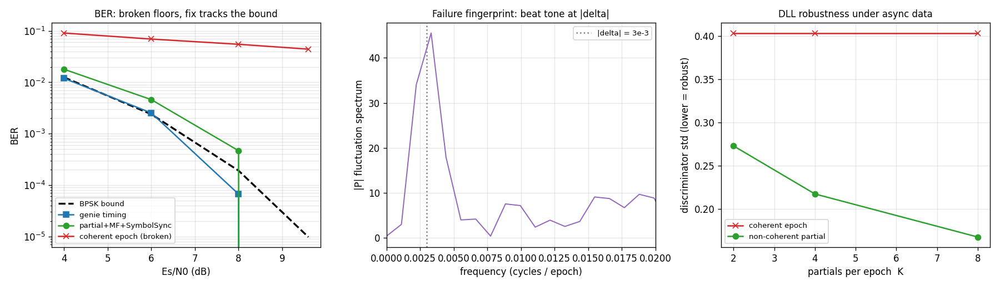
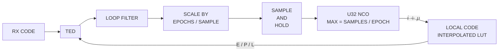

# AsyncDsssReceiver — the continuous DSSS receiver, from spec to object

*One page for continuous asynchronous DSSS, consolidated 2026-09-02 from
five: the receiver specification (`async-dsss-spec.md`, §1–§2), the
asynchronous despreader (`async-symbol-despreader.md`, §3) and its original
working design (`async-despreader-working-design.md`, §3.6), the continuous
use case that had grown inside [`burst-bank.md`](burst-bank.md) as its §11
(§5), and the searcher design written for it (`acq-multi-peak.md`, §6–§10,
§12–§13). §4 is the receiver as built; §11 is what it must gain for the
multi-emitter, always-searching use case. What the spec said about bursts
and about fleet service boundaries is not this receiver's concern and was
cut (git has it); `burst-bank.md` is bursts only.*

______________________________________________________________________

## 1. The specification

The waveform and the receiver requirements, as given:

- Level: Any
- Nominal frequency: 2.5 GHz
- Frequency uncertainty: +/- 50 kHz
- Frequency rate of change: < 500 Hz/s <sup>[(1)](#note-1)</sup>
- Waveform: Continuous DSSS BPSK
- Waveform exemplary use-case:
    - Code: CCSDS Command link Gold Code 1023 chips repeating
    - Chip rate: 3.069 Mcps
    - Modulation: Asynchronous Rectangular BPSK @ 2700 bps
- Es/N0 >= 5 dB <sup>[(2)](#note-2)</sup>

### 1.1 Target implementations

- Complete C receiver in `libdoppler.{a,so}`, to compile into C/C++
    applications.
- Complete Python receiver, the same object through the binding.

What the application wants from it: **continuous**
reception — tracking loops that run for the life of a pass, not bounded
bursts — and **parallelism on one server, not a cluster**. The server has
many cores, and the design should use as many processes and threads as
the work needs: the searcher on its own, each assigned receiver on its
own, all fed from one stream on one machine (§5, §11). What is ruled out
is the fleet — pods, a scheduler, state hopping between nodes. The
receiver's `get_state`/`set_state` remain for a checkpoint and restart
mid-pass and for handing a receiver between processes on the same box,
not for scaling across machines. The fleet and per-burst service shapes
the original spec also described belong to the burst chain and are not
this page's concern.

### 1.2 Notes on the specification

<a id="note-1"></a>**(1)** The rate bound is the standard LEO worst-case
nadir-pass figure, `f_dot_max = (f_c/c)·(v²/h)`: at 2.5 GHz and a
representative 800 km altitude it is ~579 Hz/s, so 500 Hz/s is that bound
with a small margin.

<a id="note-2"></a>**(2)** The Es/N0 floor is measured, not chosen: the
receiver's characterization
([#99](https://github.com/doppler-dsp/doppler/issues/99)) found a hard
pull-in cliff between 4 and 5 dB — 3 and 4 dB never lock (BER near
chance), 5 dB locks cleanly (BER matching theory) — independent of loop
bandwidth (`bn_car` 0.005–0.02) and of Doppler rate (0–500 Hz/s). That
cliff was measured on the coarse-hand-off pipeline, before the refining
stage of §4 existed; it has not been re-measured with it, and may sit
lower now. Treat 5 dB as the current floor, not a settled limit.

### 1.3 Derived: tracking loop bandwidths

Every tracking loop — the code DLL and the Costas carrier loop; there is
no FLL — is sized to
a loop SNR `rho ≥ 20 dB` at the Es/N0 floor, using the PLL relation
`rho(dB) = Es/N0(dB) − 10·log10(2·bn)`, where `bn` is the loop's noise
bandwidth normalised to its own update rate (`doppler.track.LoopFilter`'s
convention, so the update rate cancels). At the floor,
`bn ≤ 10^((5 − 20)/10) / 2 ≈ 0.0158`; the shipped rule is **`bn ≤ 0.01`
for every loop**, inside that bound. The code loop's per-epoch SNR is
Es/N0 scaled by `1/epochs_per_symbol`, which at this waveform is
`3000/2700 ≈ 1.11` — within 0.5 dB — so the same bound applies to it
without a separate derivation.

`bn` is not what sets the pull-in cliff of note (2): sweeping `bn_car`
across 0.005–0.02 left it unchanged. The loop-SNR derivation sizes
steady-state jitter once locked; pull-in below the floor is a separate
behaviour, and the refining stage of §4 is what addresses it.

### 1.4 A second operating point

The C++ application's continuous waveform is the same shape at different
numbers — a 1023-chip Gold code at **2 to 5 Mcps**, a DDC from **13 MSa/s** to
twice the chip rate, `D = 1`, ±50 kHz to start and likely ±5 kHz after
Doppler pre-compensation, up to ten emitters on one code at once — and a
throughput floor of 30 MSa/s, comfortably. Those numbers, and what they do to
the search and the receiver pool, are worked in §6.1 and §6.4; §11 is the
receiver's side of them.

______________________________________________________________________

## 2. Acquisition

### 2.1 User-facing API

**Two classes, `Acquisition` (continuous) and `BurstAcquisition`, over one
C engine.** Rather than one class with a `mode` and per-parameter "ignored
in this mode" caveats, each exposes only the parameters that mean
something for it. Both are thin front doors onto the same `acq_state_t` /
`acq_core.c` — state, auto-sizing, `push()` and serialization shared —
through two public constructors calling one internal builder with the
mode fixed, the secondary-constructor idiom `dll_core.h` also uses.

**One public name for the Doppler axis: `doppler_bins`.** Rolling the
shared epoch FFT by `k` bins produces a Doppler hypothesis exactly as a
slow-time FFT row does. Internally the engine keeps two fields for the
two *mechanisms*, only one of which is ever active: `coherent_bins` (the
slow-time FFT depth from coherent multi-epoch integration —
`BurstAcquisition`'s axis) and `window_bins` (roll-tiled frequency
windows, each a single-epoch FFT rolled to another hypothesis —
`Acquisition`'s axis). They are named for mechanism, not regime: the
roll-tiled axis is not computed non-coherently, and "non-coherent" here
means `n_noncoh` — repeated dwells accumulated for SNR at a fixed
hypothesis set, an axis that composes with either mechanism.

**No `doppler_resolution`, `doppler_rate` or `max_noncoh`.** The first two
existed to size a coherent depth safely under continuous data, and there
is no such thing: coherent combining under asynchronous data is a
structural mislock, not a trade-off, so the continuous class has no
coherent-depth axis for them to tune. `n_noncoh` is auto-selected to meet
`pd` at `pfa` and exposed read-only; its only bound is an internal safety
valve (`ACQ_N_NONCOH_SAFETY_CEILING`, 256 looks) because the
semi-analytical `pd_predicted` model turns non-monotonic past that — a
modelling limit, not a sensitivity one.

#### `Acquisition` (continuous)

`doppler_bins` here is the `window_bins` mechanism (roll-tiled): no
coherent multi-epoch combining is ever attempted, closing the aliasing
footgun (task #67: coherent combining is not a graceful-loss
trade-off under continuous async data, it's a structural mislock).
Sensitivity margin comes entirely from auto-selected `n_noncoh`.

| Parameter             | Type                                   | Default      | Description                                                                                                                                                   |
| --------------------- | -------------------------------------- | ------------ | ------------------------------------------------------------------------------------------------------------------------------------------------------------- |
| `code`                | `NDArray[uint8]`                       | *(required)* | Binary (0/1) code, segment, or preamble chips to search for; sets `sf = len(code)`.                                                                           |
| `spc`                 | `int`                                  | `4`          | Samples per chip (>= 1).                                                                                                                                      |
| `chip_rate`           | `float`                                | `1e6`        | Chip rate in Hz (> 0).                                                                                                                                        |
| `symbol_rate`         | `float`                                | `1000.0`     | Continuous data-symbol rate in Hz (> 0).                                                                                                                      |
| `cn0_dbhz`            | `float`                                | `50.0`       | Carrier-to-noise density in dB-Hz (> 0) -- the sensitivity used to size the search.                                                                           |
| `doppler_uncertainty` | `float`                                | `0.0`        | One-sided Doppler search half-range in Hz; `0` = full native span (one `doppler_bin`). Tiles into `doppler_bins` windows whenever it exceeds one native span. |
| `pfa`                 | `float`                                | `1e-3`       | Target system (max-of-N) false-alarm probability, in `(0,1)`.                                                                                                 |
| `pd`                  | `float`                                | `0.9`        | Target detection probability, in `(0,1)`.                                                                                                                     |
| `noise_mode`          | `Literal["mean","median","min","max"]` | `"mean"`     | CFAR reference-cell aggregation mode.                                                                                                                         |

#### `BurstAcquisition`

The burst front door over the same engine — `doppler_bins` there is the
`coherent_bins` mechanism, auto-sized in `[1, reps]` for coherent gain over
an unmodulated preamble. It is not this receiver's concern; its parameters
and the burst chain are in
[`dsss-burst-receiver.md`](dsss-burst-receiver.md).

### 2.2 Output data structure: `DetectionEvent` (the acquisition handoff)

`DetectionEvent` is the DATA -- the acquisition handoff is the ACTION
(the process of converting a raw `push()` hit into this record and
handing it to the next block/service); the two aren't the same thing,
naming them separately on purpose.

The detection output has to be consumable by another thread or process
— the orchestrator of §5 and §11, a C++ application — not just another
Python object in the same interpreter, so it can't be the raw
grid-relative indices
(`doppler_bin`, `code_phase`) alone, since those are meaningless
without also shipping the emitting object's own config (`spc`,
`doppler_res_hz`, ...) alongside. Every field below is already
converted to a physical unit, so the record is self-contained: a flat,
pointer-free POD, safe to serialize across a thread or process boundary.
In C it is what `acq_build_handoff()` produces from a hit and what seeds
the receiver of §4.

One `DetectionEvent` record is emitted per detection event (i.e. once
per `push()` hit, on both classes -- same shape, since both share the
underlying engine):

| Field              | Type       | Description                                                                                                                                                                                                                                                                                                                                         |
| ------------------ | ---------- | --------------------------------------------------------------------------------------------------------------------------------------------------------------------------------------------------------------------------------------------------------------------------------------------------------------------------------------------------- |
| `timestamp_ns`     | `uint64_t` | UNIX time (ns) this detection's samples occurred, per the codebase's existing `dp_sample_clock_t` convention (`native/inc/timing/timing_core.h`): `epoch_real_ns + samples_consumed/fs`, NOT a fresh syscall timestamp at emit time -- reproducible, and already how `dp_header_t`/SigMF-metadata timestamps are derived elsewhere in this project. |
| `samples_consumed` | `uint64_t` | The raw sample offset (since this engine's own stream start) this detection's epoch ended at -- the `n` that `timestamp_ns` above was derived from. Kept alongside `timestamp_ns`, not instead of it: replay-safe (no wall-clock dependency) and lets a consumer re-derive/cross-check the time against its own clock anchor.                       |
| `chip_phase`       | `float`    | Code phase in CHIPS (not raw samples) -- the code-tracking seed for the next stage.                                                                                                                                                                                                                                                                 |
| `doppler_hz_est`   | `float`    | Coarse Doppler estimate in Hz, already folded/signed/scaled from the raw `doppler_bin` index.                                                                                                                                                                                                                                                       |
| `doppler_res_hz`   | `float`    | Width of that estimate -- the remaining uncertainty (±`doppler_res_hz`/2) a downstream refine/tracking stage still has to close.                                                                                                                                                                                                                    |
| `cn0_dbhz_est`     | `float`    | Estimated carrier-to-noise density (dB-Hz) -- informs downstream loop-bandwidth and dwell sizing.                                                                                                                                                                                                                                                   |
| `peak_mag`         | `float`    | Raw CFAR peak magnitude -- diagnostic/observability passthrough, not needed for tracking math.                                                                                                                                                                                                                                                      |
| `noise_est`        | `float`    | Raw CFAR noise-floor estimate -- diagnostic passthrough.                                                                                                                                                                                                                                                                                            |
| `test_stat`        | `float`    | Raw CFAR gating statistic -- diagnostic passthrough.                                                                                                                                                                                                                                                                                                |

**Timing.** `acq_result_t` carries `samples_consumed`; the timestamp is
`dp_sample_clock_t`'s `stamp_at(samples_consumed)`, and the stream layer
carries an origin timestamp hop to hop rather than re-reading a clock. The
engines themselves are clock-agnostic — pure sample-domain, no I/O — so
the anchor comes from whatever feeds them samples and is threaded through
by the composing layer (the receiver, or the orchestrator of §5).

**No `carrier_freq` parameter on either class.** The engine works in
baseband Doppler Hz throughout; the carrier-aiding scale
(`doppler_hz_est · chip_rate / carrier_freq`) is computed by the component
that knows the carrier — the tracker takes `carrier_freq_hz` itself. That
keeps the engine usable by a baseband-only caller with no carrier at all.

### 2.3 The wideband search, as settled

- **The native span is one epoch's bin.** A `D`-point slow-time FFT
    sampled at the epoch rate has a fixed `±epoch_rate/2` range whatever
    `D` is — more bins subdivide the same range, they never widen it. At
    3.069 Mcps and 1023 chips that is `chip_rate/sf` = 3.0 kHz per bin,
    a half-span of 1.5 kHz; the spec's ±50 kHz is 33 of them.
- **`D = 1`, always, for continuous data.** Coherent multi-epoch
    combining under asynchronous data aliases the data's own spectrum
    across the Doppler axis and mislocks structurally
    ([`dsss-acquisition.md`](dsss-acquisition.md)); with one epoch there
    is no multi-epoch axis to alias across. Sensitivity comes from
    non-coherent accumulation over `n_noncoh` epochs, which sums
    magnitudes and is immune to data sign flips.
- **The uncertainty is tiled by rolling one spectrum, not by a mixer
    bank.** One forward FFT of the epoch, then the spectrum rolled by `k`
    bins per hypothesis against one precomputed replica spectrum: one
    forward plus one inverse per tile, against a forward *and* an inverse
    per tile for a bank of down-converters. Measured in the prototype at
    1.2–1.55× faster; adopted as the engine's wideband mode
    (`acq_core.c`), so all tiles come from one object's per-epoch loop.
    The engine sizes the tile count itself, odd and symmetric
    (`acq_cover_window_bins`): 35 at 3.069 Mcps over ±50 kHz, 21 at
    5 Mcps, 53 at 2.
- **What it costs is measured, per tile.** `bench_acq_core.c` times a
    real `acq_push()` per dwell on this waveform and on the operating
    point of §6.1; the number is about 10 ns per tile per output sample
    (§12.1), which is what makes the searcher's cost the same at 2 and 5
    Mcps and over a core at ±50 kHz.
- **Open:** the `n_noncoh` sizing against epochs that straddle a data
    transition — a graceful per-epoch loss on some of the `nc` epochs,
    not a mislock, and not separately quantified for the continuous
    engine.

______________________________________________________________________

## 3. The asynchronous despreader

**Scope:** the receive-side despreader when the **data-symbol rate is on the
order of the code-epoch rate but asynchronous** to it. This is theory, the
failure mechanism, and a validated robust architecture that composes existing
`doppler.track` primitives. The reproducible study is
`src/doppler/examples/async_despreader_study.py`
(`python -m doppler.examples.async_despreader_study`).

______________________________________________________________________

### 3.1 The two-clock problem

A DSSS receiver despreads by integrating early/prompt/late correlations over one
**code epoch** (`TE = sf·sps` samples) — an integrate-and-dump locked to the
*code* clock. The data symbols are a separate stream; the despread prompt per
epoch carries the data.

That works when the symbol clock is locked to the code clock at an integer ratio
(GPS C/A: 20 code epochs per data bit, bit edges on epoch edges). It **breaks**
when the symbol clock is *independent*:

```
T_sym = TE · (1 + delta)        # symbol period, samples
                                # delta = symbol-vs-code rate offset
phi_sym                         # independent symbol phase
```

with `T_sym ≈ TE` (symbol ≈ one epoch). This is the hard regime: ~one symbol per
epoch, a transition roughly every epoch, and — crucially — `delta ≠ 0` makes the
symbol boundary **slide continuously** through the epoch at the beat rate
`delta / TE`.

______________________________________________________________________

### 3.2 Why per-epoch despreading fails

The coherent prompt over an epoch whose data flips at fraction `f ∈ [0,1]`:

```
P(f) = A·[ f·d1 + (1−f)·d2 ]  =  A·d1·(2f−1)        (d2 = −d1)
```

- `f → 0, 1` (flip at an epoch edge): `|P| = A` (full despread).
- `f → 0.5` (flip mid-epoch): **`|P| = 0`** — total coherent cancellation.

Because `delta ≠ 0`, `f` sweeps through every value, so ~half of all epochs
straddle a transition and their prompts collapse. The consequences:

1. **Data**: per-epoch decisions floor — the BER plateaus regardless of `Es/N0`
    (the straddle epochs carry no usable energy). Measured floor ≈ 1e-1 even when
    the bound is < 1e-5.
1. **Code**: the early/late discriminator `(|E|−|L|)/(|E|+|L|)` collapses to
    `0/0` on straddle epochs → the DLL is starved → the code loop wanders.

**Root cause:** at one prompt per epoch the symbol clock is **unobservable** (a
single sample per symbol cannot drive a timing loop), and the integration window
is forced to straddle transitions.

#### Diagnostic fingerprint

The straddle modulation is periodic at the symbol↔epoch beat. The spectrum of
the prompt-magnitude stream `|P[n]|` shows a **tone at `|delta|` cycles/epoch**
(centre panel of the figure). This is the signature to look for when a DSSS link
shows unexplained despread fades — it identifies this failure class directly.

______________________________________________________________________

### 3.3 Robust architecture



The fix gives the symbol clock its own observability and its own matched filter,
and makes code tracking insensitive to data sign — composing primitives that
already exist.

#### 3.3.1 Data path — partial correlations + symbol matched filter + SymbolSync

1. **Partial correlations.** Split each code epoch into `K` sub-epoch partial
    prompt correlations (each `TE/K` samples, known code phase). This yields `K`
    despread samples per epoch ≈ `K` samples per symbol — the symbol clock is now
    **observable**.
1. **Symbol matched filter.** A length-`K` **boxcar** over the partial stream.
    This is a *sliding, symbol-aligned* coherent re-integration of the partials —
    the full-symbol despread the epoch-locked window could not form. It is
    essential: without it, the rectangular symbol pulse is sampled at one point
    and only ~1/`K` of the symbol energy is captured (the BER floors at ~2e-2).
1. **SymbolSync.** [`track.SymbolSync`](../api/python-track.md) (Gardner TED +
    Farrow interpolator) recovers the independent symbol clock (`delta`, `phi`)
    from the matched-filtered stream and decimates at the symbol-aligned peak.

**Result (left panel):** the BER follows the BPSK matched-filter bound within
~1–2 dB. A **genie** reference (coherent symbol-aligned despread with *known*
timing) hits the bound exactly — the loss was only window misalignment, never
SNR. The broken per-epoch path floors.

| Es/N0  | bound  | genie (known timing) | partial+MF+SymbolSync | broken epoch |
| ------ | ------ | -------------------- | --------------------- | ------------ |
| 6 dB   | 2.4e-3 | 2.5e-3               | 4.5e-3                | ~7e-2        |
| 8 dB   | 1.9e-4 | 1.5e-4               | 5.8e-4                | ~6e-2        |
| 9.6 dB | 9.7e-6 | 0                    | 0                     | ~5e-2        |

#### 3.3.2 Code path — non-coherent partial combining

The DLL keeps tracking through data flips by combining the partial correlations
**non-coherently**: `|E| = Σ_k |E_k|`, `|L| = Σ_k |L_k|`. A data flip changes a
partial's *sign*, not its *magnitude*, so only the one straddling segment
degrades (~`1/K`). This roughly **halves the discriminator variance** versus the
coherent-epoch form (right panel) — keeping the (already validated, smooth
sub-chip) code loop locked. It needs no symbol timing, so it works from cold
start; the bootstrap order stays sequential: DLL (non-coherent) → SymbolSync →
data.

#### 3.3.3 Choosing K

`K` trades observability and straddle-robustness against the non-coherent
squaring/Rician bias (which erodes the discriminator gain as `K` grows). The
study shows **`K = 4` as the sweet spot** for `T_sym ≈ TE` (best discriminator
SNR; `K = 8` loses more gain than variance). `K` must divide `TE`.

______________________________________________________________________

### 3.4 Scope: the despreader removes the code and outputs samples

The despreader's one job is to **remove the PN code and output samples**. The
asynchronous symbol clock is merely *why* it despreads in `K` partial
correlations (§3.3) — it is not a reason to recover symbols here. **Carrier
recovery and symbol extraction are downstream problems**, handled by separate
objects fed from the despreader's output:

```
              ┌──────────────── the despreader ───────────────┐
acq seed →    Dll(segments=K):  E/P/L correlate · partial dump · non-coherent
   (code phase)                 (|E|−|L|) code loop
              └───────────────── partial stream out ──────────┘
                         │  K oversampled async BPSK samples/symbol
                         │  (PN removed; residual carrier + data still on them)
                         ▼
   downstream:  Costas (carrier recovery)  →  SymbolSync (symbol timing) → bits
```

This is **`track.Dll(..., segments=K)`** — no new object. `segments=1` is the
classic coherent full-epoch DLL; `segments=K>1` is the streaming async
despreader. It composes downstream with `Costas` and `SymbolSync`, which already
exist (the data path of §3 is exactly that composition).

#### Why the carrier belongs downstream

The DLL's `|E|−|L|` discriminator is **non-coherent**, so code tracking is
**carrier-blind** — it locks with a residual carrier still on the samples. And
because each output is a *partial* (a `TE/K`-sample integrate-and-dump, not a
full epoch), a residual carrier barely dents it. For a ½-Doppler-bin residual
after acquisition the I&D loss is `sinc(Δφ/2)` with `Δφ = π/segments`:

| segments | window | Δφ at ½-bin residual | despread loss |
| -------- | ------ | -------------------- | ------------- |
| 1        | `TE`   | `π`                  | **−3.9 dB**   |
| 4        | `TE/4` | `π/4`                | **−0.2 dB**   |

So short partials make the despread carrier-tolerant: the small residual just
rides out on the output (a ring in the constellation; see the gallery demo), and
a downstream `Costas` loop removes it at full symbol SNR. Putting a carrier loop
*inside* the despreader would only matter for long coherent integration — which
partials deliberately avoid.

#### The same scope rule applies to the DSSS-MPSK composition

`Dll(segments=K) -> MpskReceiver` (`docs/gallery/dsss-receiver.md`) is
the other downstream composition, and the same rule bites the same way: the
despreader's partial-correlation output rate is whatever `K*chip_rate/SF`
comes out to — a sub-multiple of the chip rate, not chosen with
`MpskReceiver`'s `sps` in mind. An early version of that gallery page
violated its own §3.4 by picking `K` specifically so
`round(K*T_sym/T_epoch)` landed on an integer, coupling `Dll`'s own
tracking parameter to `MpskReceiver`'s sample-rate requirement. That made a
perfectly good `Dll` tuning look downstream-broken. The fix is
`doppler.resample.RateConverter` between the two — an explicit, arbitrary-
ratio resample stage, the same category of fix as `Costas`/`SymbolSync`
being separate objects from `Dll` here. Choose `segments` for the
despreader's own tracking quality; choose the demodulator's `sps` for its
own reasons; bridge the two with a resampler, never by coupling the
parameters directly.

### 3.5 Code-lock detection (always on)

A tracking channel must always answer one question: *am I locked?* The DLL
carries an **always-on** lock detector that reuses **acquisition's** non-coherent
test statistic, so acquire and track agree on what "detected" means.

**Statistic.** Each emitted look (a partial in `segments` mode, the full-epoch
prompt when `segments=1`) contributes its prompt power `|P_k|²`. The detector
sums `N = n_looks` consecutive looks and forms

```
R = sqrt( 2 · Σ_{k=1}^{N} |P_k|²  /  E|O|² )
```

which under H0 (noise only) has `P(R > η) = marcum_q(N, 0, η)` — exactly the
acquisition tail. So a caller sizes the threshold `η = det_threshold_noncoherent(pfa, N)` and the depth `N = det_n_noncoh(snr, …)` to
meet a target `(Pfa, Pd)`; `configure_lock(pfa, n_looks)` does the conversion
(default `pfa=1e-3`, `N=20`).

**The noise reference `E|O|²`.** Instead of a separate noise channel, the loop
correlates each look a second time at a **random off-peak code phase** — a whole
chip offset re-drawn every epoch and kept clear of the prompt/early/late lobe by
`noise_guard` chips. For a low-sidelobe code (Gold, long PN) that offset
correlation is signal-free, so `|O_k|²` is a sample of the per-look noise power.
Cycling the offset and averaging recovers the same noise estimate a bank of
fixed off-peak taps would, with O(1) state.

**Why an EMA, and why it must be long.** The reference is an EMA of `|O_k|²`
(`E|O|² += α(|O_k|² − E|O|²)`), which is adaptive (tracks a drifting noise floor)
and O(1) — matching the `Costas` lock-metric pattern. The subtlety, found by
Monte-Carlo: the *detection* integrates a fixed `N` looks (that sets the χ²(2N)
threshold), but the *noise estimate* must average **many more** cells than `N`,
or its own variance inflates Pfa. One offset cell per look (`L=N`) drives Pfa
~400× high; `1/α = max(1024, 32·N)` (`L_eff ≫ N`) holds Pfa at target with
`Pd ≈ 0.98`. So the integration depth and the noise-averaging length are
**decoupled**: `N` is the test, `1/α` is the reference. The reference uses a
**cumulative-mean bootstrap** — it is the running average until `1/α` looks have
accrued, then relaxes to the fixed-α EMA — so the noise floor is unbiased from
the first look instead of seed-dominated for the ~`1/α`-look warm-up (otherwise
Pfa runs ~10× high until the EMA settles, ~hundreds of epochs in). Verified
end-to-end: empirical Pfa ≈ `9e-4` against the `1e-3` target right from the
start of a noise stream.

**Readouts.** `Dll.locked` (bool, latched each `N`-look decision), `Dll.lock_stat`
(the last `R`), `Dll.noise_est` (`E|O|²`). The detector runs inside the normal
`steps()` — no separate method, no opt-in. The threshold conversion (the one
`detection`-module call) lives in the binding so `dll_core` links only `-lm`.

### 3.6 The look-back window — the original working design

*The note the C `Dll`'s dwell-integral look-back was built from
(`native/inc/dll/dll_core.h` cites it as its reference); kept verbatim, in
NumPy, as the algorithm's own statement.*

> **Important:** This assumes at most one data symbol transition per code epoch



- TED generates one error per epoch using the signal power formed by correlating
    the rx signal with local code replicas E, P, and L over a window _which maximizes power_
    of the prompt correlation and forms the error:

    ```text
    code_phase_error = 0.5 * (early_power - late_power) / signal_plus_noise_power
    ```

- This requires storing a buffer of the last received samples to "look back" in the case
    where a transition occurs in the current sample buffer so a transition free epoch may be
    obtained

- This is scaled down and repeated driving the NCO at 2x chip rate

- Local code is 2 samples per chip and linear interpolation is used to compute fractional samples

- LUT outputs early, prompt, and late codes offset by 1/2 chip (1 sample)

```text

# Init
code_size = 1023
samples_per_chip = 2
max_error = 0.5 # dB async correlation loss
phases = code_size * samples_per_chip
phase_resolution = 1 - 10 ** (-max_error / 10)
phase_step = int(np.ceil(phases * phase_resolution))
factors = [i for i in range(1, phases + 1) if phases % i == 0]
phase_step = factors[np.abs(np.array(factors) - phase_step).argmin()]
windows, window_size = int(phases / phase_step), phase_step
last_backard_sums = np.zeros(windows, np.complex128)
last_early_sums = np.zeros_like(last_backward_sums)
last_late_sums = np.zeros_like(last_backward_sums)

def find_max_power(x, windows, step_size, last_backward_sums):
    """Find max correlation over different output phase offsets."""

    # First compute the partial sums of the current correlation
    partial_sums = x.reshape(windows, step_size).sum(axis=1)

    # Now sum up the portions of the windows this epoch contributes
    sums = partial_sums.cumsum()
    backward_sums = partial_sums[::-1].cumsum()

    # Use the last epochs backward looking sums and the current
    # epochs forward looking sums to comput the overlapping correlation
    # at each phase across the two epochs and keep the maximum
    correlations = np.zeros(sums.size)
    correlations[-1] = np.abs(sums[-1] / (code_size * samples_per_chip))
    correlations[:-1] = (
        np.abs(sums[:-1] + last_backward_sums[::-1][1:])
        / (code_size * samples_per_chip)
    )
    max_window = correlations.argmax()
    max_abs = correlations[max_window]
    max_power = max_abs ** 2

    # Use partial sums as integrate and dump downsampled output
    integrate_and_dump = partial_sums / (step_size * max_abs)

    # Compute window index. This is the offset from the end of the last
    # correlation window that is the start of the max power correlation
    # window.
    window_index = (windows - 1 - max_window) * step_size

    return (
        max_power,
        max_window,
        backward_sums,
        integrate_and_dump,
        window_index
    )

def get_window(x_window, x, last_x, index):

    if index:
        x_window[:index] = last_x[-index:]
        x_window[index:] = x[:-index]
    else
        x_window = x[:]

    return x_window

# In your loop

while signal_buffer,more_data:

    # NCO + interpolated LUT
    early, prompt, late = pn_gen.steps(
        pn_control
    )

    b = signal_buffer.get()
    x = b * prompt
    power, window, last_backward_sums, integrate_and_dump,window_index = find_max_power(
        x, windows, window_size, last_backward_sums
    )
    signal_plus_noise_power = power

    b_win = get_window(b_window, b, last_b, window_index)
    last_b = b[:]
    early_win = get_window(early_window, early, last_early, window_index)
    last_early = early[:]
    late_win = get_window(late_window, late, last_late, window_index)
    last_late = late[:]

    early_power = np.mean(b_win * early_win) ** 2
    late_power = np.mean(b_win * late_win) ** 2
    code_phase_error = 0.5 * (early_power - late_power) / signal_plus_noise_power
    loop_filter.step(code_phase_error)
    pn_control = np.full(loop_filter.out / (code_size * samples_per_chip))

```

### 3.7 Symbol-timing-aided lock looks — the max-power search at symbol scale

*Designed and built 2026-09-02, after §12.3 measured the code-lock flag
reading "unlocked" 96% of the time at Es/N0 5.7 dB on a loop that never
lost the code, and the telemetry showed why (§12.4).*

The partial-and-non-coherent form of §3.3 is forced by the data: a
full-epoch coherent look collapses on a transition, so the code-lock
detector's look was the quarter-epoch partial, the smallest integration
the asynchronous data allows when nothing is known about where its
transitions fall. That is also the weakest look. At the operating point a
partial carries −2.9 dB per look at Es/N0 5.7 dB, and the detector's
default 20 looks, sized for nothing in particular, sat below threshold.

The look-back of §3.6 already knows how to find a transition-free window:
it picks, per epoch, the one-epoch window with the most power. What it
does not know is the symbol *period*, and the receiver does — it is
`segments · chip_rate / (sf · symbol_rate)` partials, 7.24 here. With the
period the same search lifts to the symbol scale:

- `ceil(P)` boundary-phase hypotheses, each placing a boundary every `P`
    partials and owning a window of `L = min(floor(P) − 1, 4 · segments)`
    partials after it — short enough to sit inside one symbol under the
    hypothesis's quantisation, capped so a slow data clock never asks for
    coherence across more carrier than the wipe-off holds;
- each hypothesis sums its window coherently and keeps an EMA of the
    window's power over ~32 symbols; the hypothesis with the most power
    **is** the symbol timing, and its windows are the detector's looks.

A look then integrates `L` partials coherently and never straddles a
transition: six instead of one here, 7.8 dB more per look, and
`det_n_noncoh` sizes the detector at 10 looks for Pd 0.99 at the floor
instead of 161. The search needs no decision and no external timing, so it
costs nothing at cold start and follows a drifting symbol clock by itself.
An external phase from the demodulator can be accepted later as an
additive hook; it was not needed to reach the result.

The code discriminator runs on the same window. The loop steers once per
symbol on the early/prompt/late sums over the winning window, its filter
re-timed to the symbol interval so `bn` keeps its per-epoch meaning and
the tracked rate is continuous when the aid is switched on or off. What
that buys and costs is measured in §12.5: a loop about 20% faster to pull
in and tighter above 45 dB-Hz, and 1.2–1.4× the jitter at the floor,
where the noise sets it and the window's unused partials cost more than
its coherence buys — hundredths of a chip either way. The emitted partial
stream is untouched: the look-back still supplies its normalisation.

The receiver applies it at chain build: `dll_set_symbol_period` from its
configuration, `n_looks` from `det_n_noncoh` over the window at its
`cn0_dbhz`, and the drop count from `det_verify_count(1 − pd, 1e-6)` —
three consecutive misses, against the DLL's fixed two — so the verify
hysteresis is a budget, not a constant. Pinned by `test_dll_core.c` §6b
(per-partial looks up 35% of the time, aided 100%, the chosen phase within
one partial of the truth) and §6c (the loop steers on the window; the two
modes' step transients agree, which a filter left at its per-epoch gains
fails; the rate is continuous across the switch), both sabotage-proven,
and measured in §12.4 and §12.5.

______________________________________________________________________

## 4. The receiver as built

`AsyncDsssReceiver` (`native/inc/async_dsss_receiver/async_dsss_receiver_core.h`)
is the composed continuous receiver, one C object, the production port of the
validated Python `search → refine → track` prototypes. It has three states,
read back through `get_refining()`/`get_tracking()`:

- **searching** — samples feed an embedded continuous `Acquisition` (§2,
    window-tiled over `doppler_uncertainty`, `D = 1`). A hit becomes a hand-off
    through `acq_build_handoff()`, which seeds the refine stage; the unconsumed
    tail of the same call is handed straight to it.
- **refining** — a frozen-carrier derotation at the coarse estimate feeds a
    collection `Dll` whose look-back segments oversample each epoch, then a
    `RateConverter` to `CarrierAcquisition`'s own rate, then
    `CarrierAcquisition` itself. When it reports ready or gives up, the live
    tracking chain is built **fresh** from the *original* hand-off chip phase
    and the refined (or, on give-up, unrefined) Doppler.
- **tracking** — the refined carrier is unfrozen into a live pre-despread
    Costas loop (`costas_update()` once per code period, driven by a
    non-data-aided squaring discriminator over the period's coherent partials)
    → `Dll` (§3, `segments = K`) → `RateConverter` → `MpskReceiver`. Two lock
    detectors run: the `Dll`'s own CFAR-based **code lock** (`get_code_locked()`,
    §3.5) and a hysteretic **symbol lock** on the emitted symbols
    (`get_locked()`, the `cos(2φ)` statistic over a 30-symbol dwell, declared
    after 30 consecutive symbols at or above 0.5 and dropped after 15 below 0.3).

`DsssReceiver` is the same object without the refining stage — a hit's coarse
Doppler goes straight to tracking — and §1.2's note (2) is why the refine
exists: the 4–5 dB pull-in cliff the coarse-only hand-off left. `reset()` on
either returns to searching: a receiver that has locked cannot be reset back
onto the same signal, only back to the hunt. Both are serializable
(`state_bytes`/`get_state`/`set_state`), every child included.

### 4.1 Status

- **Shipped — the despreader.** `Dll(..., segments=K)` (the §3.3 code+symbol path;
    `segments=1` = the classic coherent DLL). Validated **carrier-present**: code
    lock holds with a residual carrier on the samples, and the partial output is
    losslessly recoverable by a downstream carrier wipe + symbol despread
    (`test_dll.py::test_segments_carrier_present_*`). The streaming binding returns
    an independent array per call (block-size invariant).
- **Shipped — the inline symbol-loop primitive.** `symsync_step()` (the
    per-sample SymbolSync composition API); `symsync_steps()` is it in a loop.
- **Shipped — the always-on code-lock detector** (§3.5). `Dll.locked` /
    `lock_stat` / `noise_est`, tuned by `configure_lock(pfa, n_looks)`; reuses
    acquisition's non-coherent statistic with a random off-peak EMA noise
    reference. Validated signal-vs-noise in `test_dll.py` / `test_dll_core.c`.
- **Downstream, already available:** `Costas` (carrier recovery) and
    `SymbolSync` (Gardner + Farrow symbol timing). A receiver is the pipeline
    `Dll(segments) → Costas → SymbolSync`; the §3.3 study and the
    `async_despread_demo` gallery example show the composition.
- **End-to-end validated with a real acquisition front end.**
    `Dll(segments=K) → MpskReceiver` (`MpskReceiver` already fuses matched
    filter + NDA carrier acquisition + Gardner/Farrow timing + acq↔track
    handover into one object — its own docstring names this exact
    composition) is now proven at real physical parameters — a continuous
    1023-chip code at 3 Mchips/s, async 2100 sym/s BPSK data, with a genuine
    `Acquisition` search in front (see the
    [DsssReceiver](../gallery/dsss-receiver.md) gallery page,
    `src/doppler/examples/dsss_receiver_demo.py`).
    Note that `K=4` (§3.3.3) is tuned for the DLL's own code-discriminator
    variance, not for feeding a downstream matched filter — each partial is
    `K`-times weaker than a full coherent epoch, so a downstream receiver
    needs a much larger `K` (34, in the validated example) to reconstruct
    real coherent gain before its own carrier/timing loops can converge.
    The acquisition hand-off also needs two non-obvious unit conversions
    (`Dll`'s `init_chip` is phase-*inverted* relative to `Acquisition`'s
    `code_phase`; `MpskReceiver`'s `init_norm_freq` is cycles per its own
    *partial-rate* input, not per raw ADC sample) — see the example's
    docstring for the exact formulas.

#### Possible refinements

- **Symbol MF length.** A downstream length-`K` boxcar matched filter follows the
    BPSK bound within ~1–2 dB; matching it to the *tracked* symbol period closes
    the gap.
- **Closed-loop code-jitter asset.** Drive the non-coherent partial code loop
    under async data + code Doppler; confirm lock retention and the low-SNR
    threshold (`bn≈1e-5` held to 4 dB Es/N0; `bn≈0.002` lost lock at 6 dB).

______________________________________________________________________

## 5. The continuous case — the C++ application's waveform

*The use case as the maintainer described it, 2026-09-02, and every
"settled" or "answered" item on this page below traces to that description;
the numbers are derived from §1's waveform and the measurements in
`burst-bank.md` §10.4, and the questions at the end are open or answered
in the sections that follow.*

The C++ application does not receive bursts. It receives **continuous**
DSSS with asynchronous data — the CCSDS command-link shape
[`async-dsss-receiver.md`](async-dsss-receiver.md) already specifies (a 1023-chip
Gold code, 3.069 Mcps, ±50 kHz) — and the stream carries a **data-free
period of one code period just before each frame sequence**. Several
emitters are in the air at once on the **same** Gold code, and what tells
them apart is Doppler: each emitter's frequency difference *is* its
Doppler. There is **one frequency channel**: every emitter is in the same
band on the same code, and what distinguishes them is **code phase, power
and Doppler**.

### 5.1 What the data-free window changes

Everything the burst family assumes about a preamble holds for that window
and for nothing else in the stream:

- **There is no coherent gain to buy.** The data-free window is one code
    period, so `reps = 1` and the coherent depth is one epoch — exactly the
    continuous `Acquisition` engine's search (`D = 1`, sensitivity from
    non-coherent looks, `dsss-acquisition.md`'s warning). The window buys
    one clean epoch without a data transition inside it, which the
    continuous engine already prices as a straddle loss and survives. The
    bank's reason to exist in this use case is therefore **not** gain —
    §5.3 says what it is.
- **The hand-off is to a tracking receiver, not to a frame demodulator.**
    A burst ends; a continuous signal is tracked from the seed onward
    (`carrier_acq → Dll + Costas`, the monolithic C receiver). So the
    channel's product is the `DetectionEvent` the async spec defines —
    Doppler, code epoch, C/N0 — and the window copy `BurstCapture` makes is
    not needed for the signal's sake. What may still be needed is the
    capture's **refine**: the frame begins where the data-free window ends,
    so *which* code period the window ended on is the frame epoch, and
    acquisition alone cannot say (§3.1 of the receiver design). Whether
    the tracking receiver's own frame sync makes that redundant is
    question 3 below.
- **The channel repeats.** A burst is acquired once; a continuous signal
    is re-acquired at every data-free window, and between windows it drifts
    (< 500 Hz/s in the spec). The claim rule across windows is then
    "same signal, next frame", not "same preamble".
- **Emitters come and go, at their own frequencies, and the bank is
    always on the air.** An emitter rises into the band at some Doppler,
    is acquired at its next data-free window, is handed to a tracker, keeps
    transmitting while others rise and set around it, and eventually
    leaves. The bank never stops searching: a channel that has handed one
    emitter off must go on watching its band for the next, and an emitter
    that drops out must be noticed and re-acquired when it returns. That is
    a **lifecycle** — searching → acquired → tracked → lost → searching —
    the burst family has no state for; a `BurstCapture` is done when the
    window is out. It is also a **duration** requirement: the process runs
    for hours or days, so nothing in the bank may grow with time
    (`samples_fed` is 64-bit; the per-push scratch reaches its high-water
    mark and stays; the rings are fixed) and a checkpoint is for a restart
    mid-pass, taken while everything is live.

### 5.2 The numbers, from the spec and `burst-bank.md` §10.4

- Native span `3.069e6 / (2·1023)` = **1.5 kHz**; channel spacing 3.0 kHz;
    covering ±50 kHz takes `2·ceil(50/3)+1` = **35 channels** — one bank,
    since there is one code.
- At `spc = 2` the source is 6.14 MSa/s; at `burst-bank.md` §10.4's 48 ns/sample a channel
    is **0.29× real time**, so the bank is **~10× real time** — eight cores
    at the measured 5.8× pool speedup do not keep up. Two things follow:
    the C++ application's own threads (`burst-bank.md` §10.1, the primary path) are not
    optional, and the per-channel cost is the number to attack first — 48
    ns/sample was measured for `DDC → BurstCapture`, and a channel that
    hands off a `DetectionEvent` rather than a window needs neither the
    capture's ring nor its refine.
- The continuous engine's own `window_bins` tiling covers ±50 kHz in
    **one** engine at the same `D = 1` — the same tiling this bank does
    with DDCs, at the same sensitivity. What the single engine cannot do is
    §5.3's first item, and that, not gain, is what the `K`-fold cost buys.

### 5.3 The async tools, and what the bank adds to them

The continuous chain exists and is the thing to compose, not to rebuild.
`AsyncDsssReceiver` is one object with a three-state machine — **searching**
(the continuous `Acquisition`, window-tiled over the uncertainty),
**refining** (`acq_build_handoff` → a frozen-carrier `Dll` →
`CarrierAcquisition`), **tracking** (Costas → `Dll` → `RateConverter` →
`MpskReceiver`) — and it is the validated C port of the search → refine →
track prototypes. `DsssReceiver` is the same without the refining stage.
Both cover the whole ±50 kHz in one engine at `D = 1`.

So the C++ application's channel is not `DDC → BurstCapture`. Against what
already exists, the bank adds exactly three things, and each is a design
decision rather than a given:

- **Resolution on the (Doppler × code phase) surface.** Every emitter
    is a peak on the same 2-D surface a channel already computes, at its
    own Doppler bin and code phase, with its own power. A Doppler bank
    partitions one axis of that surface: emitters more than a span apart
    land in different channels and are found independently, with
    independent CFAR references. But emitters *within* a span — the normal
    case, since there is one band and only Doppler separates them — share a
    surface, and a detector that takes the **maximum** of it reports one
    of them per dwell, the strongest, and masks the rest. So the channel's
    detector must report **every** peak above threshold in a dwell, each
    with an exclusion zone around it (a bin in Doppler, a chip in code
    phase) so one emitter is not reported as several — a multi-peak report
    the engine does not make today. Then **power**: a 1023-chip Gold code's
    cross-correlation floor is about −24 dB — on the searcher's actual
    surface, with data and a Doppler straddle, **−13 to −16 dB** (§12.2) —
    so an emitter that much weaker
    than the strongest in the same surface sits under the strongest one's
    sidelobes and is found only by cancelling the strong one first
    (successive interference cancellation) — and two emitters at the same
    Doppler *and* code phase within a chip are one peak, distinguishable by
    nothing. Question 7 is therefore answered: emitters do share a span,
    and the bank's channel count buys parallel surfaces and independent
    references but not resolution; the resolution is the detector's, per
    surface, and it is the piece to design.
- **Many emitters, one band.** One `AsyncDsssReceiver` tracks one signal;
    its state machine has no "lost" state and no second emitter. The bank
    is what holds the pool: which emitters are up, which channel each is
    in, which tracker it went to, and when it stopped being heard. That is
    §5.3's question 5, and the tools do not answer it today.
- **The frame epoch.** The refining stage recovers carrier, not which code
    period the frame started on; if the application needs that from the
    bank, it is the capture's refine, transplanted.

Everything else — the DDC, the tiling rule, the tracker, the hand-off
record — is already there.

**Two rules from the maintainer (2026-09-02) fix the channel's shape:**

- **It always has to be searching.** A channel never stops acquiring: the
    emitter it just handed off keeps transmitting in its band while a
    second one rises beside it, and the first one's loss has to be noticed
    by something that is still looking. That rules out
    `AsyncDsssReceiver` as the channel — its state machine *replaces* the
    search with refining and then tracking, feeding every sample to the
    tracker. In the bank, search and track are **concurrent** per channel:
    the search engine runs on every block, and each hand-off spawns a
    consumer that is fed the same samples beside it. Two things follow. A
    channel that keeps searching re-detects the emitter it handed off at
    every data-free window, so something must recognise "that one is
    already handed off" — a suppression keyed by emitter (its Doppler and
    code phase), the analogue of the capture's `suppress_until` keyed by
    time — and that is the bank's, which settles the *minimum* of question
    5\. And the per-channel cost in §5.2 is the search alone; each tracked
    emitter adds a tracker's cost on top, on the application's threads.
- **The hand-off logic is selectable.** What a detection becomes is a
    policy, not a property of the channel: hand a `DetectionEvent` to a
    tracker (this use case), capture a window for a frame demodulator (the
    burst use case), or report and do nothing (surveillance). The channel
    owns the search and the event; the policy owns what happens next and
    is chosen per bank, possibly per channel. This answers question 1 —
    the channel is `DDC → search`, and `BurstCapture`'s ring and refine are
    one *policy's* apparatus, attached only when that policy is selected.

### 5.4 Questions this raises (open)

1. ~~**Hand-off target.**~~ **Answered:** selectable — a policy on the
    detection (track / capture a window / report), not a property of the
    channel. The channel is `DDC → search`, always searching.
1. ~~**One Gold code per signal.**~~ **Answered:** one Gold code, shared;
    emitters differ by Doppler. One bank; the multi-signal case is *within*
    it, across channels.
1. **The frame epoch.** Does the tracking chain's own frame sync recover
    where the frame starts, or does the channel owe the refined code epoch
    (the capture's refine, at `1023·spc`-sample periods)?
1. ~~**The data-free window's length.**~~ **Answered:** one code period,
    so `reps = 1` and no coherent gain. Still open: the frame cadence — how
    often an emitter can be (re)acquired and how far it drifts (< 500 Hz/s)
    in between.
1. **Who owns the lifecycle.** *Partly answered:* because the channel
    always searches, the bank must at least remember what it handed off
    (an emitter keyed by Doppler and code phase) or it re-hands-off the
    same emitter every window. The receiver's half — how "gone" is
    decided and what it releases — is designed in
    §10. Still open: whether the
    bank also owns the tracker pool and the assigned table, or reports
    "still there / gone" to an application that owns them.
1. ~~**How many emitters at once**, and how long an emitter is typically
    in view.~~ **Answered**: at least one always
    on, up to 10 at once, each on for 5 to 15 minutes on average. The pool
    and the soak follow in §6.1,
    §5 and §6.
1. ~~**Can two emitters sit within one span of each other?**~~
    **Answered: yes** — one frequency channel, one code; emitters are
    separated by code phase, power and Doppler on one surface. A channel
    therefore needs a multi-peak report per dwell with exclusion zones, and
    the engine has none. Open in its place: the **power spread** between
    emitters that are up at once — inside the floor a multi-peak report
    suffices; beyond it the weak ones need the strong ones cancelled first,
    which is a different object. The floor is measured: −13 dB in the
    operating case, not the Gold bound's −24 (§12.2). Still open: the
    spread itself.

______________________________________________________________________

## 6. The searcher — every emitter on one surface

*The searcher's design, written 2026-09-02 as its own page and folded in
here the same day. Nothing in §6–§10 and §12 is implemented, and nothing
has been measured; §12 is the work that would measure it. Follow
[adding an algorithm](../dev/contributing/adding-algorithms.md).*

### 6.1 What is settled, and what the page is for

The C++ application's waveform fixes the frame this page works in, and none
of it is re-derived here (§5):

- **One Gold code, one frequency channel.** Every emitter is on the same
    1023-chip code in the same band; what tells them apart is Doppler, code
    phase and power — three coordinates on **one** (Doppler × code phase)
    surface, the surface a channel already computes.
- **`reps = 1`.** The data-free window is one code period, so the search is
    the continuous engine's: coherent depth one, sensitivity from
    non-coherent looks, no coherent gain to buy.
- **The channel always searches.** It never hands its samples over to a
    tracker and stops; search and track are concurrent.
- **The hand-off is a policy** — track, capture a window, or report — chosen
    per bank, and not a property of the channel.
- **The population**: **at least one emitter is
    always on**, there may be **up to 10 at once**, and each is on for **5
    to 15 minutes** on average. So the surface never has fewer than one
    peak, has up to ten, and an emitter rises or sets about once a minute
    at the full population — every data-free window of every emitter is a
    re-acquisition opportunity, and a rise between two of them is the
    normal event the searcher exists for. This answers `burst-bank.md`
    §11.4's question 6: the receiver pool is sized at ten plus release
    headroom (§10), and the soak's population is known (§12 step 7).
- **The rate**: all of it — the front end, the
    searcher, every receiver, and the cancellation if it is built — must
    run **comfortably at 30 MSa/s or more**, and running at exactly 30
    MSa/s counts as slow. That is the machinery's floor; the waveform's
    own operating point is below it (13 MSa/s in, next table), and the
    page prices every option at both (§6.4), not as a benchmark to run
    at the end.

The numbers the page is worked at — these
supersede §5.2's, which were the async spec's waveform:

| quantity                       | value                                                                                                                                         | from                                                                                                                                            |
| ------------------------------ | --------------------------------------------------------------------------------------------------------------------------------------------- | ----------------------------------------------------------------------------------------------------------------------------------------------- |
| chip rate                      | **2 to 5 Mcps** — design to the worst case, which is per quantity: 5 Mcps for anything priced per sample, 2 Mcps for anything priced per tile | given                                                                                                                                           |
| code                           | 1023 chips → one epoch is **204.6 µs** at 5 Mcps, **511.5 µs** at 2                                                                           | given                                                                                                                                           |
| coherent depth                 | **`D = 1`** — one epoch, no slow-time FFT                                                                                                     | given                                                                                                                                           |
| DDC input                      | **13 MSa/s**                                                                                                                                  | given — chosen to force the arbitrary-ratio path (§6.4)                                                                                         |
| DDC output                     | **2× chip rate**: 10 MSa/s at 5 Mcps, 4 at 2 (`spc = 2`)                                                                                      | given; the ratios 1.3 and 3.25 both lack an integer factor                                                                                      |
| samples per epoch              | 2046, at every rate                                                                                                                           | `1023 · spc`                                                                                                                                    |
| Doppler tile                   | `1/T_epoch` = **4.89 kHz** at 5 Mcps, **1.96 kHz** at 2; a tile spans ± half that                                                             | at `D = 1` the Doppler axis is the `window_bins` tile index                                                                                     |
| uncertainty                    | **±50 kHz to start**; Doppler pre-compensation will likely bring it to **±5 kHz**                                                             | given — design at the full width, and record what the narrow one saves                                                                          |
| tiles over ±50 kHz             | **21** at 5 Mcps, **53** at 2                                                                                                                 | the engine's own rule, `acq_cover_window_bins`: `2·ceil((U − span)/(2·span)) + 1`, measured in §12.1; the searcher's worst case is the low rate |
| tiles over ±5 kHz              | 3 at 5 Mcps, 7 at 2                                                                                                                           | same rule, after pre-compensation                                                                                                               |
| budget, one core, operating    | **77 ns per input sample**; per output sample **100 ns** at 5 Mcps, 250 at 2                                                                  | `1/13e6`, `1/10e6`, `1/4e6`                                                                                                                     |
| budget, one core, at the floor | **33 ns per input sample**; 43 per output at 5 Mcps                                                                                           | `1/30e6`, same ratio                                                                                                                            |

The maintainer's description of the running system (2026-09-02) adds the
lifecycle the policy serves, and it is the shape everything below is fitted
to:

> The acquisition part continuously looks for signals, and async receivers
> track them as they are found, until they are gone. A receiver does not
> stop tracking once it has been assigned.

So there are two kinds of thing on the air side of the bank. A **searcher**
per channel (`DDC → search`), which runs on every block for the whole life
of the process. And a pool of **async receivers**, one per emitter, each
spawned by the track policy from one detection, fed the same samples as the
searcher, and living from that hand-off until *its own* loss decision — the
searcher never stops one, never re-seeds one, and never assigns a second
receiver to an emitter that already has one. The searcher's product is
therefore not "the strongest signal present"; it is **every emitter present
that is not yet assigned**, per dwell.

The receiver is the object that exists. `AsyncDsssReceiver`
(`native/inc/async_dsss_receiver/async_dsss_receiver_core.h`) is the
validated `search → refine → track` chain in one C object: its searching
stage feeds an embedded `Acquisition`, a hit is turned into a hand-off by
`acq_build_handoff()`, and that hand-off seeds the refine stage. What the
lifecycle needs from it is two things and no new receiver
\: **an acquisition input** — the searcher's
detection arrives from outside as the hand-off — and **an internal
acquisition bypass** for that mode, so the object starts in refining from
the given seed and its own `Acquisition` never runs. That is a difference
in constructor, not in method, so it is the `ddc`/`MatchedDDC` shape: a
second `create` over the same state, a view in the manifest, the chain
past the seed shared verbatim. The receiver already carries a symbol lock
detector (`lockdet`, hysteretic, on the emitted symbols), which is where
"until they are gone" is decided — what it lacks is the transition that
decision drives (§10).

### 6.2 What one maximum per dwell loses

The classic detector reports one cell: the maximum of the surface, gated
— `det_result2d_t` on the burst detector, and on the acquisition engine
the two maxima [`dsss-acquisition.md`](dsss-acquisition.md) §9.1
describes, the interpolated one to gate and the native one to report.
That is still what both do at `max_peaks = 1`, the default, and it is the
gap this section is about; §7.1 is the list that closes it, and §8 (a) is
where it lives — one `det_peak_list` beside `det_noise_estimate` in
`det_private.h`, under both detectors, with `Acquisition.set_max_peaks`
as the engine's face of it (§12.6 measures it).

With `K` emitters up, the surface has `K` peaks, and a maximum reports the
strongest. The rest are not below threshold; they are simply not looked
at. In the burst use case that costs little — bursts are short and rarely
overlap in one channel. In the continuous case the strongest emitter is up
for hours, and every dwell for those hours reports it and nothing else, so
a second emitter rising beside it is **never** acquired while the first is
on the air. Nor does hand-off help: the assigned receiver goes on tracking
the first emitter, the searcher goes on re-detecting it at every data-free
window (the suppression-by-emitter §5.3 asks the bank
for), and after the suppression drops that re-detection the dwell has
reported nothing at all. **The single maximum is the gap, and it is the
searcher's, not the bank's** — the bank's channel count partitions Doppler
into spans, but emitters within one span share a surface, and that is the
normal case here.

### 6.3 What the power spread decides

Two emitters at different Dopplers or code phases are two peaks on the
surface, and a detector that reports every peak above threshold finds
both — provided the second *is* a peak above threshold. A strong emitter
does not only put one peak on the surface: a 1023-chip Gold code's
cross-correlation with itself at every other lag is not zero, and the
maintainer's figure for that floor is **about −24 dB** below the peak
(§5.3), and §12.2 measured it on the engine's own surface: exactly that
where the bound applies, and **−13 dB** once the emitter carries data and
sits off its tile's centre — the operating case. That floor
lies across the whole surface — every Doppler bin, every code phase — so an
emitter weaker than the strongest by more than the floor plus the
detection margin is under the strongest one's sidelobes: it is not a peak,
and no peak detector reports it.

Two things follow, and they are why the mechanism forks on the spread:

- **The CFAR reference is right to rise.** `det_noise_estimate` measures
    the surface's floor, and with a strong emitter present that floor *is*
    the strong emitter's sidelobes. The threshold moves up with it, which
    is what CFAR means — the weak emitter is genuinely below the floor of
    the surface as it stands.
- **Only removing the strong emitter lowers that floor.** A peak list
    cannot; that needs cancellation, and cancellation needs a replica of
    the strong emitter — which is a different object with a different
    information source (§7.2).

So the decision is the emitters' **power spread**, §5.4's
question 7, and it is open. Inside the floor a peak list suffices; beyond
it the weak emitters need the strong ones cancelled first. This page
covers both branches (§9), so that whichever way the number falls the page
already says what to build.

The −24 dB is the three-valued bound for a full-period, zero-Doppler
cross-correlation, and §12.2 shows why it is not the design number: a
data transition inside the epoch or a half-tile Doppler offset — the
searcher's normal case — raises the worst cell at another code phase to
−16 dB, and both together to −13. The fork below is at **−13 dB**.

### 6.4 The throughput floor

At the operating point one core has **100 ns per DDC-output sample** for
everything after the front end, and **77 ns per input sample** for the
front end itself; at the 30 MSa/s floor those are 43 and 33 ns.
"Comfortably" means a margin under that, and this page takes **half** as
the working target — the whole population inside 50 ns per output sample
per core at the operating point, 21 at the floor, across the cores the
application gives it — with the margin a number the benchmark reports,
not one it assumes. Equality with the budget is a failure by the
requirement's own words.

The decimation is only 1.3× at the top of the rate range, and that is
the fact that shapes the cost: **nothing runs at a fraction of the input
rate.** At 5 Mcps the searcher and every receiver run at 10 MSa/s,
three-quarters of what the front end sees, so the population's cost is
`(searcher + 12 receivers + 10 replicas)` per output sample, not that
divided by anything. The rate range splits the worst case in two. Every
receiver and every replica is priced per output sample, so their worst
case is **5 Mcps**. The searcher is priced per tile per output sample,
and tiles go up as the rate comes down — 21 at 5 Mcps, 53 at 2 — so its
tile-samples per second are nearly the same at both ends (210 M against
212 M over ±50 kHz) and its worst case is **the low rate, by a small
margin, at the full uncertainty**. Doppler pre-compensation to ±5 kHz
takes the searcher to 3 or 7 tiles, an eightfold cut in its cost and none
in anyone else's; the page designs at ±50 kHz and step 8 records both.

The per-stage numbers are measured (§12.1): the searcher over ±50 kHz is
**2.1× real time on one core** at either chip rate, one tracking receiver
is **0.44 of a core**, and the arbitrary-ratio front end is 0.18 — so the
chain is over the budget on one core before the population is on it, and
the population is about 7.6 cores at the operating point. Three things
follow for the shapes, and the first two are now requirements rather than
expectations:

- **One front-end DDC, shared, on its slowest path — on purpose.** There
    is one frequency channel, so the only stage at the input rate is one
    conversion, 13 to 10 MSa/s. That ratio was chosen for the budget, not
    the radio: the `DDC`'s `RateConverter`
    builds the cheapest cascade the ratio allows — CIC, halfband, then a
    polyphase resampler — and 1.3 has no integer factor, so no CIC or
    halfband stage exists and the whole conversion runs through the
    **polyphase arbitrary resampler**, the most expensive sample the front
    end can produce. The budget is therefore priced with the slow path
    baked in; a deployment whose rate happens to give an integer factor
    can only be cheaper, and a bench that ran at a convenient ratio would
    have measured the wrong front end. The receivers take chip-rate input
    already (`AsyncDsssReceiver` ingests at `chip_rate · spc`), so they
    share this one front end rather than each owning one.
- **The searcher is one window-tiled engine, not a DDC bank.** A bank of
    21 to 53 `DDC → search` channels at anything like 48 ns each is 14
    to 33× real time at the operating point on one core and fits on no
    node; the
    continuous engine's own `window_bins` tiling covers the uncertainty
    in one engine at the same `D = 1` sensitivity (`burst-bank.md`
    §11.2), and with the peak list inside it (§8 (a)) it lacks nothing
    the bank had for this use case. That is a change to what §11.2
    assumed, and the throughput floor is what forces it.
- **The receivers are the population's cost, and they parallelize; the
    cancellation does not.** Twelve receivers at 10 MSa/s on the
    application's threads scale across cores; the replicas on the strong
    branch are subtracted on the searcher's path, serially, ten of them
    per block — so (iii)'s coupling has a per-sample price on one
    thread, and it is the searcher's.

What is not known is every per-stage number at this rate: the front-end
DDC per input sample; the searcher per output sample with the list at
both ends of the rate range; one receiver per output sample; one replica
per output sample.
§12 step 8 measures them, and the bench that does it must count what it
acquired and tracked beside the rate — a throughput that was reached by
missing an emitter is not a throughput.

______________________________________________________________________

## 7. The two mechanisms

### 7.1 The peak list with exclusion zones

The list is the maximum, iterated:

```text
repeat up to max_peaks times
  take the maximum of the surface
  if it is below eta · noise_est: stop
  if it is within ±1 chip of a listed peak's code phase, at any tile:
     hold it as that emitter's twin; list it only if it is still there,
     at the same tile, on the next epoch
  report it (at its native row where the surface is interpolated)
  exclude ±1 Doppler bin × ±1 chip around it
```

The second rule was added after §12.2 measured that one emitter makes more
than one peak: a data transition inside the epoch splits it into equal
twins two or more tiles apart, and a half-tile Doppler offset throws a
−9.5 dB sidelobe two tiles away — every one at the emitter's own code
phase. A twin moves with the transition's position from epoch to epoch and
is absent in the emitter's data-free window; a real second emitter at the
same code phase stays at its tile. So the rule holds a same-phase peak for
one epoch rather than dropping it, and costs no resolution at other code
phases, where the adjacent tiles remain candidates.

At `D = 1` the surface is the native one: the engine interpolates only
the slow-time axis, and there is none, so the interpolated-vs-native
split of `dsss-acquisition.md` §9.1 collapses and the gate and the report
read the same cells. The Doppler axis is the `window_bins` tile index,
one row per tile, `1/T_epoch` apart — 4.89 kHz at 5 Mcps, 1.96 at 2.

**Why one bin and one chip.** They are the widths of one emitter's main
lobe: an epoch's frequency response is the `sinc` of a one-epoch
rectangle, whose first nulls fall one tile (`1/T_epoch`) either side, and
the code's autocorrelation triangle reaches zero one chip either side of
its apex. Inside that zone the surface belongs to the emitter just reported —
its own shoulders would otherwise be the next "peak" — and outside it a
second emitter has its own maximum. The zone is therefore also the
detector's **resolution**: two emitters within one bin *and* one chip of
each other are one peak, distinguishable by nothing on this surface
(§5.3), and that is a property of the code and the dwell,
not of the detector. In surface units the zone is `±interp` rows (one
row at `D = 1`) and `±spc` columns — two, here — circular in code phase;
on the native report it is `±1`
and `±spc`.

**The threshold does not change.** `eta` is sized from `N = searched_bins · code_bins` cells (`dsss-acquisition.md` §9.1); it counts the noise's
chances over the *surface*, and a second reported peak is another draw
from the same cells against the same gate, so the per-dwell false-alarm
event — *any* reported peak is false — is bounded by the same union.
Exclusion zones remove a few cells from the count, in the safe direction
and negligibly. What does change is the floor under a strong emitter
(§6.3): the reference rises, so does `eta·noise_est`, and false peaks in
the strong emitter's sidelobes are what §12 step 4 measures.

**Fixed size.** `max_peaks` is configuration; a dwell's list is up to
that many `acq_result_t` records from `push()`, strongest first, sharing
the dwell's `samples_consumed` and `noise_est`; nothing allocates per
dwell and nothing grows with time — the duration rule of §5.1. The
classic single-peak result is the same list at `max_peaks = 1`, the
default. A held twin takes one of the slots that dwell without being
reported. The population sizes it: on the branch where the searcher sees
every emitter (§9) the list must hold all ten plus the false peaks the
gate admits, so `max_peaks` is of order 16; on the branch where assigned
emitters are cancelled it holds only what rose since the last window, a
few.

**As built.** `det_peak_list` (`native/inc/detector/det_private.h`) is
the iterated maximum with the zone, circular on both axes, over a
caller-initialised mask; the engine seeds the mask with the cells outside
its searched band, sets the gate in the surface's own units (`eta · noise_est` on the coherent surface, `eta_nc² · noise_pow / 2N` on the
non-coherent one), maps each pick to its native row within its own zone,
and applies the two-epoch rule with the held candidates carried in the
state blob (v2). `Acquisition.set_max_peaks(n)` /
`BurstAcquisition.set_max_peaks(n)` set the capacity, 1 to 64. Pinned by
`test_acq_core.c` (the primitive on a synthetic surface; the API and the
blob) and `validate_acq_peak_list --check` (two emitters, the split twin
held then listed, twins under PRBS data, the rate under noise), measured
in §12.6.

### 7.2 Cancellation

Cancellation subtracts a replica of a strong emitter so the surface
underneath it can be searched. The replica needs the emitter's code phase,
Doppler, amplitude and **carrier phase** — and, for any epoch that is not
that emitter's own data-free window, its **data**. That last item decides
the shape, because emitters' frames are not aligned: while emitter A is in
its data-free window, emitter B is carrying data, and B's contribution to
A's dwell is a data-modulated, straddle-lossed correlation whose sign flips
at a place the searcher does not know.

Where the replica's information comes from is therefore the design axis:

- **From the peak** (acquisition-side). The detection gives code phase and
    Doppler to within a cell; amplitude and phase must be estimated from
    the complex peak; the data is unknown. Exact only in the strong
    emitter's own data-free epoch — which is not, in general, the epoch
    being searched.
- **From the assigned receiver** (decision-directed). The receiver already
    tracking the strong emitter knows its chips, its carrier, its
    amplitude, and its decided bits, block by block, and refines all of
    them continuously. Its replica is exact to the tracker's own error,
    data included.

And where the subtraction happens is the second axis: on the **surface**
(subtract the emitter's known response, the code's autocorrelation across
lag times a `sinc` across Doppler, scaled by the complex peak — the radio
astronomer's CLEAN) or on the **samples** (regenerate the chip stream,
subtract, correlate again).

______________________________________________________________________

## 8. The shapes — where each piece lives

The peak list has one place it belongs and two it could be put:

|                                                 | mechanism                                                                                                                                                                                                    | fits                                                                                                                                                              | cost                                                                                                                                                                                   |
| ----------------------------------------------- | ------------------------------------------------------------------------------------------------------------------------------------------------------------------------------------------------------------ | ----------------------------------------------------------------------------------------------------------------------------------------------------------------- | -------------------------------------------------------------------------------------------------------------------------------------------------------------------------------------- |
| **(a) one primitive under both detectors**      | a peak-list function beside `det_noise_estimate` in `det_private.h`: `(mag, ny, nx, gate, excl_rows, excl_cols, mask, out[], max_peaks) → count`; both callers use it, the burst detector at `max_peaks = 1` | one argmax instead of the two private copies; `CorrDetector2D` can gain the list when it needs it; the interpolated/native split stays where it is, in the caller | `acq_result_t` is unchanged — a dwell is up to `max_peaks` records sharing `samples_consumed` — and `det_result2d_t` is untouched; the cost is the mask and the held table, fixed-size |
| **(b) inside `acq_compute_stat` only**          | the engine's loop iterates with exclusion; `detector2d` stays single-peak                                                                                                                                    | the engine alone changes                                                                                                                                          | a third private copy of the pick, and the two detectors' behaviours diverge on the same surface                                                                                        |
| **(c) a second pass over the surface, outside** | the bank asks the engine for its surface and picks peaks itself                                                                                                                                              | no engine change                                                                                                                                                  | the surface is the engine's scratch, not a product — exporting it is a copy of `ny·nx·interp` floats per dwell, and the gate's `eta` leaves the engine                                 |

(a) is the repository's rule applied — fix it where the primitive is
defined, once — and the only one under which the burst detector and the
acquisition engine keep agreeing. It is what shipped (§7.1, as built).

Cancellation is a separate object, and its shape follows its information
source:

|                                                             | mechanism                                                                                                                                                                                                                                       | fits                                                                                                                                                                                                                      | cost                                                                                                                                                                                                                                                 |
| ----------------------------------------------------------- | ----------------------------------------------------------------------------------------------------------------------------------------------------------------------------------------------------------------------------------------------- | ------------------------------------------------------------------------------------------------------------------------------------------------------------------------------------------------------------------------- | ---------------------------------------------------------------------------------------------------------------------------------------------------------------------------------------------------------------------------------------------------- |
| **(i) surface CLEAN, from the peak**                        | subtract `A·acf(τ − τ_i)·sinc(f − f_i)` from the *complex* surface for each strong peak, then re-pick                                                                                                                                           | no second correlation; stays inside the engine                                                                                                                                                                            | needs the complex surface where the engine keeps `\|·\|`; the response is exact only in the strong emitter's own data-free epoch, and a data transition inside the dwell leaves a residual the model does not have                                   |
| **(ii) sample SIC, from the peak**                          | regenerate the strong emitter from its detection, subtract from the epoch, correlate again                                                                                                                                                      | one object, no dependency on the tracker pool                                                                                                                                                                             | one extra correlation per cancelled emitter per dwell; the same unknown-data residual as (i); amplitude and phase from a single cell's estimate                                                                                                      |
| **(iii) sample cancellation fed by the assigned receivers** | `DDC → cancel(assigned) → search`: each assigned receiver publishes its replica for the block (or the estimates that make one: code phase, Doppler, amplitude, phase, decided chips); the searcher subtracts every replica before it correlates | the only replica that is right through data; makes the searcher see **exactly what is not assigned**, which retires the suppress-by-emitter table (§5.3) — an assigned emitter is not re-detected because it is not there | couples the searcher to the receiver pool on the push path; a receiver that has lost lock publishes a wrong replica, so the subtraction must be lock-gated; one replica per assigned emitter per block; and the *receivers* still see the raw stream |

(iii) is the shape the lifecycle already asks for. The receivers own the
emitters and keep tracking them regardless of what the searcher does; the
searcher wants to see only what they do not own; and only they know the
data — `AsyncDsssReceiver`'s track stage holds exactly the replica's
ingredients per block: the live carrier loop's phase and frequency, the
`Dll`'s code phase, the despreader's amplitude, and the decided symbols.
It is also the option that makes the two branches of §9 one mechanism at
two settings. Its cost is a real coupling — whoever holds the receiver
pool must also stand on the searcher's push path — which is why
§5.4's question 5 (who owns the lifecycle) becomes
load-bearing the moment the strong branch is chosen, and not before.

A refinement (iii) opens but this page does not take: a receiver can be
fed the stream with every *other* assigned emitter cancelled, which lowers
its own floor as well. That is the receivers' concern, on their own path,
and it changes nothing about the searcher.

______________________________________________________________________

## 9. The two branches

Both branches share the peak list (a) and the assigned-emitter table the
bank keeps in any case: which emitters have a receiver, at what Doppler
and code phase **now** (the receiver's estimate, since an emitter drifts at
up to 500 Hz/s between windows, not the detection's). The branches differ
in what the searcher is allowed to see.

**Spread inside the floor — the list is enough.** The searcher sees every
emitter, assigned or not, and reports every peak above `eta`. The bank
drops any peak within one exclusion zone of an assigned emitter's current
estimate and hands the rest to the policy. An assigned receiver is never
touched by a re-detection of its own emitter. What has to hold: no
unassigned emitter above the floor is missed while a stronger one is up
(§12 steps 2–3), and the re-detection of an assigned emitter never becomes
a second receiver (§12 step 7).

**Spread beyond the floor — cancel, then list.** The searcher's input has
every lock-gated assigned replica subtracted (iii), and then runs the same
list. The assigned table does the same job as before, now only as a guard
against the residual: a cancelled emitter that is imperfectly cancelled
leaves a peak at its own coordinates, and the zone around the receiver's
estimate is what keeps that residual from becoming a detection. What has
to hold: the residual after cancellation sits below the unassigned
emitters the application needs to find (§12 step 5).

The branch is chosen by one number — the application's operating spread
against the knee §12 step 3 measures — and the second branch strictly
contains the first, so building the list first is right either way.

______________________________________________________________________

## 10. The release — the lock detector decides "gone"

"Until they are gone" is a decision the receiver makes about itself, and
the pieces of it exist. `AsyncDsssReceiver` carries two de-chattered lock
flags, each a `lockdet` — level hysteresis between a declare and a drop
threshold, time hysteresis of consecutive looks either way, a NaN look
counted as a miss (`native/inc/lockdet/lockdet_core.h`):

- **Code lock**, `get_code_locked()`: the live `Dll`'s own CFAR-based,
    verify-counted detector — "am I despreading". This is the fundamental
    DSSS lock: an emitter that leaves takes its code with it, and the
    correlation at the tracked code phase and Doppler falls to the floor.
- **Symbol lock**, `get_locked()`: the BPSK statistic `cos(2φ)` over the
    emitted symbols, SNR-weighted over a 30-symbol dwell, declared after
    30 consecutive symbols at or above 0.5 and dropped after 15 consecutive
    below 0.3 (`ASYNC_DSSS_RX_LOCK_*`). This is the health of the *carrier*
    leg: a cycle slip or a deep fade drops it while the code is still
    being despread.

What is missing is the transition. Today a receiver whose flags fall keeps
running its loops on noise, and the only exit is `reset()`, which returns
to *searching* — a state the hand-off mode of §6.1 does not have.

**The rule.** An emitter is gone when **both flags are down, continuously,
for longer than the longest fade the link must ride.** §12.3 first
measured code lock chattering three times a second on a healthy signal
and off 96% of the time at the floor, which looked like the wrong flag;
§12.4 traced that to the detector's looks — 20 quarter-epoch partials,
sized for nothing — and §3.7 fixed it: sized for the C/N0 and coherent
over a symbol, code lock drops within 4–12 ms of a real loss, holds
through a phase step, and never dips on a healthy signal. It is the
presence flag. Symbol lock, a 30-symbol dwell with hysteresis, is the
carrier leg's health. Both are still CFAR flags on power, so a fade takes
both down for its duration and brings both back — which is why the
release is **both down, for longer than the fade**, and why the confirm
interval is set by the fade the link must ride, not by the detectors.

**The transition.** Hand-off mode adds a fourth state, **lost**, beside
searching / refining / tracking, and the receiver enters it on the rule
above. In it the loops stop updating, the replica (§8 (iii)) is no longer
published — its gate is code lock, which after §3.7 drops within
milliseconds of a real loss and not otherwise, so publication stops at
that drop, before the confirm interval has run — and the receiver reports
lost to whoever holds the pool. The holder then
**releases the assignment**: the emitter leaves the assigned table, so the
searcher may report those coordinates again, and the receiver is reset to
the hand-off mode's idle — *waiting for a seed*, not searching — for the
pool to reuse. Nothing else moves: the searcher was never told to stop
looking there and the other receivers are untouched. The one
re-assignment the lifecycle permits is this one: an emitter released while
in fact still present is re-detected at its next data-free window and
seeded into a fresh receiver, which is a recovery, not a hand-back.

**What the interval costs, and what it buys.** Against on-times of 5 to
15 minutes, release latency is nothing: both flags are down within 25 ms
of a switch-off (§12.3), and a confirm interval of even two seconds —
longer than the one-second fades measured — is under 1% of the shortest
on-time. The number that matters
is the other one, the **false release**. A receiver that releases an
emitter still on the air loses that emitter's data until the next
data-free window plus a refine (the cadence of §5.4
question 4), and on the cancellation branch its replica leaves the
searcher's input for the same interval, so the floor rises under every
weaker emitter for a frame. The confirm interval is therefore sized from
a false-release budget — far rarer than once per on-time, per receiver —
in exactly the vocabulary `lockdet` documents: at the per-look miss
probability the tracked C/N0 gives, `n_down` consecutive misses set the
false-drop rate, and `det_verify_count()` sizes `n_down` against the
budget. Both the miss probability and the resulting interval are
measurements (§12 step 6).

**The pool.** Ten emitters at once plus the receivers still inside a
confirm interval on emitters that have just left: at one departure a
minute and a confirm interval of a second, the headroom is one. A pool of
about twelve hand-off-mode receivers, each a tracker chain on the
application's threads beside the searcher's own cost (`burst-bank.md`
§11.2), is the whole population.

**The read-back.** Whoever holds the pool needs to know, for each
receiver, which signal it is tracking, for how long, and in what
condition. The facts have two owners, and the
split falls out of who produced each one:

- **The orchestrator owns the assignment.** It handed the seed to the
    receiver, so it holds the `DetectionEvent` verbatim — `timestamp_ns`,
    `samples_consumed`, `chip_phase`, `doppler_hz_est`, `cn0_dbhz_est` —
    beside the receiver it went to. It fed every sample since, so it holds
    the sample count at assignment and the count now; duration is their
    difference over the rate, the repository's `dp_sample_clock_t`
    arithmetic, replay-safe. And it recorded the state changes it was
    told about — refining to tracking, tracking to lost — with the sample
    count at each. Nothing here needs the receiver to remember its own
    history, which keeps the receiver thin: it tracks; the orchestrator
    keeps the books. This is the assigned table of §9 with three more
    columns, and it is what question 5's holder holds.
- **The receiver owns its condition.** Only it knows where the emitter
    is now — the live carrier loop's Doppler, the `Dll`'s code phase, the
    C/N0 the despreader sees (the drift since the seed is that against
    the orchestrator's row) — and its health: the state it is in, both
    lock flags, the symbol-lock metric against its declare threshold, the
    residual carrier errors the header already exposes, and, in lost, the
    samples since the code flag dropped. Today that is a scatter of
    getters — `get_locked`, `get_code_locked`, `get_lock_metric`,
    `get_car_nco_freq`, and the rest — each a separate call, so a reader
    that wants one consistent picture across a `push` on another thread
    cannot get one. The shape that fits is **one status record, returned
    by value** — the `measure` objects' `single` record (`ToneMetrics`), a
    jm-generated structseq over a C struct — read on demand and never
    pushed.

The orchestrator's *now* columns are refreshed from the receiver's record
at whatever cadence it reads, and the exclusion zone of §9 is keyed on
those, not on the seed. So one read per receiver per window is the
minimum, and the table is the join of the two owners' facts.

The record is a read of live state, distinct from `get_state()`: the
bytes triplet is for resuming the receiver elsewhere, the record is for
describing it here, and the two must not be confused — a record that
tried to be both would be a serialized blob a human cannot read. On the
cancellation branch the replica output is a third thing again, per block
and on the push path, and rides neither.

______________________________________________________________________

## 11. What the multi-emitter use case needs from the tracking receiver

§6–§10 fix the lifecycle: a **searcher**
per channel that never stops, and one `AsyncDsssReceiver` per emitter,
**assigned once** from a detection and tracking until *its own* loss decision
— never stopped, never re-seeded, never doubled up by the searcher. Up to ten
emitters at once, each on the air for 5 to 15 minutes, on one Gold code, on a
stream the whole pool must consume at 30 MSa/s comfortably. The receiver of §4
is the right object for that and needs five things,
none of which is a new receiver. Each is a Phase-1 design here and an
implementation item in
[adding an algorithm](../dev/contributing/adding-algorithms.md)'s order; the
measurements that size them are §12.

### 11.1 The hand-off mode: an acquisition input, and an internal bypass

Today the only way in is the receiver's own search. In the pool the search is
the searcher's, so the receiver needs to **take a detection from outside** —
the `DetectionEvent` of §2.2, exactly as its own `acq_build_handoff()` would
have produced it — and to **skip its own acquisition entirely** in that mode:
no embedded `Acquisition` is built (a 23-to-53-tile engine per receiver, twelve
times over, is memory and work nothing uses), the searching branch of `push()`
is unreachable, and the object starts in *refining* from the given seed.

That is a difference in **constructor**, not in method, so it is the
`ddc`/`MatchedDDC` shape: a second `create` over the same state, declared as a
`[[async_dsss_receiver.views]]` entry in the manifest, the chain past the seed
shared verbatim. Two consequences follow:

- **`seed(event)` is a method on the base type**, not the view's alone. The
    base receiver's own hit already takes this path internally — a hit is a
    seed the object made for itself — so exposing it is honest on both
    flavors, and a view shares methods verbatim in any case. On a receiver that
    is not idle it **refuses**: "assigned once" is enforced by the object, not
    by the orchestrator's discipline.
- **`reset()` in hand-off mode returns to idle — waiting for a seed — not to
    searching**, because there is no search to return to. Samples pushed in
    idle are consumed and discarded, so the feeding loop has no special case,
    and the pool reuses the object without reallocating.

### 11.2 The lost state, and the release

"Until they are gone" is the receiver's decision, and §4's two lock flags are
the pieces of it; what is missing is the transition. Today a receiver whose
flags fall keeps running its loops on noise, and the only exit is `reset()`.

The rule, argued in §10 and measured in §12.3: an emitter is gone when
**both flags are down continuously for longer than the longest fade the
link must ride.** With the detector sized and symbol-aided (§3.7), code
lock is the presence flag — off within milliseconds of a real loss, held
through a carrier disturbance, never dipping on a healthy signal — and
symbol lock the carrier leg's health; but a fade takes both down for its
duration and returns both, so neither alone is the release. One flag down
is a **degrade**, reported and not acted on; both down is the clock
starting.

Hand-off mode adds a fourth state, **lost**, beside searching / refining /
tracking. On the rule above the receiver enters it: the loops stop updating,
the replica of §11.4 stops being published — at the code-lock drop, before
the confirm interval has run — and `get_lost()` reports it. The holder
of the pool then releases the assignment and calls `reset()`, which in this
mode goes to idle. The confirm interval is a **time**, not a verify count:
the measured fades take both flags down for their whole duration and bring
them back after, so the interval must exceed the longest fade the
application wants ridden, and against 5-to-15-minute on-times two seconds
costs nothing. What a false release costs is a frame of that emitter's data
plus, on the cancellation branch, a frame of raised floor under every weaker
emitter; §12.3's on-time run puts the both-down rate on a healthy signal at
zero in thirty seconds, and a longer run is what bounds it.

### 11.3 The status record

The holder of the pool needs to ask each receiver what it is doing. The facts
split by who owns them (§10): the **orchestrator** made the
assignment and fed the samples, so it holds the seed event verbatim, the sample
counts at assignment and at each state change, and the duration they give by
the `dp_sample_clock_t` arithmetic — nothing the receiver has to remember. The
**receiver** owns only what it alone knows, and today that is a scatter of
getters (§4's `get_*` family, one call each), which a reader on another thread
cannot assemble into one consistent picture across a `push()`.

So the receiver gains **one status record, returned by value** — the `measure`
objects' `single = true` record (`ToneMetrics` is the model), a jm-generated
structseq over a C struct, read on demand and never pushed — carrying: the
state (idle / searching / refining / tracking / lost); where the emitter is
**now** — the live carrier loop's Doppler, the `Dll`'s chip phase and code
rate, the despreader's C/N0 estimate; both lock flags, the symbol-lock metric
and its threshold, the two residual carrier errors; and the samples since the
state was entered and, in lost, since the code flag dropped. The existing
getters stay as the same fields' other face. The orchestrator refreshes its
*now* columns from this record at whatever cadence it reads — once per
data-free window is the minimum, because the searcher's exclusion zone is keyed
on the receiver's current estimate, not the seed. The record is a read of live
state and is not `get_state()`: the bytes triplet resumes the receiver
elsewhere, the record describes it here.

### 11.4 The replica output

On the strong branch of §9 — emitters more than the measured floor
(−13 dB, §12.2) apart in power — the searcher cancels
every assigned emitter from its input before it correlates, and the only
replica that is right through data modulation is the assigned receiver's: it
holds the live carrier's phase and frequency, the `Dll`'s code phase, the
despreader's amplitude and the decided symbols, block by block. So the receiver
gains a **replica output**: after a `push()`, the reconstructed chip stream of
the samples just consumed — code at the tracked phase and rate, carrier at the
tracked phase and frequency, amplitude from the prompt, data from the
decisions — into a caller buffer, for the searcher to subtract.

Three things about it are design, not detail:

- **It is lock-gated on code lock.** A receiver whose code lock is down
    publishes nothing, so a wrong replica is never subtracted. That is
    safe only because §3.7 made the flag honest: before the fix it dipped a
    few times a second on a healthy signal, and a gate on it would have
    dropped the replica, and raised the searcher's floor, that often for
    nothing (§12.3, §12.4).
- **It lags by the decision latency.** The data on a block's chips is known
    only once the matched filter and the symbol timing have decided the
    symbols under it, some symbols after the block was pushed. The replica for
    block `k` is therefore complete only later, and the searcher's input is a
    **delayed** copy of the raw stream — a ring of the raw samples sized by
    that latency, which the holder owns. The receivers themselves always see
    the raw stream, live.
- **It is per output sample, on the searcher's thread.** Ten replicas
    subtracted serially per block is the cancellation's price, priced in
    §6.4, and the reason the pool's holder stands on the
    searcher's push path on this branch and not otherwise.

The replica is not needed on the weak-spread branch, and this item is built
only if §12 step 3's knee says so.

### 11.5 The cost

Twelve receivers at twice the chip rate — 10 MSa/s at the top of the range —
on the application's threads, beside one searcher and one front-end DDC; the
budget is 100 ns per output sample per core at the operating point and 43 at
the 30 MSa/s floor, half of that as the working margin (§6.4). What that asks of the receiver: nothing allocates per `push()` or per
state change (the pool runs for hours), the replica writes into a caller
buffer, the status record is by value, and one receiver's cost per output
sample is a number the bench of §12 step 8 reports beside
the count of emitters it kept.

______________________________________________________________________

## 12. The work that answers it

1. **Measure the floor one emitter puts on the surface.** One emitter,
    no noise, design C/N0; tabulate the surface's maximum and RMS relative
    to the peak over `(Δf, Δτ)` — at zero Doppler across every lag, and at
    Doppler offsets of 0.5, 1, 2, 4 bins — with and without a data
    transition inside the epoch. Beside it, `noise_est` with and without
    the emitter present: how far the CFAR reference rises. Expected: the
    three-valued −24 dB at zero Doppler, something between that and −30 dB
    elsewhere. This is the number the branch decision uses, and it is the
    engine's, so it belongs in `acq`'s characterization.
    **Done (§12.2):** the Gold bound exactly where it applies; −16 dB with
    a data transition or a half-tile offset, −13 with both; the reference
    does not rise. The Doppler-offset axis was taken at 0 and 0.5 tile,
    not the four values planned — the twin peaks a transition makes
    settled the question before the rest of the sweep was needed.
1. **Separability of two equal emitters.** Two emitters at the design
    C/N0 separated by `Δf ∈ {0.5, 1, 2, 4}` bins and
    `Δτ ∈ {0.5, 1, 2, 4}` chips, 200 trials per cell: Pd of *both* under
    the list, and the coordinates each is reported at. Expected: both
    found outside the exclusion zone, one found inside it, and no cell
    where the second is reported off its own coordinates by more than a
    cell. This pins the zone's edges as the resolution.
1. **The power-spread knee, list only.** Strong emitter fixed at the
    design C/N0, weak stepped from 0 to −40 dB below it in 3 dB, 200
    trials each, at a `Δf`/`Δτ` well outside the zone: Pd(weak). Expected
    a knee at the floor plus the detection margin. **The knee is the
    decision** — an operating spread inside it means branch one and no
    cancellation object.
1. **Pfa under the list.** Pure noise, `max_peaks ∈ {1, 4, 8}`, the same
    frame count `dsss-acquisition.md` §9.1 used: realized per-dwell Pfa
    against configured. Expected unchanged, since `N` counts cells, not
    peaks. Then with one strong emitter present: the rate of false peaks
    in its sidelobes — if it is not the configured rate, the reference is
    not tracking the raised floor and that is a CFAR finding, not a
    list finding.
1. **Cancellation depth, (iii).** An assigned receiver locked on the
    strong emitter; measure the residual after subtraction, relative to
    the strong peak, against C/N0 and against the receiver's steady-state
    phase and timing error; then re-run step 3 with cancellation on. The
    residual is the new floor and the distance it moves the knee is what
    the object buys. Run it once with (ii) as the control: the gap
    between the two is the price of not knowing the data.
1. **The release.** A hand-off-mode receiver locked on one emitter at the
    design C/N0; the emitter is switched off mid-track, faded 10 and 20 dB
    for a second, and given one carrier cycle slip, 100 trials each:
    the time from the event to code-lock drop and to symbol-lock drop, and
    whether the code flag survives the fade and the slip. Then, with the
    emitter left on for the length of an on-time, the per-look miss
    probability of each flag — the number `det_verify_count()` turns into
    the confirm interval for a false-release budget. Expected: the code
    flag rides through the slip, both flags drop within tens of
    milliseconds of switch-off, and the deep fade is the case that
    decides the interval.
    **Done (§12.3), and the expectation was wrong on the code flag:** it
    rides nothing — it drops on a fade as fast as on a switch-off and
    dips a few times a second on a healthy signal. The rule in §10 was
    rewritten to both flags down for longer than the fade.
1. **The lifecycle soak.** The population of §6.1 — one emitter always
    on, up to ten, on-times drawn around 5 to 15 minutes — at random
    Dopplers within one span and a spread on each side of the knee: each
    is acquired once, assigned once, tracked by the same receiver until
    it leaves, released by the rule of §10, and re-acquired on return; no
    receiver is ever assigned twice to a live emitter, no emitter above
    the floor is missed while others are up, and the pool never exceeds
    twelve. An hour sees about sixty arrivals at the full population,
    enough to count misses and false releases; the hours-long form with
    the memory and scratch checks is §5.1's duration
    requirement and runs once the bank exists.
1. **The budget, per stage.** Its own bench target, on one core,
    minimum of runs, at the operating point's numbers (§6.1): the
    front-end DDC in ns per input sample at 13 MSa/s — confirmed to be on
    the polyphase arbitrary path, not a cascade the bench's ratio let it
    shortcut (§6.4); then, in ns per
    output sample, the window-tiled searcher with `max_peaks = 16` at
    both ends of the rate range — 21 tiles at 5 Mcps and 53 at 2 over
    ±50 kHz, then 3 and 7 over the ±5 kHz pre-compensation leaves — one
    hand-off-mode receiver tracking at 5 Mcps, and one
    replica subtraction. Then the whole population — the front end, the
    searcher, ten receivers, and on the strong branch ten replicas — on
    the core count the application gives, reported as the fraction of
    real time **beside the count of emitters acquired and tracked** in
    the same run, twice: at the operating point and at the 30 MSa/s
    floor (the same chain fed 2.3× faster). Target: under 0.5 at both.
    At 1.0 the requirement is missed by its own words, and the stage that
    owns the excess is the next thing to attack — §6.4's channel number
    says today's chain is already priced near it.
    **Done, per stage (§12.1):** DDC 0.18 of a core, searcher 2.1 at ±50
    kHz, one receiver 0.44, slicing +6–11%, receivers add linearly. Not
    done: the whole population as one run with its detection count
    beside the rate, which needs the orchestrator.
1. **Decide by the spread.** The application's operating spread
    (§5.4 question 7) against step 3's knee: inside,
    branch one ships and (iii) is not built; beyond, (iii) is built and
    step 5's residual is the number its characterization pins.

Steps 1–4 are Python over the shipped engine plus the peak-list primitive,
and are the same harness the burst characterization already runs. Steps
5–6 need the hand-off-mode `AsyncDsssReceiver` (§6.1) with the lost state
of §10 and, for step 5, a replica output it does not have today. Steps 7–8
need the orchestrator holding the population.

### 12.1 What was measured (2026-09-02) — step 8, the budget

Three component benches gained operating-point rows and were run on an
8-core build box, one core, minimum of rounds (`bench_ddc_core`,
`bench_acq_core`, `bench_async_dsss_receiver_core`; `make bench` runs all
three; the rows are `rate=0.77`, `op5M_*`/`op2M_*` and `*,op5M`):

| stage                                   | ns per sample      | of one core, operating | of one core, 30 MSa/s floor |
| --------------------------------------- | ------------------ | ---------------------- | --------------------------- |
| front-end DDC, 13 → 10 MSa/s            | **13.6** per input | 0.18                   | 0.41                        |
| searcher, 5 Mcps, ±50 kHz, **21** tiles | **214** per output | **2.14**               | 4.9                         |
| searcher, 2 Mcps, ±50 kHz, **53** tiles | **523** per output | **2.09**               | 4.8                         |
| searcher, 5 Mcps, ±5 kHz, 3 tiles       | 36 per output      | 0.36                   | 0.83                        |
| searcher, 2 Mcps, ±5 kHz, 7 tiles       | 75 per output      | 0.30                   | 0.69                        |
| one receiver, tracking (warm), 5 Mcps   | **44** per output  | 0.44                   | 1.0                         |
| one receiver, cold (search + refine)    | 89 per output      | —                      | —                           |

Seven things this settles, and one it corrects:

- **The arbitrary-ratio front end is 4.2× the integer cascades** — 13.6 ns
    against 2.4–4.0 for rates 0.05–0.5 — so choosing 13 MSa/s to force it
    (§6.4) priced the front end at its real cost; it is still under a fifth
    of a core at the operating point.
- **The searcher over ±50 kHz does not fit on one core at any chip rate:
    2.1× real time at both ends of the range.** Its cost is ~10 ns per tile
    per output sample, and the tile count rises exactly as the rate falls,
    so the tile-samples per second — and the core count — are the same at 2
    and 5 Mcps. That confirms §6.4's arithmetic and turns its third bullet
    into a requirement: **the tiles must be partitioned across cores**,
    three at the operating point, five at the floor, before any margin.
    The tiles are independent inverse FFTs off one shared forward FFT, so
    the split is either inside the engine (a parallel-for over tiles per
    epoch, which keeps one forward FFT) or across engines each given a slice
    of the uncertainty (which repeats the forward FFT per slice but needs
    no threading inside the engine and matches the "processes as needed"
    shape of §1.1). **Measured, the same day:** one engine over a third of
    ±50 kHz (`op5M_U17k`, 7 tiles; `op2M_U17k`, 19) costs 75 and 192 ns
    per output sample, so three of them are 225 and 576 against the single
    engine's 213 and 520 — **6% and 11% for the slice**, the forward FFT
    repeated per slice being worth about one tile. The split across
    engines needs nothing new inside the engine and is the shape to take;
    a slice engine needs its slice's centre mixed to zero in front of it,
    which is an LO at rate 1, a few ns more.
- **Doppler pre-compensation is worth 6–7× on the searcher** — 0.36 and
    0.30 of a core over ±5 kHz — and nothing on anyone else. With it the
    searcher fits on one core with room; without it the partition above is
    mandatory.
- **One tracking receiver is 0.44 of a core, and receivers add.** The
    pool of twelve is 5.3 cores at the operating point and 12 at the floor
    — the largest single line in the budget. Run as concurrent processes on
    the 8-core box, the warm row went from 43 ns alone to 46 with four
    running and 46–55 with eight (the top of that spread is the core the
    operating system was also using), so **cores add nearly linearly** for
    the receivers and the memory system is not the limit at this scale.
- **The population, one process, ±50 kHz, 5 Mcps: about 7.6 cores** at
    the operating point (0.18 + 2.14 + 12 × 0.44), **17.5 at the floor**;
    with pre-compensation 5.8 and 13.4. At the 2× margin §6.4 asks for,
    that is 15 and 35 cores without pre-compensation, 12 and 27 with. The
    server "will have a lot"; this is what a lot means.
- **Correction:** the engine's tile rule gives **21** tiles at 5 Mcps over
    ±50 kHz, not the 23 this page derived from `burst-bank.md`'s channel
    formula; the table in §6.1 now carries the engine's number. Nothing
    else moved.

Not measured here: the searcher with the peak list (it does not exist;
the pick is one pass over the surface and will not move the ~10 ns per
tile), a replica subtraction (no replica output yet), and the whole
population as one run with its detection count beside the rate — that
needs the orchestrator, and is what step 8 still owes.

### 12.2 What was measured (2026-09-02) — step 1, the floor

`native/validation/acq_emitter_floor.c` (`make validate-c`; its `--check`
is in the C suite): one emitter rendered by the shipped continuous-DSSS
synth (`wfm_synth`, the generator wfmgen uses) on the engine's own
single-look surface at the operating point, ±50 kHz, Gold-1023 (CCSDS
#365), read back from `mag_buf` after the dwell and binned outside the
one-tile × one-chip exclusion zone. Everything in dB below the emitter's
peak:

| emitter                            | same tile, other lags               | worst cell, any tile                                                 | **worst cell at another code phase**   | CFAR reference |
| ---------------------------------- | ----------------------------------- | -------------------------------------------------------------------- | -------------------------------------- | -------------- |
| tile-centred, no data transition   | **−23.9** (the Gold bound, exactly) | −21.0 (far tiles)                                                    | **−21.0**                              | −32.9          |
| centred, a transition in the epoch | −18.7                               | **0.0** — an equal twin two tiles away; the reported tile is one off | **−16.0**                              | −28.8          |
| half a tile off centre, no data    | −18.2                               | −9.5 (two tiles away)                                                | **−16.1**                              | −28.8          |
| half a tile off, a transition      | −14.6                               | **0.0** — twins two *and* three-plus tiles away                      | **−12.8** (5 Mcps), **−11.9** (2 Mcps) | −25.2          |

The two chip rates agree to 0.1 dB except in the last row, where the
lower rate's narrower tiles spread the split emitter further. With noise,
one strong emitter moves the CFAR reference by 0.18 dB at 55 dB-Hz and by
nothing measurable at 45 and 40.

Four things this settles:

- **The design number is −13 dB, not −24.** The Gold bound holds exactly
    where it applies — full period, zero Doppler, no data — and that is the
    spot check. But the searcher looks at every epoch, an emitter's data
    puts a transition in 55% of them at 1.8 epochs per symbol, and it sits
    anywhere in its tile; in those cases the worst cell at *another code
    phase* is 16 dB down, and with both at once 12 to 13 dB. So a second
    emitter more than about 13 dB weaker than the strongest, less the
    detection margin, is under the strong one's floor and is the
    cancellation branch's (§9); §6.3's fork is at −13 dB.
- **One emitter can make more than one peak, and tile distance does not
    bound it.** A transition in the epoch splits an emitter into equal
    twins, two tiles apart when centred and three or more when it is also
    off centre; a half-tile offset alone puts a −9.5 dB sidelobe two tiles
    away. Every one of them is at the emitter's own code phase. The peak
    list therefore needs a rule beside the zone that keys on **code
    phase**, not tile distance: a peak within one chip of an already-listed
    peak's code phase is a candidate twin. Two real emitters *can* share a
    code phase at different Dopplers, so the twin is not dropped on one
    epoch — it is held, and the next epochs decide: a twin moves with the
    transition's position and vanishes in the emitter's data-free window,
    a real emitter stays put. That is a two-epoch rule, and it belongs in
    §7.1.
- **The reference does not hide the weak emitter; the sidelobes do.** A
    strong emitter leaves the CFAR reference where the noise put it, so a
    weak emitter's gate is unchanged; what stops it being a peak is the
    strong one's cells standing over it. That is why removing the strong
    emitter (cancellation) is the only fix on that branch, as §6.3 argued.
- **Where the peak list is taken matters.** In an emitter's own data-free
    window the *other* emitters are still carrying data, so −13 to −16 dB
    is the operating floor everywhere; the data-free window buys the
    emitter its own clean, single peak, not a clean surface.

### 12.3 What was measured (2026-09-02) — step 6, the release

`native/validation/async_dsss_receiver_release.c` (`make validate-c`; its
`--check` is in the C suite): the receiver as built, tracking one emitter
from the shipped continuous-DSSS synth at the operating point (5 Mcps,
2700 sym/s asynchronous BPSK, PRBS data) with the shipped `awgn` at two
C/N0s, fed one epoch (0.2 ms) at a time with both lock flags read after
every block. Once tracking with symbol lock held for 200 blocks, one event
per trial; 30 trials per event, 10 of 3 s for the on-time.

| C/N0 (Es/N0)       | event           | code lock off                   | symbol lock off            | both off                    | back by 1.5 s (code / symbol) |
| ------------------ | --------------- | ------------------------------- | -------------------------- | --------------------------- | ----------------------------- |
| 45 dB-Hz (10.7 dB) | switch-off      | 1.8 ms                          | 25 ms (max 38)             | 25 ms, stays off            | 0 / 0 of 30                   |
|                    | 10 dB fade, 1 s | 1.8 ms                          | 44 ms (max 83)             | for 0.99 s                  | 30 / 29                       |
|                    | 20 dB fade, 1 s | 1.8 ms                          | 26 ms                      | for 1.47 s                  | 29 / 27                       |
|                    | π/2 phase step  | 164 ms median, 783 max          | held in 29 of 30           | never                       | 29 / 30                       |
|                    | nothing, 30 s   | off 0.6% of blocks, 79 dips     | never                      | never                       |                               |
| 40 dB-Hz (5.7 dB)  | switch-off      | already off                     | 20 ms (max 34)             | 20 ms, stays off            | 0 / 0                         |
|                    | 10 dB fade, 1 s | already off                     | 22 ms                      | for 1.09 s                  | 0 / 23                        |
|                    | 20 dB fade, 1 s | already off                     | 20 ms                      | for 1.48 s                  | 2 / 17                        |
|                    | π/2 phase step  | already off                     | 9 ms, held in 17 of 30     | ≤ 52 ms                     | 2 / 30                        |
|                    | nothing, 27 s   | off **96%** of blocks, 466 dips | 0.5% of blocks, 4 episodes | 0.5%, longest run **36 ms** |                               |

What it settles, and what it overturned:

- **Code lock is not a presence flag.** At Es/N0 10.7 dB it dips for a
    block or two three times a second on a healthy signal; at 5.7 dB it is
    off 96% of the time while the receiver is tracking and decoding. It
    drops on a 10 dB fade in the same 2 ms as on a switch-off, and a phase
    step that symbol lock rides takes it down 160 ms later. It is the
    `Dll`'s per-decision CFAR flag on prompt power, and it does exactly
    that. The page's original rule — release on code lock — would have
    released on every fade and, near the floor, continuously.
- **Symbol lock is the stable one.** Never a dip in 30 s at 10.7 dB; four
    episodes in 27 s at 5.7 dB, the longest 36 ms. It drops 20–45 ms after
    a switch-off or the start of a fade, and stays down for the fade's
    length.
- **The rule is both flags down for longer than the fade.** A switch-off
    holds both down indefinitely; a 1 s fade holds both down for 1.0–1.5 s
    and then brings them back at 10.7 dB (less reliably at 5.7 dB, where
    symbol lock returned in 17–23 of 30 within the watch); a healthy
    signal's longest both-down run is 36–52 ms. Two seconds separates
    those with a margin of forty on the healthy side and two on the fade
    side, and costs under 1% of the shortest on-time. The confirm
    interval is a time, and the fade sets it — not a verify count.
- **The replica's gate is symbol lock.** A gate on code lock would drop
    the replica, and raise the searcher's floor, three times a second.
- **A recovered receiver is the same assignment.** After a fade both
    flags return on the same receiver with the same code phase — the
    emitter never restarted — so a release that fires during a fade would
    hand a fresh receiver an emitter one is already tracking. That is the
    false release the interval is sized against.

**After the fix (§3.7, §12.4) — the same sweep, the receiver's detector
sized and symbol-aided:**

| C/N0 (Es/N0)       | event           | code lock off        | symbol lock off            | both off         | back by 1.5 s (code / symbol) |
| ------------------ | --------------- | -------------------- | -------------------------- | ---------------- | ----------------------------- |
| 45 dB-Hz (10.7 dB) | switch-off      | **3.5 ms** (max 4.3) | 25 ms                      | 25 ms, stays off | 0 / 0 of 30                   |
|                    | 10 dB fade, 1 s | 3.7 ms               | 44 ms                      | for 0.56 s       | **30** / 29                   |
|                    | 20 dB fade, 1 s | 3.5 ms               | 26 ms                      | for 1.12 s       | 29 / 27                       |
|                    | π/2 phase step  | **held, 30 of 30**   | held in 29 of 30           | never            | 30 / 30                       |
|                    | nothing, 30 s   | **never**            | never                      | never            |                               |
| 40 dB-Hz (5.7 dB)  | switch-off      | **11.5 ms** (max 15) | 20 ms                      | 20 ms, stays off | 0 / 0                         |
|                    | 10 dB fade, 1 s | 12 ms                | 22 ms                      | for 0.99 s       | **30** / 23                   |
|                    | 20 dB fade, 1 s | 11.5 ms              | 20 ms                      | for 1.48 s       | 24 / 17                       |
|                    | π/2 phase step  | **held, 30 of 30**   | 9 ms, held in 17 of 30     | never            | 30 / 30                       |
|                    | nothing, 27 s   | **never**            | 0.5% of blocks, 4 episodes | never            |                               |

Code lock is the presence flag the page first wanted, once its looks are
sized and symbol-aligned: off within 4 ms of a switch-off at 10.7 dB and
12 ms at the floor, held through a phase step in every trial, back after
every fade at 10.7 dB and after 24 of 30 deep fades at the floor, and not
one dip in 57 s of on-time across both C/N0s. Symbol lock is now the one
that moves on a carrier disturbance. The rule of §10 keeps its shape —
both flags down for longer than the fade — because a fade still takes both
down for its duration; what the fix buys is a clock that starts within
milliseconds of a real loss and never starts on a healthy signal.

Not measured yet: the false-release
rate over an hour rather than half a minute (the both-down rate at 5.7 dB
is 0.5% of blocks in runs of tens of milliseconds; whether a run ever
reaches seconds is what an hour would say), and any of this on the
hand-off-mode receiver, which does not exist.

### 12.4 What was measured (2026-09-02) — the DLL's telemetry, and the aid

The receiver's DLL alone (`bn 0.002, segments 4`), fed the shipped synth's
continuous DSSS at the operating point with a `Telemetry` context attached
(`receiver_lock_demo.py`'s pattern), 2 s per run; `code.lock` against its
threshold, `code.locked`, the discriminator and the tracked rate, for three
detectors on the same signal
(`src/doppler/dsss/tests/characterization/dll_lock/`):

| Es/N0   | detector                        | per-look Es/N0 | looks  | R vs eta       | miss per decision | off     | drops per s | code rate |
| ------- | ------------------------------- | -------------- | ------ | -------------- | ----------------- | ------- | ----------- | --------- |
| 10.7 dB | 20 partials (default)           | 2.1 dB         | 20     | 9.5 vs 8.7     | 5.1%              | 1.4%    | 4.5         | 1.000000  |
|         | partials sized (`det_n_noncoh`) | 2.1 dB         | 25     | above          | 1.7%              | 0.4%    | 1.0         | 1.000000  |
|         | **symbol-aided, sized**         | 10.7 dB        | **3**  | well above     | **0.0%**          | 0.1%    | **0**       | 1.000000  |
| 5.7 dB  | 20 partials (default)           | −2.9 dB        | 20     | **7.5 vs 8.7** | 86%               | **97%** | 11          | 1.000000  |
|         | partials sized                  | −2.9 dB        | 161    | 22 vs 20       | 2.2%              | 1.6%    | 0.5         | 1.000000  |
|         | **symbol-aided, sized**         | 5.7 dB         | **10** | well above     | **0.4%**          | 0.2%    | **0**       | 1.000000  |

What it settles:

- **The loop was never the problem.** In every run the tracked code rate
    is 1.000000 within 3 ppm and the discriminator is zero-mean with no
    drift, including the run where the flag read "unlocked" 97% of the
    time. §12.3's chatter and 96% were the detector's default integration
    — 20 quarter-epoch partials, 1 ms, sized for nothing — sitting under
    its own threshold at the floor and grazing it at 10.7 dB.
- **Sizing alone fixes the 96%; the aid fixes the margin.** Sized
    partials need 161 looks at the floor and still miss 2% of decisions;
    the symbol-aided look needs 10 and misses 0.4%, with the statistic
    well clear of its threshold at both C/N0s and no drop in 2 s.
- **The hysteresis is now a budget.** At the aided miss rate,
    `det_verify_count(0.01, 1e-6)` gives three consecutive misses to drop,
    which the receiver sets; at two, the floor's 0.4% would have produced
    a false drop about every four minutes of decisions.
- **What this does to the release rule (§10).** Code lock is a usable
    presence flag again — §12.3's post-fix sweep shows it off within 4–12
    ms of a switch-off, held through a phase step in every trial, and not
    dipping once in 57 s of on-time. The both-flags-down rule stands
    because a fade still takes any CFAR flag down for its duration; what
    changes is that the "both down" clock now starts within milliseconds
    of a real loss and never on a healthy signal.

### 12.5 What was measured (2026-09-02) — the discriminator on the aided window

`native/validation/dll_aid_jitter.c` (`make validate-c`; its `--check` is
in the C suite): the receiver's DLL alone (`bn 0.002`, half-chip spacing,
four partials per epoch) fed the shipped synth's continuous DSSS at the
operating point with the shipped `awgn`, one epoch per call, its tracked
code phase against the generator's after every block; the per-epoch
look-back and the symbol-aided window on the same stream. One seed per
cell, 12 000 epochs measured after 3 000 settling, so a ratio is good to
about 8%.

| C/N0 (Es/N0) | jitter, per-epoch | jitter, aided | ratio | pull-in from 0.25 / 0.5 / 0.75 chip, per-epoch | aided           |
| ------------ | ----------------- | ------------- | ----- | ---------------------------------------------- | --------------- |
| 50 (15.7 dB) | 0.0078 chips      | 0.0062        | 0.79  |                                                |                 |
| 45 (10.7 dB) | 0.0132            | 0.0136        | 1.03  | 179 / 234 / 251 ms, 10 of 10 each              | 145 / 202 / 222 |
| 42 (7.7 dB)  | 0.0173            | 0.0225        | 1.30  |                                                |                 |
| 40 (5.7 dB)  | 0.0208            | 0.0289        | 1.39  | 249 / 298 / 328 ms, 10 of 10 each              | 204 / 238 / 258 |
| 38 (3.7 dB)  | 0.0341            | 0.0371        | 1.09  |                                                |                 |
| 36 (1.7 dB)  | 0.0421            | 0.0524        | 1.25  |                                                |                 |
| 34 (−0.3 dB) | 0.0606            | 0.0650        | 1.07  |                                                |                 |

Neither loop lost the code in any cell, and both read a code rate of
1.000000. Both discriminators zero at the same code phase (−0.004 chips,
clean, both).

What it settles:

- **Above 45 dB-Hz the aided loop is tighter, and the reason is the
    look-back.** On a data-free stream the per-epoch loop reads 0.0060
    chips at 50 dB-Hz; with data, 0.0088. Its handling of the transitions
    — a window borrowed from the previous epoch at the previous phase, and
    a transition in the first partial that no candidate can exclude — is
    what sets its jitter there. The aided window pays nothing for the data.
- **At the floor the noise sets the jitter, and the aided window's unused
    partials cost.** The window is six of the 7.24 partials a symbol
    spans; the transition partial and the slack are left out. With the
    hypothesis pinned at the truth the aided loop reads 0.025 chips at 40
    dB-Hz, with its own argmax 0.027–0.030, the per-epoch loop 0.022. A
    power EMA four times longer, or a window one partial shorter, moves
    it by less than the trial spread; a hypothesis a partial off reads
    0.04–0.06. So the loss is the window, not its choice.
- **Pull-in is 15–20% faster in every cell**, and the loop gain is the
    same: under a 100 ppm code-rate step the two modes' integrators agree
    to under 1% of the step mid-transient (`test_dll_core.c` §6c), where a
    filter left at its per-epoch gains reads 1.8× slower.
- **What it means for the receiver: hundredths of a chip either way.** A
    0.03-chip RMS code error is under 0.1 dB of despreading loss. The
    receiver keeps the one declaration — the symbol period aids the looks
    and the loop — and the number to beat, should this be revisited, is
    0.022 chips at 40 dB-Hz.

### 12.6 What was measured (2026-09-02) — steps 2–4, the peak list

`native/validation/acq_peak_list.c` (`make validate-c`; its `--check` is
in the C suite): the continuous engine at 5 Mcps, ±50 kHz (21 tiles),
sized by its own physics at a design C/N0 (15 looks per dwell at 45
dB-Hz), one shipped synth per emitter with PRBS data at 2700 sym/s, the
shipped `awgn` at the strong emitter's C/N0, `max_peaks = 4`; 200 scenes
per cell, two dwells each and the second scored, since the two-epoch rule
lists a same-code-phase emitter from the second dwell on.

**Step 2, separability** (two equal emitters at 45 dB-Hz; P(both listed)):

| Δτ \\ Δf | 0.5 tile | 1 tile | 2 tiles | 4 tiles |
| -------- | -------- | ------ | ------- | ------- |
| 0.5 chip | 0.00     | 0.00   | 1.00    | 1.00    |
| 1 chip   | 0.00     | 0.07   | 1.00    | 1.00    |
| 2 chips  | 0.95     | 1.00   | 1.00    | 1.00    |
| 4 chips  | 0.94     | 1.00   | 1.00    | 1.00    |

Inside one tile and one chip the two are one peak, as §7.1 says the zone
makes them; outside it both are listed in every dwell, including the
same-code-phase pairs the twin rule holds for one dwell. Half a tile off
costs 5%, the straddle. Every listed peak was on its emitter's tile and
within a chip of its code phase; no false peak in 3 200 dwells.

**Step 3, the knee** (strong emitter fixed, weak stepped down 4 tiles and
100 chips away, the engine sized at the *weak* emitter's C/N0 so the floor
decides rather than the sizing; the weak emitter alone as the control):

| strong   | spread | weak C/N0 | looks  | P(weak, with strong) | P(weak alone) |
| -------- | ------ | --------- | ------ | -------------------- | ------------- |
| 55 dB-Hz | 3–15   | 52–40     | 2–88   | 0.98–1.00            | 1.00          |
|          | 18     | 37        | 256    | 1.00                 | 1.00          |
|          | **21** | 34        | 256    | **0.12**             | 0.66          |
|          | 24     | 31        | 256    | 0.00                 | 0.03          |
| 45 dB-Hz | 0–9    | 45–36     | 15–256 | 1.00                 | 0.99–1.00     |
|          | 12     | 33        | 256    | 0.24                 | 0.27          |
|          | 15     | 30        | 256    | 0.01                 | 0.00          |

The knee is where the two curves part: at a 55 dB-Hz strong emitter,
between 18 and 21 dB of spread — deeper than §12.2's −13 to −16 dB
single-look floor, because the non-coherent sum favours the weak
emitter's consistent peak over the strong one's data-dependent sidelobes.
At 45 dB-Hz the weak emitter is noise-limited before the floor reaches
it: the two curves fall together from 12 dB, and no floor-limited miss is
seen down to 33 dB-Hz. The fork of §6.3 stays at −13 dB as the single-look
worst case; a receiver that integrates buys a few dB past it.

**Step 4, pfa under the list** (pure noise, engine sized at 45 dB-Hz,
configured pfa 1e-2, 20 000 dwells): reported dwells 0.0091 / 0.0102 /
0.0085 at `max_peaks` 1 / 4 / 8, one peak per reported dwell — the list
does not change the false-alarm rate, and on the same noise the same
dwells report at 1 and at 4 (the `--check` pins that). With one strong
emitter present at 45 dB-Hz, false peaks at other code phases run at
0.0005 per dwell, the configured 1e-3 pfa or under; the emitter is listed
in 2 000 of 2 000 dwells with no twin listed.

**What it settles, and the one thing it raised:**

- The zone is the resolution and costs nothing outside it; the twin rule
    costs one dwell for a real same-code-phase emitter and nothing else.
- The rule's table must carry every pick of the previous dwell, listed or
    held: two equal emitters at one code phase swap places as the
    strongest, and holding only the held ones listed both in 30% of dwells
    (measured before the fix; 100% after).
- **Under long non-coherent integration a strong emitter's same-code-phase
    sidelobes persist and pass the rule.** At 256 looks (52 ms) a 55 dB-Hz
    emitter lists 1.8 twins per dwell at its own code phase on other tiles:
    the sum averages the data-free window away, so "still there next
    dwell" no longer separates a twin from a second emitter. A power
    rule would — a same-code-phase peak more than the floor below its
    parent is the parent's, and an emitter that far under is the
    cancellation branch's anyway (§6.3) — and it is open
    ([#1190](https://github.com/doppler-dsp/doppler/issues/1191)). At the
    operating point's 15 looks no twin was listed in 2 000 dwells.

______________________________________________________________________

## 13. What this page does not settle

Of §5.4's open questions, this page answers 6 (the
population, §6.1) and designs the receiver half of 5 (the release, §10).
Still open, and none of them blocking the list: the frame epoch (3), the
frame cadence (4) — which is what a false release costs, so it prices §10's
budget — and the other half of 5, who holds the pool and the assigned
table. That holder becomes load-bearing only on the strong branch, because
(iii) puts it on the searcher's push path. What the receiver still lacks
is implementation, not design: the hand-off-mode constructor (§6.1), the
lost state and the idle it resets to, the status record (§10), and, for
the strong branch, a replica output.

Of the numbers, three are now measured and one is not: the budget
(§12.1), the floor (§12.2) and the release (§12.3) are settled on the
shipped objects; the **power spread** the application will actually see
is still the maintainer's to supply, and it is the one number that picks
the branch against the measured −13 dB. Two things the measurements
raised and this page only names: the peak list's same-code-phase rule
(§7.1) passes a strong emitter's persistent sidelobes under long
non-coherent integration (§12.6, #1191), and the false-release rate of the
both-flags-down rule is bounded only over half a minute, not the hour an
on-time deserves.

______________________________________________________________________

## 14. See also

- [`burst-bank.md`](burst-bank.md) — the burst bank this page's continuous
    case was split from; §9–§10 there for the fold and the parallelism
    measurements §5 and §6 lean on.
- [`coarse-channel.md`](coarse-channel.md) — the channel as an object, which
    is what carries the searcher.
- [`dsss-acquisition.md`](dsss-acquisition.md) — the acquisition engine
    under §2 and §6: the tiling, the CFAR vocabulary (`dsss-acquisition.md`
    §9.1, which §7 uses), the roadmap.
- [`dsss-burst-receiver.md`](dsss-burst-receiver.md) — the burst chain, which
    shares §2.2's `DetectionEvent`.
- [AsyncDsssReceiver: the SPEC waveform](../gallery/async-dsss-receiver-spec.md)
    and [Streaming Async Despreader](../gallery/async-despread.md) — the
    gallery demonstrations of §4 and §3.
