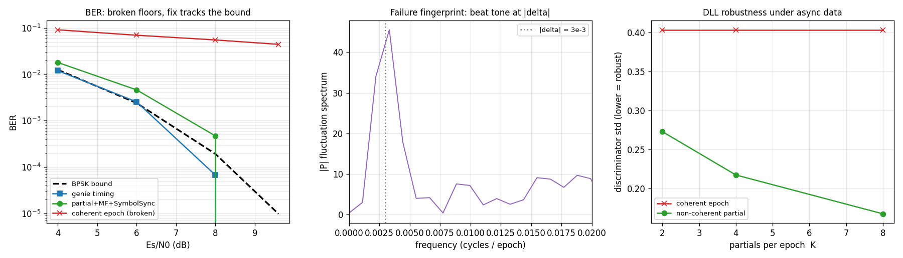

# Asynchronous symbol/code despreading

**Status:** draft / validated architecture
**Scope:** the receive-side despreader when the **data-symbol rate is on the
order of the code-epoch rate but asynchronous** to it. This is theory, the
failure mechanism, and a validated robust architecture that composes existing
`doppler.track` primitives. The reproducible study is
`src/doppler/examples/async_despreader_study.py`
(`python -m doppler.examples.async_despreader_study`).

______________________________________________________________________

## 1. The two-clock problem

A DSSS receiver despreads by integrating early/prompt/late correlations over one
**code epoch** (`TE = sf·sps` samples) — an integrate-and-dump locked to the
*code* clock. The data symbols are a separate stream; the despread prompt per
epoch carries the data.

That works when the symbol clock is locked to the code clock at an integer ratio
(GPS C/A: 20 code epochs per data bit, bit edges on epoch edges). It **breaks**
when the symbol clock is *independent*:

```
T_sym = TE · (1 + delta)        # symbol period, samples
                                # delta = symbol-vs-code rate offset
phi_sym                         # independent symbol phase
```

with `T_sym ≈ TE` (symbol ≈ one epoch). This is the hard regime: ~one symbol per
epoch, a transition roughly every epoch, and — crucially — `delta ≠ 0` makes the
symbol boundary **slide continuously** through the epoch at the beat rate
`delta / TE`.

______________________________________________________________________

## 2. Why per-epoch despreading fails

The coherent prompt over an epoch whose data flips at fraction `f ∈ [0,1]`:

```
P(f) = A·[ f·d1 + (1−f)·d2 ]  =  A·d1·(2f−1)        (d2 = −d1)
```

- `f → 0, 1` (flip at an epoch edge): `|P| = A` (full despread).
- `f → 0.5` (flip mid-epoch): **`|P| = 0`** — total coherent cancellation.

Because `delta ≠ 0`, `f` sweeps through every value, so ~half of all epochs
straddle a transition and their prompts collapse. The consequences:

1. **Data**: per-epoch decisions floor — the BER plateaus regardless of `Es/N0`
    (the straddle epochs carry no usable energy). Measured floor ≈ 1e-1 even when
    the bound is < 1e-5.
1. **Code**: the early/late discriminator `(|E|−|L|)/(|E|+|L|)` collapses to
    `0/0` on straddle epochs → the DLL is starved → the code loop wanders.

**Root cause:** at one prompt per epoch the symbol clock is **unobservable** (a
single sample per symbol cannot drive a timing loop), and the integration window
is forced to straddle transitions.

### Diagnostic fingerprint

The straddle modulation is periodic at the symbol↔epoch beat. The spectrum of
the prompt-magnitude stream `|P[n]|` shows a **tone at `|delta|` cycles/epoch**
(centre panel of the figure). This is the signature to look for when a DSSS link
shows unexplained despread fades — it identifies this failure class directly.

______________________________________________________________________

## 3. Robust architecture



The fix gives the symbol clock its own observability and its own matched filter,
and makes code tracking insensitive to data sign — composing primitives that
already exist.

### 3.1 Data path — partial correlations + symbol matched filter + SymbolSync

1. **Partial correlations.** Split each code epoch into `K` sub-epoch partial
    prompt correlations (each `TE/K` samples, known code phase). This yields `K`
    despread samples per epoch ≈ `K` samples per symbol — the symbol clock is now
    **observable**.
1. **Symbol matched filter.** A length-`K` **boxcar** over the partial stream.
    This is a *sliding, symbol-aligned* coherent re-integration of the partials —
    the full-symbol despread the epoch-locked window could not form. It is
    essential: without it, the rectangular symbol pulse is sampled at one point
    and only ~1/`K` of the symbol energy is captured (the BER floors at ~2e-2).
1. **SymbolSync.** [`track.SymbolSync`](../api/python-track.md) (Gardner TED +
    Farrow interpolator) recovers the independent symbol clock (`delta`, `phi`)
    from the matched-filtered stream and decimates at the symbol-aligned peak.

**Result (left panel):** the BER follows the BPSK matched-filter bound within
~1–2 dB. A **genie** reference (coherent symbol-aligned despread with *known*
timing) hits the bound exactly — the loss was only window misalignment, never
SNR. The broken per-epoch path floors.

| Es/N0  | bound  | genie (known timing) | partial+MF+SymbolSync | broken epoch |
| ------ | ------ | -------------------- | --------------------- | ------------ |
| 6 dB   | 2.4e-3 | 2.5e-3               | 4.5e-3                | ~7e-2        |
| 8 dB   | 1.9e-4 | 1.5e-4               | 5.8e-4                | ~6e-2        |
| 9.6 dB | 9.7e-6 | 0                    | 0                     | ~5e-2        |

### 3.2 Code path — non-coherent partial combining

The DLL keeps tracking through data flips by combining the partial correlations
**non-coherently**: `|E| = Σ_k |E_k|`, `|L| = Σ_k |L_k|`. A data flip changes a
partial's *sign*, not its *magnitude*, so only the one straddling segment
degrades (~`1/K`). This roughly **halves the discriminator variance** versus the
coherent-epoch form (right panel) — keeping the (already validated, smooth
sub-chip) code loop locked. It needs no symbol timing, so it works from cold
start; the bootstrap order stays sequential: DLL (non-coherent) → SymbolSync →
data.

### 3.3 Choosing K

`K` trades observability and straddle-robustness against the non-coherent
squaring/Rician bias (which erodes the discriminator gain as `K` grows). The
study shows **`K = 4` as the sweet spot** for `T_sym ≈ TE` (best discriminator
SNR; `K = 8` loses more gain than variance). `K` must divide `TE`.

______________________________________________________________________

## 4. The full async tracking channel (carrier + code + symbol)

Sections 1–3 cover the **code + symbol** path on a carrier-wiped input. A
complete receiver adds the **carrier** loop, and *where* the carrier is corrected
turns out to be decisive. Validated end to end (genie-carrier prototype) under
carrier offset + code Doppler + an asynchronous data clock + AWGN, the
architecture is:

```
Costas NCO ── de-rotate PER SAMPLE (before the code integration) ── carrier wipe
   → Dll(segments=K, low bn) → K partial prompts/epoch   (non-coherent code)
   → boxcar symbol matched filter → SymbolSync → symbols  (full SNR)
   → carrier discriminator on the SYMBOLS → steer the Costas NCO   (feedback)
```

**Predetection de-rotation, postdetection discrimination** (the standard GPS
carrier loop), and two rules that the prototype made concrete:

- **De-rotate per sample, before the code integrate-and-dump.** If the carrier
    rotates during the despread accumulation, the correlation sums rotating chips
    and rolls off (a sinc loss) — it filters out signal energy. De-rotating later
    (the despread *partials*, or the *symbols* after the symbol matched filter) is
    too late; the energy is already gone. Placing the carrier wipe on the partials
    or on the post-integration symbols both floored the BER.
- **Take the carrier error from the full-SNR symbol**, not the raw samples or the
    low-SNR partials — that minimises phase jitter. The loop steers the per-sample
    NCO from this symbol-rate discriminator.
- **The code loop is carrier-blind** (its `|E|−|L|` discriminator is
    non-coherent), so it locks regardless of the carrier — but it needs a **low
    loop bandwidth at low SNR** (e.g. `bn≈0.002` lost code lock at 6 dB Es/N0,
    `bn≈1e-5` held to 4 dB).

With the carrier removed per sample (genie) and a low-bandwidth code loop, the
chain lands **within ~1.6× of the BPSK matched-filter bound at 4–6 dB Es/N0**
(4 dB: 1.8e-2 vs 1.25e-2; 6 dB: 4.1e-3 vs 2.4e-3) — near optimal.

The carrier loop closes a feedback path (symbol-rate discriminator → per-sample
NCO), so unlike the §3 code+symbol cascade it cannot be a pipeline of block
calls — it must be a per-sample inline loop, i.e. a C object.

## 5. Build status & next steps

**Done — the inline symbol-loop primitive.** `symsync_step()` (the per-sample
SymbolSync composition API, mirroring `dll_accumulate`/`costas_wipeoff`) is added
so the channel can drive the carrier loop on recovered symbols inline;
`symsync_steps()` is now exactly it in a loop (byte-identical).

**In progress — the C inline async-channel object.** Mirror `channel` (which
already inlines `costas_wipeoff` + `dll_accumulate`), generalized to: per sample
wipe the carrier and accumulate the code; per segment dump a partial, run the
boxcar, and `symsync_step`; on a recovered symbol take the carrier discriminator
and steer the NCO. Composes `Costas`, `Dll(segments)`, `SymbolSync`, `Farrow`,
`loop_filter`. Two obstacles the standalone prototype surfaced, to resolve in the
build:

- **Carrier-loop latency.** The carrier discriminator comes from the symbol,
    which lags the samples by the boxcar + SymbolSync group delay. A seeded carrier
    holds, but closing the loop on the *delayed* symbol introduces a phase lag
    (≈ `fc · latency`); needs reduced latency and/or an FLL-tolerant design so the
    residual stays well inside the phase-detector's linear range.
- **Inline symbol count.** The inline boxcar→`symsync_step` path emitted a few
    more symbols than the reference Python cascade (which is exact and BER-clean) —
    a boxcar-alignment / edge-transient detail to reconcile so the symbol stream is
    1:1 with the data.

**Then:**

- **Close the ~1–2 dB symbol-MF gap.** Match the boxcar length to the *tracked*
    symbol period (not a fixed `K`); evaluate a triangular/RC symbol MF.
- **Investigate the high-SNR floor** (~2e-4 at 9.6 dB) — cycle slips or alignment.
- **Closed-loop code-jitter asset.** Drive the non-coherent partial code loop
    under async data + code Doppler; confirm lock retention and the low-SNR
    threshold.

The code+symbol path (§3) is shipped as `Dll(..., segments=K)` (`segments=1` =
the classic coherent DLL); the carrier loop (§4) is the remaining build.
