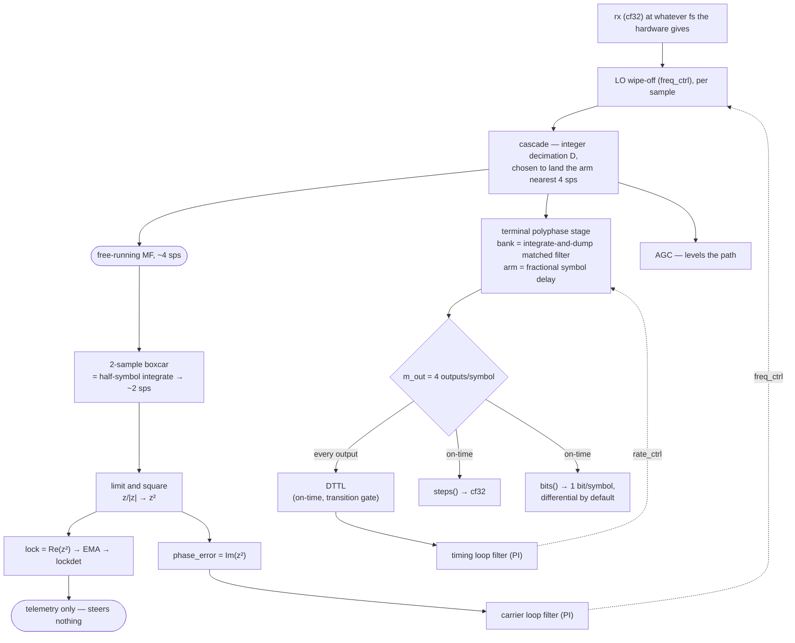

# BPSK Receiver — NRZ, non-data-aided, continuous

**Status:** design, not yet built. Nothing below is measured unless it says
so; where a number is quoted from another object's certification, it names
that object.

**Scope.** A streaming receiver for the **continuous** flavor of
[MPSK Receiver](mpsk.md) §0: NRZ BPSK, minutes to hours, with periods of
data modulation off and the carrier on. One modulation, one detector, one
mode. It does not serve the burst flavor and does not claim to — that
flavor is RRC-shaped and seconds-or-less, and the shipped `MpskReceiver`
and the DSSS chain already carry it.

**Why a second receiver rather than a mode on the first.** §2.1 of the MPSK
design argues that a receiver with two modes has a state it can be wrong
about. This object takes that seriously by having no second mode to be
wrong about: no handover, no warmup, no lock gate, no timing gate, and no
search. The lock statistic steers nothing.

______________________________________________________________________

## 1. The signal path



**The two loops are decoupled, and that is the design.** The carrier arm is
non-data-aided and timing-independent by construction — squaring strips the
modulation, so the arm never needs to know where a symbol starts. It
therefore runs **free**, on a clock the cascade fixes at construction, and
the timing loop owns the exact rate through the polyphase arm. Neither loop
waits on the other, and a timing loss cannot take the carrier with it.

### 1.1 Why the arm is a half-symbol boxcar and not the matched filter

The matched filter's output is the better sample — it has the full
integration gain — but taking the carrier error from it costs one of two
things, and both are worse than 3 dB.

| tap                                         | ISI     | SNR   | pull-in `F/(2M)` | coupling  |
| ------------------------------------------- | ------- | ----- | ---------------- | --------- |
| **free-running half-symbol boxcar, ~2 sps** | bounded | −3 dB | `Rs/2`           | **none**  |
| free-running MF, every output, ~4 sps       | worst   | full  | `Rs`             | none      |
| timed MF, on-time strobe                    | none    | full  | `Rs/2`           | **total** |

The middle row is the trap, and limiting is what makes it one. A
between-symbol MF output averages two symbols, so on a transition it is
near zero — and the discriminator normalises to `z/|z|` *before* squaring,
which amplifies that near-null to unit magnitude with essentially random
phase and injects it at full weight. The corruption is not attenuated by
its own smallness; it is rescaled back up.

The half-symbol boxcar is the classical answer, and Yuen's coherent gain is
its bookkeeping: one arm output per symbol is always clean, the other
straddles a boundary and is corrupted with probability ½, giving
`Re E[z_d²] = 1/2 + 1/(M+1) = 5/6` at M = 2.

The bottom row is the shipped receiver's `strobe` tap. Its cost is not
elegance: it makes the carrier loop's health conditional on the timing
loop's, which is the coupling this object exists to avoid.

### 1.2 What the extra rate would buy, and why we decline it

An M-th-power detector updating at rate `F` observes only `|Δf| < F/(2M)`.
At the boxcar's ~2 sps that is `Rs/2`; taking the arm at ~4 sps instead
would double it to `Rs`. So the MF output being above Nyquist buys
**pull-in range**, not fidelity.

We decline it because the loop-capture bound `≈ k·Bn/M` binds long before
the aliasing ceiling — at `Bn = 0.01·Rs` by a factor of tens (MPSK §3.4) —
so the ceiling is nearly never what a caller hits. When wider capture is
wanted, the answer is a **seeded acquisition object composed in front**,
handing its estimate to `center_freq_hz`, not a wider arm.

______________________________________________________________________

## 2. Timing — DTTL, not Gardner

The timing detector is **DTTL**. Every measured axis in RateSync's
certification favours it for this waveform:

| claim                                                 | evidence                                                                  |
| ----------------------------------------------------- | ------------------------------------------------------------------------- |
| DTTL is supported for BPSK/QPSK                       | RateSync C26                                                              |
| **6.4× lower self-noise near lock** than Gardner      | RateSync C26a / F16                                                       |
| Gardner's raw error carries `A²`, DTTL's carries `A¹` | RateSync C26c — a level error is 4× less punishing on DTTL                |
| open-loop slope accuracy through a real cascade       | MPSK §6.1 — Gardner within 1.3–8.6% across roll-off, **DTTL within 0.2%** |
| rectangle S-curve slope                               | MPSK §6.1 — analytic **2.0000** for DTTL                                  |

Gardner is the shipped receiver's hardcoded detector and is the weaker
choice on NRZ specifically. Taking DTTL here is the change
[#645](https://github.com/doppler-dsp/doppler/issues/645) already recorded
as measured and not yet taken.

**The one open axis is DTTL's low-SNR behaviour**, which RateSync records as
`C26b` / `F17`: *"DTTL degrades faster than Gardner at low SNR"* is
**unmeasured**, because nothing in that report adds noise. For a receiver
specified down to an Es/N0 floor that is a prerequisite, not housekeeping —
tracked as [#751](https://github.com/doppler-dsp/doppler/issues/751).

______________________________________________________________________

## 3. Construction — the caller states the link, not the loops

```text
bpsk_receiver_create (sample_rate_hz, symbol_rate_hz,
                      center_freq_hz,          /* 0     */
                      esn0_floor_db,           /* 4.0   */
                      pd, pfa)                 /* 0.99, 1e-5 */
```

Two required arguments. The Python face is the same signature,
keyword-capable:

```text
BpskReceiver(sample_rate_hz=10e6, symbol_rate_hz=1e6)
```

**External rates are not ours to dictate.** The caller's `fs` is whatever
their hardware gives; `create()` plans an integer decimation `D` landing the
arm as near 4 sps as it can and reports what it actually planned. Nothing is
rejected for having an awkward rate ratio.

Derived inside `create()`, each readable back:

| derived                              | rule                                                                                              |
| ------------------------------------ | ------------------------------------------------------------------------------------------------- |
| `arm_sps`, `D`                       | the planned arm rate and the decimation that reached it                                           |
| `m_out`                              | 4 — the DTTL transition gate needs the half-symbol output                                         |
| `num_phases`                         | 64 — MPSK §8's measured saturation point                                                          |
| `bn_carrier_hz`, `bn_timing_hz`      | from `esn0_floor_db` via the loop-SNR rule                                                        |
| `zeta`                               | `1/√2`                                                                                            |
| `bn_agc_ratio`                       | off the slower loop                                                                               |
| `lock_thresh`, `α`, `n_up`, `n_down` | together, from `(esn0_floor_db, pd, pfa)` via `det_q_inv`, `det_verify_count`, `det_verify_delay` |
| `pull_in_hz`                         | the contract the caller must satisfy                                                              |
| `declare_latency_syms`               | how long the lamp takes — MPSK §4.1 notes this is currently published nowhere                     |

`create()` fails loudly when the detector spec is unreachable rather than
silently missing `Pd`.

### 3.1 Deliberately absent

`m` (it is 2), `pulse` / `rrc_beta` / `rrc_span` (NRZ is the matched filter),
`ted` (DTTL), `nda_tap` (one tap), `m_out` (derived), `acq_to_track` and
`warmup_syms` (no second mode to gate), `agc` (load-bearing, not optional),
`sps` (derived), `tracking` (nothing to report without a handover).
`differential` moves to `bits()` and defaults **on** — BPSK's 180°
ambiguity is unresolved by an NDA loop, so the coherent path is correct only
behind a downstream sync word.

______________________________________________________________________

## 4. What has to be measured before this can be certified

Written down first so the sweeps are not designed to confirm a decision
already made.

- **The squaring-loss floor.** Yuen Eq. 8-19 gives the aligned half-symbol
    window analytically — `K2 = 5/6`, `K4 = 23/30`, `S_L = K2²/(K4 + KL·z/rd)`,
    high-SNR floor `K2²/K4 = 0.906 = −0.43 dB`. That is an external truth to
    measure against rather than a number to characterise.
- **The sliding-window penalty.** A free-running arm at *approximately* half
    a symbol slides against true symbol boundaries at the residual rate, so
    the straddling fraction — and with it the squaring loss — breathes
    cyclically. Invisible on a burst; on a minutes-to-hours link it is a slow
    modulation of loop SNR whose period is set by how far `arm_sps` sits from
    4\. The loss-versus-window-offset curve decides whether the boxcar length
    should be derived per plan (`round(arm_sps/2)`) or the arm rate bounded at
    plan time.
- **Carrier-on / data-off.** The carrier side is fine by construction —
    `carrier_nda_core.h` states the M-th-power discriminator acquires a bare
    unmodulated carrier. The **timing** side is unstated everywhere: DTTL
    needs transitions. Measure the drift while coasting, whether the lock
    indicator stays honest, the re-acquisition time when modulation resumes,
    and whether the timing loop should freeze rather than integrate noise.
- **Long-run stability.** §0's "minutes to hours" is the maximum-drift number
    MPSK §8 says the caller has never stated — the one that sets the *lower*
    bound on loop bandwidth. Cycle-slip rate and frequency error over long
    runs.
- **DTTL at low SNR** — [#751](https://github.com/doppler-dsp/doppler/issues/751),
    above.

______________________________________________________________________

## 5. The record

- **Loop coupling** — *resolved.* Decoupled, via a free-running arm. The
    carrier loop never reads a timed sample.
- **Pull-in beyond `Rs/2`** — *deferred, by design.* A seeded acquisition
    object composed in front, feeding `center_freq_hz`. Not this object's job
    and not yet built.
- **The real-IF twin** — *open.* `MpskReceiverR` exists at `fs/4`; whether
    this object needs the same twin, and when, is undecided.
- **DTTL's low-SNR degradation** — *open*,
    [#751](https://github.com/doppler-dsp/doppler/issues/751).
