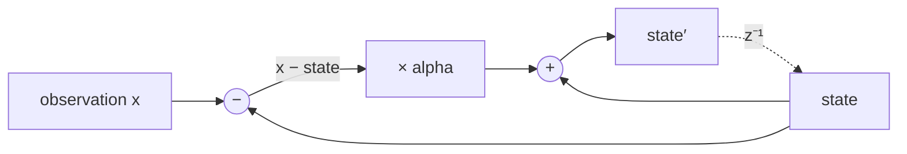

# The Exponential Moving Average

Almost every estimator in doppler is, at its centre, one line: a running
average that forgets. A power detector, a lock statistic, a spectrum
accumulator and a noise-level estimate are all the same recursion with
different inputs — and for most of this library's life they were four
separate copies of it, in two different algebraic forms, with no shared
statement of what the recursion guarantees.

This page is the **why**: what the average is for, which of its
conventions are load-bearing, what it does at its boundaries, and — the
part that took measurement rather than reading — which of the two ways of
writing it is the right one, and why that is not a matter of taste.

The contract lives in `native/inc/util/util_core.h` (`ema_step`,
`ema_alpha_decim`) and the C-level evidence in
`native/tests/test_util_core.c`. This page does not restate either; it
explains the reasoning they assume.

Related: [Automatic Gain Control](agc.md), [The NCO](nco.md).

**Status.** Sections 1–6 describe the shipped primitive, and every
mechanism in them is pinned by a sabotage-proven C test. Section 7 is a
**diagnosis, not a change**: it explains a measured defect in `agc`'s
decimated loop that this primitive is the fix for, and that adoption has
not happened. Section 8 records that the four historical call sites are
**not yet migrated** — the primitive exists, and nothing uses it.

______________________________________________________________________

## 1. What it is for

One question, asked once per observation: **what is this quantity's
recent average, given that the recent past matters more than the distant
past?**

A block average answers a different question and needs a block. An EMA
answers continuously, in constant memory, with one multiply and one add —
which is why it is the estimator that ends up inside every loop:

- **A level detector** feeding a gain loop needs the average power *now*,
    with a memory short enough to track a real level change and long
    enough not to modulate the gain with the signal's own noise.
- **A lock statistic** needs the same thing over a phase-error product,
    and its memory is what converts an instantaneous, noisy indication
    into a decision variable.
- **A spectrum accumulator** in exponential mode is the identical
    recursion applied per bin.
- **A detection threshold** is sized against the EMA's noise reduction,
    which is a closed-form function of the coefficient
    (`det_ema_alpha` in `detection_core.h` inverts exactly that law).

Four consumers, one recursion. The reason it is now one *function* is
that four hand-written copies cannot be reasoned about together: a
property established for one of them says nothing about the others, and
a defect fixed in one silently leaves the rest wrong. That is the same
failure the NCO's phase-word conversion had — three private copies, one
of them fixed and two not — and it is written up in
[The NCO](nco.md).

______________________________________________________________________

## 2. Theory of operation

The recursion, with `alpha` the coefficient in `[0, 1]`:

```text
state  <-  state + alpha * (x - state)
```

Equivalently `state <- (1 - alpha) * state + alpha * x`, which is the
same thing on paper and **not** the same thing in floating point; §3 is
about that difference.



Three properties follow directly, and they are what a consumer actually
relies on:

**It is a one-pole low-pass filter.** The pole sits at `1 - alpha`, so an
impulse decays geometrically and the memory is `1/alpha` observations to
the `1/e` point (`-1/ln(1-alpha)` exactly). Everything a caller wants to
know about "how long does it remember" is that number.

**Its noise reduction is closed-form.** For a white input of variance
`σ²`, the converged output variance is `σ² · alpha/(2 - alpha)`, so the
estimator's SNR improves by `(2 - alpha)/alpha`. This is the law
`det_ema_alpha` inverts to size a coefficient for a requested estimator
SNR — which means the law is already load-bearing in this library, and
until now nothing checked the EMA delivered it.

**It converges to its input, and never past it.** For a constant input
the state approaches it monotonically from whichever side it started, and
the fixed point is exact: an average handed its own current value must
not move. That last property sounds trivial and is the one a careless
implementation loses, because a converged estimator that drifts is a slow
bias in every consumer and is invisible to any test that only watches the
transient.

______________________________________________________________________

## 3. Which form, and why it was measured rather than chosen

The two algebraic forms are:

|                 | expression                        |
| --------------- | --------------------------------- |
| **incremental** | `state + alpha * (x - state)`     |
| **two-product** | `alpha * x + (1 - alpha) * state` |

doppler had both. `agc` and `async_dsss_receiver` wrote the first;
`acc_trace` wrote the second. Neither file said why.

They differ in rounding, and the difference has a direction. Measured
against a 60-digit reference over 5000 steps of random input:

| `alpha` | incremental | two-product |
| ------- | ----------- | ----------- |
| 0.05    | 9.0e-17     | 6.5e-16     |
| 1e-3    | 3.1e-16     | 1.6e-15     |
| 1e-5    | 2.7e-17     | 5.4e-15     |

The incremental form wins everywhere, by a margin that **grows as the
average lengthens** — and lengthening is the direction every narrow-band
estimator moves. The reason is structural: the incremental form adds a
small correction to a large state, so the large quantity is never
re-rounded, while the two-product form multiplies the large state by
`(1 - alpha)` and rounds it on every single step.

The two-product form wins exactly one case, and it is a boundary rather
than a regime — see §4.

### What measurement retired

Two expectations went in and did not survive, and they are recorded
because the reasoning that produced them is tempting:

- **"The two-product form drifts off its fixed point."** It does not.
    Handed `x == state`, both forms return the state exactly, over every
    coefficient and magnitude tried. The two roundings cancel rather than
    accumulate.
- **"The two-product form is inexact at `alpha = 0`."** It is not:
    `0*x + 1*state` is exact.

So the boundary sections of the C test pin a floor that *both* forms
meet. They are not the argument for this one; §3's accuracy table and
§4's pass-through case are.

______________________________________________________________________

## 4. The boundaries are part of the contract

An EMA is asked for degenerate coefficients in ordinary use, so the ends
of the range are not edge cases to be tolerated — they are answers a
caller depends on.

**`alpha = 1` means "do not average", and must return the observation
bit-exactly.** This is a real request: `det_ema_alpha(0, 0)` returns
exactly `1.0` for "no gain asked for, so no averaging". The incremental
form does *not* deliver it — `state + 1*(x - state)` rounds twice, and
was measured inexact for about **9.5%** of random `(state, x)` pairs
(18984 of 200000). An estimator told not to average that returns
something a few ulps from its input is a quiet, permanent bias.

So `ema_step` takes the branch explicitly. It is loop-invariant and
folds away entirely when `alpha` is a compile-time constant, so the
common path pays nothing for it.

**`alpha = 0` freezes the state**, exactly, and both forms deliver that.

**`alpha > 1` saturates to pass-through.** A coefficient above 1 is a
caller error, but the answer must stay bounded: the bare recursion would
fly *past* the observation and oscillate outward, turning a bad parameter
into a diverging estimator. Saturating makes the worst case "no
averaging", which is wrong but stable.

______________________________________________________________________

## 5. It is deliberately not total in its observation

`ema_step` has no guard on `x`. Hand it a NaN or an infinity and the
state is poisoned permanently.

That is a decision, not an oversight, and it is the same one
[Automatic Gain Control](agc.md) §4 argues at length: **an EMA
remembers, so its input is the boundary where an untrusted value first
becomes persistent state.** One guard there makes the whole downstream
chain total; a clamp at each stage is several chances to miss one. The
guard is [`saturate`](agc.md), the sibling primitive in the same header,
and the caller places it because only the caller knows which end is safe
— a level wants the ceiling, a lock statistic the floor.

The AGC's own history is the argument: one non-finite sample, and later
~800 samples of silence, each destroyed its loop permanently, and both
were closed by a single `saturate` at the detector's input rather than
by making the recursion defensive.

______________________________________________________________________

## 6. Decimation: compounding the pole, exactly

A loop that updates its average once per chunk of `d` samples must not
thereby change its own time constant. The coefficient that advances `d`
samples in one step is

```text
alpha_d  =  1 - (1 - alpha)^d
```

and `ema_alpha_decim` computes it. Getting this right is what makes a
decimation factor a **performance knob rather than a retune**, and the
property that makes the claim checkable is the degenerate one:

**At `d = 1` the answer must be `alpha` itself, bit for bit.** Only then
can a decimated path and a per-sample path be compared at all, because
only then is `decim = 1` genuinely the undecimated recursion.

The direct expression fails that, and fails it worst where it matters.
`1 - (1 - alpha)` is catastrophic cancellation, and the error grows as
the average lengthens:

| `alpha` | `1 - (1 - alpha)` at `d = 1` |
| ------- | ---------------------------- |
| 0.05    | 6 ulps off                   |
| 6.25e-5 | 2556 ulps off                |
| 1e-5    | 26865 ulps off               |
| 1e-7    | 3977032 ulps off             |

`ema_alpha_decim` goes through `-expm1(d * log1p(-alpha))`, which is
exact at `d = 1` at every coefficient tried, and answers `alpha = 0` and
`alpha = 1` directly rather than through `log1p(-1) = -inf`.

`agc_steps` forms its detector pole by repeated multiplication —
`ac *= a1` `d` times, then `1 - ac` — and therefore carries exactly this
defect today. See §8.

______________________________________________________________________

## 7. An EMA is not a loop filter, and conflating them costs a transient

This section exists because the distinction is invisible in code that
sits three lines apart, and getting it wrong produced a measured,
long-standing anomaly in the AGC.

`agc_steps` computes **two** decimated coefficients per chunk:

<!-- docs-snippet: skip=a two-line excerpt quoted from agc_steps' chunk loop, not a standalone program — ac, d and state are its locals -->

```c
double alpha_d = 1.0 - ac;                         /* detector pole   */
double k_d     = (double)d * 4.0 * state->loop_bw; /* loop-filter gain */
```

The first compounds the pole — the shape §6 describes, near enough. The
second scales an **integrator** gain linearly by `d`, which is a
different operation with a different error.

For the closed loop, the error decays per sample by `(1 - k₁)` with
`k₁ = 4·loop_bw`. Over `d` samples that is `(1 - k₁)^d`; the chunked
update applies `(1 - d·k₁)` instead. Those differ by the second-order
term, and `(1 - d·k₁)` is always the smaller — so **a larger decimation
always converges faster**:

| `d` | per-sample `(1-k₁)^d` | chunked `(1-d·k₁)` | gap      | `C(d,2)·k₁²` |
| --- | --------------------- | ------------------ | -------- | ------------ |
| 8   | 0.922745              | 0.920000           | 0.002745 | 0.0028       |
| 16  | 0.851458              | 0.840000           | 0.011458 | 0.0120       |
| 32  | 0.724980              | 0.680000           | 0.044980 | 0.0496       |

(at `loop_bw = 0.0025`, so `k₁ = 0.01`.) The divergence is therefore
**second order in `d·k₁`**, matching `d(d-1)/2 · (4·loop_bw)²` to three
significant figures.

This is the mechanism behind `test_agc_core.c` §23's measured spread of
**2.53 dB** between `decim` 8 and 32 at a common sample index. Two
consequences worth stating plainly:

- **It is not the detector.** The chunk's power is a flat mean of every
    sample (nothing is subsampled) and its pole is compounded, so the
    detector contributes essentially nothing: with the loop's Euler term
    made negligible and the input driven violently within each chunk
    (alternating 1:100 every sample; 90% silence with 10% bursts), the
    spread across `decim` 8/16/32 measured **0.000022–0.000188 dB**,
    five orders of magnitude below the effect.
- **The header's `loop_bw << 1/(4·decim)` precondition is not only a
    stability condition** — it is precisely `d·k₁ << 1`, the condition
    that makes this second-order term vanish. At `decim = 32` with
    `loop_bw = 0.0025` the ratio is 3×, not "well below", which is where
    the 2.53 dB comes from.

The fix is to compound the loop gain the way the detector's pole is
compounded, `k_d = 1 - (1 - k₁)^d` computed through the same
cancellation-free path. **This has not been done.** It changes a
transient, so it needs its own measurement and its own gate, and the
`d = 1` bit-exactness it depends on is the property §6 was built to
provide.

______________________________________________________________________

## 8. What has not happened yet

The primitive ships. **Nothing uses it.**

| site                                        | form                                 | status       |
| ------------------------------------------- | ------------------------------------ | ------------ |
| `agc_core.c` power detector                 | incremental                          | not migrated |
| `async_dsss_receiver_core.c` `lock_num/den` | incremental                          | not migrated |
| `acc_trace_core.c` `ACC_TRACE_EXP`          | two-product                          | not migrated |
| `detection_core.h` `det_ema_alpha`          | sizes the recursion, does not run it | n/a          |

Two of those change behaviour on migration and one does not:

- `acc_trace` moves from the two-product form to the incremental one, so
    its numbers change in the last ulps. That is an improvement by §3's
    table, and it is still a change that needs a measurement.
- `agc` gains an exactly-compounded detector pole (§6), which changes
    `decim = 1` from "6 ulps off" to exact.
- `async_dsss_receiver` is already the incremental form at `d = 1`, so
    adopting the primitive there is a pure substitution.

Until each is migrated, this page describes a primitive and the library
still runs four copies. The migration is deliberately separate work: the
point of establishing the properties first is that each call site can
then be moved against a known contract instead of against an assumption.
