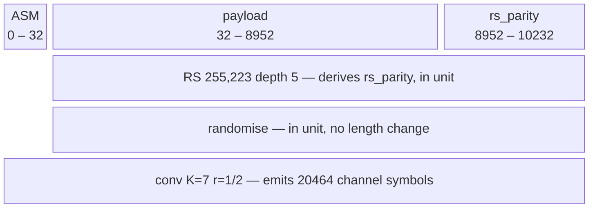

# A Frame as a Description

A frame is a list of **fields** that appear on the wire and a list of
**stages** that transform them, each stage carrying the span it covers. This
page is where that model is held once, generally, so a standard's framing is a
configuration a caller writes rather than a framer somebody adds.

**CCSDS is the example on this page, not the implementation underneath it.**
It is here because its facts are published and because it is the one
configuration that exercises `cover` asymmetrically. Every claim below is
about the general model; where CCSDS still shapes the generic path, that is
recorded as a defect with a gate on it, not as the design.

______________________________________________________________________

## Why — a general primitive plus a configuration

Every other standard-specific thing in doppler decomposed the same way.
`conv_core.h` owns convolutional codes as a description and `CCSDS_TM_CONV` is
four numbers that configure it. `rs_core.h` owns any Reed-Solomon code over
any field and `CCSDS_TM_RS` is five, and it states the principle outright —
*"a standard picking a code is not the same fact as the code existing"*.

Framing was the layer where that had not happened. What existed instead was a
**closed struct** of four named fields
(`[preamble × reps | sync | payload | crc16]`) whose constructor had grown to
**38 positional arguments**, because a fixed field list forces every field's
every parameter into the signature; and a **second, disjoint** assembler for
CCSDS that shared nothing with it and could not express it. Neither could
express the other, and a user wanting a frame doppler had not anticipated had
no move except to add a third framer.

## Use cases — who calls this, and what they do with the answer

- **`wfmgen`, generating a test waveform.** Framing is an axis there rather
    than a waveform type: `--acq-code`/`--sync` describe a frame, layered on
    `--type bits` and the user's own `--bits`. Coding is the next stage on
    that same axis — randomise this, Reed-Solomon it at depth 5, prepend this
    marker, convolutionally code the lot, over bits the caller supplied.
- **The scoring path, measuring a capture.** The description is read from
    both ends, which is what makes a **truth-free** frame error rate possible.
    A frame with an outer code has a strictly better error detector than
    CRC-16: the check reports how much repair it took, so a margin being spent
    is visible long before it is lost.
- **A Python caller analysing a capture.** `frame_core.h` exists because only
    C could hold a description and `ber`'s frame meter had no way to be fed
    from the language captures are analysed in. A user-defined field list is
    what lets that object describe a frame doppler has never seen — including
    a CCSDS CADU, without `ccsds_tm` growing a binding it should not have.
- **A mission that is not CCSDS.** The point of the generalization.

______________________________________________________________________

## The model

Two lists, ordered independently, because order and coverage are different
questions:

```text
field[]   ordered by POSITION on the wire
stage[]   ordered by APPLICATION
```

A **field** is a run of bits that appears on the wire. It is either
caller-supplied — a literal array, or a generated sequence — or **derived**,
meaning a stage produces it. `derived_by` names the producing stage **plus
one**, so a zero-initialised field is caller-supplied rather than silently the
output of stage 0.

A **stage** is a transform *plus the span it covers*, declared as a contiguous
field range rather than inherited as "everything so far".

### `cover` is the load-bearing field, and the header says why

The single most important constraint on this design is written down in
`ccsds_tm_frame.h` as a prediction of how it fails:

> An order is the representation that cannot express this: any chain of
> optional transforms applied to "the frame" is right at three stage
> boundaries and wrong at the fourth, and wrong in the direction that still
> encodes, still decodes against itself, and syncs to nothing.

A generic frame with user-defined fields and a list of optional transforms is
**precisely that chain** — unless every stage carries an explicit `cover`.
Without it the basic case is the bug.

Two consequences worth stating separately:

- **Order and coverage are independent axes.** In CCSDS the ASM is *inserted
    third* and is covered by the stage applied *fourth*. A single ordered list
    cannot say that. The field list gives position; each stage's `cover` gives
    reach; neither is derivable from the other.
- **A stage may change length, and there are exactly two ways it can.** A
    Reed-Solomon code adds check symbols and a CRC adds 16 bits — both appear
    on the wire *inside the same unit*, so both are derived fields and the
    layout is a running sum. A convolutional code is different in kind: it
    consumes the assembled frame and emits a **different stream**, which is
    why the layout reports `frame_bits` and `out_bits` as two numbers.

One CADU, drawn. The top row is the field list, ordered by position; each row
beneath it is one stage's `cover`, ordered by application. Block widths are
schematic — a 32-bit marker cannot be drawn to scale beside an 8920-bit
payload — so the exact spans are in the labels.



Read the three cover rows, because they are the design in one picture. `RS`
and `RANDOMISE` begin at bit 32 — **after** the marker. `CONV` begins at bit 0
and takes the marker in. That asymmetry is the entire reason a stage carries
an explicit `cover`: a chain would be right for two of these three and wrong
for the third, in the direction that still encodes, still decodes against
itself, and syncs to nothing.

The `rs_parity` block is on the wire and is therefore a **field**, not a
length rule hidden inside the stage that produces it — which is what lets the
layout be a plain running sum over the top row.

### The packed/unpacked boundary belongs to the assembler

Reed-Solomon wants **packed octets**, because an R-S symbol *is* a byte;
a randomiser and a convolutional coder want **unpacked bits**, because they
are bit machines. Both are right, so the conversion belongs in exactly one
place rather than hidden inside a kernel that then works for one caller. The
general assembler owns it, per stage, and a stage declares which
representation it consumes.

______________________________________________________________________

## The four enumerations — three closed, one open

`native/inc/wfm/wfm_frame.h` is the SSOT for every name here; this page owns
the reasoning, not the declarations. The fourth enumeration being open is what
decides whether the generalization is real: a set only doppler can extend is a
third framer with extra steps.

### 1. Fields — where a run of bits comes from

A field's kind answers one question only: who produces the bits.

| kind      | bits come from              | parameters                                         |
| --------- | --------------------------- | -------------------------------------------------- |
| `LITERAL` | a 0/1 array the caller owns | the array                                          |
| `PN`      | `pn_create()` — one LFSR    | `poly`, `seed`, `reg_bits`, `lfsr`                 |
| `GOLD`    | `gold_create()` — two LFSRs | `taps_a`, `seed_a`, `taps_b`, `seed_b`, `reg_bits` |
| `DOTTED`  | alternating `1010…`         | none — a line at Rs/2 to settle on                 |

Two properties sit **across** the kinds rather than inside them, which is what
keeps the table four rows long instead of eight: **`reps`** repeats the run
verbatim, so a preamble is not a fifth kind but any of the four repeated; and
**`derived_by`** names the stage that produces the field instead of the
caller, which is what makes a CRC trailer and a block of check symbols the
same concept.

For the generated kinds, `len` is the **output** length and `reg_bits` the
register width. They are named apart because conflating them is easy and
costly: a PN sequence's period is `2^reg_bits - 1` and has nothing to do with
how many bits the field wants.

**This enumeration is closed, and unlike stages it has no extension point** —
the generator is a `switch` in `wfm_frame.c`, so a new sequence kind is a pull
request against the header. That asymmetry with stages is deliberate but it is
worth naming: sequences are a small, bounded set of ways to make bits;
transforms are not.

### 2. Stages — what transforms the fields it covers

| stage        | does                             | length effect                           | derives     | kernel from |
| ------------ | -------------------------------- | --------------------------------------- | ----------- | ----------- |
| `CRC16`      | `dp_crc16_ccitt` over the head   | +16 bits, in unit                       | its trailer | built in    |
| `INTERLEAVE` | permute `depth` × `unit_bits`    | none                                    | nothing     | built in    |
| `RS`         | a Reed-Solomon code, interleaved | + check symbols, in unit                | its parity  | a table     |
| `RANDOMISE`  | XOR a pseudo-random sequence     | none                                    | nothing     | a table     |
| `CONV`       | a convolutional code             | `× emit_num / emit_den`, **new stream** | nothing     | a table     |

The `length effect` column splits the table three ways rather than two.
`CRC16` and `RS` add bits that appear on the wire **inside the same frame**,
so what they add is a derived field and the layout simply sums. `INTERLEAVE`
and `RANDOMISE` change no length at all. `CONV` alone consumes the assembled
frame and emits a *different* stream.

**Only two stages are built in, and the rule for which is a layering fact, not
a judgement of importance.** A CRC and a block interleaver need no
configuration a standard has to supply. An outer code, a randomiser and an
inner code are each configured by the component that owns them, and
`ccsds_tm` must depend on `wfm_frame.h` to describe a CADU — so if
`wfm_frame.c` called `ccsds_tm`'s kernels the two would form a cycle. The
kernels travel in the other direction instead, as a table.

**The three names `RS`, `RANDOMISE` and `CONV` are CCSDS's three stages**, and
that is the one place the general enumeration is shaped by the standard. They
carry no kernel here — only a reserved number and a generic description.

### 3. What a stage kind must implement

Three slots, and the arithmetic for a kind lives in exactly one place:

1. **`in_unit`** — rewrite `n` bits in place, where the span lies. Serves a
    CRC, an outer code and a randomiser alike, because of the invariant below:
    the op receives the whole cover, reads the information at its head and
    writes whatever it derives into its tail.
1. **`emit`** — consume the assembled frame and write a different stream.
    Exactly one of `in_unit` and `emit` is set. `out` may overlap `in`: the
    frame is assembled in the tail of the caller's buffer and the stream
    written from its head, so an implementation must read each input bit
    before writing the output that displaces it.
1. **`undo`** — the receive side. **Optional, and its absence is
    information.** An inner code has none by design: it is streaming, emits
    decisions late, and is undone before frame synchronisation, so a frame
    checker never sees channel symbols. Such a stage is reported **not
    checked** rather than passed — different answers, and a receiver that
    conflated them would call an unverified frame good.

One report shape for every checking stage, rather than a struct per code, is
what lets a caller compare them: `units` / `ok` / `corrected` / `symbols`.
`ok == units` with a rising `symbols` is margin being spent.

### 4. The open end — how the set grows, and how far

A stage's kind is an **open `uint32_t`, not the enumeration above**. Kernels
come from `wfm_frame_ops_t`, a table looked up by kind that **extends** the
built-ins rather than replacing them — the caller's table is searched first,
so a component supplying an outer code does not have to restate the CRC.
`WFM_STAGE_USER` is the first value reserved for callers, and doppler never
allocates at or above it.

That is what makes the answer to *"a mission that is not CCSDS"* a
configuration rather than a pull request against a header. Turbo, LDPC and a
channel interleaver are shaped like rows in that table rather than like a
third framer, which is the test this enumeration has to pass.

**The seam is C-level, and that limit is real.** A Python caller can *declare*
a `WFM_STAGE_USER` kind and cannot supply its kernel, so `build()` refuses:
kernels stay in C by decision
([#1125](https://github.com/doppler-dsp/doppler/issues/1125),
[#1140](https://github.com/doppler-dsp/doppler/issues/1140)). From Python the
reachable set is therefore the built-ins plus whatever table the C entry point
wires in — which today is CCSDS's three. The certification report records this
as a gap rather than a feature; see
[`validation/wfm_frame/results.md`](https://github.com/doppler-dsp/doppler/blob/main/src/doppler/wfm/tests/validation/wfm_frame/results.md)
finding F2. A page that claimed the Python face was open would be describing
the C header, not the object.

______________________________________________________________________

## The invariants, which are refusals

Each is enforced where the description is read, not documented and hoped for.
All exist because the failure mode of this design is a frame that still
assembles, still decodes against itself, and syncs to nothing.

| invariant                                                                                                                                                | why                                                                                                                       | enforced in                           |
| -------------------------------------------------------------------------------------------------------------------------------------------------------- | ------------------------------------------------------------------------------------------------------------------------- | ------------------------------------- |
| **A stage's cover is what it OCCUPIES on the wire** — information and derived check symbols together; what it *reads* is the cover minus what it derives | both from one declaration, so the two cannot disagree                                                                     | `wfm_frame.h` (the struct's contract) |
| **A derived field must be the LAST field of its producing stage's cover**                                                                                | lets one `in_unit` signature serve every in-place stage; the alternative is parity in the middle of the data              | `wfm_frame.c:156`                     |
| **At most one emitting stage, and it must cover the whole frame**                                                                                        | two streams is not a frame; a partial emit has no defined wire order                                                      | `wfm_frame.c:206-215`                 |
| **A stage whose kind is in neither table is a refusal, never a skip**                                                                                    | a stage that quietly did not run is the exact failure this design prevents; it is pre-flighted before any byte is written | `wfm_frame.c:451-458`                 |
| **A stage covering no caller-supplied bits derives nothing**                                                                                             | a CRC over an empty payload protects nothing and is not emitted                                                           | `wfm_frame.c:162`                     |

## The limits, as numbers

| limit                  | value | what it bounds                 |
| ---------------------- | ----- | ------------------------------ |
| `WFM_FRAME_MAX_FIELDS` | 16    | fields per description         |
| `WFM_FRAME_MAX_STAGES` | 8     | stages per description         |
| `WFM_FRAME_CRC_BITS`   | 16    | the only CRC width             |
| `WFM_FRAME_NAME_MAX`   | 16    | field-name bytes, NUL included |

The field and stage bounds were raised against a measurement rather than a
feeling: the deepest description doppler builds is six fields and five stages,
and the descriptor is a POD carried by value, so the cost is bytes on a stack
frame. Two further limits are structural rather than numeric: a cover is
**contiguous**, and a stage derives **at most one** field.

______________________________________________________________________

## Two configurations, and they are the design's falsification targets

A generalization that cannot express what already ships is not a
generalization. Both fall out as **data**, with no special case in the
assembler.

### 1. doppler's existing frame

```text
fields:  [ preamble × reps | sync | payload | crc derived_by=crc16 ]
stages:  [ crc16  cover={payload} ]
```

It also fixes a thing the closed struct stated in prose and could not express
— the CRC covers *the payload alone*, and the preamble sits outside the group
— because `cover` says so instead of a comment saying so.

### 2. one CCSDS CADU

```text
fields:  [ ASM | payload | rs_parity derived_by=outer ]
stages:  [ rs(255,223,E=16) depth=I  cover={payload, rs_parity}
           randomise                 cover={payload, rs_parity}
           conv(K=7, r=1/2)          cover={ASM, payload, rs_parity}
                                     emits_unit: b -> 2b ]
```

A stage's free parameter carries its configuration: `rs`'s `depth` is the
interleaving depth, and `randomise`'s selects **which** generator, since
131.0-B-6 specifies two and only the matching receiver derandomises a given
waveform. That is deliberately not something a kernel picks for itself.

The coverage asymmetry the whole `ccsds_tm` slice exists to get right — outer
code no, randomiser no, inner code **yes** — stops being three hand-written
struct members and becomes a field range a user can write. The falsification
is the strongest available: the general assembler's output equals
`ccsds_tm_frame_encode()`'s **byte for byte**.

Both targets are met.

______________________________________________________________________

## Where CCSDS still shapes the generic path

The layering holds in one direction and the code says so: `ccsds_tm` depends
on `wfm/wfm_frame.h`, which knows nothing about CCSDS — no include, no
constant, no default, no kernel. The direction **into** the descriptor from
the layers above it is now clean as well.

### The sites, and how each was settled

Of the five the earlier plan listed, **site 1 is done** —
`wfm_source_describe_frame()` builds through the by-name builder rather than
`ccsds_tm_frame_desc_of()`. Three others turned out not to be leaks at all:
`frame_core.c`, `wfm_synth_bridge.c` and `burst_demod_core.c` include
`ccsds_tm` to *compose* it, in the acyclic direction the design intends, and
each is the place a caller is meant to meet the standard's kernels.

The fifth was a different kind of thing, and it is **closed**
([#1220](https://github.com/doppler-dsp/doppler/issues/1220)):

| site                              | what it was                                                                                | how it was settled                                                                                                                                                          |
| --------------------------------- | ------------------------------------------------------------------------------------------ | --------------------------------------------------------------------------------------------------------------------------------------------------------------------------- |
| the marker's own translation unit | a CCSDS translation unit compiled into the **general** `wfm_core`, under `native/src/wfm/` | deleted. The marker is `doppler.ccsds.asm_bits()` now, over a `ccsds` component that delegates to `ccsds_tm_asm_bits` — the standard beside the general layer, not under it |

A marker one standard picked is a **literal field of a preset**, not a symbol
in the general namespace. The move needed somewhere to put it, and every
existing module says in its own docstring that it is general — `coding`'s
opening line is *"the general channel codes … rather than any standard's
picks"* — so `doppler.ccsds` was created to be the one place a published
literal is at home. Its rule is narrow, and stated on the component's own
header so it travels with the code: **a literal a mission copies out of the
Blue Book belongs there; a transform does not.** The outer code, the
randomiser and the inner code stay reachable only by describing a CADU, which
is the next section's point.

Two things changed with site 1 that the plan did not anticipate:

- **A source carries `wfm_seq_t`** for its preamble, spreading code and sync
    word, rather than three pointer/length pairs. Those pairs could only ever
    describe a LITERAL run, so the four field kinds were reachable from no
    face at all — the descriptor supported them and every route into it
    flattened them away
    ([#762](https://github.com/doppler-dsp/doppler/issues/762)).
- **`wfm_source_has_frame()` tests LENGTH, not the pointer.** A generated
    sequence has no array, so a pointer test read a PN sync as *unframed* and
    emitted the payload bare.

### What is deliberately *not* extraction

- **The Python door is the right shape.** `ccsds_tm` has no binding and is not
    getting one, so a caller meets the outer code, the randomiser and the
    inner code *by describing a CADU* — three fields and three covers. That
    class is not a CCSDS entry point wearing a general name; it is the general
    door, and CCSDS being reachable through it is the design working.
- **CCSDS stays, as the example.** It is falsification target 2 for a reason:
    its facts are published, and it is the one configuration that exercises
    `cover` asymmetrically. Extraction moves it from *under* the general layer
    to *beside* it. Nothing about it is deleted.

### The gate

**`wfm/wfm_frame.h` and `wfm_frame.c` contain no `ccsds_tm` include and call
no `ccsds_tm` kernel.** `make ccsds-isolation-check` enforces exactly that,
inside `make lint`. It reads the two files the primitive is made of, strips
comments — the header explains the layering *by naming* the component on the
other side of it — and fails on an include, on a call reached through a
forward declaration, or on reading nothing at all.

That is the rule the header states about itself, and no more. An earlier
version of this gate scanned every component and allowlisted the four that
include a `ccsds_tm` header, as a ratchet meant to fall to zero. That was
wrong, and worth recording because the mistake is easy to repeat: **a consumer
composing the two is the design working.** `frame -> ccsds_tm -> wfm_frame` is
acyclic and deliberate — `ccsds_tm` has no Python binding and is not getting
one, so `frame` is where a caller meets the outer code, the randomiser and the
inner code. A ratchet over a rule that should never reach zero is a slow push
toward a refactor nobody wants.

What a cycle would actually cost is not a link error. It is a general layer
that quietly acquires a standard's defaults, and a build that starts depending
on link order — a failure that arrives late and reads as something else. Cheap
and exact is the right shape for that.

______________________________________________________________________

## Unknowns

The numbers and shapes this design still does not know:

- **Contiguous vs bitmask `cover`.** Every configuration so far covers a
    contiguous field range. A standard that interleaves coverage would need a
    mask, and nothing has demanded one.
- **Whether 16 fields and 8 stages are the right bounds.** They were sized
    against the deepest description that exists, not against a class of them.
- **The DSSS path still reads named offsets** rather than an indexed field
    list, and the migration cost is unmeasured.
- **Whether the flat wfmgen coding flags should ever collapse** into the one
    `frame` key. They were kept as sugar deliberately, and the prediction that
    they would collapse has not held.

## Deliberately not in scope

- **Virtual fill.** A frame off the `223 × I` octet grid still has no path
    through the outer code
    ([#813](https://github.com/doppler-dsp/doppler/issues/813)). The
    generalization makes that refusal *user-visible*, which is an argument for
    fixing it, not for hiding it behind padding.
- **New coding stages.** Turbo, LDPC and a channel interleaver are
    configurations this model should grow into. None is being added.
