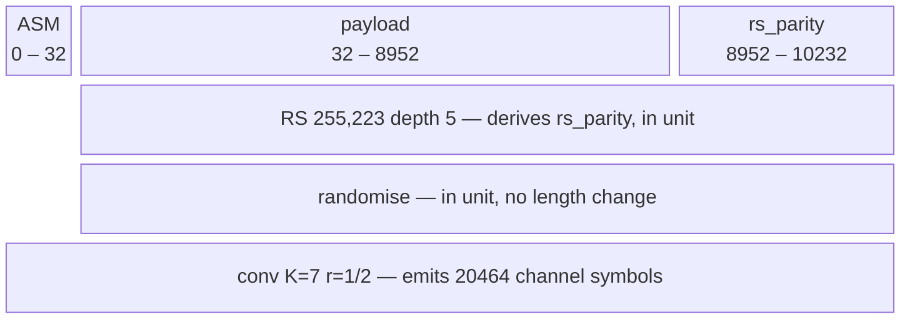

# A Frame as a Description

A frame is a list of **fields** that appear on the wire and a list of
**stages** that transform them. This page is the design for holding that once,
generally, so a standard's framing is a configuration a caller writes rather
than a framer somebody adds.

It is written before the code, which is where a design page belongs: this is
the phase with no gate, and therefore the cheapest place to be wrong
([Adding an Algorithm](../dev/contributing/adding-algorithms.md), phase 1).

______________________________________________________________________

## Why — the tree already has three framers and a 38-argument constructor

Every other standard-specific thing in doppler decomposed into *a general
primitive* plus *a configuration*. `conv_core.h` owns convolutional codes as a
description and `CCSDS_TM_CONV` is four numbers that configure it.
`rs_core.h` owns any Reed-Solomon code over any field and `CCSDS_TM_RS` is
five. `rs_core.h` states the principle outright — *"a standard picking a code
is not the same fact as the code existing"* — and `ccsds_tm_rs.h` repeats it
about the interleaver and the dual basis.

Framing is the one layer where that did not happen. What exists instead:

| what                        | shape                                    | owns                                            |
| --------------------------- | ---------------------------------------- | ----------------------------------------------- |
| `wfm/wfm_frame.h`           | a **closed struct** of four named fields | `[preamble × reps \| sync \| payload \| crc16]` |
| `ccsds_tm/ccsds_tm_frame.h` | a **second, disjoint** assembler         | `[ASM \| RS codeblock]`, four coded stages      |
| `frame/frame_core.h`        | a Python object over the first           | no layout at all — pure delegation              |

The two framers share nothing. Neither can express the other. And the closed
struct has already reached its limit in a way that is visible from outside:
`frame_create()` takes **38 positional arguments** — three fields at twelve or
thirteen numbers each, plus a CRC flag — because a fixed field list forces
every field's every parameter into the signature. Adding a fifth field is a
signature change in the Python face.

That is the cost being paid today. The cost being paid tomorrow is worse: a
user who wants a frame doppler did not anticipate has no move except to add a
fourth framer.

______________________________________________________________________

## Use cases — who calls this, and what they do with the answer

- **`wfmgen`, generating a test waveform.** Framing is *already* an axis there
    and not a waveform type: the usage text reads *"`--acq-code`/`--sync`
    describe a FRAME"*, layered on top of `--type bits` and the user's own
    `--bits`. Coding is the next stage on that same axis. A user should be
    able to say "randomise this, Reed-Solomon it at depth 5, prepend this
    marker, convolutionally code the lot" over bits they supplied, and get
    channel symbols.
- **The scoring path, measuring a capture.** `wfm_frame.h`'s premise is that
    the description is *"described once and read from both ends"* —
    `wfm_frame_crc_ok()` is what makes a **truth-free** frame error rate
    possible. A frame with an outer code has a strictly better error detector
    than CRC-16: `ccsds_tm_frame_decode()` already reports `rs_ok`,
    `rs_corrected` and `rs_symbols`, which is a refusal *and* the margin being
    spent. A generalized description is what lets one scorer read both.
- **A Python caller analysing a capture.** `frame/frame_core.h` exists because
    *"only C could hold one"* and `ber`'s frame meter had no way to be fed from
    the language captures are analysed in. A user-defined field list is what
    lets that object describe a frame doppler has never seen — including a
    CCSDS CADU, without `ccsds_tm` growing a binding it should not have.
- **A mission that is not CCSDS.** The point of the generalization. CCSDS is
    the first configuration because it is the one whose facts are published,
    not because it is the target.

______________________________________________________________________

## The model

Two lists. The second is where the value is.

```text
fields   ordered by POSITION — what appears on the wire, in order
         { name, kind, len, derived_by }
         kind: literal | pn | gold | dotted | marker | payload

stages   ordered by APPLICATION — what transforms which fields
         { kind, cover, config, emits_unit }
         kind: crc | rs | interleave | randomise | conv
```

A **layout** function derives every span and every length from the two, which
is exactly what `ccsds_tm_frame_layout()` already does for its fixed four and
`wfm_frame_layout()` for its fixed three-plus-CRC. Generalizing the descriptor
does not invent a new operation; it widens the one both already have.

The shape above is **the prototype's**, not the first sketch's — see
[what the prototype settled](#what-the-prototype-settled) for the two things
that changed and why. For what may appear in each list — the field kinds, the
stage kinds, what a stage kind must implement, and where the set is allowed to
grow — see
[the general solution, enumerated](#the-general-solution-enumerated).

### `cover` is the load-bearing field, and the header says why

The single most important constraint on this design is already written down,
in `ccsds_tm_frame.h`, as a prediction of how it fails:

> An order is the representation that cannot express this: any chain of
> optional transforms applied to "the frame" is right at three stage
> boundaries and wrong at the fourth, and wrong in the direction that still
> encodes, still decodes against itself, and syncs to nothing.

A generic frame with user-defined fields and a list of optional transforms is
**precisely that chain** — unless every stage carries an explicit `cover` and
never an implicit "everything so far". Get this wrong and the general version
reintroduces, for every user, the exact defect `ccsds_tm_frame_layout_t` was
shaped to make impossible. `cover` is not a refinement to add once the basic
case works; without it the basic case is the bug.

Two consequences worth stating separately, because both are easy to lose:

- **Order and coverage are independent axes.** In CCSDS the ASM is *inserted
    third* and is covered by the stage applied *fourth*. A single ordered list
    cannot say that. The field list gives position; each stage's `cover` gives
    reach; neither is derivable from the other.
- **A stage may change length, and there are exactly two ways it can.**
    Reed-Solomon adds 32 check symbols per codeword and the CRC adds 16 bits —
    both of which *appear on the wire inside the same unit*. The convolutional
    code is different in kind: it consumes the assembled CADU and emits a
    **different stream**, channel symbols, which is why
    `ccsds_tm_frame_layout_t` carries `cadu_bits` and `out_bits` as two
    numbers rather than one. The first kind is a `derived_by` field; the second
    is a stage's `emits_unit`. Collapsing them into one "expand" rule is what
    the prototype started with and what it argued out of.

### The packed/unpacked boundary belongs to the assembler

`ccsds_tm_frame.h` says this explicitly and it does not become less true when
generalized: Reed-Solomon wants **packed octets** because an R-S symbol *is* a
byte, while the randomiser and the convolutional coder want **unpacked bits**
because they are bit machines. Both are right. The conversion belongs in
exactly one place rather than hidden inside a kernel that then works for one
caller — so the general assembler owns it, per stage, and a stage declares
which representation it consumes.

______________________________________________________________________

## The general solution, enumerated

The model above gives the shape. This is the content: what may actually
appear in the two lists, what each entry costs the assembler, and where the
set is allowed to grow.

Three of the four enumerations below are **closed** — a fixed set this
design commits to. The fourth is deliberately open, and it is the one that
decides whether the generalization is real: a set that only doppler can
extend is a fourth framer with extra steps.

`native/inc/wfm/wfm_frame.h` is the SSOT for every name here; this page owns
the reasoning, not the declarations.

One CADU, drawn. The top row is the field list, ordered by POSITION on the
wire; each row beneath it is one stage's `cover`, ordered by APPLICATION.
Those are the two lists, and the block widths are schematic — a 32-bit
marker cannot be drawn to scale beside an 8920-bit payload — so the exact
spans are in the labels.



Read the three cover rows, because they are the design in one picture. `RS`
and `RANDOMISE` begin at bit 32 — **after** the marker. `CONV` begins at bit
0 and takes the marker in. That asymmetry is the entire reason a stage
carries an explicit `cover` rather than inheriting "everything so far": a
chain would be right for two of these three and wrong for the third, in the
direction that still encodes, still decodes against itself, and syncs to
nothing.

The `rs_parity` block is on the wire and is therefore a **field**, not a
length rule hidden inside the stage that produces it — which is what lets
the layout be a plain running sum over the top row.

### 1. Fields — where a run of bits comes from

A field's kind answers one question only: who produces the bits. Length is a
separate axis, and so is derivation.

| kind      | bits come from              | parameters                                         |
| --------- | --------------------------- | -------------------------------------------------- |
| `LITERAL` | a 0/1 array the caller owns | the array                                          |
| `PN`      | `pn_create()` — one LFSR    | `poly`, `seed`, `reg_bits`, `lfsr`                 |
| `GOLD`    | `gold_create()` — two LFSRs | `taps_a`, `seed_a`, `taps_b`, `seed_b`, `reg_bits` |
| `DOTTED`  | alternating `1010…`         | none — a line at Rs/2 to settle on                 |

Two properties sit **across** the kinds rather than inside them, which is
what keeps the table four rows long instead of eight:

- **`reps`** repeats the run verbatim. A preamble is not a fifth kind; it is
    any of the four, repeated.
- **`derived_by`** names the stage that produces the field instead of the
    caller. This is the prototype's first finding turned into a struct
    member: a CRC trailer and a block of Reed-Solomon check symbols are the
    *same concept*, both on the wire, both sized by their stage — so both are
    fields, and no stage needs a rule for expanding the field it covers. It
    is stored as the stage index **plus one**, so a zero-initialised field is
    caller-supplied rather than silently the output of stage 0.

For the generated kinds, `len` is the **output** length and `reg_bits` the
register width. They are named apart because conflating them is easy and
costly: `pn_create()`'s period is `2^reg_bits - 1` and has nothing to do with
how many bits the field wants.

### 2. Stages — what transforms the fields it covers

| stage        | does                             | length effect                           | derives     | kernel from |
| ------------ | -------------------------------- | --------------------------------------- | ----------- | ----------- |
| `CRC16`      | `dp_crc16_ccitt` over the head   | +16 bits, in unit                       | its trailer | built in    |
| `INTERLEAVE` | permute `depth` × `unit_bits`    | none                                    | nothing     | built in    |
| `RS`         | a Reed-Solomon code, interleaved | + check symbols, in unit                | its parity  | a table     |
| `RANDOMISE`  | XOR a pseudo-random sequence     | none                                    | nothing     | a table     |
| `CONV`       | a convolutional code             | `× emit_num / emit_den`, **new stream** | nothing     | a table     |

The `length effect` column is the design's second prototype finding, and it
splits the table three ways rather than two. `CRC16` and `RS` add bits that
appear on the wire **inside the same frame**, so what they add is a derived
field and the layout simply sums. `INTERLEAVE` and `RANDOMISE` change no
length at all — one permutes its span, the other XORs it. `CONV` alone
consumes the assembled frame and emits a *different* stream, which is why
the layout reports `frame_bits` and `out_bits` as two numbers rather than
one. Collapsing "adds bits in place" and "emits a new stream" into a single
"expand" rule is what the prototype started with and argued its way out of.

**Only two stages are built in, and the rule for which is a layering fact,
not a judgement of importance.** A CRC and a block interleaver need no
configuration a standard has to supply — `dp_crc16.h` is already a dependency
and a permutation's whole geometry is `depth`, `unit_bits` and the span it
covers. An outer code, a randomiser and an inner code are each configured by
the component that owns them, and `ccsds_tm` must depend on `wfm_frame.h` to
describe a CADU — so if `wfm_frame.c` called `ccsds_tm`'s kernels the two
components would form a cycle. The kernels travel in the other direction
instead, as a table.

### 3. What a stage kind must implement

Three slots, and the arithmetic for a kind lives in exactly one place:

1. **`in_unit`** — rewrite `n` bits in place, where the span lies. Serves a
    CRC, an outer code and a randomiser alike, because of the invariant in §4:
    the op receives the whole cover, reads the information at its head and
    writes whatever it derives into its tail.
1. **`emit`** — consume the assembled frame and write a different stream.
    Exactly one of `in_unit` and `emit` is set. `out` may overlap `in`: the
    frame is assembled in the tail of the caller's buffer and the stream
    written from its head, so an implementation must read each input bit
    before writing the output that displaces it — the order an expanding code
    writes in anyway.
1. **`undo`** — the receive side, reporting into one `wfm_frame_stage_rx_t`
    per stage. **Optional, and its absence is information.** The inner code
    has none by design: it is streaming, emits decisions `depth` bits late,
    and is undone before frame synchronisation, so a frame checker never sees
    channel symbols. Such a stage is reported **not checked** rather than
    passed — different answers, and a receiver that conflated them would call
    an unverified frame good.

One report shape for every checking stage, rather than a struct per code, is
what lets a caller compare them: `units` / `ok` / `corrected` / `symbols`. A
CRC reports one unit that is good or not; an interleaved outer code reports
one unit per codeword and the repair work it did. `ok == units` with a rising
`symbols` is margin being spent — and it is spent before it is lost.

### 4. The invariants, which are refusals

Each of these is enforced where the description is read, not documented and
hoped for. All exist because the failure mode of this design is a frame that
still assembles, still decodes against itself, and syncs to nothing.

- **A stage's cover is what it OCCUPIES on the wire**, information and
    derived check symbols together. What it *reads* is the cover minus the
    fields it derives. Both from one declaration, so the two cannot disagree.
- **A derived field must be the LAST field of its producing stage's cover.**
    This is what lets one `in_unit` signature serve every in-place stage. A
    description that breaks it is refused, rather than producing a frame with
    the parity in the middle of the data.
- **A stage whose kind is in neither table is a refusal, never a skip.** A
    stage that quietly did not run is the exact failure this design is shaped
    to prevent.
- **A stage covering no caller-supplied bits derives nothing** — its field
    drops to zero length. The general form of a rule `wfm_frame_layout` has
    always applied to its one case: a CRC over an empty payload protects
    nothing and is not emitted.

### 5. The open end — how the set grows

`wfm_frame_ops_t` is a table looked up by kind that **extends** the built-ins
rather than replacing them, so a component supplying an outer code does not
have to restate the CRC. That is the whole extension mechanism, and it has
two consequences worth separating:

- **A standard's framing is a table plus a description**, both data.
    `ccsds_tm_frame_ops()` is three entries — outer code, randomiser, inner
    code — and a CADU is the description in
    [configuration 2](#2-one-ccsds-cadu) below.
- **A caller with a stage doppler has never heard of supplies its own entry**
    rather than waiting for `wfm_stage_kind_t` to grow. This is what makes
    the answer to *"a mission that is not CCSDS"* a configuration rather than
    a pull request, which was the point of generalizing at all.

Turbo, LDPC and the B-5 channel interleaver are not in scope here, but they
are shaped like rows in that table rather than like a sixth framer — which is
the test this enumeration has to pass.

______________________________________________________________________

## Two configurations, and they are the design's falsification targets

A generalization that cannot express what already ships is not a
generalization. Both of these must fall out as **data**, with no special case
in the assembler:

### 1. doppler's existing frame

```text
fields:  [ preamble × reps | sync | payload | crc derived_by=crc16 ]
stages:  [ crc16  cover={payload} ]
```

If this needs a special case, the model is wrong. Note that it also fixes a
thing the closed struct states in prose and cannot express — the CRC covers
*the payload alone*, and the preamble sits outside the group — because
`cover` says so instead of a comment saying so.

### 2. one CCSDS CADU

```text
fields:  [ ASM | payload | rs_parity derived_by=outer ]
stages:  [ rs(255,223,E=16) depth=I  cover={payload, rs_parity}
           randomise                 cover={payload, rs_parity}
           conv(K=7, r=1/2)          cover={ASM, payload, rs_parity}
                                     emits_unit: b -> 2b ]
```

A stage's free parameter carries its configuration: `rs`'s `depth` is the
interleaving depth, and `randomise`'s selects **which** generator, since
131.0-B-6 specifies two and only the matching receiver derandomises a given
waveform. That is deliberately not something a kernel picks for itself.

The coverage asymmetry that the whole `ccsds_tm` slice exists to get right —
outer code no, randomiser no, inner code **yes** — stops being three
hand-written struct members and becomes a field range a user can write. And
the falsification is the strongest one available: the general assembler's
output must equal `ccsds_tm_frame_encode()`'s **byte for byte**, which is the
published-vector discipline this slice was built on, turned on the
generalization itself.

______________________________________________________________________

## Unknowns — the numbers and shapes this design does not yet know

Written down first, deliberately, so the work that follows measures them
rather than confirming a decision already made.

- **How many fields a real frame needs.** Five covers both configurations
    above. Whether the list should be bounded (a fixed maximum, stack-friendly,
    no allocation) or unbounded is unresolved, and it decides whether the
    descriptor stays a POD.
- **Whether a stage's `cover` must be contiguous.** Both configurations above
    use a contiguous range. A non-contiguous cover is expressible as a bitmask
    over fields at no real cost, but nothing yet needs one, and *"do not design
    for hypothetical future requirements"* applies.
- **Whether `interleave` is its own stage or part of `rs`.** CCSDS 4.4.1
    describes S1/S2 as part of the coding, and `ccsds_tm_rs_encode_block()`
    implements them together. Splitting them is more general and may be
    generality nobody asked for. *The prototype folded them, on the second
    ground: nothing in either configuration distinguishes them, and depth is
    already a parameter of the one stage.*
- **Whether `jm` can express the Python face.** A user-defined field list is a
    variable-length structured argument, and the current binding is 38 scalars.
    Whether that is a declarable shape in the manifest — or needs a jm feature
    filed upstream — is unknown and is on the critical path for
    `frame/frame_core.h`.
- **The migration cost in the DSSS path.** `wfm_frame_dsss_chips()` builds
    these bits and spreads them, reading the named offsets. It is the consumer
    most likely to resist an indexed field list.
- **What the CLI syntax should be.** Not a detail: the flag surface is pinned
    case-by-case by `native/tests/wfmgen_flag_matrix.json`, carried in
    `--record`, and published in `site/schema/wfmgen.schema.json`, so it is
    expensive to change after it ships.

______________________________________________________________________

## What the prototype settled

Phase 1 calls for *"a Python prototype to de-risk — throwaway, in a scratch
directory, to find out whether the idea works at all"*. One was written and is
not committed. It computes **no bits**: it holds fields and stages, derives a
layout, and is checked against what the two shipped framers actually report,
extracted from C (`ccsds_tm_frame_layout()` and `wfm_frame_layout()`). Lengths
and spans are the whole claim under test, so lengths and spans are all it
computes.

It reproduces **all three ground-truth layouts exactly**, from one `layout()`
function with no special case:

| configuration                   | result                                                                                             |
| ------------------------------- | -------------------------------------------------------------------------------------------------- |
| CCSDS concatenated, depth 5     | `out=20464 block=10200 cadu=10232`, spans `marker=0,32 outer=32,10200 rand=32,10200 inner=0,10232` |
| CCSDS, marker + randomiser only | `out=544 block=512 cadu=544`, spans `outer=0,0 rand=32,512 inner=0,0`                              |
| doppler's own frame             | `pre=0,24 sync=24,13 pay=37,16 crc=53,16 total=69`                                                 |

So the claim holds: the two framers this page opens by counting are one
descriptor with two configurations. Two things changed on the way, and both
are folded into the model above:

- **A derived field IS a field**, and making it one deletes machinery rather
    than adding it. The first version expanded the field a stage covered
    (payload 8920 → 10200 bits under R-S); the second gave the check symbols
    their own `derived_by` field and let the layout simply sum. Both reproduce
    ground truth, and the second needs **no in-unit length rule at all** —
    which also makes R-S parity and a CRC trailer the same concept instead of
    two.
- **"Emits a new unit" is a distinct property, and the model needs it.** This
    was missing from the first sketch and the prototype would not reproduce
    `out_bits` without it. A stage either transforms the unit in place or
    consumes it and emits a different stream; the convolutional code is the
    only one of the five that does the latter, and it is exactly why
    `ccsds_tm_frame_layout_t` reports `cadu_bits` and `out_bits` separately.

One caution the prototype cannot speak to, and it is the important one: it
tests **lengths and spans, not bits.** That a descriptor produces the right
coverage table says nothing about whether an assembler reading it applies the
stages to the right bits. That is what falsification target 2 is for, and it
stays a target — byte-for-byte against `ccsds_tm_frame_encode()`, not against
a round trip.

______________________________________________________________________

## Implementation sketch

**Home: `wfm/wfm_frame.h`, widened in place.** It already holds the
described-once-read-from-both-ends contract and is already on wfmgen's path;
widening it keeps one home and one set of callers to migrate rather than
adding a fourth framer to a page that opens by counting three.

**Composes, never reimplements.** Every stage already exists as a general
primitive with a CCSDS configuration beside it: `conv_core.h` + `CCSDS_TM_CONV`,
`rs_core.h` + `CCSDS_TM_RS`, `ccsds_tm_randomise`, `ccsds_tm_asm_bits`, and
`dp_crc16_ccitt`. The generalization adds a **descriptor and a layout**, and
no arithmetic whatsoever. If a stage's implementation appears in this work,
something has gone wrong.

Three consumers migrate, and the third is the one to schedule first because it
is the one with an external interface:

1. `wfm_frame.c` — the layout owner; named offsets become an indexed list
1. `frame/frame_core.h` — the Python object, today 38 positional arguments
1. `wfmgen` — the parse table, `--record`, the flag matrix, the schema

**A Python prototype de-risks the model before any C moves** — throwaway, in a
scratch directory, not committed, per phase 1. What it has to answer is
whether the field/stage/cover triple can express both configurations above
without a special case, because that is the whole claim.

## Extraction — where CCSDS still shapes the generic path

The layering is already deliberate in one direction, and the code says so:
`wfm_source_describe_frame()` carries the note that *"the covers are that
standard's and `wfm/wfm_frame.h` deliberately knows nothing about CCSDS"*.
That holds. What does not yet hold is the direction **into** the descriptor.

**The source struct is the standard's stage list.** `wfm_source_t`'s
framing and coding fields — `attach_asm`, `rs_depth`, `randomise`,
`convolutional`, `interleave_depth`, `interleave_unit_bits` — are CCSDS TM's
five stages, one field each. So the adapter that turns a source into a
description has no choice but to assemble a `ccsds_tm_frame_spec_t` first
(`native/src/wfm/wfm_synth_bridge.c`, at the `ccsds_tm_frame_desc_of` call),
and a description reached only through that struct can only ever be a CADU.
That is the mechanism behind the claim this page opens with: the general
descriptor exists, and nothing can currently ask it for a frame the standard
does not have.

The move is one sentence and it is not a rewrite of the adapter: **the source
carries a description rather than a standard's parameters.** Then
`wfm_source_describe_frame()` does not get generalized, it gets deleted — and
the eleven wfmgen flags that spell those six fields collapse into one, which
is the same change seen from the CLI.

### The five sites, and the order to cut them

| #   | site                                                                                                                | what it is today                                                  | after                                                                                                                               |
| --- | ------------------------------------------------------------------------------------------------------------------- | ----------------------------------------------------------------- | ----------------------------------------------------------------------------------------------------------------------------------- |
| 1   | `native/src/wfm/wfm_synth_bridge.c` — the `ccsds_tm_frame_spec_t` literal and the `ccsds_tm_frame_desc_of()` return | the only route from a wfmgen source to a `wfm_frame_desc_t`       | the source holds a description; the adapter is deleted                                                                              |
| 2   | the same file's two `ccsds_tm_frame_ops()` calls                                                                    | the generic assembler borrowing the standard's stage-kernel table | the ops table is promoted beside the descriptor; CCSDS supplies configuration, as it already does for `conv_core.h` and `rs_core.h` |
| 3   | the same file's `CCSDS_TM_RS_K` and `CCSDS_TM_RS_2E` arithmetic                                                     | the standard's code parameters sizing payload and parity buffers  | both lengths come from the layout the descriptor already returns                                                                    |
| 4   | `native/src/wfm/ccsds_asm_bits.c`                                                                                   | a CCSDS translation unit inside the generic wfm component         | the ASM is a literal field of a preset, not code living in `wfm`                                                                    |
| 5   | `native/src/frame/frame_core.c` and `native/src/burst_demod/burst_demod_core.c`                                     | include `ccsds_tm/ccsds_tm_frame.h` for the stage kernels         | follows from 2, with no work of their own                                                                                           |

Cut **1 first**, for the reason the sketch above already gives for scheduling
wfmgen first: it is the site with an external interface, and every other site
becomes easier once the thing being passed around is a description. Sites 2
and 3 are then mechanical. Sites 4 and 5 fall out.

### What is deliberately *not* extraction

- **The Python door is already the right shape.** `objects/frame.toml` states
    the intent plainly: `ccsds_tm` has no binding and is not getting one, so a
    caller meets the outer code, the randomiser and the inner code *by
    describing a CADU* — three fields and three covers. `FrameDesc` is not a
    CCSDS entry point wearing a general name; it is the general door, and
    CCSDS being reachable through it is the design working.
- **CCSDS stays, as the example.** It is falsification target 2 on this page
    for a reason: its facts are published, and it is the one configuration
    that exercises `cover` asymmetrically — the randomiser skips the ASM while
    the inner code covers it. Extraction moves it from *under* the general
    layer to *beside* it. Nothing about it is deleted.

### The gate, or it grows back

The rule is checkable as written: **no component outside `ccsds_tm` includes a
`ccsds_tm` header.** It is violated in exactly four places today (sites 1–2
share one, plus 4 and 5), which makes it a ratchet rather than a rule that
would fail on arrival — the same shape as the allocation-helper gate, which
landed against 313 pre-existing sites and may only shrink. Start it at the
measured count, let it fall to zero as the sites above are cut, and it cannot
silently return afterwards.

Sabotaging it is one line: add the include back to any generic component and
the gate must go red. A rule this page states and nothing enforces is how the
tree acquired three framers in the first place.

______________________________________________________________________

## Deliberately not in scope

- **Virtual fill.** A frame off the `223 × I` octet grid still has no path
    through the outer code
    ([gh-813](https://github.com/doppler-dsp/doppler/issues/813)). The
    generalization makes that refusal *user-visible* for the first time, which
    is an argument for fixing it, not for hiding it behind padding — silently
    padding produces a codeblock a receiver configured for the full length
    cannot parse.
- **A streaming receiver object.** `ccsds_tm_frame_decode()` begins after the
    inner decode and after frame synchronisation, for the reasons its header
    gives: a Viterbi is streaming and emits decisions `depth` bits late, and
    the marker is only readable once the inner code is undone. That boundary
    does not move here.
- **New coding stages.** Turbo, LDPC and the B-5 channel interleaver are
    configurations this model should be able to grow into. None is being
    added.
