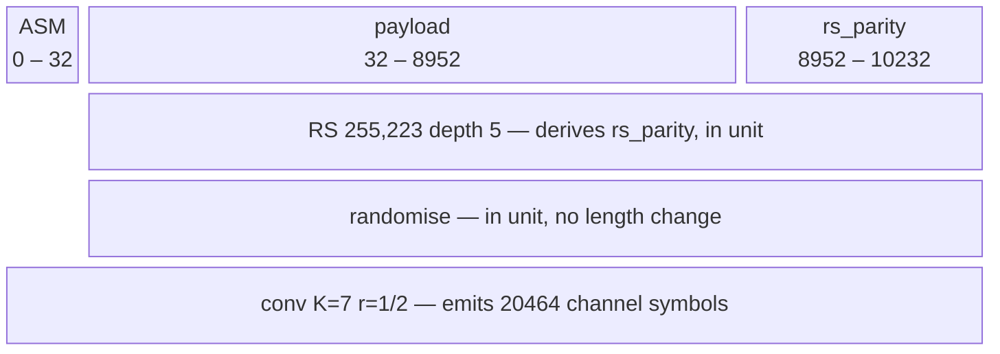

# A Frame as a Description

A frame is a list of **fields** that appear on the wire and a list of
**stages** that transform them, each stage carrying the span it covers. This
page is where that model is held once, generally, so a standard's framing is a
configuration a caller writes rather than a framer somebody adds.

**CCSDS is the example on this page, not the implementation underneath it.**
It is here because its facts are published and because it is the one
configuration that exercises `cover` asymmetrically. Every claim below is
about the general model; where CCSDS still shapes the generic path, that is
recorded as a defect with a gate on it, not as the design.

This page states what is. What was measured to get here — the survey that
counted seven spellings of a field, the prototype that proved the grammar
lossless — is on the [measurement record](frame-description-measurements.md),
under the same section letters.

______________________________________________________________________

## Why — a general primitive plus a configuration

Every other standard-specific thing in doppler decomposed the same way.
`conv_core.h` owns convolutional codes as a description and `dp_CCSDS_TM_CONV` is
four numbers that configure it. `rs_core.h` owns any Reed-Solomon code over
any field and `dp_CCSDS_TM_RS` is five, and it states the principle outright —
*"a standard picking a code is not the same fact as the code existing"*.

Framing was the layer where that had not happened. What existed instead was a
**closed struct** of four named fields
(`[preamble × reps | sync | payload | crc16]`) whose constructor had grown to
**38 positional arguments**, because a fixed field list forces every field's
every parameter into the signature; and a **second, disjoint** assembler for
CCSDS that shared nothing with it and could not express it. Neither could
express the other, and a user wanting a frame doppler had not anticipated had
no move except to add a third framer.

The description fixed the frame, and the 38 arguments survived it. They were
never a framing problem. Each cluster of twelve — `preamble_kind`,
`preamble`, `preamble_nbits`, `preamble_poly`, … — is one **field** spelled
out parameter by parameter, because a field had no value of its own to pass.
The same cluster was spelled again as a CLI triple (`--sync`, `--sync-hex`,
`--sync-gen`), a JSON literal key plus a `*_gen` object, and a fifteen-argument
`add_field`. The missing piece is the **Field** as a value every face
passes: literal bits as data, and one text form — parsed by one C function —
for everything written as text ([§F](#f-the-field-one-text-form)).

## Use cases — who calls this, and what they do with the answer

- **`wfmgen`, generating a test waveform.** Framing is an axis there rather
    than a waveform type: `--acq-code`/`--sync` describe a frame, each
    taking one Field (`--sync 0x1ACFFC1D`, `--acq-code 'pn:1023:10*4'`),
    and `--data` says where the payload comes from. Coding is the next stage on
    that same axis — randomise this, Reed-Solomon it at depth 5, prepend this
    marker, convolutionally code the lot, over bits the caller supplied.
- **The scoring path, measuring a capture.** The description is read from
    both ends, which is what makes a **truth-free** frame error rate possible.
    A frame with an outer code has a strictly better error detector than
    CRC-16: the check reports how much repair it took, so a margin being spent
    is visible long before it is lost.
- **A Python caller analysing a capture.** `frame_core.h` exists because only
    C could hold a description and `ber`'s frame meter had no way to be fed
    from the language captures are analysed in. A user-defined field list is
    what lets that object describe a frame doppler has never seen — including
    a CCSDS CADU, without `ccsds_tm` growing a binding it should not have.
- **A mission that is not CCSDS.** The point of the generalization.

______________________________________________________________________

## The model

Two lists, ordered independently, because order and coverage are different
questions:

```text
field[]   ordered by POSITION on the wire
stage[]   ordered by APPLICATION
```

A **field** is a run of bits that appears on the wire. It is either
caller-supplied — a literal array, or a generated sequence — or **derived**,
meaning a stage produces it. `derived_by` names the producing stage **plus
one**, so a zero-initialised field is caller-supplied rather than silently the
output of stage 0.

A **stage** is a transform *plus the span it covers*, declared as a contiguous
field range rather than inherited as "everything so far".

### `cover` is the load-bearing field, and the header says why

The single most important constraint on this design is written down in
`ccsds_tm_frame.h` as a prediction of how it fails:

> An order is the representation that cannot express this: any chain of
> optional transforms applied to "the frame" is right at three stage
> boundaries and wrong at the fourth, and wrong in the direction that still
> encodes, still decodes against itself, and syncs to nothing.

A generic frame with user-defined fields and a list of optional transforms is
**precisely that chain** — unless every stage carries an explicit `cover`.
Without it the basic case is the bug.

Two consequences worth stating separately:

- **Order and coverage are independent axes.** In CCSDS the ASM is *inserted
    third* and is covered by the stage applied *fourth*. A single ordered list
    cannot say that. The field list gives position; each stage's `cover` gives
    reach; neither is derivable from the other.
- **A stage may change length, and there are exactly two ways it can.** A
    Reed-Solomon code adds check symbols and a CRC adds 16 bits — both appear
    on the wire *inside the same unit*, so both are derived fields and the
    layout is a running sum. A convolutional code is different in kind: it
    consumes the assembled frame and emits a **different stream**, which is
    why the layout reports `frame_bits` and `out_bits` as two numbers.

One CADU, drawn. The top row is the field list, ordered by position; each row
beneath it is one stage's `cover`, ordered by application. Block widths are
schematic — a 32-bit marker cannot be drawn to scale beside an 8920-bit
payload — so the exact spans are in the labels.


```mermaid
block-beta
  columns 12
  ASM["ASM<br/>0 – 32"]
  PAY["payload<br/>32 – 8952"]:8
  PAR["rs_parity<br/>8952 – 10232"]:3
  space
  RS["RS 255,223 depth 5 — derives rs_parity, in unit"]:11
  space
  RND["randomise — in unit, no length change"]:11
  CONV["conv K=7 r=1/2 — emits 20464 channel symbols"]:12
```

Read the three cover rows, because they are the design in one picture. `RS`
and `RANDOMISE` begin at bit 32 — **after** the marker. `CONV` begins at bit 0
and takes the marker in. That asymmetry is the entire reason a stage carries
an explicit `cover`: a chain would be right for two of these three and wrong
for the third, in the direction that still encodes, still decodes against
itself, and syncs to nothing.

The `rs_parity` block is on the wire and is therefore a **field**, not a
length rule hidden inside the stage that produces it — which is what lets the
layout be a plain running sum over the top row.

### The packed/unpacked boundary belongs to the assembler

Reed-Solomon wants **packed octets**, because an R-S symbol *is* a byte;
a randomiser and a convolutional coder want **unpacked bits**, because they
are bit machines. Both are right, so the conversion belongs in exactly one
place rather than hidden inside a kernel that then works for one caller. The
general assembler owns it, per stage, and a stage declares which
representation it consumes.

______________________________________________________________________

## F. The Field — one text form

A **Field** is `wfm_field_t` given a value a caller can pass: where its bits
come from, how long it is, and how many times it repeats. It is the unit a
caller hands to every face — the CLI, a JSON scene, Python and C.

**A Field is data or a description, and only a description must be text.**
A *literal* field is data — a payload is often thousands of bits, and in
Python and C its natural form is an array, which is passed as one and never
parsed. A *generated* field (`pn`, `gold`, `dotted`) is a description of
bits nobody has written down, so text is its only form. The grammar below is
therefore the one spelling for everything that **is** text: every generated
field, and a literal on the faces that are text themselves (the CLI, JSON) or
written short and inline. It is not a requirement that payload bits become a
string.

### F.1 The grammar

```text
field  := seq [ "*" REPS ]                        REPS >= 1, default 1
seq    := bin | hex | pn | gold | dotted | data
bin    := [01]+                                    nothing else is allowed
hex    := "0x" [0-9A-Fa-f]+                        4 bits per digit, MSB first
pn     := "pn:" LEN ":" REG [":" SEED [":" POLY]] [":" LFSR]
gold   := "gold:" LEN ":" REG ":" TA ":" SA ":" TB ":" SB
dotted := "dotted:" LEN
data   := "data:" LEN                               LEN bits per frame from the data source (§F.5)
LFSR   := "galois" | "fibonacci"                   default galois
```

Numbers take decimal or `0x` hex, and a token must be consumed whole. `LEN`
is the **output** length — `0` only as a data source, where it means *unbounded* (§F.5) — and `REG` the register width, `1..64`; they are named
apart for the reason [the field kinds](#1-fields-where-a-run-of-bits-comes-from)
give. A `0`/`1` string with any other character in it is refused, never
filtered — a typo that quietly shortens a sync word is the failure this
closes.

| writes as                           | means                                                      |
| ----------------------------------- | ---------------------------------------------------------- |
| `11101011`                          | eight literal bits                                         |
| `0x1ACFFC1D`                        | the 32-bit CCSDS marker                                    |
| `pn:1023:10`                        | a 1023-bit m-sequence, 10-bit Galois register              |
| `pn:64:7:0x5:0:fibonacci`           | 64 bits, seed 5, default poly, Fibonacci                   |
| `gold:64:10:0x3A6:0x15E:0x237:0x49` | a Gold code from two registers                             |
| `dotted:16`                         | `1010…`, 16 bits                                           |
| `pn:31:5*4`                         | a 31-chip code, sent four times (a preamble)               |
| `data:1024`                         | a payload: 1024 bits per frame, drawn from `--data` (§F.5) |

**`reps` belongs to the Field**, because `wfm_field_t` carries it: a preamble
is not a fifth kind but any of the four repeated. `*` needs quoting in a
shell (`--acq-code 'pn:31:5*4'`); the docs always quote it.

### F.2 One parser, one printer

`dp_wfm_field_parse(spec, &field, &owned, &why)` is the only place the grammar
is read, and `dp_wfm_field_format(&field, buf, cap)` the only place it is
written. Every face calls them; none restates the grammar.

- **Ownership follows the existing rule** — the caller owns literal bits, the
    description borrows them. `owned` receives the allocated array for a
    literal and `NULL` for a generated kind.
- **A refusal names its cause.** The return is `DP_OK`, `DP_ERR_INVALID` or
    `DP_ERR_MEMORY` ([the convention](../dev/contributing/error-convention.md)),
    and the optional `why` receives a **static** sentence, the shape
    `dp_wfm_compose_from_json_why()` already uses for a refused frame. The CLI
    prefixes the flag and the JSON reader the key.
- **The printed form is canonical and round-trips:** hex when the length is a
    multiple of four, binary otherwise; a generator prints only what differs
    from its defaults. `parse(format(f)) == f` for every Field.

### F.3 Every face takes a Field, in the form natural to it

| face            | a literal field                                                                     | a generated field      |
| --------------- | ----------------------------------------------------------------------------------- | ---------------------- |
| CLI             | the text form; a payload's bits come from `--data` (§F.5)                           | the text form          |
| JSON            | the text form (hex when the length allows, so a long payload is ¼ the characters)   | the text form          |
| a carried frame | `{"name", "spec"}` as text, or `{"name", "derived_by", "bits"}` for a derived field | `{"name", "spec"}`     |
| Python          | an array (`uint8`, bytes, any 0/1 sequence) — **or** the text form                  | the text form          |
| C               | a `wfm_seq_t` over the caller's array                                               | `dp_wfm_field_parse()` |

One flag and one JSON key per field on the text faces — `--sync`,
`--acq-code`, `--data-code` — and one for the payload's source, `--data`
(§F.5). In Python, one parameter per field that accepts either form:
`Frame(preamble=, sync=, payload=, crc=)`, `FrameDesc.add_field(name, value)`.
Python already works this way for the composer: jm's `bit_pattern` coercion
lets `Synth(payload=...)` take bytes, a 0/1 sequence or a binary/hex string.
What is new is that the string may also be a generator, and that it is parsed
by the one C function rather than by the binding. There is no separate
`Field` object: a frame's layout already reports its fields.

**A derived field has no text form**, and that is correct: nobody writes a
CRC trailer's bits. It is declared by the stage that produces it
(`add_derived`) and appears in a carried frame only as its name and length.

The spellings this replaces are **refused, not aliased**, each with a message
naming its replacement: `--X-hex`, `--X-gen`, `--acq-reps`, the six payload
flags `--bits`, `--bits-hex`, `--bits-file`, `--payload`, `--payload-gen` and
`--payload-len` (all now `--data`), and the JSON keys `*_gen`,
`pattern`, `acq_reps`, `lit` and `gen`. Two spellings of one thing is the
condition this section exists to end.

### F.4 Where literal bits come from

A literal field's bits arrive in one of two shapes, and the difference is the
whole of what can go wrong:

| source                        | shape                                          | on which face                       |
| ----------------------------- | ---------------------------------------------- | ----------------------------------- |
| an array                      | **unpacked** — one bit per element, `0` or `1` | Python, C                           |
| a binary file                 | **packed** octets, MSB first                   | CLI `--data PATH`; Python via `cvt` |
| a byte stream — stdin, a pipe | **packed** octets, MSB first                   | CLI `--data -`; Python via `cvt`    |

**One primitive unpacks.** Packed octets become bits in exactly one place, a
`bytes_to_bin` beside `hex_to_bin` in `cvt` — the same conversion a hex
string already is, four bits at a time instead of eight. Today that
conversion is private to `wfmgen.c`, so the file path works from the CLI and
from nowhere else.

**A Python `bytes` object is unpacked**, because that is what the composer's
`bit_pattern` coercion already takes it to mean (`b"\x01\x00\x01"` is three
bits). Packed data is therefore never passed as `bytes` and hoped about: it
goes through `cvt.bytes_to_bin` first, by name. A value whose meaning depends
on which face received it is the defect this section exists to prevent.

**A constant field is read once; a payload is drawn from, frame by frame.**
A preamble, a sync word or a spreading code is the same in every frame, so
its source is read once into the field. A payload is not — see §F.5.

### F.5 The payload is a data source

Two use cases decide the shape, and neither is served by a payload that is
one fixed block:

1. **A finite burst, all data known a priori** — a file, an array, a message:
    split across as many frames as it takes, then the burst ends.
1. **An infinite stream** — a pipe or a live source: chunked into frames for
    as long as it runs.

Today a frame's payload is one block **cycled** to fill the run, so every
frame carries the same bits; continuous DSSS streams data but has no frame.
Both use cases need the same two things instead: **the frame declares how
many bits a frame carries, and a data source feeds it.** Cycling is
**deleted** rather than kept as a mode: a finite burst runs once, and more
than once is `--repeat`, which already exists.

**The payload is a Field of kind `data`.** `data:LEN` means *LEN bits per
frame, drawn from the frame's data source*. It is the one field kind whose
bits are not in the description, which is exactly what a payload is, and it
keeps the frame a description: its layout, its length and every stage's
cover are known without the data.

**The data source is declared once, with `--data`** — the flag continuous
DSSS already uses for the same question:

| `--data`                                           | a              | frames                                                    |
| -------------------------------------------------- | -------------- | --------------------------------------------------------- |
| a file path                                        | finite source  | `ceil(bits / LEN)`, then the burst ends                   |
| a literal Field, or a generated one with `LEN > 0` | finite source  | the same                                                  |
| `-`                                                | stream — stdin | until the input ends                                      |
| a generated Field, `pn:0:REG[:SEED]`               | stream, seeded | until `--count`; a receiver regenerates it from the Field |
| `none`                                             | no data        | code only — continuous DSSS, unchanged                    |

A file and stdin carry **packed** octets, unpacked by the one primitive of
§F.4.

**The last partial chunk is padded with a declared fill.** A finite source
that does not divide into `LEN`-bit chunks fills its last frame from
`--fill`, itself a Field (`0x00`, `pn:…`), so every frame keeps one length
and a receiver's frame length never changes. Without a declared fill the run
is **refused**, naming the remainder: a pad nobody chose is data nobody sent.
How many fill bits the last frame carries is recorded (`--record`, the SigMF
metadata) as **truth for scoring**, not as a signal to the receiver.

**A stream that runs dry sends idle frames.** Paced (`--realtime`), an
underrun emits frames whose payload is the fill, so the carrier and the frame
timing never break and a receiver stays locked; each is counted and reported.
When the input *ends* — a closed pipe, not a pause — the last frame is padded
by the rule above and the run ends cleanly.

**A receiver is designed in the know, so the frame carries no signalling of
its own.** A receiver is built against the description it expects: it knows
the payload is `LEN` bits at a known offset, and that an idle frame's payload
is the declared fill. If a link wants to say more in band — a length, a
frame count, an idle flag — that is **a field at a known position**, declared
in the description like any other, and the receiver reads bits `N:M` because
it was designed to. The generator does not interpret it. A field whose
*value* depends on the data (a per-frame length) would be a derived field and
so a stage kind; none is added until a link needs one.

**What a record can replay.** A finite source is replayed byte for byte: its
bits (or its file and a hash of it) are in the record. A stream is not — the
record holds its description (`-`, `pn:0:23:0x5`), and a generated source replays because
it is a function of its seed; stdin replays only if the same bytes are fed
again.

This is designed here so that Field and the one frame are shaped for it; it
is **built as its own pass through the lifecycle, after** the Field and the
surface table land ([#853](https://github.com/doppler-dsp/doppler/issues/853)).

______________________________________________________________________

## R. One frame representation

The description is **the** frame, and there is no other way to say one. A
frame that could be said two ways needed a compiler between them, a rule
refusing both at once, and a record that had to choose which to write; with
one way, all three go.

| representation                                                                                                                                 | fate                                                                |
| ---------------------------------------------------------------------------------------------------------------------------------------------- | ------------------------------------------------------------------- |
| `wfm_frame_desc_t`                                                                                                                             | **the frame**: fields + stages                                      |
| a source's `frame`                                                                                                                             | the description, carried as given                                   |
| the flat framing fields on a `wfm_source_t` — `sync`, `payload`, `crc`, `rs_depth`, `randomise`, `attach_asm`, `convolutional`, `interleave_*` | **deleted**                                                         |
| the CLI coding flags `--asm`, `--rs-depth`, `--randomise`, `--conv`, `--interleave`, `--interleave-unit`                                       | **deleted**; a coded frame is a `--frame` file                      |
| the by-name compiler `dp_wfm_source_describe_frame()`                                                                                          | **deleted** with what it compiled                                   |
| `wfm_frame_t` / `wfm_frame_layout_t`, `dp_wfm_frame_describe()`, the four-field DSSS helpers, `dp_wfm_synth_set_dsss()`                        | **deleted**; their callers read the description                     |
| `ccsds_tm_frame_spec_t` + `dp_ccsds_tm_frame_desc_of()`                                                                                        | **deleted**: literal-only, and a second derivation of covers        |
| `ccsds_tm_frame_cfg_t`                                                                                                                         | **kept** — it configures the codec's kernels, not a generated frame |
| `Frame`'s 38 arguments, `add_field`'s 15, `add_hex`, `add_value`                                                                               | **replaced** by one Field each                                      |

**What a source still carries, and why it is not framing.** A DSSS source's
acquisition code and data code are how its bits become chips — the spreading,
not the frame — so they stay on the source as Fields, beside the frame they
spread and the data source that fills it (§F.5). Which fields a spreader
sends as the unspread preamble is the DSSS path's rule to state when it moves
onto the description; the [unknowns](#unknowns) carry it.

**The CLI takes a frame two ways, and they are not two representations.**
`--frame FILE` reads a description — the only way to add a coding stage, and
how a CCSDS CADU is written. For the common frame, `--acq-code`, `--sync`,
`--crc` and `--data-len` are the fields of **one fixed layout**,
`[preamble × reps | sync | data | crc]`, which one C function builds into a
description before anything else sees it. Both at once are refused. Nothing
downstream of the CLI knows which was used: the record stores the
description.

## The four enumerations — three closed, one open

`native/inc/doppler/wfm/wfm_frame.h` is the SSOT for every name here; this page owns
the reasoning, not the declarations. The fourth enumeration being open is what
decides whether the generalization is real: a set only doppler can extend is a
third framer with extra steps.

### 1. Fields — where a run of bits comes from

A field's kind answers one question only: who produces the bits.

| kind      | bits come from                 | parameters                                         |
| --------- | ------------------------------ | -------------------------------------------------- |
| `LITERAL` | a 0/1 array the caller owns    | the array                                          |
| `PN`      | `dp_pn_create()` — one LFSR    | `poly`, `seed`, `reg_bits`, `lfsr`                 |
| `GOLD`    | `dp_gold_create()` — two LFSRs | `taps_a`, `seed_a`, `taps_b`, `seed_b`, `reg_bits` |
| `DOTTED`  | alternating `1010…`            | none — a line at Rs/2 to settle on                 |

Two properties sit **across** the kinds rather than inside them, which is what
keeps the table four rows long instead of eight: **`reps`** repeats the run
verbatim, so a preamble is not a fifth kind but any of the four repeated; and
**`derived_by`** names the stage that produces the field instead of the
caller, which is what makes a CRC trailer and a block of check symbols the
same concept.

For the generated kinds, `len` is the **output** length and `reg_bits` the
register width. They are named apart because conflating them is easy and
costly: a PN sequence's period is `2^reg_bits - 1` and has nothing to do with
how many bits the field wants.

**This enumeration is closed, and unlike stages it has no extension point** —
the generator is a `switch` in `wfm_frame.c`, so a new sequence kind is a pull
request against the header. That asymmetry with stages is deliberate but it is
worth naming: sequences are a small, bounded set of ways to make bits;
transforms are not.

### 2. Stages — what transforms the fields it covers

| stage        | does                             | length effect                           | derives     | kernel from |
| ------------ | -------------------------------- | --------------------------------------- | ----------- | ----------- |
| `CRC16`      | `dp_crc16_ccitt` over the head   | +16 bits, in unit                       | its trailer | built in    |
| `INTERLEAVE` | permute `depth` × `unit_bits`    | none                                    | nothing     | built in    |
| `RS`         | a Reed-Solomon code, interleaved | + check symbols, in unit                | its parity  | a table     |
| `RANDOMISE`  | XOR a pseudo-random sequence     | none                                    | nothing     | a table     |
| `CONV`       | a convolutional code             | `× emit_num / emit_den`, **new stream** | nothing     | a table     |

The `length effect` column splits the table three ways rather than two.
`CRC16` and `RS` add bits that appear on the wire **inside the same frame**,
so what they add is a derived field and the layout simply sums. `INTERLEAVE`
and `RANDOMISE` change no length at all. `CONV` alone consumes the assembled
frame and emits a *different* stream.

**Only two stages are built in, and the rule for which is a layering fact, not
a judgement of importance.** A CRC and a block interleaver need no
configuration a standard has to supply. An outer code, a randomiser and an
inner code are each configured by the component that owns them, and
`ccsds_tm` must depend on `wfm_frame.h` to describe a CADU — so if
`wfm_frame.c` called `ccsds_tm`'s kernels the two would form a cycle. The
kernels travel in the other direction instead, as a table.

**The three names `RS`, `RANDOMISE` and `CONV` are CCSDS's three stages**, and
that is the one place the general enumeration is shaped by the standard. They
carry no kernel here — only a reserved number and a generic description.

### 3. What a stage kind must implement

Three slots, and the arithmetic for a kind lives in exactly one place:

1. **`in_unit`** — rewrite `n` bits in place, where the span lies. Serves a
    CRC, an outer code and a randomiser alike, because of the invariant below:
    the op receives the whole cover, reads the information at its head and
    writes whatever it derives into its tail.
1. **`emit`** — consume the assembled frame and write a different stream.
    Exactly one of `in_unit` and `emit` is set. `out` may overlap `in`: the
    frame is assembled in the tail of the caller's buffer and the stream
    written from its head, so an implementation must read each input bit
    before writing the output that displaces it.
1. **`undo`** — the receive side. **Optional, and its absence is
    information.** An inner code has none by design: it is streaming, emits
    decisions late, and is undone before frame synchronisation, so a frame
    checker never sees channel symbols. Such a stage is reported **not
    checked** rather than passed — different answers, and a receiver that
    conflated them would call an unverified frame good.

One report shape for every checking stage, rather than a struct per code, is
what lets a caller compare them: `units` / `ok` / `corrected` / `symbols`.
`ok == units` with a rising `symbols` is margin being spent.

### 4. The open end — how the set grows, and how far

A stage's kind is an **open `uint32_t`, not the enumeration above**. Kernels
come from `wfm_frame_ops_t`, a table looked up by kind that **extends** the
built-ins rather than replacing them — the caller's table is searched first,
so a component supplying an outer code does not have to restate the CRC.
`WFM_STAGE_USER` is the first value reserved for callers, and doppler never
allocates at or above it.

That is what makes the answer to *"a mission that is not CCSDS"* a
configuration rather than a pull request against a header. Turbo, LDPC and a
channel interleaver are shaped like rows in that table rather than like a
third framer, which is the test this enumeration has to pass.

**The seam is C-level, and that limit is real.** A Python caller can *declare*
a `WFM_STAGE_USER` kind and cannot supply its kernel, so `build()` refuses:
kernels stay in C by decision
([#1125](https://github.com/doppler-dsp/doppler/issues/1125),
[#1140](https://github.com/doppler-dsp/doppler/issues/1140)). From Python the
reachable set is therefore the built-ins plus whatever table the C entry point
wires in — which today is CCSDS's three. The certification report records this
as a gap rather than a feature; see
[`validation/wfm_frame/results.md`](https://github.com/doppler-dsp/doppler/blob/main/src/doppler/wfm/tests/validation/wfm_frame/results.md)
finding F2. A page that claimed the Python face was open would be describing
the C header, not the object.

______________________________________________________________________

## The invariants, which are refusals

Each is enforced where the description is read, not documented and hoped for.
All exist because the failure mode of this design is a frame that still
assembles, still decodes against itself, and syncs to nothing.

| invariant                                                                                                                                                | why                                                                                                                       | enforced in                                |
| -------------------------------------------------------------------------------------------------------------------------------------------------------- | ------------------------------------------------------------------------------------------------------------------------- | ------------------------------------------ |
| **A stage's cover is what it OCCUPIES on the wire** — information and derived check symbols together; what it *reads* is the cover minus what it derives | both from one declaration, so the two cannot disagree                                                                     | `wfm_frame.h` (the struct's contract)      |
| **A derived field must be the LAST field of its producing stage's cover**                                                                                | lets one `in_unit` signature serve every in-place stage; the alternative is parity in the middle of the data              | `wfm_frame.c:156`                          |
| **At most one emitting stage, and it must cover the whole frame**                                                                                        | two streams is not a frame; a partial emit has no defined wire order                                                      | `wfm_frame.c:206-215`                      |
| **A stage whose kind is in neither table is a refusal, never a skip**                                                                                    | a stage that quietly did not run is the exact failure this design prevents; it is pre-flighted before any byte is written | `wfm_frame.c:451-458`                      |
| **A stage covering no caller-supplied bits derives nothing**                                                                                             | a CRC over an empty payload protects nothing and is not emitted                                                           | `wfm_frame.c:162`                          |
| **A Field is refused, never repaired** — a stray character, a zero length, a register outside `1..64`                                                    | a typo that silently shortens a sync word still assembles and syncs to nothing                                            | `dp_wfm_field_parse` (§F; lands with #853) |
| **A CLI frame is said one way** — `--frame` and the fixed-layout field flags together are refused                                                        | two descriptions of one frame is a render that can disagree with its own length check                                     | `wfmgen.c` (§R; lands with #853)           |

## The limits, as numbers

| limit                  | value | what it bounds                 |
| ---------------------- | ----- | ------------------------------ |
| `WFM_FRAME_MAX_FIELDS` | 16    | fields per description         |
| `WFM_FRAME_MAX_STAGES` | 8     | stages per description         |
| `WFM_FRAME_CRC_BITS`   | 16    | the only CRC width             |
| `WFM_FRAME_NAME_MAX`   | 16    | field-name bytes, NUL included |

The field and stage bounds were raised against a measurement rather than a
feeling: the deepest description doppler builds is six fields and five stages,
and the descriptor is a POD carried by value, so the cost is bytes on a stack
frame. Two further limits are structural rather than numeric: a cover is
**contiguous**, and a stage derives **at most one** field.

______________________________________________________________________

## Two configurations, and they are the design's falsification targets

A generalization that cannot express what already ships is not a
generalization. Both fall out as **data**, with no special case in the
assembler.

### 1. doppler's existing frame

```text
fields:  [ preamble × reps | sync | payload | crc derived_by=crc16 ]
stages:  [ crc16  cover={payload} ]
```

It also fixes a thing the closed struct stated in prose and could not express
— the CRC covers *the payload alone*, and the preamble sits outside the group
— because `cover` says so instead of a comment saying so.

### 2. one CCSDS CADU

```text
fields:  [ ASM | payload | rs_parity derived_by=outer ]
stages:  [ rs(255,223,E=16) depth=I  cover={payload, rs_parity}
           randomise                 cover={payload, rs_parity}
           conv(K=7, r=1/2)          cover={ASM, payload, rs_parity}
                                     emits_unit: b -> 2b ]
```

A stage's free parameter carries its configuration: `rs`'s `depth` is the
interleaving depth, and `randomise`'s selects **which** generator, since
131.0-B-6 specifies two and only the matching receiver derandomises a given
waveform. That is deliberately not something a kernel picks for itself.

The coverage asymmetry the whole `ccsds_tm` slice exists to get right — outer
code no, randomiser no, inner code **yes** — stops being three hand-written
struct members and becomes a field range a user can write. The falsification
is the strongest available: the general assembler's output equals
`dp_ccsds_tm_frame_encode()`'s **byte for byte**.

Both targets are met.

______________________________________________________________________

## Where CCSDS still shapes the generic path

The layering holds in one direction and the code says so: `ccsds_tm` depends
on `wfm/wfm_frame.h`, which knows nothing about CCSDS — no include, no
constant, no default, no kernel. The direction **into** the descriptor from
the layers above it is now clean as well.

### Where a caller meets CCSDS

Three components include `ccsds_tm` to **compose** it — `frame_core.c`,
`wfm_synth_bridge.c` and `burst_demod_core.c` — in the acyclic direction the
design intends; each is the place a caller is meant to meet the standard's
kernels. The marker a mission copies out of the Blue Book is
`doppler.ccsds.asm_bits()`, over a `ccsds` component that sits **beside** the
general layer, not under it. Its rule is narrow, and stated on the component's
own header so it travels with the code: **a literal a mission copies out of
the Blue Book belongs there; a transform does not.** How each of these was
settled is on the [measurement record](frame-description-measurements.md#c-the-ccsds-sites).

### What is deliberately *not* extraction

- **The Python door is the right shape.** `ccsds_tm` has no binding and is not
    getting one, so a caller meets the outer code, the randomiser and the
    inner code *by describing a CADU* — three fields and three covers. That
    class is not a CCSDS entry point wearing a general name; it is the general
    door, and CCSDS being reachable through it is the design working.
- **CCSDS stays, as the example.** It is falsification target 2 for a reason:
    its facts are published, and it is the one configuration that exercises
    `cover` asymmetrically. Extraction moves it from *under* the general layer
    to *beside* it. Nothing about it is deleted.

### The gate

**`wfm/wfm_frame.h` and `wfm_frame.c` contain no `ccsds_tm` include and call
no `ccsds_tm` kernel.** `make ccsds-isolation-check` enforces exactly that,
inside `make lint`. It reads the two files the primitive is made of, strips
comments — the header explains the layering *by naming* the component on the
other side of it — and fails on an include, on a call reached through a
forward declaration, or on reading nothing at all.

That is the rule the header states about itself, and no more: **a consumer
composing the two is the design working.** `frame -> ccsds_tm -> wfm_frame`
is acyclic and deliberate.

What a cycle would actually cost is not a link error. It is a general layer
that quietly acquires a standard's defaults, and a build that starts depending
on link order — a failure that arrives late and reads as something else. Cheap
and exact is the right shape for that.

______________________________________________________________________

## Unknowns

The numbers and shapes this design still does not know, each stated before
it is measured:

- **Contiguous vs bitmask `cover`.** Every configuration so far covers a
    contiguous field range. A standard that interleaves coverage would need a
    mask, and nothing has demanded one.
- **Whether 16 fields and 8 stages are the right bounds.** They were sized
    against the deepest description that exists, not against a class of them.
- **The migration cost of the DSSS path.** It reads the four named offsets
    of `wfm_frame_t` rather than an indexed field list; §R deletes that
    struct, so this is measured when the path moves, not guessed now.
- **Whether `*N` survives real use.** It needs shell quoting. Today a
    repetition count appears 8 times across the docs and examples, always on
    the acquisition code and always `4`, and 4 times in the flag-matrix
    golden — rare enough that quoting is cheap, common enough that a separate
    key would be a second spelling of one field. Revisit if a user trips on
    it.
- **What `--repeat` means over a data source.** Replaying a finite burst is
    the natural reading; re-reading a stream is not possible. Decided when
    §F.5 is built.
- **Three things jm must do, checked with a scaffold before they are
    relied on.** An object parameter that accepts **either** an array or a
    string — `bit_pattern` coercion does this for composer fields today, and
    an object's parameters are unproven (else: the parameter takes the text
    form and an array goes through `Field.from_bits`, one documented door
    rather than a second spelling); a parameter that may be omitted (else:
    empty meaning absent); and whether the extra manifest keys the surface
    table needs survive a `jm` re-save
    ([`wfmgen.md` — one surface table](wfmgen.md#one-surface-table)).

## Deliberately not in scope

- **Virtual fill.** A frame off the `223 × I` octet grid still has no path
    through the outer code
    ([#813](https://github.com/doppler-dsp/doppler/issues/813)). The
    generalization makes that refusal *user-visible*, which is an argument for
    fixing it, not for hiding it behind padding.
- **New coding stages.** Turbo and LDPC are configurations this model should
    grow into; the block interleaver already ships as `INTERLEAVE`. None is
    being added here.
- **The receive side.** `BurstDemod` and `DsssBurstReceiver` still take raw
    code arrays and a hand-computed `frame_syms`. Moving them onto Fields and
    a `FrameDesc` is its own pass through the lifecycle, after this one
    ([#853](https://github.com/doppler-dsp/doppler/issues/853)).
