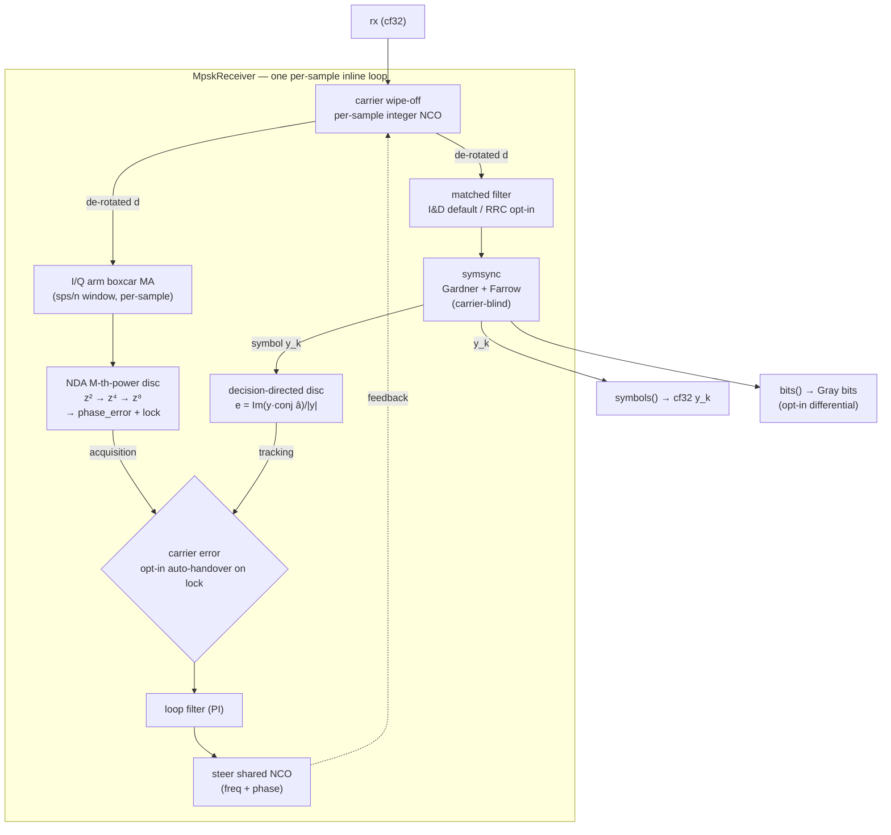

# MPSK Receiver

**Status:** implemented — `track.CarrierNda` (#276) + `track.MpskReceiver` shipped;
the NDA carrier loop reworked to a raw M-th-power discriminator + arm AGC (§2.3)
**Scope:** a streaming **M-PSK receiver** (`track.MpskReceiver`, M = BPSK / QPSK
/ 8PSK) that demodulates pulse-shaped baseband by **composing existing
`doppler.track` primitives** plus two new ones. C-first: every block below is a
C core; the Python face is the jm-generated thin wrapper. This is the
architecture, the carrier-recovery design (the part most easily
miscommunicated), and the sequential build plan.

Related: [carrier loop theory](../gallery/carrier-mpsk.md) (the decision-directed
`CarrierMpsk` loop, already shipped), the async DSSS despreader
([design](async-symbol-despreader.md)) — DSSS-MPSK is the pipeline
`Dll(segments) → MpskReceiver`, not a fused object.

______________________________________________________________________

## 1. Architecture (option 1: pulse-shaped modem)

One **per-sample inline loop** (mirrors `channel_core.h`), not a block cascade —
a block cascade cannot feed the carrier error back per sample.



- **Matched filter:** **integrate-and-dump (boxcar) is the default**; RRC is
    **opt-in** (`beta`, `span`). Both are linear FIRs feeding `symsync`.
- **Timing** is carrier-blind (Gardner `|·|²`), so it settles in parallel with
    carrier acquisition and can lead it.
- **Carrier de-rotation is per-sample, before the matched filter** — see §2.
- **DSSS-MPSK** is the downstream pipeline `Dll(segments) → MpskReceiver`; the
    despreader removes the PN code and hands samples to this modem. Not fused.

______________________________________________________________________

## 2. Carrier recovery — the design that's easy to get wrong

The rule is **predetection de-rotation, postdetection discrimination**, with a
twist for cold start.

### 2.1 De-rotation is per-sample, always

The integer-NCO wipe-off runs on **every input sample, before anything else**.
A residual carrier rotating across an integration window costs sinc energy; the
window here is the matched filter (short for I&D ≈ `sps`, long for RRC ≈
`2·span·sps+1`), so per-sample de-rotation is the general-purpose "just works"
placement. It costs more compute than de-rotating symbols, and that is the
accepted trade — it is correct for every mode (I&D, RRC, large residual, and the
DSSS front-end) without special-casing.

### 2.2 Two discriminators share one NCO + loop filter

A decision-directed loop alone cannot cold-start: it needs symbol decisions,
which need timing lock and (for the error to mean anything) data. Many real
links must **acquire the carrier with no symbol timing and no data present**
(e.g. a bare/unmodulated carrier, or before timing settles). So the carrier loop
has **two error sources into one NCO**:

1. **Acquisition — non-data-aided (NDA) M-th-power discriminator** on the I/Q
    **arm: a free-running boxcar moving average of `sps/n` samples** (one output
    per input sample — no rate change; **n is a config param, default 4**, which
    sets the `1/n`-symbol window). The discriminator runs **every sample**. It
    strips the M-PSK modulation by raising the arm sample to the Mth power, so it
    is independent of data and of symbol timing. This is the robust cold-start
    path. (`bn` is in cycles/sample — the loop updates every sample, so it is
    **n-invariant**: `n` only sets the window length, not the loop rate.)

1. **Tracking — decision-directed** `e = Im(y·conj(â))/|y|` on the full-SNR
    recovered symbol `y_k` (the `CarrierMpsk` discriminator, already shipped and
    validated). Low jitter once timing + lock are established.

### 2.3 The NDA discriminator + lock signal (canonical definition)

The M-th-power detector is computed efficiently by **repeated complex squaring**
of the arm sample `z = i + jq`: `z²` strips BPSK, `z⁴` strips QPSK, `z⁸` strips
8PSK. Each squaring level yields both a phase error and a lock signal; the
per-M `lock_scale` normalizes the discriminator/lock gain so the handover
threshold is M-independent.

**Arm normalization — an AGC, not a per-sample limiter.** The arm sample `z` is
driven to unit average power by an embedded log-domain AGC (`agc_core`) before
the discriminator, with a 10 dB square clip on the AGC output. This is
deliberate. The discriminator is the **raw** M-th-power form `Im(z^M)` (the
"conventional Costas" / linear-arm form), which is optimal for a
constant-modulus signal — the DSSS target. A per-sample unit-magnitude
normalization `z/|z|` is Yuen's "polarity-type" hard limiter, the *worst*
nonlinearity (≈2.5–4 dB extra squaring loss, and non-monotone in SNR). The AGC
provides amplitude invariance (so the loop gain does not scale with input level)
*without* the limiter's penalty; the clip bounds the peak (constructive-ISI)
arm samples that would otherwise dominate the `|z|^M` weighting. The AGC runs
per sample, but its loop-filter command is decimated internally
(`agc_step` with `gain_update_period = 8`) so the per-sample cost stays low.
The AGC bandwidth is
locked to `0.01·bn`, so it tracks only the overall level — never the carrier
dynamics or a pulse-shaping envelope. **Input average power is required to be at
or below unity** — the normal convention for captured/scaled baseband (and the
DSSS despreader's known correlation gain). The AGC absorbs residual/slow
variation only; a cold input >~10 dB above unity is out of spec (the slow AGC
cannot normalize it before the discriminator reacts, and the loop can
false-lock — clip on → false lock, clip off → `|z|^M` gain blow-up).

```python
# osr = sample_rate // symbol_rate   # input oversampling, typ. 4
# The arm is a free-running half-symbol boxcar moving average (no rate
# conversion); i, q are its per-sample outputs (one per input sample),
# AGC-normalized to unit average power.  esno = symbol energy-to-noise-density
# ratio, dB.
#
# Squaring loss S_L (Lindsey-Simon / Yuen): the SNR penalty of the M-th-power
# nonlinearity; S_L <= 1 always, so sq_loss_dB <= 0.  Measured from the loop it
# is  slope**2 / var(phase_error) / rd  using the ACTUAL S-curve slope at lock
# (= 2 only for a constant-modulus arm; it collapses on a pulse-shaped arm,
# see below) — NOT a hardcoded 4.

rd = 10 ** (esno / 10.0)

bpsk_lock = i**2 - q**2          # Re(z^2)
bpsk_phase_error = 2 * i * q     # Im(z^2)

if mod == "BPSK":
    lock_scale = 1
    phase_error = bpsk_phase_error
    lock_signal = lock_scale * bpsk_lock
    # Yuen Eq. 8-19 (passive arm-filter Costas loop), half-symbol boxcar arm.
    # Verified moments: K2 = 5/6, K4 = 23/30, KL = 2/3, Bi/R = 2 (z = Bi/R/2 = 1).
    K2, K4, KL, z = 5 / 6, 23 / 30, 2 / 3, 1
    S_L = K2**2 / (K4 + KL * z / rd)   # high-SNR floor K2**2 / K4 = 0.906 = -0.43 dB
    sq_loss_dB = 10 * np.log10(S_L)
elif mod == "QPSK":
    lock_scale = 0.619
    phase_error = bpsk_phase_error * bpsk_lock                        # ~ Im(z^4)
    lock_signal = lock_scale * (bpsk_lock**2 - bpsk_phase_error**2)   # ~ Re(z^4)
    # No clean closed form for the M-th-power passive loop; empirical fit (dB).
    sq_loss_dB = -0.0564724 * esno**2 + 1.90284531 * esno - 15.65792221
else:  # 8PSK
    lock_scale = 0.412
    qpsk_phase_error = bpsk_phase_error * bpsk_lock
    qpsk_lock = bpsk_lock**2 - bpsk_phase_error**2
    phase_error = qpsk_phase_error * qpsk_lock                        # ~ Im(z^8)
    lock_signal = lock_scale * (qpsk_lock**2 - qpsk_phase_error**2)   # ~ Re(z^8)
    sq_loss_dB = -0.14285557 * esno**2 + 5.70706958 * esno - 58.13670891

# Coherent (data x squaring) gain of the free-running half-symbol boxcar arm:
#   Re E[z_d^M] = 1/2 + 1/(M+1)   ->  M=2: 5/6,  M=4: 7/10,  M=8: 11/18.
# For BPSK this is exactly K2 = 5/6;  mod_loss_dB = 10 * log10(1 / K2).
mod_loss_dB = 10 * np.log10(1 / (5 / 6))
```

- `phase_error` ≈ `Im(z^M)` (scaled) — a sawtooth S-curve of period `2π/M`, the
    M-fold phase ambiguity (consistent with the `CarrierMpsk` S-curve). It steers
    the NCO; the M-fold ambiguity is resolved downstream (differential demap or a
    sync word), same as the decision-directed loop.
- `lock_signal` ≈ `Re(z^M)` (scaled) — large and positive when phase-locked,
    ~0 with no carrier. It is **the lock metric that drives handover** and is the
    receiver's carrier lock indicator.

The squaring-loss/noise behaviour worsens with M (each squaring multiplies
noise), so the NDA loop is the *acquisition* aid; decision-directed tracking
gives the low-jitter steady state.

**Gain collapse on a pulse-shaped arm — the loop still locks.** The raw
M-th-power coherent gain is `Σ_k g_k^M` over the arm/pulse taps `g`. For a
constant-modulus arm this yields the S-curve slope 2; for a pulse-shaped (e.g.
pre-matched-filter RRC) arm `Σ g_k⁴` is minuscule and the slope collapses ~80×.
Because the loop filter is **type-2 (PI)**, the steady-state frequency error is
still driven to zero — the loop **locks on RRC as well as constant-modulus**
(`native/validation/carrier_nda_step_response.c` validates both) — only pull-in
is slower and jitter higher. The pulse-shaped *symbol* error rate is then set by
the downstream matched filter + timing, not by the carrier loop.

#### Derivation — the recursion *is* the M-th-power loop

Write the arm sample `z = i + jq`. The first level is literally `z²`:

```
bpsk_lock        = i² − q² = Re(z²)
bpsk_phase_error = 2iq     = Im(z²)
```

Each subsequent level squares the running pair and reads off its real/imaginary
parts, so `(lock, phase_error)` climbs the powers `z² → z⁴ → z⁸`. Verified
exactly (residual 0 over a full phase sweep):

| M   | `phase_error` | `lock_signal`                 |
| --- | ------------- | ----------------------------- |
| 2   | `Im(z²)`      | `Re(z²)`                      |
| 4   | `½·Im(z⁴)`    | `0.619·Re(z⁴)`                |
| 8   | `¼·Im(z⁸)`    | `0.412·(Re(z⁴)² − ¼·Im(z⁴)²)` |

So **`phase_error` is exactly the M-th-power discriminator** `Im(z^M)`, scaled by
`1, ½, ¼`. That scale is not arbitrary — it **normalizes the phase-detector gain
across M**. The S-curve slope at lock is `(slope of Im(z^M)) × scale = M × scale = 2·1, 4·½, 8·¼ = 2` for every M, so one loop-filter `bn` behaves identically for
BPSK / QPSK / 8PSK. (This is why the recursion carries `ab = Im(z⁴)/2` rather
than the full `2ab` into the next squaring.)

The **`lock_signal` is `Re(z^M)` exactly for M = 2, 4** (up to `lock_scale`). For
**M = 8 it is *not* literally `Re(z⁸)`**: carrying the ½-scaled imaginary arm up
one more level gives `Re(z⁴)² − ¼·Im(z⁴)²` instead of `Re(z⁸) = Re(z⁴)² − Im(z⁴)²`. The two coincide at lock (`Im(z⁴) → 0` → both peak), so it remains a
faithful, monotone lock detector — it is simply not the literal 8th-power real
part. Making it exact would require doubling the carried imaginary term, which
would break the constant-gain property above, so for a thresholded handover
detector the form as written is the right trade.

### 2.4 Opt-in auto-handover

Handover from the NDA acquisition discriminator to the decision-directed tracker
is **opt-in** (a config flag, default off → the loop stays in NDA acquisition
mode unless enabled). When enabled, it is **automatic on lock**: once
`lock_signal` holds above a threshold (timing also settled), the loop switches
the NCO's error source from the NDA discriminator to the decision-directed
`Im(y·conj(â))/|y|`. The shared NCO + loop filter state carries across the
switch (no frequency/phase discontinuity); only the error source changes.

______________________________________________________________________

## 3. The new NDA carrier-loop primitive (reusable)

The NDA M-th-power carrier loop is a **standalone reusable C primitive** (not
buried in the receiver) — a complete non-data-aided carrier-recovery loop usable
on its own for any M-PSK / unmodulated carrier:

- **Owns** an integer `lo` NCO + a `loop_filter` (by value), the I/Q arm
    **boxcar moving average** (embedded `boxcar` primitive) + its **per-sample
    AGC** (embedded `agc`), and the M-th-power discriminator + lock signal.
- **Per sample:** wipe-off (inline `*_wipeoff`), slide the boxcar arm one sample,
    AGC-normalize, run the discriminator, filter, steer the NCO — **one update
    per input sample** (no dumping). Inline composition API (`*_wipeoff` /
    `*_arm_step`) mirrors `lo_step` / `dll_accumulate` / `symsync_step`.
- **Exposes** `norm_freq`, `lock_signal`/lock metric, `m`, `n` (boxcar window
    divisor: window = `sps/n`), loop `bn`/`zeta` — and its NCO so a composing
    receiver can drive the **same** NCO with a decision-directed error on handover.
- **Config:** `m` (2/4/8), `sps`, `n` (default 4), `bn`, `zeta`, seed
    `init_norm_freq`. All params default + keyword-capable (no forced positionals).

Working name **`track.CarrierNda`** (non-data-aided). Naming review: there are
now three carrier loops — `Costas` (BPSK decision-directed), `CarrierMpsk`
(M-PSK decision-directed), `CarrierNda` (M-PSK non-data-aided). This revives the
earlier `track.Carrier.*` namespace idea; deferred (the jm-owned `__init__.py`
makes a nested namespace a drift/`.so`-is-API concern — see
[so-is-the-api]) — flat names for now.

`MpskReceiver` then embeds `CarrierNda` as its wipe-off NCO + acquisition loop,
and applies the decision-directed update (the `CarrierMpsk` discriminator math)
to the same NCO once handover engages.

______________________________________________________________________

## 4. Matched filter (I&D default, RRC opt-in)

A per-sample FIR feeding `symsync`:

- **I&D / boxcar (default):** unit-gain length-`sps` moving average — the matched
    filter for a rectangular NRZ symbol pulse (and the natural front for a despread
    chip stream).
- **RRC (opt-in):** `rrc_taps(beta, sps, span)` — matched to an RRC-shaped
    transmitter.

`fir_core.h` currently exposes only block `fir_execute`; the per-sample inline
loop needs a single-sample `fir_step` (additive C composition API, mirrors the
other `*_step`s; reuses the existing delay line, no struct change). The MF FIR is
owned by pointer (variable-length taps), like `channel`'s code copy.

> **No receiver-level AGC.** The decision-directed *tracking* path is already
> amplitude-invariant — the nearest-point slice and the `|y|`-normalized
> discriminator both ignore scale — so no front-end AGC is added here. The
> *acquisition* path is different: the raw M-th-power NDA discriminator is not
> amplitude-invariant, so `CarrierNda` carries its **own** internal arm AGC that
> normalizes the arm sample to unit power before the detector (§2.3). That AGC is
> internal to the acquisition loop, not a receiver component or a config param.

______________________________________________________________________

## 5. Symbol timing

Reuse `track.SymbolSync` (Gardner TED + Farrow, shipped) **as-is** — timing is
modulation-agnostic (`|·|²`). It needs a by-value `symsync_init` (additive;
`symsync_state_t` is already fully by-value — `nco`/`farrow`/`loop_filter` — so
this is just an in-place init mirroring `costas_init`/`dll_init`). The receiver
embeds `symsync_state_t` and drives it with the inline `symsync_step`.

______________________________________________________________________

## 6. Component reuse

| Piece                                                               | Verdict                                       |
| ------------------------------------------------------------------- | --------------------------------------------- |
| `lo` integer NCO + `lo_step`/`lo_init`                              | carrier wipe-off — as-is                      |
| `loop_filter` PI                                                    | every loop embeds it by value — as-is         |
| `CarrierMpsk` decision-directed discriminator                       | tracking-path math — reuse the update         |
| `SymbolSync` (Gardner + Farrow)                                     | timing — as-is (+ add `symsync_init`)         |
| `rrc_taps` + a per-sample FIR                                       | matched filter — reuse (+ add `fir_step`)     |
| `mpsk` slicer/demap (`mpsk_slice`, `mpsk_demap`, `mpsk_diff_demap`) | decision + bits + differential — as-is        |
| **NDA M-th-power carrier loop**                                     | **NEW reusable primitive** (§3)               |
| `Dll(segments)`                                                     | optional DSSS front-end — pipeline, not fused |

______________________________________________________________________

## 7. Build plan (sequential, each rock-solid first)

1. **`track.CarrierNda`** — the NDA M-th-power carrier loop primitive (§3).
    Validate: open-loop S-curve `phase_error(φ)` = the period-`2π/M` sawtooth per
    M; `lock_signal` vs phase/SNR; cold-start frequency pull-in on an *unmodulated*
    carrier and on modulated data with **no timing**; jitter vs bn. Gallery.
1. **`fir_step` + `symsync_init`** — the additive inline composition APIs (tiny,
    byte-identical to the block paths; their own parity tests).
1. **`track.MpskReceiver`** — the composition (§1). Validate end-to-end BER vs
    Es/N0 per M within ~1–2 dB of the MPSK bound, with a carrier offset + timing
    offset + pulse shaping; opt-in auto-handover engages and holds; I&D and RRC
    modes; reset-reproducible; block-size invariant (independent output per call,
    the gh-219 rule). DSSS-MPSK example chaining `Dll(segments) → MpskReceiver`.
    Gallery: constellation pull-in (cloud → M clusters), carrier + timing locks,
    BER table.

______________________________________________________________________

## 8. Resolved / open review points

- **NDA discriminator form** — *resolved.* Raw M-th-power via repeated squaring
    (§2.3) on an AGC-normalized arm; `lock_scale` = 1 / 0.619 / 0.412 for
    M = 2 / 4 / 8. Squaring-loss equations corrected and Yuen-grounded (§2.3).
- **Arm normalization** — *resolved.* Internal `agc_core` AGC (bandwidth locked
    to `0.01·bn`, decimated loop-filter command via `gain_update_period`) + 10 dB
    square clip, not a per-sample limiter (§2.3).
- **Naming** — `CarrierNda` / flat vs a `Carrier.*` namespace (deferred).
- **Handover threshold** — on `lock_signal` (+ timing-settled gate); tune in
    Step 3 validation.
- **n default 4** — boxcar arm window divisor (window = `sps/n`); **n-invariant**
    now (`bn` is cycles/sample), so this is purely a pull-in/jitter trade.
- **Pulse-shaped (RRC) SER** — *open, downstream.* The carrier loop locks on RRC
    (§2.3); the residual RRC symbol-error rate is an `MpskReceiver` matched-filter
    / Gardner-timing matter, tracked separately from `CarrierNda`.
