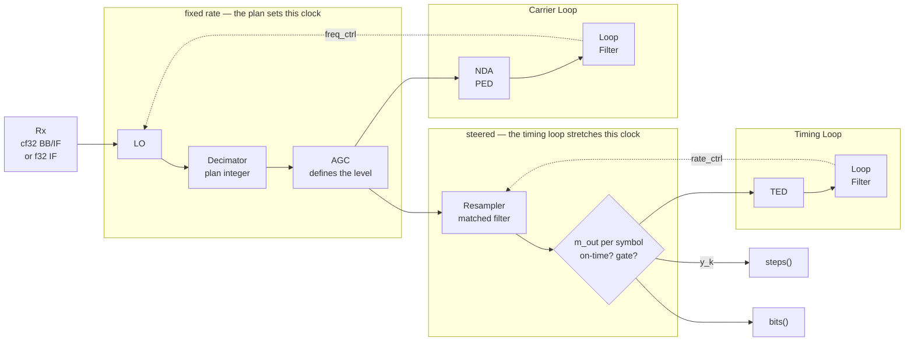

# MPSK Receiver

**Status:** `track.MpskReceiver` and `track.MpskReceiverR` are shipped and
built on the matched DDC cascade (§1.4). **§2, §3.3, §3.4, §4.1, §7 and §8
are the design of Mode 1 — agreed and being built, not yet shipped.** Every
measured table in this document is from the shipped code unless its caption
says otherwise; where the design changes what a number will be, it says so
rather than quietly restating it.

**Scope:** a streaming **M-PSK receiver** (`track.MpskReceiver` for complex
baseband, `track.MpskReceiverR` for a real IF, M = BPSK / QPSK / 8PSK) that
demodulates pulse-shaped signals by **composing existing `doppler.track` and
`doppler.resample` primitives**. C-first: every block below is a C core; the
Python face is the jm-generated thin wrapper.

**§9 is the exception to that scope**, and deliberately so: it specifies the
`mpsk` constellation primitive — Gray labelling, the hard-decision rule and
differential mode — which the receiver reuses rather than contains. It lives
here because it is the same topic, and one topic has one home.

**The first target is a continuous BPSK receiver.** That is what Mode 1 is
sized for, what the defaults are chosen against, and what the numbers below
are quoted at when a single case has to be picked.

Related: [carrier loop theory](../gallery/carrier-mpsk.md) (the
decision-directed `CarrierMpsk` loop), [RateSync](../gallery/ratesync.md)
(whose timing loop this receiver literally reuses), the
[matched rate converter](../gallery/rate-converter.md), the async DSSS
despreader ([design](async-symbol-despreader.md)) — DSSS-MPSK is the pipeline
`Dll(segments) → MpskReceiver`, not a fused object.

______________________________________________________________________

## 0. Flavors

- Continuous streaming
    - Time measured in minutes to hours
    - Periods of data modulation off but carrier on
    - NRZ BPSK primarily (but capable for shaped M-PSK)
- Burst
    - Short duration measured in seconds or less
    - Narrowband
    - DSSS payload
    - MPSK
    - RRC shaped usually

## 1. Architecture — composition, not machinery

The receiver owns **no filter, no NCO and no interpolator of its own**. It is
a matched down-converter with two loops closed around its two control ports:


```mermaid
flowchart LR
    IN["Rx<br/>cf32 BB/IF<br/>or f32 IF"]

    subgraph FIXED["fixed rate — the plan sets this clock"]
        direction LR
        LO["LO"]
        DEC["Decimator<br/>plan integer"]
        AGC["AGC<br/>defines the level"]
        LO --> DEC --> AGC
    end

    subgraph STEERED["steered — the timing loop stretches this clock"]
        direction LR
        MF["Resampler<br/>matched filter"]
        STROBE{"m_out per symbol<br/>on-time? gate?"}
        MF --> STROBE
    end

    subgraph CAR["Carrier Loop"]
        direction LR
        PED["NDA<br/>PED"] --> LOLF["Loop<br/>Filter"]
    end

    subgraph TL["Timing Loop"]
        direction LR
        TED["TED"] --> TLF["Loop<br/>Filter"]
    end

    IN --> LO
    AGC --> MF & PED
    STROBE --> TED
    LOLF -.->|"freq_ctrl"| LO
    TLF -.->|"rate_ctrl"| MF
    STROBE -->|"y_k"| OUT["steps()"]
    STROBE --> BITS["bits()"]
```

- **The matched filter is the cascade's terminal polyphase stage.** It is not
    a separate FIR: the bank the down-converter was already evaluating carries
    the pulse-matched taps, so the match costs the dot product it was doing
    anyway.
- **The interpolator is the bank arm.** Selecting arm `p` of `P` *is* the
    fractional symbol-timing delay, to `1/num_phases` of an output period.
    There is no Farrow and no second timing mechanism — see the "NCO alone
    controls timing" rule.
- **Two control ports, one per loop, and they are duals:** the timing loop
    steers the terminal accumulator (`rate_ctrl`), the carrier loop steers the
    LO phase accumulator (`freq_ctrl`).
- **The timing loop is `ratesync_loop_t` — literally
    [RateSync](../gallery/ratesync.md)'s loop**, factored out for reuse, not a
    copy of it. Timing is carrier-blind (Gardner `|·|²`), so it settles in
    parallel with carrier acquisition and can lead it.
- **`m_out` outputs per symbol** come out of the terminal stage. Gardner takes
    every `m_out`-th as the **on-time strobe** and the one `m_out/2` back as
    the transition gate, so the oversampled matched-filtered stream falls out
    free.
- **DSSS-MPSK** is the downstream pipeline `Dll(segments) → MpskReceiver`; the
    despreader removes the PN code and hands symbols to this modem. Not fused.

### 1.1 The two domains, and why the split is the design

Everything above divides into two domains that run at **different clocks**,
and almost every design decision in this document follows from which side of
that line a thing sits on.

|                | **fixed-rate domain**                           | **steered domain**                                       |
| -------------- | ----------------------------------------------- | -------------------------------------------------------- |
| where          | LO, decimation cascade, pre-terminal stream     | terminal stage and everything after it                   |
| clock          | set by the plan; nothing downstream moves it    | the timing loop is actively stretching it                |
| who lives here | AGC, **NDA carrier discriminator**, LO steering | matched filter, Gardner TED, strobes, symbols, decisions |

The pre-terminal stream is the fixed-rate side, and `RateConverter` already
says why, in the AGC's own words
(`native/inc/RateConverter/RateConverter_core.h`):

> The tap is pre-terminal rather than post because the terminal stage's OUTPUT
> rate is the one a timing loop is actively steering, and an AGC whose
> bandwidth is quoted in cycles per sample of a stream another loop is
> stretching is coupled to that loop. **The pre-terminal rate is fixed.**

The AGC was put there for exactly the decoupling the carrier loop needs, so
the carrier discriminator is the **second tenant of one tap**, not a new one.

**The AGC is load-bearing on that tap, not optional.** It is what makes the
pre-terminal stream a *defined-level* stream, and the timing detector's slope
is a construct-time constant for a unit-amplitude signal (§6.1). An
un-levelled receiver is not a configuration; it is a broken one, which is why
`agc` stops being a construction parameter (§8).

Two consequences worth stating outright, because the shipped code does not yet
have them:

- **The carrier loop leaves the timing domain entirely.** It reads
    pre-terminal, so it depends on no strobe, no symbol timing and no lock
    detector. There is nothing to gate and nothing to wait for.
- **The matched filter leaves the carrier loop.** Today the loop closes
    *around* the matched filter, so its dead time is that filter's group delay
    — at RRC `span = 8` that is ~8 symbols inside the loop, which is why the
    shipped header tells callers to keep `bn_carrier` a small fraction of the
    symbol rate. Reading pre-terminal leaves only the LO and the decimators in
    the loop, a fraction of a symbol. That is the change that buys back loop
    bandwidth, and with it the ability to track real dynamics.

### 1.2 Two types, not one — and why

`MpskReceiver` takes complex baseband; `MpskReceiverR` takes a real IF. They
are **separate types rather than one type with a flavor**, by the same rule
the down-converters follow: a difference in *constructor* is a flavor (a jm
view), a difference in *method signature* is a separate type. `steps(x)` takes
`cf32` on one and `f32` on the other, so a shared view is not available — one
class would have to name the dtype in a method name.

Everything behind the front end is genuinely shared, not duplicated:
`mpsk_rx_loops_t` (both loops, the discriminator, the demapper) is one
implementation that both types embed. `MpskReceiverR` adds only the front end
(`MatchedDdcr` instead of `MatchedDDC`) and the rate conversion its halfband
forces — its LO runs at the *intermediate* rate `fs/2`, and the R2C halfband
has an `fs/4` shift baked in. That also sets its one extra constraint:
`sps > 2·m_out`, because the cascade behind the halfband runs at twice the
overall rate.

Under §7's units that constraint becomes a relation between the two rates the
caller supplies, and the halving/doubling of the carrier frequency disappears
from the caller's view completely: an IF is stated in Hz and the intermediate
rate is this object's business.

### 1.3 The real path is for an IF **at fs/4** — and why that is the whole design

`MpskReceiverR` exists to decimate a **real IF sitting at or near `fs/4`**
efficiently. That is not a restriction bolted on afterwards; it is what the
architecture is:

- an R2C halfband is the cheapest real→complex converter there is — half its
    taps are zero and the other branch is a pure delay;
- it bakes in an `fs/4` shift for free, because at `fs/4` the rotation
    sequence is `1, j, -1, -j`, which is sign flips and rail swaps rather than
    multiplies;
- and it decimates by two in the same pass, because a real signal occupying
    one Nyquist half needs only half the rate once it is complex.

All three are the *same* fact. Put the IF at `fs/4` and the front end is
nearly free. **That is the supported placement**; what follows is the
tolerance around it, not an advertised operating band.

#### The tolerance is geometric, and it is about OVERRUN, not distance

The halfband's image rejection is deep across the middle of the band and
collapses at the edges — measured on the front end alone, with a real tone in
and the wanted/image ratio out:

| input `f` | 0.01    | 0.02  | 0.04  | 0.06  | 0.10  | 0.44  | 0.46  | 0.49 |
| --------- | ------- | ----- | ----- | ----- | ----- | ----- | ----- | ---- |
| rejection | −6.5 dB | −13.7 | −34.1 | −61.3 | −66.2 | −61.3 | −34.1 | −6.5 |

Symmetric about `fs/4`, as the structure requires.

What that costs a *signal* is not set by where its centre sits but by whether
its **occupied band overruns DC or Nyquist**. For a real IF at `f_c` with
occupied half-width `B` (`B = 1/sps` to the first null of a rectangular
pulse), the leaked image is the signal's own conjugate and occupies
`[−f_c−B, −f_c+B]`. It overlaps the wanted band `[f_c−B, f_c+B]` exactly when

$$-f_c + B > f_c - B \quad\Longleftrightarrow\quad B > f_c$$

so the tolerance is

$$\frac{1}{\mathrm{sps}} \;<\; f_c \;<\; 0.5 - \frac{1}{\mathrm{sps}}$$

with no fixed frequency in it at all. **Touching DC is free; overrunning it is
what costs.** Measured over 12 trials per row (`sps` = 10, 12, 16, 20 × three
symbol seeds), placement expressed as overrun past that limit in units of `B`:

| placement                              | EVM range        | worst SER | failed to lock |
| -------------------------------------- | ---------------- | --------- | -------------- |
| `f_c = fs/4` (the design centre)       | −18.9 … −24.9 dB | 0         | 0/12           |
| exactly at the limit (band touches DC) | −17.2 … −20.1 dB | 0         | 0/12           |
| 0.2 B past                             | −14.1 … −16.4 dB | 0         | 0/12           |
| 0.4 B past                             | −12.4 … −14.4 dB | 0         | 0/12           |
| 0.6 B past                             | −9.6 … −10.6 dB  | 1.4e−2    | 9/12           |
| 0.7 B past                             | —                | —         | **12/12**      |

Symmetric on the Nyquist side. Two things to read off it. EVM degrades
**gracefully and monotonically**, so any EVM threshold on this axis is a
judgement about where "degraded" starts; the **error rate** is what actually
breaks, and it breaks where the geometry says. And the margin is not tight:
half a null-width of overrun is still error-free, which is why touching DC at
the design's own `B = f_c` is comfortable rather than marginal.

#### Why this was previously written down as a fixed band

An earlier statement of this constraint was `0.06 < f_c < 0.44` — the
frequency range over which the *front end's* rejection is deep, with the
pulse's half-width subtracted at the point of use. That is a sound
conservative rule and it is over-conservative at high oversampling: at
`sps = 20` it forbids `f_c ∈ [0.05, 0.11]`, which measures −18.8 to −20.5 dB
with zero SER.

It also carried a severity that no longer holds. The same note recorded that
an occupied band reaching DC drops EVM to **−4 dB**; it now costs **2.7 dB**.
The difference is not the front end — image rejection is a ratio and is
unchanged, which the table above re-confirms. It is that the R2C halfband
returned *half* the amplitude the analytic-signal convention requires, so the
real path ran 6 dB down; a timing detector's slope goes as `A²`, which reached
the loop as a 4× under-drive, and the harness added another 2.5× on top of
that. The old figure measured an under-driven receiver failing at a marginal
placement, not the placement itself.

The tell is that the penalty used to be **bimodal** — ~18 dB on most seeds and
~2.6 dB on the rest, depending on which rotation the carrier loop happened to
settle into. With the loop correctly driven the measurement is deterministic
to a few tenths of a dB. A measurement that needs a median over seeds to be
stable is usually telling you something about the loop, not about the axis
being swept.

### 1.4 Why the engine changed — and what it cost

The original build put a dense matched-filter FIR and a `symsync`
Gardner+Farrow loop downstream of a per-sample wipe-off, with a *separate*
boxcar "arm" feeding the NDA discriminator. That works, but it pays for the
same samples several times and it does not scale in `sps`: a single-stage
matched filter at `sps = 256` needs ~4225 taps per arm.

Rebuilding on the matched DDC replaced all four pieces with one cascade:

| Was                               | Is now                                                      |
| --------------------------------- | ----------------------------------------------------------- |
| per-sample integer-NCO wipe-off   | the DDC's LO, driven by `freq_ctrl`                         |
| separate boxcar arm + its own AGC | the cascade's own stream, and no AGC on the detector at all |
| dense matched-filter FIR          | the terminal polyphase stage's bank                         |
| `symsync` Gardner + Farrow        | `ratesync_loop_t` on `rate_ctrl`, bank arms                 |

The payoff is that the sample-to-symbol ratio becomes a **double** and the
front end plans itself: at 8 samples/symbol the plan is a halfband or two plus
a terminal stage; at 256 it is a CIC in front of the *same* terminal stage.
The matched filter costs ~34 taps/arm at both ends of a 64× span of input
rates. An irrational ratio — a free-running ADC clock against the symbol clock
— is no harder than an integer one, because the terminal accumulator is a
double and the loop only has to steer the strobe.

!!! warning "This was a compatibility break, deliberately taken"

    **Outputs are not bit-identical to releases before the rebuild.** The
    matched filter became a polyphase bank instead of a dense FIR and the
    interpolator became a bank arm instead of a Farrow, so recovered symbols
    move at the float level. Detection performance is unchanged — the fused
    matched filter measures on the Es/N0 bound — but exact-output pins are not.

    **`bn_carrier` also changed units**, to the symbol rate. §7 changes them
    again, to Hz, which is the last time they move.

______________________________________________________________________

## 2. The modes

A mode is defined by **which discriminator steers the carrier loop, and at
what clock**. That is the definition to hold onto: the shipped code names its
two discriminators "acquisition" and "tracking" as though those were modes,
and they are not — in Mode 1 the NDA discriminator *is* the tracking loop.

### 2.1 Mode 1 — NDA carrier tracking, full stop

One discriminator, from the first output to the last. The M-th-power NDA error
steers the LO forever.

**There is no handover, no warmup, no lock gate and no timing gate.** Nothing
in Mode 1 waits for anything. The receiver walks in from wherever it starts,
and the transient is simply the cost of starting.

That is the whole point, and it is a reliability argument rather than a
simplicity one: **there is no state in which the receiver can be wrong about
which mode it is in, because there is one.** No declaring on garbage, no
drop-back that never fires, no metric that has to be trusted before the loop
is allowed to act.

|                               | Mode 1                                                                        |
| ----------------------------- | ----------------------------------------------------------------------------- |
| steers from                   | NDA M-th-power error, `carrier_nda_disc`                                      |
| reads                         | the pre-terminal stream, decimated to **2 samples/symbol** (§3.3)             |
| clock                         | fixed at construction; independent of the timing loop and of the cascade plan |
| needs                         | no data, no symbol timing, no lock                                            |
| capture                       | `\|Δf\| ≲ k·Bn/M`, reported as `pull_in_hz` (§3.4)                            |
| resolves the M-fold ambiguity | **never** — that is the caller's, via differential demapping or a sync word   |

**The M-fold ambiguity is permanent here.** No decision-directed stage ever
pins the absolute phase, so `bits()` defaults to the differential
(rotation-invariant) demap in this mode. Coherent demapping without a
downstream sync word is a misconfiguration, not a choice.

**Its one quiet failure is the false lock at `Δf = k·F/M`** (§3.5). Everything
else Mode 1 does wrong, it does visibly.

### 2.2 What Mode 1 deliberately does not do

- **It does not search.** The carrier must start inside the capture window
    (§3.4). A coarse frequency estimate in front — an FFT sweep, `carrier_acq`,
    or the `ppe` 2-D rate×freq estimator — is how a link with more uncertainty
    than that is closed, handed in as `center_freq_hz`. **That variant is a
    separate object composed in front, not a mode inside this one**, and the
    seam it needs is already the one parameter Mode 1 exposes. It composes **in
    C**, the way `dsss_receiver` already composes this receiver — a C object
    exposed to Python, not a Python pipeline.
- **It does not hand over to a decision-directed loop.** Mode 2 will define
    that; until it does, `acq_to_track`, `warmup_syms` and the handover
    `lockdet` are not part of this receiver's surface.

### 2.3 The invariant

**A mode is defined by *when* it reads, not *where*.** Every rate-keyed
constant must be declared in the units of the clock it actually runs on.

The shipped code violates this in three places, all of which Mode 1 removes
rather than repairs — recorded here because Mode 2 will have to face them:

1. **The carrier loop filter's update period is set once, from the
    acquisition tap's clock, and never re-set when the decision-directed
    discriminator takes over at the symbol rate.** With `nda_tap = mf_all` at
    `m_out = 8` that is an 8× loop-gain error the moment the receiver
    declares. `config_carrier()` runs at init only.
1. **The lock EMA's `α` is per-update**, so at a tap faster than `Rs` the
    metric's memory is shorter in symbols *and* its looks are correlated,
    which breaks the independent-look assumption its `σ_H0` is derived from
    (§4.2).
1. **The two `lockdet`s carry the same 8/32 verify counts on different
    clocks** — `handover` is stepped once per symbol, `car_lock` once per
    tapped sample. So `locked` means "8 symbols" at one tap and "1 symbol" at
    another.

Mode 1 has one clock on the steering path and one on the reporting path, and
both are fixed at construction. None of the three can arise.

______________________________________________________________________

## 3. Carrier recovery

### 3.1 De-rotation is per-sample, always

The LO wipe-off runs on **every input sample, before anything else**. A
residual carrier rotating across an integration window costs sinc energy; the
window here is the matched filter (short for I&D, long for RRC), so per-sample
de-rotation is the general-purpose placement. It costs more compute than
de-rotating symbols, and that is the accepted trade — it is correct for every
mode without special-casing.

Since the rebuild this holds **structurally rather than by convention**: the
LO is the first stage of the front end, so predetection de-rotation is where
the signal path puts it, not something the receiver has to remember to do.

!!! danger "The sign convention differs between the two sides"

    The DDC mixes `x · lo_step_ctrl(...)` while `carrier_nda_disc` consumes
    `x · conj(...)`. The loop therefore **negates** the filtered error before
    it reaches `freq_ctrl`. Get this wrong and the failure does not look like a
    sign error: timing, rate and symbol count all stay perfect, and the lock
    metric sits at a steady *negative* value (−0.48 for QPSK where +0.62 is a
    real lock) with every symbol parked on a decision boundary. Read the lock
    metric's **sign**, not just its magnitude.

### 3.2 The NDA discriminator + lock signal (canonical definition)

The M-th-power detector is computed efficiently by **repeated complex
squaring** of the sample `z = i + jq`: `z²` strips BPSK, `z⁴` strips QPSK,
`z⁸` strips 8PSK. Each squaring level yields both a phase error and a lock
signal; the phase-error scale normalizes the discriminator gain so one `bn`
behaves identically across M, and the lock signal is left **unscaled** so that
it reads ~1.0 at lock for every M.

**Normalization — the detector divides out its own amplitude law.** Both
outputs are normalized by `|z|^M`: the lock signal is `Re((z/|z|)^M)` and the
phase error is `Im((z/|z|)^M)`. This is the same rule the timing detector
follows — a TED normalizes by its own slope (`symsync_ted_slope()`) — applied
to its sibling. A discriminator's raw output is the phase error multiplied by
things it did not choose, and amplitude is the largest of them: `Im(z^M)`
scales as `A^M`, so a 2× level error is 4× loop gain at BPSK and **256×** at
8PSK. `|z|^M` is a power of `p = |z|²` for every supported `M`, so dividing it
out costs one divide and no `sqrt`.

**This is why the receiver has exactly one AGC.** There used to be a second,
embedded ahead of this discriminator, whose entire job was to make `|z| = 1`
true so the raw form would behave. With the detector normalizing itself that
condition no longer has to be manufactured, and the receiver's one AGC — in
the front-end cascade — serves the *signal path* instead of a detector. Two
level loops in series, each correcting the other's excursions, is what one per
detector gets you.

!!! note "The classic objection, and where it actually applies"

    A per-sample magnitude normalization is Yuen's "polarity-type" hard
    limiter, and the textbook result is that it costs 2.5–4 dB of extra
    squaring loss over the linear-arm form. That result is real, and it is
    **below this receiver's operating point**. Measured directly on the two
    detectors fed identical unit-average-power samples — loop SNR
    (`slope² / var(e)` at lock, 4×10⁵ samples per point), normalized minus raw:

    | Es/N0 |   M=2 |       M=4 |       M=8 |
    | ----: | ----: | --------: | --------: |
    |  0 dB | −0.63 |     −2.08 |     −2.17 |
    |  3 dB | −0.37 |     +0.16 |     −4.70 |
    |  6 dB | −0.04 | **+1.35** |     +0.88 |
    | 10 dB | +0.04 | **+1.22** | **+3.47** |
    | 15 dB | −0.00 |     +0.51 | **+2.52** |
    | 20 dB | −0.00 |     +0.16 |     +1.03 |

    The penalty exists, at 0–3 dB Es/N0 — where 8PSK's loop SNR is −20 dB and
    the link cannot be closed regardless. From ~6 dB up, which includes every
    SER=1e-3 anchor, normalizing is equal or **better**, and the advantage
    grows with `M`. The reason is the same one that used to justify a 10 dB
    square clip on the AGC output: constructive-ISI peaks dominate the `|z|^M`
    weighting, and the clip bounded them approximately. Normalizing removes
    them exactly, and the clip goes with the AGC that carried it.

    Input scaling is not a precondition of this detector at all. The front-end
    AGC still levels the signal path — which both loops run on — because the
    **timing** detector needs unit symbol amplitude for its construct-time
    slope to mean what it says. This detector is indifferent to the level, not
    to the AGC.

```python
# osr = sample_rate // symbol_rate   # input oversampling, typ. 4
# The arm is a free-running half-symbol boxcar moving average (no rate
# conversion); i, q are its per-sample outputs (one per input sample),
# AGC-normalized to unit average power.  esno = symbol energy-to-noise-density
# ratio, dB.
#
# Squaring loss S_L (Lindsey-Simon / Yuen): the SNR penalty of the M-th-power
# nonlinearity; S_L <= 1 always, so sq_loss_dB <= 0.  Measured from the loop it
# is  slope**2 / var(phase_error) / rd  using the ACTUAL S-curve slope at lock
# (= 2 only for a constant-modulus arm; it collapses on a pulse-shaped arm,
# see below) — NOT a hardcoded 4.

import numpy as np

mod = "BPSK"                       # one of "BPSK", "QPSK", "8PSK"
esno = 10.0                        # symbol Es/No, dB
i = np.array([0.71, -0.62, 0.80])  # example half-symbol boxcar arm outputs
q = np.array([0.10, -0.21, 0.05])  # (unit-power, one pair per input sample)

rd = 10 ** (esno / 10.0)

bpsk_lock = i**2 - q**2          # Re(z^2)
bpsk_phase_error = 2 * i * q     # Im(z^2)

if mod == "BPSK":
    phase_error = bpsk_phase_error
    lock_signal = bpsk_lock                                           # Re(z^2)
    # Yuen Eq. 8-19 (passive arm-filter Costas loop), half-symbol boxcar arm.
    # Verified moments: K2 = 5/6, K4 = 23/30, KL = 2/3, Bi/R = 2 (z = Bi/R/2 = 1).
    K2, K4, KL, z = 5 / 6, 23 / 30, 2 / 3, 1
    S_L = K2**2 / (K4 + KL * z / rd)   # high-SNR floor K2**2 / K4 = 0.906 = -0.43 dB
    sq_loss_dB = 10 * np.log10(S_L)
elif mod == "QPSK":
    phase_error = bpsk_phase_error * bpsk_lock                        # ~ Im(z^4)
    lock_signal = bpsk_lock**2 - bpsk_phase_error**2                  # ~ Re(z^4)
    # No clean closed form for the M-th-power passive loop; empirical fit (dB).
    sq_loss_dB = -0.0564724 * esno**2 + 1.90284531 * esno - 15.65792221
else:  # 8PSK
    qpsk_phase_error = bpsk_phase_error * bpsk_lock
    qpsk_lock = bpsk_lock**2 - bpsk_phase_error**2
    phase_error = qpsk_phase_error * qpsk_lock                        # ~ Im(z^8)
    # The 4 is load-bearing: qpsk_phase_error is HALF of Im(z^4), so squaring it
    # needs the 2 squared back for this to be Re(z^8). Without it the statistic
    # is Re(z^4)**2 - Im(z^4)**2/4 -- equal to Re(z^8) at phi=0 and nowhere else,
    # and biased positive on noise where Re(z^8) is zero-mean.
    # NB the shipped lock signal LIMITS first (divides by |z|^M) so its H0
    # variance is 1/2 at every M; see "the lock statistic" below. Only the
    # phase error keeps the raw |z|^M weighting.
    lock_signal = qpsk_lock**2 - 4 * qpsk_phase_error**2              # Re(z^8)
    sq_loss_dB = -0.14285557 * esno**2 + 5.70706958 * esno - 58.13670891

# Coherent (data x squaring) gain of the free-running half-symbol boxcar arm:
#   Re E[z_d^M] = 1/2 + 1/(M+1)   ->  M=2: 5/6,  M=4: 7/10,  M=8: 11/18.
# For BPSK this is exactly K2 = 5/6;  mod_loss_dB = 10 * log10(1 / K2).
mod_loss_dB = 10 * np.log10(1 / (5 / 6))
```

- `phase_error` ≈ `Im(z^M)` (scaled) — a sawtooth S-curve of period `2π/M`,
    the M-fold phase ambiguity. It steers the NCO; the ambiguity is resolved
    downstream (differential demap or a sync word).
- `lock_signal` = `Re((z/|z|)^M)` — the M-th power of a **limited** sample: ≈ 1
    when phase-locked, zero-mean with no carrier, bounded in ±1, and with an H0
    variance of ½ at **every** M. In Mode 1 it is a **report**, not a control
    input (§4).

#### Derivation — the recursion *is* the M-th-power loop

Write the sample `z = i + jq`. The first level is literally `z²`:

```text
bpsk_lock        = i² − q² = Re(z²)
bpsk_phase_error = 2iq     = Im(z²)
```

Each subsequent level squares the running pair and reads off its
real/imaginary parts, so `(lock, phase_error)` climbs the powers
`z² → z⁴ → z⁸`. Verified exactly (residual 0 over a full phase sweep):

| M   | `phase_error` | `lock_signal` (before limiting) |
| --- | ------------- | ------------------------------- |
| 2   | `Im(z²)`      | `Re(z²)`                        |
| 4   | `½·Im(z⁴)`    | `Re(z⁴)`                        |
| 8   | `¼·Im(z⁸)`    | `Re(z⁴)² − 4·(½·Im(z⁴))²`       |

So **`phase_error` is exactly the M-th-power discriminator** `Im(z^M)`, scaled
by `1, ½, ¼`. That scale is not arbitrary — it **normalizes the phase-detector
gain across M**. The S-curve slope at lock is `M × scale = 2` for every M, so
one loop-filter `bn` behaves identically for BPSK / QPSK / 8PSK.

The **`lock_signal` is `Re(z^M)` at every M**, and the recursion's ½ has to be
undone to get there. Because the carried imaginary term is `qe = ½·Im(z⁴)`,
the 8th-power real part is `Re(z⁸) = Re(z⁴)² − Im(z⁴)² = ql² − (2·qe)²`, so
the lock expression needs the **factor of 4** written out explicitly.

!!! bug "This was wrong until 2026-07-27, and the reasoning that kept it wrong"

    The lock signal read `ql² − qe²` — i.e. `Re(z⁴)² − ¼·Im(z⁴)²` — and this
    section argued the shortfall was an acceptable trade: *"the two coincide at
    lock, so it remains a faithful monotone lock detector; making it exact
    would require doubling the carried imaginary term, which would break the
    constant-gain property."*

    The premise is false. Making it exact requires multiplying by 4 **inside
    the lock expression**, which does not touch the carried term and so cannot
    affect the phase-detector gain at all. There was never a trade to make.

    And "coincides at lock" was the wrong test. Both forms are exactly +1.0000
    at `φ = 0`, so every locked measurement agreed and the error was invisible
    where anyone looked. It differed everywhere *else* — including on noise,
    where `Re(z⁸)` is zero-mean but `Re(z⁴)² − ¼·Im(z⁴)²` is not, leaving a
    positive residual of `¾·E[Im(z⁴)²]`. Measured on unit-power complex
    Gaussian noise: mean **+8.94** instead of **−0.11**. A lock detector is
    thresholded against its noise-only distribution, so the one region the form
    was wrong in was the only region that sets its false-alarm rate.

**Gain collapse on a pulse-shaped input — the loop still locks.** The raw
M-th-power coherent gain is `Σ_k g_k^M` over the pulse taps `g`. For a
constant-modulus input this yields the S-curve slope 2; for a pulse-shaped
(pre-matched-filter RRC) input `Σ g_k⁴` is minuscule and the slope collapses
~80×. Because the loop filter is **type-2 (PI)**, the steady-state frequency
error is still driven to zero — the loop **locks on RRC as well as
constant-modulus** — only pull-in is slower and jitter higher. This is the
regime the pre-terminal tap operates in by construction (§3.3), so it is a
property of the design rather than an edge case.

### 3.3 Where the discriminator reads — the Nyquist tap

**Design, not yet built.** In Mode 1 the NDA discriminator reads the
pre-terminal stream **decimated to 2 samples per symbol**, and that is the
only tap. The three-way `nda_tap` parameter goes away.

Why this tap, stated against the three it replaces:

| tap                        | why not                                                                                                                                                                          |
| -------------------------- | -------------------------------------------------------------------------------------------------------------------------------------------------------------------------------- |
| `strobe` (shipped default) | inside the matched filter's group delay, and the only tap that depends on symbol timing                                                                                          |
| `mf_all`                   | also inside the matched filter; the between-symbol outputs average two symbols, so their M-th power carries ISI rather than carrier phase                                        |
| `lo_arm`                   | timing-independent and wide, but a hand-rolled approximation of this tap — a free-running half-symbol boxcar bolted ahead of the cascade to claw back SNR at the full input rate |

The pre-terminal stream is what `lo_arm` was reaching for, done properly:
band-limited by the cascade's own filters, already levelled by the AGC sitting
on it, and at a rate the plan reports rather than a rate the input happens to
have.

**Why 2 samples/symbol specifically, rather than the pre-terminal rate as it
falls out.** `bank_sps = sps / D` for whatever integer decimation `D` the plan
uses (`RateConverter_core.c`), so the pre-terminal rate is a *planner outcome*:
at the shipped default (8 samples/symbol, `m_out = 8`, terminal rate 1.0) the
planner decimates by nothing and the stream sits at **8 samples/symbol**, four
times past Nyquist with heavily correlated neighbours.

The matched filter wants that fine grid — it integrates the pulse across
`bank_sps·span` taps, which is the same argument the `m_out = 8` default rests
on, applied to the input side. The discriminator does not: it gains nothing
from eight correlated looks per symbol and pays for all of them. **They do not
have to share a rate.** Decimating the pre-terminal stream to 2 samples/symbol
for the carrier loop alone needs no new filtering — the signal occupies
`±(1+β)/2·Rs`, comfortably inside the `±Rs` a 2-sps grid supports — and buys
three things:

- the loop's clock is a **construction constant**, not a planner outcome;
- the pull-in ceiling is a stated `Rs/M`, quotable in Hz because nothing in
    the cascade can move it;
- the looks are approximately independent, so the discriminator's noise
    behaviour matches the theory §4 derives its detector from.

The decimation factor is derived from `bank_sps`, not hard-coded: at large
oversampling the plan already decimates and the residual factor may be 1 or 2.

### 3.4 Pull-in is a loop-bandwidth property, not a tap property

**This corrects the shipped documentation, which is the other way round.** The
header and the previous version of this document called the tap point "the
pull-in range". The measured tap ranges below were each taken *at that tap's
own best `bn_carrier`* — so what they measure is how wide a loop each tap
tolerates, not a range the tap confers. At a *fixed* `bn_carrier` all three
taps measured the same `0.01·Rs`.

There are two bounds, and the tighter one is almost never the tap's:

| bound            | value                                    | what it is                                                                        |
| ---------------- | ---------------------------------------- | --------------------------------------------------------------------------------- |
| aliasing ceiling | `F/(2M)` = **`Rs/M`** at the 2-sps clock | above it the M-th-power phase advances more than π per update and the error folds |
| loop capture     | `≈ k·Bn/M`                               | where pull-in is prompt and predictable                                           |

Both scale as `1/M` — the S-curve is periodic in `2π/M` however its slope is
normalised — so **an 8PSK receiver needs four times tighter tuning than BPSK
at the same bandwidth.** At `Bn = 0.01·Rs` the loop bound is tighter than the
ceiling by a factor of tens, so the ceiling is nearly never what a caller
hits.

**The contract, and it is Mode 1's one real precondition:** the residual
carrier must start inside the capture window. `pull_in_hz` is a **reported
derived value** (§8) so the caller can check their tuning uncertainty against
it in their own units. It is documented and reported, **not guarded** — the
receiver never learns the true offset, so construction cannot check it. The
signature of violating it is `freq_hz` walking while `locked` never asserts,
and that is worth recognising as a tuning problem rather than a bug.

`k` is the standard second-order capture constant, but `loop_filter` has its
own `(bn, ζ, t)` parameterisation, so the number that goes in this document is
measured against the shipped filter rather than quoted from a textbook.

!!! note "Measured on the shipped strobe tap, for the record"

    Largest unaided frequency error each tap could still acquire, QPSK at 8
    samples/symbol, each at its own best `bn_carrier`. These describe the
    shipped architecture, not §3.3's:

    | tap      | `m_out = 4` | `m_out = 8` |
    | -------- | ----------- | ----------- |
    | `strobe` | `0.010·Rs`  | `0.050·Rs`  |
    | `mf_all` | `0.015·Rs`  | `0.033·Rs`  |
    | `lo_arm` | `0.090·Rs`  | `0.090·Rs`  |

    `lo_arm` is the one number `m_out` cannot move, which is the check on the
    mechanism: it taps ahead of the cascade, so the terminal rate is not in its
    path. That it reaches its own Nyquist bound while the strobe follows the
    loop bandwidth is the clearest evidence for §3.4's claim.

### 3.5 Stable false lock at `Δf = k·F/M`

`F/M` is exactly where an M-th power at update rate `F` aliases onto zero, so
the **M-fold ambiguity is a frequency ambiguity as well as a phase one**.
Measured on QPSK with an initial error of `Rs/4` on the symbol-rate tap: the
loop never moves, ending precisely where it started (tracked frequency 2e-6
against a true 0.03125), and reports a lock statistic of **+0.83** against the
≈ 1.0 a real lock reads.

**Nothing self-referenced detects this.** The constellation is stationary, so
self-referenced EVM looks clean, blind M2M4 looks clean, and the lock metric
looks healthy. It takes an **external** frequency reference, or a sync word /
known preamble.

This is Mode 1's single quiet failure, and the defence is upstream: a coarse
estimate passed as `center_freq_hz`. The 2-sps tap moves the alias out to
`2·Rs/M`, which is a wider spacing than the shipped symbol-rate tap gives, but
it does not remove the mechanism.

______________________________________________________________________

## 4. The lock indicator — telemetry, not control

**In Mode 1 nothing in the receiver reads the lock statistic.** It steers on
the discriminator alone. `lock` (the EMA) is a debug trace and `locked` (its
hysteretic binary counterpart) is a user-facing confidence signal — and that
makes their honesty *more* important, not less: they are the only thing a
caller has to judge whether the receiver is working.

**It is computed on the on-time strobe, whatever steers the loop.** That is
the deliberate opposite of §3.3: steer wide and unmatched from the
pre-terminal stream; report clean and calibrated from the matched-filtered
symbol. One look per symbol, approximately independent, best available SNR —
so one calibration covers every configuration instead of degrading silently
with the steering clock.

### 4.1 The detector spec

**Design, not yet built.** `lock_thresh` stops being a raw number the caller
picks. The indicator is specified as a detection problem, with adjustable
defaults:

```text
esn0_floor_db = 4.0     the operating point the indicator must still work at
pd            = 0.99    probability of declaring when locked
pfa           = 1e-5    probability of declaring when not
```

From those, three things are **derived together** rather than set
independently: the EMA `α`, the threshold, and the `lockdet` verify counts.
The shipped code sets the first two from unrelated criteria — `α = 0.05` from
a 15.9 dB estimator-SNR target, `lock_thresh = 0.5` from a Pfa budget — and
ties neither to a Pd at any operating point.

The equations already exist; this is composition, not derivation:

| link                                              | source                                                            |
| ------------------------------------------------- | ----------------------------------------------------------------- |
| per-look H0: mean 0, variance ½, **every M**      | `carrier_nda_core.h` — the limiter is what makes it M-independent |
| per-look H1 mean at a given Es/N0                 | the squaring-loss chain in §3.2                                   |
| EMA → `N_eff = (2−α)/α`, `σ_H0 = sqrt(½·α/(2−α))` | analytic, and measured to agree                                   |
| per-look budget ↔ verify count                    | `det_verify_count(p_look, p_target)`                              |
| declare latency                                   | `det_verify_delay(p_look, n)`                                     |

!!! warning "`det_threshold()` is the wrong law here, and it will look right"

    It inverts `Pfa = exp(−η²/2)` — the envelope/amplitude-ratio statistic —
    giving **4.94** at Pfa 5e-6. This statistic is Gaussian after the EMA and
    wants `Q⁻¹(5e-6) = 4.417`, which is exactly the 4.416 `carrier_nda`
    already quotes. So the existing default was computed on the Gaussian tail,
    and `detection` has no primitive for it. That quantile belongs in
    `detection` beside the others, not hand-rolled at the call site.

**Publish the latency.** `det_verify_delay(pd_look, n_up)` × the look period is
how long the indicator takes to light up. That number is the difference
between a sane indicator and a mysterious one, and it is currently nowhere.

**Two smoothers in series is a hazard to be chosen deliberately**: the EMA's
memory and the verify counter both average, and the spec must say whether
`pfa` is per-look or per-declare — through `det_verify_count` those differ by
orders of magnitude.

**8PSK at a 4 dB floor is the binding case.** The measured post-EMA `d'` for
8PSK is 1.76 at *10* dB, so at 4 dB the required `N_eff` grows hard and the
declare latency with it. If a spec is unreachable, construction should say so
rather than averaging for thousands of symbols and never declaring.

### 4.2 Limiting — what makes the threshold a Pfa

`Re(z^M)` on a raw sample is unbounded and its noise variance grows with M: at
M = 8, `|z|⁸` on Gaussian noise gives it an sd of **137 per look** against a
value of 1.0 at lock. The shipped lock signal therefore **limits first**:

```text
lock_signal = Re((z / |z|)^M)
```

Under H0 the phase is uniform, so `Var[Re(e^{jMθ})] = ½` for **every** M — the
statistic is bounded in ±1 and its H0 law is M-independent, which is precisely
what lets a single threshold mean a single false-alarm probability at every
constellation order. With `α = 0.05` (`N_eff = 39` looks),
`σ_H0 = sqrt(½·α/(2−α)) = 0.1132` analytically and 0.1132 measured, so the
shipped threshold of 0.5 is 4.42 σ — a per-look Pfa of 5e-6. Measured end to
end, 100 noise-only runs × 20 000 symbols: **0/100 false declares at every M**.

**That derivation assumes independent looks**, which is a property of the tap
rather than of the statistic — and is why §4 computes it on the strobe.

This costs H1 — limiting discards the `|z|^M` weighting that helps at low SNR
— and is still a large net win at every order, because H0's variance falls by
much more than H1's mean does. Detectability `d' = (μ_H1 − μ_H0)/σ_H0` at
Es/N0 = 10 / 20 dB, raw → limited: BPSK 5.70/6.21 → 7.95/8.75, QPSK
1.50/1.78 → 5.81/8.47, 8PSK 0.02/0.04 → 1.76/7.52. With the raw form only BPSK
ever cleared a 1e-3 Pfa, so for M ≥ 4 there was no Pfa-derived threshold
available at all.

### 4.3 The telemetry surface — everything exposed, everything plotted

**Every probe the receiver registers is captured and plotted from Python**, and
that is enforced rather than intended:
`src/doppler/examples/mpsk_telemetry_capture_demo.py` attaches one ring at
`decim = 1` (every event on every probe) and asserts that the recovered series
match `tlm.probe_names` exactly, that no record was dropped, and that the
capture round-trips through its own file bytes. `test_examples.py` runs it on
every push. **A probe added without a plot fails the example**, so the surface
cannot quietly grow past what a user can see.

Mode 1 puts three different clocks on that one ring, and they must be compared
by **time, never by record index**:

| probe group                                              | clock                                          |
| -------------------------------------------------------- | ---------------------------------------------- |
| `rx.lock`                                                | symbol — computed on the on-time strobe (§4)   |
| `rx.car.e`, `rx.car.freq`, `rx.car.locked`               | the **carrier clock**, 2 samples/symbol (§3.3) |
| `rx.sync.e`, `.ctrl`, `.rate`, `.lock`, `.locked`, `.mu` | symbol                                         |
| `rx.agc.gain_db`, `rx.agc.level_db`                      | the pre-terminal gain-update grid              |

Two changes from the shipped surface, both consequences of §3.3:

- **The carrier probes leave the symbol grid.** Today the discriminator reads
    the strobe, so its probes are symbol-rate; moving it to the pre-terminal tap
    moves its telemetry with it. This is exactly the situation the AGC probes
    are already in, and the same warning now covers both — which is why the
    capture demo plots real seconds rather than record indices.
- **`rx.tracking` goes.** With no handover it is a constant 0, and a probe that
    cannot vary is not a diagnostic. It returns with Mode 2.

______________________________________________________________________

## 5. Matched filter (I&D default, RRC opt-in)

**As built, this is the cascade's terminal polyphase stage, not a separate
FIR** (§1.4) — but the two shapes and their meaning are unchanged:

- **I&D / boxcar (default):** the matched filter for a rectangular NRZ symbol
    pulse (and the natural front for a despread chip stream).
- **RRC (opt-in):** `rrc_taps(beta, sps, span)` — matched to an RRC-shaped
    transmitter. It stays in normalized units: it is a primitive, not a
    receiver (§7).

!!! tip "Use `m_out >= 4` with `pulse="iandd"`"

    The rectangle is one symbol wide, so at `m_out = 2` its matched filter
    degenerates to a two-tap sum and the eye barely opens — measured lock
    statistic **−0.34 at `m_out = 2` against +0.95 at 4** on the same NRZ
    stream, and acquisition itself fails about half the time (4/8 seeds locked
    at 14 dB Es/N0, against 8/8 at both 4 and 8). The matched converter reports
    this itself: `narrow_pulse` is a real property and construction raises a
    `UserWarning`.

**`m_out = 8` is the default because that is where an I&D matched filter
reaches the coherent bound.** The rectangle is one symbol wide, so its filter
is an `m_out`-tap sum spanning it, and a smaller `m_out` samples the same
integral more coarsely. Measured on QPSK against `EVM_dB = -(Es/N0)_dB`: at
18 dB Es/N0, `m_out = 8` lands 0.41 dB off the bound where `m_out = 4` loses
3.11 dB; at 14 dB it is 0.25 dB against 1.71 dB — the gap widens as noise
stops hiding it.

There is a second, M-dependent reason. `z^M` auto-convolves the spectrum M
times, spreading energy over ~`M·Rs`, and whatever exceeds the update rate
folds back. A clean strobe raises to a constant with nothing to fold, but
every departure from clean is splattered M-fold and aliased — so the
nonlinearity's tolerance for a coarse matched filter **collapses as M grows**.
Measured by halving `m_out` from 8 to 4, each M at its own SER=1e-3 anchor:
BPSK 1.7 dB, QPSK 1.6 dB, **8PSK 3.0 dB** — the last also sitting 0.87 dB from
the fully-scattered EVM floor.

______________________________________________________________________

## 6. Symbol timing

The receiver embeds **`ratesync_loop_t` — [RateSync](../gallery/ratesync.md)'s
timing loop itself**, factored out of `ratesync_state_t` so the cascade and
the loop are separable. That split was made bit-exact deliberately, and it is
what keeps a single implementation of Gardner + the PI filter + the lock
statistic serving both objects. Timing stays modulation-agnostic (`|·|²`), so
it settles in parallel with carrier acquisition — and in Mode 1 the two loops
are fully decoupled (§1.1), so neither waits on the other in either direction.

The strobe geometry is the terminal stage's: every `m_out`-th output is the
on-time strobe, and the one `m_out/2` back is the transition gate. **There is
no second timing mechanism** — the terminal accumulator alone controls timing,
and the polyphase arm is that phase's fractional read-out.

`SymbolSync`'s second selectable TED (`ted="dttl"`) is reachable here
(`RATESYNC_TED_DTTL`), but the receiver stays hardcoded to Gardner: DTTL's
hard-decision device is only valid for constellations with independent,
rectangular I/Q boundaries (BPSK/QPSK), not the 8PSK this receiver also
supports.

### 6.1 The TED's only normalisation is its own slope

A timing detector's raw output is the timing error multiplied by three things
the detector did not choose:

| factor                                     | whose business            | how it is handled                        |
| ------------------------------------------ | ------------------------- | ---------------------------------------- |
| signal amplitude                           | the **AGC**'s, upstream   | a level contract (§1.1), not an estimate |
| transition density                         | **nobody's** — it is data | left alone                               |
| the detector's own slope against the pulse | the **detector**'s        | computed at construction                 |

Only the third belongs inside the TED, and it is the only one that can be
*computed* rather than estimated. The matched pair's composite is a raised
cosine in closed form (`wfm_rc_h()`), so for i.i.d. symbols the mean detector
output is a construct-time expression:

```text
Gardner:  S(tau) = sum_k g(tau-1/2-k) * [ g(tau-k) - g(tau-1-k) ]
DTTL:     S(tau) = g(tau-1/2) - g(tau+1/2)
```

`symsync_ted_slope()` evaluates `|dS/dtau|` at the lock point and the loop
stores its **reciprocal**, so the hot path is one multiply. Validated against
the slope measured open-loop through a real HB + matched cascade: Gardner
within 1.3–8.6% across roll-off 0.1…0.9, DTTL within **0.2%**. The rectangle
falls out at its analytic values, Gardner 1.4997 and DTTL 2.0000.

!!! danger "What this replaced was wrong in three separate ways"

    The shipped code divided by a 1%-per-symbol average of `|on|² + |mid|²`.

    **It is an `A²` quantity, and only one of the two detectors has an `A²`
    law.** Gardner's amplitude axis came out right; DTTL's loop gain was left
    proportional to `1/A` — a 4× swing over a 4× level change, in the detector
    BPSK and QPSK select.

    **It normalises the wrong term.** Amplitude is not the detector's
    contribution; its slope is. Measured through the cascade, the normalised
    slope varied **10.6×** between roll-off 0.1 and 0.9, so `bn = 0.01` meant
    something an order of magnitude different at the two ends of the supported
    range — silently, because nothing reads a loop bandwidth back.

    **Being an average, it lagged.** Seeded on the first post-prime strobe —
    which lands in the cascade's amplitude ramp, orders of magnitude below
    steady state — it ran the loop at thousands of times its designed gain
    through exactly the interval that decides acquisition. That wound the
    integrator past pull-in: on a fine sweep of initial timing offsets, a
    0.3-symbol-wide band took **7000–25403 symbols** to recover. With the lag
    gone the same band acquires in **133–266** at every offset, and the peak
    normalised error falls from **38 to 0.13**.

______________________________________________________________________

## 7. Rates and units

**Design, not yet built.** The receivers take **`sample_rate_hz` and
`symbol_rate_hz`**; the primitives they compose stay normalized.

That boundary is a rule, not an exception: **an object that owns a complete
signal chain takes physical units; a stream processor takes normalized ones.**
Eleven objects already sit on the physical side — `acq`, `carrier_acq`, `dll`,
`burst_demod`, `doppler_channel` and the measure suite among them — so this
ends the receivers' status as the outliers rather than setting a precedent.
DDC, RateConverter, RateSync, resamp and the loops are unchanged.

`sps` does not disappear; it becomes the derived double
`sample_rate_hz / symbol_rate_hz` and leaves every API. Nothing about the
cascade planner, the terminal accumulator or the irrational-rate property
changes — this is the face, not the DSP.

Everything currently normalized converts with it, and each conversion deletes
arithmetic a caller is doing by hand:

| now                                                | then                    |
| -------------------------------------------------- | ----------------------- |
| `bn_carrier`, `bn_timing` — cycles/symbol          | Hz                      |
| `init_norm_freq` — cycles/sample at the input rate | `center_freq_hz`        |
| pull-in `\|Δf\| < F/(2M)`                          | `pull_in_hz`            |
| `get_norm_freq`                                    | `freq_hz`               |
| `get_timing_rate` — tracked samples/symbol         | clock offset in **ppm** |

Both rates are **required**; there is no sane default sample rate, so the
`sps = 8.0` default goes with them.

!!! note "The conversion already exists, by hand, in the composers"

    `dsss_receiver_core.c` holds a symbol rate in Hz, multiplies by an integer
    `sps` to get a target rate, and converts back the other way for its Doppler
    estimate. Two things fall out of that when the receivers take Hz: those
    conversions go, and — because that `sps` is a `size_t` — the double-`sps`
    property this architecture advertises stops being silently lost on every
    DSSS-composed receiver.

    The same file carries a hand-written `_derive_m_out()`, which is §8's
    `m_out` rule implemented in the wrong place. It has already drifted once,
    returning an illegal `m_out` for odd `sps` and turning a `create()` failure
    into a process abort.

______________________________________________________________________

## 8. The construction surface

**Design, not yet built.** The principle: **the caller states the link, not
the loops.** One number they possess — the Es/N0 they must still work at —
drives both the loop bandwidths and the lock indicator.

**The surface is a C surface.** Every derivation below happens inside
`mpsk_receiver_create()`, calling `detection`'s C primitives; the readbacks are
C getters. There is no Python factory, no `compose.py` helper and no Python
assembly of a front end and two loops — jm generates the binding over the C
object and nothing else. This is the project's C-first rule, and it is worth
restating here because a construction surface that *derives* things is exactly
where a convenience wrapper starts to look reasonable.

```text
mpsk_receiver_create (m, sample_rate_hz, symbol_rate_hz,
                      pulse, rrc_beta, rrc_span,
                      center_freq_hz, esn0_floor_db, pd, pfa)
```

The Python face is that signature, keyword-capable, with the defaults jm reads
from `objects/mpsk_receiver.toml`:

```text
MpskReceiver(m=2, sample_rate_hz=..., symbol_rate_hz=...)
```

Optional, and only when the waveform demands it: `pulse`/`rrc_beta` when the
transmitter is not NRZ, `center_freq_hz` when the signal is not centred
(required on the real twin), and `esn0_floor_db`/`pd`/`pfa` to move the
indicator's design point off 4.0 dB / 0.99 / 1e-5.

| parameter                                         | Mode 1                                                                                     |
| ------------------------------------------------- | ------------------------------------------------------------------------------------------ |
| `bn_carrier`, `bn_timing`, `zeta`, `bn_agc_ratio` | **derived** — bandwidths from `esn0_floor_db` via the loop-SNR rule; `zeta = 1/√2`         |
| `lock_thresh`                                     | **derived** — an output of (Es/N0, Pd, Pfa) together with `α` and the verify counts (§4.1) |
| `m_out`                                           | **derived** — `min(8, 2·floor(sps/2))`; the real twin needs `min(8, 2·floor(sps/4))`       |
| `num_phases`                                      | **derived** — 64 is the measured saturation point at `m_out = 8` against a shipped 1024    |
| `nda_tap`                                         | **gone** — one tap (§3.3)                                                                  |
| `acq_to_track`, `warmup_syms`                     | **gone** — no second mode to gate                                                          |
| `agc`, `bn_agc_ratio`                             | **gone** — the AGC is load-bearing (§1.1); the ratio stays derived off the slowest loop    |
| `differential`                                    | moves to `bits()`, defaulting **on** (§2.1)                                                |

**Everything derived is reported**, on the same argument as
`RateConverter.stages`: a caller who can read back what was chosen can check
it. Two readbacks earn their place beyond the parameters themselves —
`pull_in_hz` (§3.4), which tells a caller how accurately they must tune, and
the declare latency (§4.1), which tells them how long the indicator takes.

!!! note "`esn0_floor_db` is a design floor, not a measurement"

    The receiver never learns the true Es/N0. Everything derived from it is a
    design point, which is why the name says floor.

    **It does not by itself determine a loop bandwidth.** It sets the upper
    bound, below which loop SNR collapses; the lower bound comes from the
    dynamics — how fast the carrier actually moves — which the caller has not
    stated. With no dynamics given the derivation takes the loop-SNR-limited
    value and reports it. A receiver on a drifting oscillator wants the other
    end of that range, and stating a maximum drift is the one more number that
    would pin it.

______________________________________________________________________

## 9. The constellation — labelling, and the one decision rule

Everything above decides *when* to sample and *at what phase*. This section
is what happens to the sample once it arrives: the map from a byte to a
point, the hard decision back, and the labelling convention that makes a
near-miss cost one bit instead of several.

It is specified here rather than in a page of its own because it is the same
topic and there is one home per topic — but note the scope: **`mpsk` is not
part of the receiver, it is the primitive the receiver decides with.** The
`doppler.mpsk` module functions (`mpsk_map`, `mpsk_demap`, the differential
pair) and `mpsk_rx_loops`' per-symbol slicer are two faces of it, and §10
lists it as reused-as-is for exactly that reason.

### 9.1 One rule, inlined — not a table lookup

`mpsk_slice` is the whole decision: one `atan2`, a `lround` to the nearest
constellation index, and a Gray encode. It is `JM_FORCEINLINE` in the header
rather than a call, because the receiver runs it once per **symbol** — not
per sample — and the header is what every C caller compiles against.

The alternative, an O(M) search for the nearest point by correlation, is
what a reader tends to write first. It is not wrong, it is just more work
for the same answer: on the unit circle *nearest in phase* and *nearest in
Euclidean distance* are the same ordering, so the rounding form is exact,
not an approximation of the search. That equivalence is the external truth
the C test measures the slicer against, and it is worth stating because a
second copy of the rule had already appeared in the suite — see §9.5.

### 9.2 Geometry, and why φ0 is not the same for all M

Unit amplitude throughout; index `k` sits at `exp(j(2πk/M + φ0))`:

| M   | φ0  | points        | why that offset                                    |
| --- | --- | ------------- | -------------------------------------------------- |
| 2   | 0   | `{+1, −1}`    | real axis — a real-IF receiver's natural alignment |
| 4   | π/4 | `(±1 ± j)/√2` | **axis-separable**: I and Q each carry one bit     |
| 8   | 0   | `exp(jkπ/4)`  | a point on the real axis, as BPSK has              |

QPSK's π/4 is the one that earns its exception. With it, the decision
reduces to the signs of I and Q independently, and the two bits are carried
on separate axes — which is what makes QPSK two independent BPSK channels
rather than a 4-ary decision. Without it the constellation would sit on the
axes and every decision would couple the components.

### 9.3 Gray labelling — the byte IS the label

The byte a caller passes is not a constellation index that gets Gray-coded
on the way out; **it is already the Gray label**, and `mpsk_constellation`
decodes it to an index internally. That choice is what lets a caller treat
the byte as bits: `log2(M)` bits, LSB-first, and a slip to an adjacent point
flips exactly one of them.

The property that matters is cyclic and holds at the wrap: for every `k`,
`popcount(gray(k) ^ gray((k+1) mod M)) == 1`. A labelling correct
everywhere except across the 0/M−1 seam is the classic near-miss, and it
costs a full extra bit error on exactly the transitions a noisy symbol is
most likely to make.

At high SNR almost every symbol error is a slip to a neighbour, so this is
what makes `BER ≈ SER / log2(M)` rather than something worse.

### 9.4 `ahat` is the decision, and the carrier loop's error signal

`mpsk_slice` returns the label *and* writes the unit-amplitude point back
through `ahat`. The second output is not a convenience: `Im(y · conj(ahat))`
is the decision-directed carrier phase error, and it is only a valid error
signal because `ahat` is on the unit circle regardless of `|y|`. A decision
scaled by the received amplitude would make the loop gain depend on AGC
state — which is the same failure the NDA arm's self-normalisation avoids in
§3.2, arrived at from the other direction.

### 9.5 Differential mode — what it buys, and what it costs

Coherent decision needs absolute phase, and an M-PSK carrier loop can only
resolve phase modulo `2π/M` (§3.5). Differential mode removes that ambiguity
by carrying the information on phase *differences*: `mpsk_diff_map`
accumulates `gray_decode(label)` into a running index from an implicit
zero-phase start, and `mpsk_diff_demap` recovers each label from the
difference between consecutive sliced indices.

The invariance is stronger than "immune to the M-fold ambiguity". Any
**constant** phase offset shifts every sliced index by the same amount, so
it cancels in the difference — not only the M discrete rotations. What it
does not survive is a phase that *moves* within the sequence, which is why
this resolves an ambiguity and does not replace a carrier loop.

**The cost is measured, and `~2x` is an asymptote rather than a constant.**
`native/validation/mpsk_diff_penalty.c` runs both modes over one shared noise
realisation — paired, so the seed's luck cancels out of the ratio — and
anchors the coherent path to closed-form theory so that a defect shared by
both paths cannot divide out to a plausible 2.0. Measured penalty
(SER_diff / SER_coh):

| Es/N0 | BPSK        | QPSK        | 8PSK  |
| ----- | ----------- | ----------- | ----- |
| 4 dB  | 1.96x       | 1.85x       | 1.44x |
| 8 dB  | 2.00x       | 1.96x       | 1.73x |
| 12 dB | *(starved)* | 1.99x       | 1.92x |
| 14 dB | *(starved)* | *(starved)* | 2.03x |

So the header's `~2x` is right where a receiver actually operates, and
**optimistic in the caller's favour at low SNR** — 8PSK at 4 dB pays 1.44x,
not 2x. The convergence is slowest for the largest M, which is the sensible
direction: the penalty comes from referencing each decision against a noisy
previous symbol instead of a clean phase, and that second noisy reference
matters least when the decision regions are already wide.

Cells marked *starved* collected too few errors for the run length to
resolve, and are not evidence — the harness marks them rather than printing
a number that looks like one.

The first symbol is also not free: it references the implicit zero-phase
start, so a constant rotation leaves `out[0]` wrong and every later symbol
right.

### 9.6 The open items

- **The `~2x` differential SER penalty** — *resolved* (§9.5). Measured
    across M and Es/N0; it is a high-SNR asymptote, not a constant, and is
    smaller than 2x at low SNR. Gated on one cell by
    `validate_mpsk_diff_penalty --check`.
- **A second copy of the decision rule in the test suite** — *resolved.*
    `native/tests/test_carrier_mpsk_core.c` carried a private
    `nearest_label()` — an O(M) correlation search — instead of calling
    `mpsk_slice`, so the carrier-loop test scored against its own slicer
    rather than the library's, with no gate able to notice a disagreement.
    It now delegates, and the equivalence it silently assumed is proven in
    `test_mpsk_core.c` §5b.
- **`mpsk_core` is in no library** — *open,
    [#747](https://github.com/doppler-dsp/doppler/issues/747).* 84 component cores are folded
    into `libdoppler.a`; `mpsk_core` and `util_core` are not, so
    `mpsk_map`/`mpsk_demap` cannot be linked by a C caller of doppler and
    cannot appear in a C doc snippet, which compiles against that archive.
    The Python face is unaffected (the extension links the core directly),
    which is exactly why it went unnoticed.
- **`LSB-first` bit packing is a claim of the header's, not of this
    module's code.** `mpsk` never packs bits; it deals in whole labels. The
    unpacking lives in the receiver's `bits()` path, and that is where the
    convention has to be pinned.

______________________________________________________________________

## 10. Component reuse

Everything here is reused, not reimplemented:

| Piece                                                               | Verdict                                               |
| ------------------------------------------------------------------- | ----------------------------------------------------- |
| `MatchedDDC` / `MatchedDdcr`                                        | the whole front end — mix, decimate, match            |
| `RateConverter` terminal polyphase stage                            | matched filter **and** fractional delay, fused        |
| `RateConverter` pre-terminal tap                                    | the fixed-rate domain — AGC, and now the carrier disc |
| `ratesync_loop_t`                                                   | timing loop — RateSync's own, factored out for reuse  |
| `carrier_nda_disc`                                                  | NDA math — shared with the standalone `CarrierNda`    |
| `loop_filter` PI                                                    | every loop embeds it by value — as-is                 |
| `lockdet`                                                           | the hysteretic lock indicator (§4)                    |
| `detection`                                                         | the Pd/Pfa/verify-count chain (§4.1)                  |
| `mpsk` slicer/demap (`mpsk_slice`, `mpsk_demap`, `mpsk_diff_demap`) | decision + bits + differential — as-is (§9)           |
| `mpsk_rx_loops_t`                                                   | **shared verbatim** by both receiver types (§1.2)     |
| `Dll(segments)`                                                     | optional DSSS front-end — pipeline, not fused         |

Retired from this receiver by the cascade rebuild (all still first-class
objects in their own right): `lo` driven directly, `boxcar` as an NDA arm,
`SymbolSync`'s Gardner+Farrow loop, and a dense `fir` matched filter.

______________________________________________________________________

## 11. The record — resolved and open

- **NDA discriminator form** — *resolved.* M-th-power via repeated squaring of
    the unit-magnitude sample (§3.2), with the lock signal left unscaled so it
    reads ~1.0 at lock for every M. It used to carry a per-M `lock_scale` of
    1 / 0.619 / 0.412, which made the statistic's ceiling M-dependent and the
    default threshold **unreachable at 8PSK**.
- **Arm normalization** — *resolved, twice.* There is no arm AGC and no clip:
    the discriminator normalizes by its own `|z|^M`, which removes the
    constructive-ISI peaks the clip used to bound approximately.
- **`bn_carrier` normalisation** — *changed twice.* Sample-rate → symbol-rate
    at the rebuild, and → Hz in §7. The first was a silent break; the second is
    not, because both rates become required arguments.
- **Real-input support** — *resolved, shipped.* `track.MpskReceiverR` (§1.2).
- **Cold carrier pull-in on the strobe tap** — *resolved by §3.3, superseding
    the previous answer.* The strobe tap made carrier acquisition depend on
    symbol timing, costing roughly a third of data seeds at `m_out = 4`.
    Gating the steer on the timing loop's `lockdet` was implemented and then
    removed as a default: across a 24-cell sweep it changed exactly one cell,
    and what it mainly bought was *measurability* — with the steer frozen until
    timing declares, the carrier transient starts at a known instant, which is
    convenient for instrumenting an acquisition and is not a property of a
    working receiver. The previous remedy was "choose another tap"; Mode 1's is
    structural — the carrier loop no longer reads a timed sample at all
    ([#536](https://github.com/doppler-dsp/doppler/issues/536)).
- **The handover's update-period defect** — *open, and Mode 2's to resolve.*
    The carrier loop filter's update period is set once from the acquisition
    tap's clock and never re-set when the decision-directed discriminator takes
    over at the symbol rate (§2.3). Unreachable in Mode 1, which has no
    handover.
- **An above-ceiling lock statistic as a free diagnostic** — *retired,
    2026-07-27, by limiting the lock signal.* The idea was that `lock > 1` is
    impossible for a valid constellation, so it detects "discriminator input is
    garbage" with no new computation. Limiting made the statistic hard-bounded
    in ±1, so the condition can no longer arise — in exchange for a threshold
    that maps to a false-alarm probability at every M. A future AGC gain fault
    has to be caught from the AGC's own gain, not from this statistic.
- **DSSS re-measurement** — *open.* Both DSSS receivers sit downstream of this
    engine and have not been re-tuned for it. The localisation says the fault
    is unrecovered carrier phase in the pre-despread Costas loop, which is that
    chain's own carrier loop, not this receiver's
    ([#535](https://github.com/doppler-dsp/doppler/issues/535)). That
    localisation is only trustworthy because it was **not** made from a bit
    error rate alone: every measurement pairs BER with two truth-free
    validators — self-referenced EVM and blind M2M4 SNR. Their *disagreement*
    carries the diagnosis: a healthy M2M4 beside a collapsed EVM says "the
    amplitudes are fine, the phase is not", which no error rate could have told
    us.
- **Mode 2** — *undefined.* Whether a decision-directed handover returns, and
    on what terms, is open. §2.3 records what it must face.
