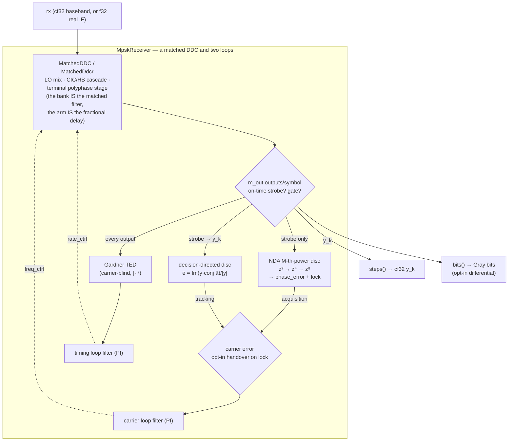

# MPSK Receiver

**Status:** implemented — `track.CarrierNda` (#276) + `track.MpskReceiver`
shipped; the NDA carrier loop's discriminator normalized by its own `|z|^M`,
retiring the AGC that existed to make `|z| = 1` true (§2.3); **the receiver's engine rebuilt on the matched DDC cascade (§1.1)**, and
a real-input twin `track.MpskReceiverR` added alongside it.
**Scope:** a streaming **M-PSK receiver** (`track.MpskReceiver` for complex
baseband, `track.MpskReceiverR` for a real IF, M = BPSK / QPSK / 8PSK) that
demodulates pulse-shaped signals by **composing existing `doppler.track` and
`doppler.resample` primitives**. C-first: every block below is a C core; the
Python face is the jm-generated thin wrapper. This is the architecture, the
carrier-recovery design (the part most easily miscommunicated), and the record
of how the engine changed.

Related: [carrier loop theory](../gallery/carrier-mpsk.md) (the decision-directed
`CarrierMpsk` loop, already shipped), [RateSync](../gallery/ratesync.md) (whose
timing loop this receiver now literally reuses), the
[matched rate converter](../gallery/rate-converter.md), the async DSSS
despreader ([design](async-symbol-despreader.md)) — DSSS-MPSK is the pipeline
`Dll(segments) → MpskReceiver`, not a fused object.

______________________________________________________________________

## 1. Architecture — composition, not machinery

The receiver owns **no filter, no NCO and no interpolator of its own**. It is a
matched down-converter with two loops closed around its two control ports:


```mermaid
flowchart TB
    IN["rx (cf32 baseband, or f32 real IF)"]
    subgraph RX["MpskReceiver — a matched DDC and two loops"]
        direction TB
        FE["MatchedDDC / MatchedDdcr<br/>LO mix · CIC/HB cascade ·<br/>terminal polyphase stage<br/>(the bank IS the matched filter,<br/>the arm IS the fractional delay)"]
        STROBE{"m_out outputs/symbol<br/>on-time strobe? gate?"}
        TED["Gardner TED<br/>(carrier-blind, |·|²)"]
        NDA["NDA M-th-power disc<br/>z² → z⁴ → z⁸<br/>→ phase_error + lock"]
        DD["decision-directed disc<br/>e = Im(y·conj â)/|y|"]
        SEL{"carrier error<br/>opt-in handover on lock"}
        TLF["timing loop filter (PI)"]
        CLF["carrier loop filter (PI)"]
        FE --> STROBE
        STROBE -->|"every output"| TED
        STROBE -->|"strobe only"| NDA
        STROBE -->|"strobe → y_k"| DD
        TED --> TLF
        NDA -->|"acquisition"| SEL
        DD -->|"tracking"| SEL
        SEL --> CLF
        TLF -.->|"rate_ctrl"| FE
        CLF -.->|"freq_ctrl"| FE
    end
    IN --> FE
    STROBE -->|"y_k"| OUT["steps() → cf32 y_k"]
    STROBE --> BITS["bits() → Gray bits<br/>(opt-in differential)"]
```

- **The matched filter is the cascade's terminal polyphase stage.** It is not a
    separate FIR: the bank the down-converter was already evaluating carries the
    pulse-matched taps, so the match costs the dot product it was doing anyway.
- **The interpolator is the bank arm.** Selecting arm `p` of `P` *is* the
    fractional symbol-timing delay, to `1/num_phases` of an output period. There
    is no Farrow and no second timing mechanism — see the "NCO alone controls
    timing" rule.
- **Two control ports, one per loop, and they are duals:** the timing loop
    steers the terminal accumulator (`rate_ctrl`), the carrier loop steers the LO
    phase accumulator (`freq_ctrl`).
- **The timing loop is `ratesync_loop_t` — literally
    [RateSync](../gallery/ratesync.md)'s loop**, factored out for reuse, not a
    copy of it. Timing is carrier-blind (Gardner `|·|²`), so it settles in
    parallel with carrier acquisition and can lead it.
- **`m_out` outputs per symbol** come out of the terminal stage. Gardner takes
    every `m_out`-th as the **on-time strobe** and the one `m_out/2` back as the
    transition gate, so the oversampled matched-filtered stream falls out free.
- **DSSS-MPSK** is still the downstream pipeline `Dll(segments) → MpskReceiver`;
    the despreader removes the PN code and hands symbols to this modem. Not fused.

### 1.1 Why the engine changed — and what it cost

The original build (§§3–5 below, kept as the record) put a dense matched-filter
FIR and a `symsync` Gardner+Farrow loop downstream of a per-sample wipe-off, with
a *separate* boxcar "arm" feeding the NDA discriminator. That works, but it pays
for the same samples several times and it does not scale in `sps`: a single-stage
matched filter at `sps = 256` needs ~4225 taps per arm.

Rebuilding on the matched DDC replaces all four pieces with one cascade:

| Was                               | Is now                                                              |
| --------------------------------- | ------------------------------------------------------------------- |
| per-sample integer-NCO wipe-off   | the DDC's LO, driven by `freq_ctrl`                                 |
| separate boxcar arm + its own AGC | the terminal stage's own outputs, and no AGC on the detector at all |
| dense matched-filter FIR          | the terminal polyphase stage's bank                                 |
| `symsync` Gardner + Farrow        | `ratesync_loop_t` on `rate_ctrl`, bank arms                         |

The payoff is that `sps` becomes a **double** and the front end plans itself: at
`sps = 8` the plan is a halfband or two plus a terminal stage; at `sps = 256` it
is a CIC in front of the *same* terminal stage. The matched filter costs ~34
taps/arm at both ends of a 64× span of input rates. An irrational `sps` — a
free-running ADC clock against the symbol clock — is no harder than an integer
one, because the terminal accumulator is a double and the loop only has to steer
the strobe.

!!! warning "This is a compatibility break, deliberately taken"

    **Outputs are no longer bit-identical to releases before the rebuild.** The
    matched filter became a polyphase bank instead of a dense FIR and the
    interpolator became a bank arm instead of a Farrow, so recovered symbols move
    at the float level. Detection performance is unchanged — the fused matched
    filter measures on the Es/N0 bound — but exact-output pins are not.

    **`bn_carrier` also changed units.** It is now normalised to the **symbol
    rate**, like `bn_timing`, rather than to the input sample rate. At the old
    default `sps = 8` the same number is now an 8× wider loop, and the usable
    range is correspondingly narrower: values around `0.005`–`0.01` are the
    working band where `0.02`–`0.03` used to be. A carrier loop here closes
    around the matched filter, so its dead time is that filter's group delay —
    keeping `bn_carrier` a small fraction of the symbol rate is what a real
    receiver does anyway, and the new normalisation makes that the natural
    reading of the number.

### 1.2 Two types, not one — and why

`MpskReceiver` takes complex baseband; `MpskReceiverR` takes a real IF. They are
**separate types rather than one type with a flavor**, by the same rule the
down-converters follow: a difference in *constructor* is a flavor (a jm view), a
difference in *method signature* is a separate type. `steps(x)` takes `cf32` on
one and `f32` on the other, so a shared view is not available — one class would
have to name the dtype in a method name.

Everything behind the front end is genuinely shared, not duplicated:
`mpsk_rx_loops_t` (both loops, both discriminators, the handover, the demapper)
is one implementation that both types embed. `MpskReceiverR` adds only the front
end (`MatchedDdcr` instead of `MatchedDDC`) and the two rate conversions its
halfband forces — its LO runs at the *intermediate* rate `fs/2`, and the R2C
halfband has an `fs/4` shift baked in, so tuning a real tone at input-normalised
`f_c` to DC is `norm_freq = -(2·f_c + 0.5)`, and a frequency readback at the
intermediate rate is **half** as many cycles/sample at the input rate. That also
sets its one extra constraint: `sps > 2·m_out`, because the cascade behind the
halfband runs at twice the overall rate.

______________________________________________________________________

## 2. Carrier recovery — the design that's easy to get wrong

The rule is **predetection de-rotation, postdetection discrimination**, with a
twist for cold start.

### 2.1 De-rotation is per-sample, always

The LO wipe-off runs on **every input sample, before anything else**. A residual
carrier rotating across an integration window costs sinc energy; the window here
is the matched filter (short for I&D ≈ `sps`, long for RRC ≈ `2·span·sps+1`), so
per-sample de-rotation is the general-purpose "just works" placement. It costs
more compute than de-rotating symbols, and that is the accepted trade — it is
correct for every mode (I&D, RRC, large residual, and the DSSS front-end)
without special-casing.

Since the rebuild this holds **structurally rather than by convention**: the LO
is the first stage of the front end, so predetection de-rotation is where the
signal path puts it, not something the receiver has to remember to do first.

!!! danger "The sign convention differs between the two sides"

    The DDC mixes `x · lo_step_ctrl(...)` while `carrier_nda_disc` consumes
    `x · conj(...)`. The loop therefore **negates** the filtered error before it
    reaches `freq_ctrl`. Get this wrong and the failure does not look like a sign
    error: timing, rate and symbol count all stay perfect, and the lock metric
    sits at a steady *negative* value (−0.48 for QPSK where +0.62 is real lock)
    with every symbol parked on a decision boundary. Read the lock metric's
    **sign**, not just its magnitude.

### 2.2 Two discriminators share one NCO + loop filter

A decision-directed loop alone cannot cold-start: it needs symbol decisions,
which need timing lock and (for the error to mean anything) data. Many real
links must **acquire the carrier with no symbol timing and no data present**
(e.g. a bare/unmodulated carrier, or before timing settles). So the carrier loop
has **two error sources into one NCO**:

1. **Acquisition — non-data-aided (NDA) M-th-power discriminator** on the
    matched-filtered **on-time strobe**. It strips the M-PSK modulation by
    raising the strobe to the Mth power, so it is independent of *data*.

1. **Tracking — decision-directed** `e = Im(y·conj(â))/|y|` on the full-SNR
    recovered symbol `y_k` (the `CarrierMpsk` discriminator, already shipped and
    validated). Low jitter once timing + lock are established.

Both now run at the **symbol rate**, on the same strobe, which is why
`bn_carrier` is symbol-rate normalised (§1.1) and why the handover is a plain
discriminator swap with no rate change to reconcile.

!!! info "Carrier acquisition and symbol timing — the coupling, and the way out"

    The original design's headline property was that the NDA path acquires with
    no data **and no symbol timing** — true of the old free-running boxcar arm,
    which was timing-independent by construction. Reading the on-time strobe
    gave that up: until the timing loop converges the strobe is not a symbol, so
    its M-th power is nothing in particular.

    Measured, QPSK at `sps = 8` from a cold start: the timing loop takes ~130
    symbols to declare, and throughout that window the carrier lock statistic
    reads **0.9 → 1.7 against a QPSK ceiling of 0.62** — the unambiguous sign
    that the discriminator's input is not a valid constellation. A type-2 loop
    steering on that integrates a bias for 130 symbols; whichever way it was
    pushed decided the run, and pushed past the M-fold boundary the integrator
    simply held it there. About a third of data seeds never recovered, and
    **widening `bn_carrier` made it worse** — more garbage integrated over the
    same fixed transient — which is how you can tell it was a transient problem
    and not a pull-in-range one.

    Two things were tried, and only one of them survives:

    - **The other taps do not have the problem at all.** `mf_all` and `lo_arm`
        (§2.2.1) are timing-independent by construction. This is the answer: the
        tap point is a declared, caller-visible choice, and a link whose carrier
        must acquire before its timing does should not be reading the strobe.

    - **Gating the strobe tap on timing lock — tried, measured, removed.** The
        steer, the AGC seed and the handover were gated on the timing loop's own
        `lockdet` (which declares at a data-independent symbol 132). At the
        operating point that motivated it — `sps=8`, `m_out=4` — it worked:
        cold acquisition went from a coin flip to 6/6 seeds and the pull-in
        curve became monotone in `bn_carrier` again.

        It is no longer the default, for three reasons. Across a 24-cell sweep
        (sps × `m_out` × `bn_carrier`) removing it changed **exactly one cell**,
        `sps=8, m_out=4, bn_carrier=0.04`, which went to 5/24 — every other
        cell is identical gated or not. `m_out` now defaults to 8, so that cell
        is off the default path. And what the gate mainly bought was
        *measurability*: with the steer frozen until timing declares, the
        carrier transient starts at a known instant, which is convenient for
        instrumenting an acquisition and is not a property of a working
        receiver.

        The deeper objection is structural. A tap that needs timing it cannot
        wait for is a reason to choose a different tap; resolving that inside
        the receiver hid a real trade behind a coupling the caller could
        neither see nor override, and made the default receiver's cold-start
        behaviour depend on a second loop's lock detector. If cold acquisition
        fails at `m_out=4`, reach for `nda_tap="mf_all"` or `"lo_arm"`.

    The AGC seed mattered as much as the steer, back when this loop had an AGC
    of its own: seeded off a pre-lock strobe the gain latched on a non-symbol
    and could land far too **low** as easily as too high — measured `lock` =
    4.9e-19, a denormal, on a receiver decoding every bit correctly, so the
    handover never fired. The discriminator normalizes by its own `|z|^M` now
    and has no AGC to mis-seed (§2.3); the front-end cascade's AGC seeds
    against the signal, not a strobe.

### 2.2.1 `nda_tap` — the discriminator's tap point IS the pull-in range

An M-th-power discriminator updating at rate `F` is unambiguous only while its
M-th-power phase advances less than π per update, `|M·Δf| < F/2`. So *where* the
discriminator reads decides how much frequency error it can even see, and that
is a real design axis rather than an implementation detail — which is why it is
a construction parameter, `nda_tap`, and not a hidden policy.

| `nda_tap`          | Reads                                  | Update rate | Unambiguous `\|Δf\|` | Needs timing? |
| ------------------ | -------------------------------------- | ----------- | -------------------- | ------------- |
| `strobe` (default) | the on-time strobe                     | `Rs`        | `Rs/(2M)`            | **yes**       |
| `mf_all`           | every terminal output                  | `m_out·Rs`  | `m_out·Rs/(2M)`      | no            |
| `lo_arm`           | post-LO, through a free-running boxcar | LO rate     | `f_lo/(2M)`          | no            |

Measured, QPSK at `sps = 8` — the largest unaided frequency error each tap can
still acquire, at its own best `bn_carrier`. `m_out` is on this axis, so the
default's move from 4 to 8 (§4, the coherent-bound default) moves two of the
three numbers:

| tap      | `m_out = 4` | `m_out = 8` (default) |
| -------- | ----------- | --------------------- |
| `strobe` | `0.010·Rs`  | **`0.050·Rs`**        |
| `mf_all` | `0.015·Rs`  | `0.033·Rs`            |
| `lo_arm` | `0.090·Rs`  | `0.090·Rs`            |

`lo_arm` is the one number `m_out` cannot move, and that is the check on the
mechanism rather than a curiosity: it taps *ahead* of the cascade, so the
terminal rate is not in its path at all. At `m_out = 4` it is **9× the
strobe**, near the `sps` factor the theory predicts (`fs/Rs = 8` here) — that
tap reaches its own Nyquist bound rather than stalling at whatever the loop
bandwidth allows. At `m_out = 8` the strobe closes most of that gap *without
its update rate changing at all*: a sharper matched filter is a quieter
discriminator, which is what raises the largest stable `bn_carrier` (0.01 →
0.05), and an unaided strobe's pull-in follows the loop bandwidth, not its
Nyquist bound. It is the same coupling from the other side — the reason a
too-wide `bn_carrier` used to *lose* acquisitions (gh#536).

!!! note "`bn_carrier` means the same thing at every tap"

    It stays normalised to the **symbol rate**, so one setting is one loop. What
    the tap changes is the filter's *update period*; that does not widen the loop
    by itself, it widens what the discriminator can see and improves the
    stability margin — which is what then lets you raise `bn_carrier` on purpose.
    At a *fixed* `bn_carrier` all three taps measure the same `0.01·Rs`, exactly
    as they should. The table above is "each at its own best `bn`".

!!! warning "`mf_all` needs `m_out = 8`; the gain collapse lands on it, not on `lo_arm`"

    §2.3's `Σ g_k^M` gain-collapse result — the raw M-th-power coherent gain over a
    set of taps, made fatal by M = 8 — applies to the tap that sums the M-th power
    over **all `m_out` matched-filter outputs**, badly-timed ones included. Measured
    at Es/N0 20 dB, `sps = 8`, `bn_carrier = 0.005`, median over 5 seeds, both with
    and without `acq_to_track`:

    | tap      | `m_out = 8` (default), M ∈ {2,4,8} | `m_out = 4`, QPSK | `m_out = 4`, 8PSK       |
    | -------- | ---------------------------------- | ----------------- | ----------------------- |
    | `strobe` | SER 0, EVM −19.7 dB                | SER 0, −15.9 dB   | SER 0.002, −15.9 dB     |
    | `mf_all` | SER 0, EVM −19.7 dB                | SER 0, −16.0 dB   | **SER 0.851, −11.9 dB** |
    | `lo_arm` | SER 0, EVM −19.7 dB                | SER 0, −16.0 dB   | SER 0.001, −16.0 dB     |

    **At the default `m_out = 8` every tap decodes every order cleanly**, so the
    warning is conditional on `m_out`, not on the tap alone. At `m_out = 4` the arms
    cover half as much of each symbol, and at 8th power that is enough to put
    `mf_all` at chance. `lo_arm` shows no failure at any setting measured here.

    `mf_all`/8PSK at `m_out = 4` used to fail *while reporting a healthy lock*
    (+0.94, and +3.90 at `bn_carrier = 0.05`) — a false lock. Since the lock
    statistic was limited it reports **−0.069** on the same failure, i.e. it now
    correctly says "not locked" on a receiver that is not decoding, and the two
    downstream consequences went with it: `mf_all` + `acq_to_track` at *QPSK*
    recovered from 2/5 decodes (SER 0.295) to **5/5** (SER 0.0000), because the
    handover no longer fires off a bogus statistic; and the `bn_carrier = 0.05`
    failures read +0.175 / +0.045 instead of +3.90. The decode failure itself is
    unchanged — that is the `Σ g_k^M` collapse, not a detector problem.

    `lo_arm` + `acq_to_track` costs EVM without costing SER (−19.7 → −15.4 dB at
    `m_out = 8`), which is the decision-directed error running on a
    non-matched-filtered arm.

    **Correction.** This box named `lo_arm` as the failing tap until 2026-07-27. Its
    numbers came from a lag search clipped to ±30 and an SER window that started
    inside the settling transient — the two defects fixed in `30c76c6d`; both report
    chance SER on a decode that is in fact error-free.

!!! danger "Stable false lock at `Δf = k·Rs/M`, whatever the tap"

    `Rs/M` is exactly where a symbol-rate M-th power aliases onto zero, so the
    **M-fold ambiguity is a frequency ambiguity as well as a phase one**.
    Measured on QPSK at `sps = 8` with an initial error of `Rs/4`: the loop never
    moves, ending precisely where it started (tracked frequency 2e-6 against a true
    0.03125), and reports a lock statistic of **+0.83** against the ≈ 1.0 a real
    lock reads.

    Nothing self-referenced detects this. The constellation is stationary, so a
    self-referenced EVM looks clean and blind M2M4 looks clean; the lock metric
    looks healthy. It takes an **external** frequency reference, or a sync word /
    known preamble. A faster tap moves the alias out proportionally (`F/M`, not
    `Rs/M`), which is another reason the wide taps are worth having.

If you need more range than any tap gives, the answer is a **coarse frequency
estimate ahead of the loop** — an FFT sweep, or the `ppe` 2-D rate×freq
estimator — handed in via `init_norm_freq`. That is what the parameter is for,
and no loop bandwidth substitutes for it.

### 2.3 The NDA discriminator + lock signal (canonical definition)

The M-th-power detector is computed efficiently by **repeated complex squaring**
of the arm sample `z = i + jq`: `z²` strips BPSK, `z⁴` strips QPSK, `z⁸` strips
8PSK. Each squaring level yields both a phase error and a lock signal; the
phase-error scale normalizes the discriminator gain so one `bn` behaves
identically across M, and the lock signal is left **unscaled** so that it reads
~1.0 at lock for every M -- which is what actually makes the handover threshold
M-independent.

**Normalization — the detector divides out its own amplitude law.** Both
outputs are normalized by `|z|^M`: the lock signal has always been
`Re((z/|z|)^M)`, and the phase error is now `Im((z/|z|)^M)` to match. This is
the same rule the timing detector follows — a TED normalizes by its own slope
(`symsync_ted_slope()`) — applied to its sibling. A discriminator's raw output
is the phase error multiplied by things it did not choose, and amplitude is the
largest of them: `Im(z^M)` scales as `A^M`, so a 2× level error is 4× loop gain
at BPSK and **256×** at 8PSK. `|z|^M` is a power of `p = |z|^2` for every
supported `M`, so dividing it out costs one divide and no `sqrt`.

**This is why the receiver has exactly one AGC.** There used to be a second,
embedded ahead of this discriminator, whose entire job was to make `|z| = 1`
true so that the raw form would behave. With the detector normalizing itself
that condition no longer has to be manufactured, and the receiver's one AGC —
in the front-end cascade — serves the *signal path* instead of a detector. Two
level loops in series, each correcting the other's excursions, is what having
one per detector gets you. At `|z| = 1` the two forms are identical, so the
S-curve slope, and with it the meaning of `bn`, is unchanged from before.

!!! note "The classic objection, and where it actually applies"

    A per-sample magnitude normalization is Yuen's "polarity-type" hard
    limiter, and the textbook result is that it costs 2.5–4 dB of extra
    squaring loss over the linear-arm form. That result is real, and it is
    **below this receiver's operating point**. Measured directly on the two
    detectors fed identical unit-average-power samples — loop SNR
    (`slope² / var(e)` at lock, 4×10⁵ samples per point), normalized minus raw:

    | Es/N0 |   M=2 |       M=4 |       M=8 |
    | ----: | ----: | --------: | --------: |
    |  0 dB | −0.63 |     −2.08 |     −2.17 |
    |  3 dB | −0.37 |     +0.16 |     −4.70 |
    |  6 dB | −0.04 | **+1.35** |     +0.88 |
    | 10 dB | +0.04 | **+1.22** | **+3.47** |
    | 15 dB | −0.00 |     +0.51 | **+2.52** |
    | 20 dB | −0.00 |     +0.16 |     +1.03 |

    The penalty exists, at 0–3 dB Es/N0 — where 8PSK's loop SNR is −20 dB and
    the link cannot be closed regardless. From ~6 dB up, which includes every
    SER=1e-3 anchor, normalizing is equal or **better**, and the advantage
    grows with `M`. The reason is the same one that used to justify a 10 dB
    square clip on the AGC output: constructive-ISI peaks dominate the `|z|^M`
    weighting, and the clip bounded them approximately. Normalizing removes
    them exactly, and the clip goes with the AGC that carried it.

    Input scaling is no longer a precondition of this detector at all. The
    front-end AGC still levels the signal path, because the **timing** detector
    needs unit symbol amplitude for its construct-time slope to mean what it
    says.

```python
# osr = sample_rate // symbol_rate   # input oversampling, typ. 4
# The arm is a free-running half-symbol boxcar moving average (no rate
# conversion); i, q are its per-sample outputs (one per input sample),
# AGC-normalized to unit average power.  esno = symbol energy-to-noise-density
# ratio, dB.
#
# Squaring loss S_L (Lindsey-Simon / Yuen): the SNR penalty of the M-th-power
# nonlinearity; S_L <= 1 always, so sq_loss_dB <= 0.  Measured from the loop it
# is  slope**2 / var(phase_error) / rd  using the ACTUAL S-curve slope at lock
# (= 2 only for a constant-modulus arm; it collapses on a pulse-shaped arm,
# see below) — NOT a hardcoded 4.

import numpy as np

mod = "BPSK"                       # one of "BPSK", "QPSK", "8PSK"
esno = 10.0                        # symbol Es/No, dB
i = np.array([0.71, -0.62, 0.80])  # example half-symbol boxcar arm outputs
q = np.array([0.10, -0.21, 0.05])  # (unit-power, one pair per input sample)

rd = 10 ** (esno / 10.0)

bpsk_lock = i**2 - q**2          # Re(z^2)
bpsk_phase_error = 2 * i * q     # Im(z^2)

if mod == "BPSK":
    phase_error = bpsk_phase_error
    lock_signal = bpsk_lock                                           # Re(z^2)
    # Yuen Eq. 8-19 (passive arm-filter Costas loop), half-symbol boxcar arm.
    # Verified moments: K2 = 5/6, K4 = 23/30, KL = 2/3, Bi/R = 2 (z = Bi/R/2 = 1).
    K2, K4, KL, z = 5 / 6, 23 / 30, 2 / 3, 1
    S_L = K2**2 / (K4 + KL * z / rd)   # high-SNR floor K2**2 / K4 = 0.906 = -0.43 dB
    sq_loss_dB = 10 * np.log10(S_L)
elif mod == "QPSK":
    phase_error = bpsk_phase_error * bpsk_lock                        # ~ Im(z^4)
    lock_signal = bpsk_lock**2 - bpsk_phase_error**2                  # ~ Re(z^4)
    # No clean closed form for the M-th-power passive loop; empirical fit (dB).
    sq_loss_dB = -0.0564724 * esno**2 + 1.90284531 * esno - 15.65792221
else:  # 8PSK
    qpsk_phase_error = bpsk_phase_error * bpsk_lock
    qpsk_lock = bpsk_lock**2 - bpsk_phase_error**2
    phase_error = qpsk_phase_error * qpsk_lock                        # ~ Im(z^8)
    # The 4 is load-bearing: qpsk_phase_error is HALF of Im(z^4), so squaring it
    # needs the 2 squared back for this to be Re(z^8). Without it the statistic
    # is Re(z^4)**2 - Im(z^4)**2/4 -- equal to Re(z^8) at phi=0 and nowhere else,
    # and biased positive on noise where Re(z^8) is zero-mean.
    # NB the shipped lock signal LIMITS first (divides by |z|^M) so its H0
    # variance is 1/2 at every M; see "the lock statistic" below. Only the
    # phase error keeps the raw |z|^M weighting.
    lock_signal = qpsk_lock**2 - 4 * qpsk_phase_error**2              # Re(z^8)
    sq_loss_dB = -0.14285557 * esno**2 + 5.70706958 * esno - 58.13670891

# Coherent (data x squaring) gain of the free-running half-symbol boxcar arm:
#   Re E[z_d^M] = 1/2 + 1/(M+1)   ->  M=2: 5/6,  M=4: 7/10,  M=8: 11/18.
# For BPSK this is exactly K2 = 5/6;  mod_loss_dB = 10 * log10(1 / K2).
mod_loss_dB = 10 * np.log10(1 / (5 / 6))
```

- `phase_error` ≈ `Im(z^M)` (scaled) — a sawtooth S-curve of period `2π/M`, the
    M-fold phase ambiguity (consistent with the `CarrierMpsk` S-curve). It steers
    the NCO; the M-fold ambiguity is resolved downstream (differential demap or a
    sync word), same as the decision-directed loop.
- `lock_signal` = `Re((z/|z|)^M)` — the M-th power of a **limited** sample: ≈ 1
    when phase-locked, zero-mean with no carrier, bounded in ±1, and with an H0
    variance of ½ at **every** M. It is **the lock metric that drives handover**
    and the receiver's carrier lock indicator; that M-independence is what makes
    one threshold one Pfa (see "Limiting" below).

The squaring-loss/noise behaviour worsens with M (each squaring multiplies
noise), so the NDA loop is the *acquisition* aid; decision-directed tracking
gives the low-jitter steady state.

**Gain collapse on a pulse-shaped arm — the loop still locks.** The raw
M-th-power coherent gain is `Σ_k g_k^M` over the arm/pulse taps `g`. For a
constant-modulus arm this yields the S-curve slope 2; for a pulse-shaped (e.g.
pre-matched-filter RRC) arm `Σ g_k⁴` is minuscule and the slope collapses ~80×.
Because the loop filter is **type-2 (PI)**, the steady-state frequency error is
still driven to zero — the loop **locks on RRC as well as constant-modulus**
(`native/validation/carrier_nda_step_response.c` validates both) — only pull-in
is slower and jitter higher. The pulse-shaped *symbol* error rate is then set by
the downstream matched filter + timing, not by the carrier loop.

#### Derivation — the recursion *is* the M-th-power loop

Write the arm sample `z = i + jq`. The first level is literally `z²`:

```
bpsk_lock        = i² − q² = Re(z²)
bpsk_phase_error = 2iq     = Im(z²)
```

Each subsequent level squares the running pair and reads off its real/imaginary
parts, so `(lock, phase_error)` climbs the powers `z² → z⁴ → z⁸`. Verified
exactly (residual 0 over a full phase sweep):

| M   | `phase_error` | `lock_signal` (before limiting) |
| --- | ------------- | ------------------------------- |
| 2   | `Im(z²)`      | `Re(z²)`                        |
| 4   | `½·Im(z⁴)`    | `Re(z⁴)`                        |
| 8   | `¼·Im(z⁸)`    | `Re(z⁴)² − 4·(½·Im(z⁴))²`       |

So **`phase_error` is exactly the M-th-power discriminator** `Im(z^M)`, scaled by
`1, ½, ¼`. That scale is not arbitrary — it **normalizes the phase-detector gain
across M**. The S-curve slope at lock is `(slope of Im(z^M)) × scale = M × scale = 2·1, 4·½, 8·¼ = 2` for every M, so one loop-filter `bn` behaves identically for
BPSK / QPSK / 8PSK. (This is why the recursion carries `ab = Im(z⁴)/2` rather
than the full `2ab` into the next squaring.)

The **`lock_signal` is `Re(z^M)` at every M**, and the recursion's ½ has to be
undone to get there. Because the carried imaginary term is `qe = ½·Im(z⁴)`, the
8th-power real part is `Re(z⁸) = Re(z⁴)² − Im(z⁴)² = ql² − (2·qe)²`, so the lock
expression needs the **factor of 4** written out explicitly.

!!! bug "This was wrong until 2026-07-27, and the reasoning that kept it wrong"

    The lock signal read `ql² − qe²` — i.e. `Re(z⁴)² − ¼·Im(z⁴)²` — and this
    section argued the shortfall was an acceptable trade: *"the two coincide at
    lock, so it remains a faithful monotone lock detector; making it exact would
    require doubling the carried imaginary term, which would break the
    constant-gain property."*

    The premise is false. Making it exact requires multiplying by 4 **inside the
    lock expression**, which does not touch the carried term and so cannot affect
    the phase-detector gain at all. The two quantities are computed on separate
    lines from the same pair; there was never a trade to make.

    And "coincides at lock" was the wrong test. Both forms are exactly +1.0000 at
    `φ = 0`, so every locked measurement agreed and the error was invisible where
    anyone looked. It differed everywhere *else* — including on noise, where
    `Re(z⁸)` is zero-mean but `Re(z⁴)² − ¼·Im(z⁴)²` is not, since
    `E[Re(z⁴)²] = E[Im(z⁴)²]` leaves a positive residual of `¾·E[Im(z⁴)²]`.
    Measured on unit-power complex Gaussian noise: mean **+8.94** instead of
    **−0.11**. A lock detector is thresholded against its noise-only
    distribution, so the one region the form was wrong in was the only region
    that sets its false-alarm rate. `carrier_nda_scurve.c` had encoded the
    conclusion as `if (m <= 4)` around its `|lk − Re(z^M)| < 1e-6` check, so the
    validator was excused from the one order that was broken.

#### Limiting — what makes the threshold a Pfa

`Re(z^M)` on a raw sample is unbounded and its noise variance grows with M: at
M = 8, `|z|⁸` on Gaussian noise gives it an sd of **137 per look** against a
value of 1.0 at lock. The shipped lock signal therefore **limits first**:

```text
lock_signal = Re((z / |z|)^M)
```

Under H0 the phase is uniform, so `Var[Re(e^{jMθ})] = ½` for **every** M — the
statistic is bounded in ±1 and its H0 law is M-independent, which is precisely
what lets a single `lock_thresh` mean a single false-alarm probability at every
constellation order. With `α = det_ema_alpha(0, 15.9) = 0.05` (`N_eff = 39`
looks), `σ_H0 = sqrt(½·α/(2−α)) = 0.1132` analytically and 0.1132 measured, so
the default threshold of 0.5 is 4.42 σ — a per-look Pfa of 5e-6. Measured
end to end with `acq_to_track=1`, 100 noise-only runs × 20 000 symbols:
**0/100 false declares at every M**.

This costs H1 — limiting discards the `|z|^M` weighting that helps at low SNR —
and is still a large net win at every order, because H0's variance falls by much
more than H1's mean does. Detectability `d' = (μ_H1 − μ_H0)/σ_H0` at
Es/N0 = 10 / 20 dB, raw → limited: BPSK 5.70/6.21 → 7.95/8.75, QPSK
1.50/1.78 → 5.81/8.47, 8PSK 0.02/0.04 → 1.76/7.52. With the raw form only BPSK
ever cleared a 1e-3 Pfa, so for M ≥ 4 there was no Pfa-derived threshold
available at all.

**Both** paths are now normalized by `|z|^M` — the phase error as well as the
lock statistic. The older reasoning here was that the phase error should keep
its raw `|z|^M` weighting as "the natural matched weighting on a pulse-shaped
signal", and measurement does not support it: that weighting is dominated by
constructive-ISI peaks, and removing it is worth +1.2 dB of loop SNR at QPSK
and +3.5 dB at 8PSK at 10 dB Es/N0. See §2.3 for the full sweep, including the
low-Es/N0 regime where the old form does win.

### 2.4 Opt-in auto-handover

Handover from the NDA acquisition discriminator to the decision-directed tracker
is **opt-in** (a config flag, default off → the loop stays in NDA acquisition
mode unless enabled). When enabled, it is **automatic on lock**: once
`lock_signal` holds above a threshold (timing also settled), the loop switches
the NCO's error source from the NDA discriminator to the decision-directed
`Im(y·conj(â))/|y|`. The shared NCO + loop filter state carries across the
switch (no frequency/phase discontinuity); only the error source changes.

______________________________________________________________________

## 3. The new NDA carrier-loop primitive (reusable)

The NDA M-th-power carrier loop is a **standalone reusable C primitive** (not
buried in the receiver) — a complete non-data-aided carrier-recovery loop usable
on its own for any M-PSK / unmodulated carrier:

- **Owns** an integer `lo` NCO + a `loop_filter` (by value), the I/Q arm
    **boxcar moving average** (embedded `boxcar` primitive) + its **per-sample
    AGC** (embedded `agc` — now redundant, see the AGC note at the end of this
    section), and the M-th-power discriminator + lock signal.
- **Per sample:** wipe-off (inline `*_wipeoff`), slide the boxcar arm one sample,
    AGC-normalize, run the discriminator, filter, steer the NCO — **one update
    per input sample** (no dumping). Inline composition API (`*_wipeoff` /
    `*_arm_step`) mirrors `lo_step` / `dll_accumulate` / `symsync_step`.
- **Exposes** `norm_freq`, `lock_signal`/lock metric, `m`, `n` (boxcar window
    divisor: window = `sps/n`), loop `bn`/`zeta` — and its NCO so a composing
    receiver can drive the **same** NCO with a decision-directed error on handover.
- **Config:** `m` (2/4/8), `sps`, `n` (default 4), `bn`, `zeta`, seed
    `init_norm_freq`. All params default + keyword-capable (no forced positionals).

Working name **`track.CarrierNda`** (non-data-aided). Naming review: there are
now three carrier loops — `Costas` (BPSK decision-directed), `CarrierMpsk`
(M-PSK decision-directed), `CarrierNda` (M-PSK non-data-aided). This revives the
earlier `track.Carrier.*` namespace idea; deferred (the jm-owned `__init__.py`
makes a nested namespace a drift / `.so`-is-the-API concern) — flat names
for now.

**Since the rebuild, `MpskReceiver` no longer embeds `CarrierNda` as a whole.**
It cannot: `CarrierNda` owns an NCO and a boxcar arm, and the receiver's NCO is
now the DDC's LO and its "arm" is the cascade's own output. What the receiver
reuses is the part that matters and that must never fork — the **discriminator**
(`carrier_nda_disc`), whose lock signal is normalised by construction — it
reads ~1.0 at lock for every M, so a threshold means one thing everywhere.
`CarrierNda` remains a
first-class standalone object for anyone who wants the complete loop.

______________________________________________________________________

## 4. Matched filter (I&D default, RRC opt-in)

**As built, this is the cascade's terminal polyphase stage, not a separate FIR**
(§1.1) — but the two shapes and their meaning are unchanged:

- **I&D / boxcar (default):** the matched filter for a rectangular NRZ symbol
    pulse (and the natural front for a despread chip stream).
- **RRC (opt-in):** `rrc_taps(beta, sps, span)` — matched to an RRC-shaped
    transmitter.

!!! tip "Use `m_out >= 4` with `pulse="iandd"`"

    The rectangle is one symbol wide, so at `m_out = 2` its matched filter
    degenerates to a two-tap sum and the eye barely opens — measured lock
    statistic **−0.34 at `m_out = 2` against +0.95 at 4** on the same NRZ stream.
    The matched converter reports this itself: `narrow_pulse` is a real property
    and construction raises a `UserWarning`, rather than the condition being
    documented and left for the caller to rediscover.

> *Historical:* the original build used a per-sample `fir_step` on a dense
> matched-filter FIR owned by pointer. `fir_step` still exists and is still the
> right primitive for a per-sample FIR; this receiver no longer needs one.

> **AGC: no carrier path needs one; the timing path does.** The
> decision-directed *carrier tracking* path was always amplitude-invariant —
> the nearest-point slice and the `|y|`-normalized discriminator both ignore
> scale — and the *acquisition* path is now too, since `carrier_nda_disc()`
> normalizes both of its outputs by `|z|^M` (§2.3). `MpskReceiver` therefore
> carries exactly one AGC, in the front-end cascade, and it is there for the
> **timing** detector: a TED normalizes by its own slope, and that slope is
> computed for a unit-amplitude symbol stream.
>
> The standalone `CarrierNda` object still embeds its own arm AGC. It shares
> the now-normalized discriminator, so that AGC no longer has a detector to
> serve and is a candidate for removal on its own terms — filed separately
> rather than folded into a receiver change.
>
> **The timing detector is not amplitude-invariant either, and this paragraph
> used to claim the receiver needed no AGC on the strength of the carrier path
> alone.** A TED's slope carries the signal amplitude by construction —
> `A²` for Gardner, `A¹` for DTTL — and that was masked by a running power
> average inside the detector, which has since been removed for the reasons in
> §5.1. So the timing loop now states a **level contract** instead: symbols
> arrive at unit amplitude, which a unity-gain matched cascade preserves
> (`RateConverter_gain()`), and levelling them is an AGC's job upstream. Feed
> it something else and the loop is simply under-driven by `A²` — at an input
> amplitude of 0.25 that is 16×, which is exactly what the C tests, which
> carry no AGC, currently show.

______________________________________________________________________

## 5. Symbol timing

The receiver embeds **`ratesync_loop_t` — [RateSync](../gallery/ratesync.md)'s
timing loop itself**, factored out of `ratesync_state_t` so the cascade and the
loop are separable. That split was made bit-exact deliberately (`ratesync`'s
`take_output` touched zero cascade fields, so it moved unchanged), and it is what
keeps a single implementation of Gardner + the PI filter + the lock statistic
serving both objects. Timing stays modulation-agnostic (`|·|²`), so it settles in
parallel with carrier acquisition.

The strobe geometry is the terminal stage's: every `m_out`-th output is the
on-time strobe, and the one `m_out/2` back is the transition gate. **There is no
second timing mechanism** — the terminal accumulator alone controls timing, and
the polyphase arm is that phase's fractional read-out.

`SymbolSync`'s second selectable TED (`ted="dttl"`, a decision-directed sign-sign
DTTL) is likewise reachable here (`RATESYNC_TED_DTTL`), but the receiver stays
hardcoded to Gardner: DTTL's hard-decision device is only valid for
constellations with independent, rectangular I/Q boundaries (BPSK/QPSK), not the
8PSK this receiver also supports, so exposing it is a follow-up, not a drop-in
default.

### 5.1 The TED's only normalisation is its own slope

A timing detector's raw output is the timing error multiplied by three things
the detector did not choose:

| factor                                     | whose business            | how it is handled                      |
| ------------------------------------------ | ------------------------- | -------------------------------------- |
| signal amplitude                           | the **AGC**'s, upstream   | a level contract (§4), not an estimate |
| transition density                         | **nobody's** — it is data | left alone                             |
| the detector's own slope against the pulse | the **detector**'s        | computed at construction               |

Only the third belongs inside the TED, and it is the only one that can be
*computed* rather than estimated. The matched pair's composite is a raised
cosine in closed form (`wfm_rc_h()`), so for i.i.d. symbols the mean detector
output is a construct-time expression:

```text
Gardner:  S(tau) = sum_k g(tau-1/2-k) * [ g(tau-k) - g(tau-1-k) ]
DTTL:     S(tau) = g(tau-1/2) - g(tau+1/2)
```

`symsync_ted_slope()` evaluates `|dS/dtau|` at the lock point and the loop
stores its **reciprocal**, so the hot path is one multiply — a divide *and* a
running average per symbol both became construct-time work. Validated against
the slope measured open-loop through a real HB + matched cascade: Gardner
within 1.3–8.6% across roll-off 0.1…0.9 (worst at 0.1, where the ideal
composite diverges most from the truncated pulse), DTTL within **0.2%**. The
rectangle falls out at its analytic values, Gardner 1.4997 and DTTL 2.0000.

!!! danger "What this replaced was wrong in three separate ways"

    The shipped code divided by a 1%-per-symbol average of `|on|² + |mid|²`.

    **It is an `A²` quantity, and only one of the two detectors has an `A²`
    law.** Gardner's amplitude axis came out right; DTTL's loop gain was left
    proportional to `1/A` — a 4× swing over a 4× level change, in the detector
    BPSK and QPSK select.

    **It normalises the wrong term.** Amplitude is not the detector's
    contribution; its slope is. Measured through the cascade, the normalised
    slope varied **10.6×** between roll-off 0.1 and 0.9, so `bn = 0.01` meant
    something an order of magnitude different at the two ends of the supported
    range — silently, because nothing reads a loop bandwidth back.

    **Being an average, it lagged.** Seeded on the first post-prime strobe —
    which lands in the cascade's amplitude ramp, orders of magnitude below
    steady state — it ran the loop at thousands of times its designed gain
    through exactly the interval that decides acquisition. That wound the
    integrator past pull-in: on a fine sweep of initial timing offsets at
    `sps = 4`, a 0.3-symbol-wide band took **7000–25403 symbols** to recover.
    With the lag gone the same band acquires in **133–266** at every offset,
    and the peak normalised error falls from **38 to 0.13** — a detector whose
    own range is about ±1.

**`SymbolSync` keeps its own normaliser for now.** `symsync_create()` takes no
pulse, so it cannot compute a slope; `symsync_ted_slope()` is declared where
both detectors live, ready for it.

______________________________________________________________________

> *Historical:* the original build reused `track.SymbolSync` (Gardner + Farrow)
> as a whole, via an added by-value `symsync_init`. `SymbolSync` is unchanged and
> remains the standalone object; the receiver simply no longer interpolates with
> a Farrow.

______________________________________________________________________

## 6. Component reuse

**As built** (post-rebuild). Everything here is reused, not reimplemented:

| Piece                                                               | Verdict                                              |
| ------------------------------------------------------------------- | ---------------------------------------------------- |
| `MatchedDDC` / `MatchedDdcr`                                        | the whole front end — mix, decimate, match           |
| `RateConverter` terminal polyphase stage                            | matched filter **and** fractional delay, fused       |
| `ratesync_loop_t`                                                   | timing loop — RateSync's own, factored out for reuse |
| `carrier_nda_disc`                                                  | NDA acquisition math — shared with `CarrierNda` (§3) |
| `CarrierMpsk` decision-directed discriminator                       | tracking-path math — reuse the update                |
| `loop_filter` PI                                                    | every loop embeds it by value — as-is                |
| `lockdet`                                                           | verify-counted two-way handover gate — as-is         |
| `agc`                                                               | discriminator input normalisation (§2.3)             |
| `mpsk` slicer/demap (`mpsk_slice`, `mpsk_demap`, `mpsk_diff_demap`) | decision + bits + differential — as-is               |
| `mpsk_rx_loops_t`                                                   | **shared verbatim** by both receiver types (§1.2)    |
| `Dll(segments)`                                                     | optional DSSS front-end — pipeline, not fused        |

Retired from this receiver by the rebuild (all still first-class objects in their
own right): `lo` driven directly, `boxcar` as an NDA arm, `SymbolSync`'s
Gardner+Farrow loop, and a dense `fir` matched filter.

______________________________________________________________________

## 7. Build plan (sequential, each rock-solid first) — **complete**

Steps 1–3 shipped as written; step 4 is the rebuild this document now describes.

1. **`track.CarrierNda`** — the NDA M-th-power carrier loop primitive (§3).
    Validate: open-loop S-curve `phase_error(φ)` = the period-`2π/M` sawtooth per
    M; `lock_signal` vs phase/SNR; cold-start frequency pull-in on an *unmodulated*
    carrier and on modulated data with **no timing**; jitter vs bn. Gallery.
1. **`fir_step` + `symsync_init`** — the additive inline composition APIs (tiny,
    byte-identical to the block paths; their own parity tests).
1. **`track.MpskReceiver`** — the composition (§1). Validate end-to-end BER vs
    Es/N0 per M within ~1–2 dB of the MPSK bound, with a carrier offset + timing
    offset + pulse shaping; opt-in auto-handover engages and holds; I&D and RRC
    modes; reset-reproducible; block-size invariant (independent output per call,
    the gh-219 rule). DSSS-MPSK example chaining `Dll(segments) → MpskReceiver`.
    Gallery: constellation pull-in (cloud → M clusters), carrier + timing locks,
    BER table.

______________________________________________________________________

## 8. Resolved / open review points

- **NDA discriminator form** — *resolved.* Raw M-th-power via repeated squaring
    (§2.3) on an AGC-normalized arm, with the lock signal left UNSCALED so it
    reads ~1.0 at lock for every M. It used to carry a per-M `lock_scale` of
    1 / 0.619 / 0.412, which made the statistic's ceiling M-dependent and the
    default handover threshold of 0.5 **unreachable at 8PSK** (ceiling 0.412):
    `car.locked` could never be set on a perfectly working 8PSK receiver, and
    every call site that needed a meaningful threshold multiplied the scale
    back in by hand. Squaring-loss equations corrected and Yuen-grounded
    (§2.3).
- **Arm normalization** — *resolved.* Internal `agc_core` AGC (bandwidth locked
    to `0.01·bn`, decimated loop-filter command via `gain_update_period`) + 10 dB
    square clip, not a per-sample limiter (§2.3).
- **Naming** — `CarrierNda` / flat vs a `Carrier.*` namespace (deferred).
- **Handover threshold** — *resolved, shipped.* `mpsk_receiver_configure_lock()`
    exposes it as a real config call: a `lockdet_state_t handover` gate plus
    `MPSK_RX_HANDOVER_DOWN`/`N_UP`/`N_DOWN` debounce counters
    (`native/inc/mpsk_receiver/mpsk_receiver_core.h`), landed in the lock-detector
    consistency pass. `CarrierNda`/`MpskReceiver` also both expose telemetry
    probes (`.lock`/`.tracking`) from that same pass, not just this threshold.
- **`n` → `m_out`** — *resolved by the rebuild.* The old `n` sized a separate NDA
    arm (window = `sps/n`); there is no arm any more, so the parameter it was
    replaced by means something different: `m_out` is the terminal stage's
    **outputs per symbol** (even, 2–8, default 8). It sets the Gardner strobe/gate
    geometry and how much oversampled matched-filtered signal the caller gets, not
    a loop rate. See the `m_out >= 4` caveat for I&D in §4.
- **`bn_carrier` normalisation** — *changed by the rebuild.* Symbol-rate, not
    sample-rate (§1.1). This is the one silent break: old code keeps running and
    simply has a much wider carrier loop than it asks for.
- **Pulse-shaped (RRC) SER** — *resolved by the rebuild.* The matched filter is
    now the terminal bank itself, so the RRC path measures on the Es/N0 bound
    rather than carrying a residual matched-filter/timing loss.
- **Real-input support** — *resolved, shipped.* `track.MpskReceiverR` (§1.2), a
    separate type sharing every loop with the complex one.
- **Cold carrier pull-in on the strobe tap** — *open, by choice.* The
    strobe-only discriminator makes carrier acquisition quality depend on symbol
    timing, so on a cold start the loop integrates an invalid discriminator
    output through the timing transient; at `sps=8, m_out=4` that cost roughly a
    third of data seeds. Seeded operation is unaffected. Gating the steer on the
    timing loop's `lockdet` fixes that operating point and was implemented, then
    removed as a default — it changed one cell of a 24-cell sweep and mostly
    bought measurability (§2.2). The remedy is `nda_tap`: `mf_all` and `lo_arm`
    are timing-independent by construction. See §2.2 and
    [doppler-dsp/doppler#536](https://github.com/doppler-dsp/doppler/issues/536).
- **An above-ceiling lock statistic is a free diagnostic** — *retired,
    2026-07-27, by limiting the lock signal.* The idea was that `lock > 1` is
    impossible for a valid constellation, so it detects "discriminator input is
    garbage" (unsettled timing, or a gain fault) with no new computation. Limiting
    made `Re((z/|z|)^M)` amplitude-blind and hard-bounded in ±1, so the condition
    can no longer arise — the diagnostic is gone, deliberately, in exchange for a
    threshold that maps to a false-alarm probability at every M (§2.3). Worth
    knowing this was a real cost: a *future* AGC gain fault has to be caught from
    the AGC's own gain, not from this statistic.
- **DSSS re-measurement** — *open.* Both DSSS receivers sit downstream of this
    engine and have not been re-tuned for it. This is **not** a retune: the
    localisation says the DSSS fault is unrecovered carrier phase in the
    pre-despread Costas loop (clean amplitudes, scattered EVM, chance BER), which
    is that chain's own carrier loop, not this receiver's. Tracked as
    [doppler-dsp/doppler#535](https://github.com/doppler-dsp/doppler/issues/535).
    That localisation is only trustworthy because it was **not** made from a bit
    error rate alone: BER is truth-referenced and needs a lag search, so every
    measurement here pairs it with two truth-free validators — self-referenced EVM
    and blind M2M4 SNR (`native/tests/dp_sym_test.h`). Their *disagreement* is
    what carries the diagnosis: M2M4 uses only `|x|²`/`|x|⁴` moments and so is
    rotation-blind, meaning a healthy M2M4 beside a collapsed EVM says "the
    amplitudes are fine, the phase is not" — which no error rate could have told
    us.
