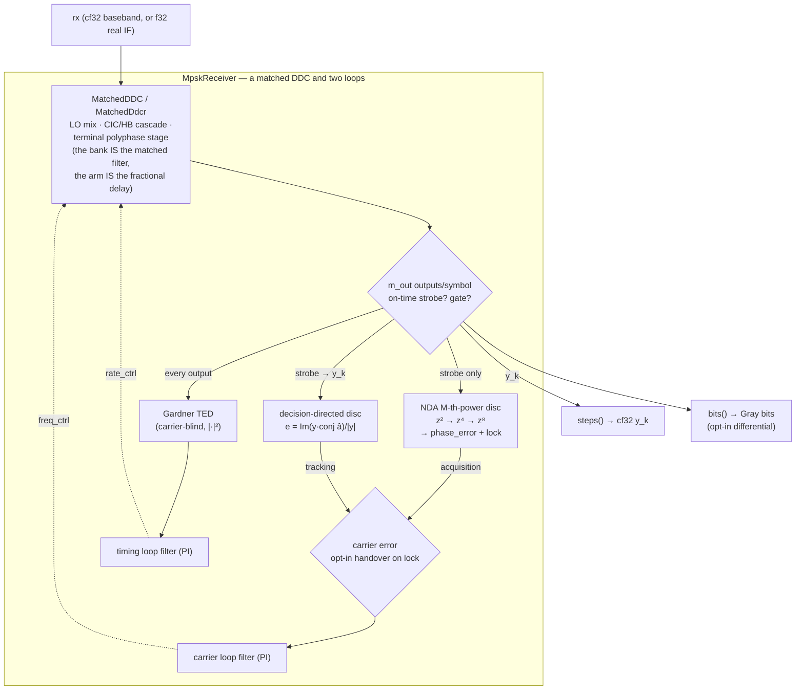

# MPSK Receiver

**Status:** implemented — `track.CarrierNda` (#276) + `track.MpskReceiver`
shipped; the NDA carrier loop reworked to a raw M-th-power discriminator + AGC
(§2.3); **the receiver's engine rebuilt on the matched DDC cascade (§1.1)**, and
a real-input twin `track.MpskReceiverR` added alongside it.
**Scope:** a streaming **M-PSK receiver** (`track.MpskReceiver` for complex
baseband, `track.MpskReceiverR` for a real IF, M = BPSK / QPSK / 8PSK) that
demodulates pulse-shaped signals by **composing existing `doppler.track` and
`doppler.resample` primitives**. C-first: every block below is a C core; the
Python face is the jm-generated thin wrapper. This is the architecture, the
carrier-recovery design (the part most easily miscommunicated), and the record
of how the engine changed.

Related: [carrier loop theory](../gallery/carrier-mpsk.md) (the decision-directed
`CarrierMpsk` loop, already shipped), [RateSync](../gallery/ratesync.md) (whose
timing loop this receiver now literally reuses), the
[matched rate converter](../gallery/rate-converter.md), the async DSSS
despreader ([design](async-symbol-despreader.md)) — DSSS-MPSK is the pipeline
`Dll(segments) → MpskReceiver`, not a fused object.

______________________________________________________________________

## 1. Architecture — composition, not machinery

The receiver owns **no filter, no NCO and no interpolator of its own**. It is a
matched down-converter with two loops closed around its two control ports:


```mermaid
flowchart TB
    IN["rx (cf32 baseband, or f32 real IF)"]
    subgraph RX["MpskReceiver — a matched DDC and two loops"]
        direction TB
        FE["MatchedDDC / MatchedDdcr<br/>LO mix · CIC/HB cascade ·<br/>terminal polyphase stage<br/>(the bank IS the matched filter,<br/>the arm IS the fractional delay)"]
        STROBE{"m_out outputs/symbol<br/>on-time strobe? gate?"}
        TED["Gardner TED<br/>(carrier-blind, |·|²)"]
        NDA["NDA M-th-power disc<br/>z² → z⁴ → z⁸<br/>→ phase_error + lock"]
        DD["decision-directed disc<br/>e = Im(y·conj â)/|y|"]
        SEL{"carrier error<br/>opt-in handover on lock"}
        TLF["timing loop filter (PI)"]
        CLF["carrier loop filter (PI)"]
        FE --> STROBE
        STROBE -->|"every output"| TED
        STROBE -->|"strobe only"| NDA
        STROBE -->|"strobe → y_k"| DD
        TED --> TLF
        NDA -->|"acquisition"| SEL
        DD -->|"tracking"| SEL
        SEL --> CLF
        TLF -.->|"rate_ctrl"| FE
        CLF -.->|"freq_ctrl"| FE
    end
    IN --> FE
    STROBE -->|"y_k"| OUT["steps() → cf32 y_k"]
    STROBE --> BITS["bits() → Gray bits<br/>(opt-in differential)"]
```

- **The matched filter is the cascade's terminal polyphase stage.** It is not a
    separate FIR: the bank the down-converter was already evaluating carries the
    pulse-matched taps, so the match costs the dot product it was doing anyway.
- **The interpolator is the bank arm.** Selecting arm `p` of `P` *is* the
    fractional symbol-timing delay, to `1/num_phases` of an output period. There
    is no Farrow and no second timing mechanism — see the "NCO alone controls
    timing" rule.
- **Two control ports, one per loop, and they are duals:** the timing loop
    steers the terminal accumulator (`rate_ctrl`), the carrier loop steers the LO
    phase accumulator (`freq_ctrl`).
- **The timing loop is `ratesync_loop_t` — literally
    [RateSync](../gallery/ratesync.md)'s loop**, factored out for reuse, not a
    copy of it. Timing is carrier-blind (Gardner `|·|²`), so it settles in
    parallel with carrier acquisition and can lead it.
- **`m_out` outputs per symbol** come out of the terminal stage. Gardner takes
    every `m_out`-th as the **on-time strobe** and the one `m_out/2` back as the
    transition gate, so the oversampled matched-filtered stream falls out free.
- **DSSS-MPSK** is still the downstream pipeline `Dll(segments) → MpskReceiver`;
    the despreader removes the PN code and hands symbols to this modem. Not fused.

### 1.1 Why the engine changed — and what it cost

The original build (§§3–5 below, kept as the record) put a dense matched-filter
FIR and a `symsync` Gardner+Farrow loop downstream of a per-sample wipe-off, with
a *separate* boxcar "arm" feeding the NDA discriminator. That works, but it pays
for the same samples several times and it does not scale in `sps`: a single-stage
matched filter at `sps = 256` needs ~4225 taps per arm.

Rebuilding on the matched DDC replaces all four pieces with one cascade:

| Was                               | Is now                                      |
| --------------------------------- | ------------------------------------------- |
| per-sample integer-NCO wipe-off   | the DDC's LO, driven by `freq_ctrl`         |
| separate boxcar arm + its own AGC | the terminal stage's own outputs            |
| dense matched-filter FIR          | the terminal polyphase stage's bank         |
| `symsync` Gardner + Farrow        | `ratesync_loop_t` on `rate_ctrl`, bank arms |

The payoff is that `sps` becomes a **double** and the front end plans itself: at
`sps = 8` the plan is a halfband or two plus a terminal stage; at `sps = 256` it
is a CIC in front of the *same* terminal stage. The matched filter costs ~34
taps/arm at both ends of a 64× span of input rates. An irrational `sps` — a
free-running ADC clock against the symbol clock — is no harder than an integer
one, because the terminal accumulator is a double and the loop only has to steer
the strobe.

!!! warning "This is a compatibility break, deliberately taken"

    **Outputs are no longer bit-identical to releases before the rebuild.** The
    matched filter became a polyphase bank instead of a dense FIR and the
    interpolator became a bank arm instead of a Farrow, so recovered symbols move
    at the float level. Detection performance is unchanged — the fused matched
    filter measures on the Es/N0 bound — but exact-output pins are not.

    **`bn_carrier` also changed units.** It is now normalised to the **symbol
    rate**, like `bn_timing`, rather than to the input sample rate. At the old
    default `sps = 8` the same number is now an 8× wider loop, and the usable
    range is correspondingly narrower: values around `0.005`–`0.01` are the
    working band where `0.02`–`0.03` used to be. A carrier loop here closes
    around the matched filter, so its dead time is that filter's group delay —
    keeping `bn_carrier` a small fraction of the symbol rate is what a real
    receiver does anyway, and the new normalisation makes that the natural
    reading of the number.

### 1.2 Two types, not one — and why

`MpskReceiver` takes complex baseband; `MpskReceiverR` takes a real IF. They are
**separate types rather than one type with a flavor**, by the same rule the
down-converters follow: a difference in *constructor* is a flavor (a jm view), a
difference in *method signature* is a separate type. `steps(x)` takes `cf32` on
one and `f32` on the other, so a shared view is not available — one class would
have to name the dtype in a method name.

Everything behind the front end is genuinely shared, not duplicated:
`mpsk_rx_loops_t` (both loops, both discriminators, the handover, the demapper)
is one implementation that both types embed. `MpskReceiverR` adds only the front
end (`MatchedDdcr` instead of `MatchedDDC`) and the two rate conversions its
halfband forces — its LO runs at the *intermediate* rate `fs/2`, and the R2C
halfband has an `fs/4` shift baked in, so tuning a real tone at input-normalised
`f_c` to DC is `norm_freq = -(2·f_c + 0.5)`, and a frequency readback at the
intermediate rate is **half** as many cycles/sample at the input rate. That also
sets its one extra constraint: `sps > 2·m_out`, because the cascade behind the
halfband runs at twice the overall rate.

______________________________________________________________________

## 2. Carrier recovery — the design that's easy to get wrong

The rule is **predetection de-rotation, postdetection discrimination**, with a
twist for cold start.

### 2.1 De-rotation is per-sample, always

The LO wipe-off runs on **every input sample, before anything else**. A residual
carrier rotating across an integration window costs sinc energy; the window here
is the matched filter (short for I&D ≈ `sps`, long for RRC ≈ `2·span·sps+1`), so
per-sample de-rotation is the general-purpose "just works" placement. It costs
more compute than de-rotating symbols, and that is the accepted trade — it is
correct for every mode (I&D, RRC, large residual, and the DSSS front-end)
without special-casing.

Since the rebuild this holds **structurally rather than by convention**: the LO
is the first stage of the front end, so predetection de-rotation is where the
signal path puts it, not something the receiver has to remember to do first.

!!! danger "The sign convention differs between the two sides"

    The DDC mixes `x · lo_step_ctrl(...)` while `carrier_nda_disc` consumes
    `x · conj(...)`. The loop therefore **negates** the filtered error before it
    reaches `freq_ctrl`. Get this wrong and the failure does not look like a sign
    error: timing, rate and symbol count all stay perfect, and the lock metric
    sits at a steady *negative* value (−0.48 for QPSK where +0.62 is real lock)
    with every symbol parked on a decision boundary. Read the lock metric's
    **sign**, not just its magnitude.

### 2.2 Two discriminators share one NCO + loop filter

A decision-directed loop alone cannot cold-start: it needs symbol decisions,
which need timing lock and (for the error to mean anything) data. Many real
links must **acquire the carrier with no symbol timing and no data present**
(e.g. a bare/unmodulated carrier, or before timing settles). So the carrier loop
has **two error sources into one NCO**:

1. **Acquisition — non-data-aided (NDA) M-th-power discriminator** on the
    matched-filtered **on-time strobe**. It strips the M-PSK modulation by
    raising the strobe to the Mth power, so it is independent of *data*.

1. **Tracking — decision-directed** `e = Im(y·conj(â))/|y|` on the full-SNR
    recovered symbol `y_k` (the `CarrierMpsk` discriminator, already shipped and
    validated). Low jitter once timing + lock are established.

Both now run at the **symbol rate**, on the same strobe, which is why
`bn_carrier` is symbol-rate normalised (§1.1) and why the handover is a plain
discriminator swap with no rate change to reconcile.

!!! bug "The rebuild made carrier acquisition depend on **timing** lock"

    The original design's headline property was that the NDA path acquires with no
    data **and no symbol timing** — true of the old free-running boxcar arm, which
    was timing-independent by construction. It is **not true of this receiver**.
    The discriminator runs on the on-time strobe, so until the timing loop has
    converged the strobe is not a symbol and its M-th power is not carrier phase.

    Measured, QPSK at `sps = 8` from a cold start (`init_norm_freq = 0`): the
    timing loop takes ~180–240 symbols to converge, and throughout that window the
    lock statistic reads **0.9 → 1.7 against a QPSK ceiling of 0.62** — the
    unambiguous sign that the discriminator's input is not a valid constellation.
    The carrier loop steers on that the whole time. Whether it survives is decided
    by which way the garbage happened to push it: pushed toward the truth it
    recovers, pushed the other way past the M-fold boundary the type-2 integrator
    holds it there and it walks away and never returns. Roughly a third of data
    seeds fail, and **widening `bn_carrier` makes it worse** — a wider loop
    integrates more garbage over the same fixed transient — which is how you can
    tell this is not a pull-in-range limit.

    The fix direction is to **gate the carrier steer on timing lock** (the timing
    loop already carries a `lockdet`), exactly as `tracking` gates the NDA/DD
    choice: the discriminator and lock EMA keep running, only the steer waits.
    Tracked as
    [doppler-dsp/doppler#536](https://github.com/doppler-dsp/doppler/issues/536).
    Until then, **seed `init_norm_freq`** — a seeded loop has nothing to integrate
    toward and simply holds through the transient, which is why the whole test
    suite (which seeds it) is green.

    This is the price of the strobe-only rule below, which was itself necessary.
    The two are in genuine tension and the resolution is the timing gate, not a
    retreat to a separate timing-independent arm.

### 2.2.1 The pull-in range collapsed by `sps` — and gained frequency aliases

Moving the discriminator from the sample rate to the symbol rate has a second,
independent consequence, and this one is **architectural rather than a bug**.

An M-th-power discriminator updating at rate `F` is unambiguous only while the
M-th-power phase advances less than π per update, `|M·Δf| < F/2`:

| Discriminator runs at                          | Unambiguous `\|Δf\|` | At `sps = 8`, QPSK |
| ---------------------------------------------- | -------------------- | ------------------ |
| sample rate `fs` — old free-running boxcar arm | `fs/(2M)`            | 0.125 cyc/sample   |
| symbol rate `Rs` — the on-time strobe          | `Rs/(2M)`            | 0.0156 cyc/sample  |

The ceiling therefore drops by a factor of **`sps`** — 8× at the default rate and
more at higher oversampling. **The pull-in range is now well below `Rs`, where
before it was larger than `Rs`.** Measured practical pull-in is tighter still,
about **0.01·`Rs`**, because an initial error must also survive the timing
transient above; fixing that gate should recover the gap up to `Rs/(2M)`, but
nothing recovers the factor of `sps` — that is inherent to discriminating at the
symbol rate.

!!! danger "Stable false lock at `Δf = k·Rs/M`, with a healthy lock statistic"

    `Rs/M` is exactly where the symbol-rate M-th power aliases onto zero, so the
    **M-fold ambiguity is no longer only a phase ambiguity — it is a frequency
    ambiguity with spacing `Rs/M`.** Measured on QPSK at `sps = 8` with an initial
    error of `Rs/4`: the loop never moves, ending precisely where it started, and
    reports a lock statistic of **+0.546** against the 0.62 ceiling.

    Nothing self-referenced detects this. The constellation is stationary, so a
    self-referenced EVM looks clean and blind M2M4 looks clean; the lock metric
    looks healthy. It takes an **external** frequency reference, or a sync
    word / known preamble, to tell `Δf = 0` from `Δf = k·Rs/M`.

If a wider acquisition range is needed, the answer is a **coarse frequency
estimate ahead of the loop** — an FFT sweep, or the existing `ppe` 2-D rate×freq
estimator — handed in via `init_norm_freq`, not a loop retune. That is what
`init_norm_freq` is for.

!!! warning "The discriminator runs on the strobe **only**"

    The terminal stage emits `m_out` outputs per symbol, and it is tempting to
    feed the discriminator every one of them — more updates, more averaging. It is
    wrong: a **non-strobe output straddles two symbols**, so its M-th power is
    intersymbol interference rather than carrier phase. The error is
    modulation-dependent and does not average out. Measured on 8PSK this alone
    held the receiver at chance (SER ≈ 0.85); restricting the discriminator to the
    on-time strobe fixed it outright, and also deleted the two-rate machinery that
    had existed only to reconcile a per-output carrier update with a per-symbol
    timing update.

!!! warning "The lock metric must keep running **while tracking**"

    Gating the whole discriminator on `!tracking` — an easy optimisation, since
    the NDA *steer* is unused once handed over — makes the lock EMA freeze at
    whatever it held at handover, so the drop-back path becomes unreachable and a
    receiver fed pure noise stays in `tracking` forever. The discriminator, the
    lock EMA and the lock detector run **always**; only the *steer* is gated.

### 2.3 The NDA discriminator + lock signal (canonical definition)

The M-th-power detector is computed efficiently by **repeated complex squaring**
of the arm sample `z = i + jq`: `z²` strips BPSK, `z⁴` strips QPSK, `z⁸` strips
8PSK. Each squaring level yields both a phase error and a lock signal; the
per-M `lock_scale` normalizes the discriminator/lock gain so the handover
threshold is M-independent.

**Normalization — an AGC, not a per-sample limiter.** The discriminator input
`z` is driven to unit average power by an embedded log-domain AGC (`agc_core`)
before the discriminator, with a 10 dB square clip on the AGC output. This is
deliberate. The discriminator is the **raw** M-th-power form `Im(z^M)` (the
"conventional Costas" / linear-arm form), which is optimal for a
constant-modulus signal — the DSSS target. A per-sample unit-magnitude
normalization `z/|z|` is Yuen's "polarity-type" hard limiter, the *worst*
nonlinearity (≈2.5–4 dB extra squaring loss, and non-monotone in SNR). The AGC
provides amplitude invariance (so the loop gain does not scale with input level)
*without* the limiter's penalty; the clip bounds the peak (constructive-ISI)
samples that would otherwise dominate the `|z|^M` weighting. **Input average
power is required to be at or below unity** — the normal convention for
captured/scaled baseband (and the DSSS despreader's known correlation gain).

!!! warning "Since the rebuild the AGC is seeded, and its bandwidth is absolute"

    Two things about this AGC changed with the engine, and both were real bugs
    before they were fixed:

    - **It is seeded from the first strobe.** The bank is unit-*energy*, so its
        output sits roughly `√(pulse_sps)` above the constellation the AGC expects.
        Left to converge from a cold gain, the loop ran 16× hot at QPSK and 256× at
        8PSK — the measured lock statistic reached 5.2 and 26.4 against ceilings of
        0.62 and 0.41, which is the fingerprint to recognise: **a lock metric above
        its per-M ceiling is a gain fault, not a good lock.**
    - **Its bandwidth is `MPSK_RX_AGC_BW = 0.002` outright**, not `0.01·bn`. The
        old proportional rule was a *per-sample* convention; on a discriminator now
        running at the symbol rate it spans thousands of symbols and never settles.

    The AGC still absorbs residual/slow variation only: a cold input >~10 dB above
    unity remains out of spec (clip on → false lock, clip off → `|z|^M` gain
    blow-up).

```python
# osr = sample_rate // symbol_rate   # input oversampling, typ. 4
# The arm is a free-running half-symbol boxcar moving average (no rate
# conversion); i, q are its per-sample outputs (one per input sample),
# AGC-normalized to unit average power.  esno = symbol energy-to-noise-density
# ratio, dB.
#
# Squaring loss S_L (Lindsey-Simon / Yuen): the SNR penalty of the M-th-power
# nonlinearity; S_L <= 1 always, so sq_loss_dB <= 0.  Measured from the loop it
# is  slope**2 / var(phase_error) / rd  using the ACTUAL S-curve slope at lock
# (= 2 only for a constant-modulus arm; it collapses on a pulse-shaped arm,
# see below) — NOT a hardcoded 4.

import numpy as np

mod = "BPSK"                       # one of "BPSK", "QPSK", "8PSK"
esno = 10.0                        # symbol Es/No, dB
i = np.array([0.71, -0.62, 0.80])  # example half-symbol boxcar arm outputs
q = np.array([0.10, -0.21, 0.05])  # (unit-power, one pair per input sample)

rd = 10 ** (esno / 10.0)

bpsk_lock = i**2 - q**2          # Re(z^2)
bpsk_phase_error = 2 * i * q     # Im(z^2)

if mod == "BPSK":
    lock_scale = 1
    phase_error = bpsk_phase_error
    lock_signal = lock_scale * bpsk_lock
    # Yuen Eq. 8-19 (passive arm-filter Costas loop), half-symbol boxcar arm.
    # Verified moments: K2 = 5/6, K4 = 23/30, KL = 2/3, Bi/R = 2 (z = Bi/R/2 = 1).
    K2, K4, KL, z = 5 / 6, 23 / 30, 2 / 3, 1
    S_L = K2**2 / (K4 + KL * z / rd)   # high-SNR floor K2**2 / K4 = 0.906 = -0.43 dB
    sq_loss_dB = 10 * np.log10(S_L)
elif mod == "QPSK":
    lock_scale = 0.619
    phase_error = bpsk_phase_error * bpsk_lock                        # ~ Im(z^4)
    lock_signal = lock_scale * (bpsk_lock**2 - bpsk_phase_error**2)   # ~ Re(z^4)
    # No clean closed form for the M-th-power passive loop; empirical fit (dB).
    sq_loss_dB = -0.0564724 * esno**2 + 1.90284531 * esno - 15.65792221
else:  # 8PSK
    lock_scale = 0.412
    qpsk_phase_error = bpsk_phase_error * bpsk_lock
    qpsk_lock = bpsk_lock**2 - bpsk_phase_error**2
    phase_error = qpsk_phase_error * qpsk_lock                        # ~ Im(z^8)
    lock_signal = lock_scale * (qpsk_lock**2 - qpsk_phase_error**2)   # ~ Re(z^8)
    sq_loss_dB = -0.14285557 * esno**2 + 5.70706958 * esno - 58.13670891

# Coherent (data x squaring) gain of the free-running half-symbol boxcar arm:
#   Re E[z_d^M] = 1/2 + 1/(M+1)   ->  M=2: 5/6,  M=4: 7/10,  M=8: 11/18.
# For BPSK this is exactly K2 = 5/6;  mod_loss_dB = 10 * log10(1 / K2).
mod_loss_dB = 10 * np.log10(1 / (5 / 6))
```

- `phase_error` ≈ `Im(z^M)` (scaled) — a sawtooth S-curve of period `2π/M`, the
    M-fold phase ambiguity (consistent with the `CarrierMpsk` S-curve). It steers
    the NCO; the M-fold ambiguity is resolved downstream (differential demap or a
    sync word), same as the decision-directed loop.
- `lock_signal` ≈ `Re(z^M)` (scaled) — large and positive when phase-locked,
    ~0 with no carrier. It is **the lock metric that drives handover** and is the
    receiver's carrier lock indicator.

The squaring-loss/noise behaviour worsens with M (each squaring multiplies
noise), so the NDA loop is the *acquisition* aid; decision-directed tracking
gives the low-jitter steady state.

**Gain collapse on a pulse-shaped arm — the loop still locks.** The raw
M-th-power coherent gain is `Σ_k g_k^M` over the arm/pulse taps `g`. For a
constant-modulus arm this yields the S-curve slope 2; for a pulse-shaped (e.g.
pre-matched-filter RRC) arm `Σ g_k⁴` is minuscule and the slope collapses ~80×.
Because the loop filter is **type-2 (PI)**, the steady-state frequency error is
still driven to zero — the loop **locks on RRC as well as constant-modulus**
(`native/validation/carrier_nda_step_response.c` validates both) — only pull-in
is slower and jitter higher. The pulse-shaped *symbol* error rate is then set by
the downstream matched filter + timing, not by the carrier loop.

#### Derivation — the recursion *is* the M-th-power loop

Write the arm sample `z = i + jq`. The first level is literally `z²`:

```
bpsk_lock        = i² − q² = Re(z²)
bpsk_phase_error = 2iq     = Im(z²)
```

Each subsequent level squares the running pair and reads off its real/imaginary
parts, so `(lock, phase_error)` climbs the powers `z² → z⁴ → z⁸`. Verified
exactly (residual 0 over a full phase sweep):

| M   | `phase_error` | `lock_signal`                 |
| --- | ------------- | ----------------------------- |
| 2   | `Im(z²)`      | `Re(z²)`                      |
| 4   | `½·Im(z⁴)`    | `0.619·Re(z⁴)`                |
| 8   | `¼·Im(z⁸)`    | `0.412·(Re(z⁴)² − ¼·Im(z⁴)²)` |

So **`phase_error` is exactly the M-th-power discriminator** `Im(z^M)`, scaled by
`1, ½, ¼`. That scale is not arbitrary — it **normalizes the phase-detector gain
across M**. The S-curve slope at lock is `(slope of Im(z^M)) × scale = M × scale = 2·1, 4·½, 8·¼ = 2` for every M, so one loop-filter `bn` behaves identically for
BPSK / QPSK / 8PSK. (This is why the recursion carries `ab = Im(z⁴)/2` rather
than the full `2ab` into the next squaring.)

The **`lock_signal` is `Re(z^M)` exactly for M = 2, 4** (up to `lock_scale`). For
**M = 8 it is *not* literally `Re(z⁸)`**: carrying the ½-scaled imaginary arm up
one more level gives `Re(z⁴)² − ¼·Im(z⁴)²` instead of `Re(z⁸) = Re(z⁴)² − Im(z⁴)²`. The two coincide at lock (`Im(z⁴) → 0` → both peak), so it remains a
faithful, monotone lock detector — it is simply not the literal 8th-power real
part. Making it exact would require doubling the carried imaginary term, which
would break the constant-gain property above, so for a thresholded handover
detector the form as written is the right trade.

### 2.4 Opt-in auto-handover

Handover from the NDA acquisition discriminator to the decision-directed tracker
is **opt-in** (a config flag, default off → the loop stays in NDA acquisition
mode unless enabled). When enabled, it is **automatic on lock**: once
`lock_signal` holds above a threshold (timing also settled), the loop switches
the NCO's error source from the NDA discriminator to the decision-directed
`Im(y·conj(â))/|y|`. The shared NCO + loop filter state carries across the
switch (no frequency/phase discontinuity); only the error source changes.

______________________________________________________________________

## 3. The new NDA carrier-loop primitive (reusable)

The NDA M-th-power carrier loop is a **standalone reusable C primitive** (not
buried in the receiver) — a complete non-data-aided carrier-recovery loop usable
on its own for any M-PSK / unmodulated carrier:

- **Owns** an integer `lo` NCO + a `loop_filter` (by value), the I/Q arm
    **boxcar moving average** (embedded `boxcar` primitive) + its **per-sample
    AGC** (embedded `agc`), and the M-th-power discriminator + lock signal.
- **Per sample:** wipe-off (inline `*_wipeoff`), slide the boxcar arm one sample,
    AGC-normalize, run the discriminator, filter, steer the NCO — **one update
    per input sample** (no dumping). Inline composition API (`*_wipeoff` /
    `*_arm_step`) mirrors `lo_step` / `dll_accumulate` / `symsync_step`.
- **Exposes** `norm_freq`, `lock_signal`/lock metric, `m`, `n` (boxcar window
    divisor: window = `sps/n`), loop `bn`/`zeta` — and its NCO so a composing
    receiver can drive the **same** NCO with a decision-directed error on handover.
- **Config:** `m` (2/4/8), `sps`, `n` (default 4), `bn`, `zeta`, seed
    `init_norm_freq`. All params default + keyword-capable (no forced positionals).

Working name **`track.CarrierNda`** (non-data-aided). Naming review: there are
now three carrier loops — `Costas` (BPSK decision-directed), `CarrierMpsk`
(M-PSK decision-directed), `CarrierNda` (M-PSK non-data-aided). This revives the
earlier `track.Carrier.*` namespace idea; deferred (the jm-owned `__init__.py`
makes a nested namespace a drift / `.so`-is-the-API concern) — flat names
for now.

**Since the rebuild, `MpskReceiver` no longer embeds `CarrierNda` as a whole.**
It cannot: `CarrierNda` owns an NCO and a boxcar arm, and the receiver's NCO is
now the DDC's LO and its "arm" is the cascade's own output. What the receiver
reuses is the part that matters and that must never fork — the **discriminator**
(`carrier_nda_disc`) and its per-M normalisation (`carrier_nda_lock_scale`,
promoted from a file-static to a public inline for exactly this reason, so the
discriminator and its scale cannot drift apart). `CarrierNda` remains a
first-class standalone object for anyone who wants the complete loop.

______________________________________________________________________

## 4. Matched filter (I&D default, RRC opt-in)

**As built, this is the cascade's terminal polyphase stage, not a separate FIR**
(§1.1) — but the two shapes and their meaning are unchanged:

- **I&D / boxcar (default):** the matched filter for a rectangular NRZ symbol
    pulse (and the natural front for a despread chip stream).
- **RRC (opt-in):** `rrc_taps(beta, sps, span)` — matched to an RRC-shaped
    transmitter.

!!! tip "Use `m_out >= 4` with `pulse="iandd"`"

    The rectangle is one symbol wide, so at `m_out = 2` its matched filter
    degenerates to a two-tap sum and the eye barely opens — measured lock
    statistic **−0.34 at `m_out = 2` against +0.95 at 4** on the same NRZ stream.
    The matched converter reports this itself: `narrow_pulse` is a real property
    and construction raises a `UserWarning`, rather than the condition being
    documented and left for the caller to rediscover.

> *Historical:* the original build used a per-sample `fir_step` on a dense
> matched-filter FIR owned by pointer. `fir_step` still exists and is still the
> right primitive for a per-sample FIR; this receiver no longer needs one.

> **No receiver-level AGC.** The decision-directed *tracking* path is already
> amplitude-invariant — the nearest-point slice and the `|y|`-normalized
> discriminator both ignore scale — so no front-end AGC is added here. The
> *acquisition* path is different: the raw M-th-power NDA discriminator is not
> amplitude-invariant, so `CarrierNda` carries its **own** internal arm AGC that
> normalizes the arm sample to unit power before the detector (§2.3). That AGC is
> internal to the acquisition loop, not a receiver component or a config param.

______________________________________________________________________

## 5. Symbol timing

The receiver embeds **`ratesync_loop_t` — [RateSync](../gallery/ratesync.md)'s
timing loop itself**, factored out of `ratesync_state_t` so the cascade and the
loop are separable. That split was made bit-exact deliberately (`ratesync`'s
`take_output` touched zero cascade fields, so it moved unchanged), and it is what
keeps a single implementation of Gardner + the PI filter + the lock statistic
serving both objects. Timing stays modulation-agnostic (`|·|²`), so it settles in
parallel with carrier acquisition.

The strobe geometry is the terminal stage's: every `m_out`-th output is the
on-time strobe, and the one `m_out/2` back is the transition gate. **There is no
second timing mechanism** — the terminal accumulator alone controls timing, and
the polyphase arm is that phase's fractional read-out.

`SymbolSync`'s second selectable TED (`ted="dttl"`, a decision-directed sign-sign
DTTL) is likewise reachable here (`RATESYNC_TED_DTTL`), but the receiver stays
hardcoded to Gardner: DTTL's hard-decision device is only valid for
constellations with independent, rectangular I/Q boundaries (BPSK/QPSK), not the
8PSK this receiver also supports, so exposing it is a follow-up, not a drop-in
default.

> *Historical:* the original build reused `track.SymbolSync` (Gardner + Farrow)
> as a whole, via an added by-value `symsync_init`. `SymbolSync` is unchanged and
> remains the standalone object; the receiver simply no longer interpolates with
> a Farrow.

______________________________________________________________________

## 6. Component reuse

**As built** (post-rebuild). Everything here is reused, not reimplemented:

| Piece                                                               | Verdict                                              |
| ------------------------------------------------------------------- | ---------------------------------------------------- |
| `MatchedDDC` / `MatchedDdcr`                                        | the whole front end — mix, decimate, match           |
| `RateConverter` terminal polyphase stage                            | matched filter **and** fractional delay, fused       |
| `ratesync_loop_t`                                                   | timing loop — RateSync's own, factored out for reuse |
| `carrier_nda_disc` + `carrier_nda_lock_scale`                       | NDA acquisition math — shared with `CarrierNda` (§3) |
| `CarrierMpsk` decision-directed discriminator                       | tracking-path math — reuse the update                |
| `loop_filter` PI                                                    | every loop embeds it by value — as-is                |
| `lockdet`                                                           | verify-counted two-way handover gate — as-is         |
| `agc`                                                               | discriminator input normalisation (§2.3)             |
| `mpsk` slicer/demap (`mpsk_slice`, `mpsk_demap`, `mpsk_diff_demap`) | decision + bits + differential — as-is               |
| `mpsk_rx_loops_t`                                                   | **shared verbatim** by both receiver types (§1.2)    |
| `Dll(segments)`                                                     | optional DSSS front-end — pipeline, not fused        |

Retired from this receiver by the rebuild (all still first-class objects in their
own right): `lo` driven directly, `boxcar` as an NDA arm, `SymbolSync`'s
Gardner+Farrow loop, and a dense `fir` matched filter.

______________________________________________________________________

## 7. Build plan (sequential, each rock-solid first) — **complete**

Steps 1–3 shipped as written; step 4 is the rebuild this document now describes.

1. **`track.CarrierNda`** — the NDA M-th-power carrier loop primitive (§3).
    Validate: open-loop S-curve `phase_error(φ)` = the period-`2π/M` sawtooth per
    M; `lock_signal` vs phase/SNR; cold-start frequency pull-in on an *unmodulated*
    carrier and on modulated data with **no timing**; jitter vs bn. Gallery.
1. **`fir_step` + `symsync_init`** — the additive inline composition APIs (tiny,
    byte-identical to the block paths; their own parity tests).
1. **`track.MpskReceiver`** — the composition (§1). Validate end-to-end BER vs
    Es/N0 per M within ~1–2 dB of the MPSK bound, with a carrier offset + timing
    offset + pulse shaping; opt-in auto-handover engages and holds; I&D and RRC
    modes; reset-reproducible; block-size invariant (independent output per call,
    the gh-219 rule). DSSS-MPSK example chaining `Dll(segments) → MpskReceiver`.
    Gallery: constellation pull-in (cloud → M clusters), carrier + timing locks,
    BER table.

______________________________________________________________________

## 8. Resolved / open review points

- **NDA discriminator form** — *resolved.* Raw M-th-power via repeated squaring
    (§2.3) on an AGC-normalized arm; `lock_scale` = 1 / 0.619 / 0.412 for
    M = 2 / 4 / 8. Squaring-loss equations corrected and Yuen-grounded (§2.3).
- **Arm normalization** — *resolved.* Internal `agc_core` AGC (bandwidth locked
    to `0.01·bn`, decimated loop-filter command via `gain_update_period`) + 10 dB
    square clip, not a per-sample limiter (§2.3).
- **Naming** — `CarrierNda` / flat vs a `Carrier.*` namespace (deferred).
- **Handover threshold** — *resolved, shipped.* `mpsk_receiver_configure_lock()`
    exposes it as a real config call: a `lockdet_state_t handover` gate plus
    `MPSK_RX_HANDOVER_DOWN`/`N_UP`/`N_DOWN` debounce counters
    (`native/inc/mpsk_receiver/mpsk_receiver_core.h`), landed in the lock-detector
    consistency pass. `CarrierNda`/`MpskReceiver` also both expose telemetry
    probes (`.lock`/`.tracking`) from that same pass, not just this threshold.
- **`n` → `m_out`** — *resolved by the rebuild.* The old `n` sized a separate NDA
    arm (window = `sps/n`); there is no arm any more, so the parameter it was
    replaced by means something different: `m_out` is the terminal stage's
    **outputs per symbol** (even, 2–8, default 4). It sets the Gardner strobe/gate
    geometry and how much oversampled matched-filtered signal the caller gets, not
    a loop rate. See the `m_out >= 4` caveat for I&D in §4.
- **`bn_carrier` normalisation** — *changed by the rebuild.* Symbol-rate, not
    sample-rate (§1.1). This is the one silent break: old code keeps running and
    simply has a much wider carrier loop than it asks for.
- **Pulse-shaped (RRC) SER** — *resolved by the rebuild.* The matched filter is
    now the terminal bank itself, so the RRC path measures on the Es/N0 bound
    rather than carrying a residual matched-filter/timing loss.
- **Real-input support** — *resolved, shipped.* `track.MpskReceiverR` (§1.2), a
    separate type sharing every loop with the complex one.
- **Cold carrier pull-in** — *open, a regression.* The strobe-only discriminator
    made carrier acquisition depend on timing lock, so the loop integrates an
    invalid discriminator output through the timing transient and fails to acquire
    for roughly a third of data seeds. Seeded operation is unaffected. Fix
    direction: gate the carrier steer on the timing loop's `lockdet`. See §2.2 and
    [doppler-dsp/doppler#536](https://github.com/doppler-dsp/doppler/issues/536).
- **An above-ceiling lock statistic is a free diagnostic** — *open.*
    `lock > carrier_nda_lock_scale(m)` is impossible for a valid constellation, so
    it detects "discriminator input is garbage" (unsettled timing, or a gain
    fault) with no new computation. The project rule is to expose a condition the
    code already computes rather than document it; this one is currently only
    documented.
- **DSSS re-measurement** — *open.* Both DSSS receivers sit downstream of this
    engine and have not been re-tuned for it. This is **not** a retune: the
    localisation says the DSSS fault is unrecovered carrier phase in the
    pre-despread Costas loop (clean amplitudes, scattered EVM, chance BER), which
    is that chain's own carrier loop, not this receiver's. Tracked as
    [doppler-dsp/doppler#535](https://github.com/doppler-dsp/doppler/issues/535).
    That localisation is only trustworthy because it was **not** made from a bit
    error rate alone: BER is truth-referenced and needs a lag search, so every
    measurement here pairs it with two truth-free validators — self-referenced EVM
    and blind M2M4 SNR (`native/tests/dp_sym_test.h`). Their *disagreement* is
    what carries the diagnosis: M2M4 uses only `|x|²`/`|x|⁴` moments and so is
    rotation-blind, meaning a healthy M2M4 beside a collapsed EVM says "the
    amplitudes are fine, the phase is not" — which no error rate could have told
    us.
