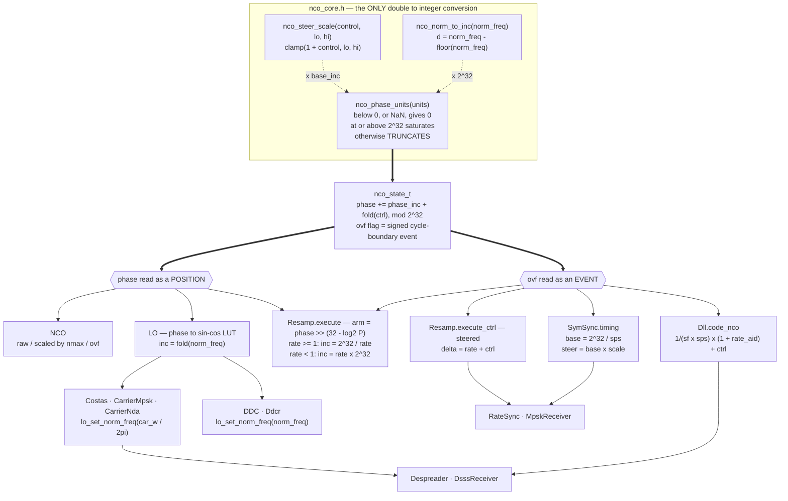

# The NCO

Everything in doppler that has a *rate* — a carrier, a symbol clock, a code
phase, a resampling ratio — stands on one 32-bit phase accumulator. This page
is what it guarantees, who reaches it and by what arithmetic, and which of its
conventions are load-bearing rather than incidental.

Related: [RateSync Timing Recovery](ratesync-timing.md) (the timing pair that
consumes the strobe), [Quantization](QUANTIZATION.md) (fixed-point conventions
elsewhere in the library), [State Serialization](state-serialization.md).

______________________________________________________________________

## 1. The one rule

A phase accumulator is exact integer arithmetic, and C99 says so outright:
unsigned arithmetic is reduced modulo 2^N for every unsigned type (6.2.5p9),
and `uint32_t` is exactly 32 bits with no padding (7.20.1.1). Wrapping, carry
and borrow therefore need no reasoning at all — they cannot overflow, cannot
trap, and cannot differ between hosts.

Undefined behaviour can enter at exactly one place: a `double` converted to an
integer type that cannot represent the truncated value (6.3.1.4). That single
fact is what makes confining the conversion **structural rather than
stylistic** — a second conversion site anywhere forfeits the guarantee no
matter how careful the first one is.

So there is one, in `native/inc/nco/nco_core.h`, and everything else is
integer:

| primitive                          | what it does                                                 |
| ---------------------------------- | ------------------------------------------------------------ |
| `nco_phase_units(units)`           | the cast: `<0` or NaN → 0, `≥2^32` → `2^32-1`, else truncate |
| `nco_norm_to_inc(norm_freq)`       | fold to `[0,1)` then convert                                 |
| `nco_steer_scale(control, lo, hi)` | bound `1 + control` to a band *before* converting            |

`nco_steer_scale` is the companion, and the reason the cast should almost
never be the thing making a decision: a conversion can only saturate or floor
a request that is already insane, and both are symptoms. Bounding the request
is the fix. §4 is what happens when that is forgotten.

______________________________________________________________________

## 2. Who reaches it, and by what arithmetic



The same accumulator is read two ways, and that is the distinction worth
holding on to:

- **As a position.** `phase` is a number to synthesise from — a LUT index for
    `LO`, a polyphase arm for `Resamp`. 32 bits is far below the noise of
    anything downstream.
- **As an event.** The `_ovf` flag says a cycle boundary was crossed. Nothing
    averages a strobe away, so this is the reading that has to be *right*
    rather than merely close.

______________________________________________________________________

## 2a. Cycles, or frequency?

The primitive's parameter is named `cycles`, and every other name in the
library says `norm_freq` — `nco_create(norm_freq)`, `nco_set_norm_freq()`,
the Python property. That is not quite a mistake, but it is worth being
precise about, because the two are not the same dimension.

What the conversion *does* is unit-free: it takes a **normalised** quantity,
folds it modulo one, and scales it to a phase word. What varies is what the
caller normalised *by*:

| normalised by                           | is a      | call sites                                                                                                       | result lands on |
| --------------------------------------- | --------- | ---------------------------------------------------------------------------------------------------------------- | --------------- |
| the sample rate — cycles **per sample** | frequency | `nco`, `lo` (×3), `resamp` (×2), `dll` (×3), the `ctrl` ports                                                    | `phase_inc`     |
| one period — cycles, absolute           | phase     | `costas:176`, `carrier_mpsk:160` (the loops' proportional path, `kp·e / 2π`), `dll_core.c:57` (`seed_chip / sf`) | `phase`         |

So the dual use is not an oddity in one corner: three call sites convert a
**phase**, two of them the proportional path of a carrier loop, where a
per-symbol nudge in radians becomes a phase-word offset. `cycles` is the only
word that covers both, which is why it is the parameter name — but it leaves
each call site's dimension unstated, and `nco_norm_to_inc` says "inc" for
three callers that assign the result straight to `.phase`.

The library also already *has* the second concept without a name for it:
`resamp_get_ctrl_acc()` is documented as "the control accumulator's fractional
phase, in \[0, 1)", and `dll`'s `chip_pos` is the same shape.

**The naming that fits is `norm_freq` and `norm_phase`, with "norm" meaning
normalised to whatever the context's full scale is** — the sample rate for a
frequency, one period for a phase. That both convert by the identical fold and
scale is not a coincidence to paper over; it is the reason one implementation
serves both, and two named faces over it would let each call site declare
which it means. Not yet done: 15 call sites plus tests, and no consumer of the
symbol outside `native/`.

Throughout this page the quantity is a normalised **frequency** in cycles per
sample unless it says otherwise.

______________________________________________________________________

## 3. The event is signed, and the sign is taken before the fold

`nco_norm_to_inc` folds bipolar to unipolar by construction: `-0.25` and
`+0.75` produce the same phase word. The modulo *value* is exact either way
and every consumer of `phase` is fine — but the direction is gone, and a raw
"did the unsigned add carry" test then fires on nearly every step of a
negative composite.

So `nco_step_u32_ovf_ctrl` forms the signed advance **before** anything is
folded, and the sign of that composite decides:

```text
delta = norm_freq + ctrl          /* signed cycles, pre-fold */
delta > 0 && phase wrapped down   -> carry   : one EXTRA output due
delta < 0 && phase wrapped up     -> borrow  : one FEWER
|delta| >= 1                      -> events every input regardless
delta == 0                        -> free-running, no event
```

Two of those rows are the whole reason it is not an intrinsic.
`__builtin_add_overflow` is unsigned-carry-only, so it has no borrow at all;
and at `delta == 1.0` — the rate a resampler's terminal stage sits on — it
adds `0 + 0` and never fires, while a period genuinely completes every single
input.

Keying off the sign of `ctrl` instead of the composite is wrong in the mirror
direction: at `norm_freq = 0.5, ctrl = -1e-4` the composite is a perfectly
ordinary `+0.4999`, and a `ctrl`-keyed rule calls every crossing a borrow.

`test_nco_core.c` §14–15 checks this against an independent oracle — expected
crossings computed in exact `long double` with no phase word and no fold
anywhere, so it cannot be tautological — across 10 base rates × 6 control
trajectories, both signs. Reverting the rule to a bare unsigned carry produces
199 failures.

**The tolerance is the truncation floor, and it is ±1 per record.** An
exactly-cancelling `±d` pair cannot round-trip through a truncating
accumulator, so the count sits one below the ideal indefinitely. A 64-bit
accumulator was built specifically to beat that, measured, and removed: it
did not (§6).

______________________________________________________________________

## 4. Bound the request, not the conversion

A steered rate is `nominal × (1 + control)`, and `control` comes from a loop
filter that is free to ask for anything during acquisition.

`symsync` routed that product straight through `nco_phase_units`, which
correctly killed an undefined cast — and turned a **negative** product into
`0`. Zero is a *stopped* timing NCO: it never strobes again, never emits a
symbol, and never locks. The undefined cast it replaced wrapped to a huge
increment, which slipped a cycle and **recovered**. Timing acquisition is
non-linear and does reach `control < -1`, so the honest conversion was
strictly worse than the undefined one until the command itself was bounded.

The band was not new. `rate_est` had always been clamped to
`[0.5·sps, 1.5·sps]` samples/symbol, and since `inst = sps / (1 + control)` is
monotone, that clamp *is* `1 + control` in `[2/3, 2]`. The object already knew
its sane range and applied it only to the number it reported, two lines after
commanding the NCO with an unbounded one.

That is the general shape: **the band is object policy** (what the object can
physically mean), and `nco_steer_scale` is the shared mechanism. With the band
applied, the product cannot floor or saturate, and the conversion goes back to
being a safety net.

!!! warning "Still unbounded: `Dll`"

    `dll_core.h:441` and `dll_core.c:678` both form
    `nco_norm_to_inc(inv_tsamps × (1 + rate_aid) + ctrl)` with no band — two
    copies of the same expression. It fails *differently* from symsync: the
    fold means a negative code rate becomes a near-full-rate **forward** one
    rather than a dead clock, so it is silently wrong rather than stuck. No
    band is declared anywhere for it, so choosing one is policy rather than
    restatement.

______________________________________________________________________

## 5. Why truncation, precisely

Truncation is **the only quantization with no tie to break and nothing to
contract.** That, rather than a general claim about rounding being sloppy, is
why it is the convention.

doppler compiles with `-ffast-math` project-wide (`CMakeLists.txt`), under
which the tie behaviour of any rounding form is at the compiler's discretion.
Disassembled at the project's own flags:

| expression                  | `x86-64-v2` (shipped baseline) | `x86-64-v3` (FMA, like arm64) |
| --------------------------- | ------------------------------ | ----------------------------- |
| `(uint32_t)(d*2^32)`        | `mulsd` `cvttsd2si`            | `vmulsd`                      |
| `(uint32_t)(d*2^32 + 0.5)`  | `mulsd` `addsd`                | **`vfmadd132sd`**             |
| `(uint32_t)llround(d*2^32)` | `mulsd` `addsd`                | `vmulsd` `vaddsd`             |

The `+ 0.5` form contracts into a single fused multiply-add wherever FMA is
baseline — arm64, and `x86-64-v3` — while staying a separate multiply-then-add
on the `x86-64-v2` baseline doppler ships. One rounding versus two,
disagreeing at exact ties: a live x86-vs-arm64 divergence at this project's
exact target configuration. `llround` is not even a libm call under these
flags; the compiler rewrites it into the same shape, differently again per ISA
level.

The increment feeds closed tracking loops, so a constant that differs by host
is precisely the reproducibility problem. The cost is a bias of at most one
step, always **low, never high**, which a carrier or code loop's integrator
absorbs. If the half-LSB were ever worth having it would have to be rounded in
*integer* arithmetic, where no compiler flag can reinterpret it.

Note the distinction: the accumulator truncating is inherent to a fixed-width
word, but quantizing `phase_inc` once at setup is a separate choice, and it is
made for reproducibility rather than accuracy.

**The consequence is user-visible and correct.** `RateConverter(rate=0.8)` over
1000 inputs emits **799**, not 800: `0.8` is not representable in a 32-bit
phase word, so the realised rate sits a hair below the requested one and 1000
inputs complete 799 periods — identically on every host. A double-precision
accumulator returned the ideal rational 800 because it carried rate resolution
the phase word does not, and letting the polyphase arm leave `[0,1)` as a
result is the defect that retired it.

______________________________________________________________________

## 6. What was tried and removed

- **A 64-bit timing clock (`nco_clock_t`).** Built on the theory that the
    32-bit truncation floor was breaking `ratesync` at `rate = 12/13`. It was
    not: the real cause was a resampler bug emitting duplicate samples, present
    in both attempts. Crippling the clock's resolution to 32 bits failed
    nothing except the assertion written to justify it, and `12/13` — the rate
    the whole argument rested on — is *exact* at 32 bits anyway. Removed;
    ~170 lines of header, a second phase width, and a second conversion.
- **A single conversion taking the width as a parameter.** The obvious way to
    de-duplicate a 32- and 64-bit pair. Measured at **~11% on the hot path**,
    because x86-64 has no single instruction for `double → uint64` before
    AVX-512 and every 32-bit caller then pays for the wide one. Moot once the
    64-bit width went.
- **Private copies of the conversion.** `resamp` (×2), `symsync` (×2) and
    `lo`'s AVX-512 kernel each grew their own. Every one was undefined at its
    boundary — `resamp` at `rate == 1.0` and `symsync` at `sps == 1` both
    produced **0** on x86 where arm64 saturates, and `symsync`'s steer did not
    clamp but *wrapped*, returning roughly a ninth of the correct increment for
    a control asking to speed up. `lo`'s SIMD copy used a **float32** fold while
    the scalar tail of the same function used the shared double one: over 4096
    samples the two halves diverged by 3673 phase units with 175 outputs
    differing, because `ctrl_inc` feeds a prefix sum and a per-sample error
    integrates.
