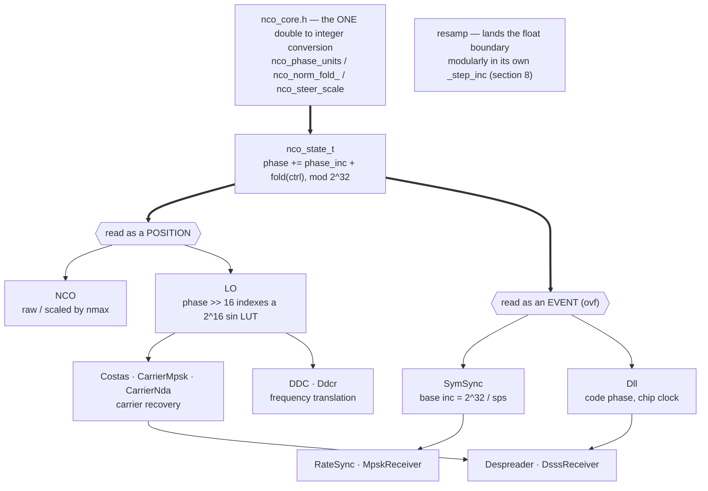

# The NCO

Everything in doppler that has a *rate* — a carrier, a symbol clock, a code
phase, a resampling ratio — stands on one 32-bit phase accumulator. This page
is the **why**: what the accumulator is for, how it works, how the pieces
built on it fit together, and which of its conventions are load-bearing
rather than incidental.

The contract itself — what each function promises, argument by argument —
lives in `native/inc/nco/nco_core.h`, and the measured envelope lives in
`src/doppler/tests/validation/nco/results.md`. This page does not restate
either; it explains the reasoning they assume.

Related: [Continuously Variable Resampler](RESAMPLER.md),
[Quantization](QUANTIZATION.md), [MPSK Receiver](mpsk.md),
[State Serialization](state-serialization.md).

______________________________________________________________________

## 1. What it is for

A numerically controlled oscillator answers one question, asked once per
sample: **where in the cycle am I now?**

That is all a carrier needs (to look up a sine), all a symbol clock needs (to
know when a symbol period completes), and all a resampler needs (to know
which polyphase arm to use and when to load the next input). Those look like
three different jobs, and they are the same job read three ways — which is
why there is one accumulator underneath and not three.

The design bargain that shapes everything else on this page:

> **Trade a one-time, constant frequency bias for exactly zero phase drift,
> forever.**

Section 2 is why that trade exists and why it is the right one.

______________________________________________________________________

## 2. Theory of operation

### 2.1 Phase is the integral of frequency, and an integer register holds it exactly

A sinusoid at normalised frequency `f` (cycles per sample) has phase

```text
theta(n) = f * n        cycles
```

Phase is modular: `theta` and `theta + 1` are the same place in the cycle, so
only the fractional part means anything. That is the observation the whole
design rests on, because it lets phase be stored in a way where wrapping is
free.

Represent phase as a `uint32_t` in which **the whole register spans exactly
one cycle**:

```text
phase word  0x00000000  ->  0.00 cycles
            0x40000000  ->  0.25
            0x80000000  ->  0.50
            0xC0000000  ->  0.75
            wraps       ->  back to 0.00
```

Now advancing the oscillator is one integer add, and the modulo-one-cycle
wrap is the register's own overflow — not a branch, not a comparison, not a
`fmod`. C99 guarantees it outright: unsigned arithmetic is reduced modulo 2^N
for every unsigned type (6.2.5p9), and `uint32_t` is exactly 32 bits with no
padding (7.20.1.1). Wrapping, carry and borrow need no reasoning at all; they
cannot overflow, cannot trap, and cannot differ between hosts.

The per-sample step is the frequency in the same units:

```text
phase_inc = norm_freq * 2^32        (converted once, at setup)
phase    += phase_inc               (every sample, exact)
```

### 2.2 Why this instead of a `double` phase

The obvious alternative is to keep phase in a `double` and add `f` each
sample, or compute `f*n` directly. Both lose, and for the same reason:
floating point has a *relative* precision, so as the accumulated value grows
the absolute error grows with it. A long run drifts, and the drift is
unbounded.

The integer accumulator has no such term. After `N` samples the phase is

```text
(phase_inc * N) mod 2^32
```

**exactly** — a closed form with no error at all, for any `N`, on any host.
`test_nco_core.c` streams 30 million samples and checks the accumulator
against that expression; it matches, and the output never leaves the unit
circle.

What is given up is *frequency* resolution. `phase_inc` is an integer, so the
realised frequency is quantized to `fs / 2^32` — at `fs = 21 MHz`, about
4.9 mHz. Two consequences, and both are benign:

- The error is a **constant** offset, not a growing one. A carrier or code
    loop's integrator absorbs a constant frequency error and leaves no
    steady-state phase error behind, so a closed loop never sees it.
- The error is **one-sided** — the conversion truncates, so the realised
    frequency is at most one step low and never high (§7).

That is the bargain: a fixed, absorbable frequency bias in exchange for phase
that is exact indefinitely. For a receiver that runs for hours, that is not a
close call.

### 2.3 Emit before increment

`out[0]` is the phase **at the moment of the call**, and the increment fires
after. This is a convention, but it is the load-bearing one, because it makes
the accumulator composable in two ways that matter:

- **Blocks concatenate.** Two calls of length `N` produce exactly what one
    call of length `2N` produces. Block size becomes a performance choice with
    no signal consequence — which is what lets a caller pick buffer sizes
    freely, and what makes the streaming and batch paths the same path.
- **The single-sample form is a drop-in.** `nco_step_u32()` is exactly one
    iteration of the block loop, so a module embedding an `nco_state_t` by
    value gets bit-identical output to one calling the block API. Every batch
    stepper has a matching single-sample primitive for this reason.

### 2.4 Three output mappings, because there are three questions

The accumulator is one thing; what a caller wants read off it is not.

| mapping                | expression                   | answers                                          |
| ---------------------- | ---------------------------- | ------------------------------------------------ |
| `nco_steps_u32`        | the phase word itself        | *where in the cycle am I* — full 32-bit position |
| `nco_steps_u32_scaled` | `(uint64)phase * nmax >> 32` | *which of `nmax` slots am I in*                  |
| `nco_steps_u32_ovf`    | phase, plus a boundary flag  | *did a period just complete*                     |

The scaled form is a fixed-point multiply, not a division or a modulo:
`(phase * nmax) >> 32` is exactly `floor(phase / 2^32 * nmax)`, which maps the
full accumulator range uniformly onto `[0, nmax)` for any `nmax`, power of two
or not. That is how a polyphase resampler picks its arm and how a table-driven
generator picks its entry, with no branch and no divide in the hot loop.
`nmax = 0` means "don't scale" and returns the raw form.

### 2.5 Position versus event — the distinction to hold on to

Those three mappings collapse into two *kinds* of reading, and the difference
decides how careful each has to be:

- **As a position.** `phase` is a number to synthesise from — a LUT index for
    `LO`, a polyphase arm for `Resamp`. An error here is a phase error, it is
    small and bounded, and everything downstream averages over it. 32 bits is
    far below the noise of anything real.
- **As an event.** The `_ovf` flag says a cycle boundary was crossed. Nothing
    averages a strobe away: a missed strobe is a missed symbol, a spurious one
    is a duplicated sample. This reading has to be *right*, not merely close,
    which is why §6 exists.

### 2.6 The control port, and why the loop never touches the accumulator

A tracking loop needs to steer the oscillator every sample. It could write
`phase_inc` each time — but then the *centre* frequency and the *correction*
are added up in one register, and neither is recoverable afterwards.

So every stepper has a `_ctrl` twin instead. `ctrl` is a per-sample frequency
correction in the same normalised units, added on top of `phase_inc` **for
that step only**:

```text
phase += phase_inc + fold(ctrl)     /* phase_inc is never modified */
```

This puts each piece where it belongs. The loop filter holds the integrator
and supplies its whole output as `ctrl` every sample; the NCO owns the
cycles→phase-word scaling and never exposes the integer to the loop; and
`norm_freq` stays a meaningful, readable quantity — the rate the caller
configured, not the rate the loop happens to have wandered to. With
`ctrl == 0` the steered path is bit-identical to the free-running one, which
is what makes it safe to use everywhere.

______________________________________________________________________

## 3. How the pieces fit together

Two consumers, one accumulator, split exactly along the position/event line
of §2.5.



### The synthesis side: `LO`

`LO` is the accumulator plus exactly one thing — a 65536-entry sine table
indexed by the top 16 bits of the phase, with a quarter-cycle offset giving
cosine from the same table. Phase word in, unit-magnitude complex phasor out.

That is the whole of it, and it is why the two objects are not really two:
`LO`'s accumulator is measured bit-for-bit identical to `NCO`'s across the
frequency range, free-running and control-driven alike. Everything on this
page therefore applies to every carrier in the library unchanged, and the only
question `LO` has to answer for itself is what the table costs — half a phase
bin in a closed loop, and no bandwidth.

Above `LO` sit the carrier loops (`Costas`, `CarrierMpsk`, `CarrierNda`) and
the down-converters (`DDC`, `Ddcr`). They differ in their discriminator, not
in their oscillator.

### The timing side: `SymSync`, `Dll`, `resamp`

A symbol clock is the same accumulator asked the event question. Set
`phase_inc = 2^32 / sps` and the register completes exactly one cycle every
`sps` input samples, so the `_ovf` strobe *is* the symbol clock — and because
the increment is an integer, a non-integer `sps` simply dithers the strobe
between adjacent sample counts, which is precisely the behaviour a fractional
resampler needs rather than a defect to correct.

`Dll` does the same for a chip clock, and `resamp` for an output clock. All
three steer through the `ctrl` port from their own loop filter.

______________________________________________________________________

## 4. The one float boundary

Everything above is integer arithmetic that C99 defines outright. Undefined
behaviour can enter at exactly one place: a `double` converted to an integer
type that cannot represent the truncated value (6.3.1.4).

That single fact is what makes confining the conversion **structural rather
than stylistic** — a second conversion site anywhere forfeits the guarantee no
matter how careful the first one is. So there is one, and everything else is
integer:

| primitive                            | what it does                                                 |
| ------------------------------------ | ------------------------------------------------------------ |
| `nco_phase_units(units)`             | the cast: `<0` or NaN → 0, `≥2^32` → `2^32-1`, else truncate |
| `nco_norm_fold_(norm)`               | fold to `[0,1)` then convert — the shared body               |
| `nco_norm_freq_to_inc(norm_freq)`    | its **frequency** face: cycles/sample → a phase increment    |
| `nco_norm_phase_to_word(norm_phase)` | its **phase** face: cycles → a phase word                    |
| `nco_steer_scale(control, lo, hi)`   | bound `1 + control` to a band *before* converting            |

`nco_phase_units` is *total*: every input including NaN has a defined answer,
so no caller has to pre-validate. Saturation at the top is the honest answer
for an accumulator — a phase word cannot express more than one cycle per
sample, and clamping says so where a wrap would silently invert the caller's
intent.

`nco_steer_scale` is the companion, and the reason the cast should almost
never be the thing making a decision: a conversion can only saturate or floor
a request that is already insane, and both are symptoms. Bounding the request
is the fix (§6).

A rule that is only written down is not a rule, so `scripts/.phase-conversion-allow`
is a ratchet: the lint gate fails on any new occurrence of the 2^32 scaling
constant outside this header, and the allowlist may only shrink.

______________________________________________________________________

## 5. Cycles, or frequency?

The conversion is unit-free — fold modulo one, scale by 2^32 — so it cannot
tell what the caller normalised *by*, and both meanings are live:

| normalised by                           | is a      | lands on    | who                                                                  |
| --------------------------------------- | --------- | ----------- | -------------------------------------------------------------------- |
| the sample rate — cycles **per sample** | frequency | `phase_inc` | `nco`, `lo`, `dll`, every `ctrl` port                                |
| one period — cycles, absolute           | phase     | `phase`     | the carrier loops' proportional path (`kp·e / 2π`), `seed_chip / sf` |

The second row is easy to miss and it is not a corner case: a carrier loop's
proportional term is an *angle*, nudged straight into the accumulator, and a
code loop seeds its starting chip the same way. The old single name
`nco_norm_to_inc` said "inc" for three callers that assign the result straight
to `.phase`.

Hence two named faces over one shared body — `nco_norm_freq_to_inc` and
`nco_norm_phase_to_word` — so a call site *states* its dimension instead of
leaving it inferrable from the assignment target. The arithmetic is identical;
a test pins the two faces to the same answer, because one body's value is lost
the moment a future edit gives one face its own convention.

Note what folding costs: it is exact in value but **destroys the sign**.
`-0.25` and `+0.75` are the same phase word, which is exactly right for a
position and exactly wrong for a direction. That is the subject of §6.

______________________________________________________________________

## 6. The event is signed, and the sign is taken before the fold

Reading the accumulator as an *event* is the reading that has to be right, and
the fold is what makes it hard: by the time `ctrl` has become a phase word,
"retreating by 0.25 cycles" is indistinguishable from "advancing by 0.75", and
a raw "did the unsigned add carry" test fires on nearly every step of a
negative composite.

So the signed advance is formed **before** anything is folded, and the sign of
that composite decides:

```text
delta = norm_freq + ctrl          /* signed cycles, pre-fold */
delta > 0 && phase wrapped down   -> carry   : one EXTRA output due
delta < 0 && phase wrapped up     -> borrow  : one FEWER
|delta| >= 1                      -> events every input regardless
delta == 0                        -> free-running, no event
```

Two of those rows are why this is not an intrinsic.
`__builtin_add_overflow` is unsigned-carry-only, so it has no borrow at all;
and at `delta == 1.0` — the rate a resampler's terminal stage sits on — it
adds `0 + 0` and never fires, while a period genuinely completes every input.

Keying off the sign of `ctrl` alone is wrong in the mirror direction: at
`norm_freq = 0.5, ctrl = -1e-4` the composite is an ordinary `+0.4999`, and a
`ctrl`-keyed rule calls every crossing a borrow. Only the composite's sign
carries the answer.

The gate checks this against an independent oracle — expected crossings
computed in exact `long double`, with no phase word and no fold anywhere, so
it cannot be tautological — over 10 base rates × 6 control trajectories, both
signs. Reverting to a bare unsigned carry turns those sections red wholesale.

**The event is a flag, not a counter.** One bit per sample cannot report two
wraps, so above one cycle per sample it saturates. That is correct for a
strobe and it is the reason a resampler keeps its own accounting rather than
summing flags.

**The tolerance is the truncation floor: ±1 per record.** An exactly-cancelling
`±d` control pair cannot round-trip through a truncating accumulator, so a
crossing count sits one below the ideal indefinitely. A 64-bit accumulator was
built specifically to beat that, measured, and removed (§9).

______________________________________________________________________

## 7. Why truncation, precisely

Truncation is **the only quantization with no tie to break and nothing to
contract.** That, rather than a general claim about rounding being sloppy, is
why it is the convention.

doppler compiles with `-ffast-math` project-wide, under which the tie
behaviour of any rounding form is at the compiler's discretion. Disassembled
at the project's own flags:

| expression                  | `x86-64-v2` (shipped baseline) | `x86-64-v3` (FMA, like arm64) |
| --------------------------- | ------------------------------ | ----------------------------- |
| `(uint32_t)(d*2^32)`        | `mulsd` `cvttsd2si`            | `vmulsd`                      |
| `(uint32_t)(d*2^32 + 0.5)`  | `mulsd` `addsd`                | **`vfmadd132sd`**             |
| `(uint32_t)llround(d*2^32)` | `mulsd` `addsd`                | `vmulsd` `vaddsd`             |

The `+ 0.5` form contracts into a single fused multiply-add wherever FMA is
baseline — arm64, and `x86-64-v3` — while staying a separate multiply-then-add
on the `x86-64-v2` baseline doppler ships. One rounding versus two, disagreeing
at exact ties: a live x86-vs-arm64 divergence at this project's exact target
configuration. `llround` is not even a libm call under these flags; the
compiler rewrites it into the same shape, differently again per ISA level.

The increment feeds closed tracking loops, so a constant that differs by host
is precisely the reproducibility problem — and per §2.2 the bias itself is
absorbed by the loop, so the accuracy the rounding would buy is worth less
than the reproducibility it would cost. If the half-LSB were ever worth
having, it would have to be rounded in *integer* arithmetic, where no compiler
flag can reinterpret it.

Note the distinction: the accumulator truncating is inherent to a fixed-width
word, but quantizing `phase_inc` once at setup is a separate choice, made for
reproducibility rather than accuracy.

The consequence is user-visible and correct, so it is asserted rather than
described:

```python
import numpy as np
from doppler.source import NCO
from doppler.resample import RateConverter

# 51/21e6 has a fractional remainder of ~0.635: truncation floors it to
# 10430, where round-to-nearest would give 10431. The realised frequency is
# one step LOW, never high, on every host.
assert NCO(51 / 21e6, 0).phase_inc == 10430

# 0.8 is not representable in a 32-bit phase word, so the realised rate sits
# a hair below the requested one and 1000 inputs complete 799 periods, not
# the ideal rational 800 -- identically everywhere.
emitted = RateConverter(rate=0.8).execute(np.ones(1000, dtype=np.complex64))
assert emitted.shape[0] == 799
```

A double-precision accumulator returned 800 because it carried rate resolution
the phase word does not, and letting the polyphase arm leave `[0,1)` as a
result is the defect that retired it.

______________________________________________________________________

## 8. Bound the request, not the conversion

A steered rate is `nominal × (1 + control)`, and `control` comes from a loop
filter free to ask for anything during acquisition.

`symsync` routed that product straight through `nco_phase_units`, which
correctly killed an undefined cast — and turned a **negative** product into
`0`. Zero is a *stopped* timing NCO: it never strobes again, never emits a
symbol, and never locks. The undefined cast it replaced wrapped to a huge
increment, which slipped a cycle and **recovered**. Timing acquisition is
non-linear and does reach `control < -1`, so the honest conversion was
strictly worse than the undefined one until the command itself was bounded.

The band was not new. `rate_est` had always been clamped to
`[0.5·sps, 1.5·sps]` samples/symbol, and since `inst = sps / (1 + control)` is
monotone, that clamp *is* `1 + control` in `[2/3, 2]`. The object already knew
its sane range and applied it only to the number it reported, two lines after
commanding the NCO with an unbounded one.

That is the general shape: **the band is object policy** — what the object can
physically mean — and `nco_steer_scale` is the shared mechanism. With the band
applied, the product cannot floor or saturate, and the conversion goes back to
being a safety net.

### `Dll` — why it is *not* banded

`dll` forms `nco_norm_freq_to_inc(inv_tsamps × (1 + rate_aid) + ctrl)`, with
`ctrl` from a loop filter just like symsync's, so the obvious question is why
it does not get the same treatment.

Because symsync's band was a **restatement**, not an invention. It had an
unrecoverable failure mode *and* an already-declared sane range it simply was
not applying to the NCO. `dll` has neither: its `ctrl` is an ordinary
normalised frequency through a total fold, and its wrap detection is the plain
unsigned-carry form because its `phase_inc` is a stored `uint32_t` and the sign
is gone by construction.

The measurement agrees. Over 600 periods at SF=63, SPS=4, bn=0.005 the loop's
own control never leaves ±0.2% of nominal — worst case *unlocked in pure
noise*:

| scenario            | `code_rate` min | max      |
| ------------------- | --------------- | -------- |
| nominal, clean      | 1.000000        | 1.000000 |
| ±1e-2 rate error    | 0.998816        | 1.000303 |
| Es/N0 = −10 dB      | 0.999925        | 1.000089 |
| pure noise (−30 dB) | 0.998358        | 1.000447 |

Any band wide enough not to clip real aiding would sit two orders of magnitude
from anything the loop does, which makes it a number chosen to look reasonable
rather than one the object means.

______________________________________________________________________

## 9. Where the boundary is landed modularly instead — `resamp`

`resamp` used to hold private copies of the conversion. It no longer does —
but it did **not** move onto `nco_phase_units`, and the reason matters enough
that the header says "do not consolidate it back".

Under the **interpolating** rule `resamp` adopted, an output is emitted on
every tick and the phase word only decides when to *load* the next input. A
step of one whole period per tick — `rate == 1` — is therefore an ordinary
operating point, not a limit, and its exact encoding is `0`: a full period
elapsed, which is precisely what the accumulator wrapping to zero says.

`nco_phase_units` would clamp that to `2^32-1`. That is the right answer for a
phase **accumulator**, where exceeding one cycle per sample is meaningless, and
the wrong one for a **period counter**, where the wrap *is* the meaning. So
`_step_inc` converts through `int64_t`, which represents 2^32 exactly, making
the conversion defined over the whole range and the narrowing modular by
construction; NaN and negatives are rejected first, leaving only the boundary
it actually wants.

That entry sits in the allowlist's SAFE section with the reasoning attached —
the difference between a documented exception and an erosion.

______________________________________________________________________

## 10. What was tried and removed

- **A 64-bit timing clock (`nco_clock_t`).** Built on the theory that the
    32-bit truncation floor was breaking `ratesync` at `rate = 12/13`. It was
    not: the real cause was a resampler bug emitting duplicate samples, present
    in both attempts. Crippling the clock's resolution to 32 bits failed
    nothing except the assertion written to justify it, and `12/13` — the rate
    the whole argument rested on — is *exact* at 32 bits anyway. Removed:
    ~170 lines of header, a second phase width, and a second conversion.

- **A single conversion taking the width as a parameter.** The obvious way to
    de-duplicate a 32- and 64-bit pair. Measured at **~11% on the hot path**,
    because x86-64 has no single instruction for `double → uint64` before
    AVX-512, so every 32-bit caller pays for the wide one. Moot once the 64-bit
    width went.

- **Private copies of the conversion.** `symsync` (×2) and `lo`'s AVX-512
    kernel each grew their own, and each was undefined at its boundary.
    `symsync` at `sps == 1` produced **0** on x86 where arm64 saturates — a
    dead NCO — and its steer wrapped rather than clamped, returning roughly a
    ninth of the correct increment for a control asking to speed up. `lo`'s
    SIMD copy folded in **float32** while the scalar tail of the same function
    used the shared double one: over 4096 samples the halves diverged by 3673
    phase units with 175 outputs differing, because `ctrl_inc` feeds a prefix
    sum and a per-sample error integrates.

    `lo`'s copy is also **unreachable**: the default build targets
    `-march=x86-64-v2`, so `__AVX512F__` is undefined in every wheel and every
    CI job, and the vector path is live only under `DOPPLER_NATIVE=ON` on an
    AVX-512 host. Two complete implementations of one function where only one
    is ever built — so the divergence is real and no gate can catch it. The
    standing decision is to delete the vector halves and keep the scalar
    fallbacks.

______________________________________________________________________

## 11. What it costs, measured

The numbers live in `src/doppler/tests/validation/nco/results.md`, regenerated
by the `validate.py` beside it. The short version, so this page is not the
last word on questions it raises:

- Frequency error is one-sided low and tracks a `1e6/phase_inc` ppm envelope —
    negligible at a carrier rate, ~194700 ppm at the bottom of the range. A code
    NCO lives at the expensive end.
- The usable floor is exactly one LSB, `2.33e-10` cycles/sample.
- The `ctrl` port is float32 while the configured rate is double, so the same
    requested `0.1` reaches the accumulator as two different phase words
    depending on which way it came in; and a control that cancels `phase_inc`
    stops the oscillator over a plateau one float32 quantum wide rather than at
    a knife edge. Both are recorded as gaps.
- Closed-loop, with an ideal detector: a phase step settles well inside the
    `5/bn` estimate, symmetrically in sign, with no steady-state error, and a
    frequency ramp leaves none either — the type-2 integrator absorbing the
    constant bias of §2.2, exactly as designed.

`LO`'s own report (`src/doppler/tests/validation/lo/results.md`) adds what the
sine table costs on top, including spurious content: bounded at 90 dBc,
typically 96, and set by the low 16 bits of `phase_inc` rather than by the
frequency.
