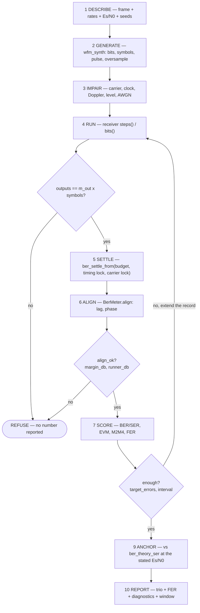

# Receiver Test Harness

**Status:** goals (§0), inventory (§1–§6), the frame descriptor it needs (§7),
and the sequence that drives the plan (§8). Design, not yet built. Everything
below was read from the tree, not recalled; line counts and symbol lists are
as measured. The immediate cause of this document was a hand-rolled
measurement harness that produced three wrong conclusions in one session —
one of which reached a filed issue.

______________________________________________________________________

## 0. Goals, and why an inventory comes first

One harness that produces a receiver number anyone can defend — **ours or a
caller's**. Ten goals, each phrased so it is possible to say whether it has
been met.

1. **A broken measurement fails loudly.** The harness never returns a
    plausible number from an untrustworthy state. Alignment that did not
    detect, a window that has not settled, too few trials for the interval
    claimed — each is a refusal to report, not a number with a caveat.
1. **Every measurement primitive is itself tested, and proven by sabotage.**
    `ber_align_detect`, `ber_evm_db`, `snr_m2m4_db` and the harness headers
    that wrap them. A test nobody has watched fail is not evidence.
1. **Anchored to theory, not to itself.** Every rate is checked against
    closed form (`ber_theory_ser`, `ber_esn0_db_for_ser`), so "all
    configurations agree" can never be mistaken for "all configurations are
    correct". A comparison between configurations is not a measurement.
1. **BER, EVM, M2M4 and FER reported together, always.** They fail
    differently, and the disagreement is the diagnostic (§2.4, §2.5).
    Reporting one alone is what makes a false lock invisible.
1. **Stimulus and measurement come from the library, never from the test.**
    `wfm_synth`/`wfmgen` generate; `ber`/`snr` measure. The harness composes
    them and owns no pulse, no level convention and no estimator of its own —
    the rule `check_stimulus_sources.py` already enforces everywhere else.
1. **One harness, every receiver.** Parameterised by operating point, not
    forked per object, so two receivers are comparable by construction rather
    than by hoping two harnesses agree.
1. **A run is reproducible from its description.** A frame descriptor, the
    rates, and the seeds fully determine it — no stored truth arrays, no
    ambient state. The same description re-run anywhere gives the same number.
1. **It runs under `make`, in the tree.** Anything a conclusion is drawn from
    is reachable by a make target and visible to the gates. Exploratory work
    outside the tree is exactly where the failures behind this document
    happened (§5.5).
1. **Internal and external use are the same path.** The harness is a shipped
    capability, not a test rig: a caller measuring *their* receiver against
    *their* capture uses what we use. Every measurement piece therefore lives
    in the library with a binding, and anything reachable only from
    `native/tests/` is both unavailable to callers and exercised by nobody but
    us. This is already largely true and worth keeping true — `BerMeter` ships
    the whole alignment decision (`align_ok`, `align_margin_db`,
    `align_runner_db`, `align_slips`, `lag`, `phase`) plus `enough` and
    `interval`, so `dp_ber_sync()` is a convenience over shipped machinery
    rather than a private capability. The frame layer (§7) must land the same
    way.
1. **We use our own tools.** doppler generates its own stimulus, computes its
    own EVM, estimates its own SNR and checks its own CRC. No numpy
    re-implementation, no private estimator, no second convention — that is
    what `check_stimulus_sources.py` already enforces, and dogfooding is also
    the only thing that keeps the external path honest: a capability our own
    tests do not use is a capability nobody is testing.

### 0.1 Non-goals

- **Not object certification.** [Object Validation](../dev/validation.md)
    owns that process; this harness is something certification *uses*.
- **Not a new generator, and not a new estimator.** Every capability named
    above already exists somewhere in the tree. The work is connecting,
    testing and standardising it — a harness that invents its own is the
    failure being corrected, not the fix.
- **Not real-time.** Offline records and deterministic seeds. Nothing here
    promises a bounded per-sample cost or a streaming API for the *measurement*
    side — the receivers it measures are streaming, the harness around them is
    not. It is usable on a field capture (the truth-free metrics need no truth,
    and `*_series` forms already exist for both estimators); that is a
    consequence of goal 9, not a real-time claim.

### 0.2 Why the inventory comes first

A receiver measurement can fail in a way that returns a **plausible number**
rather than an error. That is the whole difficulty:

- a BER scored against an unaligned truth stream reads ≈ 0.5, which looks like
    a broken receiver rather than a broken measurement;
- the same number at ≈ 0.43 looks like a *partially* working receiver, and
    invites a diagnosis;
- and when every configuration under test reads the same wrong number, the
    comparison between them still looks self-consistent.

So the harness has to be trusted before anything measured through it means
anything. doppler already owns most of what that requires. The gap is not
capability — it is that the pieces were built at different times, two of them
have never met, and the most failure-prone ones have no direct test.

______________________________________________________________________

## 1. Stimulus — what generates a signal

### 1.1 The library generator (the sanctioned home)

`wfm_synth_*` (`native/inc/wfm_synth/wfm_synth_core.h`) is the C generator.
Nine waveform types:

| type                | value | notes                                  |
| ------------------- | ----- | -------------------------------------- |
| `WFM_SYNTH_TONE`    | 0     | complex CW                             |
| `WFM_SYNTH_NOISE`   | 1     | complex AWGN only                      |
| `WFM_SYNTH_PN`      | 2     | BPSK-modulated PN chips                |
| `WFM_SYNTH_BPSK`    | 3     | BPSK over PN-sourced data bits         |
| `WFM_SYNTH_QPSK`    | 4     | Gray-coded QPSK over PN-sourced data   |
| `WFM_SYNTH_CHIRP`   | 5     | linear FM, no symbols                  |
| `WFM_SYNTH_BITS`    | 6     | user bit pattern, oversampled + cycled |
| `WFM_SYNTH_SYMBOLS` | 7     | raw constellation points               |
| `WFM_SYNTH_DSSS`    | 8     | two-code burst **or** continuous       |

Attach functions: `wfm_synth_set_bits`, `wfm_synth_set_dsss`,
`wfm_synth_set_dsss_cont`, `wfm_synth_set_symbols`, `wfm_synth_set_rrc`,
`wfm_synth_set_chirp_span`. Noise: `wfm_synth_noise_steps`,
`wfm_synth_reseed_noise`, with `snr_mode` selecting an Es/N0 convention.

### 1.2 The application

`wfmgen` (`native/src/app/wfmgen.c`) exposes that generator with 45 flags,
including the output axes (`--file-type`, `--endian`, `--record`,
`--sample-type`) and the level/SNR controls (`--level`, `--snr`,
`--snr-mode`).

### 1.3 Framing — exists, but only for DSSS

The frame layout lives in `native/inc/wfm/wfm_dsp.h`:

```c
size_t wfm_frame_dsss_nchips (size_t acq_len, size_t acq_reps, size_t data_len, …);
size_t wfm_frame_dsss_chips  (const uint8_t *acq_code, size_t acq_len, …);
```

Both emit **chips**, and the layout `[preamble | sync | payload | CRC-16]` is
expressed exactly once — inside the DSSS spreader. `wfm_synth_set_dsss()`
takes `acq_code`/`acq_reps` (repeated preamble), `sync`/`sync_len` (frame-sync
word, Barker-13 by convention), `payload`, and `crc`.

**The unspread path has none of it.** `wfm_synth_set_bits(state, bits, n, modulation)` takes bits and a modulation index and nothing else. wfmgen's own
help states the continuous DSSS mode has "No preamble/sync/CRC frame" and
"Rejects the burst-frame flags (`--acq-code`/`--sync`/`--crc`)".

So a framed waveform is reachable only through DSSS spreading. A plain
BPSK/QPSK stream — what a non-spread receiver is tested against — is an
unframed PRBS.

Barker-13 is not a library constant. It appears as the literal
`"1111100110101"` in `scripts/gen_wfmgen_flag_matrix.py`, and as prose in
`wfmgen --sync`'s help and `burst_demod`'s docstrings. Every caller types it.

### 1.4 Sequence primitives

`pn_create(poly, seed, length, lfsr)` / `pn_generate` (`native/inc/pn/`) and
`gold_core` are the sequence sources. A PN payload is therefore reproducible
from three numbers rather than a stored array.

### 1.5 The test-layer stimulus

`native/tests/dp_tx_test.h` (307 lines) calls itself "the SSOT for harness
STIMULUS: one shaped symbol stream, one place." Its configuration is:

```c
dp_tx_pulse_t pulse;  double sps;   double beta;  int span;
double tau;   double rate;  double amp;  double fc;
size_t nsym;  uint32_t seed;
```

Pulse, rate, timing offset, amplitude, carrier, length, seed — and **no frame
structure**. It cannot express a preamble, a sync word or a payload.

`native/tests/dp_rng_test.h` (312 lines) is "the SSOT for harness RANDOMNESS:
one generator, one Box-Muller."

______________________________________________________________________

## 2. Measurement — what turns a signal into a number

### 2.1 `ber_core.h` — the theory and the window

```
ber_qfunc              ber_theory_ser          ber_theory_ber
ber_esn0_db_for_ser    ber_evm_scatter_floor_db
ber_settle_syms        ber_settle_from         ber_lock_symbol
ber_evm_db             ber_confidence
```

`ber_esn0_db_for_ser` is what anchors a measurement to theory rather than to
itself. `ber_settle_syms` / `ber_settle_from` define the settled window;
`ber_evm_db` computes EVM over it.

### 2.2 `ber_meter_core.h` — alignment and accumulation

```
ber_align_detect   ber_align_t        ber_meter_create   ber_meter_set_truth
ber_meter_detect   ber_meter_align    ber_meter_score    ber_meter_set_align
ber_meter_get_enough                  ber_meter_interval
ber_meter_ser      ber_meter_ber      ber_meter_get_errors
```

`ber_align_detect` is the primitive that decides where the received stream
sits against truth. `ber_meter_get_enough` answers "have I run enough trials",
and `ber_meter_interval` gives the confidence interval.

**This layer is shipped, which is what makes goal 9 reachable.**
`doppler.ber.BerMeter` exposes the whole alignment decision — `align`,
`align_ok`, `align_stat`, `align_margin_db`, `align_runner_db`,
`align_occurrences`, `align_slips`, `align_saturated`, `lag`, `phase` — plus
`enough`, `interval`, `ber`, `ser`, `conf`, `target_errors` and the state
triplet. `doppler.snr` ships `snr_m2m4_db`, `snr_data_aided_db` and both
`*_series` forms; `doppler.ber` also ships `ber_evm_db`, `ber_settle_syms`,
`ber_settle_from`, `ber_theory_ser`/`_ber` and `ber_esn0_db_for_ser`.

So a caller measuring their own receiver already has the trio and the
alignment decision. What they do **not** have is the frame layer (§7) and any
frame-level accumulation (§2.5) — which is the gap this document exists to
close, on the external side as much as ours.

### 2.3 `dp_ber_test.h` (834 lines) — the statistical harness

Owns the settled window, the marker model and the sync decision:

```c
typedef struct { …; size_t period; size_t reps; } dp_ber_marker_t;
/* period == 0 is a single occurrence — a preamble. */

dp_ber_sync_t dp_ber_sync (rx, n_rx, truth, n_truth, mk, m, lag_span, pfa);
/* -> lag, phase, stat, threshold, margin_db, runner_db, occurrences, ok */
```

This is a **detection**, not a search: the threshold is Pfa-derived and
Bonferroni-corrected over the candidate lags, `runner_db` is an ambiguity
check against the best competitor outside the guard band, `phase` recovers the
residual constellation rotation (which resolves an M-fold ambiguity), and `ok`
says whether to believe any of it.

Also present: `dp_ber_ci`, `dp_ber_enough`, `dp_ber_esn0_db_for_ser`,
`dp_ber_measure`, `dp_ber_lock_symbol`, `dp_ber_evm_m`, `dp_ber_in_marker`.
The settling budget it documents is
`2*(5/bn_timing + 5/bn_carrier)`, taken as
`max(budget, timing lock, carrier lock, handover + budget)`.

### 2.4 The trio — BER, EVM, M2M4

Three numbers describe a receiver's output, and the reason to carry all three
is that **they fail differently**. Each already exists in the library:

| metric        | needs                                            | primitive                                                             | test-layer wrapper                |
| ------------- | ------------------------------------------------ | --------------------------------------------------------------------- | --------------------------------- |
| **BER / SER** | external truth **and** alignment                 | `ber_meter_score`, `ber_align_detect`                                 | `dp_ber_measure`                  |
| **EVM**       | nothing — self-referenced against hard decisions | `ber_evm_db`                                                          | `dp_test_evm_db_hard{,_m,_range}` |
| **M2M4**      | nothing — blind, from 2nd/4th moments            | `snr_m2m4_db` (`native/inc/snr/snr_core.h`, Pauluzzi & Beaulieu 2000) | `dp_test_m2m4_snr_db{,_range}`    |

A fourth sits alongside them: `snr_data_aided_db` (and the sliding-window
`*_series` forms of both estimators), which is the truth-using counterpart to
M2M4 and therefore a cross-check on it.

**The complementarity is the point, and MPSK §3.5 already records the trap.**
Under a stable false lock at `Δf = k·F/M` the constellation is stationary, so:

> self-referenced EVM looks clean, blind M2M4 looks clean, and the lock metric
> looks healthy. It takes an **external** frequency reference, or a sync word /
> known preamble.

So EVM and M2M4 — the two that need no truth — are exactly the two that cannot
see the failure mode this receiver family is most prone to. Only BER catches
it, and BER needs truth *and* a trustworthy alignment. That is the load-bearing
argument for structured stimulus: a sync word is what converts alignment from a
search into a detection, and it is what makes the one metric that can see a
false lock actually usable.

Read the other way: EVM and M2M4 run on captures with no truth at all, which is
what makes them the field metrics. The three are not redundant, and no two of
them substitute for the third.

### 2.5 Frame statistics — the missing accumulator

Framed stimulus (§1.3) makes a fourth outcome available, and it is the one
that closes the trio's blind spot.

**A CRC is a truth-free error detector that still catches a false lock.** EVM
and M2M4 need no truth and cannot see a stationary false constellation; BER
sees it but needs truth and alignment. A CRC-checked frame needs no payload
truth — the frame either checks or it does not — and a false lock fails it.
That makes frame error rate the one metric usable on a real capture that still
detects the failure §3.5 of the MPSK design calls Mode 1's "single quiet
failure".

| metric        | needs truth | sees a false lock |
| ------------- | ----------- | ----------------- |
| EVM           | no          | **no**            |
| M2M4          | no          | **no**            |
| BER / SER     | **yes**     | yes               |
| **FER (CRC)** | **no**      | **yes**           |

What exists today:

- `dp_crc16_ccitt (const uint8_t *bits, size_t n)` — `native/inc/dp_crc16.h`,
    header-only.
- `wfmgen --crc none|crc16` emits the trailer; `wfm_frame_dsss_chips()`
    assembles `[preamble | sync | payload | CRC-16]`.
- `burst_demod_state_t` exposes per-frame read-backs after `demod()`:
    `frame_valid` (CRC matched), `frame_offset` (sync word symbol offset),
    `n_symbols`, `est_freq_hz`, `est_rate_hz`, `est_snr_db`.

What does not exist: **any accumulation across frames.** A search for
`frame_stat` / `frame_err` / `fer` matches nothing in `native/`. `burst_demod`
holds one frame's outcome in its own struct, so the last frame overwrites the
previous one; there is no frame-error rate, no sync-detection rate, and no
per-frame trio anywhere in the tree.

The shape it should take is already set by its sibling: `ber_meter_*`
accumulates symbol outcomes and reports an interval via `ber_confidence (errors, symbols, conf)` — which is a binomial confidence interval and is
therefore **already generic over frames**. A frame-statistics accumulator
reuses it rather than inventing a second one, and the natural read-backs are
frames attempted / sync detected / CRC passed, plus the trio evaluated
per-frame so a disagreement can be localised to a frame rather than smeared
across a record.

Two things this buys that the symbol-level metrics cannot:

- **Sync detection rate is a measurement, not an assumption.** `dp_ber_sync()`
    already returns `margin_db`, `runner_db` and `ok` per attempt; accumulating
    them answers "is this sync word long enough at this Es/N0" with a number
    (see §6's open question on Barker-13 against `DP_BER_SYNC_SYMS = 256`).
- **Localisation.** A record whose BER degrades halfway through is one
    cycle-slipped frame, not a uniformly worse receiver — indistinguishable in
    a single record-wide BER, obvious in a per-frame series.

### 2.6 The other harness headers

| header            | lines | role                                                                                                                                                          |
| ----------------- | ----- | ------------------------------------------------------------------------------------------------------------------------------------------------------------- |
| `dp_test.h`       | —     | foundation: `DP_CHECK`, `DP_CHECK_NEAR`, `DP_CHECK_MSG`, `DP_TEST_END`                                                                                        |
| `dp_sym_test.h`   | 220   | truth-free symbol quality: `dp_test_evm_db_hard`, `dp_test_evm_db_hard_m`, `dp_test_evm_db_hard_range`, `dp_test_evm_scatter_floor_db`, `dp_test_settle_syms` |
| `dp_mf_test.h`    | 109   | matched-filter fixtures: RRC-BPSK on a carrier + EVM                                                                                                          |
| `dp_dsss_test.h`  | 211   | DSSS fixtures                                                                                                                                                 |
| `dp_state_test.h` | 37    | `DP_STATE_ROUNDTRIP_TEST`                                                                                                                                     |
| `dp_tx_test.h`    | 307   | stimulus (§1.5)                                                                                                                                               |
| `dp_rng_test.h`   | 312   | randomness (§1.5)                                                                                                                                             |
| `dp_ber_test.h`   | 834   | statistics (§2.3)                                                                                                                                             |

______________________________________________________________________

## 3. Runners — what executes a measurement

### 3.1 C validation harnesses (`native/validation/`, 16 files)

| file                                                                  | measures                                        |
| --------------------------------------------------------------------- | ----------------------------------------------- |
| `mpsk_receiver_ber.c`                                                 | SER, complex-baseband M-PSK receiver            |
| `mpsk_receiver_r_ber.c`                                               | SER, real-IF M-PSK receiver                     |
| `mpsk_ber_common.h` (15 KB)                                           | **shared stimulus + measurement loop for both** |
| `ber_despreader.c`                                                    | BER, synchronous coherent despreader            |
| `carrier_nda_lock.c` / `_pullin.c` / `_scurve.c` / `_step_response.c` | NDA carrier loop                                |
| `carrier_mpsk_jitter.c` / `_scurve.c`                                 | M-PSK carrier loop                              |
| `costas_jitter.c`, `dll_jitter.c`, `symsync_lock.c`                   | loop jitter / lock                              |
| `ratesync_scurve.c`                                                   | each TED's S-curve                              |
| `loop_filter_noise_bw.c`                                              | does `bn` deliver `bn`                          |
| `lockdet_verify.c`                                                    | verify counts vs theory                         |
| `mpsk_diff_penalty.c`                                                 | differential M-PSK penalty                      |

`mpsk_ber_common.h` sets the **matched-filter-output** Es/N0 (not an input
SNR), with amplitude `A*sqrt(sps/(2*esn0))`, and anchors every measurement at
SER = 1e-3 via `dp_ber_esn0_db_for_ser`. It is the closest thing to a
standard receiver harness that exists.

### 3.2 Python certification

Ten objects carry a generated `results.md` under
`src/doppler/<pkg>/tests/validation/<obj>/`: `agc`, `lo`, `nco`, `mpsk`,
`ema`, `resamp`, `ratesync`, `loop_filter`, `carrier_nda`, `lockdet`.

### 3.3 Make targets

`validate-c` runs every C harness's full sweep; `validate-check` runs the CI
subset and is in the `gates` closure, alongside `lint`, `changelog-check`,
`drift-check`, `doxygen-check`, `docs-check`, `gen-c-api-check`.

______________________________________________________________________

## 4. Gates that already police this

Fourteen `scripts/check_*.py`. The two that matter here:

- **`check_stimulus_sources.py`** — "stimulus and its measurement have ONE
    home, and it is the library." It forbids a private pulse, a private level
    normalisation, or a private EVM, and names the canonical primitive for
    each (`wfm_synth_set_rrc`/`rrc_taps`; `Synth(level=, snr=, snr_mode=)`;
    `ber_evm_db` over `ber_settle_syms`/`ber_settle_from`). Its recorded
    motivation is a demo that peak-normalised an RRC stream and lost ~40x of
    loop gain with nothing pointing at the level.
- **`check_tests_ssot.py`** — enumerates the `dp_*_test.h` family (reports 32
    macros and 41 helpers across 8 headers) and checks no test file loses
    assertions against `origin/main`.

______________________________________________________________________

## 5. What the inventory shows

Five findings, each measured above rather than asserted.

### 5.1 The two primitives every receiver number rests on have no direct test

| primitive          | defined                | referenced in the tree                                              | own test      |
| ------------------ | ---------------------- | ------------------------------------------------------------------- | ------------- |
| `ber_align_detect` | `ber_meter_core.c:133` | **only** `dp_ber_test.h:300`                                        | **none**      |
| `ber_evm_db`       | `ber_core.h:247`       | `dp_ber_test.h`, `dp_sym_test.h`, `test_ratesync_core.c`            | **none**      |
| `snr_m2m4_db`      | `snr_core.h:100`       | `dp_sym_test.h`, `dp_ber_test.h`, `test_async_dsss_receiver_core.c` | **no C test** |

`test_dp_ber.c` is 637 lines and covers `dp_ber_ci` (18 references) and
`ber_settle` (5). It contains **zero** references to either of the first two.
All three are exercised only through consumers — the shape in which a broken
primitive returns a plausible number and every downstream test still passes.

So **none of the trio (§2.4) has a direct C test**, and the `snr` module has no
`native/tests/test_snr_core.c` at all (it has a Python test,
`src/doppler/snr/tests/test_snr.py`). Every receiver number this project
quotes rests on three primitives that are checked only by their own consumers.

### 5.2 Five of seven harness headers have no test of their own

| header            | lines | own test              |
| ----------------- | ----- | --------------------- |
| `dp_ber_test.h`   | 834   | `test_dp_ber.c` (637) |
| `dp_rng_test.h`   | 312   | `test_dp_rng.c` (273) |
| `dp_tx_test.h`    | 307   | **none**              |
| `dp_sym_test.h`   | 220   | **none**              |
| `dp_dsss_test.h`  | 211   | **none**              |
| `dp_mf_test.h`    | 109   | **none**              |
| `dp_state_test.h` | 37    | **none**              |

`dp_tx_test.h` and `dp_sym_test.h` are the two that silently shape every
measurement — the stimulus and the symbol-quality scoring.

### 5.3 The framed generator and the frame-aware measurer have never met

`dp_ber_marker_t` models a preamble (`period == 0`) and a periodic marker, and
`dp_ber_sync()` consumes one to produce a *detected* alignment with a Pfa and
an `ok` flag. But the only thing in the tree that can emit a frame is the DSSS
spreader (§1.3), and the test-layer stimulus cannot emit one at all (§1.5).

The measurement side was built expecting structured stimulus that the
generation side does not produce for unspread waveforms.

### 5.4 The stimulus SSOT is exempt from the stimulus rule

`check_stimulus_sources.py` requires every test, validation harness and
example to source stimulus from the library. `dp_tx_test.h` *is* the test
layer's stimulus and builds its own — it is the one place the rule does not
reach.

### 5.5 The gate cannot see exploratory work

`SCAN_DIRS = ("native/tests", "native/validation", "src/doppler")`. Work done
outside the tree — a scratchpad prototype — escapes every check above. That is
where this document's originating failures happened: the discipline exists and
is enforced, and exploration simply sits outside it, which is precisely where
conclusions are formed and then acted on.

______________________________________________________________________

## 6. Open questions the inventory raises, to be measured not decided

- **Sync length.** Barker maxes at 13 symbols; `dp_ber_test.h`'s default
    marker is `DP_BER_SYNC_SYMS = 256`. That is a ~13x processing-gain
    shortfall, and at a 4 dB Es/N0 floor a 13-symbol sync may not clear the
    Bonferroni-corrected threshold. `dp_ber_sync()` already reports
    `margin_db` and `runner_db`, so this is directly measurable.
- **Where the frame primitive belongs.** Lifting `[preamble | sync | payload |   CRC]` out of `wfm_frame_dsss_chips()` so it serves unspread BPSK/QPSK is a
    refactor of the library generator, not a test-only feature — a real modem
    sends a framed waveform. The DSSS path should then assemble the frame and
    spread it, rather than carry its own copy of the layout.
- **An output-rate invariant.** A receiver emitting `m_out` outputs per symbol
    should be checked against `outputs == m_out * symbols`. An observed
    disagreement between `steps()` and `bits()` at high oversampling is
    currently undiagnosed and would have been caught immediately by one.
- **Whether the trio should be reported together, always.** Reporting one of
    BER / EVM / M2M4 alone is what makes a false lock invisible (§2.4), so the
    harness reporting all three by default — and flagging when they disagree —
    is cheap and removes a whole class of wrong conclusion. The disagreement
    itself is the signal: healthy EVM and M2M4 beside a chance BER is the
    signature of a stable false lock, and is otherwise easy to misread as a
    broken demodulator.
- **Where frame statistics live.** The accumulator (§2.5) could be a component
    beside `ber_meter`, or read-backs on the receiver that already produces
    frames. The `ber_meter` precedent argues for the former — it keeps the
    measurement out of the object under test, which is what lets one harness
    measure every receiver the same way. Worth deciding before it is written,
    because `burst_demod` already carries per-frame read-backs in its own state
    and a second home would be a convention, not just code.

______________________________________________________________________

## 7. The frame descriptor

**Design, not yet built.** One struct describing a frame's *bit layout*, read
by the generator that builds it and by the measurer that scores it. The
existing DSSS assembler already states the reason it must be shared — it is
"assembled in one place so TX and RX can never drift" — and this generalises
that from one waveform to all of them.

### 7.1 What it describes, and what it deliberately does not

It describes **bits**. Not chips, not samples, not levels. Spreading, pulse
shaping, oversampling, carrier and SNR all layer above it and stay
`wfm_synth`'s job. That boundary is what lets one descriptor serve an unspread
BPSK stream and a two-code DSSS burst alike: DSSS becomes *assemble the frame
bits, then spread them*, rather than a second copy of the layout.

The CRC is **the one we already have** — `dp_crc16_ccitt()`, over the payload
only, MSB-first — carried as the same `int crc` flag
`wfm_frame_dsss_chips()` already takes. No enum, no variants: a second CRC is
a wire-format decision, and there is nothing asking for one.

**Every field is a sequence, and we already ship three generators.** Rather
than inline one generator's parameters, the frame is built from a small
sequence descriptor reused for the preamble, the sync word and the payload
alike. That makes "a Gold-code sync" a configuration rather than a feature,
and it keeps `pn_create()` / `gold_create()` as the only implementations.

```c
/** Where a run of bits comes from. */
typedef enum
{
  WFM_SEQ_LITERAL = 0, /**< a 0/1 array the caller owns                     */
  WFM_SEQ_PN      = 1, /**< pn_create()   — m-sequence, one LFSR           */
  WFM_SEQ_GOLD    = 2, /**< gold_create() — two LFSRs, a Gold family       */
  WFM_SEQ_DOTTED  = 3  /**< alternating 1010...; a line at Rs/2 to settle on */
} wfm_seq_kind_t;

/**
 * @brief A run of bits, however it is produced.
 *
 * `len` is always the OUTPUT length in bits. For the generated kinds it is
 * independent of the register width -- pn_create()'s `length` argument is the
 * register width (period 2^n-1), while `pn_generate(state, n, ...)` decides
 * how many bits come out. Conflating the two is easy and wrong, so they are
 * named apart here.
 */
typedef struct
{
  wfm_seq_kind_t kind;
  size_t         len;   /**< output bits; 0 means the field is absent       */

  const uint8_t *bits;  /**< LITERAL only; NULL otherwise                   */

  /* PN: pn_create (poly, seed, reg_bits, lfsr) */
  uint64_t poly;
  uint64_t seed;
  uint32_t reg_bits;    /**< register width 1..64; period 2^reg_bits - 1    */
  int      lfsr;        /**< PN_GALOIS (0) or PN_FIBONACCI (1)              */

  /* GOLD: gold_create (taps_a, seed_a, taps_b, seed_b) */
  uint64_t taps_a, seed_a, taps_b, seed_b;
} wfm_seq_t;

/**
 * @brief A frame's bit layout: [preamble x reps | sync | payload | crc].
 *
 * The preamble sits OUTSIDE the sync/payload/CRC group, matching the existing
 * DSSS contract: it is unmodulated, it is not covered by the CRC, and in the
 * spread case it is not spread. It is the coherent-integration target.
 */
typedef struct
{
  wfm_seq_t preamble;      /**< len 0 = none                                */
  size_t    preamble_reps; /**< repetitions of `preamble`; 0 = none         */
  wfm_seq_t sync;          /**< len 0 = unsynced (BER then needs an
                                external alignment -- see 2.4)              */
  wfm_seq_t payload;
  int       crc; /**< non-zero: a CRC-16-CCITT trailer over the payload,
                      MSB-first. Same flag, same meaning as
                      wfm_frame_dsss_chips().                               */
} wfm_frame_t;
```

**Why generated kinds matter more than literal ones.** A literal array is what
a caller with real data has. A PN or Gold descriptor is a handful of numbers a
receiver can *regenerate*, which is what makes a long-record BER practical —
truth for a million-symbol run without a million-symbol array, and a capture
reproducible from its metadata alone. `pn_create()` and `gold_create()` both
already exist (§1.4), so this references them rather than adding a generator.

**Why Gold is in from the start.** A Gold family gives many sequences with
bounded cross-correlation, so distinct frames, users or channels get distinct
sync words that do not alias onto each other — which is exactly the property
`dp_ber_sync()`'s `runner_db` ambiguity check is measuring. With `gold_core`
already shipped and serializable, excluding it would have been an arbitrary
restriction.

### 7.2 The derived geometry — one answer, not a computation each caller redoes

Both directions need to know where each field sits. Today that arithmetic is
inline in `wfm_frame_dsss_nchips()`; a receiver scoring a frame would have to
recompute it, which is exactly how TX and RX drift.

```c
/** @brief Where each field lands, in bits from the start of the frame. */
typedef struct
{
  size_t preamble_off, preamble_bits;
  size_t sync_off,     sync_bits;
  size_t payload_off,  payload_bits;
  size_t crc_off,      crc_bits;   /**< 16, or 0 when crc is NONE or the
                                        payload is empty — a CRC over
                                        nothing protects nothing           */
  size_t total_bits;
} wfm_frame_layout_t;

/** @brief Total frame bits, or 0 if the geometry is invalid/empty. */
size_t wfm_frame_nbits (const wfm_frame_t *f);

/** @brief Fill @p out with the field offsets. Returns 0, or -1 if invalid. */
int wfm_frame_layout (const wfm_frame_t *f, wfm_frame_layout_t *out);

/** @brief Materialise the frame as one flat 0/1 bit array.
 *  @return bits written, or 0 if invalid or @p max_out is too small. */
size_t wfm_frame_bits (const wfm_frame_t *f, uint8_t *out, size_t max_out);

/** @brief Check a received frame's CRC in place.
 *  @return 1 pass, 0 fail, -1 if the frame carries no CRC. */
int wfm_frame_crc_ok (const wfm_frame_t *f, const uint8_t *rx_bits);
```

`wfm_frame_crc_ok()` is what makes the truth-free FER of §2.5 possible: it
needs the layout and the received bits, and no payload truth at all.

### 7.3 What it costs the existing DSSS path

`wfm_frame_dsss_chips()` keeps its signature and its contract, but its body
becomes: build `wfm_frame_t` from its arguments, call `wfm_frame_bits()` for
the `sync | payload | crc` group, spread that, and prepend the repeated
preamble. The layout stops being expressed twice. `wfm_frame_dsss_nchips()`
becomes `preamble bits + wfm_frame_nbits(frame group) * data_len`.

That refactor is the point at which the existing DSSS round-trip tests become
the regression test for the new primitive — it should be bit-identical before
and after, which is a checkable claim rather than a hope.

### 7.4 The starter set

A frame is arbitrary by construction — that is the point of the descriptor.
But an arbitrary frame per test is how a convention goes wrong silently, so
the harness ships **a handful of named ones** and a test says which it used.
Four cover what is currently being asked of the receivers:

| name             | preamble     | sync                | payload    | crc | for                                                                            |
| ---------------- | ------------ | ------------------- | ---------- | --- | ------------------------------------------------------------------------------ |
| `RX_FRAME_NONE`  | —            | —                   | PN         | no  | today's unframed PRBS; the comparison baseline                                 |
| `RX_FRAME_BURST` | dotted x 64  | Barker-13 (literal) | PN, short  | yes | the burst flavor; matches what `--sync` already means                          |
| `RX_FRAME_CONT`  | dotted x 256 | **PN, 127**         | PN, long   | yes | the continuous flavor at an Es/N0 floor, where 13 bits will not do             |
| `RX_FRAME_GOLD`  | dotted x 256 | **Gold, 127**       | Gold, long | yes | distinct, bounded-cross-correlation sync per frame/user/channel                |
| `RX_FRAME_ACQ`   | dotted x 256 | —                   | —          | no  | preamble only: settling, AGC and coarse acquisition with nothing to demodulate |

Every one of these is the *same struct* with different `wfm_seq_t` values —
the set is a handful of named configurations, not five code paths. Sync and
payload draw from the same generators independently, so a Gold sync with a PN
payload, or a literal sync with a Gold payload, is a config the set simply
does not happen to name yet.

`RX_FRAME_NONE` earns its place by being the null case: it is what every
receiver test uses today, so it is what makes "the frame helped" a measured
claim rather than an assumption. `RX_FRAME_GOLD` earns its place against
`RX_FRAME_CONT` by isolating one variable — same lengths, same geometry, only
the sequence family differs — which is what makes the cross-correlation
argument measurable via `runner_db` rather than asserted.

A multi-frame record is still *not* here: it belongs to the accumulator
(§2.5), not the descriptor.

The sync length of 127 is a **placeholder pending the §6 measurement**, not a
recommendation: it is one register period (`reg_bits = 7`) long enough to be
plausible at 4 dB, and `dp_ber_sync()`'s `margin_db` is what should actually
choose it.

### 7.5 Open

- **Bit packing.** Everything above is *unpacked* bits, one per `uint8_t`,
    because `dp_crc16_ccitt()` and `wfm_frame_dsss_chips()` already work that
    way. A packed form is a separate concern and should not leak in here.
- **Multi-frame records.** The descriptor is one frame. A record is a repeat
    count and an inter-frame gap, which belongs with the frame-statistics
    accumulator (§2.5) rather than in this struct.
- **Whether `sync_len == 0` should be allowed at all.** It is the current
    unspread default and it is what forces BER back onto a correlation search.
    Permitting it keeps existing behaviour expressible; defaulting to it is
    what produced the failures in §0.

______________________________________________________________________

## 8. The sequence, and where it breaks

A receiver measurement is ten stages. Drawing them out is what turns "the
harness should be trustworthy" into a list of specific things that can go
wrong, each attached to a stage.



The two diamonds that lead to REFUSE are goal 1 made concrete: an output-rate
invariant and an alignment that must *detect*, not merely return its best
guess. Both were violated in the work that prompted this document, and each
produced a number that looked like a receiver result.

### 8.1 What today's sequence actually is

`src/doppler/track/tests/_mpsk_rx_harness.py` (430 lines) is the de-facto
receiver harness, and it already implements most of the flow — so the gaps are
concrete rather than hypothetical. It **delegates** to the library for
`ber_lock_symbol`, `ber_settle_syms`, `ber_settle_from`,
`ber_evm_scatter_floor_db` and `BerMeter`, which is the right shape. What it
does not delegate is the map of what remains:

| stage      | today                                        | gap                                                                                   |
| ---------- | -------------------------------------------- | ------------------------------------------------------------------------------------- |
| 1 describe | function arguments                           | no frame descriptor; no named operating points                                        |
| 2 generate | `make_signal()` -> `wfm.Synth(type=symbols)` | ~~not `wfm_synth`~~ **closed, §8.4**; still unframed by construction                  |
| 3 impair   | `Synth`'s own `lo` + `awgn`                  | carrier and AWGN come with the generator now; `doppler_channel` still unused here     |
| 4 run      | direct calls                                 | **no output-rate invariant**                                                          |
| 5 settle   | `ber_settle_from` + `ber_lock_symbol`        | needs per-symbol lock flags, which come from telemetry rather than the receiver's API |
| 6 align    | `BerMeter`                                   | correct, and already the shipped path                                                 |
| 7 score    | SER + EVM                                    | **M2M4 never computed**; no FER                                                       |
| 8 enough   | `ser_confidence()` -> `BerMeter.interval()`  | none — correct, and correct for the right reason (below)                              |
| 9 anchor   | partial                                      | `ber_theory_ser` available; not applied uniformly                                     |
| 10 report  | test assertions                              | no standard record                                                                    |

**Stage 8 is worth reading rather than counting.** A BER run stopped on an
error count is **inverse binomial** sampling: the errors are fixed and the
trial count `N` is the random variable, negative-binomially distributed. Two
consequences the fixed-`N` habit misses — the naive `r/N` is *biased* (the
unbiased estimator is `(r-1)/(N-1)`), and the relative standard error is
`1/sqrt(r)`, depending **only on the error count**. That is precisely why
stopping on errors gives a consistent measurement and stopping on symbols does
not: 20 000 symbols at SER 1e-3 yields ~20 errors and ~22% relative error,
which reads as seed-to-seed variation in the receiver rather than as sampling
noise.

doppler already gets this right on both sides. `ber_confidence()` is
documented as the "exact confidence interval for a run stopped on an ERROR
count", built from the chi-square/gamma relation via doppler's own inverse
regularized incomplete gamma — **no normal approximation anywhere**, so it
stays honest at the small error counts where a Wald interval is worst, and at
`r = 0` it still returns the exact one-sided upper limit `-ln(alpha)/N`, which
is the honest way to report "no errors in N symbols". `ser_confidence()` is a
thin wrapper that delegates to `BerMeter.interval()` and accepts-and-ignores
its legacy `z` argument, because the exact interval is not symmetric and a
two-sided z-score has nothing to multiply.

So the one gap at stage 7 stands alone: **M2M4 is simply absent**, so the
harness cannot see the disagreement §2.4 relies on.

### 8.2 Why the stimulus gate does not catch stage 2

It is not an oversight in the harness, and not a hole in the allowlist (which
has three entries, none of them this file). It is a coverage boundary worth
recording:

- `check_stimulus_sources.py` detects three signatures — a private **pulse**,
    a **peak** level normalisation, and a private **EVM**.
- `make_signal()` built rectangular NRZ (`np.repeat` of constellation points,
    before §8.4 converged it). There was no RRC formula, so the `pulse`
    detector correctly did not fire.
- `agc()` normalises to unit **average power**, deliberately and with the
    reasoning written out. The `level` detector looks for peak normalisation,
    so it correctly does not fire either.

So the gate catches a private *pulse*; it does not catch a private
*stimulus*.

The obvious repair — teach it a fourth marker for hand-rolled noise — is one
its own docstring already argues against, and the argument holds: measured,
`standard_normal`/Box-Muller occurs in 72 files, most of them legitimately
(an expected array, inert plumbing, a deliberate noise-only H0 input), and a
72-entry ratchet is a gate people switch off. **The recurrence gate for this
class is behavioural instead**: §8.4's `test_rx_stimulus.py` measures the Es/N0
the stimulus actually carries, whoever generated it. A future private
re-implementation with an invented convention fails it; one that reproduces
the convention exactly is not the failure mode this is about.

### 8.4 Stage 2, closed: the generator is the library's, and it is checked

`make_signal()` now asks `wfm.Synth(type="symbols")` for the waveform — the
same `lo`, `awgn` and sample-and-hold the receiver under test is built
against, and the same generator `wfmgen` ships. What the harness still owns is
the truth sequence (deliberately: `idx` is what the metrics score against, and
it must not come from the thing being scored), the M-PSK mapping that defines
it, and the level convention in `agc()`.

Two facts made this more than a substitution:

- **`Synth` references its SNR to a unit-power source.** The constellation is
    therefore unit-modulus by requirement, not by taste; scaling it would scale
    the delivered Es/N0 with it and nothing would say so. The old `AMPL`
    constant is gone rather than left at 1.0 as a trap.
- **The real path is generated 3 dB hot**
    (`_mpsk_rx_harness.REAL_ESNO_OFFSET_DB`). Taking `Re{}` halves the signal
    energy *and* the noise variance, so a literal projection preserves Es/N0 —
    but the real path's convention counts the real noise against the halved
    `Es` (`var = Es/(2*Es/N0)`), which is 3 dB less noise. Asking the complex
    generator for 3 dB more delivers exactly that, and as a bonus the two paths
    now share one noise realisation (scaled by `1/sqrt(2)`) rather than two
    draws of "the same" random signal.

**And the generator itself was verified, which nobody had done.** `snr_mode = "esno"` is a claim about a ratio of energies at the symbol decision, so it is
only readable after a matched filter; read at the sample stream it appears
`10log10(sps)` low, which is what would make a wrong answer look plausible.
Integrate-and-dump over `sps`, then `snr.snr_data_aided_db` against the known
signs — the library's own estimator, so an error would have to live in both
places to hide — gives **within 0.04 dB** of the requested value across
`m` 2/4/8, `sps` 1..16, Es/N0 0..20 dB, and unchanged on an fs/4 carrier. An
independent subtraction reading (noisy minus the same-seed clean run *is* the
noise) agrees to the same 0.04 dB, and the new stimulus reproduces the old
hand-rolled one's noise variance to within 0.06 dB on both paths.

Three gates now hold it, and each was proved by sabotage (zeroing the real-path
offset; and mutating the C `mode == 3` branch to skip the `sps` term, rebuilt):

- `wfm/tests/test_wfm_synth.py::test_esno_mode_delivers_esno_at_the_matched_filter`
    and `::test_esno_holds_on_a_carrier` — the generator's claim;
- `wfm/tests/test_wfm_synth.py::test_bpsk_payload_regenerates_from_its_descriptor`
    — a `type="bpsk"` payload is reproducible from `(poly, seed, length)`
    alone, so a BER can be scored against the descriptor rather than against
    the transmitter;
- `track/tests/test_rx_stimulus.py` — the harness's own stimulus: the Es/N0
    both paths carry, its independence from `m`, the shared waveform and noise
    draw, and that a clean request is actually clean.

### 8.3 The plan the sequence implies

Ordered so that nothing depends on an unpinned measurement:

1. **Pin the trio** (§5.1). `ber_align_detect`, `ber_evm_db`, `snr_m2m4_db` —
    known-answer tests plus sabotage, and a `native/tests/test_snr_core.c`
    where none exists. Nothing below is trustworthy until this is done.
1. **Test the five untested harness headers** (§5.2), `dp_tx_test.h` and
    `dp_sym_test.h` first.
1. **Add the two refusal points** — the output-rate invariant at stage 4, and
    making `align_ok` load-bearing at stage 6. Cheapest change with the
    largest effect, and both are pure additions to the existing flow.
1. **Lift the frame out of DSSS** (§1.3, §7): `wfm_frame_*` over `wfm_seq_t`,
    `wfm_frame_dsss_chips()` refactored to call it, `wfm_synth_set_bits()`
    gaining the frame, and `--sync`/`--acq-*`/`--crc` accepted for
    `--type bpsk/qpsk`. The existing DSSS round-trip tests are the regression
    check — bit-identical before and after.
1. **Frame statistics** (§2.5) beside `ber_meter`, reusing `ber_confidence`
    for the interval. This is what makes FER, and therefore the false-lock
    detector, available.
1. **Converge the harness onto the library** — ~~stage 2 to `wfm_synth`~~
    (**done, §8.4**, and the generator verified with it), stage 8 to
    `ber_confidence` (already there — §8.1), stage 7 gaining M2M4 and FER. The
    convergence is held from reversing by the stimulus's own measurements
    (§8.2), not by a provenance marker.
1. **Only then** resume the measurements this document interrupted: the tap
    comparison at Fs = 10 MSa/s / Rs = 1 kSps, the receiver decision it feeds,
    and a re-examination of the issue filed from the unpinned harness.

Steps 1–3 are what make any number defensible; 4–6 are what make it
*reproducible and external*; 7 is the work that was actually wanted.

______________________________________________________________________

## 9. Related

- [Object Validation](../dev/validation.md) — the certification process this
    harness feeds
- [MPSK Receiver](mpsk.md) — §3.3 (the discriminator tap) and §8 (the
    construction surface)
- [Measurement Suite](measurement-suite.md) — the ADC/spectral metric objects
