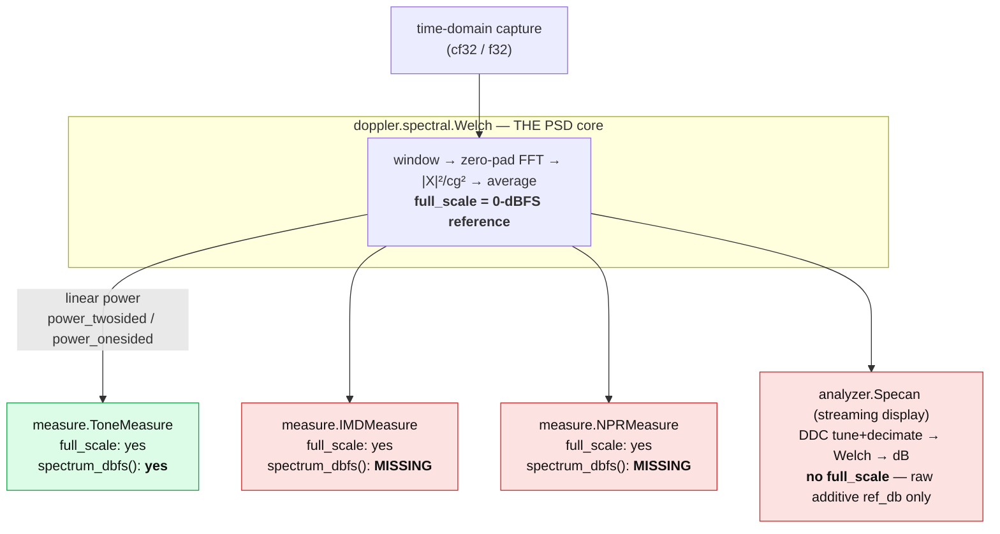

# Spectral & Measurement API Map

A snapshot of how doppler's spectral surface fits together after the
`time -> one PSD core -> measurements` re-architecture, **plus the two gaps**
the unification still has to close. This is a working reference; it will be
updated to the unified end state once the gaps are filled.

## Core data flow

A single PSD core (`spectral.Welch`) produces the averaged power spectrum, and
every measurement analyzer and the streaming display consume it.

## Where the dBFS reference lives (single source of truth)

`full_scale` (the amplitude that reads 0 dBFS) is computed in **one** place —
the `Welch` core — and threaded through the measure analyzers. `Specan` is the
outlier: it carries a free-floating additive `ref_db` instead, so dBFS has two
representations today.

| API | dBFS knob | display-spectrum method | notes |
| --- | --- | --- | --- |
| `spectral.Welch` | `full_scale` (yes) | `psd_db` / `psd_dbhz` | the core; dBFS computed here once |
| `measure.ToneMeasure` | `full_scale` (yes) | `spectrum_dbfs(x)` (yes) | reads dBFS from its own Welch |
| `measure.IMDMeasure` | `full_scale` (yes) | missing | demo hand-rolls instead |
| `measure.NPRMeasure` | `full_scale` (yes) | missing | demo hand-rolls instead |
| `analyzer.Specan` | none (no `full_scale`) | `execute()` -> dB | raw additive `ref_db` only; not tied to the core's dBFS ref |

## What the gallery demos hand-roll vs. doppler-native

| Demo | signal generation | spectrum backdrop | status |
| --- | --- | --- | --- |
| `measure_demo.py` (ToneMeasure) | `np.sin` + `np.random`, quantised via `cvt.ADC` | `m.spectrum_dbfs()` (doppler-native) | backdrop OK; signal gen still numpy |
| `measure_imd_npr_demo.py` (IMD/NPR) | `np.sin`, two-tone polynomial, `np.fft.irfft` noise | hand-rolled `periodogram_dbfs()` (`np.kaiser`->`rfft`->/cg&sup2;->fold->dB) | both numpy; backdrop duplicates the core |

(The NPR theory curve is pure analytic math — the Gray-Zeoli / MT-005 reference —
not DSP, so it stays.)

`wfmgen` (`doppler.wfm`) already provides the native generators the demos would
use instead of numpy: `tone`, `noise`, `chirp`, `bpsk`, `qpsk`, `pn`, `bits`,
`rrc_taps`, `dsss_spread`, plus `Synth` / `Composer`.

## The two gaps to close

1. **`spectrum_dbfs` missing on `IMDMeasure` / `NPRMeasure`.** Only `ToneMeasure`
   exposes it, so `measure_imd_npr_demo.py` re-implements the window->FFT->power
   the core already does. The C cores already own the `welch` psd + the
   two-sided accessor, so adding the method mirrors `ToneMeasure`.
2. **`Specan` uses `ref_db` instead of the core's `full_scale`.** The streaming
   display doesn't share the dBFS reference the rest of the stack uses; adding a
   `full_scale` knob that flows into its `Welch` would make dBFS single-sourced.

## See also

- [Power Spectra & Measurements guide](../guide/spectral-psd.md)
- [Measurement Suite design guide](measurement-suite.md)
- [Python: spectral API](../api/python-spectral.md) /
  [measurement API](../api/python-measure.md) /
  [analyzer API](../api/python-analyzer.md)
