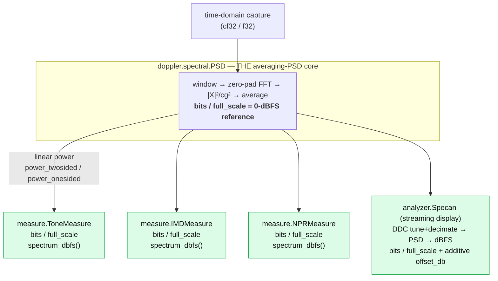

# Spectral & Measurement API Map

How doppler's spectral surface fits together after the
`time -> one PSD core -> measurements/display` re-architecture: a single
averaging-PSD core (`spectral.PSD`) produces every spectrum, and the dBFS
reference is defined exactly once, in that core.

## Core data flow

## The dBFS reference — one source of truth

`bits` is the ergonomic ADC knob: `bits>0` sets `full_scale = 2**(bits-1)` in
`psd_create`, the **only** place that conversion lives. `full_scale` remains the
analog/general alternative. Every consumer forwards `bits`/`full_scale` into its
`PSD` and reads the resolved reference back as `psd->full_scale` — none of them
re-derive it.

| API                   | dBFS knob             | display-spectrum method | notes                                                       |
| --------------------- | --------------------- | ----------------------- | ----------------------------------------------------------- |
| `spectral.PSD`        | `bits` / `full_scale` | `psd_db` / `psd_dbhz`   | the core; `bits` resolves to `full_scale` here, once        |
| `measure.ToneMeasure` | `bits` / `full_scale` | `spectrum_dbfs(x)`      | reads `psd->full_scale` in the metric kernels               |
| `measure.IMDMeasure`  | `bits` / `full_scale` | `spectrum_dbfs(x)`      | same                                                        |
| `measure.NPRMeasure`  | `bits` / `full_scale` | `spectrum_dbfs(x)`      | same                                                        |
| `analyzer.Specan`     | `bits` / `full_scale` | `execute()` -> dBFS     | `offset_db` is an additive offset on top of dBFS (e.g. dBm) |

`bits=B` is byte-identical to `full_scale=2**(B-1)` everywhere.

## Demos are doppler-native

The `measure_demo.py` / `measure_imd_npr_demo.py` gallery demos drive the
analyzers with `bits=`, draw their spectrum backdrop from the analyzer's own
`spectrum_dbfs()` (no hand-rolled periodogram), generate tones with the
`source.LO` NCO, and quantise with `cvt.ADC`. Only the device-under-test models
that have no doppler primitive stay explicit numpy — the two-tone polynomial
nonlinearity, the carved-notch noise shaping, and the analytic Gray-Zeoli /
MT-005 NPR reference curve — and they are labelled as such.

## See also

- [Power Spectra & Measurements guide](../guide/spectral-psd.md)
- [Measurement Suite design guide](measurement-suite.md)
- [Python: spectral API](../api/python-spectral.md) /
    [measurement API](../api/python-measure.md) /
    [analyzer API](../api/python-analyzer.md)
