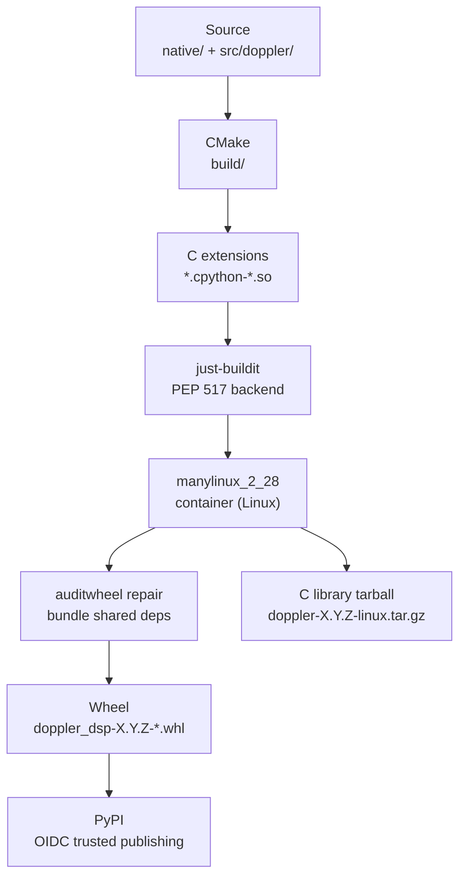

# Build & Delivery Internals

This page explains *how* the build and release pipeline works — the stack
that turns source into a published wheel and a standalone C library tarball.
See [Release](release.md) for the step-by-step checklist.

______________________________________________________________________

## Overview



______________________________________________________________________

## CMake layer

All build output goes to `build/` — never to the repo root.

### Key flags

| Flag                 | Default        | Purpose                                               |
| -------------------- | -------------- | ----------------------------------------------------- |
| `BUILD_PYTHON`       | `OFF`          | Build CPython extensions (`make pyext` sets it `ON`)  |
| `DOPPLER_NATIVE`     | `OFF`          | Enable `-march=native` (`make blazing` sets it `ON`)  |
| `CMAKE_BUILD_TYPE`   | `Release`      | `Debug` / `Release` / `RelWithDebInfo`                |
| `Python3_EXECUTABLE` | uv venv python | Must match the interpreter that will import the `.so` |

### `PYTHON_EXECUTABLE` matters

The CPython C extension suffix encodes the Python version and ABI tag
(e.g., `cpython-313-x86_64-linux-gnu`). If CMake finds a different interpreter
than the one in your active venv, the compiled `.so` will not be importable.
The Makefile resolves this with:

```makefile
PYTHON_EXECUTABLE ?= $(shell uv run python -c 'import sys; print(sys.executable)')
PYTHON_EXECUTABLE := $(or $(JUST_BUILDIT_PYTHON),$(PYTHON_EXECUTABLE))
```

`JUST_BUILDIT_PYTHON` is set by the wheel backend so wheel builds always
compile against the right version.

### Make targets

| Target            | What it does                                          | When to use          |
| ----------------- | ----------------------------------------------------- | -------------------- |
| `make build`      | Configure + build C library only                      | C-layer work         |
| `make pyext`      | Reconfigure with `BUILD_PYTHON=ON`, build extensions  | Python API work      |
| `make just-build` | PEP 517 hook: `pyext` + copy `src/doppler/` to output | Wheel backend only   |
| `make blazing`    | Clean + Release + `-march=native`                     | Local perf profiling |

!!! warning "Never package a native build"

    `make blazing` produces an AVX-512-capable binary tuned to the build host.
    The release pipeline gates on an `objdump` scan that rejects any wheel
    containing non-dispatched wide-SIMD instructions. Portability default is
    `x86-64-v2` (SSE4.2), matching what every released wheel ships.

### Build artifacts

```
build/libdoppler.so          shared C library
build/libdoppler.a           static C library (C++-free, symbol-verified)
src/doppler/**/*.cpython-*.so  Python extensions (copied from build/ by pyext)
```

______________________________________________________________________

## just-buildit wheel backend

`pyproject.toml` declares just-buildit as the PEP 517 build backend:

```toml
[build-system]
requires = ["just_buildit"]
build-backend = "just_buildit"

[tool.just-buildit]
command = "make just-build"
editable_path = "src"
```

When `python -m build --wheel` (or `uv build`) runs:

1. just-buildit sets `JUST_BUILDIT_OUTPUT_DIR` and `JUST_BUILDIT_PYTHON`.
1. It calls `make just-build`, which runs `make pyext` then copies
    `src/doppler/` (including the freshly built `.so` files *and* the
    `examples/` directory) into the output staging area.
1. just-buildit packages the staged tree into a wheel and writes it to
    `dist/`.

The `--no-group docs` flag in `UV_SYNC_FLAGS` ensures the docs dependency
group is never installed during a wheel build — a docs network blip must
not break packaging.

### OIDC trusted publishing

PyPI is configured with GitHub's OIDC trusted publisher for the
`doppler-dsp/doppler` repository. No `PYPI_TOKEN` secret is needed;
`release.yml` uses `id-token: write` permission and the `publish-python`
job authenticates via a short-lived OIDC token. If PyPI rejects the
upload, check the trusted publisher configuration in the PyPI project
settings, not the repository secrets.

______________________________________________________________________

## manylinux & auditwheel (Linux wheels)

Linux wheels must satisfy PEP 600 symbol-version constraints so they run on
distributions older than the build host. `release.yml` builds inside the
`quay.io/pypa/manylinux_2_28_x86_64` Docker image (glibc 2.28, GCC 12),
which sets the minimum runtime floor.

After the build, `auditwheel repair` inspects the wheel, bundles any shared
libraries beyond the manylinux allow-list (e.g., libzmq), and retags the
wheel as `manylinux_2_28_x86_64`.

macOS wheels are built natively on a `macos-14` (arm64) GitHub runner using
`delocate` for the equivalent bundle-and-retag step.

### Portability gate

Every wheel is scanned for non-dispatched wide-SIMD instructions:

```bash
bad=$(objdump -d "$so" | awk '
  /vmovaps|vfmadd|vaddps/ && /ymm|zmm/ { print }
' | grep -v '_avx2\|_avx512')
[ -z "$bad" ] || { echo "AVX leak: $bad"; exit 1; }
```

Runtime-dispatched variants (function names containing `_avx2` or `_avx512`)
are exempted. Anything else that touches `ymm`/`zmm` registers fails the
release.

______________________________________________________________________

## CI pipeline

`ci.yml` runs on every push to `main`/`develop` and on all pull requests.

| Job                                           | What it tests                                                                       | Acts as gate for                                 |
| --------------------------------------------- | ----------------------------------------------------------------------------------- | ------------------------------------------------ |
| `build-and-test` (Ubuntu 22.04, 24.04, macOS) | CMake build, CTest, C example smoke tests, C++-free symbol check, static-link smoke | C layer correctness                              |
| `python` (3.9–3.14)                           | `make pyext`, pytest, `--doctest-glob` on `.pyi` stubs, Python example smoke tests  | Python API and bindings                          |
| `glibc-228` (Debian 10 buster)                | Imports the built extension                                                         | glibc symbol floor (catches `GLIBC_2.29+` leaks) |
| `manifest-drift`                              | `jm status --check`                                                                 | jm TOML matches generated files                  |
| `ci-passed`                                   | Aggregates all required jobs                                                        | Required by `release.yml verify-ci`              |

The `ci-passed` aggregator job is what `release.yml` polls. It exists so
the release pipeline has a single stable job name to wait on, regardless of
how many individual jobs are added or renamed in the future.

______________________________________________________________________

## Release pipeline

`release.yml` triggers on a version tag push (`v*.*.*`). It does **not**
re-run tests — it trusts that the PR CI gate was green.

| Job                               | What it does                                                                                                    | If it fails                                                                              |
| --------------------------------- | --------------------------------------------------------------------------------------------------------------- | ---------------------------------------------------------------------------------------- |
| `verify-version`                  | Asserts tag == `pyproject.toml` == `Cargo.toml` == `CMakeLists.txt`                                             | Run `make bump-version VERSION=X.Y.Z` consistently across all three files before tagging |
| `verify-ci`                       | Polls for `ci-passed` on the tagged commit SHA                                                                  | The tagged commit must have a green CI run; check GitHub Actions on that SHA directly    |
| `build-python`                    | Builds 6 Python × 2 platform wheels (Linux manylinux + macOS arm64), runs portability gate                      | Fix any `-march=native` leak or C compile error; re-tag after fixing                     |
| `build-sdist`                     | Source tarball                                                                                                  | Rare; check `pyproject.toml` `[tool.setuptools]` include list                            |
| `build-c-linux` / `build-c-macos` | Standalone C library tarballs (`lib/` layout, not `lib64/`)                                                     | CMake install target; check `cmake --install` output                                     |
| `smoke-wheel`                     | Pip-installs the cp312 Linux wheel into a clean venv; runs `deploy/validation/wfm_e2e.py` from a temp directory | Python API regression; check what `wfm_e2e.py` exercises                                 |
| `publish-python`                  | Uploads all wheels + sdist to PyPI via OIDC                                                                     | Check PyPI trusted publisher config; once published, the version cannot be replaced      |
| `github-release`                  | Creates GitHub Release with auto-generated notes; attaches all wheel + C tarball artifacts                      | Permissions; check `GITHUB_TOKEN` has `contents: write`                                  |
| `smoke-c`                         | Downloads the just-published C tarball; runs `cmake find_package` and `pkg-config` smoke tests                  | CMake install layout or `pkg-config` `.pc` file                                          |

______________________________________________________________________

## Troubleshooting

### AVX-512 portability failure in `build-python`

Symptom: `objdump` scan finds `ymm`/`zmm` instructions outside
`_avx2`/`_avx512` function names.

Cause: A CMake target or a vendored library was compiled with `-march=native`
(or a flag like `-mavx2` applied globally).

Fix:

```bash
grep -r "march=native\|mavx2\|mavx512" native/ CMakeLists.txt
# remove the offending flag, or gate it on DOPPLER_NATIVE
cmake -B build -DDOPPLER_NATIVE=OFF && cmake --build build
```

### GLIBC symbol floor broken (`glibc-228` job fails)

Symptom: `ImportError: GLIBC_2.29 not found` inside the Debian 10 container.

Cause: A new syscall wrapper or libc function (e.g., `close_range`, `statx`)
was called directly or pulled in by a dependency.

Find the culprit:

```bash
nm build/libdoppler.so | grep 'GLIBC_2\.29\|GLIBC_2\.3[0-9]'
```

Fix: add a shim or avoid the high-version symbol; check what vendored code
added the call.

### jm version skew (`manifest-drift` job fails)

Symptom: `jm status --check` reports drift that you cannot reproduce locally.

Cause: Your local `jm` CLI version differs from the pinned `jm_version` in
`just-makeit.toml`.

Fix: always drive doppler with the pinned version:

```bash
JM_VERSION=$(grep jm_version just-makeit.toml | grep -oP '"\K[^"]+')
uvx --from "just-makeit==$JM_VERSION" just-makeit status --check
```

### `verify-ci` times out

Symptom: `release.yml` polls for `ci-passed` but never finds it.

Cause: The CI run on the tagged commit either never ran, is still in progress,
or failed. `verify-ci` polls the *tagged commit SHA* — if CI ran on the PR
branch's HEAD but the merge produced a different SHA, the poll never finds it.

Fix: check `https://github.com/doppler-dsp/doppler/actions` filtered to the
tagged SHA. If CI failed, fix the issue and re-tag (see below).

### Re-running a failed release

If `release.yml` fails *before* `publish-python`, it is safe to delete the
tag, fix the issue, and re-tag:

```bash
git push origin :refs/tags/vX.Y.Z  # delete remote tag
git tag -d vX.Y.Z                   # delete local tag
# fix the issue, then:
make tag-release VERSION=X.Y.Z      # re-tag and push
```

!!! danger "Do not re-tag after publish"

    Once `publish-python` has uploaded to PyPI, the version is immutable.
    A re-tag would re-run `github-release` but not PyPI (which would
    reject a duplicate). Publish a patch release instead.

______________________________________________________________________

## Replicating the wheel build locally

To build a Linux manylinux wheel identical to what CI produces:

```bash
# Run in the manylinux container (same image CI uses):
docker run --rm -v $PWD:/src -w /src \
  quay.io/pypa/manylinux_2_28_x86_64 \
  bash -c "
    /opt/python/cp312-cp312/bin/pip install uv &&
    JUST_BUILDIT_PYTHON=/opt/python/cp312-cp312/bin/python3 \
    make just-build JUST_BUILDIT_OUTPUT_DIR=/tmp/out &&
    uvx auditwheel repair /tmp/out/*.whl -w dist/
  "

# Verify the built wheel:
pip install dist/doppler_dsp-*.whl --force-reinstall
python -c "import doppler; print(doppler.__version__)"
```

For a quick local wheel without manylinux constraints (dev iteration):

```bash
uv build --wheel
pip install dist/doppler_dsp-*.whl --force-reinstall
```
