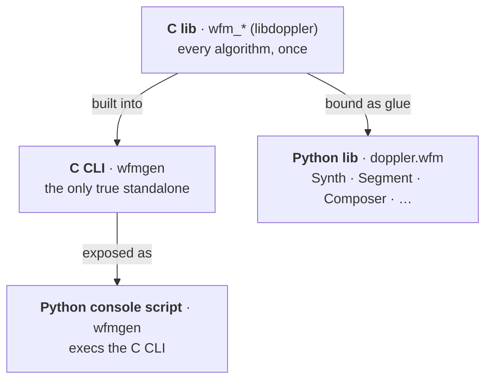

# wfmgen — User API: Surface, Target & Decisions

!!! note "Status: design note for the 0.11.0 API cleanup"

    Captures the agreed target so the consolidation PRs execute against one
    spec. Lands **before** the 0.11.0 composition release. Decisions marked
    **decided** are ratified; **proposed** awaits sign-off.

    **Update:** the surface has since grown ranged numeric fields. See
    [0.23.0 Status](#0230-status) at the bottom for what shipped beyond this
    note.

## The model

doppler is C-first: every algorithm lives in C once, and everything else is a
thin face. The waveform generator is four pieces over one core:



- **C lib** — the algorithms (`wfm_synth` engine + the `wfm_*` composer), once.
- **Python lib** (`doppler.wfm`) — *just glue* over the C lib.
- **C CLI** (`wfmgen`) — the one standalone executable (the composer superset).
- **Python console script** (`wfmgen`) — a tiny `os.execv` shim over the
    bundled C binary; **no CLI logic in Python**.

### Naming: the `wfm` umbrella

One prefix ties the whole subsystem together — `wfm` (waveform). Each Python
name mirrors its C backing at the same level.

| Layer                     | Name                                                                                    | Was                           |
| ------------------------- | --------------------------------------------------------------------------------------- | ----------------------------- |
| Python package            | **`doppler.wfm`** *(submodules `wfm.synth`/`wfm.compose`/`wfm.io`, re-exported at top)* | `doppler.wfm`                 |
| C symbol prefix           | **`wfm_*`** — engine `wfm_synth`, `wfm_compose`, `wfm_resolve`, `wfm_writer`, …         | mixed `synth_*` + `wfm_*`     |
| C CLI + console script    | **`wfmgen`**                                                                            | `wfmgen` (C) / `wavegen` (py) |
| engine                    | C `wfm_synth` · Python `wfm.synth` → class **`Synth`**                                  | `synth` · `Synth`             |
| composition / I/O classes | `Composer` · `Segment` · `Timeline` · `Writer` · `Reader` · `StreamSink`                | (same)                        |

## Decisions

| #   | Decision                                                                                                                                       | Status  | Rationale                                                                                                                                                                                                                                                                                                    |
| --- | ---------------------------------------------------------------------------------------------------------------------------------------------- | ------- | ------------------------------------------------------------------------------------------------------------------------------------------------------------------------------------------------------------------------------------------------------------------------------------------------------------ |
| D0  | **The `wfm` umbrella** — one prefix across C/CLI/Python (see the table above). All C symbols `wfm_*`; rename engine `synth` → **`wfm_synth`**. | decided | One name ties the subsystem together; each Python name mirrors its C backing at the same level.                                                                                                                                                                                                              |
| D1  | One CLI: a C binary named **`wfmgen`** (the composer superset).                                                                                | decided | A 1-segment run *is* today's single-shot, byte-for-byte — ship the superset; `wfmgen` keeps the `wfm` prefix (supersedes the earlier `wavegen` pick).                                                                                                                                                        |
| D2  | The `wfmgen` **console-script** is a thin `os.execv` shim over the bundled C binary.                                                           | decided | No CLI logic in Python; one implementation, in C.                                                                                                                                                                                                                                                            |
| D3  | **Drop** the pep723 `wavegen.py`.                                                                                                              | decided | It is a second Python reimplementation; cut for one-CLI purity.                                                                                                                                                                                                                                              |
| D4  | One waveform object: **`Synth`** (`doppler.wfm.Synth` ↔ C `wfm_synth`). `Source` is removed.                                                   | decided | The namespace carries the `wfm` identity, so the class stays the meaningful `Synth`; the object *is* the generator. **Spike-validated** (thin Python `Synth`, lazy C engine): generate + compose byte-identical, and composing spins **zero** engines (reads the config tuple), so the lazy wrapper is free. |
| D5  | Ship the `wfmgen` C binary in the wheel (package data) + build it in `cibuildwheel`.                                                           | decided | Only ~820 KB, self-contained (static NATS client); cost is wheel plumbing, not bytes.                                                                                                                                                                                                                        |
| D6  | Land the consolidation **before** 0.11.0.                                                                                                      | decided | The feature release ships the clean model + accurate docs.                                                                                                                                                                                                                                                   |
| D7  | One import path: re-export everything at **`doppler.wfm`**.                                                                                    | decided | Part of the umbrella; today `Synth` is at the package but `Composer/Segment/…` are only under `.compose`.                                                                                                                                                                                                    |
| D8  | Rename builder/method params for consistency: `noise(nf=)` → `noise(level=)`; `Segment.sum(n=)` → `num_samples=`.                              | decided | `level` and `num_samples` are used everywhere else.                                                                                                                                                                                                                                                          |
| D9  | Hide `Synth`'s ~12 jm `get_*`/`set_*` state accessors from the public surface.                                                                 | decided | Internal engine state; falls out of the `Synth` Python-wrapper rework (D4).                                                                                                                                                                                                                                  |
| D10 | Rename the Python package `doppler.wfm` → **`doppler.wfm`**.                                                                                   | decided | The umbrella name; breaking import change (pre-1.0; do it now).                                                                                                                                                                                                                                              |

The composition **verbs** are settled and unchanged: `Segment.sum()` mixes
sources at the same time (one noise floor); `Segment.add()` sequences segments
in time. No `+`/`-` operators.

## Current surface (baseline)

### A · CLI flags (`wavegen`/`wfmgen`)

| Group                   | Flags                                                                                   |
| ----------------------- | --------------------------------------------------------------------------------------- |
| engine                  | `--type --fs --freq --snr --snr-mode --seed --sps --pn-length --pn-poly --lfsr --count` |
| compose *(wfmgen-only)* | `--from-file --level --off --repeat --continuous`                                       |
| amplitude               | `--headroom --clip-report --clip-error`                                                 |
| output                  | `--sample-type --file-type --endian --output/-o --record --fc`                          |
| realtime                | `--realtime --realtime-resync --detached`                                               |

### B · Python `doppler.wfm`

| Symbol                                                                          | Import        | Role                                  | Key surface                                                                                  |
| ------------------------------------------------------------------------------- | ------------- | ------------------------------------- | -------------------------------------------------------------------------------------------- |
| `Synth(type, fs, freq, snr, snr_mode, seed, sps, pn_length, pn_poly, lfsr)`     | `doppler.wfm` | live single-waveform engine           | `.step()` · `.steps(n)` · `.reset()` *(+ ~12 jm `get_*`/`set_*`)*                            |
| `tone() bpsk() qpsk() pn() noise(nf=)`                                          | `.compose`    | builders → `Source`                   | return a `Source`                                                                            |
| `Source(type, freq, snr, snr_mode, seed, sps, pn_length, pn_poly, lfsr, level)` | `.compose`    | untimed waveform spec (no `fs`/state) | —                                                                                            |
| `Segment(…, num_samples, off_samples, sources)`                                 | `.compose`    | timed; 1+ sources                     | `.sum(*sources, n, off, fs)` · `.add(*others)`                                               |
| `Timeline(segments)`                                                            | `.compose`    | segments in time                      | `.add(*segments)`                                                                            |
| `Composer(segments\|Timeline\|Segment, *, repeat, continuous)`                  | `.compose`    | driver → samples                      | `.compose()` · `.execute(n)` · `.stream()` · `.to_json()` · `.from_json()` · `.from_file()`  |
| `Writer(path, *, file_type, sample_type, endian, fs, fc, total, headroom)`      | `.compose`    | container writer                      | `.write()` · `.track_clipping()` · `.peak_dbfs` · `.clip_fraction` · `.clipped` · `.close()` |
| `StreamSink(endpoint, *, sample_type)`                                          | `.compose`    | nats:// publisher                     | `.send(iq, fs, fc)` · `.close()`                                                             |
| `Reader(path, *, sample_type, endian)`                                          | `.compose`    | container reader                      | `.read()` · `.read_all()` · props                                                            |
| `read_iq(path, sample_type, endian, *, raw)`                                    | `.readback`   | one-shot file read                    | —                                                                                            |
| `SampleClock(fs, *, resync)`                                                    | `.compose`    | real-time pacing                      | `.pace(n)` · `.stamp()` · `.reset()` · props                                                 |
| `mls_poly` · `rrc_taps` · `dsss_spread` · `sigmf_meta` · `write_blue_header`    | `.compose`    | DSP / format helpers                  | —                                                                                            |
| `PN` · `bpsk_map` · `qpsk_map` · `wfm_awgn_amplitude` · `wfm_ebno_to_snr_db`    | `doppler.wfm` | low-level primitives                  | —                                                                                            |

## Target surface (0.11.0)

Same as the baseline, under the `wfm` umbrella (D0), with these deltas:

- **One CLI** `wfmgen` (the composer; all flags above, with `--from-file` etc.
    no longer "wfmgen-only").
- **One waveform object** `Synth` — config + `.steps()`/`.step()`/`.reset()` +
    usable directly in `Segment.sum(Synth(...), …)`. `Source` removed; builders
    `tone()/qpsk()/pn()/bpsk()/noise()` return `Synth`. `Synth` becomes a thin
    **Python** object that lazily spins the C engine (so composing N synths does
    not allocate N engines), and the raw jm C type + its `get_*`/`set_*` go
    internal (D9).
- **One import path** (D7): `from doppler.wfm import Synth, Segment, Timeline, Composer, Writer, StreamSink, Reader, tone, qpsk, …`.
- **Consistent params** (D8): `noise(level=)`, `Segment.sum(num_samples=)`.

Target waveform usage:

```python
from doppler.wfm import Synth, Segment, Composer, Writer, qpsk, tone

Synth(type="qpsk", snr=12).steps(4096)            # direct: generate now
scene = Segment.sum(                              # compose: same object
    qpsk(snr=15, level=-10),                      #   builders return Synth
    tone(freq=2e5),
    num_samples=65536,                            #   (was n=)
)
Composer(scene).compose()
```

## Breaking changes / migration (pre-1.0, allowed)

| Was                                                                    | Now                                      |
| ---------------------------------------------------------------------- | ---------------------------------------- |
| `from doppler.wfm import …` / `…wfmgen.compose import Source, qpsk, …` | `from doppler.wfm import Synth, qpsk, …` |
| `Source(...)` / builder → `Source`                                     | `Synth(...)` / builder → `Synth`         |
| `noise(nf=-20)`                                                        | `noise(level=-20)`                       |
| `Segment.sum(*srcs, n=4096)`                                           | `Segment.sum(*srcs, num_samples=4096)`   |
| pep723 `wavegen.py` / Python-implemented `wavegen`                     | removed; `wfmgen` CLI + `os.execv` shim  |
| C `synth_*`                                                            | C `wfm_synth_*`                          |

## Execution plan

Riskiest gate first (the jm drift gate), each step its own PR:

1. **The `wfm` rename** (D0/D10) — `synth_*` → `wfm_synth_*` (C); package
    `doppler.wfm` → `doppler.wfm`; reconcile `objects/`, `just-makeit.toml`
    (module name), and keep **`jm status --check` green**.
1. **jm-app removal** — delete the single-shot `wavegen` jm app + the
    Python CLI (`doppler.wfm.cli`) + `wavegen.py`; the C `wfmgen` composer
    binary becomes the one CLI.
1. **Wheel-ship + shim** (D2/D5) — package the `wfmgen` binary as data; the
    `wfmgen` console-script `main()` `os.execv`s it; wire `cibuildwheel` to
    build/bundle it across `cp39–cp314` × {linux, macos}.
1. **`Synth` unification** (D4/D9) — fold `Source` into a thin Python `Synth`;
    builders return `Synth`; `Segment.sum` accepts `Synth`; hide accessors.
1. **Import unification + param renames** (D7/D8).
1. **Docs** — rewrite guide/gallery to the four-box model + one CLI; update the
    two diagrams; flip examples to the unified `Synth` + single import.
1. **Cut 0.11.0** (the existing release checklist).

## 0.23.0 Status

The model and CLI/library surface above are as built. One capability has been
added since this note that the original design did not anticipate: **ranged
numeric fields**.

Every numeric segment/source field that the composer resolves per repeat —
`freq`, `f_end`, `snr`, `level`, `num_samples`, `off_samples` — now accepts
either a scalar (as before) **or** a `[lo, hi]` pair drawn **uniformly** on each
segment repeat:

- **JSON / `--from-file` / `--record`** — the field value is either a number or
    a two-element `[lo, hi]` array. `--record` round-trips the *range*, not a
    realized draw.
- **CLI** — the corresponding flag accepts `LO:HI` in place of a scalar
    (`--freq 11200:12800`, `--off 4000:5600`, `--snr 8:14`, `--level -12:-3`); a
    bare number is unchanged.
- **Python library** — the generated `Synth`/`Segment` accept a `tuple`
    `(lo, hi)` wherever they accept a scalar, e.g. `Synth(freq=(9000, 14000))`
    or `Segment(freq=(11200, 12800), off_samples=(4000, 5600))`. The getter
    returns a `tuple` when ranged, a scalar otherwise. This is generated glue
    (jm composer codegen), not a hand Python wrapper — consistent with the
    "Python is just glue" rule above.

**Reproducibility is preserved without RNG state.** Each draw is a
splitmix64 hash of `(seed, repeat index, segment index, source index, field)`,
so a recorded spec replays the identical sequence of draws byte-for-byte; this
is why `--record` stores the range rather than a sampled value. Ranges compose
with the advancing-seed fresh-noise behaviour (the noise re-rolls *and* the
parameters move) and with `chirp` (start/end can each be a range independently —
a deterministic sweep whose endpoints jitter per burst).

This is what powers the realtime DSSS demo's per-burst Doppler offset and code
phase: one looping burst segment with `freq: [lo, hi]` and a jittered
`off_samples: [lo, hi]` trailing gap.

The original 0.11.0 decisions above remain accurate; ranged fields are purely
additive (a scalar field is byte-identical to its pre-0.23.0 behaviour).
