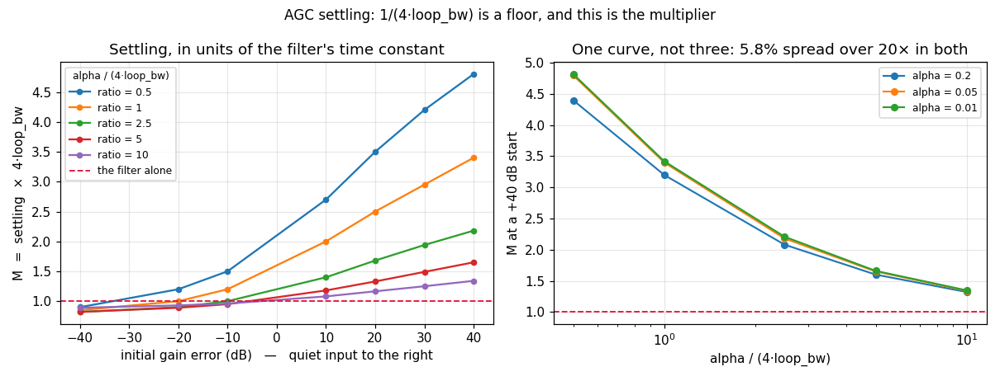

# AGC Settling — a design chart



## What you're seeing

**How long to wait for an AGC to settle**, as something you can read off
rather than guess at.

`agc_core.h` gives the loop *filter* a time constant of `1/(4·loop_bw)`
samples. The object is not the filter: the power detector sits **inside**
the loop and measures in *power*, so a quiet input's dB reading crawls up a
concave log. `1/(4·loop_bw)` is therefore a **floor**, and anything derived
from it alone — a receiver's warm-up budget, say — is optimistic.

The left panel is the multiplier that turns the floor into an answer:

```text
settling  ≈  M / (4 · loop_bw)   samples
```

The crimson line at `M = 1` is the filter alone. Every curve rises above it
to the right, because a **quiet** input is the slow case: at the widest
separation measured, a cold loop needing +40 dB of gain takes **4.8×** what
its filter predicts.

## Why the family is indexed by one number

`M` is not a free function of both `alpha` and `loop_bw`. It depends on the
initial gain error and on one dimensionless group — how fast the detector
is relative to the filter:

```text
ratio  =  alpha / (4 · loop_bw)
```

The right panel is that claim under test. Three `alpha` values spanning 20×,
each paired with the `loop_bw` that holds the ratio fixed, land on **one
curve to within 5.8%**. That is what makes the left panel a chart rather
than a table: measure it once, read it at any bandwidth.

The example asserts this rather than asserting it in prose — if the spread
exceeds 10% the script fails, because at that point the chart cannot be read
at an arbitrary bandwidth and should not be published as if it could.

## Using it

1. Pick `loop_bw` from the disturbance you must track, and `alpha` from how
    hard the envelope needs smoothing. Form `ratio = alpha / (4·loop_bw)`.
1. Take the largest gain error you expect to **start** from. For a cold
    receiver that is the whole input dynamic range it must cover, not the
    steady-state variation.
1. Read `M` off the left panel and multiply by `1/(4·loop_bw)`.

Worked, for the shipped `MPSK_RX_AGC_ALPHA = 0.01` at `bn_agc = 5e-4`:
`ratio = 0.01/(4·5e-4) = 5`, so a +40 dB cold start costs `M = 1.65` — about
`1.65/(4·5e-4)` ≈ **825 samples**, against the 500 the filter alone would
suggest.

The script closes by predicting a configuration that built none of the
curves — `loop_bw = 0.004`, `alpha = 0.02`, a +25 dB start — and checking the
measurement against it. Predicted `M = 2.73`, measured `2.48`, 9% out. A
design guide that has never been used to predict anything is a picture.

## The direction nobody budgets for

The `−40 dB` column sits slightly **below** the floor: a loud input settles
marginally faster than the filter predicts, because the detector's EMA
climbs quickly in dB while the power is rising. It is real, it is small, and
it is the wrong direction to plan around — which is why the chart is drawn
with the quiet end on the right.

```python
--8<-- "src/doppler/examples/agc_settling_design_demo.py:chart"
```

## Related

- [AGC design](../design/agc.md) — §2.2 for why the detector stays in the
    power domain, and §6 for the header claim this measurement corrected
- [AGC validation report](https://github.com/doppler-dsp/doppler/blob/main/src/doppler/agc/tests/validation/agc/results.md)
    — §2.1 measures the same asymmetry as a certified limit
- [Python AGC API](../api/python-agc.md)

```console
python src/doppler/examples/agc_settling_design_demo.py   # → agc_settling_design.png  (~1 s)
```
