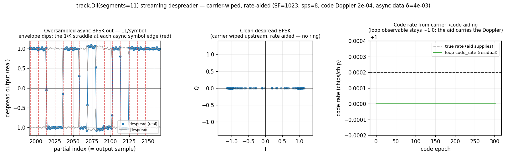
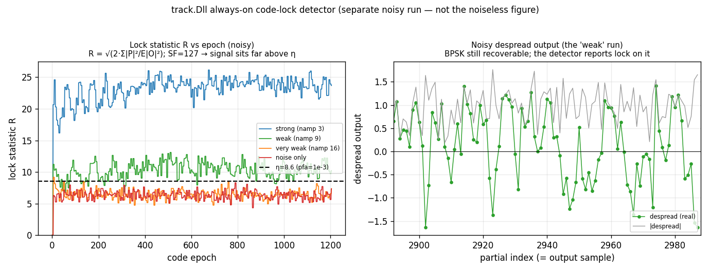

# Streaming Async Despreader



A [`track.Dll`](../api/python-track.md) in **segments** mode — the streaming
DSSS despreader. Its one job is to **remove the PN code and output samples**.
The data symbols ride on a clock that is *asynchronous* to the code epoch; that
is merely why it despreads in `K` sub-epoch **partial** correlations, so a
mid-epoch data flip cannot collapse the code-tracking discriminator. Carrier
recovery and symbol-timing recovery are **downstream** problems — the despreader
leaves the residual carrier on its output. SF = 127 chips, 8 samples/chip,
`segments = 4`, a small residual carrier, and a data clock offset 4e‑3 from the
code epoch.

## What you're seeing

**Left — Oversampled asynchronous BPSK out.** The despread partial stream at
`K = 4` samples/symbol (after a downstream carrier wipe, for clarity), with the
`|despread|` envelope (gray) drawn so the amplitude is explicit. The symbol edges
(red, dashed) **slide** through the partial grid because the symbol clock is
independent of the code clock — that is the "async" in the name.

The **amplitude modulation** on the envelope is worth understanding — it is
*code-loop* behaviour, not the carrier (a magnitude is carrier-blind) or noise:

- **Per-symbol dips (the deep notches).** Each async symbol transition lands
    inside *exactly one* partial per symbol; that partial integrates two
    opposite-sign data halves, so it is scaled by `|2f−1|` (`f` = where the edge
    falls in the partial — deepest when mid-partial). The other `K−1` partials are
    full. This is the two-clock collapse, **confined to 1-of-`K`** instead of
    wiping a whole epoch — exactly what partial correlation buys you.
- **A slow breathing of the dips** at the symbol↔epoch beat (period `≈ 1/δ`): as
    the edge slides, *which* partial dips and *how deeply* drifts.
- **A gentle overall sag** (the envelope sits a little below 1): the residual
    code-phase tracking error under a code-Doppler offset depresses the prompt
    correlation `R(ε) ≈ 1 − |ε|`. Match the code rate (no Doppler) and the envelope
    is flat at ≈ 1; the sag is a direct **code-tracking-quality** readout.

**Middle — Carrier rides on the output.** The same partials in the complex plane,
*without* the carrier wipe: the two BPSK clusters are smeared into a **ring** by
the residual carrier. The despreader does not touch it — a downstream
[`track.Costas`](costas.md) loop collapses the ring back to ±1.

**Right — Code stays locked under the carrier.** The DLL's non-coherent
`(|E| − |L|)` discriminator works on *envelopes*, so it is **carrier-blind**: the
code-rate estimate rings in and settles onto the true code Doppler with the
residual carrier still on the samples.

*(All three panels above are **noiseless** so the envelope and ring stay legible
— they are one and the same signal.)*

## Always-on lock detector



A tracking channel must always know whether it is locked, so the DLL carries a
lock detector that reuses *acquisition's* non-coherent statistic. This is a
**separate, noisy experiment** (the despread figure above is noiseless; a lock
statistic is only meaningful against noise), so it gets its own figure on its own
signal.

It forms `R = √(2·Σ|P|²/E|O|²)` over `N` looks — prompt power over a CFAR noise
reference taken from a **random off-peak correlation** (re-drawn each epoch,
EMA-averaged) — and latches `Dll.locked` when `R` crosses
`det_threshold_noncoherent(pfa, N)`. **Left:** `R` per epoch at several SNRs; with
SF = 127's ~21 dB despread gain the signal traces sit far above the threshold
even when very weak, while the noise-only trace hugs `√(2N) ≈ 6.3` below it.
**Right:** the noisy despread output behind the "weak" trace — the BPSK is still
recoverable and the detector reports lock on it. Because the noise reference rides
an EMA much longer than the `N`-look test (and is cumulative-mean-bootstrapped so
it is unbiased from the first look), the false-alarm rate holds at the target
`pfa` (default `1e-3`) from the start. The statistic and threshold are the *same*
ones the FFT acquisition uses, so acquire and track agree on "detected".

## How it works

`Dll(segments=K)` splits each code epoch into `K` partial integrate-and-dumps.
Each partial despreads `TE/K` samples against the local code; the `K` partials
per epoch are an oversampled view of the symbol (≈ `K` samples/symbol when the
symbol rate is near the code rate). Code tracking folds each partial's early/late
envelopes into a **non-coherent** epoch sum `Σ|E_k|`, `Σ|L_k|` — a data flip
changes a partial's *sign*, not its *magnitude*, so only the one straddling
segment degrades.

```python
from doppler.track import Dll

# code: 0/1 chips for one period; sps samples/chip; segments = partials/epoch
d = Dll(code, sps=8, init_chip=0.0, bn=0.002, zeta=0.707, spacing=0.5,
        segments=4)
part = d.steps(rx)        # oversampled async BPSK out (PN removed)
rate = d.code_rate        # tracked code rate (carrier-blind)

# always-on lock detector (acquisition's non-coherent test):
d.configure_lock(pfa=1e-3, n_looks=20)   # size n_looks via detection.det_n_noncoh
if d.locked:              # latched each n_looks-look decision
    print(d.lock_stat, d.noise_est)      # statistic R and the CFAR noise ref

# downstream — carrier + symbol recovery on the partials:
from doppler.track import Costas, SymbolSync
# Costas(...).steps(part) -> SymbolSync(...).steps(...) -> bits
```

A short partial window also makes the despread **carrier-tolerant**: for a
½-Doppler-bin residual after acquisition the integrate-and-dump loss is only
~0.2 dB at `K = 4` (versus ~3.9 dB for a full-epoch `segments = 1` prompt), so
the residual carrier rides out on the output for the downstream loop instead of
eroding the despread. `steps()` is block-size invariant and returns an
independent array per call, so a receiver can stream blocks and keep every one.

Source: `src/doppler/examples/async_despread_demo.py`.
See also the design note *Async Symbol Despreader* and the carrier-free
two-clock study `async_despreader_study.py`.
