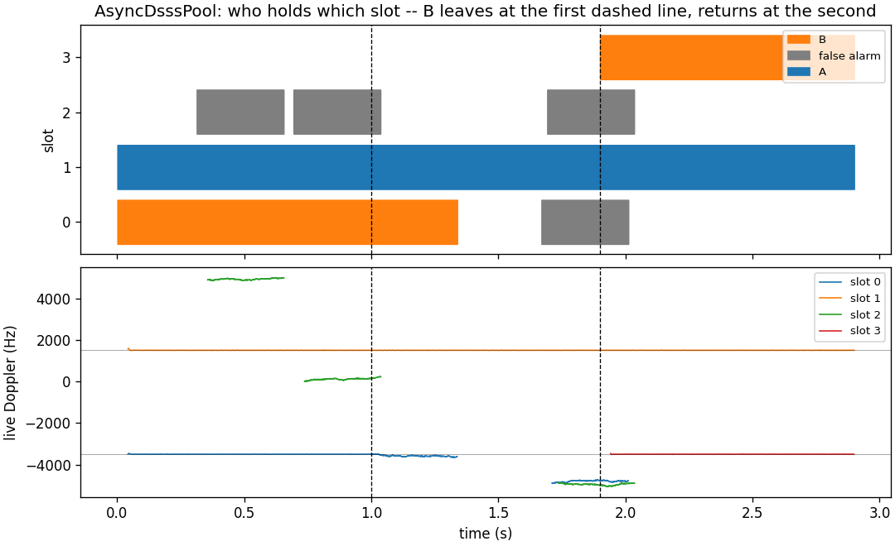

# AsyncDsssPool: the population's lifecycle



Where [AsyncDsssReceiver: the SPEC Waveform](async-dsss-receiver-spec.md)
drives one packaged receiver against one emitter, this page drives the
object that holds the *population*:
[`dsss.AsyncDsssPool`](../api/python-dsss.md), the holder of the
continuous multi-emitter use case in
[the async DSSS receiver design](../design/async-dsss-receiver.md) (§8.2)
— one searcher, a pool of hand-off receivers created idle, the assigned
table, and the event log by attachment, behind a single `push()`.

Two emitters on **one Gold code**, told apart by Doppler and code phase
alone, arrive on one channel. One leaves the air and is released by the
receiver's own rule (both lock flags down for the confirm interval, §10);
it returns and is a *new* detection into whichever slot is free — the one
re-assignment the lifecycle permits. The searcher's false alarms are part
of that lifecycle: at pfa 1e-3 a noise peak seeds a free slot every few
hundred milliseconds, refines to nothing, and is released one interval
later. That is why the figure colours them, and why a slot is an
emitter's **by both coordinates** — its seed within the searcher's row of
the emitter's Doppler *and* within a chip of its code phase — never by a
count. The C twin, `native/examples/async_dsss_pool_demo.c`, manages what
the binding hides: the symbol buffer sized after the first push, the
borrowed log the caller closes.

## The geometry

The operating point of the design's §6.1 at `D = 1`: a 1023-chip Gold
code at 5 Mcps, two samples per chip, asynchronous BPSK at 2700 sym/s;
the searcher epoch by epoch over ±6 kHz, so a Doppler row is one epoch
rate (4.89 kHz) and two emitters two rows apart are two peaks; a release
interval short enough to watch.

```python
--8<-- "src/doppler/examples/async_dsss_pool_demo.py:geometry"
```

## The stimulus is the shipped waveform

Each emitter is the shipped continuous-DSSS `Synth` at its own carrier
offset, clean; the second starts 900 chips into its code (two emitters at
one code phase are one peak to the searcher, and one row to the pool's
zone); the noise is a `type="noise"` Synth scaled by
`wfm_awgn_amplitude` from the C/N0, added once at the sum. B's synth keeps
running while it is off the air — coming back is not restarting.

```python
--8<-- "src/doppler/examples/async_dsss_pool_demo.py:stimulus"
```

## The pool, and reading it back

One `push()` per epoch; after each, every slot's record by value
(`status(slot)`), the symbols it decided on this push (`symbols(slot)`),
and the owner of its seed against the truth.

```python
--8<-- "src/doppler/examples/async_dsss_pool_demo.py:pool"
```

## What the figure shows

- **A** (blue) is seeded in the first epoch and holds one slot for the
    whole run; its live Doppler sits on the truth line.
- **B** (orange) holds slot 0 until it leaves at the first dashed line,
    is released 338 ms later against a 300 ms interval, and after it
    returns at the second dashed line is a new detection into slot 3 —
    its old slot is gone and nothing hands it back.
- The **grey** stints are the searcher's false alarms: each takes a free
    slot for one release interval, its receiver "tracking" noise at some
    Doppler in the lower panel, then is released. Twelve slots for ten
    emitters is the design's headroom for exactly these (§8.2).
- The **event log** carries every transition — seeded, tracking, lost,
    released, seeded again, in order — and its line count equals what the
    pool counted.

The measurement that certifies the pool at the full operating point —
ten emitters through the channel at their own Dopplers, the block-coherent
searcher at `D = 154`, two minutes at 45 and 40 dB-Hz — is the lifecycle
soak, `validate_async_dsss_pool_soak` (design §12.14–§12.16).
