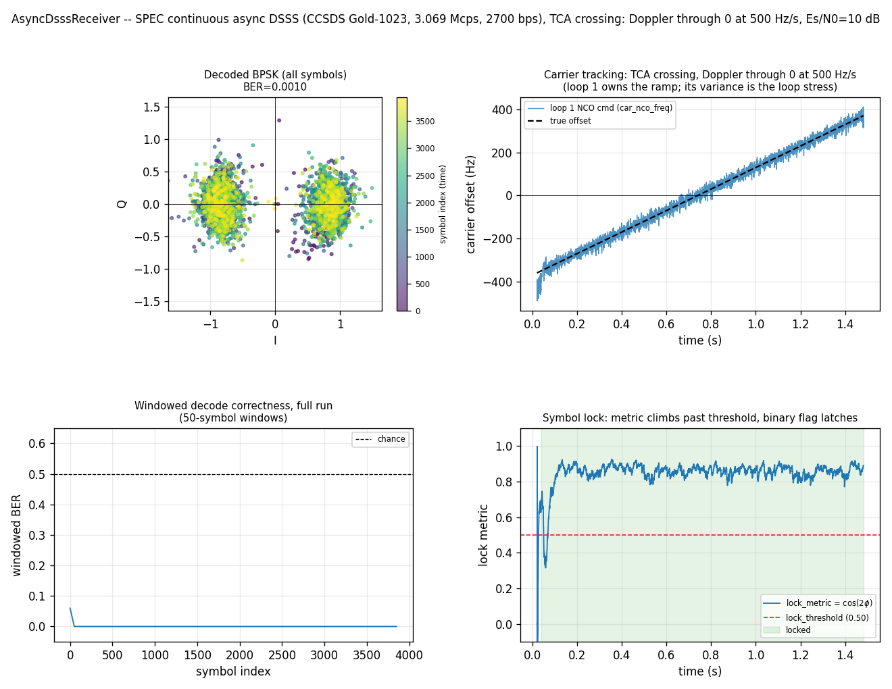

# Async DSSS Receiver: the SPEC waveform through coupled Doppler



Where
[Continuous Async DSSS Receiver](async-dsss-receiver.md) (Stage 3)
hand-composes the receive chain — `Acquisition` → `Dll` →
`RateConverter` → `MpskReceiver` — to *show the mechanics*, this page
drives the single packaged object that wraps that whole chain,
[`dsss.AsyncDsssReceiver`](../api/python-dsss.md), against the literal
waveform from `prototypes/async_despreader/SPEC.md`:

- CCSDS 415.0-G-1 command-link **Gold code, 1023 chips**, repeating
- **3.069 Mcps** chip rate, asynchronous **BPSK at 2700 bps**
    (chips/symbol = 1136.67, non-integer — the asynchronicity is the point)
- **2.5 GHz** nominal carrier, **±50 kHz** frequency uncertainty,
    **\<500 Hz/s** rate of change

## What makes this the hard, honest case

Every prior page in this series injected the residual carrier as a phase
multiply on a *nominally-clocked* code: the carrier moved, the chip clock
did not. Real Doppler moves **both** coherently — the same v/c dilates the
code rate *and* shifts the carrier. Here
[`impairment.DopplerChannel`](doppler-channel.md) imposes exactly that
coupled impairment (it resamples to dilate the clock and applies the
coherent carrier), so this is the first end-to-end exercise in the repo of
the receiver's **carrier→code aiding** (`carrier_freq_hz=`): the tracked
carrier offset is fed back into the code loop as a rate bias the code
discriminator alone cannot pull in at this offset and SNR.

**The two SPEC Doppler regimes never coexist.** On a real pass the carrier
Doppler is an S-curve: the frequency *extremum* (±50 kHz) occurs at the
pass edges where the *rate is ~0*, and the maximum *rate* (500 Hz/s) occurs
at the closest-approach zero-crossing where the *offset is ~0*. They are
90° out of phase — you never see max offset and max rate at the same
instant. So a single capture is stressed in exactly one of two ways, and
this example exercises **both**, with noise added *after* Doppler at a true
10 dB Es/N0:

- **TCA crossing** (the figure): Doppler ramping through zero at +500 Hz/s
    — the maximum-rate, ~zero-offset regime that stresses the *carrier
    dynamics*.
- **Offset extremum** (asserted, not plotted): +50 kHz static, ~zero rate
    — stresses *acquisition and the coupled code-rate offset*.

Both decode cleanly (BER ≈ 10⁻³, verified robust across seeds).

## Two carrier loops, and which one does the work

The receiver runs a **pre-despread Costas** (loop 1) that de-rotates every
input sample *before* the code loop, then a **post-despread MpskReceiver**
carrier loop (loop 2) that mops up a small residual. The architecture is
`coarse → freeze → refine → unfreeze & track (loop 1) → despread → loop 2 mop-up`: loop 1 owns the Doppler dynamics, so on a ramp it is **loop 1**,
not loop 2, whose loop-filter output rides the sweep.

This matters because a Type-II loop nulls a frequency *step* to zero phase
error but tracks a frequency *ramp* with a **constant** steady-state phase
error θ ∝ (df/dt)/ωₙ². When loop 1 was inadvertently frozen at the refined
seed, loop 2 silently absorbed the entire ramp and held that constant phase
error, rotating the whole constellation by a fixed few degrees. Putting the
ramp back on loop 1 (a non-data-aided squaring discriminator fed from the
transition-free coherent-integration windows the refine stage already
produces, with a pull-in bandwidth wide enough for the post-refine
residual) is what un-rotates it — the fix is to put the ramp on the *right*
loop, not to null the phase error on the wrong one.

## Two honesty notes, both load-bearing

- **10 dB, not SPEC's 5 dB.** The AWGN-only decode floor is ~5 dB (the C
    test `_test_awgn_esn0_floor` proves it decodes at 5 dB and fails at 4),
    but under the *full* coupled ±50 kHz + ramp the carrier loop's pull-in
    margin puts the reliable point at ~10 dB. SPEC's 5 dB floor under the
    full Doppler envelope is aspirational for the current receiver.
- **BER alone is not trusted.** At this SNR a narrow lag search reports
    false floors and a wide one can find lucky alignments, so decode is
    corroborated by two **truth-free** validators that need no reference
    symbols and no lag: self-referenced EVM (each symbol against its own
    hard decision) and blind M2M4 SNR
    ([`snr.snr_m2m4_db`](../api/python-snr.md)). A real lock shows a tight
    EVM (≈ −Es/N0) *and* a positive M2M4 SNR; both are plotted (bottom
    right), and all three metrics must agree before the decode is claimed.

## How it works

The clean signal is synthesised by [`wfm.Synth`](../api/python-wfm.md) in
continuous DSSS mode (`symbol_rate>0`): the Gold code repeats forever and a
known random payload rides on it at the symbol rate with non-integer
chips/symbol. `DopplerChannel` then dilates the clock and applies the
coherent carrier, and Gaussian noise is added last at the Es/N0 referenced
to the outer data symbol.

```python
--8<-- "src/doppler/examples/async_dsss_receiver_spec_demo.py:signal"
```

One packaged receiver streams the whole capture. `carrier_freq_hz=CARRIER`
turns on the carrier→code aiding; `steps()` accepts any block size (state
carries across calls), so streaming one epoch per call is equivalent to one
big call — it just lets us sample the per-epoch telemetry: loop 1's
`car_nco_freq` (its absolute carrier estimate, in cycles/sample of the
front-end rate) and the binary `locked` / continuous `lock_metric` symbol
lock.

```python
--8<-- "src/doppler/examples/async_dsss_receiver_spec_demo.py:receiver"
```

Decode is validated three ways — a wide lag+polarity BER search for the
headline number, then the two truth-free metrics that make the lock claim
trustworthy:

```python
--8<-- "src/doppler/examples/async_dsss_receiver_spec_demo.py:validate"
```

## What you're seeing

1. **Decoded BPSK constellation**, all symbols coloured by time: the early
    settling-transient symbols are visibly scattered and distinct from the
    tight converged clusters at ±1.
1. **Carrier tracking**: loop 1's `car_nco_freq` (its loop-filter output =
    NCO command) rides the Doppler ramping through zero at 500 Hz/s, matching
    the true offset to within the loop's phase-noise variance — the honest
    picture of a loop tracking dynamics.
1. **Windowed decode correctness** (50-symbol windows): chance during the
    acquisition/refine settling transient, then flat at zero through the
    entire crossing.
1. **Symbol lock**: `lock_metric` — the SNR-weighted running mean of the
    BPSK lock signal (I²−Q²)/(I²+Q²) = cos(2φ) — climbs past `lock_threshold`
    and the binary `locked` flag latches (shaded) once the constellation
    converges, then holds through the crossing.

## Reproduce

```sh
python -m doppler.examples.async_dsss_receiver_spec_demo out.png
```

Source: [`async_dsss_receiver_spec_demo.py`](https://github.com/hunterdsp/doppler/blob/main/src/doppler/examples/async_dsss_receiver_spec_demo.py).
