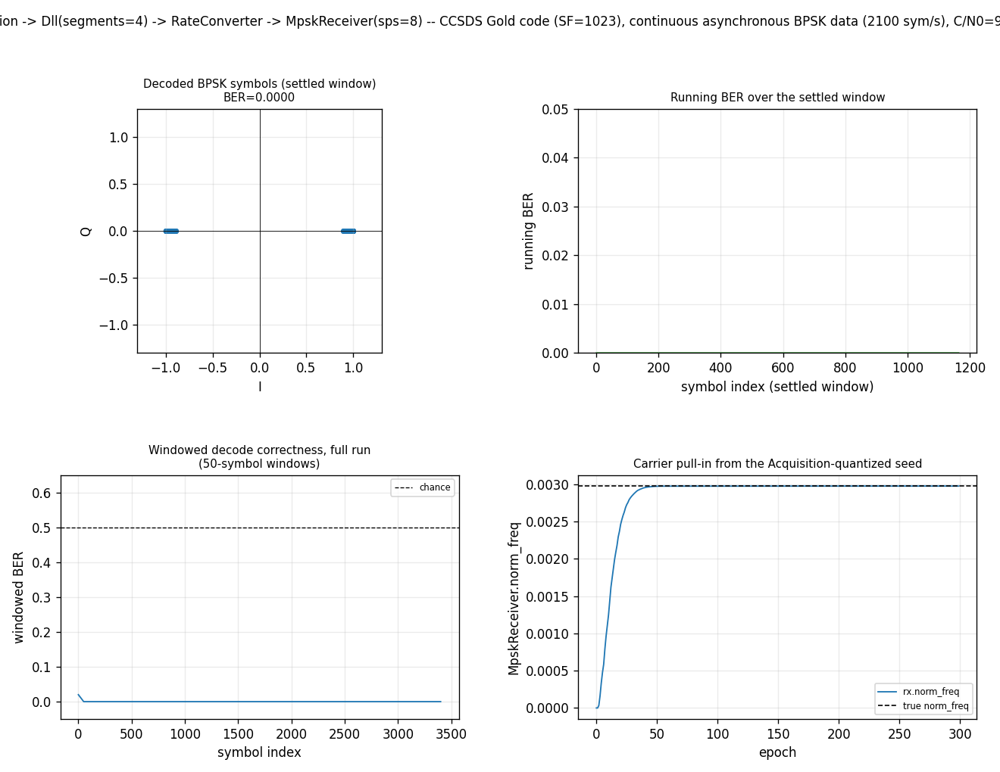

# Continuous Async DSSS Receiver



Stage 3 of the multi-part story that began with
[DSSS Acquisition: Continuous Async-Data Modulation](dsss-acq-async-data.md)
(Stage 1 — does `Acquisition` land the right code phase/Doppler bin) and
[DSSS Despread: Continuous Async-Data Hand-off](dsss-despread-async-data.md)
(Stage 2 — does that hit correctly seed `Dll`, and is `segments=4` robust
enough for the DLL's *own* tracking loop). This page closes the loop:
carrier and symbol-timing recovery ([`MpskReceiver`](../api/python-track.md))
sit downstream of `Dll`, bridged by
[`RateConverter`](../api/python-resample.md).

Not to be confused with [`dsss.Despreader`](despreader.md), which composes
`Costas`+`Dll` for the **synchronous** case (symbol clock = code-epoch
clock, `segments=1`). This page's signal needs the asynchronous
`segments=K` architecture throughout.

## Scope: the despreader removes the code, nothing else

`Dll(segments=4)` (Stage 2's own tracking-optimal choice, kept for its
own robustness reasons and nothing else) emits its partial-correlation
stream at a fixed rate — a sub-multiple of the chip rate. `RateConverter`
(arbitrary output/input ratio) converts that to a clean `sps=8` —
`MpskReceiver`'s own constructor default, the same config used
everywhere else in this codebase — and a "normal"
`MpskReceiver(m=2, sps=8, n=4, ...)` does carrier + symbol-timing
recovery from there. `init_norm_freq` is cycles per `RateConverter`'s
*output* rate (`sps*symbol_rate`), not the despreader's own partial
rate. See
[`docs/design/async-symbol-despreader.md` §4](../design/async-symbol-despreader.md)
for why this separation is the right architecture, not just a convenient
one — it's the same "despreader removes the code, nothing else" scope
rule that governs the `Costas`/`SymbolSync` composition, applied here to
`MpskReceiver` instead.

## How it works

```python
--8<-- "src/doppler/examples/async_dsss_receiver_demo.py:signal"
```

```python
--8<-- "src/doppler/examples/async_dsss_receiver_demo.py:acq_symbol_rate"
```

```python
--8<-- "src/doppler/examples/async_dsss_receiver_demo.py:handoff"
```

Three stages, each seeded from the previous:

1. **Acquisition** streams raw samples until it reports a hit, sized by
    `symbol_rate=` the same robust-default way Stage 1/2 use.
1. **Hand-off.** `dll_init_chip_from_acq` (Stage 2's own helper, reused
    verbatim) seeds `Dll`'s code phase.
1. **Despread -> resample -> demod.** `Dll(segments=4).steps()`'s
    partial stream feeds `RateConverter`, which produces a clean `sps=8`
    grid for `MpskReceiver` — matched filter (boxcar), NDA carrier
    acquisition, Gardner+Farrow symbol timing, and (once locked)
    decision-directed tracking.

## What you're seeing

All four panels run at one operating point (CN0=97 dB-Hz) — chosen, as in
the pre-story version of this demo, to unambiguously validate the
pipeline mechanics rather than run a margin sensitivity study (see Stage
2 for a page that studies margin sensitivity instead).

**Top-left — decoded BPSK constellation** (settled window). Two tight
clusters at ±1, not a smeared ring: the residual carrier has been fully
removed by `MpskReceiver`'s NDA carrier loop, and symbol timing has
converged tightly enough that every recovered sample lands
on-constellation.

**Top-right — running BER** (settled window). Flat at zero across the
settled window, confirming the lock isn't a lucky momentary alignment.

**Bottom-left — windowed decode correctness, full run** (50-symbol
windows). Stays at 100% correct throughout the run plotted here,
confirming the lock is sustained, not just a settled-third snapshot.

**Bottom-right — `MpskReceiver.norm_freq` vs. epoch**. `Acquisition`'s
Doppler bins are sized wide enough that this page's hit resolves to a
single ~kHz-scale bin at Doppler=0 — the carrier-frequency seed handed to
`MpskReceiver` starts off by the *entire* 50 Hz injected residual, not
close to it. The NDA carrier loop visibly pulls `norm_freq` in over the
first ~50 epochs and holds it at the true value afterward.

## Two gotchas worth knowing before reusing this pattern

**`MpskReceiver`'s own `tracking`/`lock` flags are not proof of correct
decoding.** Always check measured BER against known data — extending
Stage 2's own caution about `Dll.locked` not being reliable at large
`segments`.

**`init_norm_freq` starts from a coarse, quantized estimate, not the true
residual carrier** — see the bottom-right panel above.

Source: `src/doppler/examples/async_dsss_receiver_demo.py`. See also
[DSSS Acquisition: Continuous Async-Data Modulation](dsss-acq-async-data.md)
(Stage 1), [DSSS Despread: Continuous Async-Data Hand-off](dsss-despread-async-data.md)
(Stage 2), [Streaming Async Despreader](async-despread.md) (the
despread-only half, toy parameters, genie code phase), [Full-Chain
Lock-Up](receiver-lock.md) (a converged `Dll -> Costas -> SymbolSync`
chain with `.locked` observed via telemetry on all three loops), and
`docs/design/async-symbol-despreader.md` for the underlying theory.
