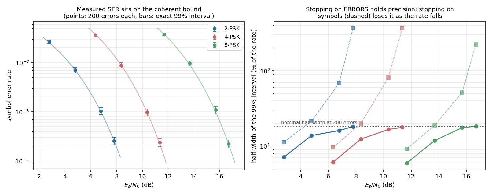

# Measuring an Error Rate, Defensibly



An error rate is a measurement, and like any measurement it can be
confidently wrong. This example puts `ber.BerMeter` on an ideal AWGN channel
with **no receiver in the loop**, so what is on trial is the instrument rather
than a demodulator: unit-energy M-PSK symbols, `source.AWGN`, and nothing in
between that could excuse a bad number.

## What you're seeing

**Left — the measurement lands on the bound.** Each point is a run stopped
after 200 symbol errors, with the exact 99% confidence interval drawn as a
bar, against the coherent M-PSK bound (`ber.ber_theory_ser`). An ideal channel
has no implementation loss, so the interval *must* contain the bound. The
script asserts exactly that at all twelve points — if it ever fails, the
measurement is wrong, not the channel.

**Right — why stopping on errors is the whole point.** Both curves measure the
same streams; only the stopping rule differs. Stop after a fixed 200 **errors**
(solid) and the interval half-width stays pinned at or below its nominal 18.3%
at every rate. Stop after a fixed 20 000 **symbols** (dashed) and precision
collapses as the rate falls — past 400% of the rate at the high-SNR end, where
the run catches a handful of errors and the interval spans an order of
magnitude.

That divergence is the trap. A fixed-symbol sweep does not announce that it has
run out of resolution; it just returns numbers that scatter more and more, and
the scatter reads as real variation in whatever is under test. This project
misread exactly that once: 20 000 symbols at a SER of 1e-3 yields ~20 errors and
~22% relative error, which looked like seed-to-seed variation in a receiver and
was not.

Under inverse binomial sampling — fix the errors `r`, let the symbol count `N`
be the random variable — the relative standard error is `1/sqrt(r)`, a function
of the **error count alone**. The error target *is* the precision, chosen up
front and independent of the rate you are about to measure. (The solid points
sit *below* the line at high SER only because a 50 000-symbol block overshoots
the 200-error target before the loop next checks; the target bounds the width,
it does not pin it.)

## How it works

The transmitted stream is rolled by an unknown lag and spun by an unknown
phase, and `align()` has to recover both on its own. It does that by
**detecting** the alignment — correlating a known marker (here a stretch of the
truth sequence) and gating the peak on a false-alarm probability — rather than
searching for the lag and rotation that minimise the error count.

That distinction is not pedantic. A `min over (lag, rotation)` search is an
optimisation over the answer: it can find a lucky low-error alignment on
garbage, and it can miss the true alignment on a perfectly healthy stream and
report chance. Both have happened here. `align()` returns `False` when the
marker cannot identify an alignment, and the symbols that fixed the alignment
are excluded from scoring so they cannot also flatter the rate.

```python
--8<-- "src/doppler/examples/ber_awgn_demo.py:measure"
```

`BerMeter.ser()` and `.ber()` return a `BerInterval` record — `p_hat`, `lo`,
`hi`, `rel`, `conf`, `errors`, `symbols`. **Assert on `lo`, never on `p_hat`:**
comparing the interval's lower limit against a spec is the form that cannot
flake on counting noise. The interval is the exact Gamma/chi-square one, with
its quantiles taken from `detection.det_threshold_noncoherent` — doppler's own
inverse regularized incomplete gamma — rather than a normal approximation, so
it stays honest down to a single error.

The same instrument backs the C-side receiver validators
(`native/validation/mpsk_receiver_ber.c` and its real-IF twin), which is what
keeps a Python sweep and a CI gate measuring the same thing.

## Reproduce

```sh
uv run python src/doppler/examples/ber_awgn_demo.py
```

Source: [`src/doppler/examples/ber_awgn_demo.py`](https://github.com/doppler-dsp/doppler/blob/main/src/doppler/examples/ber_awgn_demo.py)
