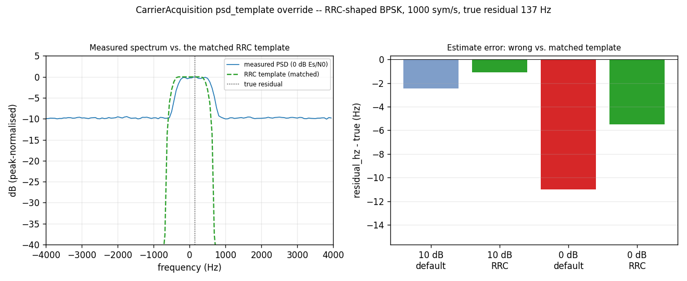

# CarrierAcquisition: RRC Pulse Shaping



[`CarrierAcquisition`](../api/python-acquire.md) is a PSDMF (power-spectral-density
matched-filter) residual-carrier estimator: it non-coherently averages the
incoming stream's power spectrum ([`PSD`](corr.md)), then circularly
correlates that average against a *known* power spectrum shape to find the
residual carrier offset. It runs as a one-shot refinement stage after
`Acquisition`'s own coarse Doppler search — see
[DSSS Acquisition: Pd/Pfa](dsss-acq-characterization.md) for that stage.

## The template is a property of the pulse shape, not a universal constant

The default known shape (`psd_template` left empty) is the average PSD of a
random rectangular-pulse (plain NRZ) BPSK stream — a sinc². An RRC
(root-raised-cosine) pulse-shaped stream's average PSD is a **different**
shape entirely: the squared magnitude of the RRC filter's own frequency
response, a raised-cosine roll-off with no sidelobes past `(1+beta)/(2*sps)`
of the symbol rate. `psd_template` exists precisely so a caller running a
different pulse shape or modulation can supply the *correct* known shape —
mirroring `~/legacy-commz`'s own `FrequencyAcquisition.power_spectrum`
override, the reference this object's design descends from.

## How it works

```python
--8<-- "src/doppler/examples/carrier_acq_rrc_demo.py:signal"
```

```python
--8<-- "src/doppler/examples/carrier_acq_rrc_demo.py:templates"
```

```python
--8<-- "src/doppler/examples/carrier_acq_rrc_demo.py:compare"
```

A linear filter applied to a white bipolar sequence has average PSD
proportional to `|H(f)|^2` — the direct RRC analogue of the default
template's rectangular-pulse sinc². [`doppler.wfm.rrc_taps`](wfm-io.md)
already generates the filter; the template is just its own zero-padded,
DC-centred squared frequency response.

## What you're seeing

Same RRC-shaped BPSK stream, same true 137 Hz residual, two Es/N0 points:

**Left — measured power spectrum vs. the matched RRC template**, at 0 dB
Es/N0. The measured spectrum's own roll-off (blue) lines up with the
template's shape (dashed green) — this is the shape the correlation is
actually matching against, not an arbitrary constant.

**Right — estimate error, wrong vs. matched template, at two Es/N0
points**. At 10 dB both templates land within a few Hz of the true
residual — at generous margin, template shape barely matters. At 0 dB
both templates still confidently detect (the CFAR gate fires for both),
but the **default (rectangular-pulse) template's own estimate is roughly
2x worse** than the **matched RRC template's**. The wrong shape doesn't
cost the detection outright here — it systematically biases the estimate,
and that bias grows as SNR degrades.

## A calibration fix, mid-story

`CarrierAcquisition`'s detection gate originally reused `doppler.detection`'s
`det_threshold_noncoherent`/`det_n_noncoh` — the same Pfa/Pd statistics
`Acquisition` itself is built on, derived for classic complex-correlator
(Rayleigh/Rician) detection. That model does NOT transfer to gating a
*power-spectrum-vs-template* correlation — confirmed via Monte Carlo (see
`FINISHING_PLAN.md`'s `CarrierAcquisition` section): the borrowed threshold
was roughly **5x too conservative**, which is why an earlier version of
this very page showed the default template failing to detect outright at
5 dB. `carrier_acq_core.c`'s `_ratio_threshold()` now uses a threshold
derived from this object's own real statistic (an exact Gamma-sum H0 model)
plus one empirically-calibrated constant — not yet a fully general closed
form (see the source comment for what's still open), but a large,
measured improvement over the borrowed model.

Source: `src/doppler/examples/carrier_acq_rrc_demo.py`. See also
[Correlation](corr.md) (the `PSD`/`Corr`/`CorrDetector` primitives this
object composes), [2-D Acquisition](detection2d.md) (the same Pfa/Pd
statistics applied to `Acquisition`'s own code-phase × Doppler search), and
[wfm I/O](wfm-io.md) (`rrc_taps` and pulse shaping in general).
