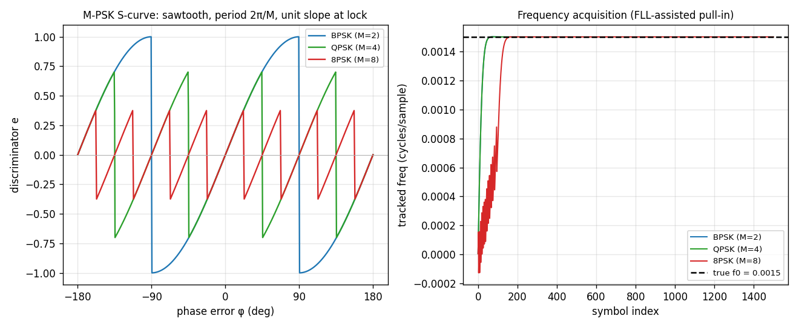

# M-PSK Carrier Loop — Theory Validation



A theoretical-correctness check on [`track.CarrierMpsk`](../api/python-track.md),
the M-ary generalization of the [Costas loop](costas.md). It is the same
integer-NCO wipe-off + integrate-and-dump + `LoopFilter` + FLL assist, with a
**decision-directed M-PSK** phase discriminator `e = Im(P·conj(â))/|P|` (â the
nearest constellation point) in place of the BPSK one. `m` selects the
constellation: **2 (BPSK), 4 (QPSK), 8 (8PSK)**.

**Left — Phase-detector S-curve.** Driving the loop open-loop (bandwidth → 0)
with a noiseless constellation point rotated by a swept static phase error φ and
reading the discriminator traces a **sawtooth of period 2π/M** — the signature
of the M-fold phase ambiguity. While the decision is correct (`|φ| < π/M`) the
nearest point is the transmitted one, so `e = sin(φ)`: a sine through the origin
with **unit slope (Kd = 1)** at lock. As φ crosses ±π/M the slicer jumps to the
adjacent point and `e` snaps to `sin(φ ∓ 2π/M)`. Peak `±sin(π/M)` (1.0 / 0.707 /
0.383 for M = 2 / 4 / 8). The measured curve matches the analytic sawtooth to
**~8e-8** on the linear branches. **At M = 2 it is exactly the BPSK Costas
S-curve.**

**Right — Frequency acquisition.** A residual carrier step `f0 = 0.0015`
cycles/sample with the FLL assist (`bn_fll = 0.01`): the integer-NCO frequency
estimate per symbol converges onto the true offset (black dashed) for all three
orders. 8PSK pulls in more slowly and with more stress — its discriminator is
linear only over ±π/8, so the wide cross-product **FLL** does the heavy lifting
of dragging the frequency integrator on before the PLL refines phase. Without the
assist the bare 8PSK PLL would stall on this offset.

## The M-fold ambiguity

The loop locks to **one of M phases** — it recovers the carrier but leaves a
`k·2π/M` rotation on the symbols. Resolve it downstream with **differential
demapping** ([`mpsk.mpsk_diff_demap`](../api/python-mpsk.md)) or a sync word; the
carrier loop itself stays modulation-data-agnostic and just emits the prompts.

```python
--8<-- "src/doppler/examples/mpsk_carrier_theory_demo.py:track"
```

## Rigorous bounds

Beyond the deterministic S-curve, the Monte-Carlo harnesses
`native/validation/carrier_mpsk_scurve.c` and `carrier_mpsk_jitter.c` (ctest
`--check`) prove, reading the loop's true NCO phase: closed-loop phase jitter
`σ_φ² ≈ G·σ_disc²` (G the analytic loop noise gain, proportional to `bn`); a
tracking threshold that **tightens as M grows** (BPSK still locked at 6 dB where
QPSK/8PSK have lost lock); and the FLL assist's frequency pull-in range exceeding
the bare PLL's, by ~2.5× for 8PSK.

Source: `src/doppler/examples/mpsk_carrier_theory_demo.py`; tests in
`src/doppler/track/tests/test_theory_carrier_mpsk.py` and the C harnesses above.
