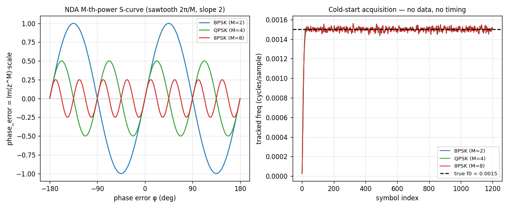

# NDA Carrier Loop — Theory Validation



[`track.CarrierNda`](../api/python-track.md) is the **non-data-aided** (NDA)
carrier-recovery loop — the cold-start counterpart to the decision-directed
[`CarrierMpsk`](carrier-mpsk.md). Per sample it de-rotates with the integer
`lo` NCO; it filters the de-rotated samples through a free-running I/Q **boxcar
moving average of `sps/n` samples** (one output per input sample — no rate
change), and on **every sample** runs an **M-th-power** phase discriminator.
Raising the arm sample to the Mth power strips the M-PSK data, so
the loop locks **with no symbol timing and no data present** — a bare carrier, or
a modulated carrier before timing settles. It is the robust acquisition aid the
MPSK receiver hands over from (see the [design note](../design/mpsk.md)).

**Left — Discriminator S-curve.** Driving the discriminator open-loop traces the
scaled M-th-power detector `phase_error = Im(z^M)·{1, ½, ¼}` for M = 2 / 4 / 8: a
sawtooth of period `2π/M` (the M-fold phase ambiguity). The `{1, ½, ¼}` scale is
not cosmetic — it makes the **S-curve slope at lock equal 2 for every M**, so one
loop `bn` behaves identically across BPSK / QPSK / 8PSK. The measured curve
matches the analytic M-th power to **~9e-8**. The lock signal (not plotted) is
`Re(z^M)·lock_scale` — exact for M ≤ 4, a faithful monotone lock detector for
M = 8 — and its EMA is the carrier lock metric that drives handover.

**Right — Cold-start acquisition.** A carrier step `f0 = 0.0015` cycles/sample on
an **unmodulated** carrier (no data, no timing): the tracked frequency snaps onto
the truth (black dashed) for all three orders. Because the M-th power is
data-blind it acquires modulated data with no timing just as well (validated in
the tests).

## Computation — repeated squaring

The M-th power is built by repeatedly squaring the arm sample `z = i + jq` —
driven to unit average power by an internal AGC so the loop gain is
amplitude-invariant: `z²` strips BPSK, `z⁴` QPSK, `z⁸` 8PSK. Each level yields a
phase error and a lock signal at one complex multiply — no `atan2`, no `pow`. The
discriminator is the **raw** M-th-power form (best squaring loss for
constant-modulus signals like DSSS), not a per-sample magnitude limiter. See
[`docs/design/mpsk.md`](../design/mpsk.md) §2.3 for the derivation and the
squaring-loss equations.

```python
import numpy as np
from doppler.track import CarrierNda

# QPSK NDA loop, 8 samples/symbol, sps/n = 2-sample boxcar arm; cold start
c = CarrierNda(bn=0.01, zeta=0.707, init_norm_freq=0.0, sps=8, n=4, m=4)
derot = c.steps(rx)        # de-rotated samples (one per input sample)
f_est = c.norm_freq        # tracked carrier (cycles/sample)
locked = c.lock            # M-th-power lock metric (→ lock_scale when locked)
```

## Rigorous bounds

The C harnesses `native/validation/carrier_nda_scurve.c`,
`carrier_nda_pullin.c`, and `carrier_nda_step_response.c` (ctest `--check`)
prove: `phase_error = Im(z^M)·{1,½,¼}` and slope 2 for all M (to ~1e-7);
`lock_signal = Re(z^M)·lock_scale` for M ≤ 4; cold-start frequency pull-in on an
unmodulated carrier per M; lock on modulated M-PSK data **with no symbol
timing**; closed-loop frequency jitter that grows with `bn`; and a closed-loop
step response that locks on both constant-modulus and pulse-shaped (RRC) inputs.

Source: `src/doppler/examples/mpsk_nda_theory_demo.py`; tests in
`src/doppler/track/tests/test_theory_carrier_nda.py` and the C harnesses above.
