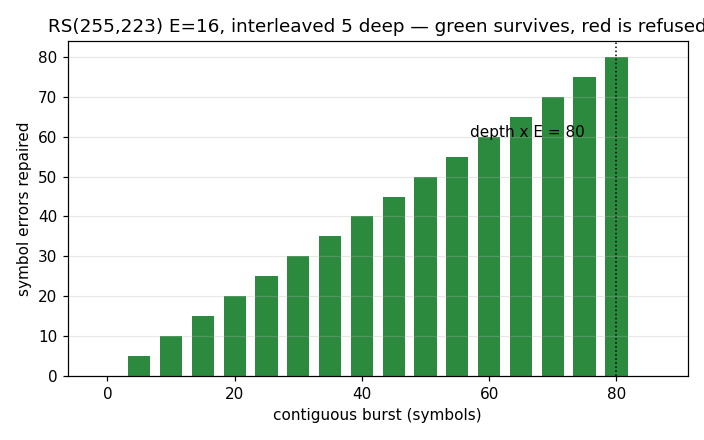

# A CCSDS CADU, as a Frame Description



A frame is a list of **fields** that appear on the wire and a list of
**stages** that transform them — each stage carrying the **span it covers**.
CCSDS is not a mode this library switches into; it is a configuration of that
description, in the same way `CCSDS_TM_CONV` configures a convolutional code
and `CCSDS_TM_RS` configures a Reed-Solomon one.

Three fields and three covers is the whole of it:

```text
fields:  [ ASM | Transfer Frame | R-S check symbols ]

stages:  outer (R-S)     covers { frame, check }      starts behind the marker
         randomiser      covers { frame, check }      starts behind the marker
         inner (conv)    covers { ASM, frame, check } marker INCLUDED
```

## Why a span and not an order

The stages disagree about what they cover, and that disagreement is the one
thing no individual kernel can be wrong about:

| stage                 | covers the ASM? | CCSDS 131.0-B-3       |
| --------------------- | --------------- | --------------------- |
| Reed-Solomon (outer)  | no              | 9.5.1, 9.2.1.5        |
| pseudo-randomiser     | no              | 10.3.2, 10.3.4 note 1 |
| convolutional (inner) | **yes**         | 3.2.1, 9.2.1.4        |

9.2.1.5 states both halves in one sentence — *"the ASM shall be encoded by the
inner code but not by the outer code"* — and 10.3.4's first NOTE states the
third outright: *"The ASM was not randomized and is not derandomized."*

So a pipeline is the representation that **cannot** express this. A chain of
optional transforms applied to "the frame" is right at three stage boundaries
and wrong at the fourth — and wrong in the direction that still encodes, still
decodes against a receiver of your own construction, and syncs to nothing.
A span makes the disagreement a value a test can assert.

The rule generalises past CCSDS, which is why the flags are not named after
it. A marker, a preamble and a sync word are all things a receiver **finds**,
so all three must look the same in every frame; the data group is what gets
coded and scrambled. CCSDS states that for its own ASM, and the reason it
gives is exactly as true of a Barker sync word.

## Describing one

```python
--8<-- "src/doppler/examples/ccsds_link_demo.py:cadu"
```

`FrameDesc` is `Frame`'s deferred flavor: the same constructor, but it stops
before materialising so the fields are a starting point you extend. Empty
arrays begin from nothing.

## From the command line

The same description, reached through `wfmgen`'s flags:

<!-- docs-snippet: no-exec=needs a 223*I-octet Transfer Frame on disk and a built wfmgen on PATH; the same invocation is executed, and its output compared against the encoder, by the flag matrix's bits_ccsds_cadu case -->

```console
$ wfmgen --type bits --bits-file transfer_frame.bits \
      --rs-depth 5 --randomise --asm --conv \
      --modulation bpsk --sps 1 --crc none --count 20464 -o cadu.cf32
```

Each flag is a stage, each is optional, and setting any of them frames the
waveform. All four over a `223 × I`-octet payload with no preamble and no sync
word **is** a CADU. `--record` carries the coding, so `--from-file` on that
record reproduces the samples byte for byte.

A payload off the `223 × I` grid is **refused, not padded** — virtual fill is
not implemented ([gh-813](https://github.com/doppler-dsp/doppler/issues/813)),
and a silently padded codeblock is the wrong length for the receiver it was
aimed at.

## What the receive side buys — the plot

The bars are what a **coded** frame reports that a CRC cannot.

A contiguous burst of `B` symbols lands as `ceil(B / I)` errors in each
codeword, so interleaving depth `I` trades **no rate at all** for an `I`-fold
longer correctable burst. At `I = 5` and `E = 16` the boundary is exactly 80
symbols: green bars survive, and the bar height is the repair work it took.
One symbol more concentrates `E + 1` into a single codeword and the frame is
refused (red).

That height is the point. A CRC reports one bit — right or wrong. An outer
code reports **how much of its budget it spent**, so a margin being consumed
is visible long before it is lost:

```pycon
>>> payload = transfer_frame()
>>> cadu = describe_cadu(payload, DEPTH, inner=False)
>>> clean = np.asarray(cadu.bits(1)).copy()
>>> blk = cadu.stage_first(0)

>>> cadu.check(clean)
doppler.wfm.FrameCheck(passed=1, stages=2, checked=2, units=6, ok=6, corrected=0, symbols=0)

>>> rx = clean.copy()                      # a burst of exactly E per codeword
>>> for s in range(DEPTH * 16):
...     rx[blk + s * 8] ^= 1
>>> cadu.check(rx)
doppler.wfm.FrameCheck(passed=1, stages=2, checked=2, units=6, ok=6, corrected=5, symbols=80)

>>> rx = clean.copy()                      # E+1 concentrated in ONE codeword
>>> for c in range(17):
...     rx[blk + (c * DEPTH + 2) * 8] ^= 1
>>> cadu.check(rx)
doppler.wfm.FrameCheck(passed=0, stages=2, checked=2, units=6, ok=5, corrected=0, symbols=0)
```

Both frames in the first two lines "pass". Only one of them is healthy.

`check()` needs the description and the received bits and **no payload truth
at all**, so it works on a real capture — which is what makes a truth-free
frame error rate possible on a coded link.

## Where the inner code went

`check()` reports `checked = 2` of `stages = 3` for a fully coded
description, and reports the convolutional stage as **not checked** rather
than as passed. That is deliberate and the two are different answers.

A Viterbi decoder is streaming and emits its decisions `depth` bits late, so
the bits of one frame are not a function of that frame's symbols alone — and
the marker that says where a frame *starts* is only readable once the inner
code has been undone. Frame checking therefore begins after the inner decode
and after frame synchronisation. A function taking channel symbols would have
to own a decoder, a search window and a buffer; that is a streaming receiver,
and this is the per-frame chain it would call.

## See also

- [A Frame as a Description](../design/frame-description.md) — the design, its
    falsification targets, and the two rules that fell out of prototyping
- [The Viterbi Decoder](../design/viterbi.md) — the inner code, its traceback
    depth, and the node synchronization it needs first
- [Reed-Solomon](../design/reed-solomon.md) — the outer code as a description,
    and the two offsets a textbook omits
