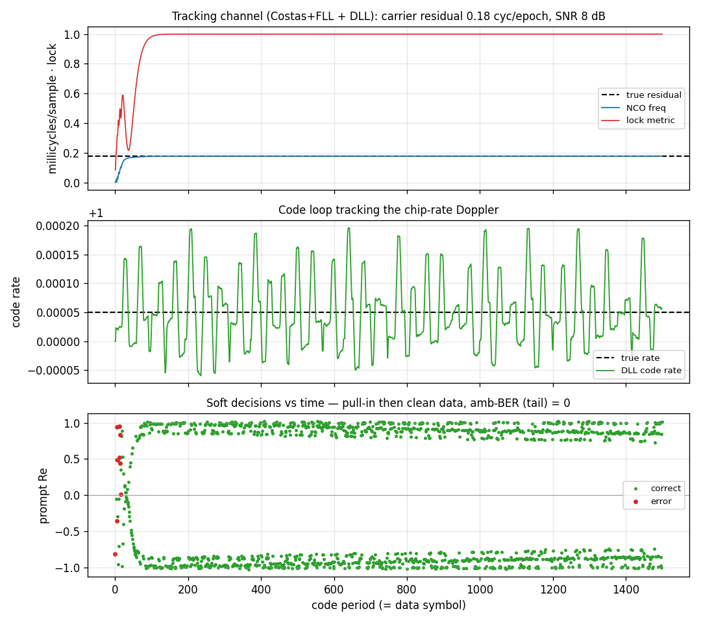

# Tracking Channel (full receiver)



A complete continuous DSSS-BPSK receiver in one object:
[`track.Channel`](../api/python-track.md) composes a carrier loop
([`Costas`](costas.md), FLL-assisted) and a code loop ([`Dll`](dll.md)) on a
single shared per-sample integrate-and-dump. The transmit signal is a 127-chip
PN code spreading BPSK data, with a **residual carrier offset** (0.18 cycles per
code period — larger than a bare PLL can pull in, so the FLL assist is on), a
slow **code Doppler**, and AWGN at `SNR = 8 dB`.

## What you're seeing

**Top — Carrier.** The integer-NCO frequency estimate (blue) pulls onto the true
residual (black dashed) as the FLL-assisted carrier loop acquires; the lock
metric (red) ramps to 1.

**Middle — Code.** The DLL's chip-rate estimate (green) tracking the true code
Doppler (black dashed) — the code replica is held aligned so the prompt stays
despread.

**Bottom — Soft decisions.** The despread prompt symbol's real part per code
period. A handful of red errors during pull-in, then clean ±1 clusters once both
loops lock — the data is recovered with zero bit errors on the converged tail (a
global 180° flip is don't-care).

## How it works

One per-sample loop does the work of the whole front end:

```text
per sample:   d = costas_wipeoff(carrier)      # integer-NCO carrier wipe-off
              dll_accumulate(d)                 # early / prompt / late correlate
per period:   P = prompt accumulator
              dll_update()                      # code loop on |E|,|L|
              costas_update(P)                  # carrier loop on the prompt
              emit P                            # one despread symbol per period
```

The carrier wipe-off and the code correlation share the same pass — composing
two tracking loops costs no extra sweep over the data. The channel is seeded by
acquisition (the FFT search supplies the coarse carrier frequency and code
phase); the loops then track the residual.

```python
import numpy as np

from doppler.track import Channel

# a DSSS-BPSK burst: 31-chip PN code, 8 samples/chip, 40 data symbols
code = np.random.randint(0, 2, 31).astype(np.uint8)
chip_signs = np.where(code & 1, -1.0, 1.0)
data = np.random.randint(0, 2, 40) * 2 - 1
spread = (data[:, None] * chip_signs[None, :]).ravel()  # spread each symbol
rx = np.repeat(spread, 8).astype(np.complex64)          # oversample by sps

# code: 0/1 chips for one period; bn_fll>0 enables FLL-assisted carrier pull-in
ch = Channel(code, sps=8, init_norm_freq=0.0, init_chip=0.0,
             bn_carrier=0.05, bn_code=0.005, bn_fll=0.03,
             zeta=0.707, spacing=0.5, nav_period=1)
symbols = ch.steps(rx)        # one despread prompt symbol per code period
bits    = ch.bits(rx)         # hard data bits (bit-synced when nav_period > 1)
freq    = ch.norm_freq        # tracked carrier residual
```

When a data bit spans several code periods (`nav_period > 1`, as in GPS C/A
where one nav bit = 20 code periods), `bits()` bit-syncs the prompts: it
histograms the prompt sign-flip positions to find the data-bit boundary, then
coherently sums `nav_period` prompts per bit. The detected boundary is readable
as `bit_phase`.

Source: `src/doppler/examples/channel_demo.py`.
