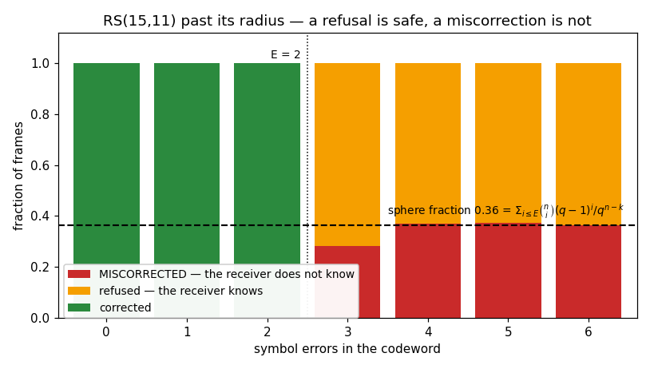

# Name Your Own Code — and What Happens Past the Radius



`doppler.coding` holds the code **families** a standard configures, rather
than any standard's picks. `ReedSolomon` is both directions of an RS code over
`GF(2**J)`; `ConvEncoder` and `Viterbi` are the two directions of a rate-1/n
convolutional code. All three take the code as arguments, so the chain below
uses one that is **nobody's standard**: RS(255,239) over the textbook GF(256)
inside a K=7 rate-1/2 inner code with no output inverted.

That is the point of the slice this page came from. Until
[gh-900](https://github.com/doppler-dsp/doppler/issues/900) doppler could
decode any convolutional code and encode exactly one, and the only
Reed-Solomon reachable from Python was CCSDS's — fixed, and only inside a
frame descriptor that carries an interleaving depth rather than a code.

## The chain

Outer code, marker, inner code; then a real AWGN channel; then back up
through Viterbi, acquisition, and Reed-Solomon.

```python
--8<-- "src/doppler/examples/coding_demo.py:chain"
```

Two details in there are worth pulling out, because both present as something
other than what they are.

**The marker is prepended after the outer code and covered by the inner one.**
That coverage asymmetry is not a CCSDS quirk — every framing with a sync word
has it, because a receiver has to find the marker *before* it can undo
anything, so the marker cannot be inside what it is used to find. It is also
what reports polarity: `SyncFinder` returns `inverted`, and a BPSK carrier
locked 180 degrees out delivers every bit complemented.

**A Viterbi decoder answers late.** It holds `depth - 1` decisions back while
the traceback catches up, so a frame encoded with nothing after it comes out
short by exactly that much and its tail never arrives. Flushing the encoder
with `depth` known bits buys it back. Forget it and the symptom is a frame of
the wrong length — which looks like a framing bug, not a coding one.

## Past the radius, a decoder can be silently wrong

`rs_core.h` states it and nothing showed it:

> beyond `E` a bounded-distance decoder can land inside another codeword's
> sphere and miscorrect — a property of the code, not of this implementation

Three outcomes, and only two of them are safe:

| outcome          | `decode` returns | `codeword_ok` | the receiver          |
| ---------------- | ---------------- | ------------- | --------------------- |
| corrected        | `0..E`           | yes           | has the right payload |
| refused          | `-1`             | —             | **knows** it failed   |
| **miscorrected** | `0..E`           | **yes**       | does not know         |

The plot above is the fraction of frames in each state as the error count
crosses `E`. Everything within the radius is corrected; one symbol past it,
nothing is — and roughly a third of those frames come back as a *different*
codeword, reported as a successful decode.

## Why the plot uses a deliberately weak code

The figure is RS(15,11) over GF(16), which nothing sends. The reason is the
measurement, not the story.

A random error pattern lands in *some* codeword's sphere with probability
about

```text
sum(C(n, i) * (q-1)**i  for i <= E)  /  q**(n-k)
```

The `q**k` codewords cancel, so **only the parity count survives** — and that
is the whole engineering content of this page. For RS(255,239) the fraction is
`2e-05`; for RS(15,11) it is `0.36`. Sweeping the strong code would need a
quarter of a million frames to see a handful of events, and an example
reporting zero would be reporting its own sample size.

The dashed line on the plot is that closed form. The measured miscorrection
rate converges onto it well past `E`, where the corrupted word is effectively
a random one — measurement meeting theory with nothing shared between them but
the code's four parameters. The example asserts that convergence, so a
regression in the decoder shows up as a failing example rather than a
different-looking picture.

**Read the scaling, not the number.** Parity is what buys the silence, and it
buys it exponentially: every extra parity symbol divides the miscorrection
probability by `q`. What it never buys is certainty, which is why frame-level
accounting — a CRC inside the codeword, or the `corrected` / `symbols` counts
`FrameDesc.check()` reports — is the thing that catches the rest.

## Run it

```console
$ python src/doppler/examples/coding_demo.py
```

The script self-validates: it asserts the payload comes back bit-exact
through the channel, that every pattern within `E` is corrected and none
beyond it is, and that the far tail matches the sphere-packing fraction.
