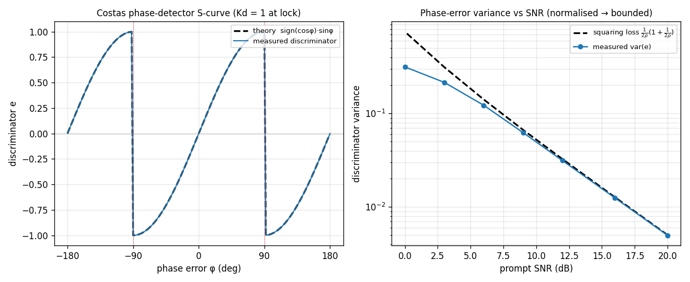

# Costas Loop — Theory Validation

A theoretical-correctness check on [`track.Costas`](../api/python-track.md)'s
decision-directed BPSK phase discriminator, `e = sign(Re P)·Im(P)/|P|`.

**Left — Phase-detector S-curve.** Driving the loop open-loop (bandwidth → 0)
with a noiseless prompt `exp(jφ)` at a swept static phase error and reading the
discriminator traces the analytical characteristic `e(φ) = sign(cos φ)·sin φ`
**to ~5e-8**: zero with unit slope (`Kd = 1`) at the `φ = 0` lock, the 180° BPSK
data ambiguity at ±180°, and the unstable nulls at ±90° where the hard decision
flips.

**Right — Phase-error variance vs SNR.** At `φ = 0` the discriminator variance
follows the BPSK **squaring-loss** law `σ_e² = 1/(2ρ)·(1 + 1/(2ρ))` in the
high-SNR regime (ratio ≈ 0.98 for SNR ≥ 10 dB). Because doppler's discriminator
is normalised by `|P|` it is bounded to `[-1,1]` and so falls *below* the
(divergent) law at low SNR — shown for honesty rather than hidden.

Source: `src/doppler/examples/costas_theory_demo.py`;
tests in `src/doppler/track/tests/test_theory_costas.py`.
