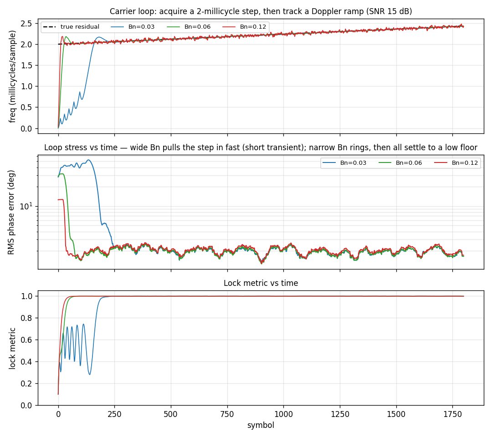

# Carrier Loop Stress



A [`track.Costas`](../api/python-track.md) carrier-tracking loop acquiring a
**large** residual carrier offset — ~0.9 rad/symbol, at `SNR = 15 dB`. This is
bigger than a bare Costas PLL can pull in *at any loop bandwidth*: the phase
discriminator's linear range is far narrower than the residual. The figure
contrasts three configurations — a narrow PLL (`Bn = 0.01`), a wide PLL
(`Bn = 0.10`), and an **FLL-assisted** PLL (`Bn = 0.01`, `bn_fll = 0.03`) — to
show why the FLL assist exists.

## What you're seeing

**Top — Frequency tracking.** The integer-NCO frequency estimate vs the true
residual (black dashed). Both bare PLLs stall near zero — neither bandwidth can
acquire the offset. The FLL-assisted loop snaps straight onto it.

**Middle — Loop stress vs time.** The sliding-RMS of the Costas phase
discriminator error (degrees) — the *stress* on the loop. The bare PLLs sit
pinned at maximum stress (~40°) forever, because they never lock. The
FLL-assisted loop's wide cross-product **frequency** discriminator pulls the
loop's integrator onto the residual, and the stress decays to a low locked
floor.

**Bottom — Lock metric vs time.** `|Re P| / |P|`: stuck near 0.6 (no lock) for
the bare PLLs, ramping to 1 for the FLL-assisted loop.

## How it works

The carrier loop is one small primitive composed from two others:

- [`source.LO`](../api/python-nco.md) — an **integer-phase NCO** (uint32
    accumulator + LUT → cf32). The phase wraps at 2³² by construction, so it is
    bounded and exactly reproducible — no `double`-accumulator drift over long
    runs. The loop de-rotates the input one sample at a time with the inline
    `lo_step()` (carrier wipe-off).
- [`track.LoopFilter`](../api/python-track.md) — the 2nd-order PI loop filter
    that turns the per-symbol phase error into a frequency + phase steer.

Each `tsamps`-sample symbol is coherently integrated (integrate-and-dump), a
decision-directed BPSK discriminator measures the residual phase, the loop
filter updates, and the new frequency/phase is written straight into the NCO.

**FLL assist** (`bn_fll > 0`) adds a second, *frequency* discriminator: the
data-wiped cross product of consecutive prompts, `Im(conj(P_prev)·P_curr)`. Its
linear range is far wider than the phase discriminator's, so it pulls the loop's
frequency integrator onto a large or fast-moving residual the bare PLL would
miss; the PLL then refines phase. `bn_fll = 0` is a pure Costas PLL.

```python
--8<-- "src/doppler/examples/costas_demo.py:loop"
```

`Costas` tracks only the *residual* left after acquisition; an offset larger
than the per-symbol integration bandwidth must be removed upstream by the FFT
acquisition search, not by the loop. The FLL assist's own unambiguous range is
about ±¼ of the symbol rate (the cross product is monotonic to ±π/2 per symbol).

Source: `src/doppler/examples/costas_demo.py`.
