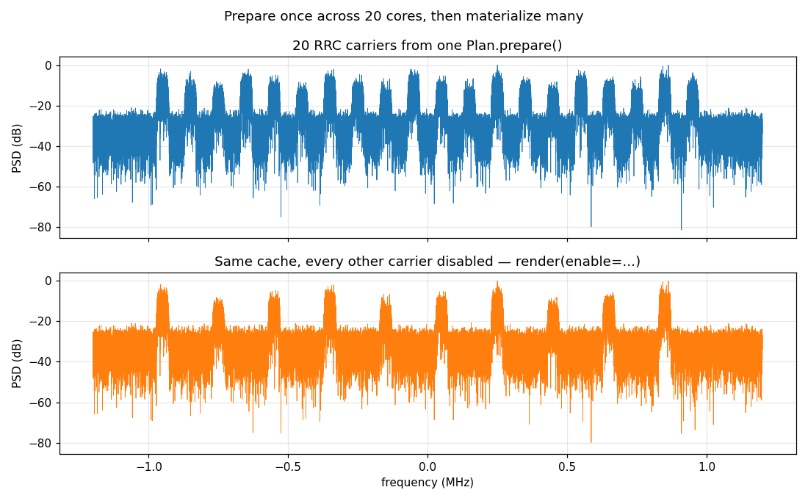

# A Crowded Band — Many Signals, One Parallel `prepare`



Composing a waveform gets expensive exactly when a single segment carries
*many* signals — a fully-loaded band of carriers, a multi-user CDMA cell, a
dense interference scene. Each signal is its own DSP (modulation, root-raised-
cosine pulse shaping, a mix to its channel centre), and none of them depend on
the others: the segment is just their sum. That independence is the opening.
`prepare` renders each source *once* into its own cache
buffer, and — because those builds share nothing — fans them across the
machine's cores. The sum is deferred to render time, so the cached result stays
**bit-for-bit identical** to a full serial compose; only the wall-clock changed.

## What you're seeing

The scene is twenty RRC-shaped QPSK carriers spaced across a 2.4 MHz span, at
three power tiers, over the AWGN floor implied by the anchor carrier. One
`Plan` drives the whole figure.

**Top — the crowded band.** Every one of the twenty carriers, rendered from the
prepared cache. This baseline is not an approximation: `plan.render()` is
asserted equal, sample for sample, to `Composer.compose()` of the same scene.

**Bottom — a variation for free.** `render(enable=...)` disables every other
carrier — an exact `gain = 0` term applied to the *same* cache, with no
re-synthesis. The odd carriers collapse into the noise floor while the survivors
are untouched; the gaps open up at zero DSP cost. Sweeping levels, phases, the
SNR, or the noise seed works the same way, which is what makes a Plan the right
tool for a campaign that re-runs one scene hundreds of times.

## How it works

Build the scene — twenty independent carriers summed into one segment:

```python
--8<-- "src/doppler/examples/crowded_band_demo.py:scene"
```

Prepare it once, then materialize variations from the cache. `prepare()` is
where the twenty per-carrier builds fan across cores; everything after is a
re-weighted sum:

```python
--8<-- "src/doppler/examples/crowded_band_demo.py:prepare"
```

The parallelism is entirely inside `prepare()` — the public API does not change,
and neither does a single output sample. The build is gated so that only a
segment with more than one source and a long enough on-time crosses into the
threaded path; small scenes stay serial and pay nothing for the machinery. On a
20-core machine this scene prepares in ~90 ms versus ~600 ms serially — the win
grows with the number of signals and the sample count, since that is exactly the
independent per-source work the fan-out spreads.

`prepare`, `Plan`, `Composer`, `Segment` and `qpsk` all come from
`doppler.wfm`.

## Reproduce

```sh
python -m doppler.examples.crowded_band_demo crowded_band_demo.png
```

Source: [`crowded_band_demo.py`](https://github.com/doppler-dsp/doppler/blob/main/src/doppler/examples/crowded_band_demo.py)
