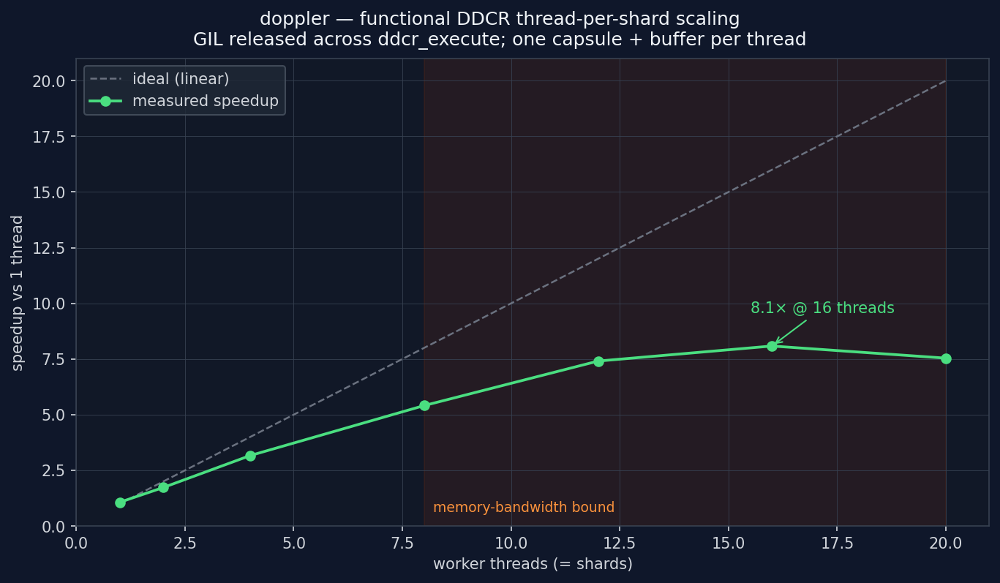

# Ddcr — Real Passband to Baseband


## What you're seeing

Three panels share the same x-axis — normalised frequency in cycles/sample
(−0.5 to +0.5). A red dashed marker labels the strongest spectral line in
each panel.

**Top panel — input.** 16384 samples of a **real** float32 signal: a tone at
`fn = 0.18` (relative to the input sample rate `fs_in`) plus broadband noise.
Because the input is real, the spectrum is symmetric — the tone shows at both
±0.18.

**Middle panel — baseband output.** The same signal run through `Ddcr.execute`
with the NCO tuned so the carrier lands at **DC**. The output is **complex64**
and decimated 4× (`rate = 0.25`), so its x-axis is normalised to `fs_out`. The
tone sits at `fn = 0.000`.

**Bottom panel — retuned output.** The LO is moved 0.04 (in `fs_in`) below the
carrier via the `norm_freq` property. The tone shifts off DC by
`0.04 / rate = 0.16` in `fs_out` units, landing at `fn = +0.160` — exactly as
predicted, and phase-continuously (no filter-history reset).

## One typed handle over opaque C state

`Ddcr` is a generated `kind="handle"` class: a typed Python object over an
opaque `ddcr_state_t *`. It unifies what were once two faces (a `DDCR` object
and `ddcr_*` free functions) into one — it **owns** the C state like an object,
yet `execute()` writes into a **caller-provided** output buffer like the old
functional API, so allocation and lifetime stay explicit.

| Aspect    | `Ddcr`                                                       |
| --------- | ----------------------------------------------------------- |
| State     | opaque `ddcr_state_t *`, owned by the handle (RAII `close`) |
| Output    | written into a **caller-owned** `complex64` buffer          |
| Retune    | `ddcr.norm_freq = …` (live, phase-continuous)               |
| Use when  | real-ADC input; you manage your own arrays / want zero      |
|           | per-call allocation in a hot loop                           |

## How it works

A `Ddcr` takes a real passband signal, mixes it with a fine NCO (running at
`fs_in / 2`), low-pass filters, and **decimates** to complex baseband. To park
a real tone at carrier `f_carrier` (normalised to `fs_in`) at DC:

```python
norm_freq = -(2 * f_carrier + 0.5)
```

The lifecycle is explicit — the handle is yours to keep, reuse, and release:

```python
import numpy as np
from doppler.ddc import Ddcr

ddcr = Ddcr(norm_freq=-(2 * 0.18 + 0.5), rate=0.25)

out = np.empty(4096, dtype=np.complex64)        # reused every block
for block in stream:                            # block: ndarray[float32]
    y = ddcr.execute(block, out)                # zero-copy view out[:n_out]
    ...

ddcr.norm_freq = -(2 * 0.14 + 0.5)              # retune, phase-continuous
ddcr.reset()                                    # zero all history
ddcr.close()                                    # release C resources
```

After `close()`, any further call on the handle raises `RuntimeError`; live
views of earlier output stay valid because they reference the caller's buffer,
not the state. A `with Ddcr(...) as ddcr:` block closes it automatically.

## Streaming semantics — the handle wraps mutable C state

A `Ddcr` wraps a single C pointer to a struct that is **mutated in place** on
every call. The actual state (the LO phase, the halfband taps, the polyphase
resampler banks, the history buffers) lives entirely in C and **never crosses
the Python/C boundary**: each call passes the handle, not the kilobytes of
state, so nothing is serialized, marshaled, or copied per call. That is also
what makes block-by-block processing **phase-continuous** — the same handle
carries its history forward from one `execute` to the next, so feeding a signal
as two halves through the *same* handle is bit-identical to processing it in one
shot:

```python
# one shot ----------------------------------------------------------------
d = Ddcr(lo, 0.25)
y_whole = d.execute(x, out).copy()

# same input, same handle, two blocks -------------------------------------
d = Ddcr(lo, 0.25)
y0 = d.execute(x[:4096], out).copy()   # state advances in place
y1 = d.execute(x[4096:], out).copy()   # picks up exactly where y0 left off
# np.concatenate([y0, y1]) == y_whole   (max|Δ| == 0)
```

Run those same two halves through *fresh* handles instead and the seam shows a
phase jump and a filter transient (`max|Δ| ≈ 0.78`) — the carried history is
exactly the in-place state. Setting `norm_freq` and calling `reset()` likewise
mutate the same handle.

Consequences:

- **One handle = one stream.** Don't share a handle across threads
    concurrently; give each stream its own.
- **Deterministic lifetime.** `close()` frees the C resources when *you*
    say so, not when the GC happens to run.
- The **only** value handed back is the output view (`out[:n_out]`);
    everything else lives in — and mutates — the handle.

## Performance — zero-copy, zero steady-state allocation

The handle is the **same C core** as the `DDC` object; on a 4096-sample block
all paths land within ~2 % (≈16 µs/block on this machine). The benefit is
*where the output goes* and *what gets allocated*, not raw throughput:

| Path                                  | per-call allocation     | output lands in       |
| ------------------------------------- | ----------------------- | --------------------- |
| `ddcr.execute(x, out)`, `out` reused  | **none** (steady state) | a buffer **you own**  |
| `ddcr.execute(x, np.empty(...))`      | one output array        | a fresh array each call |

So the caller-buffer model buys you:

- **Zero-copy into caller memory.** Write results straight into a slice of a
    larger array, a memory-mapped region, or the next pipeline stage's input
    buffer — no copy to move the result into place afterward.
- **Multiple live outputs.** Target a different `out` per call, so several
    outputs stay valid at once.
- **No per-call allocation** in the steady state when you reuse one `out` —
    small here (the allocator recycles the 32 KiB block cheaply), but it removes
    allocator traffic and GC pressure entirely, which matters under many parallel
    streams or tight real-time budgets.

## Parallelism — `execute` releases the GIL

The C kernel runs with the **GIL released** (`Py_BEGIN_ALLOW_THREADS` around the
`ddcr_execute` call). It's safe precisely because of the one-handle-per-stream
contract: the kernel touches only that stream's state and the caller's
buffers — no Python objects, no shared mutable state. So a **thread-per-shard**
worker — each thread owning its own handle and `out` buffer — scales across
cores instead of serialising on the GIL:



| threads | speedup | efficiency |
| ------: | ------: | ---------: |
|       1 |   1.00× |      100 % |
|       2 |   1.73× |       86 % |
|       4 |   3.16× |       79 % |
|       8 |   5.41× |       68 % |
|      12 |   7.41× |       62 % |
|      16 |   8.08× |       51 % |

(8192-sample blocks, representative run on a 20-core box; regenerate with
`make gallery`. **Before** releasing the GIL the same test was flat at ~1×
regardless of thread count.) Scaling is near-linear through a handful of cores
and then **memory-bandwidth bound** — the kernel streams large buffers, so past
~8–12 threads more cores stop helping. The takeaway for sizing: one replica can
use *several* cores via threads before you reach for process-per-shard, which
changes your replica-count math.

This pairs directly with the streaming model above: shard by stream, give each
worker thread a disjoint set of handles, and there is **no shared state to
lock** — the parallelism is embarrassingly so.

In short: same speed, but you own the buffer and the lifetime — exactly what a
zero-copy streaming pipeline wants.

## Run it

```sh
python examples/python/ddc_fn_demo.py
```

Source: [`examples/python/ddc_fn_demo.py`](https://github.com/doppler-dsp/doppler/blob/main/examples/python/ddc_fn_demo.py)
