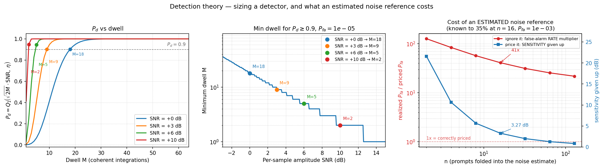

# Detection Theory Curves



## What you're seeing

**Left — Pd vs dwell M** at Pfa = 1e-5, for SNR = 0, 3, 6, 10 dB.
Curves shift left as SNR increases: more per-sample SNR trades
against coherent integration depth. Filled circles mark where each
curve first crosses Pd = 0.9 — M = 18, 9, 5, 2.

**Middle — minimum dwell for Pd ≥ 0.9 vs SNR** at fixed Pfa = 1e-5.
Every 3 dB of extra SNR roughly halves the required dwell: at 0 dB
you need 18 dwells for Pd = 0.9; at +6 dB you need only 5.

**Right — what an estimated noise reference costs.** The two panels
beside it price a statistic normalised by a *known* noise power. A
burst detector does not have one: it estimates the noise from the same
burst it is testing. That is not a flaw, it is what estimating means —
`σ̂² = ΣIm²/n` is `σ²·χ²(n)/n`, known to `√(2/n)`, which is 35 % at
n = 16 — and the only question worth asking is how much margin to
budget for it.

The panel shows the two places that uncertainty can land. Gate as
though the reference were exact and it lands in the **false-alarm
rate** (red, left axis): 41× the rate you priced at n = 16. Gate with
`det_threshold_f` and it lands in the **threshold** instead (blue,
right axis), which is detection sensitivity in dB — 3.27 dB at n = 16,
about 1 dB at n = 100, and 6.15 dB if the false-alarm budget is 1e-6
rather than 1e-3. The dB is the number a link budget can use; a rate
multiplier is not.

Both curves are the same `√(2/n)` seen from two sides, so doubling the
prompts folded into the reference roughly halves the dB. The full
budget table, indexed by how many samples you can spare, is in
[Detection Sizing](../design/detection.md) §4 and is regenerated by the
certification rather than written down.

## How it works

`det_pd`, `det_dwell`, and `det_threshold` implement the closed-form
Marcum Q functions. No simulation is needed to set a threshold or
predict performance:

```python
--8<-- "src/doppler/examples/detection_curves.py:theory"

--8<-- "src/doppler/examples/detection_curves.py:checks"
```

`det_threshold` inverts the Rayleigh CDF at `Pfa` to get the CFAR
gate `eta`. `det_dwell` binary-searches over M until
`det_pd(snr, M, eta) >= pd_target`.

```bash
python src/doppler/examples/detection_curves.py   # → detection_curves.png
```

See [Monte Carlo vs Marcum Q](detection-sim.md) for the 30,000-trial
validation of these closed-form curves against the envelope and power
detectors, [Detection Sizing](../design/detection.md) for why five
different laws ship under one `det_` prefix and what happens when they
are crossed, and the
[certification report](https://github.com/doppler-dsp/doppler/blob/main/src/doppler/detection/tests/validation/detection/results.md)
for the certified envelope these curves sit inside.
