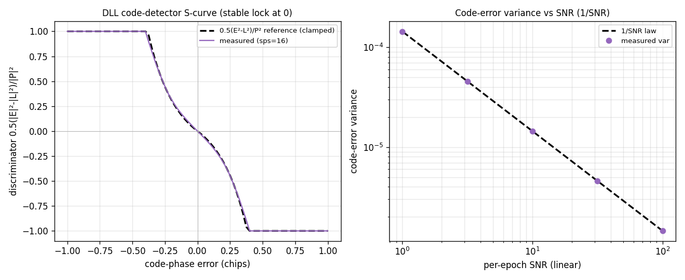

# DLL Code Loop — Theory Validation

A theoretical-correctness check on [`track.Dll`](../api/python-track.md)'s
prompt-normalized early-minus-late power code discriminator
`0.5·(|E|²-|L|²)/|P|²` (clamped to ±1).

**Left — Code-detector S-curve.** The open-loop discriminator (swept static
code-phase error, bn → 0) follows the reference built from the triangular code
autocorrelation `R(τ)=max(0,1-|τ|)`,
`clip(0.5·(R(τ+s)²-R(τ-s)²)/R(τ)², -1, 1)`: zero with a restoring (negative)
slope at the lock, and saturating at ±1 by the half-chip point. The
**fractional-boundary integrate-and-dump** overlap-weights the lone sample
straddling each chip transition, so the curve is **smooth and antisymmetric to
round-off at any `sps`** — no integer-sample code-phase staircase, giving the
loop true sub-chip resolution. (The only visible gap between measured and
reference is at the clamp knee, where the continuous triangular model departs
most from the discrete, fractional-boundary-weighted correlation.)

**Right — Code-error variance vs SNR.** At the lock the early-late discriminator
variance follows a clean **`1/SNR`** law (the per-epoch code-error noise) — the
measurements lie on the line across four decades of SNR.

This completes the three tracking loops' theory validation: the
[Costas carrier loop](costas-theory.md), the [Gardner timing loop](symsync-theory.md),
and the DLL code loop.

Source: `src/doppler/examples/dll_theory_demo.py`;
tests in `src/doppler/track/tests/test_theory_dll.py`.
