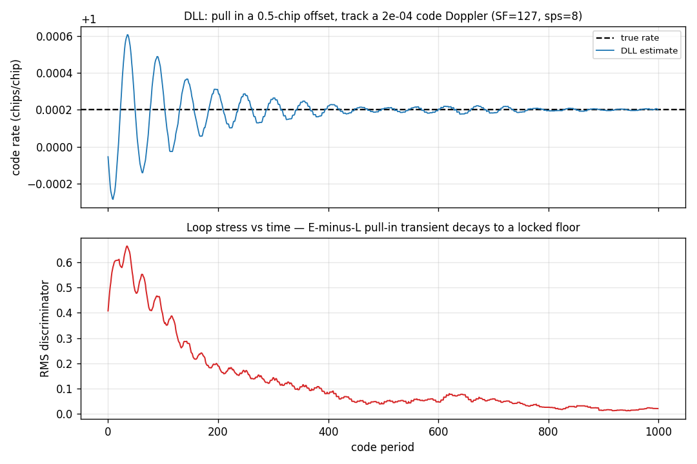

# Code Loop Tracking



A [`track.Dll`](../api/python-track.md) delay-lock loop tracking the **code
phase** of a continuous PN-spread BPSK signal. The replica starts a half-chip
off and the incoming chip clock runs slightly fast (a 2e-4 code Doppler); the
loop pulls its early/prompt/late replica onto the code and then holds it. Code
length SF = 127 chips, 8 samples/chip, on a carrier-wiped stream.

## What you're seeing

**Top — Code-rate tracking.** The loop's chip-rate estimate (blue) rings in with
the classic damped 2nd-order transient and settles exactly onto the true
incoming rate (black dashed) — the loop has matched the code Doppler, so its
replica neither leads nor lags.

**Bottom — Loop stress vs time.** The sliding-RMS of the non-coherent
early-minus-late discriminator `(|E| - |L|) / (|E| + |L|)` — the *stress* on the
code loop. The half-chip misalignment drives a large transient that decays to a
low locked floor as the replica aligns.

## How it works

`Dll` embeds the same [`track.LoopFilter`](../api/python-track.md) PI engine as
the carrier loop. Per sample it correlates the carrier-wiped input against three
taps of the local code — early (`+spacing` chips), prompt, late (`-spacing`
chips) — accumulating an integrate-and-dump over one code period. Per period it
forms the non-coherent envelope discriminator, filters it, and steers the code
rate (and a proportional phase nudge):

```python
--8<-- "src/doppler/examples/dll_demo.py:loop"
```

The discriminator works on **envelopes**, so it is insensitive to the BPSK data
riding on the code. The half-chip discriminator is steep, so the loop bandwidth
is kept small (a few thousandths of the code-period rate). `Dll` pairs with
[`track.Costas`](../gallery/costas.md): the carrier loop wipes the carrier, the
DLL wipes the code; a receiver channel composes the two.

Source: `src/doppler/examples/dll_demo.py`.
