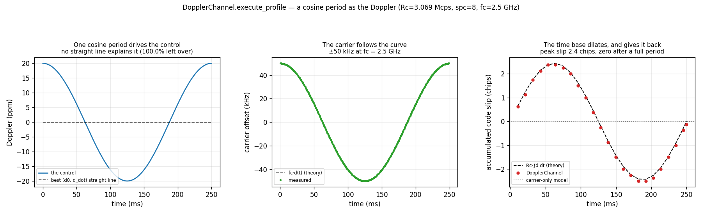

# Doppler Channel — a Doppler Profile Driven by a Cosine



[`DopplerChannel`](doppler-channel.md) takes its Doppler as a straight line,
`(doppler_ppm, doppler_rate_ppm_s)`. A real pass is not one: a satellite's
range rate swings from closing to opening and back, so the Doppler it imposes
is a *curve*. `execute_profile(x, ppm)` takes that curve as an array, one ppm
value per input sample, and applies it.

Here the control is **one full period of a cosine**,
`d(t) = 20 ppm · cos(2π t / 0.25 s)`. It is the simplest curve no `(d0, ḋ)` can
express, and it integrates in closed form, so everything the channel does is
checked against an exact answer rather than against a second implementation.

## What you're seeing

**Left — the control.** The cosine starts closing at +20 ppm, opens to −20 ppm
and comes back. The dashed line is the best `(d0, ḋ)` straight line through the
period: it is flat, and leaves **100.0%** of the curve unexplained. This is the
case the array form exists for.

**Centre — the carrier follows the curve.** At the 2.5 GHz carrier of
[the async DSSS receiver spec](../design/async-dsss-receiver.md), 20 ppm is
exactly ±50 kHz. The measured instantaneous offset sits on `fc·d(t)`: the peak
is 49 999.5 Hz against 50 000, and the worst difference over the whole period
is **1.4 Hz** (0.003% of the peak). What is left is the theory's argument: it is
evaluated at the receive time, while the profile is indexed by the input
(emission) clock, and the two differ by the excess delay, about 1e-5 relative.

**Right — the time base dilates, and gives it back.** This is the panel a
carrier-only model gets wrong: it would be flat on the dotted line. The code
slips by `Rc·∫d dt = Rc·(A/ω)·sin(ωt)`, peaking a quarter of a period in at **2.44
chips** in theory (2.50 as counted in whole samples) and returning to **zero**
when the period ends, because the integral
of a cosine over a whole period is zero. The trace is counted in whole samples
(`spc = 8`), so an eighth of a chip is its floor. The same closure shows up in
the stream's length: a full period is net-zero dilation, and the output is
6 138 001 samples for 6 138 000 in.

## What the example asserts

The script is gated by `make test-examples-python`, so each of these is checked
on every push, not just plotted:

- the stream fed in blocks is **bit-identical** to one call (the result must
    not depend on how it was chunked);
- the best straight line leaves more than 99% of the curve unexplained;
- the carrier offset is within 0.005% (2.5 Hz) of `fc·d(t)`;
- the code slip follows `Rc·∫d dt` to within two samples (a quarter chip);
- the stream is within two samples of its input length.

!!! note "A profile is absolute"

    The channel is created with no Doppler of its own and the array is the whole
    story: the create-time `doppler_ppm` and `doppler_rate_ppm_s` do not add to
    it. They cancel exactly, because the resampler's rate is `base + ctrl` and
    the kernel fills `ctrl = ratio(ppm[i]) − base` with the same `base`.

## How it works

The dilation is the resampler's per-sample rate control, fed one value per
input sample. The carrier is **not** integrated beside it: the excess delay at
output `k` is `(p_k − k + 1)/fs`, where `p_k` is the input position the
resampler's own accumulator reports for that output. That is why the stream
cannot depend on how it was chunked, and why the carrier cannot disagree with
the dilation. [The design page](../design/doppler-channel.md) has the
derivation, and the
[measurement record](../design/doppler-channel-measurements.md) has the first
attempt that mapped a profile index to an output index, and measured 2.75e-2 of
chunk dependence.

```python
--8<-- "src/doppler/examples/doppler_channel_profile_demo.py:profile"
```

## Reproduce

```sh
python -m doppler.examples.doppler_channel_profile_demo doppler_channel_profile_demo.png
```

Source: [`src/doppler/examples/doppler_channel_profile_demo.py`](https://github.com/doppler-dsp/doppler/blob/main/src/doppler/examples/doppler_channel_profile_demo.py)
