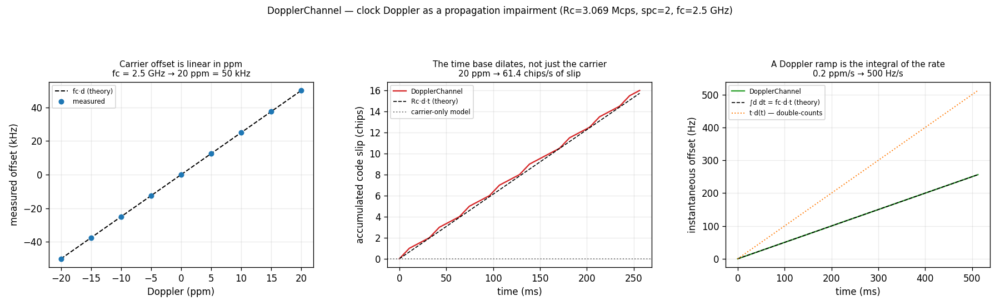

# Doppler Channel — Clock Doppler as a Propagation Impairment



A Doppler shift is not a frequency offset. Relative motion rescales the
**entire received time base**, so every clock in the signal changes together —
carrier, chip rate, symbol rate, frame rate. Modelling only the carrier is the
usual shortcut, and it silently deletes the one error a delay-lock loop exists
to track.

`impairment.DopplerChannel` applies both halves of the effect from a single
parameter, so they cannot disagree with each other.

## What you're seeing

**Left — the carrier offset is linear in ppm.** Doppler is specified in parts
per million of the nominal time base, which is what makes it
carrier-frequency agnostic. At the 2.5 GHz carrier of
`prototypes/async_despreader/SPEC.md`, that spec's ±50 kHz frequency
uncertainty is exactly **±20 ppm**. Measured FFT peaks sit on the `fc·d` line
across the sweep.

**Centre — the time base dilates.** This is the panel a carrier-only model gets
wrong: it would be flat on the dotted zero line. The real channel accumulates
code phase at `Rc·d` — **61.4 chips per second** at 20 ppm on a 3.069 Mcps
code. Over the 256 ms plotted, that is 16 chips the receiver's code loop has to
make up. The trace is quantised to half a chip because slip is counted in whole
samples at `spc=2`.

**Right — a Doppler ramp is the integral of the rate.** With
`doppler_rate_ppm_s = 0.2` (SPEC.md's 500 Hz/s at 2.5 GHz), the instantaneous
offset climbs as `fc·ḋ·t`. The dotted orange line is the natural wrong
implementation — accumulating `t·d(t)` instead of `∫d dt` double-counts the
ramp and lands at exactly twice the truth. It is the one error that passes every
static-Doppler check, which is why both the C and Python test suites assert
against it specifically.

## How it works

The dilation is a resampling of the whole stream at output/input ratio
`1/(1+d)`, which is what makes it apply to every clock at once rather than to
each one separately. It reuses `resample.Resampler`'s per-sample rate control
(`resamp_execute_ctrl`), whose double-precision accumulator tracks a Doppler
*ramp* exactly instead of approximating it with a piecewise-constant ratio
re-set once per block. No resampling math is reimplemented.

The carrier is then `exp(j·2π·fc·excess(t))`, where `excess(t) = ∫d dt` is the
same dilation integral the resampler ratio came from — one number, so the code
rate and the carrier can never drift apart.

!!! note "`carrier_hz` is load-bearing here, not metadata"

    Everywhere else in this codebase `--fc` is a SigMF annotation that never
    touches a sample. In `DopplerChannel` it is DSP input, and unavoidably so:
    Doppler is dimensionless ppm, and `fc` is the only thing that converts it
    into Hz. Setting it to `0` still dilates the clocks correctly but leaves the
    carrier stationary — permitted, because it is occasionally useful for
    isolating a code loop under test, but not what a real channel does.

What is deliberately **not** plotted: under a Doppler rate the code slips
quadratically, `Rc·½·ḋ·t²`. At SPEC.md's 0.2 ppm/s that is 0.08 chips over the
whole half-second run — a fraction of a single sample, below what sample
counting can resolve. The carrier effect of a ramp is first order and plainly
visible; the code effect is second order and, over a realistic dwell,
negligible.

```python
--8<-- "src/doppler/examples/doppler_channel_demo.py:channel"
```

## Reproduce

```sh
python -m doppler.examples.doppler_channel_demo doppler_channel_demo.png
```

Source: [`src/doppler/examples/doppler_channel_demo.py`](https://github.com/doppler-dsp/doppler/blob/main/src/doppler/examples/doppler_channel_demo.py)
